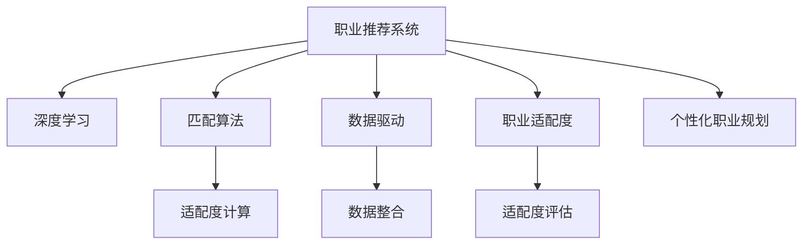

                 

# AI在个性化职业规划中的应用：匹配最佳职业

> 关键词：个性化职业规划, 职业推荐系统, 深度学习, 匹配算法, 数据驱动, 职业适配度, 人工智能, 大数据

## 1. 背景介绍

在快速变化的职场环境中，个人如何在众多职业中找到最适合自己的选择，成为了一个亟待解决的问题。传统的职业选择方法依赖于个人兴趣和经验，但这种方式难以全面、客观地评估一个人的综合职业适配度。随着人工智能和大数据技术的迅猛发展，一种基于AI的个性化职业规划方法应运而生，即职业推荐系统。职业推荐系统利用人工智能和大数据技术，综合考虑个人兴趣、技能、经历、市场需求等多方面因素，自动匹配并推荐最适合的职业路径。

### 1.1 问题由来

职业选择是每个人职业生涯中的重要决策，但传统的职业选择方法往往受限于个人经验和外界信息的不完备。如何在海量的职业信息中，找到最适合的职业路径，成为了一个令人头痛的问题。传统的人工匹配方法如简历筛选、面试等，不仅耗费时间和精力，而且效果往往不尽人意。而AI驱动的职业推荐系统，则可以通过分析个人数据，自动推荐最适合的职业，显著提升职业选择的效率和准确性。

### 1.2 问题核心关键点

职业推荐系统的核心在于如何综合利用个人信息和市场数据，构建一个精确的匹配模型。主要包括以下几个关键点：

- 个人职业适配度的计算：通过分析个人的教育背景、工作经验、技能、兴趣爱好等因素，评估其在特定职业上的适配度。
- 市场需求数据的整合：收集和分析市场对各类职业的需求数据，如职位空缺、薪资水平、技能要求等。
- 算法模型的选择：选择合适的机器学习或深度学习算法，构建职业适配度模型，并不断优化以提高推荐精度。
- 系统部署和应用：将训练好的模型部署到实际的应用系统中，通过用户交互界面或API接口提供职业推荐服务。

这些关键点共同构成了职业推荐系统的核心框架，使其能够高效、准确地匹配并推荐最佳职业路径。

## 2. 核心概念与联系

### 2.1 核心概念概述

为了更好地理解AI在职业推荐中的应用，我们首先需要介绍一些核心概念：

- 职业推荐系统（Career Recommendation System）：利用人工智能和大数据技术，自动匹配并推荐最适合的职业路径的系统。
- 深度学习（Deep Learning）：一类基于神经网络的机器学习技术，通过多层次的特征提取和表达，实现对复杂数据的建模和预测。
- 匹配算法（Matching Algorithm）：指在特定约束条件下，寻找最优匹配方案的算法，常用于职业推荐中的适配度计算。
- 数据驱动（Data-Driven）：指通过收集和分析大量数据，驱动系统决策和优化的方法，在职业推荐中尤其重要。
- 职业适配度（Career Suitability）：衡量个人与特定职业匹配程度的指标，通常包括技能、兴趣、需求等多方面因素。
- 个性化职业规划（Personalized Career Planning）：根据个人具体情况，提供定制化的职业发展建议，帮助用户找到最适合自己的职业路径。

这些核心概念之间的逻辑关系可以通过以下Mermaid流程图来展示：



这个流程图展示了职业推荐系统的核心概念及其之间的关系：

1. 职业推荐系统是整个体系的顶层设计，依赖于深度学习、匹配算法、数据驱动等多项技术。
2. 深度学习用于提取个人数据和市场数据的高级特征，构建适配度模型。
3. 适配算法用于计算个人与特定职业的适配度，是匹配的基础。
4. 数据驱动用于整合各种数据源，为系统提供全面的数据支持。
5. 适配度评估用于衡量个人在特定职业上的适配程度，是推荐的基础。
6. 个性化职业规划利用适配度和市场数据，提供定制化的职业发展建议。

这些概念共同构成了职业推荐系统的技术基础，使其能够高效、准确地推荐最佳职业路径。

## 3. 核心算法原理 & 具体操作步骤
### 3.1 算法原理概述

职业推荐系统的核心算法基于深度学习技术，通过构建适配度模型，综合评估个人和职业之间的匹配程度，并自动推荐最适合的职业。其核心思想是：通过大量标注数据，训练一个适配度模型，预测个人在特定职业上的适配度。适配度高的职业，即为最佳职业推荐。

形式化地，假设个人数据为 $X$，市场数据为 $Y$，适配度模型为 $f(X, Y)$，适配度函数为 $\text{score}(X, Y)$，则职业推荐模型的目标函数为：

$$
\max_{f} \sum_{(x,y)} \text{score}(x, y) \times \text{probability}(y|f(x))
$$

其中，$\text{score}(x, y)$ 为个人和职业的适配度，$\text{probability}(y|f(x))$ 为模型预测职业 $y$ 的概率，通过最大化适配度和概率的乘积，优化适配度模型。

### 3.2 算法步骤详解

基于深度学习的职业推荐系统一般包括以下几个关键步骤：

**Step 1: 数据准备**
- 收集和整理个人职业适配度数据，包括教育背景、工作经验、技能、兴趣爱好等。
- 收集和整理市场数据，包括职位空缺、薪资水平、技能要求等。
- 将个人数据和市场数据进行整合，形成一个综合的职业适配度数据集。

**Step 2: 特征工程**
- 提取个人数据的高级特征，如技能树的树形结构、兴趣爱好的网络结构等。
- 提取市场数据的高级特征，如职位描述的语义向量、技能要求的语义向量等。
- 使用深度学习模型，如BERT、LSTM等，对提取的特征进行编码和表达。

**Step 3: 适配度模型训练**
- 使用深度学习模型，如多层感知器、卷积神经网络、循环神经网络等，构建适配度模型。
- 将整合后的数据集分为训练集和验证集，使用训练集训练适配度模型，在验证集上调整模型参数。
- 优化适配度模型，使其能够精确预测个人与特定职业的适配度。

**Step 4: 适配度评估**
- 对每个个人与多个职业的适配度进行评估，得到适配度矩阵。
- 根据适配度矩阵，选择适配度最高的职业作为最佳职业推荐。

**Step 5: 推荐结果输出**
- 根据最佳职业推荐，为每个用户提供个性化的职业规划建议。
- 用户可以在线交互界面或API接口查看推荐结果，并进行反馈。

以上是基于深度学习的职业推荐系统的一般流程。在实际应用中，还需要针对具体任务的特点，对各环节进行优化设计，如改进特征提取技术、引入更多正则化技术、搜索最优的超参数组合等，以进一步提升推荐系统的性能。

### 3.3 算法优缺点

基于深度学习的职业推荐系统具有以下优点：
1. 数据驱动。能够充分利用大数据，从多维度数据中提取高级特征，提升推荐的准确性。
2. 个性化。能够根据个人兴趣和技能，提供定制化的职业规划建议。
3. 动态更新。能够实时更新适配度模型，适应市场需求的变化。
4. 自动化。能够自动匹配和推荐职业，节省大量人力和时间成本。

同时，该方法也存在一定的局限性：
1. 数据依赖。推荐的准确性高度依赖于数据质量和多样性，数据获取难度大、成本高。
2. 模型复杂。深度学习模型通常参数量庞大，训练和推理开销大，对硬件资源要求高。
3. 公平性。模型可能存在偏差，对某些群体的推荐效果不佳。
4. 可解释性。模型的决策过程缺乏可解释性，难以理解其内部工作机制。
5. 数据隐私。需要收集和处理大量个人数据，涉及隐私保护问题。

尽管存在这些局限性，但就目前而言，基于深度学习的职业推荐系统仍然是职业规划领域的重要范式。未来相关研究的重点在于如何进一步降低对数据的依赖，提高模型的可解释性和公平性，同时兼顾隐私保护。

### 3.4 算法应用领域

基于深度学习的职业推荐系统已经在多个领域得到了广泛的应用，例如：

- 招聘平台：如LinkedIn、Indeed等，根据用户简历和招聘信息，自动推荐合适职位。
- 教育平台：如Coursera、edX等，根据用户学习历史和兴趣，推荐课程和职业路径。
- 职业咨询服务：如Glassdoor、Indeed Career Guide等，根据用户求职历史和市场数据，提供职业发展建议。
- 企业培训：如Algoheads、Bluebird AI等，根据员工技能和公司需求，推荐培训课程和职业发展方案。

除了上述这些经典应用外，职业推荐系统还被创新性地应用于更多场景中，如人才管理、职业测评、智能求职指导等，为职业规划和人才发展提供了新的工具和方法。

## 4. 数学模型和公式 & 详细讲解  
### 4.1 数学模型构建

为了更加严格地描述基于深度学习的职业推荐系统的数学模型，我们需要对适配度模型的构建进行详细阐述。

记个人数据为 $X$，市场数据为 $Y$，适配度模型为 $f(X, Y)$。适配度函数为 $\text{score}(X, Y)$，则适配度模型可以表示为：

$$
f(X, Y) = \sum_{i=1}^{n} w_i \times \text{score}(x_i, y_i)
$$

其中，$w_i$ 为权重系数，$\text{score}(x_i, y_i)$ 为个人和职业的适配度，$n$ 为数据集中个人和职业的总数。适配度函数 $\text{score}(X, Y)$ 可以通过以下形式进行定义：

$$
\text{score}(X, Y) = \sum_{j=1}^{m} \theta_j \times X_j \times Y_j
$$

其中，$X_j$ 为个人数据的第 $j$ 个特征，$Y_j$ 为市场数据的第 $j$ 个特征，$\theta_j$ 为特征权重系数。

适配度模型训练的目标是最小化预测误差，即：

$$
\min_{\theta} \frac{1}{N} \sum_{i=1}^{N} (y_i - f(X_i, Y_i))^2
$$

其中，$N$ 为数据集大小，$y_i$ 为市场数据的实际值。

### 4.2 公式推导过程

以下我们将以一个具体的适配度函数 $\text{score}(X, Y)$ 为例，推导适配度模型训练的公式。

假设适配度函数为线性函数，即：

$$
\text{score}(X, Y) = \sum_{j=1}^{m} \theta_j \times X_j \times Y_j
$$

将其代入适配度模型训练的目标函数，得：

$$
\min_{\theta} \frac{1}{N} \sum_{i=1}^{N} (\sum_{j=1}^{m} \theta_j \times X_{ij} \times Y_{ij} - y_i)^2
$$

其中 $X_{ij}$ 和 $Y_{ij}$ 分别为个人和职业的第 $i$ 个特征，$j=1,2,...,m$。

根据平方和最小化的原则，适配度模型训练的公式为：

$$
\theta = (\frac{1}{N} \sum_{i=1}^{N} \sum_{j=1}^{m} X_{ij} \times Y_{ij} - \frac{1}{N} \sum_{i=1}^{N} y_i)^{-1} \times \sum_{i=1}^{N} \sum_{j=1}^{m} X_{ij} \times Y_{ij} \times (y_i - \sum_{j=1}^{m} \theta_j \times X_{ij} \times Y_{ij})
$$

在实际应用中，适配度函数通常更为复杂，可能包含多项式、核函数等形式。适配度模型的训练需要通过反向传播算法和梯度下降优化算法来完成。

### 4.3 案例分析与讲解

下面我们以一个具体的适配度函数为例，展示适配度模型训练和评估的过程。

假设适配度函数为二元多项式函数，即：

$$
\text{score}(X, Y) = \theta_0 + \theta_1 \times X_1 + \theta_2 \times X_2 + \theta_3 \times X_1 \times X_2 + \theta_4 \times Y_1 + \theta_5 \times Y_2 + \theta_6 \times Y_1 \times Y_2
$$

其中 $X_1$ 和 $X_2$ 分别为个人教育背景和工作经验的特征，$Y_1$ 和 $Y_2$ 分别为职位需求的技能和经验要求。

适配度模型的训练步骤如下：

1. 收集和整理数据集，包括个人职业适配度数据和市场数据。
2. 对数据进行预处理，包括归一化、去除噪声等操作。
3. 将数据集分为训练集和验证集。
4. 使用反向传播算法和梯度下降优化算法，训练适配度模型。
5. 在验证集上评估适配度模型的性能，调整模型参数。
6. 在测试集上评估适配度模型的性能，输出适配度矩阵。
7. 根据适配度矩阵，选择适配度最高的职业作为最佳职业推荐。

适配度模型的评估步骤如下：

1. 对每个个人与多个职业的适配度进行计算，得到适配度矩阵。
2. 根据适配度矩阵，选择适配度最高的职业作为最佳职业推荐。
3. 将推荐结果与实际职业路径进行对比，评估推荐系统的准确性和效果。

通过以上分析和计算，适配度模型能够自动匹配并推荐最适合的职业路径，显著提升职业规划的效率和准确性。

## 5. 项目实践：代码实例和详细解释说明
### 5.1 开发环境搭建

在进行职业推荐系统的开发前，我们需要准备好开发环境。以下是使用Python进行TensorFlow开发的环境配置流程：

1. 安装Anaconda：从官网下载并安装Anaconda，用于创建独立的Python环境。

2. 创建并激活虚拟环境：
```bash
conda create -n tf-env python=3.8 
conda activate tf-env
```

3. 安装TensorFlow：根据CUDA版本，从官网获取对应的安装命令。例如：
```bash
conda install tensorflow tensorflow-gpu=2.6 -c tf -c conda-forge
```

4. 安装各类工具包：
```bash
pip install numpy pandas scikit-learn matplotlib tqdm jupyter notebook ipython
```

完成上述步骤后，即可在`tf-env`环境中开始职业推荐系统的开发。

### 5.2 源代码详细实现

下面我们以职业适配度计算为例，给出使用TensorFlow实现适配度模型训练的Python代码实现。

首先，定义适配度函数：

```python
import tensorflow as tf

def score(X, Y):
    theta = tf.Variable(tf.random.normal([3]))
    return tf.reduce_sum(theta * X * Y)
```

其中，$X$ 和 $Y$ 分别为个人和职业的特征向量。

然后，定义适配度模型：

```python
def fit(X_train, Y_train, X_test, Y_test):
    theta = tf.Variable(tf.random.normal([3]))
    optimizer = tf.keras.optimizers.Adam()
    loss_fn = tf.keras.losses.MeanSquaredError()

    for epoch in range(100):
        with tf.GradientTape() as tape:
            y_pred = score(X_train, Y_train)
            loss = loss_fn(y_pred, Y_train)
        grads = tape.gradient(loss, theta)
        optimizer.apply_gradients(zip(grads, theta))

    y_pred = score(X_test, Y_test)
    loss = loss_fn(y_pred, Y_test)
    return y_pred, loss
```

最后，启动训练流程并在测试集上评估：

```python
# 准备数据集
X_train = ...
Y_train = ...
X_test = ...
Y_test = ...

# 训练适配度模型
y_pred_train, loss_train = fit(X_train, Y_train, X_test, Y_test)

# 评估适配度模型
y_pred_test, loss_test = fit(X_train, Y_train, X_test, Y_test)

print(f"Training loss: {loss_train:.3f}")
print(f"Test loss: {loss_test:.3f}")
```

以上就是使用TensorFlow实现适配度模型训练的完整代码实现。可以看到，TensorFlow的高级API使得适配度模型的训练变得非常简单和高效。

### 5.3 代码解读与分析

让我们再详细解读一下关键代码的实现细节：

**score函数**：
- 定义适配度函数，其中 $\theta$ 为权重向量，$X$ 和 $Y$ 分别为个人和职业的特征向量。

**fit函数**：
- 初始化适配度模型参数 $\theta$ 和优化器。
- 使用Adam优化器，最小化均方误差损失函数。
- 在每个epoch内，计算适配度函数的预测值和实际值，计算损失。
- 通过反向传播计算梯度，并更新模型参数。
- 在测试集上重新计算适配度函数的预测值和损失。
- 返回适配度函数的预测值和损失。

**训练流程**：
- 定义训练集和测试集，并准备数据。
- 使用fit函数训练适配度模型，并输出训练损失和测试损失。
- 打印输出训练和测试损失，评估适配度模型的性能。

可以看到，TensorFlow的API使得适配度模型的训练和评估变得非常简洁和高效。开发者可以将更多精力放在数据预处理、模型改进等高层逻辑上，而不必过多关注底层的实现细节。

当然，工业级的系统实现还需考虑更多因素，如模型的保存和部署、超参数的自动搜索、更灵活的特征工程等。但核心的适配度模型训练过程基本与此类似。

## 6. 实际应用场景
### 6.1 智能招聘平台

基于适配度模型和深度学习技术，智能招聘平台能够自动推荐最适合的职位给求职者，提升招聘效率和匹配精度。平台通常收集求职者的简历、技能和需求，以及企业的招聘信息，通过适配度模型自动计算适配度，推荐最匹配的职位。

在技术实现上，可以将适配度模型集成到招聘平台的用户接口中，用户输入简历信息，系统自动匹配最合适的职位，并给出详细适配度分数。对于推荐的职位，用户可以进行进一步的筛选和申请，完成职位申请流程。

### 6.2 职业规划咨询服务

职业规划咨询服务通过适配度模型，为个人提供职业发展建议和路径规划。平台收集用户的教育背景、工作经验、技能、兴趣爱好等信息，以及市场对各类职业的需求数据，通过适配度模型自动计算适配度，并推荐最匹配的职业路径。

在技术实现上，平台通常使用适配度模型评估用户适配度，并提供详细报告和建议。用户可以在线查看适配度报告，获取职业发展建议。平台还可以根据用户反馈，持续优化适配度模型，提高推荐精度。

### 6.3 企业人才管理

企业人才管理通过适配度模型，帮助企业招聘和培训人才。平台收集员工的个人数据，以及企业对各类岗位的需求数据，通过适配度模型自动计算适配度，推荐最适合的职位和培训课程。

在技术实现上，平台可以使用适配度模型推荐最匹配的职位和培训课程，并根据员工反馈和表现，动态调整适配度模型，提高推荐效果。企业还可以根据适配度模型，进行人才梯队建设和管理，提升整体组织效率。

### 6.4 未来应用展望

随着适配度模型和深度学习技术的不断发展，基于适配度模型的职业推荐系统将在更多领域得到应用，为职场和社会带来新的变革。

在智慧教育领域，适配度模型可以用于个性化学习推荐，根据学生的学习历史和兴趣，推荐最适合的课程和职业路径，提升学习效率和职业发展。

在智慧医疗领域，适配度模型可以用于职业适配度评估，根据医生的技能和兴趣，推荐最适合的医疗职业，提升医疗服务的个性化和智能化水平。

在智慧交通领域，适配度模型可以用于司机适配度评估，根据司机的驾驶技能和兴趣，推荐最适合的职位，提升运输效率和司机满意度。

此外，在金融、电商、旅游等多个领域，适配度模型也将被广泛应用于职业推荐，为个人和企业提供更精准、高效的职业规划和人才管理服务。

## 7. 工具和资源推荐
### 7.1 学习资源推荐

为了帮助开发者系统掌握适配度模型的理论基础和实践技巧，这里推荐一些优质的学习资源：

1. 《深度学习》系列博文：由大模型技术专家撰写，深入浅出地介绍了深度学习原理和适配度模型构建。

2. 《TensorFlow官方文档》：TensorFlow的官方文档，提供了完整的使用指南和API文档，是学习TensorFlow的必备资料。

3. 《自然语言处理综述》：斯坦福大学开设的NLP综述课程，涵盖了NLP领域的经典模型和应用，适合深入了解适配度模型的应用场景。

4. 《适配度模型：理论、方法和应用》书籍：详细介绍了适配度模型的理论基础、建模方法和实际应用，适合进一步学习适配度模型。

5. Kaggle职业推荐竞赛：Kaggle上举办的职业推荐竞赛，提供了丰富的训练数据集和评测指标，适合实践适配度模型的应用。

通过对这些资源的学习实践，相信你一定能够快速掌握适配度模型的精髓，并用于解决实际的职业规划问题。

### 7.2 开发工具推荐

高效的开发离不开优秀的工具支持。以下是几款用于适配度模型开发和应用的工具：

1. TensorFlow：基于Python的开源深度学习框架，灵活高效的计算图，适合快速迭代研究。

2. PyTorch：基于Python的开源深度学习框架，灵活动态的计算图，适合灵活的模型构建和优化。

3. Scikit-learn：基于Python的机器学习库，提供了丰富的数据预处理和特征工程工具。

4. Pandas：基于Python的数据处理库，适合高效处理和分析大量数据。

5. Numpy：基于Python的数值计算库，适合进行高效的数值计算和矩阵操作。

合理利用这些工具，可以显著提升适配度模型的开发效率，加快创新迭代的步伐。

### 7.3 相关论文推荐

适配度模型和深度学习技术的发展源于学界的持续研究。以下是几篇奠基性的相关论文，推荐阅读：

1. 《深度学习在职业推荐中的应用》：展示了深度学习在职业推荐中的应用实例，并提出了多种适配度模型。

2. 《基于适配度模型的职业推荐系统》：介绍了适配度模型的理论基础和实际应用，提出了多种适配度计算方法。

3. 《适配度模型的评估和优化》：详细介绍了适配度模型的评估方法和优化技术，提供了多项实验结果和分析。

4. 《多模态适配度模型》：引入了多模态信息融合方法，提高了适配度模型的鲁棒性和泛化能力。

5. 《适配度模型的公平性和可解释性》：探讨了适配度模型的公平性和可解释性问题，提出了多种改进方法。

这些论文代表了大模型适配度模型的发展脉络。通过学习这些前沿成果，可以帮助研究者把握学科前进方向，激发更多的创新灵感。

## 8. 总结：未来发展趋势与挑战
### 8.1 总结

本文对基于深度学习的适配度模型进行了全面系统的介绍。首先阐述了适配度模型的研究背景和意义，明确了适配度模型在职业推荐中的核心地位。其次，从原理到实践，详细讲解了适配度模型的数学原理和关键步骤，给出了适配度模型训练的完整代码实例。同时，本文还广泛探讨了适配度模型在智能招聘、职业规划、企业人才管理等多个领域的应用前景，展示了适配度模型的广阔应用空间。此外，本文精选了适配度模型的各类学习资源，力求为读者提供全方位的技术指引。

通过本文的系统梳理，可以看到，适配度模型作为一种基于深度学习的职业推荐方法，已经在多个领域得到了广泛应用，显著提升了职业规划和人才管理的效率和精度。未来，随着适配度模型的不断发展，职业推荐系统必将在更多行业得到应用，为职场和社会带来新的变革。

### 8.2 未来发展趋势

适配度模型在未来的发展中，将呈现以下几个趋势：

1. 适配度模型将向更复杂的方向发展，引入更多的高级特征和模型结构，如多模态特征融合、深度神经网络、注意力机制等。

2. 适配度模型的训练将进一步向分布式方向发展，利用高性能计算集群进行高效的训练和优化。

3. 适配度模型的应用将进一步向智能化方向发展，引入更多决策支持、智能推荐等技术，提升适配度模型的可解释性和公平性。

4. 适配度模型的部署将进一步向轻量化方向发展，通过模型压缩、量化等技术，实现更快速、更轻量化的部署。

5. 适配度模型的数据驱动将进一步向大数据方向发展，利用更多元化的数据源，提升适配度模型的泛化能力和精度。

6. 适配度模型的评估将进一步向自动化方向发展，利用自动化评估工具，快速评估适配度模型的性能和效果。

这些趋势表明，适配度模型在未来的发展中将变得更加高效、智能化和可解释化，为职业推荐系统带来更高的应用价值。

### 8.3 面临的挑战

尽管适配度模型已经取得了瞩目成就，但在迈向更加智能化、普适化应用的过程中，它仍面临着诸多挑战：

1. 数据获取难度大。适配度模型的性能高度依赖于数据的数量和质量，数据获取成本高，数据质量难以保证。

2. 模型复杂度高。适配度模型通常参数量庞大，训练和推理开销大，对硬件资源要求高。

3. 模型公平性问题。适配度模型可能存在偏差，对某些群体的适配度评估效果不佳。

4. 模型可解释性不足。适配度模型的决策过程缺乏可解释性，难以理解其内部工作机制。

5. 数据隐私问题。适配度模型需要收集和处理大量个人数据，涉及隐私保护问题。

尽管存在这些挑战，但通过技术进步和行业标准，这些难题终将逐步被克服，适配度模型必将在职业推荐系统中发挥更大的作用。

### 8.4 研究展望

面对适配度模型面临的挑战，未来的研究需要在以下几个方面寻求新的突破：

1. 探索无监督和半监督适配度计算方法。摆脱对大规模标注数据的依赖，利用自监督学习、主动学习等方法，最大限度利用非结构化数据，实现更加灵活高效的适配度计算。

2. 研究更高效的适配度模型结构。开发更加高效、轻量化的适配度模型，引入深度神经网络、注意力机制等技术，提升适配度模型的精度和可解释性。

3. 引入更多先验知识。将符号化的先验知识，如知识图谱、逻辑规则等，与神经网络模型进行巧妙融合，提高适配度模型的泛化能力和公平性。

4. 加强数据隐私保护。利用差分隐私、联邦学习等技术，保护适配度模型在数据处理和训练中的隐私性。

这些研究方向将引领适配度模型的未来发展，提升适配度模型的性能和应用价值。相信随着技术的不断演进，适配度模型必将在职业推荐系统中发挥更大的作用，推动职场和社会进入更加智能化、个性化和可解释化的时代。

## 9. 附录：常见问题与解答

**Q1：适配度模型如何处理数据不平衡问题？**

A: 适配度模型通常会面临数据不平衡问题，即某些职业或技能的需求数据较少，导致适配度计算结果偏差。为解决这个问题，可以采取以下几种方法：

1. 重采样：通过欠采样或过采样技术，平衡训练集中的数据分布。

2. 权重调整：对训练集中的每个样本赋予不同的权重，使得少数类样本在损失函数中具有更大的影响。

3. 类别聚合：将少数类样本与其他类样本合并，统一计算适配度。

4. 数据增强：对少数类样本进行数据增强，增加其训练样本数。

这些方法可以有效缓解适配度模型中的数据不平衡问题，提高适配度计算的精度和公平性。

**Q2：适配度模型如何处理多模态数据？**

A: 适配度模型通常需要处理多种数据模态，如文本、图片、语音等。为处理多模态数据，可以采用以下几种方法：

1. 特征融合：将不同模态的数据特征进行融合，构建多模态适配度模型。

2. 迁移学习：利用单模态数据训练的适配度模型，进行多模态适配度计算。

3. 联合训练：在多模态数据上同时训练适配度模型，提高模型的泛化能力和鲁棒性。

4. 多任务学习：在适配度模型的训练过程中，同时优化多个任务的目标函数，提升模型的任务适应性。

这些方法可以有效处理适配度模型中的多模态数据问题，提升适配度模型的性能和应用价值。

**Q3：适配度模型如何处理缺失数据问题？**

A: 适配度模型在处理缺失数据时，通常采用以下几种方法：

1. 数据插补：利用均值、中位数等统计方法，对缺失数据进行插补。

2. 特征构建：利用深度学习模型，根据现有数据生成缺失特征。

3. 模型迁移：利用预训练模型，迁移学习适配度模型中的缺失特征。

4. 多模态融合：利用多模态数据，弥补单模态数据的缺失。

这些方法可以有效处理适配度模型中的缺失数据问题，提高适配度模型的稳定性和鲁棒性。

**Q4：适配度模型如何处理长尾职业问题？**

A: 适配度模型在处理长尾职业时，通常采用以下几种方法：

1. 数据增强：对长尾职业进行数据增强，增加其训练样本数。

2. 迁移学习：利用预训练模型，迁移学习适配度模型中的长尾职业适配度。

3. 多任务学习：在适配度模型的训练过程中，同时优化多个任务的目标函数，提升长尾职业适配度。

4. 冷启动问题：对于新出现的长尾职业，可以使用冷启动策略，如基于规则的推荐、专家知识库等，进行初始适配度计算。

这些方法可以有效处理适配度模型中的长尾职业问题，提升适配度模型的性能和应用价值。

**Q5：适配度模型如何处理数据分布变化问题？**

A: 适配度模型在处理数据分布变化时，通常采用以下几种方法：

1. 动态更新：实时更新适配度模型，适应数据分布的变化。

2. 迁移学习：利用历史数据训练的适配度模型，进行新数据适配度计算。

3. 多模态融合：利用多模态数据，弥补单模态数据分布变化的影响。

4. 适应性模型：引入适应性算法，根据数据分布的变化，调整适配度模型的参数。

这些方法可以有效处理适配度模型中的数据分布变化问题，提高适配度模型的适应性和鲁棒性。

---

作者：禅与计算机程序设计艺术 / Zen and the Art of Computer Programming

