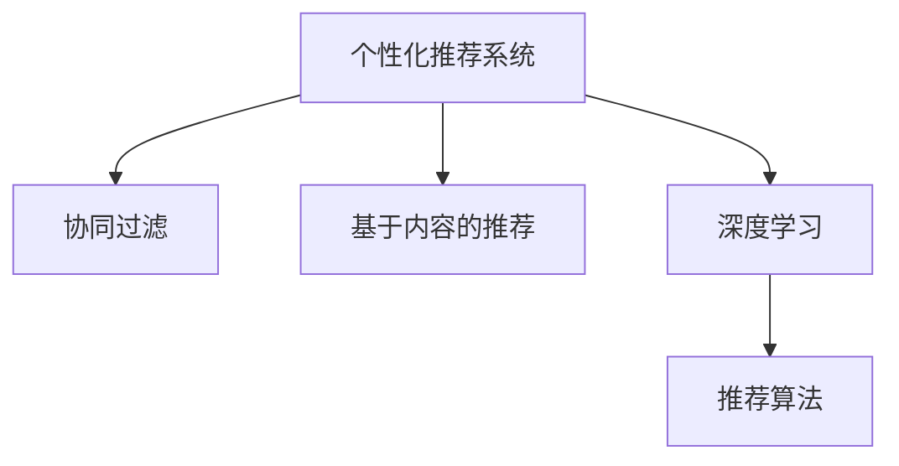

                 

# AI在个性化音乐推荐中的应用：发现新音乐

> 关键词：
- 个性化音乐推荐
- 协同过滤
- 基于内容的推荐
- 深度学习
- 推荐算法
- 推荐系统
- 音乐推荐引擎

## 1. 背景介绍

### 1.1 问题由来
在互联网时代，音乐成为了一种重要的娱乐方式。海量的音乐资源为人们带来了前所未有的便利，但也带来了“信息过载”的问题。如何从亿万首音乐中，快速准确地找到用户感兴趣的音乐，成为摆在各大音乐平台面前的一大难题。个性化音乐推荐系统，通过分析用户的历史行为数据，预测用户可能喜欢的音乐，大大提高了用户体验和音乐平台的用户留存率。

个性化音乐推荐系统已经广泛应用于Spotify、QQ音乐、网易云音乐等主流音乐平台。但传统的推荐系统往往依赖于用户的显式反馈，即通过点击、收藏、分享等行为进行推荐，难以覆盖到用户未明显表达的潜在喜好。随着AI技术的发展，越来越多的音乐平台开始采用基于深度学习的推荐系统，通过多维度数据分析，精准预测用户对音乐的偏好，为用户提供更加个性化、多样化的音乐推荐。

### 1.2 问题核心关键点
个性化音乐推荐系统的核心目标是：
- 准确预测用户对音乐的兴趣
- 最大化用户满意度
- 提升音乐平台的用户留存率和收益

系统主要通过以下几个关键点实现：
- 数据收集与预处理：收集用户历史行为数据，包括点击、播放、收藏等行为，以及用户的人口统计特征、兴趣标签等。
- 特征工程：构建用户、歌曲、音乐风格等维度的特征，包括文本特征、音频特征、时间特征等。
- 模型训练与优化：选择适当的推荐算法，如协同过滤、基于内容的推荐、深度学习等，并利用用户反馈数据对模型进行训练和调优。
- 推荐排序与展示：根据推荐模型输出，对音乐进行排序，并推荐给用户。同时优化推荐界面和用户体验，提高用户点击和停留时间。

## 2. 核心概念与联系

### 2.1 核心概念概述

为了更好地理解个性化音乐推荐系统，本节将介绍几个关键概念及其相互关系：

- **个性化推荐系统**：基于用户历史行为数据，通过算法预测用户可能感兴趣的物品，并提供个性化推荐的一种系统。
- **协同过滤**：利用用户间的相似性，通过寻找与目标用户兴趣相似的其他用户，推断目标用户可能喜欢的物品。
- **基于内容的推荐**：通过分析物品的特征，匹配目标用户的历史偏好，推荐相似物品。
- **深度学习**：一种人工神经网络的架构，通过多层次特征提取，提升预测精度和泛化能力。
- **推荐算法**：用于预测用户对物品的兴趣，并根据预测结果进行推荐的技术。

这些概念之间的逻辑关系可以通过以下Mermaid流程图来展示：



这个流程图展示了个性化音乐推荐系统的核心组件及其相互关系：

1. 个性化推荐系统通过协同过滤、基于内容的推荐、深度学习等算法，从多维度对用户兴趣进行建模。
2. 协同过滤和基于内容的推荐主要依赖用户行为数据和物品特征，通过用户相似性和物品相似性进行推荐。
3. 深度学习通过多层次的特征提取，学习更复杂的用户兴趣表示，提升推荐的精准度。
4. 推荐算法通过融合多种算法模型，预测用户对音乐物品的兴趣，并根据兴趣度进行排序推荐。

## 3. 核心算法原理 & 具体操作步骤
### 3.1 算法原理概述

个性化音乐推荐系统主要包括协同过滤、基于内容的推荐和深度学习三大类算法。

- **协同过滤**：基于用户行为数据的相似性进行推荐，包括基于用户的协同过滤和基于物品的协同过滤。
- **基于内容的推荐**：通过分析音乐物品的特征，如歌词、曲风、歌手等，推断用户可能喜欢的歌曲。
- **深度学习**：通过多层神经网络，从用户行为数据中学习更丰富的用户兴趣表示，提升推荐效果。

具体而言，协同过滤和基于内容的推荐属于基于规则的推荐算法，能够快速实现但容易过拟合数据；深度学习属于基于模型的推荐算法，能够更好地利用用户行为数据，但需要大量计算资源和数据。实际应用中，往往需要根据具体情况，选择适当的推荐算法进行组合。

### 3.2 算法步骤详解

以深度学习在音乐推荐中的应用为例，介绍基于深度学习的推荐系统构建步骤。

**Step 1: 数据收集与预处理**
- 收集用户历史行为数据，包括点击、播放、收藏等行为，以及用户的人口统计特征、兴趣标签等。
- 收集音乐物品特征，如歌词、曲风、演唱者、专辑等。
- 对数据进行清洗、去重、归一化等预处理操作，保证数据质量。

**Step 2: 特征工程**
- 根据业务需求，选择并构建合适的特征，如用户ID、歌曲ID、播放时长、收藏次数、听过的风格等。
- 对文本特征进行编码，如TF-IDF、Word2Vec等。
- 对音频特征进行提取，如MFCC、Mel-Spectrogram等。
- 设计特征的维度、权重、组合方式，提升特征表示能力。

**Step 3: 模型训练与优化**
- 选择合适的深度学习架构，如CNN、RNN、LSTM等。
- 构建损失函数，如均方误差、交叉熵等，用于衡量模型预测与真实标签之间的差异。
- 设计优化器，如SGD、Adam等，并设置学习率、批大小等参数。
- 划分训练集、验证集和测试集，进行模型训练、调优和测试。

**Step 4: 推荐排序与展示**
- 根据模型输出，对音乐进行排序，并根据用户兴趣进行推荐。
- 对推荐结果进行展示，优化推荐界面和用户体验，提高用户点击和停留时间。
- 实时更新推荐模型和用户行为数据，不断提升推荐效果。

### 3.3 算法优缺点

基于深度学习的个性化音乐推荐系统具有以下优点：
- 精准度较高：深度学习能够从海量数据中学习到复杂的用户兴趣表示，提升推荐精度。
- 泛化能力较强：深度学习模型能够适应不同用户和音乐物品的复杂特征，具有较强的泛化能力。
- 可扩展性强：深度学习模型能够灵活组合，适应不同类型的音乐推荐场景。

但深度学习也存在一些缺点：
- 计算资源需求高：深度学习模型需要大量的计算资源和时间进行训练和优化，不适合实时推荐。
- 数据需求量大：深度学习模型需要大量标注数据进行训练，数据量不足时难以获得理想效果。
- 模型复杂度高：深度学习模型结构复杂，难以解释和调试。

## 4. 数学模型和公式 & 详细讲解 & 举例说明
### 4.1 数学模型构建

以基于深度学习的音乐推荐系统为例，构建推荐模型的数学模型。

设用户 $u$ 对音乐 $i$ 的评分 $r_{ui}$ 为 1-5 之间的整数，$R$ 为 $N \times M$ 的评分矩阵，其中 $N$ 为用户数量，$M$ 为音乐数量。推荐模型通过神经网络对用户兴趣和音乐特征进行建模，输出 $u$ 对 $i$ 的兴趣度 $p_{ui}$。

推荐模型的目标是最小化预测误差，即：
$$
\min_{\theta} \sum_{(u,i) \in R} \mathcal{L}(p_{ui},r_{ui})
$$
其中 $\mathcal{L}$ 为损失函数，$L$ 为交叉熵损失函数：
$$
\mathcal{L}(p_{ui},r_{ui}) = -(r_{ui} \log p_{ui} + (1-r_{ui}) \log (1-p_{ui}))
$$

### 4.2 公式推导过程

假设音乐推荐模型为多层神经网络，包括输入层、多个隐藏层和输出层。设输入层特征为 $X$，输出层为 $P$，隐藏层为 $H_1, H_2, ..., H_k$。网络参数为 $\theta = \{\omega_1, \omega_2, ..., \omega_k, \omega_{out}\}$，其中 $\omega_i$ 为隐藏层权重，$\omega_{out}$ 为输出层权重。

推荐模型的输出为：
$$
P = f_{out}(W_{out}f_{k-1}(W_{k-1}...f_1(W_1X + b_1) + b_2) + b_k)
$$
其中 $f_i$ 为激活函数，如ReLU、Sigmoid等，$W_i$ 和 $b_i$ 分别为隐藏层和输出层的权重和偏置。

将上述公式带入损失函数，得到：
$$
\mathcal{L} = -\sum_{(u,i) \in R} (r_{ui} \log p_{ui} + (1-r_{ui}) \log (1-p_{ui}))
$$

通过反向传播算法，计算梯度并更新模型参数 $\theta$，最小化损失函数 $\mathcal{L}$，即可得到推荐模型。

### 4.3 案例分析与讲解

假设某用户 $u$ 对音乐 $i$ 的评分 $r_{ui}$ 为 4，通过推荐模型得到预测兴趣度 $p_{ui}=0.6$。根据交叉熵损失函数：
$$
\mathcal{L}(p_{ui},r_{ui}) = -(r_{ui} \log p_{ui} + (1-r_{ui}) \log (1-p_{ui}))
$$
带入 $r_{ui}=4$ 和 $p_{ui}=0.6$，计算得：
$$
\mathcal{L} = -4\log 0.6 + (1-4)\log (1-0.6) = -1.388
$$

因此，推荐模型需要对 $u$ 对 $i$ 的兴趣度进行更新，最小化损失函数 $\mathcal{L}$。具体而言，通过计算梯度并更新权重和偏置，使模型更加准确地预测用户对音乐 $i$ 的兴趣。

## 5. 项目实践：代码实例和详细解释说明
### 5.1 开发环境搭建

在进行音乐推荐系统开发前，我们需要准备好开发环境。以下是使用Python进行TensorFlow开发的环境配置流程：

1. 安装Anaconda：从官网下载并安装Anaconda，用于创建独立的Python环境。

2. 创建并激活虚拟环境：
```bash
conda create -n tf-env python=3.8 
conda activate tf-env
```

3. 安装TensorFlow：根据CUDA版本，从官网获取对应的安装命令。例如：
```bash
pip install tensorflow==2.5
```

4. 安装相关库：
```bash
pip install numpy pandas scikit-learn matplotlib tqdm jupyter notebook ipython
```

完成上述步骤后，即可在`tf-env`环境中开始音乐推荐系统的开发。

### 5.2 源代码详细实现

这里以基于深度学习的推荐模型为例，给出TensorFlow实现音乐推荐系统的代码示例。

首先，定义推荐模型的输入层和输出层：

```python
import tensorflow as tf
from tensorflow.keras.layers import Input, Dense, Embedding, Concatenate

# 定义输入层和输出层
user_input = Input(shape=(num_users,), name='user')
music_input = Input(shape=(num_music,), name='music')
output = Dense(1, activation='sigmoid', name='output')(tf.concat([user_input, music_input], axis=-1))
```

然后，定义特征提取层和隐藏层：

```python
# 定义用户特征层和音乐特征层
user_features = tf.keras.layers.Dense(64, activation='relu')(user_input)
music_features = tf.keras.layers.Dense(64, activation='relu')(music_input)

# 定义多个隐藏层
hidden_layers = [
    tf.keras.layers.Dense(128, activation='relu'),
    tf.keras.layers.Dense(64, activation='relu'),
    tf.keras.layers.Dense(32, activation='relu')
]

# 将用户特征和音乐特征进行拼接
merged_features = tf.keras.layers.Concatenate()([user_features, music_features])

# 连接多个隐藏层
for layer in hidden_layers:
    merged_features = layer(merged_features)

# 输出层
output = Dense(1, activation='sigmoid')(merged_features)
```

接着，构建推荐模型的损失函数和优化器：

```python
# 定义交叉熵损失函数
loss = tf.keras.losses.BinaryCrossentropy()

# 定义Adam优化器
optimizer = tf.keras.optimizers.Adam()

# 定义模型
model = tf.keras.Model(inputs=[user_input, music_input], outputs=output)
```

最后，训练模型并进行推荐排序：

```python
# 定义训练集和测试集
train_dataset = tf.data.Dataset.from_tensor_slices((train_user, train_music, train_ratings))
test_dataset = tf.data.Dataset.from_tensor_slices((test_user, test_music, test_ratings))

# 定义训练步骤
def train_step(user, music, rating):
    with tf.GradientTape() as tape:
        predictions = model(user, music)
        loss_value = loss(rating, predictions)
    gradients = tape.gradient(loss_value, model.trainable_variables)
    optimizer.apply_gradients(zip(gradients, model.trainable_variables))

# 定义测试步骤
def test_step(user, music, rating):
    predictions = model(user, music)
    return predictions.numpy()

# 训练模型
for epoch in range(num_epochs):
    for user, music, rating in train_dataset:
        train_step(user.numpy(), music.numpy(), rating.numpy())

# 评估模型
test_predictions = []
for user, music, rating in test_dataset:
    test_predictions.append(test_step(user.numpy(), music.numpy(), rating.numpy()))

# 输出评估结果
print('Test predictions:', test_predictions)
```

以上就是使用TensorFlow实现音乐推荐系统的完整代码实现。可以看到，通过定义输入层、特征提取层、隐藏层和输出层，并选择合适的损失函数和优化器，我们可以构建一个基于深度学习的推荐模型。

### 5.3 代码解读与分析

让我们再详细解读一下关键代码的实现细节：

**定义输入层和输出层**：
- 使用`Input`函数定义用户和音乐的输入层，分别命名为`user`和`music`。
- 使用`Dense`函数定义一个输出层，将用户和音乐的特征拼接后输出，激活函数为Sigmoid，用于预测用户对音乐的兴趣度。

**定义特征提取层和隐藏层**：
- 使用`Dense`函数定义多个隐藏层，分别包含64、128、64、32个神经元，激活函数为ReLU。
- 使用`Concatenate`函数将用户和音乐的特征拼接在一起，作为隐藏层的输入。

**定义训练集和测试集**：
- 使用`Dataset.from_tensor_slices`函数定义训练集和测试集，将用户、音乐和评分的Tensor转换为tf.data.Dataset对象。
- 定义训练步骤`train_step`和测试步骤`test_step`，分别计算损失并更新模型参数，以及返回预测结果。

**训练模型**：
- 循环训练多个epoch，每个epoch内对训练集中的每个样本进行训练。
- 在测试集上评估模型，获取测试预测结果。

可以看到，TensorFlow提供了丰富的API，使得构建推荐模型的代码非常简洁高效。开发者可以在此基础上进一步扩展和优化，实现更加复杂的推荐系统。

## 6. 实际应用场景

### 6.1 智能音乐推荐系统

智能音乐推荐系统已经在各大音乐平台得到了广泛应用，通过分析用户的历史行为数据，预测用户可能喜欢的音乐，推荐个性化的音乐列表。

智能推荐系统通常采用基于协同过滤和深度学习的推荐算法，对用户的历史行为数据进行建模，预测用户对音乐的兴趣，并根据兴趣度进行排序推荐。例如，Spotify的推荐系统通过分析用户的历史听歌行为、点赞评论等数据，预测用户可能喜欢的音乐，推荐个性化的音乐列表。

### 6.2 音乐发现与创作

基于深度学习的音乐推荐系统不仅可以用于音乐推荐，还可以用于音乐发现和创作。例如，可以通过分析大量音乐数据，挖掘音乐风格、情感等特征，自动生成新的音乐作品。

在音乐发现方面，通过深度学习对音乐数据进行聚类分析，可以发现隐藏的音乐风格和流派。例如，可以使用MFCC、Mel-Spectrogram等特征，对音乐进行降维和聚类，挖掘出音乐中的隐含特征，自动发现新的音乐风格和流派。

在音乐创作方面，通过深度学习对大量音乐数据进行建模，可以生成新的音乐作品。例如，可以使用RNN或GAN等模型，学习音乐的结构和风格，自动生成新的音乐作品。这种基于深度学习的音乐创作技术，可以极大地提升音乐创作效率，激发创作灵感。

### 6.3 音乐情感分析

音乐情感分析是音乐推荐系统中重要的一环，通过对音乐情感进行分析和分类，可以提升推荐系统的准确性和用户体验。

基于深度学习的音乐情感分析，通过分析音乐的旋律、节奏、歌词等特征，自动判断音乐的情感倾向，如快乐、悲伤、愤怒等。例如，可以使用卷积神经网络对音乐音频进行特征提取，使用循环神经网络对音乐情感进行分类，自动判断音乐的情感倾向。

音乐情感分析可以帮助音乐推荐系统更好地理解用户情感，提升推荐系统的准确性和用户体验。例如，当用户心情低落时，可以推荐一些轻松愉快的音乐，提升用户情绪。

### 6.4 未来应用展望

随着AI技术的不断进步，个性化音乐推荐系统将进一步普及和应用。未来，推荐系统将更加智能、灵活，能够适应更多场景和需求。

1. **多模态推荐**：未来的音乐推荐系统将不仅仅局限于音频数据，还将结合图像、视频等多模态数据，提升推荐效果。例如，通过分析用户画像、社交网络等数据，为用户推荐个性化的音乐视频、音乐剧等。

2. **实时推荐**：通过实时分析用户行为数据，音乐推荐系统可以实时推荐音乐，提升用户体验。例如，根据用户的实时浏览和播放行为，推荐当前最受欢迎的音乐。

3. **跨平台推荐**：音乐推荐系统将突破平台限制，实现跨平台的推荐服务。例如，用户在一个平台上听歌，可以在另一个平台上继续享受个性化的推荐服务。

4. **个性化音乐播放**：未来的音乐播放界面将更加智能，可以根据用户的历史行为数据，自动生成个性化的播放列表和推荐音乐。例如，通过分析用户的历史听歌行为，生成个性化的音乐播放列表。

5. **音乐创作与表演**：基于深度学习的音乐创作和表演技术将进一步提升，可以生成高质量的音乐作品，甚至实现自动演奏和演唱。例如，通过生成对抗网络(GAN)生成音乐作品，实现自动演奏和演唱。

6. **音乐情感识别**：未来的音乐情感分析技术将更加精准，能够识别出音乐中的细微情感变化。例如，通过深度学习分析音乐的旋律、节奏、歌词等特征，自动判断音乐中的情感变化。

总之，基于深度学习的音乐推荐系统将不断扩展应用场景，提升推荐效果，为用户带来更加丰富、个性化的音乐体验。

## 7. 工具和资源推荐
### 7.1 学习资源推荐

为了帮助开发者系统掌握深度学习在音乐推荐中的应用，这里推荐一些优质的学习资源：

1. 《深度学习：音乐推荐系统》：介绍深度学习在音乐推荐系统中的应用，包括协同过滤、深度学习等推荐算法。

2. Coursera《深度学习专项课程》：由深度学习领域的大咖讲解深度学习原理和应用，涵盖音乐推荐系统等内容。

3. Udacity《深度学习与音乐》：通过项目实践，深入理解深度学习在音乐推荐系统中的应用。

4. Kaggle《音乐推荐数据集》：提供大量音乐推荐数据集和竞赛，供开发者实践和学习。

5. GitHub《音乐推荐开源项目》：收集大量开源音乐推荐系统代码，供开发者参考和学习。

通过对这些资源的学习实践，相信你一定能够快速掌握深度学习在音乐推荐中的应用，并用于解决实际的推荐问题。

### 7.2 开发工具推荐

高效的开发离不开优秀的工具支持。以下是几款用于音乐推荐系统开发的常用工具：

1. TensorFlow：基于Python的开源深度学习框架，灵活动态的计算图，适合快速迭代研究。TensorFlow提供了丰富的API，方便构建推荐模型。

2. PyTorch：基于Python的开源深度学习框架，灵活高效的计算图，适合复杂网络结构的开发。PyTorch提供了丰富的神经网络模块，方便构建推荐模型。

3. Keras：基于TensorFlow和Theano等后端的高层API，提供了简单易用的神经网络模块，方便快速构建推荐模型。

4. Weights & Biases：模型训练的实验跟踪工具，可以记录和可视化模型训练过程中的各项指标，方便对比和调优。

5. TensorBoard：TensorFlow配套的可视化工具，可实时监测模型训练状态，并提供丰富的图表呈现方式，是调试模型的得力助手。

合理利用这些工具，可以显著提升音乐推荐系统的开发效率，加快创新迭代的步伐。

### 7.3 相关论文推荐

深度学习在音乐推荐系统中的应用涉及众多研究方向，以下是几篇奠基性的相关论文，推荐阅读：

1. A Survey on Deep Learning-Based Music Recommendation Systems：综述了深度学习在音乐推荐系统中的应用。

2. A Comparative Study of Deep Learning Techniques for Music Recommendation：比较了深度学习在音乐推荐系统中的多种技术。

3. Recurrent Neural Networks for Music Recommendation Systems：介绍了基于RNN的推荐系统模型。

4. A Deep Learning-Based Recommendation System for Music Prediction：介绍了基于深度学习的音乐推荐系统。

5. Music Recommendation with Recurrent Neural Networks：介绍了基于RNN的音乐推荐系统。

这些论文代表了大深度学习在音乐推荐系统中的应用发展脉络。通过学习这些前沿成果，可以帮助研究者把握学科前进方向，激发更多的创新灵感。

## 8. 总结：未来发展趋势与挑战
### 8.1 总结

本文对基于深度学习的个性化音乐推荐系统进行了全面系统的介绍。首先阐述了音乐推荐系统的背景和意义，明确了深度学习在推荐系统中的核心作用。其次，从原理到实践，详细讲解了深度学习在推荐系统中的应用，包括协同过滤、基于内容的推荐、深度学习等算法。最后，本文还广泛探讨了推荐系统在智能音乐推荐、音乐发现、音乐情感分析等多个领域的应用前景，展示了深度学习推荐系统的巨大潜力。

通过本文的系统梳理，可以看到，深度学习在音乐推荐系统中的应用已经取得了显著成果，提升了用户体验和音乐平台的用户留存率。未来，随着深度学习技术的不断进步，推荐系统将更加智能、灵活，能够适应更多场景和需求。

### 8.2 未来发展趋势

展望未来，深度学习在音乐推荐系统中的应用将呈现以下几个发展趋势：

1. 模型规模持续增大。随着算力成本的下降和数据规模的扩张，深度学习模型将变得更大、更复杂，具备更强的泛化能力。

2. 模型结构更加多样化。未来的推荐系统将不仅仅局限于深度神经网络，还将引入其他模型结构，如注意力机制、自注意力机制等，提升推荐效果。

3. 推荐算法更加智能化。未来的推荐系统将更加智能，能够从多维度数据中学习用户的兴趣，提供更加个性化的推荐。例如，结合用户画像、社交网络等数据，进行多维度建模。

4. 推荐系统更加实时化。未来的推荐系统将更加实时，能够根据用户的实时行为数据，进行实时推荐。例如，实时分析用户浏览行为，推荐当前最受欢迎的音乐。

5. 推荐系统更加个性化。未来的推荐系统将更加个性化，能够根据用户的实时行为数据，自动生成个性化的推荐。例如，根据用户的实时行为数据，自动生成个性化的音乐播放列表。

6. 推荐系统更加多模态。未来的推荐系统将不仅仅局限于音频数据，还将结合图像、视频等多模态数据，提升推荐效果。例如，结合用户画像、社交网络等数据，进行多维度建模。

7. 推荐系统更加普适化。未来的推荐系统将更加普适，能够适应更多场景和需求。例如，跨平台推荐服务，用户在一个平台上听歌，可以在另一个平台上继续享受个性化的推荐服务。

### 8.3 面临的挑战

尽管深度学习在音乐推荐系统中的应用已经取得了显著成果，但在迈向更加智能化、普适化应用的过程中，仍面临诸多挑战：

1. 数据质量问题。尽管深度学习在音乐推荐系统中的应用效果显著，但推荐系统的表现很大程度上依赖于数据质量。若数据质量不佳，推荐系统容易出现过拟合或欠拟合的情况。

2. 数据隐私问题。推荐系统需要收集大量用户数据，如何保护用户隐私，防止数据泄露，是一个重要的问题。

3. 模型解释性问题。深度学习模型通常被视为"黑盒"系统，难以解释其内部工作机制和决策逻辑。这对于音乐推荐系统中的医疗、金融等高风险应用，尤为重要。

4. 鲁棒性问题。推荐系统面对域外数据时，泛化性能往往大打折扣。对于测试样本的微小扰动，推荐系统容易发生波动，需要进一步提升系统的鲁棒性。

5. 可扩展性问题。随着数据规模的扩大，推荐系统的计算资源需求将不断增加，如何提高系统的可扩展性，是一个重要的问题。

6. 用户个性化问题。深度学习推荐系统需要大量用户数据进行训练，对于新用户或数据稀疏的用户，推荐系统容易产生偏差，难以提供个性化推荐。

7. 推荐效率问题。推荐系统需要实时处理大量用户数据，如何提高推荐效率，是一个重要的问题。

### 8.4 未来突破

面对深度学习在音乐推荐系统中的应用所面临的挑战，未来的研究需要在以下几个方面寻求新的突破：

1. 多模态推荐技术。将图像、视频等多模态数据与音频数据结合，提升推荐效果。例如，结合用户画像、社交网络等数据，进行多维度建模。

2. 实时推荐技术。通过实时分析用户行为数据，实现实时推荐，提升用户体验。例如，实时分析用户浏览行为，推荐当前最受欢迎的音乐。

3. 个性化推荐技术。通过深度学习对大量用户数据进行建模，提供更加个性化的推荐。例如，根据用户的实时行为数据，自动生成个性化的音乐播放列表。

4. 可解释性推荐技术。通过引入因果分析、博弈论等工具，提升推荐系统的可解释性，让用户更容易理解和接受推荐结果。

5. 鲁棒性推荐技术。通过引入对抗训练、正则化等技术，提升推荐系统的鲁棒性，防止过拟合和数据泄露。

6. 跨平台推荐技术。通过实现跨平台推荐服务，用户在一个平台上听歌，可以在另一个平台上继续享受个性化的推荐服务。

7. 数据质量保障技术。通过引入数据清洗、数据增强等技术，提升数据质量，防止过拟合和欠拟合。

8. 推荐系统优化技术。通过引入模型裁剪、参数优化等技术，提升推荐系统的效率和可扩展性。

这些研究方向的探索，必将引领深度学习在音乐推荐系统中的应用迈向更高的台阶，为构建智能、个性化、普适化的推荐系统铺平道路。面向未来，深度学习推荐系统还需要与其他AI技术进行更深入的融合，如知识表示、因果推理、强化学习等，多路径协同发力，共同推动推荐系统的进步。

## 9. 附录：常见问题与解答

**Q1：深度学习推荐系统与传统推荐系统有什么区别？**

A: 深度学习推荐系统与传统推荐系统的主要区别在于推荐模型的构建方式和使用方式。传统推荐系统通常依赖于显式反馈数据，如用户评分、点击等行为，通过协同过滤、基于内容的推荐等算法进行推荐。而深度学习推荐系统则通过深度神经网络，对大量用户行为数据进行建模，学习用户的隐含兴趣表示，提升推荐精度。

**Q2：深度学习推荐系统面临的主要挑战有哪些？**

A: 深度学习推荐系统面临的主要挑战包括：
1. 数据质量问题：推荐系统的表现很大程度上依赖于数据质量，若数据质量不佳，推荐系统容易出现过拟合或欠拟合的情况。
2. 数据隐私问题：推荐系统需要收集大量用户数据，如何保护用户隐私，防止数据泄露，是一个重要的问题。
3. 模型解释性问题：深度学习模型通常被视为"黑盒"系统，难以解释其内部工作机制和决策逻辑。这对于音乐推荐系统中的医疗、金融等高风险应用，尤为重要。
4. 鲁棒性问题：推荐系统面对域外数据时，泛化性能往往大打折扣。对于测试样本的微小扰动，推荐系统容易发生波动，需要进一步提升系统的鲁棒性。
5. 可扩展性问题：随着数据规模的扩大，推荐系统的计算资源需求将不断增加，如何提高系统的可扩展性，是一个重要的问题。
6. 用户个性化问题：深度学习推荐系统需要大量用户数据进行训练，对于新用户或数据稀疏的用户，推荐系统容易产生偏差，难以提供个性化推荐。
7. 推荐效率问题：推荐系统需要实时处理大量用户数据，如何提高推荐效率，是一个重要的问题。

**Q3：如何提高深度学习推荐系统的可解释性？**

A: 提高深度学习推荐系统的可解释性，可以通过以下方式：
1. 引入因果分析：通过引入因果分析方法，识别出推荐模型的关键特征，增强推荐系统的可解释性。
2. 使用可解释性模型：使用可解释性模型，如线性模型、决策树等，提升推荐系统的可解释性。
3. 引入对抗样本：通过引入对抗样本，增强推荐系统的鲁棒性，减少模型的偏见。
4. 结合外部知识库：通过引入外部知识库、规则库等专家知识，提升推荐系统的可解释性。
5. 使用可视化工具：通过使用可视化工具，如TensorBoard等，对推荐模型进行可视化，增强推荐系统的可解释性。

**Q4：如何提高深度学习推荐系统的实时性？**

A: 提高深度学习推荐系统的实时性，可以通过以下方式：
1. 使用GPU/TPU加速：通过使用GPU/TPU等高性能设备，加速推荐模型的训练和推理，提升推荐系统的实时性。
2. 优化模型结构：通过优化模型结构，减少计算量和存储量，提升推荐系统的实时性。
3. 使用缓存技术：通过使用缓存技术，减少重复计算，提升推荐系统的实时性。
4. 引入在线学习：通过引入在线学习算法，实时更新推荐模型，提升推荐系统的实时性。

**Q5：如何提高深度学习推荐系统的泛化能力？**

A: 提高深度学习推荐系统的泛化能力，可以通过以下方式：
1. 引入多模态数据：通过引入多模态数据，提升推荐系统的泛化能力。例如，结合用户画像、社交网络等数据，进行多维度建模。
2. 引入对抗训练：通过引入对抗训练，增强推荐系统的鲁棒性，提升推荐系统的泛化能力。
3. 引入正则化技术：通过引入正则化技术，防止过拟合，提升推荐系统的泛化能力。
4. 引入数据增强：通过引入数据增强技术，提升推荐系统的泛化能力。例如，通过回译、近义替换等方式扩充训练集。

总之，深度学习推荐系统需要通过多方面的优化，提升推荐精度、实时性、可解释性、鲁棒性等性能指标，才能更好地应用于实际场景中。

---

作者：禅与计算机程序设计艺术 / Zen and the Art of Computer Programming

