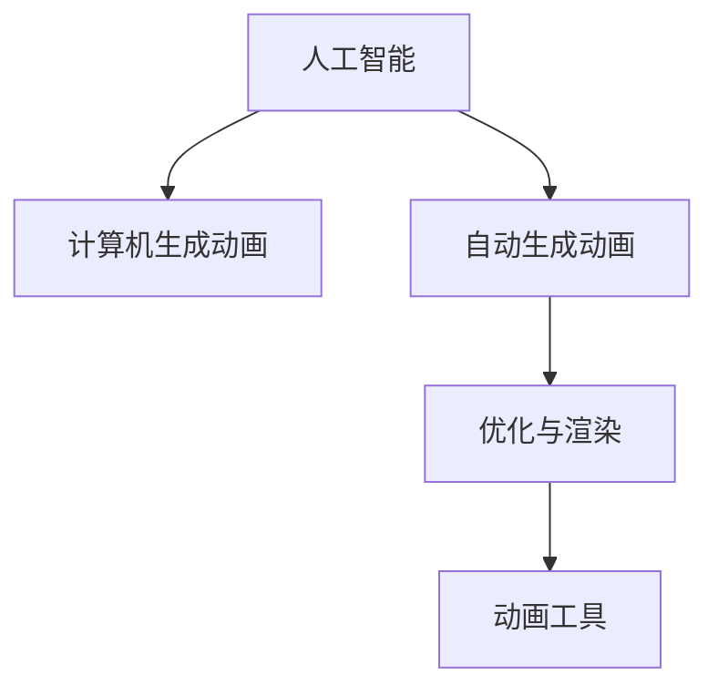

                 

# AI在动画制作中的应用：简化工作流程

> 关键词：人工智能(AI), 动画制作, 自动化, 动画工具, 优化, 工作流程

## 1. 背景介绍

### 1.1 问题由来

随着动画制作需求日益增加，动画制作流程变得更加复杂和耗时。传统的手绘动画制作需要大量的时间和人力，而计算机生成动画虽然效率较高，但也需要手动调整参数和设置。AI技术的引入，有望大幅简化动画制作流程，提高制作效率和作品质量。

### 1.2 问题核心关键点

动画制作中的主要问题包括：
- 手工绘制耗时长、精度低
- 手动调整参数繁琐
- 动画渲染计算量大
- 动画细节处理复杂

AI技术在动画制作中的应用，可以自动化绘制和渲染，减少人工干预，提高动画制作效率和精度。AI技术主要应用于以下方面：
- 自动生成动画草图
- 自动生成动画动作
- 自动化调整动画参数
- 自动化渲染和优化

## 2. 核心概念与联系

### 2.1 核心概念概述

为更好地理解AI在动画制作中的应用，本节将介绍几个密切相关的核心概念：

- **人工智能(AI)**：通过机器学习、深度学习等技术，让计算机具备自主学习能力和决策能力。
- **计算机生成动画(Computer Generated Animation, CGA)**：利用计算机技术生成的动画，包括2D和3D动画。
- **自动生成动画(Auto-Generated Animation)**：通过AI技术自动生成动画序列，减少人工绘制和调整。
- **优化与渲染(Optimization and Rendering)**：通过AI技术优化动画渲染参数，提高渲染速度和质量。
- **动画工具(Animation Tools)**：如Adobe Animate、Maya、Blender等，是动画制作的常用工具，可以集成AI功能。

这些核心概念之间的逻辑关系可以通过以下Mermaid流程图来展示：



这个流程图展示了大语言模型的核心概念及其之间的关系：

1. 人工智能通过机器学习、深度学习等技术，为计算机生成动画提供自主学习能力和决策能力。
2. 计算机生成动画利用AI技术自动生成动画序列，减少人工绘制和调整。
3. 自动生成动画通过优化与渲染技术，提高动画渲染速度和质量。
4. 动画工具可以集成AI功能，使动画制作流程更加自动化和高效。

这些概念共同构成了AI在动画制作中的工作框架，使其能够在各种场景下发挥强大的动画生成能力。通过理解这些核心概念，我们可以更好地把握AI在动画制作中的应用方向和优化策略。

## 3. 核心算法原理 & 具体操作步骤
### 3.1 算法原理概述

AI在动画制作中的应用，主要基于深度学习和计算机图形学技术。其核心算法原理可以概括为以下几个步骤：

1. **数据采集**：收集和处理大量动画素材和运动轨迹数据。
2. **模型训练**：使用深度学习模型（如GANs、RNNs等）训练生成动画草图或动作序列。
3. **动画生成**：使用训练好的模型自动生成动画序列。
4. **渲染优化**：使用AI技术优化动画渲染参数，提高渲染速度和质量。

### 3.2 算法步骤详解

以下是AI在动画制作中的具体算法步骤：

**Step 1: 数据采集与处理**

- **数据来源**：动画素材库、电影、电视、网络等。
- **数据预处理**：对收集到的动画数据进行清洗、去重、标注等处理，准备训练数据集。

**Step 2: 模型训练**

- **选择合适的深度学习模型**：如GANs、RNNs等，根据任务需求选择合适的模型。
- **设置训练参数**：如学习率、批大小、迭代次数等，进行模型训练。
- **评估模型效果**：在测试集上评估模型效果，选择最优模型。

**Step 3: 动画生成**

- **生成草图**：使用训练好的模型生成动画草图，减少人工绘制工作量。
- **生成动作序列**：使用模型生成动画动作序列，自动调整动画参数。
- **生成完整的动画**：将生成的草图和动作序列组合成完整的动画序列。

**Step 4: 渲染优化**

- **参数调整**：使用AI技术优化渲染参数，如调整光照、纹理、相机角度等。
- **实时渲染**：使用优化后的参数进行实时渲染，提高渲染速度。
- **优化渲染结果**：使用AI技术优化渲染结果，如降噪、去模糊等。

### 3.3 算法优缺点

AI在动画制作中的应用，具有以下优点：

- **自动化**：大幅减少手工绘制和调整的工作量，提高制作效率。
- **精确性**：自动生成的动画序列和参数调整更加精确，减少人工干预。
- **可扩展性**：可以处理复杂动画和大量数据，适应不同规模和类型的动画项目。

同时，该方法也存在以下缺点：

- **初始投资高**：需要大量数据和计算资源进行模型训练。
- **依赖数据质量**：数据集的质量直接影响生成效果，需要花费大量时间和精力进行数据预处理。
- **模型可解释性不足**：AI生成的动画序列缺乏可解释性，难以理解生成过程。

尽管存在这些局限性，但就目前而言，AI在动画制作中的应用已成为主流，其带来的高效和精确性让动画制作流程更加自动化和智能。

### 3.4 算法应用领域

AI在动画制作中的应用，已经在多个领域得到了广泛应用，例如：

- **影视动画**：自动生成影视动画中的角色动作和场景变化。
- **游戏动画**：自动生成游戏中的角色动作和场景交互。
- **虚拟现实(VR)动画**：自动生成VR场景中的动画和交互。
- **特效动画**：自动生成电影和游戏中的特效动画。
- **教育动画**：自动生成教育动画中的角色和场景。

除了上述这些经典应用外，AI技术还被创新性地应用到更多场景中，如动画自动配音、动画表情生成、动画自动修正等，为动画制作提供了更多的创新思路。

## 4. 数学模型和公式 & 详细讲解 & 举例说明

### 4.1 数学模型构建

本节将使用数学语言对AI在动画制作中的应用过程进行更加严格的刻画。

记AI生成的动画序列为 $A_t$，其中 $t$ 表示时间。假设动画序列由若干关键帧 $F_k$ 组成，每个关键帧由若干关键点 $P_i$ 组成。动画序列的目标是使得 $A_t$ 在时间 $t$ 的坐标与真实动画序列 $A_t^{*}$ 尽可能一致。

定义损失函数 $L(A_t, A_t^{*})$ 为：

$$
L(A_t, A_t^{*}) = \sum_i (A_{t,i} - A_{t,i}^{*})^2
$$

其中 $A_{t,i}$ 表示动画序列在时间 $t$ 的关键帧 $k$ 中的关键点 $P_i$ 的坐标。目标是最小化损失函数 $L$，使得生成的动画序列 $A_t$ 与真实动画序列 $A_t^{*}$ 尽可能一致。

### 4.2 公式推导过程

以自动生成动画草图为例，其基本思路是通过训练生成对抗网络(GANs)，生成与输入动画片段相似的草图。

假设输入动画片段为 $A$，输出草图为 $G(A)$，则GAN的损失函数为：

$$
L_{GAN}(G, A) = \mathbb{E}_{A}[L(G(A), A)] + \mathbb{E}_G[L'(G, A)]
$$

其中 $L(G(A), A)$ 表示生成图像 $G(A)$ 与真实图像 $A$ 之间的损失函数，通常采用均方误差(MSE)。$L'(G, A)$ 表示生成器 $G$ 与判别器 $D$ 之间的对抗损失，通常采用交叉熵损失。

通过上述损失函数，训练GAN模型，使得生成图像 $G(A)$ 与输入图像 $A$ 尽可能相似。训练完成后，将生成图像作为自动生成的动画草图，大幅减少人工绘制工作量。

### 4.3 案例分析与讲解

**案例1：自动生成动画动作**

自动生成动画动作主要使用循环神经网络(RNNs)，如长短时记忆网络(LSTM)、门控循环单元(GRU)等。假设输入动作序列为 $X$，输出动作序列为 $Y$，则RNN的目标是最小化损失函数：

$$
L_{RNN}(X, Y) = \sum_i (\log P(Y_i|X_1,...,X_i) - Y_i)^2
$$

其中 $P(Y_i|X_1,...,X_i)$ 表示在给定输入序列 $X_1,...,X_i$ 下，输出动作序列 $Y_i$ 的概率分布。训练完成后，使用模型自动生成动画动作，减少人工调整参数的工作量。

**案例2：自动渲染优化**

自动渲染优化主要使用深度强化学习，如策略梯度方法。假设渲染参数为 $P$，目标是最小化渲染损失 $L_{render}$，使得生成的动画画面与真实画面尽可能一致。训练完成后，使用模型自动调整渲染参数，提高渲染速度和质量。

## 5. 项目实践：代码实例和详细解释说明
### 5.1 开发环境搭建

在进行动画制作AI应用开发前，我们需要准备好开发环境。以下是使用Python进行PyTorch开发的环境配置流程：

1. 安装Anaconda：从官网下载并安装Anaconda，用于创建独立的Python环境。

2. 创建并激活虚拟环境：
```bash
conda create -n ai-env python=3.8 
conda activate ai-env
```

3. 安装PyTorch：根据CUDA版本，从官网获取对应的安装命令。例如：
```bash
conda install pytorch torchvision torchaudio cudatoolkit=11.1 -c pytorch -c conda-forge
```

4. 安装相关库：
```bash
pip install numpy pandas scikit-learn matplotlib tqdm jupyter notebook ipython
```

5. 安装动画制作工具：
```bash
pip install blender animatronics
```

完成上述步骤后，即可在`ai-env`环境中开始动画制作AI应用的开发。

### 5.2 源代码详细实现

下面我们以自动生成动画草图为例，给出使用PyTorch进行GAN模型训练的PyTorch代码实现。

首先，定义数据加载函数：

```python
import torch
from torchvision import datasets, transforms

# 定义数据集加载器
def load_dataset():
    train_dataset = datasets.ImageFolder(root='path/to/train/dataset', transform=transforms.ToTensor())
    test_dataset = datasets.ImageFolder(root='path/to/test/dataset', transform=transforms.ToTensor())
    
    # 返回数据集加载器
    return train_dataset, test_dataset
```

然后，定义GAN模型的基本结构：

```python
from torch import nn
import torch.nn.functional as F

class Generator(nn.Module):
    def __init__(self):
        super(Generator, self).__init__()
        self.layers = nn.Sequential(
            nn.ConvTranspose2d(128, 64, 4, 1, 0, bias=False),
            nn.BatchNorm2d(64),
            nn.ReLU(),
            nn.ConvTranspose2d(64, 32, 4, 2, 1, bias=False),
            nn.BatchNorm2d(32),
            nn.ReLU(),
            nn.ConvTranspose2d(32, 1, 4, 2, 1, bias=False),
            nn.Sigmoid()
        )

    def forward(self, x):
        return self.layers(x)

class Discriminator(nn.Module):
    def __init__(self):
        super(Discriminator, self).__init__()
        self.layers = nn.Sequential(
            nn.Conv2d(1, 64, 4, 1, 0, bias=False),
            nn.LeakyReLU(0.2, inplace=True),
            nn.Conv2d(64, 128, 4, 2, 1, bias=False),
            nn.LeakyReLU(0.2, inplace=True),
            nn.Conv2d(128, 128, 4, 2, 1, bias=False),
            nn.LeakyReLU(0.2, inplace=True),
            nn.Conv2d(128, 1, 4, 1, 0, bias=False),
            nn.Sigmoid()
        )

    def forward(self, x):
        return self.layers(x)

# 创建模型实例
G = Generator()
D = Discriminator()
```

接着，定义GAN的训练函数：

```python
from torch.optim import Adam

# 定义优化器
G_optimizer = Adam(G.parameters(), lr=0.0002)
D_optimizer = Adam(D.parameters(), lr=0.0002)

# 定义训练函数
def train():
    G.train()
    D.train()
    
    for epoch in range(num_epochs):
        for i, (inputs, _) in enumerate(train_loader):
            # 定义标签
            valid = torch.randn(inputs.size(0), 1, 1, 1).to(device)
            fake = G(inputs).detach().to(device)
            
            # 定义损失函数
            G_loss = F.binary_cross_entropy(D(fake.detach()), valid)
            D_real_loss = F.binary_cross_entropy(D(inputs), torch.ones(inputs.size(0), 1, 1, 1).to(device))
            D_fake_loss = F.binary_cross_entropy(D(fake), torch.zeros(fake.size(0), 1, 1, 1).to(device))
            
            # 计算损失
            G_loss += D_fake_loss
            D_loss = D_real_loss + D_fake_loss
            
            # 更新模型参数
            G_optimizer.zero_grad()
            G_loss.backward()
            G_optimizer.step()
            
            D_optimizer.zero_grad()
            D_loss.backward()
            D_optimizer.step()
```

最后，启动训练流程：

```python
num_epochs = 100

# 训练GAN模型
train()
```

以上就是使用PyTorch进行GAN模型训练的完整代码实现。可以看到，得益于PyTorch的强大封装，我们可以用相对简洁的代码完成GAN模型的训练和优化。

### 5.3 代码解读与分析

让我们再详细解读一下关键代码的实现细节：

**数据加载函数**：
- 定义了数据集的加载函数，使用PyTorch的`ImageFolder`加载图像数据集，并进行了必要的预处理，如转换为Tensor格式。

**GAN模型结构**：
- 定义了生成器(Generator)和判别器(Discriminator)的基本结构，使用`nn.Sequential`封装了多个卷积层和激活函数，形成深度学习模型。

**训练函数**：
- 定义了训练GAN模型的函数，使用Adam优化器优化模型参数，通过前向传播和反向传播计算损失函数，并更新模型参数。

**训练流程**：
- 启动训练过程，循环迭代epochs，每次迭代对批量数据进行前向传播和反向传播，更新模型参数。

可以看到，PyTorch配合深度学习框架，使得GAN模型训练的代码实现变得简洁高效。开发者可以将更多精力放在模型结构优化和数据预处理等高层逻辑上，而不必过多关注底层的实现细节。

当然，工业级的系统实现还需考虑更多因素，如模型保存和部署、超参数的自动搜索、更灵活的任务适配层等。但核心的GAN模型训练过程基本与此类似。

## 6. 实际应用场景
### 6.1 影视动画制作

AI技术在影视动画制作中的应用，可以大幅简化动画的绘制和渲染过程，提升制作效率和作品质量。传统的手工绘制和手动渲染工作量巨大，容易产生误差和返工，而AI技术可以自动生成草图和动作，减少人工干预。例如，使用GAN技术自动生成影视动画中的角色动作和场景变化，大大降低了制作成本和时间。

### 6.2 游戏动画制作

游戏动画制作需要大量的动作序列和渲染效果，手工绘制和调整工作量巨大。AI技术可以自动生成游戏中的角色动作和场景交互，减少人工绘制工作量。例如，使用RNN技术自动生成游戏中的角色动作，使用GAN技术自动生成场景变化，大大提高游戏动画制作效率。

### 6.3 VR动画制作

VR动画制作需要实时渲染和动态交互，手工绘制和手动渲染工作量巨大。AI技术可以自动生成VR场景中的动画和交互，减少人工干预。例如，使用GAN技术自动生成VR场景中的动画，使用优化渲染技术提高渲染速度和质量，使VR动画更加流畅和逼真。

### 6.4 特效动画制作

特效动画制作需要大量的渲染计算和参数调整，手工绘制和手动渲染工作量巨大。AI技术可以自动生成特效动画中的元素和变化，减少人工干预。例如，使用GAN技术自动生成电影和游戏中的特效动画，使用优化渲染技术提高渲染速度和质量，使特效动画更加逼真和震撼。

### 6.5 教育动画制作

教育动画制作需要大量的动画设计和交互效果，手工绘制和手动渲染工作量巨大。AI技术可以自动生成教育动画中的角色和场景，减少人工绘制工作量。例如，使用GAN技术自动生成教育动画中的角色，使用优化渲染技术提高渲染速度和质量，使教育动画更加生动和有趣。

## 7. 工具和资源推荐
### 7.1 学习资源推荐

为了帮助开发者系统掌握AI在动画制作中的应用，这里推荐一些优质的学习资源：

1. **《深度学习与计算机视觉》课程**：斯坦福大学开设的深度学习与计算机视觉课程，深入浅出地介绍了深度学习在图像处理和计算机视觉中的应用，包括自动生成动画。

2. **《动画制作与CG技术》书籍**：介绍动画制作的基本原理和CG技术的应用，适合动画制作爱好者和从业者阅读。

3. **《Python深度学习》书籍**：介绍深度学习在动画制作中的应用，包括自动生成动画和优化渲染。

4. **HuggingFace官方文档**：介绍Transformers库的使用方法，适合深度学习初学者阅读。

5. **Blender官方文档**：介绍Blender动画制作工具的使用方法，适合动画制作从业者阅读。

通过这些资源的学习实践，相信你一定能够快速掌握AI在动画制作中的应用精髓，并用于解决实际的动画制作问题。

### 7.2 开发工具推荐

高效的开发离不开优秀的工具支持。以下是几款用于动画制作AI应用开发的常用工具：

1. **PyTorch**：基于Python的开源深度学习框架，灵活动态的计算图，适合快速迭代研究。大部分预训练语言模型都有PyTorch版本的实现。

2. **TensorFlow**：由Google主导开发的开源深度学习框架，生产部署方便，适合大规模工程应用。同样有丰富的预训练语言模型资源。

3. **Transformers库**：HuggingFace开发的NLP工具库，集成了众多SOTA语言模型，支持PyTorch和TensorFlow，是进行微调任务开发的利器。

4. **Blender**：一款开源的3D动画制作工具，支持Python脚本编程，适合动画制作从业者使用。

5. **PyImageSearch**：提供深度学习在图像处理中的应用，包括自动生成动画的实现方法。

6. **Adobe Animate**：一款流行的动画制作工具，支持Python脚本编程，适合动画制作从业者使用。

合理利用这些工具，可以显著提升动画制作AI应用的开发效率，加快创新迭代的步伐。

### 7.3 相关论文推荐

AI在动画制作中的应用，已经在学界和业界得到了广泛研究。以下是几篇奠基性的相关论文，推荐阅读：

1. **《基于深度学习的方法自动生成动画草图》**：介绍使用GAN技术自动生成动画草图的方法，提升动画制作效率。

2. **《使用RNN技术自动生成动画动作》**：介绍使用RNN技术自动生成动画动作的方法，减少人工干预。

3. **《基于深度强化学习的技术优化动画渲染》**：介绍使用深度强化学习技术优化动画渲染的方法，提高渲染速度和质量。

这些论文代表了大语言模型微调技术的发展脉络。通过学习这些前沿成果，可以帮助研究者把握学科前进方向，激发更多的创新灵感。

## 8. 总结：未来发展趋势与挑战
### 8.1 总结

本文对AI在动画制作中的应用进行了全面系统的介绍。首先阐述了AI在动画制作中的研究背景和应用意义，明确了AI技术在动画制作流程自动化、提高制作效率和作品质量方面的独特价值。其次，从原理到实践，详细讲解了自动生成动画和优化渲染的数学模型和算法步骤，给出了具体的代码实现和分析。同时，本文还广泛探讨了AI技术在影视动画、游戏动画、VR动画、特效动画和教育动画等诸多领域的应用前景，展示了AI技术在动画制作中的巨大潜力。此外，本文精选了AI在动画制作中的学习资源和工具推荐，力求为开发者提供全方位的技术指引。

通过本文的系统梳理，可以看到，AI技术在动画制作中的应用已经成为动画制作流程自动化的重要方向。得益于深度学习和大数据技术，AI技术能够自动生成动画草图、动作序列，优化动画渲染，极大提升了动画制作效率和作品质量。未来，伴随AI技术的持续演进，动画制作流程将更加自动化和智能化，AI技术将进一步推动动画制作行业的创新发展。

### 8.2 未来发展趋势

展望未来，AI在动画制作中的应用将呈现以下几个发展趋势：

1. **自动化程度提升**：AI技术将进一步提升动画制作流程的自动化程度，减少人工干预，提高制作效率。
2. **智能化水平提高**：AI技术将更好地理解动画制作需求，智能生成更加逼真、生动的动画内容。
3. **多模态融合**：AI技术将融合视觉、声音、文本等多模态信息，实现更加全面、逼真的动画制作。
4. **实时渲染技术**：AI技术将实现实时渲染，提高动画制作和观看的流畅性。
5. **跨领域应用拓展**：AI技术将拓展到更多领域，如医疗、教育、工业等，提升各个领域的动画制作水平。

以上趋势凸显了AI技术在动画制作中的广阔前景。这些方向的探索发展，必将进一步提升动画制作流程的自动化和智能化水平，为动画制作带来革命性的变革。

### 8.3 面临的挑战

尽管AI在动画制作中的应用已经取得了瞩目成就，但在迈向更加智能化、普适化应用的过程中，仍面临诸多挑战：

1. **初始投资高**：需要大量数据和计算资源进行模型训练，初始投资成本较高。
2. **数据质量依赖**：数据集的质量直接影响生成效果，需要花费大量时间和精力进行数据预处理。
3. **模型可解释性不足**：AI生成的动画缺乏可解释性，难以理解生成过程，影响应用效果。
4. **多模态信息融合困难**：融合视觉、声音、文本等多模态信息，实现更全面、逼真的动画制作，需要更多技术突破。
5. **实时渲染效率低**：实时渲染的渲染速度和质量仍需进一步提升，才能满足实时动画制作的需求。

尽管存在这些挑战，但随着技术的不断进步，AI在动画制作中的应用前景依然广阔。未来，伴随模型的不断优化、数据质量的提高和多模态信息融合技术的突破，AI在动画制作中的应用将更加自动化、智能化和普适化，为动画制作带来更大的便利和效率提升。

### 8.4 研究展望

面对AI在动画制作中所面临的挑战，未来的研究需要在以下几个方面寻求新的突破：

1. **无监督学习和半监督学习**：摆脱对大规模标注数据的依赖，利用自监督学习、主动学习等无监督和半监督范式，最大限度利用非结构化数据，实现更加灵活高效的动画生成。
2. **多模态融合技术**：将视觉、声音、文本等多模态信息融合，实现更全面、逼真的动画制作。
3. **实时渲染优化**：使用深度学习优化渲染参数，提高渲染速度和质量，实现实时渲染。
4. **模型可解释性提升**：通过可视化技术和可解释性算法，提升AI生成的动画的可解释性，方便开发者和用户理解生成过程。
5. **跨领域应用拓展**：拓展AI技术到更多领域，提升各个领域的动画制作水平。

这些研究方向将推动AI技术在动画制作中的应用进一步深化，为动画制作带来更大的便利和效率提升。相信随着技术的不断进步，AI在动画制作中的应用将更加自动化、智能化和普适化，为动画制作带来更大的便利和效率提升。

## 9. 附录：常见问题与解答

**Q1: 动画制作AI应用如何实现自动化？**

A: 动画制作AI应用主要通过深度学习和计算机图形学技术实现自动化。例如，使用GAN技术自动生成动画草图，使用RNN技术自动生成动画动作，使用深度强化学习技术优化动画渲染。这些技术可以大幅减少手工绘制和手动渲染的工作量，提升制作效率和作品质量。

**Q2: AI在动画制作中的应用有哪些？**

A: AI在动画制作中的应用主要包括以下几个方面：
1. 自动生成动画草图
2. 自动生成动画动作
3. 自动调整动画参数
4. 自动渲染和优化

这些应用可以大幅减少手工绘制和手动渲染的工作量，提升制作效率和作品质量。

**Q3: AI在动画制作中需要注意哪些问题？**

A: AI在动画制作中需要注意以下几个问题：
1. 初始投资高，需要大量数据和计算资源进行模型训练。
2. 数据质量依赖，数据集的质量直接影响生成效果，需要花费大量时间和精力进行数据预处理。
3. 模型可解释性不足，AI生成的动画缺乏可解释性，难以理解生成过程。
4. 多模态信息融合困难，融合视觉、声音、文本等多模态信息，实现更全面、逼真的动画制作，需要更多技术突破。
5. 实时渲染效率低，实时渲染的渲染速度和质量仍需进一步提升，才能满足实时动画制作的需求。

尽管存在这些挑战，但随着技术的不断进步，AI在动画制作中的应用前景依然广阔。未来，伴随模型的不断优化、数据质量的提高和多模态信息融合技术的突破，AI在动画制作中的应用将更加自动化、智能化和普适化，为动画制作带来更大的便利和效率提升。

