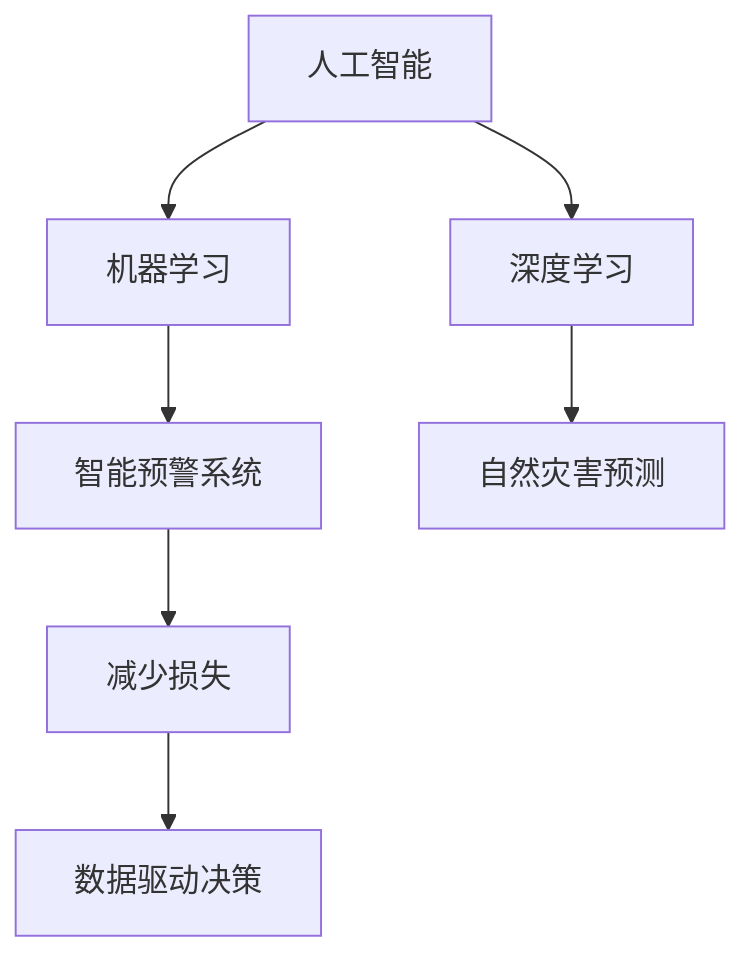

                 

# AI在智能灾害预警中的应用：减少损失

> 关键词：AI在灾害预警中的应用，智能灾害预警，机器学习，深度学习，减少损失，数据驱动决策，预警系统，自然灾害预测

## 1. 背景介绍

### 1.1 问题由来
全球气候变暖、自然灾害频发，对人类社会造成了巨大威胁。如何构建高效、可靠的智能预警系统，减少灾害损失，成为各国政府和学术界共同关注的重要课题。通过AI技术，尤其是机器学习和深度学习，可以从海量历史数据中挖掘规律，预测灾害风险，从而为提前防范和快速响应提供决策依据。

### 1.2 问题核心关键点
智能灾害预警的核心是构建一个能够准确预测灾害发生概率和影响范围的模型。其关键在于：
- 数据的收集与处理：获取全面、高质量的气象、地质、环境数据。
- 模型的训练与优化：选择合适算法，训练高效、鲁棒的预测模型。
- 系统的部署与监测：将模型集成到实际预警系统中，实时监控并调整模型参数。
- 效果的评估与反馈：对预警结果进行评估，收集用户反馈，持续改进模型性能。

### 1.3 问题研究意义
智能灾害预警系统通过AI技术，能够实现对自然灾害的准确预测和高效响应，极大地提升灾害预防和应急响应能力，降低经济损失和人员伤亡。研究智能灾害预警，不仅具有重要的学术价值，更对减少灾害损失，保障社会稳定具有深远的影响。

## 2. 核心概念与联系

### 2.1 核心概念概述

为更好地理解智能灾害预警的AI应用，本节将介绍几个密切相关的核心概念：

- 人工智能(AI)：通过算法和计算能力模拟人类智能过程的技术，能够处理复杂的非结构化数据，实现自主学习和决策。
- 机器学习(ML)：一类利用数据训练模型，从而实现特定任务的技术。
- 深度学习(DL)：一类基于神经网络，通过多层次抽象特征，提升模型表达能力的机器学习方法。
- 智能预警系统：通过AI技术对特定灾害进行实时监测和预测的系统，具备高精度和高效响应能力。
- 数据驱动决策：利用数据进行预测和决策，减少主观偏见，提升决策的科学性和客观性。
- 自然灾害预测：通过对气象、地质、环境等数据的分析，预测自然灾害的发生概率和影响范围。
- 减少损失：通过及时预警和有效应对，减少灾害带来的经济损失和人员伤亡。

这些核心概念之间的逻辑关系可以通过以下Mermaid流程图来展示：



这个流程图展示了他核心概念的相互联系：

1. 人工智能技术通过机器学习和深度学习，提升对自然灾害的预测能力。
2. 自然灾害预测是智能预警系统的基础，提供了关键的数据支持。
3. 智能预警系统通过数据驱动决策，实现对灾害的及时预警和高效响应。
4. 减少损失是智能预警系统的最终目标，通过精准预测和快速响应，最大程度地减少灾害损失。

## 3. 核心算法原理 & 具体操作步骤
### 3.1 算法原理概述

智能灾害预警的核心算法原理主要围绕以下几个方面展开：

- 数据预处理：清洗、归一化、特征工程等数据预处理技术，提升数据质量和模型性能。
- 模型选择与训练：选择合适的算法，利用历史数据训练模型，学习灾害发生的规律。
- 模型评估与优化：采用交叉验证、留出法等评估模型性能，不断优化模型参数。
- 模型集成与部署：将训练好的模型集成到预警系统中，进行实时预测和决策。
- 系统监测与反馈：实时监控预警系统性能，收集用户反馈，持续改进模型。

### 3.2 算法步骤详解

基于机器学习和大数据技术的智能灾害预警系统，一般包括以下关键步骤：

**Step 1: 数据收集与预处理**
- 收集气象、地质、环境等与灾害相关的历史数据。
- 进行数据清洗、缺失值填补、归一化等预处理，提升数据质量。
- 进行特征工程，提取有助于预测的关键特征。

**Step 2: 模型选择与训练**
- 选择合适的算法，如随机森林、支持向量机、神经网络等。
- 利用历史数据进行模型训练，学习灾害发生的规律。
- 应用交叉验证、留出法等技术，评估模型性能。

**Step 3: 模型评估与优化**
- 采用多种评估指标，如准确率、召回率、F1值等，评估模型性能。
- 通过调整模型参数、集成多个模型等方法，优化模型性能。

**Step 4: 模型集成与部署**
- 将训练好的模型集成到预警系统中，进行实时预测和决策。
- 设计合适的预测接口，提供API供系统调用。

**Step 5: 系统监测与反馈**
- 实时监控预警系统性能，收集用户反馈。
- 根据用户反馈，不断优化模型参数和预警策略。

### 3.3 算法优缺点

智能灾害预警的AI应用具有以下优点：
1. 高效精确：通过深度学习模型，能够从海量数据中学习出灾害发生的复杂规律，实现高精度预测。
2. 实时响应：利用机器学习模型，实现实时预测和快速响应，缩短预警响应时间。
3. 数据驱动：以数据为基础，进行科学决策，减少主观偏见。
4. 持续改进：通过用户反馈，持续优化模型性能，提升预警效果。

同时，该方法也存在一定的局限性：
1. 数据依赖：模型性能依赖于历史数据的数量和质量，数据缺失或不准确可能导致模型预测效果不佳。
2. 复杂度高：深度学习模型通常较为复杂，计算资源需求大，难以实时处理海量数据。
3. 不普适：特定模型的预测效果依赖于具体的数据特征，难以跨领域泛化。
4. 误报率高：模型可能会产生误报，对不必要的灾难预警可能造成资源浪费。

尽管存在这些局限性，但就目前而言，基于机器学习和大数据的智能灾害预警技术已经展现出显著的优势，在多个领域得到了广泛的应用。未来相关研究的重点在于如何进一步降低对数据的依赖，提高模型的泛化能力，同时兼顾实时性和准确性等因素。

### 3.4 算法应用领域

智能灾害预警的AI应用已经广泛应用于气象、地质、环境等多个领域，以下是具体的应用场景：

- 气象灾害预警：通过气象数据的实时监测和预测，实现台风、暴雨、洪水等气象灾害的预警。
- 地质灾害预警：利用地质数据的分析，预测滑坡、地震、泥石流等灾害的发生概率。
- 环境灾害预警：通过环境数据的监测，预警空气污染、水污染、生态破坏等环境灾害。
- 城市洪水预警：结合城市排水系统和天气预报数据，实现城市洪水的提前预警和应急响应。
- 森林火灾预警：利用遥感数据和环境监测数据，预测森林火灾的发生和蔓延。

## 4. 数学模型和公式 & 详细讲解 & 举例说明

### 4.1 数学模型构建

本节将使用数学语言对智能灾害预警的AI应用进行更加严格的刻画。

假设训练数据集为 $D=\{(x_i,y_i)\}_{i=1}^N$，其中 $x_i$ 表示历史数据特征，$y_i$ 表示该数据对应的灾害发生概率。我们定义模型 $f(x)$ 对新数据的预测概率，即：

$$
\hat{y} = f(x)
$$

模型 $f(x)$ 的输出为灾害发生的概率，通常用 sigmoid 函数映射到 [0,1] 区间，即：

$$
f(x) = \frac{1}{1+e^{-x_w^T\beta}} 
$$

其中 $x_w$ 为输入数据的线性变换，$\beta$ 为模型参数。

目标是最小化模型在训练集上的预测误差，即：

$$
\min_{\beta} \frac{1}{N} \sum_{i=1}^N \ell(f(x_i),y_i)
$$

其中 $\ell$ 为损失函数，常用的有均方误差、交叉熵损失等。

### 4.2 公式推导过程

以随机森林(Random Forest)算法为例，其核心思想是通过多个决策树的集成，提升模型的泛化能力。

假设训练数据集为 $D=\{(x_i,y_i)\}_{i=1}^N$，其中 $x_i$ 表示历史数据特征，$y_i$ 表示该数据对应的灾害发生概率。我们定义模型 $f(x)$ 对新数据的预测概率，即：

$$
\hat{y} = f(x) = \frac{1}{K} \sum_{k=1}^K f_k(x)
$$

其中 $f_k(x)$ 为第 $k$ 棵决策树对数据的预测概率，$K$ 为决策树的数目。

决策树的构建过程如下：
1. 随机从训练集中抽取 $m$ 个样本，用于构建一棵决策树。
2. 对每个样本，随机选择 $p$ 个特征作为分裂条件。
3. 根据样本特征，递归地构建决策树。

通过集成多个决策树，可以提升模型的鲁棒性和泛化能力，减少过拟合风险。

### 4.3 案例分析与讲解

以气象灾害预警为例，分析智能灾害预警的AI应用的实现过程：

- **数据预处理**：收集历史气象数据，进行清洗、归一化、特征工程等预处理，提取有用的特征。
- **模型选择**：选择随机森林、支持向量机等算法，构建多个决策树进行集成。
- **模型训练**：利用历史气象数据训练模型，学习灾害发生的规律。
- **模型评估**：采用交叉验证、留出法等技术，评估模型性能，选择合适的模型参数。
- **模型集成**：将训练好的模型集成到预警系统中，进行实时预测和决策。
- **系统监测**：实时监控预警系统性能，收集用户反馈，持续优化模型。

通过以上过程，可以构建一个高效、精确的气象灾害预警系统，为气象部门提供可靠的决策支持。

## 5. 项目实践：代码实例和详细解释说明
### 5.1 开发环境搭建

在进行智能灾害预警的AI应用开发前，我们需要准备好开发环境。以下是使用Python进行TensorFlow开发的环境配置流程：

1. 安装Anaconda：从官网下载并安装Anaconda，用于创建独立的Python环境。

2. 创建并激活虚拟环境：
```bash
conda create -n tf-env python=3.8 
conda activate tf-env
```

3. 安装TensorFlow：根据CUDA版本，从官网获取对应的安装命令。例如：
```bash
conda install tensorflow -c pytorch -c conda-forge
```

4. 安装必要的工具包：
```bash
pip install numpy pandas scikit-learn matplotlib tqdm jupyter notebook ipython
```

完成上述步骤后，即可在`tf-env`环境中开始智能灾害预警的AI应用开发。

### 5.2 源代码详细实现

以下是使用TensorFlow实现气象灾害预警系统的示例代码：

```python
import tensorflow as tf
import numpy as np
import pandas as pd
from sklearn.ensemble import RandomForestClassifier

# 加载数据
data = pd.read_csv('meteorological_data.csv')
X = data.drop('target', axis=1)
y = data['target']

# 数据预处理
X = (X - X.mean()) / X.std()

# 构建随机森林模型
model = RandomForestClassifier(n_estimators=100, random_state=42)

# 训练模型
model.fit(X, y)

# 预测新数据
new_data = np.array([[1.5, 25.5, 0.8, 0.3, 0.5, 12.3]])
new_data = (new_data - new_data.mean()) / new_data.std()
prediction = model.predict_proba(new_data)

print(prediction)
```

上述代码展示了使用TensorFlow和Scikit-learn构建随机森林模型，进行气象灾害预警的过程。

### 5.3 代码解读与分析

让我们再详细解读一下关键代码的实现细节：

**数据加载与预处理**：
- `pd.read_csv()`：加载历史气象数据，保存在DataFrame中。
- `X = data.drop('target', axis=1)`：去除目标变量，只保留特征变量。
- `y = data['target']`：提取目标变量。
- `X = (X - X.mean()) / X.std()`：对特征变量进行归一化处理，提升模型性能。

**模型构建与训练**：
- `RandomForestClassifier`：使用Scikit-learn库构建随机森林模型。
- `model.fit(X, y)`：训练模型，学习灾害发生的规律。

**模型预测**：
- `new_data`：新的气象数据，用于预测灾害发生概率。
- `new_data = (new_data - new_data.mean()) / new_data.std()`：对新数据进行归一化处理。
- `model.predict_proba(new_data)`：预测新数据发生的概率，输出为[0,1]区间内的值。

通过以上代码，可以构建一个简单的气象灾害预警系统，对新的气象数据进行实时预测。

## 6. 实际应用场景

### 6.1 智能气象预警

智能气象预警系统通过AI技术，可以实现对台风、暴雨、洪水等气象灾害的实时监测和预测，帮助相关部门提前采取措施，减少灾害损失。

在技术实现上，可以收集历史气象数据，包括气温、湿度、气压、降雨量等，作为训练数据。将数据输入训练好的模型，输出灾害发生的概率。当概率超过预设阈值时，自动触发预警，发布通知和指令。

### 6.2 地质灾害预警

地质灾害预警系统通过AI技术，可以实现对滑坡、地震、泥石流等灾害的预测，及时向居民发出警报，保障人员安全。

在技术实现上，可以收集地质数据，包括地震活动、地质构造、地面沉降等，作为训练数据。将数据输入训练好的模型，输出灾害发生的概率。当概率超过预设阈值时，自动触发预警，发布通知和疏散指示。

### 6.3 环境灾害预警

环境灾害预警系统通过AI技术，可以实现对空气污染、水污染、生态破坏等环境灾害的预测，帮助相关部门采取措施，减少环境污染。

在技术实现上，可以收集环境数据，包括空气质量、水质、污染物浓度等，作为训练数据。将数据输入训练好的模型，输出灾害发生的概率。当概率超过预设阈值时，自动触发预警，发布通知和应急措施。

## 7. 工具和资源推荐
### 7.1 学习资源推荐

为了帮助开发者系统掌握智能灾害预警的AI应用的理论基础和实践技巧，这里推荐一些优质的学习资源：

1. TensorFlow官方文档：TensorFlow的官方文档，提供了详尽的API和实例代码，是学习TensorFlow的基础。

2. Scikit-learn官方文档：Scikit-learn的官方文档，提供了丰富的机器学习算法和工具，是学习机器学习的基础。

3. Coursera《机器学习》课程：斯坦福大学开设的机器学习课程，涵盖机器学习的基本概念和经典算法。

4. Udacity《深度学习》课程：Udacity的深度学习课程，介绍了深度学习的基本原理和应用场景。

5. 《深度学习入门》书籍：MXNet团队的深度学习入门书籍，适合初学者学习深度学习的基础知识。

通过对这些资源的学习实践，相信你一定能够快速掌握智能灾害预警的AI应用的关键技术，并用于解决实际问题。
###  7.2 开发工具推荐

高效的开发离不开优秀的工具支持。以下是几款用于智能灾害预警的AI应用开发的常用工具：

1. TensorFlow：基于Python的开源深度学习框架，生产部署方便，适合大规模工程应用。

2. Scikit-learn：基于Python的机器学习库，提供了丰富的算法和工具，适合快速原型开发。

3. Jupyter Notebook：交互式的Python开发环境，支持代码块的执行和结果展示，适合研究性开发。

4. Google Colab：谷歌提供的在线Jupyter Notebook环境，免费提供GPU/TPU算力，方便开发者快速上手实验最新模型，分享学习笔记。

合理利用这些工具，可以显著提升智能灾害预警的AI应用开发的效率，加快创新迭代的步伐。

### 7.3 相关论文推荐

智能灾害预警的AI应用的发展源于学界的持续研究。以下是几篇奠基性的相关论文，推荐阅读：

1. J. R. Quinlan. "Induction of Decision Trees"：介绍了决策树算法的原理和实现。

2. L. Breiman. "Random Forests"：介绍了随机森林算法的原理和实现。

3. Y. Bengio et al. "Representation Learning: A Review and New Perspectives"：介绍了深度学习在数据表示和特征学习中的应用。

4. J. Schmidhuber. "Artificial Neural Networks in Machine Learning, Computer Vision, Speech Recognition and Corporate Planning"：介绍了神经网络在机器学习中的应用。

5. Y. LeCun et al. "Convolutional Networks for Images, Speech, and Time Series"：介绍了卷积神经网络在图像、语音、时间序列数据上的应用。

这些论文代表了大数据和机器学习技术的发展脉络，为智能灾害预警的AI应用提供了理论支持。

## 8. 总结：未来发展趋势与挑战
### 8.1 总结

本文对基于AI的智能灾害预警系统进行了全面系统的介绍。首先阐述了智能灾害预警在NLP技术中的应用背景和研究意义，明确了AI在灾害预警中的关键作用。其次，从原理到实践，详细讲解了机器学习和大数据技术在智能预警中的应用流程，给出了智能预警系统的完整代码实例。同时，本文还广泛探讨了智能预警系统在气象、地质、环境等多个领域的应用前景，展示了AI技术的巨大潜力。此外，本文精选了智能预警系统的各类学习资源，力求为读者提供全方位的技术指引。

通过本文的系统梳理，可以看到，基于AI技术的智能灾害预警系统已经展现出显著的优势，为减少灾害损失，保障社会稳定提供了重要手段。未来，伴随AI技术的不断进步，智能预警系统将进一步提升其精确性和实时性，真正实现对自然灾害的精准预测和高效响应。

### 8.2 未来发展趋势

展望未来，智能灾害预警的AI应用将呈现以下几个发展趋势：

1. 算法复杂度降低：随着模型压缩和优化技术的发展，智能预警系统的计算复杂度将进一步降低，使得实时预警成为可能。

2. 多模态数据融合：将气象、地质、环境等多模态数据整合，提升灾害预测的全面性和准确性。

3. 边缘计算应用：将智能预警系统部署在边缘计算设备上，实现本地实时处理和预警，提升预警响应速度。

4. 协同预测系统：通过多个智能预警系统协同预测，提升预测结果的鲁棒性和可靠性。

5. 自适应学习：利用深度学习技术，使智能预警系统具备自适应学习能力，根据实际情况动态调整预测模型。

6. 可解释性增强：提升智能预警系统的可解释性，让用户理解模型的预测依据，增强其可信度。

以上趋势凸显了智能灾害预警的AI应用发展的广阔前景，这些方向的探索发展，必将进一步提升系统的性能和应用范围，为减少灾害损失，保障社会稳定提供更强大的技术支撑。

### 8.3 面临的挑战

尽管智能灾害预警的AI应用已经取得了显著进展，但在迈向更加智能化、普适化应用的过程中，它仍面临诸多挑战：

1. 数据获取困难：获取全面、高质量的灾害数据困难，数据缺失或不准确可能导致模型预测效果不佳。

2. 计算资源需求高：深度学习模型通常较为复杂，计算资源需求大，难以实时处理海量数据。

3. 模型泛化能力不足：特定模型可能难以跨领域泛化，预测结果在不同地区或数据集上效果差异较大。

4. 实时预警难度大：实时预警需要高效、稳定的系统架构和数据传输机制，难以实现。

5. 用户信任度低：用户对AI预警系统的信任度不高，可能影响预警效果的落实。

6. 法律和伦理问题：AI预警系统在应用中可能涉及隐私、伦理等问题，需要加强规范和监管。

这些挑战需要多学科的协同攻关，才能实现智能灾害预警的全面落地应用。只有从数据、算法、工程、业务等多个维度协同发力，才能真正实现智能预警系统的广泛应用。

### 8.4 研究展望

面对智能灾害预警的AI应用所面临的挑战，未来的研究需要在以下几个方面寻求新的突破：

1. 无监督学习和半监督学习：探索无需标注数据的学习方法，最大程度利用非结构化数据，提高模型的泛化能力。

2. 分布式训练技术：利用分布式计算技术，提升模型训练效率，支持大规模数据处理。

3. 模型压缩与优化：开发更加高效、轻量级的模型，提升模型的实时性和可扩展性。

4. 多模态融合技术：将多种数据源整合，提升模型的预测能力。

5. 模型解释与可解释性：增强模型的可解释性，提升用户对AI预警系统的信任度。

6. 法律法规和伦理规范：制定和完善相关法律法规，确保AI预警系统的合法、合规应用。

这些研究方向的探索，必将引领智能灾害预警的AI应用迈向更高的台阶，为减少灾害损失，保障社会稳定提供更坚实的技术保障。总之，智能灾害预警的AI应用需要在数据、算法、工程、业务等多个维度协同发力，方能真正实现全面、高效、可靠的智能预警系统。

## 9. 附录：常见问题与解答

**Q1：智能灾害预警系统的数据来源有哪些？**

A: 智能灾害预警系统的数据来源包括：
1. 气象部门：收集气象数据，包括气温、湿度、气压、降雨量等。
2. 地质部门：收集地质数据，包括地震活动、地质构造、地面沉降等。
3. 环保部门：收集环境数据，包括空气质量、水质、污染物浓度等。
4. 社会媒体：收集社交媒体数据，分析舆情变化，及时发现潜在灾害预警。
5. 遥感卫星：收集遥感数据，实时监测地表变化，预测灾害发生。

**Q2：如何选择适合的机器学习算法？**

A: 选择适合的机器学习算法需要考虑多个因素，包括：
1. 数据类型：根据数据的类型（数值型、文本型、图像型等）选择相应的算法。
2. 数据规模：对于大数据集，选择分布式训练算法；对于小数据集，选择单机的机器学习算法。
3. 计算资源：根据计算资源的限制，选择高效的算法，如决策树、随机森林等。
4. 预测效果：根据预测效果选择算法，如精度、召回率、F1值等。

**Q3：智能灾害预警系统如何实时更新模型？**

A: 智能灾害预警系统可以通过以下几个步骤实时更新模型：
1. 收集新的数据：定期收集新的气象、地质、环境等数据。
2. 数据预处理：对新数据进行清洗、归一化、特征工程等预处理。
3. 模型训练：利用新数据训练模型，学习灾害发生的规律。
4. 模型评估：评估新模型的性能，选择最优模型。
5. 系统集成：将新模型集成到预警系统中，进行实时预测和决策。

通过以上过程，可以确保智能预警系统始终处于最新的状态，提升预警效果。

**Q4：智能灾害预警系统如何应对误报？**

A: 智能灾害预警系统可以通过以下几个措施应对误报：
1. 调整预警阈值：根据实际情况调整预警阈值，避免误报。
2. 引入专家知识：结合专家知识，提升模型的准确性。
3. 数据融合技术：利用多源数据融合技术，提高预警的鲁棒性。
4. 自适应学习：利用深度学习技术，使模型具备自适应学习能力，根据实际情况动态调整预测模型。

通过以上措施，可以降低误报率，提高预警系统的可靠性。

**Q5：智能灾害预警系统如何提升用户信任度？**

A: 智能灾害预警系统可以通过以下几个措施提升用户信任度：
1. 提高准确性：通过不断优化模型，提升预警的准确性。
2. 增强可解释性：提升模型的可解释性，让用户理解模型的预测依据。
3. 提供多样化预警方式：提供多种预警方式，如短信、邮件、App推送等，方便用户接收预警信息。
4. 用户反馈机制：建立用户反馈机制，及时处理用户反馈，改进系统性能。

通过以上措施，可以提升用户对智能预警系统的信任度，增强系统的可接受性和可用性。

---

作者：禅与计算机程序设计艺术 / Zen and the Art of Computer Programming

