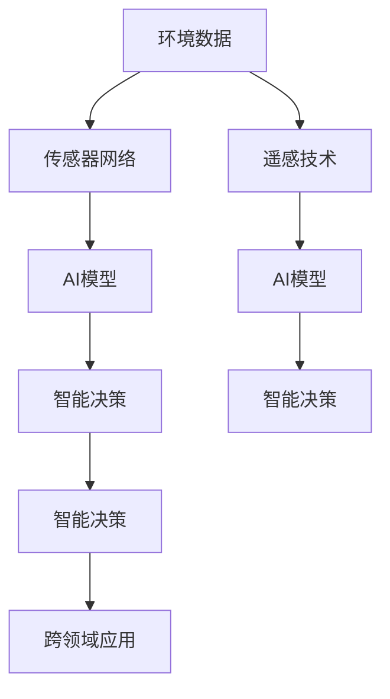

                 

# AI在环境保护中的应用前景

## 1. 背景介绍

随着全球气候变化和环境污染问题的日益严峻，保护环境和可持续发展已成为全人类共同关注的焦点。传统的环境监测和管理方法面临数据量大、成本高、效率低等问题，而人工智能（AI）技术的出现，为环境保护带来了新的契机和突破口。AI通过其强大的数据处理、模式识别、智能决策等能力，正在全面渗透到环境保护的各个环节，从环境监测预警、污染源识别与溯源、智能资源管理、生态修复等领域，展现出巨大的应用前景。

### 1.1 问题由来
近年来，由于人类活动对自然环境的过度开发和破坏，导致全球变暖、海平面上升、极端天气频发等环境问题日益突出。传统的监测和管理方式如人工巡检、手工分析等，不仅效率低下，而且成本高昂。然而，随着传感器网络、遥感技术、大数据等技术的飞速发展，环境数据的获取变得越来越容易，为AI在环境保护中的应用提供了可能性。AI不仅可以处理海量环境数据，识别复杂的环境模式，还能基于多源数据进行智能决策，为环境保护提供了强有力的技术支撑。

### 1.2 问题核心关键点
AI在环境保护中的应用核心在于其强大的数据分析和模式识别能力，能够实时监测环境状况，智能分析污染源，优化资源配置，辅助环境决策等。关键问题点如下：
- **数据获取与处理**：获取环境数据的方法与数据处理技术。
- **模型构建与训练**：构建适合环境监测的AI模型及其训练方法。
- **智能决策与优化**：基于AI模型的环境决策与优化技术。
- **跨领域应用**：AI在环境管理中的跨领域应用拓展。

## 2. 核心概念与联系

### 2.1 核心概念概述

为更好地理解AI在环境保护中的应用，本节将介绍几个密切相关的核心概念：

- **环境数据**：包括大气质量监测数据、水文水资源数据、土壤环境数据、生物多样性数据等。
- **传感器网络**：由传感器和通信网络组成的实时数据采集系统，广泛应用于环境监测。
- **遥感技术**：通过卫星或航空器上的传感器获取地球表面信息的遥感监测技术。
- **AI模型**：包括深度学习模型、强化学习模型等，用于环境数据分析与预测。
- **智能决策**：基于AI模型的决策与优化技术，用于环境管理与资源配置。
- **跨领域应用**：AI在环境保护中的跨领域融合应用，如智能水资源管理、智能废弃物处理、智能植被恢复等。

这些核心概念之间的逻辑关系可以通过以下Mermaid流程图来展示：



这个流程图展示出环境数据如何通过传感器网络和遥感技术获取，并由AI模型进行智能分析和预测，最终在跨领域应用中实现环境管理与优化。

## 3. 核心算法原理 & 具体操作步骤

### 3.1 算法原理概述

AI在环境保护中的应用主要依赖于数据驱动的机器学习模型。其核心原理是通过训练模型，使其能够自动从环境数据中学习到环境变化的规律，并根据学习到的规律进行环境监测、污染源识别、智能决策等任务。

以空气质量预测为例，假设模型输入为环境监测站点的历史PM2.5数据，输出为未来某时刻的PM2.5浓度预测值。模型训练的损失函数为预测值与真实值之间的误差，如均方误差(MSE)。训练目标是通过最小化损失函数，使模型能够准确预测未来的PM2.5浓度。

### 3.2 算法步骤详解

AI在环境保护中的应用步骤大致分为以下几个阶段：

**Step 1: 数据获取与预处理**
- 通过传感器网络、遥感技术、公共数据平台等途径，收集环境监测数据。
- 对收集到的数据进行清洗、降噪、归一化等预处理，确保数据的质量和一致性。

**Step 2: 模型构建与训练**
- 根据环境监测任务的特点，选择合适的AI模型架构，如时间序列预测模型、分类模型、回归模型等。
- 设计数据集，将处理后的环境数据划分为训练集、验证集和测试集。
- 使用训练集数据对模型进行训练，通过优化算法如Adam、SGD等，最小化损失函数，逐步优化模型参数。
- 在验证集上对模型进行评估，调整模型参数以防止过拟合。
- 在测试集上评估模型最终性能，确保模型的泛化能力。

**Step 3: 智能决策与优化**
- 根据训练好的模型，对实时环境监测数据进行预测或分类，生成环境报告或警报。
- 结合专家知识和规则，对模型的预测结果进行修正和优化。
- 在实际应用场景中，基于预测结果进行环境管理与资源配置，如调整排放政策、优化资源调度、进行生态修复等。

### 3.3 算法优缺点

AI在环境保护中的应用具有以下优点：
1. **实时监测**：AI模型可以实时处理海量环境数据，实现环境状态的实时监测和预警。
2. **高精度预测**：基于深度学习等高级模型，AI能够高精度预测环境变化趋势，提高决策的准确性。
3. **自动优化**：AI模型可以自动学习和优化，适应环境变化，提高环境管理的智能化水平。
4. **跨领域融合**：AI在环境保护中的应用可以实现多领域数据的融合，提高环境监测的全面性和系统性。

同时，AI在环境保护中也存在一些缺点：
1. **数据质量依赖**：AI模型的性能高度依赖于环境数据的获取和处理质量，数据异常或不完整可能导致模型失效。
2. **模型复杂性**：高级AI模型结构复杂，训练和部署难度较大，需要专业知识和资源。
3. **解释性不足**：AI模型的决策过程往往是"黑箱"的，难以解释其内部机制，影响决策的可信度和透明性。
4. **伦理与安全**：AI在处理敏感环境数据时，可能面临数据隐私和安全问题，存在数据泄露和滥用的风险。

## 4. 数学模型和公式 & 详细讲解 & 举例说明

### 4.1 数学模型构建

以空气质量预测为例，假设有历史PM2.5数据 $D=\{x_1, x_2, ..., x_n\}$，其中 $x_t = [P_{t-1}, T_{t-1}, U_{t-1}, ...]$ 表示第 $t$ 天的PM2.5数据，包括前若干天的PM2.5数据 $P_{t-1}, P_{t-2}, ..., P_{t-m}$ 和影响PM2.5浓度的气象因素 $T_{t-1}, U_{t-1}, ...$。假设模型的输出为 $y_t = f(x_t, \theta)$，其中 $\theta$ 为模型参数。模型的损失函数为均方误差损失：

$$
\mathcal{L}(\theta) = \frac{1}{N}\sum_{t=1}^{N}(y_t - f(x_t, \theta))^2
$$

### 4.2 公式推导过程

为了构建有效的预测模型，需要选择合适的模型结构和训练策略。以长短期记忆网络(LSTM)为例，模型结构如下：

$$
f(x_t, \theta) = \text{LSTM}(x_t, \theta)
$$

其中 $\text{LSTM}$ 为LSTM网络，包含若干时间步长的LSTM层，通过多层LSTM网络，模型可以捕捉到PM2.5数据的时间依赖性。模型训练的目标是最小化损失函数 $\mathcal{L}(\theta)$，通过反向传播算法计算梯度，更新模型参数 $\theta$。

假设训练集为 $D_{train}$，验证集为 $D_{val}$，测试集为 $D_{test}$，使用均方误差损失函数，模型训练过程如下：

1. 初始化模型参数 $\theta$。
2. 随机选取训练集样本 $(x_t, y_t)$。
3. 前向传播计算预测值 $y_t^{\hat{}}$。
4. 计算损失函数 $\mathcal{L}(\theta)$。
5. 反向传播计算梯度 $\frac{\partial \mathcal{L}(\theta)}{\partial \theta}$。
6. 使用优化算法（如Adam）更新模型参数 $\theta$。
7. 在验证集上评估模型性能，调整学习率等超参数以防止过拟合。
8. 在测试集上评估模型最终性能。

### 4.3 案例分析与讲解

以智能水资源管理为例，假设有历史水文数据 $D=\{x_1, x_2, ..., x_n\}$，其中 $x_t = [T_{t-1}, R_{t-1}, S_{t-1}, ...]$ 表示第 $t$ 天的气温、降雨量、土壤湿度等数据，模型的输出为第 $t$ 天的灌溉需求量 $y_t = f(x_t, \theta)$。模型采用深度神经网络，并使用均方误差损失函数，具体实现如下：

1. 数据预处理：对水文数据进行归一化、降噪等预处理。
2. 模型构建：构建深度神经网络模型，如多层感知器(MLP)、卷积神经网络(CNN)等。
3. 模型训练：使用训练集 $D_{train}$ 对模型进行训练，最小化损失函数 $\mathcal{L}(\theta)$。
4. 模型评估：在验证集 $D_{val}$ 上评估模型性能，调整超参数。
5. 模型应用：基于训练好的模型，对实时水文数据进行预测，优化灌溉计划。

## 5. 项目实践：代码实例和详细解释说明

### 5.1 开发环境搭建

在进行环境数据AI模型训练前，需要准备好开发环境。以下是使用Python进行TensorFlow开发的环境配置流程：

1. 安装Anaconda：从官网下载并安装Anaconda，用于创建独立的Python环境。
2. 创建并激活虚拟环境：
```bash
conda create -n env_name python=3.7
conda activate env_name
```
3. 安装TensorFlow：
```bash
pip install tensorflow
```
4. 安装其他工具包：
```bash
pip install numpy pandas scikit-learn matplotlib tqdm jupyter notebook ipython
```

完成上述步骤后，即可在`env_name`环境中开始模型训练。

### 5.2 源代码详细实现

以空气质量预测为例，给出使用TensorFlow进行长短期记忆网络(LSTM)模型训练的PyTorch代码实现。

首先，定义模型结构：

```python
import tensorflow as tf

class LSTMModel(tf.keras.Model):
    def __init__(self, input_dim, output_dim, hidden_dim=64, num_layers=2):
        super(LSTMModel, self).__init__()
        self.lstm = tf.keras.layers.LSTM(hidden_dim, return_sequences=True, input_shape=(input_dim, 1))
        self.dense = tf.keras.layers.Dense(output_dim)
        
    def call(self, inputs):
        x = self.lstm(inputs)
        output = self.dense(x)
        return output
```

然后，定义训练函数：

```python
def train_model(model, train_data, train_labels, epochs=50, batch_size=32):
    model.compile(optimizer='adam', loss='mse')
    model.fit(train_data, train_labels, epochs=epochs, batch_size=batch_size, validation_split=0.2)
```

接着，加载数据并训练模型：

```python
# 加载数据
train_data = ...
train_labels = ...

# 创建模型实例
model = LSTMModel(input_dim, output_dim)

# 训练模型
train_model(model, train_data, train_labels)
```

### 5.3 代码解读与分析

让我们再详细解读一下关键代码的实现细节：

**LSTMModel类**：
- `__init__`方法：初始化模型结构，包含LSTM层和全连接层。
- `call`方法：定义模型的前向传播过程。

**train_model函数**：
- 使用Adam优化器和均方误差损失函数对模型进行编译。
- 调用模型的`fit`方法，指定训练数据、标签、迭代次数、批次大小和验证集占比，进行模型训练。

**数据加载**：
- 使用TensorFlow的数据集API，加载训练数据和标签，并指定批次大小和验证集占比。

**模型训练**：
- 实例化LSTMModel类，并调用训练函数`train_model`，完成模型训练。

## 6. 实际应用场景

### 6.1 环境监测预警

AI在环境监测预警中具有重要作用。通过部署环境监测站和传感器网络，实时获取环境数据，结合AI模型进行数据分析，可以及时发现环境异常，预警环境风险。

例如，智能空气质量监测系统可以通过传感器网络实时监测PM2.5、SO2等空气污染物浓度，利用LSTM模型对历史数据进行学习，预测未来浓度变化，及时发布空气质量警报，帮助公众减少暴露风险。

### 6.2 污染源识别与溯源

污染源识别与溯源是环境管理中的重要任务。AI可以通过对环境数据的分析，识别出污染源并追溯其来源，为环境治理提供依据。

例如，智能水资源管理系统可以实时监测水质，利用深度学习模型识别出污染物质并定位污染源，结合地理信息系统(GIS)，追溯污染物的来源，为污染治理提供精准的信息支持。

### 6.3 智能资源管理

AI在智能资源管理中可以实现资源的最优配置，提高资源的利用效率，减少浪费。

例如，智能灌溉系统可以实时监测土壤湿度和气温，利用LSTM模型预测未来的灌溉需求，优化灌溉计划，提高水资源利用率。

### 6.4 生态修复

AI在生态修复中的应用可以加速恢复受损生态系统，实现生态平衡。

例如，智能植被恢复系统可以通过遥感数据和AI模型，识别出受损区域的植被覆盖度，结合环境变化数据，预测植被恢复效果，指导植被修复计划。

## 7. 工具和资源推荐

### 7.1 学习资源推荐

为了帮助开发者系统掌握AI在环境保护中的应用技术，这里推荐一些优质的学习资源：

1. TensorFlow官方文档：TensorFlow是目前最流行的深度学习框架之一，官方文档提供了丰富的案例和教程，适合学习AI的初学者。
2. PyTorch官方文档：PyTorch是另一个流行的深度学习框架，官方文档详细介绍了其在环境数据处理和模型训练中的应用。
3. Kaggle环境数据集：Kaggle上提供了大量的环境数据集，适合学习数据预处理和模型训练。
4. Coursera AI课程：Coursera上有多个关于深度学习和AI的课程，适合深入学习AI技术。
5. AI for Earth：AI for Earth是一个专门针对环境问题的AI应用平台，提供大量案例和数据集。

通过对这些资源的学习实践，相信你一定能够快速掌握AI在环境保护中的应用技术，并用于解决实际的环境问题。

### 7.2 开发工具推荐

高效的开发离不开优秀的工具支持。以下是几款用于AI环境数据处理和模型训练的常用工具：

1. TensorFlow：由Google主导开发的开源深度学习框架，生产部署方便，适合大规模工程应用。
2. PyTorch：基于Python的开源深度学习框架，灵活度高，适合快速迭代研究。
3. Jupyter Notebook：交互式编程环境，支持多种编程语言，适合开发和调试AI模型。
4. Weights & Biases：模型训练的实验跟踪工具，可以记录和可视化模型训练过程中的各项指标，方便对比和调优。
5. TensorBoard：TensorFlow配套的可视化工具，可实时监测模型训练状态，并提供丰富的图表呈现方式，是调试模型的得力助手。

合理利用这些工具，可以显著提升AI在环境保护中应用开发的效率，加快创新迭代的步伐。

### 7.3 相关论文推荐

AI在环境保护中的应用源于学界的持续研究。以下是几篇奠基性的相关论文，推荐阅读：

1. "Air Quality Prediction Using LSTM Networks"：使用LSTM网络对空气质量进行预测，展示了深度学习在环境监测中的应用。
2. "Intelligent Water Resource Management with AI"：介绍了AI在智能水资源管理中的应用，包括数据预处理、模型构建和智能决策。
3. "Pollution Source Identification and Traceback with AI"：利用深度学习模型对污染源进行识别与溯源，为环境治理提供依据。
4. "Ecosystem Restoration with AI"：介绍了AI在生态修复中的应用，展示了AI在加速生态恢复中的作用。

这些论文代表了大语言模型微调技术的发展脉络。通过学习这些前沿成果，可以帮助研究者把握学科前进方向，激发更多的创新灵感。

## 8. 总结：未来发展趋势与挑战

### 8.1 总结

本文对AI在环境保护中的应用进行了全面系统的介绍。首先阐述了AI在环境保护中的背景和意义，明确了AI在环境监测、污染源识别、智能资源管理、生态修复等环节的重要作用。其次，从原理到实践，详细讲解了AI在环境数据处理和模型训练中的核心算法和具体操作步骤，给出了环境数据处理和模型训练的完整代码实例。同时，本文还广泛探讨了AI在环境保护中的应用场景，展示了AI技术的广阔应用前景。

通过本文的系统梳理，可以看到，AI在环境保护中的应用前景广阔，能够实现实时监测、智能决策、精准溯源等多方面的突破。未来，伴随AI技术的不断发展，AI在环境保护中的应用将更加深入和广泛。

### 8.2 未来发展趋势

展望未来，AI在环境保护中的应用将呈现以下几个发展趋势：

1. **智能决策增强**：随着深度学习和大数据技术的发展，AI在环境决策中的应用将更加智能化和精准化，提高环境管理的科学性和效率。
2. **跨领域融合**：AI将与其他学科如气象学、生态学等进行更深入的融合，提高环境监测和治理的全面性和系统性。
3. **数据驱动**：数据将进一步成为环境治理的重要资源，AI将发挥其在数据处理和分析中的优势，为环境管理提供强有力的支持。
4. **环境伦理**：随着AI在环境治理中的广泛应用，如何确保数据隐私和模型伦理成为重要课题，未来需要更多跨学科的研究。

这些趋势凸显了AI在环境保护中的巨大潜力，AI技术的应用将为环境保护带来革命性的变革。

### 8.3 面临的挑战

尽管AI在环境保护中的应用前景广阔，但在迈向更加智能化、普适化应用的过程中，它仍面临一些挑战：

1. **数据质量与获取**：环境数据的质量和获取是AI应用的前提，但数据异常或不完整可能导致模型失效。需要开发更高效的数据采集和预处理技术。
2. **模型复杂度**：高级AI模型结构复杂，训练和部署难度较大，需要更多专业知识和资源。
3. **解释性与透明度**：AI模型的决策过程往往是"黑箱"的，难以解释其内部机制，影响决策的可信度和透明性。需要开发更可解释的AI模型。
4. **伦理与安全**：AI在处理敏感环境数据时，可能面临数据隐私和安全问题，存在数据泄露和滥用的风险。需要开发更安全可靠的AI模型。

这些挑战需要学界和业界共同努力，积极应对并寻求突破，才能实现AI在环境保护中的最大潜力。

### 8.4 研究展望

未来，AI在环境保护中的应用研究需要在以下几个方面寻求新的突破：

1. **数据增强与合成**：开发更多高效的数据增强和合成技术，扩大数据规模和多样性。
2. **模型可解释性**：开发更可解释的AI模型，提升模型透明度和可信度。
3. **跨学科融合**：加强AI与其他学科的融合，提高环境治理的全面性和系统性。
4. **伦理与安全**：研究如何确保数据隐私和模型伦理，开发更安全可靠的AI模型。
5. **智能决策优化**：开发更高效的智能决策技术，提升环境管理的科学性和效率。

这些研究方向的探索，必将引领AI在环境保护中的应用走向更高的台阶，为构建智能、可持续的环境治理体系提供有力支撑。

## 9. 附录：常见问题与解答

**Q1：AI在环境监测中的应用效果如何？**

A: AI在环境监测中的应用效果显著。通过实时获取环境数据，利用AI模型进行数据分析和预测，能够及时发现环境异常，预警环境风险。例如，智能空气质量监测系统通过LSTM模型对PM2.5浓度进行预测，及时发布警报，帮助公众减少暴露风险。

**Q2：AI在环境管理中的应用难点是什么？**

A: AI在环境管理中的应用难点主要包括以下几个方面：
1. 数据质量与获取：环境数据的质量和获取是AI应用的前提，但数据异常或不完整可能导致模型失效。
2. 模型复杂度：高级AI模型结构复杂，训练和部署难度较大，需要更多专业知识和资源。
3. 解释性与透明度：AI模型的决策过程往往是"黑箱"的，难以解释其内部机制，影响决策的可信度和透明性。
4. 伦理与安全：AI在处理敏感环境数据时，可能面临数据隐私和安全问题，存在数据泄露和滥用的风险。

**Q3：如何开发高效的环境数据处理与分析工具？**

A: 开发高效的环境数据处理与分析工具需要考虑以下几个方面：
1. 数据预处理：对环境数据进行清洗、降噪、归一化等预处理，确保数据的质量和一致性。
2. 数据增强与合成：开发更多高效的数据增强和合成技术，扩大数据规模和多样性。
3. 模型构建与训练：选择合适的AI模型架构，如LSTM、CNN等，并使用高效训练算法如Adam、SGD等。
4. 模型评估与优化：在验证集上评估模型性能，调整模型参数以防止过拟合。
5. 智能决策与优化：基于训练好的模型，对实时环境监测数据进行预测或分类，生成环境报告或警报。

这些工具和技术的开发与应用，将极大提升环境管理的智能化水平。

**Q4：AI在生态修复中的应用前景如何？**

A: AI在生态修复中的应用前景广阔。通过遥感数据和AI模型，识别出受损区域的植被覆盖度，结合环境变化数据，预测植被恢复效果，指导植被修复计划。例如，智能植被恢复系统可以通过深度学习模型预测植被恢复效果，优化植被修复方案，加速生态系统的恢复。

---

作者：禅与计算机程序设计艺术 / Zen and the Art of Computer Programming

