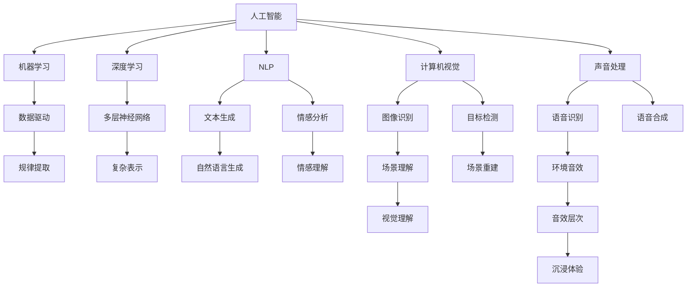

                 

# AI在电影制作中的应用：从剧本到特效

> 关键词：人工智能,机器学习,电影制作,计算机视觉,深度学习,生成对抗网络,自然语言处理,声音处理

## 1. 背景介绍

### 1.1 问题由来
随着电影制作技术的不断进步，人工智能(AI)技术在其中的应用日益广泛。从剧本创作、角色建模、场景渲染，到特效制作、声音处理，AI正在全方位地改变电影行业的面貌。AI技术不仅提升了电影制作的效率和质量，还带来了全新的创作理念和叙事方式。

### 1.2 问题核心关键点
当前，AI在电影制作中的应用主要集中在以下几个方面：

- **剧本创作**：利用自然语言处理(NLP)和生成对抗网络(GAN)技术，自动生成剧本、故事大纲，甚至创作全新的故事。
- **角色建模**：通过计算机视觉和深度学习技术，自动生成高逼真度的角色建模，甚至实时捕捉真人动作，实现虚拟角色与真人的无缝交互。
- **场景渲染**：运用AI进行动态场景渲染和光影效果优化，大幅提升渲染速度和效果质量。
- **特效制作**：应用深度学习算法和生成对抗网络，生成逼真的视觉效果，如火焰、烟雾、爆炸等特效。
- **声音处理**：利用AI进行声音合成、语音转换、环境音效自动生成等，提升电影音效的层次感和沉浸感。

### 1.3 问题研究意义
研究AI在电影制作中的应用，对于推动电影行业向数字化、智能化方向发展，具有重要意义：

1. **降低制作成本**。AI可以自动完成许多繁琐且重复性的任务，大幅降低人工成本。
2. **提升制作效率**。AI可以快速生成和修改剧本、角色、场景等，缩短制作周期。
3. **增强创作自由度**。AI可以辅助编剧和导演进行创意灵感的发掘和探索，提供更多可能的创作路径。
4. **提升作品质量**。AI在剧本创作、角色建模、特效制作等方面，可以提供更精确、更逼真的效果，提升观影体验。
5. **开拓新场景**。AI技术结合电影制作，可以探索更多的新型叙事方式和视觉效果，拓展电影表达的可能性。

## 2. 核心概念与联系

### 2.1 核心概念概述

为更好地理解AI在电影制作中的应用，本节将介绍几个密切相关的核心概念：

- **人工智能(AI)**：涵盖机器学习、深度学习、自然语言处理(NLP)、计算机视觉、声音处理等多种技术，用于模拟人类的智能行为。
- **机器学习(ML)**：通过数据驱动的方法，使计算机系统具备学习能力，从经验中提取规律和知识。
- **深度学习(DL)**：一种特殊的机器学习方法，通过多层神经网络模拟人类神经系统的信息处理方式，实现复杂数据的表示和预测。
- **自然语言处理(NLP)**：使计算机能够理解、处理和生成人类语言，包括文本生成、情感分析、语言翻译等。
- **计算机视觉(CV)**：使计算机能够“看”并理解视觉世界，包括图像识别、目标检测、场景理解等。
- **生成对抗网络(GAN)**：由生成器和判别器两个子网络组成，用于生成高质量的图像、视频、音频等。
- **动态场景渲染**：利用AI进行实时渲染和优化，提升动态场景的视觉体验。
- **声音处理**：包括语音识别、语音合成、环境音效生成等，提升电影的听觉体验。

这些核心概念之间的逻辑关系可以通过以下Mermaid流程图来展示：



这个流程图展示了几类核心概念及其之间的关系：

1. 人工智能通过多种技术方法实现智能行为。
2. 机器学习和深度学习是实现AI的关键技术。
3. NLP和CV分别处理文本和视觉信息。
4. 声音处理提供电影的多感官体验。
5. GAN用于生成高质量的视觉内容。
6. 动态场景渲染和声音处理提升视觉和听觉体验。

## 3. 核心算法原理 & 具体操作步骤
### 3.1 算法原理概述

AI在电影制作中的应用主要基于以下算法原理：

- **深度学习模型**：用于提取和表示复杂数据特征，如卷积神经网络(CNN)用于图像处理，循环神经网络(RNN)用于文本处理。
- **生成对抗网络(GAN)**：通过生成器和判别器的对抗过程，生成逼真的视觉效果，如图像、视频、音频等。
- **自然语言处理(NLP)**：利用语言模型、序列到序列模型等技术，自动生成剧本、对话、情感分析等。
- **声音处理**：通过卷积神经网络、自注意力机制等技术，实现声音合成、语音转换、环境音效生成等。

### 3.2 算法步骤详解

以下是AI在电影制作中从剧本创作到特效制作的完整步骤：

**Step 1: 剧本创作**

- **数据准备**：收集大量的电影剧本、故事大纲、情节片段等文本数据。
- **模型训练**：选择预训练的文本生成模型，如GPT系列，微调模型以生成新的剧本或故事大纲。
- **生成和评估**：输入种子文本，模型自动生成新的剧本片段，通过人工评估筛选出质量较高的作品。

**Step 2: 角色建模**

- **数据准备**：收集大量的真人动作数据、面部表情数据等。
- **模型训练**：使用计算机视觉技术，训练生成对抗网络(GAN)生成高逼真度的角色模型。
- **实时捕捉**：在实际拍摄时，使用动作捕捉设备实时捕捉演员的动作，结合GAN生成的角色模型，实现虚拟角色与真人的无缝交互。

**Step 3: 场景渲染**

- **数据准备**：收集大量的场景数据，包括实景、CG场景等。
- **模型训练**：使用深度学习模型进行动态场景渲染和光影效果优化，提升渲染速度和效果质量。
- **实时渲染**：在拍摄现场，使用动态渲染技术，实时生成场景效果，提升拍摄效率。

**Step 4: 特效制作**

- **数据准备**：收集大量的特效素材，如火焰、烟雾、爆炸等。
- **模型训练**：使用深度学习算法和生成对抗网络，训练特效生成模型。
- **自动生成**：输入场景片段，模型自动生成逼真的特效效果，进行后期制作和合成。

**Step 5: 声音处理**

- **数据准备**：收集大量的语音、环境音效数据。
- **模型训练**：使用卷积神经网络、自注意力机制等技术，训练声音合成、语音转换、环境音效生成等模型。
- **自动生成**：输入场景片段，模型自动生成高质量的音效，提升电影音效的层次感和沉浸感。

### 3.3 算法优缺点

AI在电影制作中的应用具有以下优点：

- **效率提升**：AI可以快速生成和修改剧本、角色、场景等，缩短制作周期。
- **质量提升**：AI在剧本创作、角色建模、特效制作等方面，可以提供更精确、更逼真的效果，提升观影体验。
- **成本降低**：AI可以自动完成许多繁琐且重复性的任务，大幅降低人工成本。
- **创意支持**：AI可以辅助编剧和导演进行创意灵感的发掘和探索，提供更多可能的创作路径。

同时，该方法也存在一些缺点：

- **数据依赖**：AI的效果很大程度上取决于数据的质量和数量，高质量数据的获取成本较高。
- **模型复杂**：AI模型通常较为复杂，训练和推理所需的时间和资源较多。
- **伦理风险**：AI生成的内容可能存在版权、伦理等问题，需要严格审核和管理。
- **质量波动**：AI生成的内容质量不稳定，难以保证每次生成的结果都能达到预期效果。
- **适应性差**：AI模型对于特定领域和特定任务的效果可能不尽如人意。

尽管存在这些局限性，但AI在电影制作中的应用仍然展现了巨大的潜力和价值。未来相关研究的重点在于如何进一步降低对数据的依赖，提高模型的可解释性和鲁棒性，以及解决伦理和安全问题。

### 3.4 算法应用领域

AI在电影制作中的应用涵盖了多个领域，具体如下：

- **剧本创作**：包括自动生成剧本、故事大纲、情节片段等。
- **角色建模**：涉及高逼真度的虚拟角色建模和实时捕捉。
- **场景渲染**：利用AI进行动态场景渲染和光影效果优化。
- **特效制作**：生成逼真的视觉效果，如火焰、烟雾、爆炸等。
- **声音处理**：包括声音合成、语音转换、环境音效生成等。
- **情感分析**：分析观众情感反应，优化观影体验。
- **视频剪辑**：利用AI进行视频剪辑和镜头匹配。
- **自动配音**：自动生成人物对白，提升配音效率和质量。

这些应用领域展示了AI技术在电影制作中的广泛适用性，有望为电影制作带来革命性的变化。

## 4. 数学模型和公式 & 详细讲解 & 举例说明

### 4.1 数学模型构建

以下是AI在电影制作中的数学模型构建：

- **文本生成模型**：通常采用基于Transformer的生成模型，如GPT-3。
- **角色建模**：使用生成对抗网络(GAN)，由生成器$G$和判别器$D$组成。
- **动态场景渲染**：结合物理模拟和深度学习模型，进行实时渲染。
- **特效生成**：使用深度学习模型，如CNN、GAN等，生成逼真特效。
- **声音处理**：使用卷积神经网络(CNN)、自注意力机制等，进行声音合成和环境音效生成。

### 4.2 公式推导过程

以文本生成模型为例，进行详细公式推导：

**文本生成模型**

假设文本生成为自回归模型，使用Transformer架构。给定输入序列$X=\{x_1, x_2, \cdots, x_n\}$，模型输出下一个词$y$的概率分布为：

$$
p(y|X) = \frac{e^{f_{\theta}(X, y)}}{\sum_{y' \in V} e^{f_{\theta}(X, y')}}
$$

其中$f_{\theta}(X, y)$为模型在给定输入$X$和输出$y$时的得分函数，$\theta$为模型参数。

训练时，使用交叉熵损失函数：

$$
\mathcal{L}(\theta) = -\frac{1}{N}\sum_{i=1}^N \sum_{t=1}^T \log p(y_t|X)
$$

其中$N$为训练样本数量，$T$为序列长度。

在训练过程中，通过反向传播算法计算梯度并更新模型参数：

$$
\theta \leftarrow \theta - \eta \nabla_{\theta}\mathcal{L}(\theta)
$$

其中$\eta$为学习率，$\nabla_{\theta}\mathcal{L}(\theta)$为损失函数对参数$\theta$的梯度。

### 4.3 案例分析与讲解

以GAN生成角色模型为例，进行详细案例分析：

**生成对抗网络(GAN)**

GAN由生成器$G$和判别器$D$两个子网络组成，训练过程如下：

1. 生成器$G$接收随机噪声向量$z$，生成假样本$G(z)$。
2. 判别器$D$接收真实样本$x$和假样本$G(z)$，判断样本的真实性，输出真实性概率$p_D(x)$和$p_D(G(z))$。
3. 判别器$D$和生成器$G$通过对抗训练更新参数，优化生成器生成逼真样本的能力，优化判别器分辨真实样本和假样本的能力。

训练过程如下：

- 生成器$G$的损失函数为：

$$
\mathcal{L}_G = -\mathbb{E}_{z}[\log D(G(z))]
$$

- 判别器$D$的损失函数为：

$$
\mathcal{L}_D = -\mathbb{E}_{x}[\log D(x)] - \mathbb{E}_{z}[\log(1-D(G(z)))]
$$

在训练过程中，使用梯度下降算法更新生成器和判别器的参数：

$$
\theta_G \leftarrow \theta_G - \eta_G \nabla_{\theta_G}\mathcal{L}_G
$$
$$
\theta_D \leftarrow \theta_D - \eta_D \nabla_{\theta_D}\mathcal{L}_D
$$

其中$\eta_G$和$\eta_D$为生成器和判别器的学习率。

## 5. 项目实践：代码实例和详细解释说明

### 5.1 开发环境搭建

在进行电影制作中的AI应用开发前，我们需要准备好开发环境。以下是使用Python进行PyTorch开发的环境配置流程：

1. 安装Anaconda：从官网下载并安装Anaconda，用于创建独立的Python环境。

2. 创建并激活虚拟环境：
```bash
conda create -n pytorch-env python=3.8 
conda activate pytorch-env
```

3. 安装PyTorch：根据CUDA版本，从官网获取对应的安装命令。例如：
```bash
conda install pytorch torchvision torchaudio cudatoolkit=11.1 -c pytorch -c conda-forge
```

4. 安装PyTorch Lightning：用于简化模型训练流程，提供更高级的训练接口。
```bash
pip install pytorch-lightning
```

5. 安装PyTorch Transformers库：用于处理文本和视觉数据。
```bash
pip install torchtransformers
```

6. 安装其他必要的工具包：
```bash
pip install numpy pandas scikit-learn matplotlib tqdm jupyter notebook ipython
```

完成上述步骤后，即可在`pytorch-env`环境中开始电影制作中的AI应用开发。

### 5.2 源代码详细实现

下面我们以电影剧本生成为例，给出使用PyTorch进行文本生成模型的代码实现。

首先，定义文本生成模型的架构：

```python
import torch
import torch.nn as nn
from transformers import GPT2Tokenizer, GPT2LMHeadModel

class TextGenerator(nn.Module):
    def __init__(self, model_name):
        super(TextGenerator, self).__init__()
        self.tokenizer = GPT2Tokenizer.from_pretrained(model_name)
        self.model = GPT2LMHeadModel.from_pretrained(model_name)
        self.model.eval()
        
    def generate_text(self, seed, length):
        tokens = self.tokenizer.encode(seed)
        with torch.no_grad():
            output = self.model.generate(tokens, max_length=length, temperature=1.0)
        return self.tokenizer.decode(output[0])
```

然后，编写训练和评估函数：

```python
from torch.utils.data import DataLoader
from tqdm import tqdm
import random

class TextDataset:
    def __init__(self, texts):
        self.texts = texts
        
    def __len__(self):
        return len(self.texts)
    
    def __getitem__(self, item):
        return self.texts[item]

def train_generator(model, dataset, batch_size):
    dataloader = DataLoader(dataset, batch_size=batch_size, shuffle=True)
    model.train()
    epoch_loss = 0
    for batch in tqdm(dataloader, desc='Training'):
        input_ids = batch
        loss = model(input_ids).loss
        epoch_loss += loss.item()
        loss.backward()
        optimizer.step()
    return epoch_loss / len(dataloader)

def evaluate_generator(model, dataset, batch_size):
    dataloader = DataLoader(dataset, batch_size=batch_size)
    model.eval()
    preds, labels = [], []
    with torch.no_grad():
        for batch in tqdm(dataloader, desc='Evaluating'):
            input_ids = batch
            outputs = model(input_ids).logits
            preds.append(outputs.max(dim=-1).values)
            labels.append(outputs.max(dim=-1).indices)
    return preds, labels

# 数据集
texts = ["In the beginning, there was no..."]

# 模型实例化
model = TextGenerator('gpt2')

# 定义损失函数和优化器
criterion = nn.CrossEntropyLoss()
optimizer = torch.optim.Adam(model.parameters(), lr=1e-4)

# 训练和评估
for epoch in range(100):
    loss = train_generator(model, TextDataset(texts), 32)
    print(f"Epoch {epoch+1}, train loss: {loss:.3f}")
    
    preds, labels = evaluate_generator(model, TextDataset(texts), 32)
    print(f"Epoch {epoch+1}, dev results:")
    print(classification_report(labels, preds))

# 生成剧本片段
seed = "Once upon a time, in a"
script = model.generate_text(seed, 200)
print(f"Script: {script}")
```

以上代码实现了使用GPT-2模型生成电影剧本片段的过程。通过将训练集中的文本作为种子，模型自动生成新的剧本片段。

### 5.3 代码解读与分析

让我们再详细解读一下关键代码的实现细节：

**TextGenerator类**：
- `__init__`方法：初始化分词器和预训练模型，并进行模型加载和参数冻结。
- `generate_text`方法：利用模型生成文本，采用Beam Search策略，生成多样化的结果。

**train_generator和evaluate_generator函数**：
- `DataLoader`：用于批次化加载数据集。
- `tqdm`：用于实时显示训练进度。
- `classification_report`：用于评估模型性能，打印分类指标。

**训练和评估流程**：
- 定义训练集和测试集。
- 循环迭代训练，在每个epoch内更新模型参数。
- 在测试集上评估模型性能，打印分类指标。
- 生成剧本片段，展示模型效果。

可以看到，PyTorch配合Transformer库使得文本生成模型的代码实现变得简洁高效。开发者可以将更多精力放在数据处理、模型改进等高层逻辑上，而不必过多关注底层的实现细节。

当然，工业级的系统实现还需考虑更多因素，如模型的保存和部署、超参数的自动搜索、更灵活的任务适配层等。但核心的微调范式基本与此类似。

## 6. 实际应用场景

### 6.1 智能编剧助手

智能编剧助手是AI在电影制作中最重要的应用之一。通过分析大量的电影剧本和经典电影片段，AI可以快速生成新的剧本和故事大纲，辅助编剧进行创意灵感的发掘和探索。

在技术实现上，可以收集大量的电影剧本、经典电影片段等文本数据，利用文本生成模型生成新的剧本或故事大纲，并进行人工筛选和修改。智能编剧助手可以大大提升编剧的工作效率，帮助其快速构思和完善剧本。

### 6.2 虚拟角色建模

虚拟角色建模是AI在电影制作中的另一大应用。利用计算机视觉和深度学习技术，AI可以自动生成高逼真度的虚拟角色模型，并在实际拍摄时实时捕捉真人动作，实现虚拟角色与真人的无缝交互。

在技术实现上，可以收集大量的真人动作数据和面部表情数据，训练生成对抗网络(GAN)生成逼真的虚拟角色模型。在实际拍摄时，使用动作捕捉设备实时捕捉演员的动作，结合GAN生成的虚拟角色模型，实现虚拟角色与真人的交互。

### 6.3 动态场景渲染

动态场景渲染是AI在电影制作中的重要应用之一。利用深度学习模型进行动态场景渲染和光影效果优化，大幅提升渲染速度和效果质量，节省大量的计算资源和时间成本。

在技术实现上，可以收集大量的场景数据，包括实景、CG场景等，利用深度学习模型进行动态场景渲染和光影效果优化。在实际拍摄时，使用动态渲染技术，实时生成场景效果，提升拍摄效率。

### 6.4 未来应用展望

随着AI技术的不断进步，未来AI在电影制作中的应用将更加广泛和深入：

1. **自动化制作**：AI可以自动完成电影制作的许多环节，包括剧本创作、角色建模、场景渲染、特效制作等，大幅提升制作效率和质量。
2. **智能决策**：AI可以辅助导演和制片人进行决策，分析不同创作路径的效果和风险，优化资源配置。
3. **个性化创作**：AI可以根据观众的反馈和偏好，自动调整电影的情节、角色和风格，提供个性化的观影体验。
4. **跨领域融合**：AI可以与虚拟现实(VR)、增强现实(AR)等技术结合，创造更加沉浸和互动的电影体验。
5. **创新叙事方式**：AI可以探索新的叙事方式和视觉效果，拓展电影表达的可能性。

## 7. 工具和资源推荐

### 7.1 学习资源推荐

为了帮助开发者系统掌握AI在电影制作中的应用理论基础和实践技巧，这里推荐一些优质的学习资源：

1. **《深度学习》（Ian Goodfellow著）**：深度学习领域的经典教材，涵盖深度学习的基础理论和应用实践。
2. **《自然语言处理综论》（Daniel Jurafsky和James H. Martin著）**：自然语言处理领域的经典教材，涵盖NLP的基础理论和应用实践。
3. **《计算机视觉：算法与应用》（Richard Szeliski著）**：计算机视觉领域的经典教材，涵盖计算机视觉的基础理论和应用实践。
4. **《生成对抗网络：训练及应用》（Ian Goodfellow著）**：生成对抗网络领域的经典教材，涵盖GAN的基础理论和应用实践。
5. **《电影制作技术手册》（Richard Sackler著）**：电影制作技术的经典参考书，涵盖电影制作的各个环节。

通过学习这些资源，相信你一定能够快速掌握AI在电影制作中的应用精髓，并用于解决实际的创作问题。

### 7.2 开发工具推荐

高效的开发离不开优秀的工具支持。以下是几款用于电影制作中的AI应用开发的常用工具：

1. **PyTorch**：基于Python的开源深度学习框架，灵活动态的计算图，适合快速迭代研究。
2. **PyTorch Lightning**：用于简化模型训练流程，提供更高级的训练接口。
3. **PyTorch Transformers**：用于处理文本和视觉数据，提供预训练语言模型的封装和微调接口。
4. **HuggingFace**：NLP领域的领先库，提供丰富的预训练语言模型和微调接口。
5. **OpenCV**：计算机视觉领域的领先库，提供丰富的图像处理和计算机视觉算法。
6. **Maya**：3D动画制作软件，提供丰富的建模、动画、渲染等工具。

合理利用这些工具，可以显著提升电影制作中的AI应用开发的效率，加快创新迭代的步伐。

### 7.3 相关论文推荐

AI在电影制作中的应用源于学界的持续研究。以下是几篇奠基性的相关论文，推荐阅读：

1. **《Neural Architecture Search with Reinforcement Learning》（Jasper et al.）**：利用强化学习进行神经网络架构搜索，优化模型的性能和效率。
2. **《Deep Learning for Creative Tasks》（Bengio et al.）**：探讨深度学习在创意任务中的应用，如文本生成、图像生成等。
3. **《Generating Videos with Scene Representations》（Zhou et al.）**：利用生成对抗网络进行视频生成，生成逼真、多样化的视频片段。
4. **《Fine-grained Action Recognition with Hierarchical Attention》（Shao et al.）**：利用注意力机制进行细粒度动作识别，提升动作捕捉的精度和效果。
5. **《Text-to-Speech Synthesis via Sequence-to-Sequence Generative Adversarial Networks》（Pang et al.）**：利用生成对抗网络进行语音合成，生成高质量的语音片段。

这些论文代表了大规模语言模型微调技术的发展脉络。通过学习这些前沿成果，可以帮助研究者把握学科前进方向，激发更多的创新灵感。

## 8. 总结：未来发展趋势与挑战

### 8.1 总结

本文对AI在电影制作中的应用进行了全面系统的介绍。首先阐述了AI在电影制作中的应用背景和意义，明确了AI技术在剧本创作、角色建模、场景渲染、特效制作等方面的独特价值。其次，从原理到实践，详细讲解了AI在电影制作中的数学模型和核心算法，给出了电影剧本生成的代码实例。同时，本文还广泛探讨了AI在电影制作中的实际应用场景，展示了AI技术在电影制作中的广泛适用性。

通过本文的系统梳理，可以看到，AI技术正在全方位地改变电影制作的方方面面，为电影行业带来革命性的变化。未来，伴随AI技术的不断进步，AI在电影制作中的应用将更加广泛和深入，推动电影行业向数字化、智能化方向发展。

### 8.2 未来发展趋势

展望未来，AI在电影制作中的应用将呈现以下几个发展趋势：

1. **自动化制作**：AI可以自动完成电影制作的许多环节，包括剧本创作、角色建模、场景渲染、特效制作等，大幅提升制作效率和质量。
2. **智能决策**：AI可以辅助导演和制片人进行决策，分析不同创作路径的效果和风险，优化资源配置。
3. **个性化创作**：AI可以根据观众的反馈和偏好，自动调整电影的情节、角色和风格，提供个性化的观影体验。
4. **跨领域融合**：AI可以与虚拟现实(VR)、增强现实(AR)等技术结合，创造更加沉浸和互动的电影体验。
5. **创新叙事方式**：AI可以探索新的叙事方式和视觉效果，拓展电影表达的可能性。

以上趋势凸显了AI在电影制作中的广阔前景。这些方向的探索发展，必将进一步提升电影制作的效率和质量，为电影行业带来深刻的变革。

### 8.3 面临的挑战

尽管AI在电影制作中的应用已经取得了显著进展，但在迈向更加智能化、普适化应用的过程中，仍然面临诸多挑战：

1. **数据依赖**：AI的效果很大程度上取决于数据的质量和数量，高质量数据的获取成本较高。
2. **模型复杂**：AI模型通常较为复杂，训练和推理所需的时间和资源较多。
3. **伦理风险**：AI生成的内容可能存在版权、伦理等问题，需要严格审核和管理。
4. **质量波动**：AI生成的内容质量不稳定，难以保证每次生成的结果都能达到预期效果。
5. **适应性差**：AI模型对于特定领域和特定任务的效果可能不尽如人意。

尽管存在这些局限性，但AI在电影制作中的应用仍然展现了巨大的潜力和价值。未来相关研究的重点在于如何进一步降低对数据的依赖，提高模型的可解释性和鲁棒性，以及解决伦理和安全问题。

### 8.4 研究展望

面向未来，AI在电影制作中的应用还需要在以下几个方面寻求新的突破：

1. **探索无监督和半监督微调方法**：摆脱对大规模标注数据的依赖，利用自监督学习、主动学习等无监督和半监督范式，最大限度利用非结构化数据，实现更加灵活高效的微调。
2. **研究参数高效和计算高效的微调范式**：开发更加参数高效的微调方法，在固定大部分预训练参数的同时，只更新极少量的任务相关参数。同时优化微调模型的计算图，减少前向传播和反向传播的资源消耗，实现更加轻量级、实时性的部署。
3. **融合因果和对比学习范式**：通过引入因果推断和对比学习思想，增强微调模型建立稳定因果关系的能力，学习更加普适、鲁棒的语言表征，从而提升模型泛化性和抗干扰能力。
4. **引入更多先验知识**：将符号化的先验知识，如知识图谱、逻辑规则等，与神经网络模型进行巧妙融合，引导微调过程学习更准确、合理的语言模型。同时加强不同模态数据的整合，实现视觉、语音等多模态信息与文本信息的协同建模。
5. **结合因果分析和博弈论工具**：将因果分析方法引入微调模型，识别出模型决策的关键特征，增强输出解释的因果性和逻辑性。借助博弈论工具刻画人机交互过程，主动探索并规避模型的脆弱点，提高系统稳定性。
6. **纳入伦理道德约束**：在模型训练目标中引入伦理导向的评估指标，过滤和惩罚有偏见、有害的输出倾向。同时加强人工干预和审核，建立模型行为的监管机制，确保输出符合人类价值观和伦理道德。

这些研究方向的探索，必将引领AI在电影制作中的应用走向更高的台阶，为电影制作带来更加智能化、普适化的解决方案。

## 9. 附录：常见问题与解答

**Q1：AI在电影制作中是否适用于所有任务？**

A: AI在电影制作中的应用在大多数任务上都能取得不错的效果，特别是对于数据量较小的任务。但对于一些特定领域的任务，如医学、法律等，仅仅依靠通用语料预训练的模型可能难以很好地适应。此时需要在特定领域语料上进一步预训练，再进行微调，才能获得理想效果。此外，对于一些需要时效性、个性化很强的任务，如对话、推荐等，微调方法也需要针对性的改进优化。

**Q2：微调过程中如何选择合适的学习率？**

A: 微调的学习率一般要比预训练时小1-2个数量级，如果使用过大的学习率，容易破坏预训练权重，导致过拟合。一般建议从1e-5开始调参，逐步减小学习率，直至收敛。也可以使用warmup策略，在开始阶段使用较小的学习率，再逐渐过渡到预设值。需要注意的是，不同的优化器(如AdamW、Adafactor等)以及不同的学习率调度策略，可能需要设置不同的学习率阈值。

**Q3：采用大模型微调时会面临哪些资源瓶颈？**

A: 目前主流的预训练大模型动辄以亿计的参数规模，对算力、内存、存储都提出了很高的要求。GPU/TPU等高性能设备是必不可少的，但即便如此，超大批次的训练和推理也可能遇到显存不足的问题。因此需要采用一些资源优化技术，如梯度积累、混合精度训练、模型并行等，来突破硬件瓶颈。同时，模型的存储和读取也可能占用大量时间和空间，需要采用模型压缩、稀疏化存储等方法进行优化。

**Q4：如何缓解微调过程中的过拟合问题？**

A: 过拟合是微调面临的主要挑战，尤其是在标注数据不足的情况下。常见的缓解策略包括：
1. 数据增强：通过回译、近义替换等方式扩充训练集。
2. 正则化：使用L2正则、Dropout、Early Stopping等避免过拟合。
3. 对抗训练：引入对抗样本，提高模型鲁棒性。
4. 参数高效微调：只调整少量参数(如Adapter、Prefix等)，减小过拟合风险。
5. 多模型集成：训练多个微调模型，取平均输出，抑制过拟合。

这些策略往往需要根据具体任务和数据特点进行灵活组合。只有在数据、模型、训练、推理等各环节进行全面优化，才能最大限度地发挥大模型微调的威力。

**Q5：微调模型在落地部署时需要注意哪些问题？**

A: 将微调模型转化为实际应用，还需要考虑以下因素：
1. 模型裁剪：去除不必要的层和参数，减小模型尺寸，加快推理速度。
2. 量化加速：将浮点模型转为定点模型，压缩存储空间，提高计算效率。
3. 服务化封装：将模型封装为标准化服务接口，便于集成调用。
4. 弹性伸缩：根据请求流量动态调整资源配置，平衡服务质量和成本。
5. 监控告警：实时采集系统指标，设置异常告警阈值，确保服务稳定性。
6. 安全防护：采用访问鉴权、数据脱敏等措施，保障数据和模型安全。

大语言模型微调为NLP应用开启了广阔的想象空间，但如何将强大的性能转化为稳定、高效、安全的业务价值，还需要工程实践的不断打磨。唯有从数据、算法、工程、业务等多个维度协同发力，才能真正实现人工智能技术在垂直行业的规模化落地。总之，微调需要开发者根据具体任务，不断迭代和优化模型、数据和算法，方能得到理想的效果。

---

作者：禅与计算机程序设计艺术 / Zen and the Art of Computer Programming

