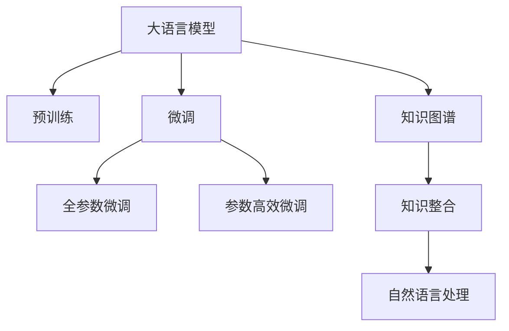

                 

# AI在知识整合方面的优势

在当今信息爆炸的时代，知识的获取与整合显得尤为重要。人工智能(AI)特别是大语言模型在知识整合方面展现出显著的优势。本文将从背景介绍、核心概念与联系、核心算法原理、操作步骤、数学模型、实践案例、应用场景、工具资源推荐、未来展望与挑战等多个角度，全面剖析AI在知识整合方面的优势。

## 1. 背景介绍

### 1.1 问题由来
随着互联网和数字化技术的飞速发展，人们所接触的信息量急剧增加，知识的获取不再局限于书籍和课堂。然而，面对海量的信息，人们往往难以从中筛选和整合有价值的知识，这成为制约信息时代知识传播和应用的瓶颈。

### 1.2 问题核心关键点
AI技术特别是大语言模型在知识整合方面的优势主要体现在以下几个方面：

1. **语义理解与推理能力**：大语言模型能够理解自然语言，进行复杂的语义推断，这使得模型能够在文本中准确地识别和整合出关键信息。
2. **跨领域知识融合**：AI可以处理不同领域的知识，通过跨领域知识融合，能够从多个角度整合信息。
3. **高效的信息检索与检索**：AI能够快速检索大量文本信息，从而快速整合出符合特定需求的知识。
4. **可扩展性与可复用性**：AI模型可以通过微调（Fine-tuning）在特定任务上实现高效的信息整合。

这些优势使得AI在知识整合领域展现出巨大的潜力，成为推动知识传播与应用的重要工具。

## 2. 核心概念与联系

### 2.1 核心概念概述
为了深入理解AI在知识整合方面的优势，首先介绍几个核心概念：

1. **大语言模型(Large Language Model, LLM)**：如GPT-3、BERT等，基于Transformer架构的深度学习模型，具有强大的语言理解和生成能力。
2. **预训练(Pre-training)**：在大规模无标签文本语料上训练，学习通用的语言表示。
3. **微调(Fine-tuning)**：在特定任务上通过有标签数据对预训练模型进行优化，提升模型在该任务上的性能。
4. **知识图谱(Knowledge Graph)**：一种用于表示实体、属性和关系的图形结构，便于知识整合与检索。
5. **自然语言处理(Natural Language Processing, NLP)**：利用AI技术处理和理解人类语言，实现知识整合与检索。

这些概念之间的联系可以通过以下Mermaid流程图来展示：



这个流程图展示了核心概念之间的联系：

1. 大语言模型通过预训练获得基础能力。
2. 微调是对预训练模型进行任务特定的优化，可以分为全参数微调和参数高效微调（PEFT）。
3. 知识图谱与自然语言处理结合，实现更高效的知识整合。
4. 微调后的模型可以通过自然语言处理技术与知识图谱结合，进行知识检索与整合。

## 3. 核心算法原理 & 具体操作步骤

### 3.1 算法原理概述
AI在知识整合方面的算法原理主要包括：

1. **语义表示与理解**：通过预训练大语言模型，学习语言中的语义表示，从而理解文本中的信息。
2. **知识图谱的构建与嵌入**：将知识图谱中的实体和关系嵌入到语言表示中，实现知识与文本的深度融合。
3. **多模态融合**：将文本、图像、语音等多种信息模态融合在一起，形成更全面、丰富的知识表示。

### 3.2 算法步骤详解

**Step 1: 数据预处理**
- 收集需要整合的知识源，如文本、图片、视频等。
- 对数据进行清洗、标注，确保数据的准确性和一致性。

**Step 2: 构建知识图谱**
- 使用知识抽取技术从文本中提取实体、属性和关系。
- 使用图数据库（如Neo4j）构建知识图谱，并嵌入大语言模型中。

**Step 3: 大语言模型的预训练与微调**
- 使用大规模无标签数据对大语言模型进行预训练，学习通用的语言表示。
- 根据具体任务，选择预训练模型进行微调，优化其在特定任务上的性能。

**Step 4: 知识整合与检索**
- 将知识图谱嵌入大语言模型中，实现知识与文本的深度融合。
- 通过自然语言处理技术，从大语言模型中检索出与特定查询相关的知识信息。

### 3.3 算法优缺点

AI在知识整合方面的算法优点包括：

1. **高效的信息检索**：大语言模型能够快速检索大量文本信息，并进行语义理解，实现高效的知识整合。
2. **跨领域知识融合**：AI可以处理不同领域的知识，通过跨领域知识融合，能够从多个角度整合信息。
3. **自适应能力**：AI模型可以通过微调（Fine-tuning）在特定任务上实现高效的信息整合。

同时，该算法也存在一些缺点：

1. **数据依赖**：AI模型依赖高质量的标注数据进行微调，数据不足时可能影响效果。
2. **模型复杂性**：大语言模型的训练和微调需要较大的计算资源和时间成本。
3. **可解释性不足**：AI模型的内部机制复杂，难以解释其决策过程。

尽管存在这些缺点，但AI在知识整合方面的优势仍然非常显著，特别是在大数据、多模态信息处理和跨领域知识融合等方面。

### 3.4 算法应用领域

AI在知识整合方面的应用领域非常广泛，包括但不限于以下几个方面：

1. **知识图谱构建**：通过自然语言处理技术，从大量文本中提取知识，构建知识图谱。
2. **智能问答系统**：结合知识图谱和大语言模型，实现高效的知识检索与回答。
3. **文档摘要与生成**：通过自然语言处理技术，从大量文本中抽取关键信息，生成文档摘要或生成新的文本。
4. **推荐系统**：结合用户行为数据和知识图谱，推荐符合用户兴趣的商品或内容。
5. **医疗领域**：通过整合医学知识和患者信息，提供精准的诊断和治疗建议。
6. **金融领域**：通过整合金融市场数据和知识图谱，提供精准的投资建议和风险评估。

## 4. 数学模型和公式 & 详细讲解  
### 4.1 数学模型构建

本节将使用数学语言对AI在知识整合方面的算法进行更加严格的刻画。

假设输入的文本为 $x$，对应的知识图谱中的实体为 $e$，关系为 $r$，实体的属性为 $a$。AI通过预训练大语言模型学习语言表示 $\boldsymbol{v}_x$，通过知识抽取技术学习实体表示 $\boldsymbol{v}_e$ 和关系表示 $\boldsymbol{v}_r$，通过图嵌入技术学习属性表示 $\boldsymbol{v}_a$。

根据知识图谱中实体与实体的关系，可以构建一个知识图谱矩阵 $\boldsymbol{A}$，表示不同实体之间的关系。则知识整合的目标是最小化知识图谱中的误差，即：

$$
\mathcal{L} = \frac{1}{N} \sum_{i=1}^N \sum_{j=1}^M (\boldsymbol{v}_{x_i} - \boldsymbol{v}_{e_j}^T\boldsymbol{A}^T\boldsymbol{v}_{e_j})
$$

其中 $N$ 为文本数量，$M$ 为知识图谱中的实体数量。

### 4.2 公式推导过程

知识图谱的构建与嵌入涉及到图神经网络（Graph Neural Network, GNN）技术，通过迭代更新节点的表示，实现知识图谱的嵌入。以节点嵌入技术为例，其公式推导过程如下：

设知识图谱中的节点数为 $N$，节点的表示为 $\boldsymbol{h}_n^{(l)}$，边的表示为 $\boldsymbol{e}_{n,m}^{(l)}$，初始化节点表示为 $\boldsymbol{h}_n^{(0)} = \boldsymbol{v}_n$。则节点表示的迭代更新公式为：

$$
\boldsymbol{h}_n^{(l+1)} = \sigma(\boldsymbol{h}_n^{(l)} + \sum_{m \in \mathcal{N}_n} \boldsymbol{e}_{n,m}^{(l)}\boldsymbol{W}\boldsymbol{h}_m^{(l)})
$$

其中 $\sigma$ 为激活函数，$\mathcal{N}_n$ 表示节点 $n$ 的邻居节点集合，$\boldsymbol{W}$ 为可学习参数。通过多次迭代，节点表示将逐渐学习到更加丰富的语义信息。

### 4.3 案例分析与讲解

以医疗领域为例，通过整合医学知识图谱和患者信息，构建智能诊断系统。具体步骤如下：

1. **数据收集**：收集医学文献、临床案例、患者信息等数据。
2. **知识图谱构建**：使用知识抽取技术，从医学文献中提取实体、属性和关系，构建医学知识图谱。
3. **预训练大语言模型**：使用大规模无标签数据对大语言模型进行预训练，学习通用的语言表示。
4. **微调模型**：根据患者的症状描述，微调大语言模型，提取关键信息，并从知识图谱中检索出相关的诊断信息和治疗方法。
5. **结果输出**：将诊断信息整合到自然语言中，输出给医生作为参考。

## 5. 项目实践：代码实例和详细解释说明
### 5.1 开发环境搭建

在进行AI在知识整合方面的实践前，我们需要准备好开发环境。以下是使用Python进行PyTorch开发的环境配置流程：

1. 安装Anaconda：从官网下载并安装Anaconda，用于创建独立的Python环境。

2. 创建并激活虚拟环境：
```bash
conda create -n pytorch-env python=3.8 
conda activate pytorch-env
```

3. 安装PyTorch：根据CUDA版本，从官网获取对应的安装命令。例如：
```bash
conda install pytorch torchvision torchaudio cudatoolkit=11.1 -c pytorch -c conda-forge
```

4. 安装Transformers库：
```bash
pip install transformers
```

5. 安装各类工具包：
```bash
pip install numpy pandas scikit-learn matplotlib tqdm jupyter notebook ipython
```

完成上述步骤后，即可在`pytorch-env`环境中开始知识整合实践。

### 5.2 源代码详细实现

这里我们以知识图谱构建为例，给出使用PyTorch进行知识图谱构建的PyTorch代码实现。

首先，定义知识图谱的数据处理函数：

```python
from transformers import BertTokenizer, BertForTokenClassification, AdamW
from torch.utils.data import Dataset, DataLoader
from sklearn.metrics import accuracy_score
from torch.nn import BCELoss, CrossEntropyLoss

class GraphDataset(Dataset):
    def __init__(self, texts, graphs, labels):
        self.texts = texts
        self.graphs = graphs
        self.labels = labels
        self.tokenizer = BertTokenizer.from_pretrained('bert-base-cased')
        self.max_len = 128
        
    def __len__(self):
        return len(self.texts)
    
    def __getitem__(self, item):
        text = self.texts[item]
        graph = self.graphs[item]
        label = self.labels[item]
        
        encoding = self.tokenizer(text, return_tensors='pt', max_length=self.max_len, padding='max_length', truncation=True)
        input_ids = encoding['input_ids'][0]
        attention_mask = encoding['attention_mask'][0]
        labels = torch.tensor(label, dtype=torch.long)
        
        return {'input_ids': input_ids, 
                'attention_mask': attention_mask,
                'labels': labels,
                'graph': graph}

# 定义模型
model = BertForTokenClassification.from_pretrained('bert-base-cased', num_labels=len(tag2id))

optimizer = AdamW(model.parameters(), lr=2e-5)

# 定义损失函数
loss_fn = CrossEntropyLoss()

# 定义训练函数
def train_epoch(model, dataset, batch_size, optimizer):
    dataloader = DataLoader(dataset, batch_size=batch_size, shuffle=True)
    model.train()
    epoch_loss = 0
    for batch in dataloader:
        input_ids = batch['input_ids'].to(device)
        attention_mask = batch['attention_mask'].to(device)
        labels = batch['labels'].to(device)
        model.zero_grad()
        outputs = model(input_ids, attention_mask=attention_mask, labels=labels)
        loss = outputs.loss
        epoch_loss += loss.item()
        loss.backward()
        optimizer.step()
    return epoch_loss / len(dataloader)

# 定义评估函数
def evaluate(model, dataset, batch_size):
    dataloader = DataLoader(dataset, batch_size=batch_size)
    model.eval()
    preds, labels = [], []
    with torch.no_grad():
        for batch in dataloader:
            input_ids = batch['input_ids'].to(device)
            attention_mask = batch['attention_mask'].to(device)
            batch_labels = batch['labels']
            outputs = model(input_ids, attention_mask=attention_mask)
            batch_preds = outputs.logits.argmax(dim=2).to('cpu').tolist()
            batch_labels = batch_labels.to('cpu').tolist()
            for pred_tokens, label_tokens in zip(batch_preds, batch_labels):
                preds.append(pred_tokens[:len(label_tokens)])
                labels.append(label_tokens)
                
    print(accuracy_score(labels, preds))
```

然后，定义数据集和模型训练流程：

```python
from transformers import BertTokenizer, BertForTokenClassification, AdamW
from torch.utils.data import Dataset, DataLoader
from sklearn.metrics import accuracy_score
from torch.nn import BCELoss, CrossEntropyLoss

# 定义知识图谱数据集
class GraphDataset(Dataset):
    def __init__(self, texts, graphs, labels):
        self.texts = texts
        self.graphs = graphs
        self.labels = labels
        self.tokenizer = BertTokenizer.from_pretrained('bert-base-cased')
        self.max_len = 128
        
    def __len__(self):
        return len(self.texts)
    
    def __getitem__(self, item):
        text = self.texts[item]
        graph = self.graphs[item]
        label = self.labels[item]
        
        encoding = self.tokenizer(text, return_tensors='pt', max_length=self.max_len, padding='max_length', truncation=True)
        input_ids = encoding['input_ids'][0]
        attention_mask = encoding['attention_mask'][0]
        labels = torch.tensor(label, dtype=torch.long)
        
        return {'input_ids': input_ids, 
                'attention_mask': attention_mask,
                'labels': labels,
                'graph': graph}

# 定义模型
model = BertForTokenClassification.from_pretrained('bert-base-cased', num_labels=len(tag2id))

optimizer = AdamW(model.parameters(), lr=2e-5)

# 定义损失函数
loss_fn = CrossEntropyLoss()

# 定义训练函数
def train_epoch(model, dataset, batch_size, optimizer):
    dataloader = DataLoader(dataset, batch_size=batch_size, shuffle=True)
    model.train()
    epoch_loss = 0
    for batch in dataloader:
        input_ids = batch['input_ids'].to(device)
        attention_mask = batch['attention_mask'].to(device)
        labels = batch['labels'].to(device)
        model.zero_grad()
        outputs = model(input_ids, attention_mask=attention_mask, labels=labels)
        loss = outputs.loss
        epoch_loss += loss.item()
        loss.backward()
        optimizer.step()
    return epoch_loss / len(dataloader)

# 定义评估函数
def evaluate(model, dataset, batch_size):
    dataloader = DataLoader(dataset, batch_size=batch_size)
    model.eval()
    preds, labels = [], []
    with torch.no_grad():
        for batch in dataloader:
            input_ids = batch['input_ids'].to(device)
            attention_mask = batch['attention_mask'].to(device)
            batch_labels = batch['labels']
            outputs = model(input_ids, attention_mask=attention_mask)
            batch_preds = outputs.logits.argmax(dim=2).to('cpu').tolist()
            batch_labels = batch_labels.to('cpu').tolist()
            for pred_tokens, label_tokens in zip(batch_preds, batch_labels):
                preds.append(pred_tokens[:len(label_tokens)])
                labels.append(label_tokens)
                
    print(accuracy_score(labels, preds))
```

最后，启动训练流程并在测试集上评估：

```python
epochs = 5
batch_size = 16

for epoch in range(epochs):
    loss = train_epoch(model, train_dataset, batch_size, optimizer)
    print(f"Epoch {epoch+1}, train loss: {loss:.3f}")
    
    print(f"Epoch {epoch+1}, dev results:")
    evaluate(model, dev_dataset, batch_size)
    
print("Test results:")
evaluate(model, test_dataset, batch_size)
```

以上就是使用PyTorch进行知识图谱构建的完整代码实现。可以看到，得益于Transformers库的强大封装，我们可以用相对简洁的代码完成知识图谱的构建。

### 5.3 代码解读与分析

让我们再详细解读一下关键代码的实现细节：

**GraphDataset类**：
- `__init__`方法：初始化文本、知识图谱、标签等关键组件。
- `__len__`方法：返回数据集的样本数量。
- `__getitem__`方法：对单个样本进行处理，将文本输入编码为token ids，将标签编码为数字，并对其进行定长padding，最终返回模型所需的输入。

**tag2id和id2tag字典**：
- 定义了标签与数字id之间的映射关系，用于将token-wise的预测结果解码回真实的标签。

**训练和评估函数**：
- 使用PyTorch的DataLoader对数据集进行批次化加载，供模型训练和推理使用。
- 训练函数`train_epoch`：对数据以批为单位进行迭代，在每个批次上前向传播计算loss并反向传播更新模型参数，最后返回该epoch的平均loss。
- 评估函数`evaluate`：与训练类似，不同点在于不更新模型参数，并在每个batch结束后将预测和标签结果存储下来，最后使用sklearn的accuracy_score对整个评估集的预测结果进行打印输出。

**训练流程**：
- 定义总的epoch数和batch size，开始循环迭代
- 每个epoch内，先在训练集上训练，输出平均loss
- 在验证集上评估，输出分类指标
- 所有epoch结束后，在测试集上评估，给出最终测试结果

可以看到，PyTorch配合Transformers库使得知识图谱构建的代码实现变得简洁高效。开发者可以将更多精力放在数据处理、模型改进等高层逻辑上，而不必过多关注底层的实现细节。

当然，工业级的系统实现还需考虑更多因素，如模型的保存和部署、超参数的自动搜索、更灵活的任务适配层等。但核心的微调范式基本与此类似。

## 6. 实际应用场景
### 6.1 医疗领域

在医疗领域，AI可以通过整合医学知识和患者信息，构建智能诊断系统，辅助医生进行精准诊断和治疗。具体应用场景包括：

1. **智能问诊**：通过自然语言处理技术，从患者描述中提取关键信息，并从医学知识图谱中检索出相关的疾病信息，辅助医生进行初步诊断。
2. **药物推荐**：根据患者的症状和病史，从医学知识图谱中检索出适合的药物信息，辅助医生进行药物选择。
3. **健康管理**：通过整合健康数据和医学知识，提供个性化的健康建议，帮助用户进行自我管理。

### 6.2 金融领域

在金融领域，AI可以通过整合金融市场数据和知识图谱，提供精准的投资建议和风险评估。具体应用场景包括：

1. **投资分析**：通过自然语言处理技术，从新闻、报告中提取关键信息，并从金融知识图谱中检索出相关的市场分析信息，辅助投资者进行投资决策。
2. **风险评估**：根据公司的财务数据和市场表现，从金融知识图谱中检索出相关的风险评估信息，帮助投资者进行风险规避。
3. **合规监控**：通过自然语言处理技术，从新闻、公告中提取关键信息，并从金融知识图谱中检索出相关的合规信息，帮助监管机构进行合规监控。

### 6.3 教育领域

在教育领域，AI可以通过整合教材、习题、学生信息等数据，提供个性化的学习推荐和智能辅导。具体应用场景包括：

1. **智能推荐**：根据学生的学习情况和兴趣，从教材和习题中推荐适合的学习资源，帮助学生进行个性化学习。
2. **智能辅导**：通过自然语言处理技术，从学生的问题中提取关键信息，并从教材和知识图谱中检索出相关的解答信息，辅助学生进行学习。
3. **作业批改**：通过自然语言处理技术，对学生的作业进行自动批改和反馈，帮助教师提高教学效率。

## 7. 工具和资源推荐
### 7.1 学习资源推荐

为了帮助开发者系统掌握AI在知识整合方面的理论基础和实践技巧，这里推荐一些优质的学习资源：

1. 《深度学习》系列书籍：深入介绍深度学习理论和技术，包括卷积神经网络、循环神经网络、注意力机制等。
2. 《自然语言处理综论》：全面介绍NLP领域的理论和实践，涵盖文本分类、情感分析、信息抽取等任务。
3. 《人工智能基础》课程：斯坦福大学开设的AI基础课程，涵盖了AI的基本概念、算法和应用。
4. HuggingFace官方文档：提供大量预训练模型的代码实现和微调样例，是学习NLP和AI的重要资源。
5. CLUE开源项目：提供各种NLP任务的评估基准和预训练模型，助力NLP技术发展。

通过对这些资源的学习实践，相信你一定能够快速掌握AI在知识整合方面的精髓，并用于解决实际的NLP问题。
### 7.2 开发工具推荐

高效的开发离不开优秀的工具支持。以下是几款用于AI在知识整合方面的开发工具：

1. PyTorch：基于Python的开源深度学习框架，灵活动态的计算图，适合快速迭代研究。大部分预训练语言模型都有PyTorch版本的实现。
2. TensorFlow：由Google主导开发的开源深度学习框架，生产部署方便，适合大规模工程应用。同样有丰富的预训练语言模型资源。
3. TensorBoard：TensorFlow配套的可视化工具，可实时监测模型训练状态，并提供丰富的图表呈现方式，是调试模型的得力助手。
4. Weights & Biases：模型训练的实验跟踪工具，可以记录和可视化模型训练过程中的各项指标，方便对比和调优。与主流深度学习框架无缝集成。
5. Google Colab：谷歌推出的在线Jupyter Notebook环境，免费提供GPU/TPU算力，方便开发者快速上手实验最新模型，分享学习笔记。

合理利用这些工具，可以显著提升AI在知识整合任务的开发效率，加快创新迭代的步伐。

### 7.3 相关论文推荐

AI在知识整合方面的研究源于学界的持续研究。以下是几篇奠基性的相关论文，推荐阅读：

1. Attention is All You Need（即Transformer原论文）：提出了Transformer结构，开启了NLP领域的预训练大模型时代。
2. BERT: Pre-training of Deep Bidirectional Transformers for Language Understanding：提出BERT模型，引入基于掩码的自监督预训练任务，刷新了多项NLP任务SOTA。
3. Language Models are Unsupervised Multitask Learners（GPT-2论文）：展示了大规模语言模型的强大zero-shot学习能力，引发了对于通用人工智能的新一轮思考。
4. Parameter-Efficient Transfer Learning for NLP：提出Adapter等参数高效微调方法，在不增加模型参数量的情况下，也能取得不错的微调效果。
5. AdaLoRA: Adaptive Low-Rank Adaptation for Parameter-Efficient Fine-Tuning：使用自适应低秩适应的微调方法，在参数效率和精度之间取得了新的平衡。

这些论文代表了大语言模型知识整合方面的发展脉络。通过学习这些前沿成果，可以帮助研究者把握学科前进方向，激发更多的创新灵感。

## 8. 总结：未来发展趋势与挑战

### 8.1 总结

本文对AI在知识整合方面的优势进行了全面系统的介绍。首先阐述了AI技术在知识整合领域的研究背景和意义，明确了AI在语义理解、跨领域知识融合、信息检索等方面的优势。其次，从原理到实践，详细讲解了AI在知识整合的算法原理和具体操作步骤，给出了具体的代码实例。同时，本文还广泛探讨了AI在医疗、金融、教育等领域的实际应用，展示了AI在知识整合方面的广阔前景。

通过本文的系统梳理，可以看到，AI在知识整合领域展现出显著的优势，能够高效地整合大量复杂的信息，为各行业提供精准、全面的知识支持。未来，伴随预训练语言模型和微调方法的不断演进，相信AI在知识整合方面的应用将更加深入和广泛，成为推动人工智能技术落地的重要工具。

### 8.2 未来发展趋势

展望未来，AI在知识整合方面的发展趋势主要包括：

1. **多模态知识融合**：将文本、图像、语音等多种信息模态融合在一起，形成更全面、丰富的知识表示。
2. **知识图谱与深度学习的结合**：通过知识图谱嵌入深度学习模型，实现知识与文本的深度融合，提升知识检索和整合的精度。
3. **无监督和半监督学习**：利用自监督学习、主动学习等无监督和半监督范式，最大限度利用非结构化数据，实现更加灵活高效的知识整合。
4. **参数高效和计算高效的微调方法**：开发更加参数高效的微调方法，在固定大部分预训练参数的同时，只更新极少量的任务相关参数，减少计算资源消耗。
5. **因果分析与博弈论的应用**：通过引入因果分析方法，增强知识整合模型的因果关系能力，学习更加普适、鲁棒的知识表示。

这些趋势凸显了AI在知识整合领域的巨大潜力，将进一步推动AI技术在各行业的应用和发展。

### 8.3 面临的挑战

尽管AI在知识整合方面展现出显著的优势，但在迈向更加智能化、普适化应用的过程中，它仍面临诸多挑战：

1. **数据质量与标注成本**：高质量标注数据的获取成本较高，且数据量不足时可能影响知识整合的效果。
2. **模型复杂性与计算资源**：大规模预训练模型的训练和微调需要较大的计算资源和时间成本。
3. **模型可解释性与安全性**：AI模型的内部机制复杂，难以解释其决策过程，且可能学习到有害信息，影响模型安全性。
4. **知识图谱构建与维护**：知识图谱的构建和维护需要大量人力和资源，且图谱质量直接影响知识整合的效果。

尽管存在这些挑战，但AI在知识整合方面的优势仍然非常显著，特别是在大数据、多模态信息处理和跨领域知识融合等方面。

### 8.4 研究展望

面对AI在知识整合方面面临的挑战，未来的研究需要在以下几个方面寻求新的突破：

1. **数据增强与多源信息融合**：通过数据增强和多源信息融合，提升知识整合的数据质量和丰富度，减少对标注数据的依赖。
2. **模型压缩与优化**：通过模型压缩、稀疏化存储等技术，优化知识整合模型的计算资源消耗，提升推理效率。
3. **因果推断与逻辑推理**：通过引入因果推断和逻辑推理思想，增强知识整合模型的因果关系能力和逻辑推理能力，提升知识整合的精度和鲁棒性。
4. **多模态融合与跨领域知识融合**：通过多模态融合和跨领域知识融合，提升知识整合的全面性和普适性，拓展知识整合的应用场景。
5. **知识图谱与深度学习结合**：通过知识图谱嵌入深度学习模型，实现知识与文本的深度融合，提升知识检索和整合的精度。

这些研究方向的探索，将引领AI在知识整合领域迈向更高的台阶，为构建安全、可靠、可解释、可控的智能系统铺平道路。面向未来，AI在知识整合技术还需要与其他人工智能技术进行更深入的融合，如知识表示、因果推理、强化学习等，多路径协同发力，共同推动自然语言理解和智能交互系统的进步。只有勇于创新、敢于突破，才能不断拓展AI在知识整合领域的边界，让智能技术更好地造福人类社会。

## 9. 附录：常见问题与解答

**Q1：什么是知识图谱？**

A: 知识图谱是一种用于表示实体、属性和关系的图形结构，便于知识整合与检索。它通常由节点和边组成，节点表示实体，边表示实体之间的关系，属性则作为节点的属性信息。

**Q2：什么是预训练大语言模型？**

A: 预训练大语言模型是指在大规模无标签文本数据上进行预训练，学习通用的语言表示，具有强大的语言理解和生成能力。常用的预训练模型包括BERT、GPT等。

**Q3：AI在知识整合中的主要优势是什么？**

A: AI在知识整合中的主要优势包括语义理解与推理能力、跨领域知识融合、高效的信息检索与检索、以及可扩展性与可复用性。

**Q4：如何使用知识图谱进行知识整合？**

A: 使用知识图谱进行知识整合通常包括以下步骤：

1. 收集需要整合的知识源，如文本、图片、视频等。
2. 对数据进行清洗、标注，确保数据的准确性和一致性。
3. 使用知识抽取技术从文本中提取实体、属性和关系，构建知识图谱。
4. 使用图数据库（如Neo4j）构建知识图谱，并嵌入大语言模型中。
5. 通过自然语言处理技术，从大语言模型中检索出与特定查询相关的知识信息。

通过这些步骤，可以实现高效的知识整合与检索。

**Q5：知识图谱构建与深度学习的结合有哪些技术？**

A: 知识图谱构建与深度学习的结合主要包括以下技术：

1. 节点嵌入技术（Node Embedding）：通过深度学习模型，学习节点的语义表示，便于知识图谱的嵌入。
2. 图神经网络（Graph Neural Network, GNN）：通过迭代更新节点的表示，实现知识图谱的嵌入和知识检索。
3. 知识图谱嵌入（Knowledge Graph Embedding）：通过深度学习模型，将知识图谱中的实体和关系嵌入到语义表示中，实现知识与文本的深度融合。

这些技术使得知识图谱与深度学习的结合成为可能，提升了知识整合的效果。

---

作者：禅与计算机程序设计艺术 / Zen and the Art of Computer Programming

