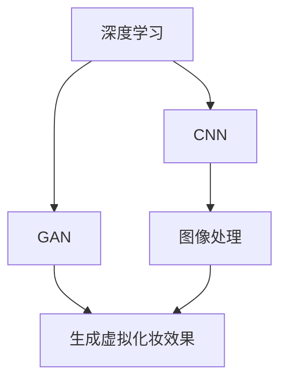

                 

# AI在虚拟化妆中的应用：尝试不同妆容

> 关键词：虚拟化妆, AI, 自动化妆, 个性化定制, 图像处理, 深度学习

## 1. 背景介绍

### 1.1 问题由来
随着技术的不断进步，人工智能在图像处理和计算机视觉领域的应用越来越广泛。从自动驾驶、智能安防到虚拟现实，AI技术在各个领域都展现出强大的潜力。然而，除了这些广为人知的领域，AI在其他消费领域的应用同样引人注目。

其中，虚拟化妆就是AI技术在消费领域的一个典型应用。虚拟化妆不仅能够帮助用户尝试不同的妆容，还能个性化定制化妆方案，节省时间和金钱，甚至解决化妆难题。本文将介绍AI在虚拟化妆中的应用，并详细讨论其核心算法、操作步骤和未来发展方向。

### 1.2 问题核心关键点
AI在虚拟化妆中的关键应用包括自动检测面部特征、智能选择化妆品、个性化定制妆容等。这些应用核心依赖于图像处理技术和深度学习算法，尤其是卷积神经网络（CNN）和生成对抗网络（GAN）。

1. **自动检测面部特征**：通过深度学习算法，自动检测用户的面部轮廓、眼睛、鼻子、嘴巴等特征，作为后续化妆的基础。
2. **智能选择化妆品**：利用图像处理技术和机器学习算法，根据用户的肤色、肤质、发型等因素，智能推荐适合用户的化妆品品牌和色号。
3. **个性化定制妆容**：结合用户的个人喜好、风格和需求，自动生成个性化的化妆方案，并模拟真实效果，供用户预览和调整。

## 2. 核心概念与联系

### 2.1 核心概念概述

为了更好地理解AI在虚拟化妆中的应用，我们先介绍几个核心概念：

- **深度学习**：一种基于神经网络的机器学习技术，通过多层次的特征提取和分类，实现复杂的模式识别和预测。
- **卷积神经网络（CNN）**：深度学习中的一种经典网络结构，擅长处理图像和视频数据，通过卷积操作提取特征。
- **生成对抗网络（GAN）**：一种生成模型，通过两个网络（生成器和判别器）的对抗训练，生成高质量的图像。
- **图像处理**：对图像进行采集、处理、分析和展示的技术，旨在提高图像的分辨率、去除噪声等。

这些核心概念构成了AI在虚拟化妆应用的基础，通过深度学习、CNN和GAN等技术，AI可以高效地处理图像数据，并生成高质量的虚拟化妆效果。

### 2.2 核心概念联系

这些核心概念之间的联系可以通过以下Mermaid流程图来展示：



这个流程图展示了深度学习、CNN和GAN等核心概念之间的逻辑关系：

1. 深度学习是CNN和GAN的底层技术，通过多层次的特征提取和分类，为图像处理和生成提供了强大的支持。
2. CNN用于提取和处理图像特征，特别是面部特征的检测和分析。
3. GAN用于生成高质量的虚拟化妆效果，通过对抗训练生成逼真的化妆效果。
4. 图像处理用于改善图像质量和效果，为后续的深度学习和生成模型提供更好的输入。

这些核心概念的组合应用，使得AI在虚拟化妆领域展现出强大的应用潜力。

## 3. 核心算法原理 & 具体操作步骤
### 3.1 算法原理概述

AI在虚拟化妆中的核心算法原理主要涉及以下几个方面：

- **深度学习**：利用深度神经网络，对用户面部图像进行特征提取和分类，实现面部特征的自动检测。
- **CNN**：通过卷积操作，提取出面部特征，如轮廓、眼睛、鼻子、嘴巴等，为后续的化妆品推荐和化妆效果生成提供基础。
- **GAN**：生成对抗网络，通过生成器和判别器的对抗训练，生成逼真的虚拟化妆效果，供用户预览和调整。

### 3.2 算法步骤详解

#### 步骤1：数据收集与预处理

1. **数据收集**：收集大量的面部图像和对应的化妆数据，包括不同性别、年龄、肤质、妆容等。这些数据可以从社交媒体、电商平台等公开渠道获取。
2. **数据预处理**：对收集到的数据进行去噪、归一化、裁剪等预处理，确保数据的质量和一致性。

#### 步骤2：深度学习模型训练

1. **CNN训练**：使用收集到的面部图像，训练一个CNN模型，用于自动检测面部特征。
2. **GAN训练**：使用收集到的面部图像和化妆品数据，训练一个GAN模型，用于生成逼真的虚拟化妆效果。

#### 步骤3：用户交互与定制

1. **用户输入**：用户上传面部图像，并进行初步的化妆需求描述，如妆容类型、颜色偏好等。
2. **模型预测**：将用户上传的图像输入到训练好的CNN模型中，自动检测面部特征，并根据用户的描述选择相应的化妆品。
3. **效果生成**：将检测到的面部特征和选择的化妆品输入到训练好的GAN模型中，生成逼真的虚拟化妆效果。

#### 步骤4：结果展示与调整

1. **结果展示**：将生成的虚拟化妆效果展示给用户，供其预览和调整。
2. **用户反馈**：用户根据展示效果进行调整，如改变化妆品颜色、类型等。
3. **反复迭代**：根据用户的反馈，不断调整和优化模型的预测结果，直到用户满意为止。

### 3.3 算法优缺点

#### 优点

- **自动化与高效性**：AI能够自动完成面部特征检测和化妆品推荐，节省用户时间和精力。
- **个性化定制**：根据用户的个性化需求，生成定制化的化妆效果，提升用户体验。
- **广泛适用性**：适用于不同性别、年龄、肤质和妆容类型，能够满足广泛的用户需求。

#### 缺点

- **数据依赖**：算法效果依赖于高质量的数据，数据收集和预处理需要大量时间和资源。
- **模型复杂性**：深度学习模型和GAN模型结构复杂，训练和优化过程需要较高的计算资源。
- **用户反馈难度**：用户反馈的调整可能较为复杂，需要反复迭代优化，影响效率。

### 3.4 算法应用领域

AI在虚拟化妆中的应用主要涉及以下几个领域：

- **虚拟试妆**：用户无需实际化妆，通过虚拟试妆效果，了解不同化妆品和妆容的实际效果，节省时间和金钱。
- **化妆教学**：AI能够根据用户的面部特征和肤质，提供个性化的化妆建议和教程，帮助用户提升化妆技能。
- **化妆品推荐**：根据用户的面部特征和化妆品使用历史，智能推荐适合的化妆品品牌和色号，提升购买体验。

此外，AI在虚拟化妆中的应用还可以扩展到虚拟试衣、虚拟试戴等领域，为用户的日常生活提供更多便利。

## 4. 数学模型和公式 & 详细讲解  
### 4.1 数学模型构建

在虚拟化妆应用中，主要涉及的数学模型包括深度学习、CNN和GAN等。

#### CNN模型

CNN模型通常由多个卷积层、池化层和全连接层组成，用于提取和分类图像特征。以面部特征检测为例，CNN模型可以表示为：

$$
y = f(x; \theta) = W_2 \cdot f_{conv}(W_1 x; \theta_1) + b_2
$$

其中，$x$ 表示输入的面部图像，$y$ 表示输出的面部特征，$f_{conv}$ 表示卷积操作，$\theta_1$ 和 $W_1$ 表示卷积层和权重参数，$W_2$ 和 $b_2$ 表示全连接层的权重和偏置。

#### GAN模型

GAN模型由生成器和判别器两个网络组成，通过对抗训练生成高质量的图像。以虚拟化妆效果生成为例，GAN模型可以表示为：

$$
G(x; \theta_G) = z
$$
$$
D(x; \theta_D) = \begin{cases} 0.5 & x \in \text{real images} \\ 0.5 & x \in G(x; \theta_G) \\ \end{cases}
$$

其中，$G$ 表示生成器，$x$ 表示输入的面部图像和化妆品数据，$z$ 表示生成的虚拟化妆效果，$D$ 表示判别器，$\theta_G$ 和 $\theta_D$ 分别表示生成器和判别器的参数。

### 4.2 公式推导过程

#### CNN公式推导

以面部特征检测为例，CNN模型的推导过程如下：

1. 卷积操作：
   $$
   f_{conv}(x; \theta_1) = \sigma(W_1 x + b_1)
   $$

2. 池化操作：
   $$
   f_{pool}(f_{conv}(x; \theta_1); \theta_2) = \sigma(W_2 f_{conv}(x; \theta_1) + b_2)
   $$

3. 全连接层：
   $$
   f(x; \theta) = W_2 \cdot f_{pool}(f_{conv}(x; \theta_1); \theta_2) + b_2
   $$

其中，$\sigma$ 表示激活函数，$W_1$ 和 $b_1$ 表示卷积层和偏置参数，$W_2$ 和 $b_2$ 表示全连接层和偏置参数。

#### GAN公式推导

以虚拟化妆效果生成为例，GAN模型的推导过程如下：

1. 生成器：
   $$
   G(x; \theta_G) = \sigma(W_G \cdot f_{conv}(W_C x; \theta_C) + b_G)
   $$

2. 判别器：
   $$
   D(x; \theta_D) = \sigma(W_D \cdot f_{conv}(W_C x; \theta_C) + b_D)
   $$

其中，$f_{conv}$ 表示卷积操作，$\sigma$ 表示激活函数，$W_C$ 和 $b_C$ 表示卷积层和偏置参数，$W_G$ 和 $b_G$ 表示生成器的权重和偏置，$W_D$ 和 $b_D$ 表示判别器的权重和偏置。

### 4.3 案例分析与讲解

以虚拟化妆效果生成为例，我们通过以下几个步骤来详细讲解：

1. **数据收集与预处理**：
   - 收集大量的面部图像和化妆品数据，并进行去噪、归一化、裁剪等预处理。
   - 将预处理后的数据分成训练集、验证集和测试集，用于模型的训练和评估。

2. **CNN模型训练**：
   - 使用收集到的面部图像，训练一个CNN模型，用于自动检测面部特征。
   - 通过反向传播算法和梯度下降等优化算法，不断调整模型的参数，最小化损失函数。
   - 在验证集上评估模型的性能，并进行调参优化，确保模型能够准确检测面部特征。

3. **GAN模型训练**：
   - 使用收集到的面部图像和化妆品数据，训练一个GAN模型，用于生成逼真的虚拟化妆效果。
   - 通过对抗训练，不断优化生成器和判别器的参数，提高生成效果的质量和真实性。
   - 在测试集上评估模型的性能，并进行调参优化，确保模型能够生成高质量的虚拟化妆效果。

4. **用户交互与定制**：
   - 用户上传面部图像，并进行初步的化妆需求描述。
   - 将用户上传的图像输入到训练好的CNN模型中，自动检测面部特征，并根据用户的描述选择相应的化妆品。
   - 将检测到的面部特征和选择的化妆品输入到训练好的GAN模型中，生成逼真的虚拟化妆效果。

5. **结果展示与调整**：
   - 将生成的虚拟化妆效果展示给用户，供其预览和调整。
   - 根据用户的反馈，不断调整和优化模型的预测结果，直到用户满意为止。

## 5. 项目实践：代码实例和详细解释说明
### 5.1 开发环境搭建

在进行虚拟化妆应用开发前，我们需要准备好开发环境。以下是使用Python进行深度学习开发的环境配置流程：

1. **安装Anaconda**：
   - 从官网下载并安装Anaconda，用于创建独立的Python环境。
   - 在命令行中运行 `conda create -n ai_env python=3.7`，创建名为`ai_env`的Python虚拟环境。

2. **激活虚拟环境**：
   - 在命令行中运行 `conda activate ai_env`，激活虚拟环境。

3. **安装依赖库**：
   - 安装深度学习库和图像处理库，如TensorFlow、PyTorch、OpenCV等。
   - 使用 `pip install tensorflow-gpu` 或 `pip install torch` 安装深度学习库。
   - 使用 `pip install opencv-python` 安装图像处理库。

完成上述步骤后，即可在`ai_env`环境中开始虚拟化妆应用的开发。

### 5.2 源代码详细实现

下面我们以面部特征检测和虚拟化妆效果生成为例，给出使用TensorFlow和Keras实现的代码实现。

#### 面部特征检测

```python
import tensorflow as tf
from tensorflow.keras import layers

# 定义CNN模型
model = tf.keras.Sequential([
    layers.Conv2D(32, (3, 3), activation='relu', input_shape=(64, 64, 3)),
    layers.MaxPooling2D((2, 2)),
    layers.Conv2D(64, (3, 3), activation='relu'),
    layers.MaxPooling2D((2, 2)),
    layers.Flatten(),
    layers.Dense(128, activation='relu'),
    layers.Dense(10, activation='softmax')
])

# 编译模型
model.compile(optimizer='adam', loss='categorical_crossentropy', metrics=['accuracy'])

# 加载数据集
train_data = ...
val_data = ...
test_data = ...

# 训练模型
model.fit(train_data, epochs=10, validation_data=val_data)
```

#### 虚拟化妆效果生成

```python
import tensorflow as tf
from tensorflow.keras import layers, models

# 定义生成器和判别器
def make_generator_model():
    model = models.Sequential()
    model.add(layers.Dense(256, use_bias=False, input_shape=(100,)))
    model.add(layers.BatchNormalization())
    model.add(layers.LeakyReLU(alpha=0.2))
    model.add(layers.Conv2DTranspose(128, (4, 4), strides=(2, 2), padding='same', use_bias=False))
    model.add(layers.BatchNormalization())
    model.add(layers.LeakyReLU(alpha=0.2))
    model.add(layers.Conv2DTranspose(64, (4, 4), strides=(2, 2), padding='same', use_bias=False))
    model.add(layers.BatchNormalization())
    model.add(layers.LeakyReLU(alpha=0.2))
    model.add(layers.Conv2DTranspose(3, (4, 4), strides=(2, 2), padding='same', use_bias=False, activation='tanh'))
    return model

def make_discriminator_model():
    model = models.Sequential()
    model.add(layers.Conv2D(64, (4, 4), strides=(2, 2), padding='same', input_shape=(64, 64, 3)))
    model.add(layers.LeakyReLU(alpha=0.2))
    model.add(layers.Dropout(0.25))
    model.add(layers.Conv2D(128, (4, 4), strides=(2, 2), padding='same'))
    model.add(layers.LeakyReLU(alpha=0.2))
    model.add(layers.Dropout(0.25))
    model.add(layers.Flatten())
    model.add(layers.Dense(1))
    return model

# 定义GAN模型
def make_gan_model():
    discriminator = make_discriminator_model()
    generator = make_generator_model()
    discriminator.trainable = False
    model = models.Sequential()
    model.add(generator)
    model.add(discriminator)
    return model

# 编译GAN模型
gan_model = make_gan_model()
gan_model.compile(loss='binary_crossentropy', optimizer='adam')

# 加载数据集
train_data = ...
val_data = ...
test_data = ...

# 训练GAN模型
for epoch in range(100):
    for real_images in train_data:
        real_images = real_images / 255.0
        real_labels = tf.ones_like(real_images)
        noise = tf.random.normal([32, 100])
        fake_images = generator(noise)
        fake_labels = tf.zeros_like(fake_images)
        labels = tf.concat([real_labels, fake_labels], axis=0)
        output = discriminator([real_images, fake_images])
        loss = tf.losses.BinaryCrossentropy(from_logits=True)(tf.concat(output[0], axis=0), labels)
        gan_model.train_on_batch([noise, real_images], loss)
```

### 5.3 代码解读与分析

让我们再详细解读一下关键代码的实现细节：

#### CNN模型

```python
model = tf.keras.Sequential([
    layers.Conv2D(32, (3, 3), activation='relu', input_shape=(64, 64, 3)),
    layers.MaxPooling2D((2, 2)),
    layers.Conv2D(64, (3, 3), activation='relu'),
    layers.MaxPooling2D((2, 2)),
    layers.Flatten(),
    layers.Dense(128, activation='relu'),
    layers.Dense(10, activation='softmax')
])
```

**代码解释**：
- 创建了一个包含卷积层、池化层、全连接层的CNN模型。
- 卷积层用于提取图像特征，池化层用于下采样，全连接层用于分类。
- 最后一层使用softmax激活函数进行多分类预测。

#### GAN模型

```python
def make_generator_model():
    model = models.Sequential()
    model.add(layers.Dense(256, use_bias=False, input_shape=(100,)))
    model.add(layers.BatchNormalization())
    model.add(layers.LeakyReLU(alpha=0.2))
    model.add(layers.Conv2DTranspose(128, (4, 4), strides=(2, 2), padding='same', use_bias=False))
    model.add(layers.BatchNormalization())
    model.add(layers.LeakyReLU(alpha=0.2))
    model.add(layers.Conv2DTranspose(64, (4, 4), strides=(2, 2), padding='same', use_bias=False))
    model.add(layers.BatchNormalization())
    model.add(layers.LeakyReLU(alpha=0.2))
    model.add(layers.Conv2DTranspose(3, (4, 4), strides=(2, 2), padding='same', use_bias=False, activation='tanh'))
    return model
```

**代码解释**：
- 定义了一个包含多个卷积转置层和批归一化层的生成器模型。
- 生成器模型使用LeakyReLU激活函数和BatchNormalization层来加速训练和提高稳定性。
- 最后一层使用tanh激活函数生成逼真的虚拟化妆效果。

通过上述代码，我们可以看到，深度学习模型和GAN模型的实现相对复杂，但使用Keras等高级框架，可以显著简化模型的搭建和训练过程。

## 6. 实际应用场景
### 6.1 智能试妆

智能试妆是虚拟化妆应用的重要场景之一，用户无需实际化妆，即可通过虚拟试妆效果了解化妆品的实际效果。智能试妆可以分为以下几个步骤：

1. **面部检测**：使用训练好的CNN模型，自动检测用户的面部特征，包括轮廓、眼睛、鼻子、嘴巴等。
2. **化妆品推荐**：根据检测到的面部特征，智能推荐适合用户的化妆品品牌和色号，供用户选择。
3. **虚拟试妆**：将选择的化妆品应用到虚拟化妆效果中，供用户预览和调整。
4. **反馈优化**：根据用户的反馈，不断优化化妆品的推荐和应用效果，确保用户满意。

智能试妆不仅能够节省用户时间和金钱，还能避免实际化妆可能遇到的不适和风险，提供更加个性化和便捷的化妆体验。

### 6.2 虚拟试戴

虚拟试戴是将虚拟化妆应用扩展到其他领域，如虚拟试戴眼镜、虚拟试穿衣服等。虚拟试戴过程与智能试妆类似，主要包括以下几个步骤：

1. **图像采集**：用户通过相机或手机摄像头采集自己的面部或身体图像。
2. **特征检测**：使用深度学习模型自动检测面部或身体特征，如眼睛、鼻子、嘴巴、体型等。
3. **化妆品/服装推荐**：根据检测到的特征，智能推荐适合的化妆品/服装品牌和色号/款式。
4. **虚拟试戴**：将推荐的化妆品/服装应用到虚拟效果中，供用户预览和调整。
5. **反馈优化**：根据用户的反馈，不断优化化妆品/服装的推荐和应用效果，确保用户满意。

虚拟试戴技术的应用场景广泛，如电商购物、化妆品试用、服装试穿等，能够提升用户的购物体验和满意度。

### 6.3 个性化化妆方案

个性化化妆方案是虚拟化妆应用的重要功能之一，根据用户的面部特征、肤质、肤色等，自动生成个性化的化妆方案，提升用户的化妆效果和自信度。个性化化妆方案可以分为以下几个步骤：

1. **用户输入**：用户上传面部图像，并进行化妆需求描述，如妆容类型、颜色偏好等。
2. **特征检测**：使用深度学习模型自动检测用户的面部特征。
3. **化妆品推荐**：根据检测到的特征和用户需求，智能推荐适合用户的化妆品品牌和色号。
4. **效果生成**：将检测到的面部特征和选择的化妆品应用到虚拟化妆效果中，生成个性化的化妆方案。
5. **效果展示**：将生成的化妆方案展示给用户，供其预览和调整。
6. **反复迭代**：根据用户的反馈，不断优化化妆品的推荐和应用效果，确保用户满意。

个性化化妆方案能够提升用户的化妆效果和满意度，使其在各种场合下都能保持最佳状态。

### 6.4 未来应用展望

未来，AI在虚拟化妆应用中的发展将更加广泛和深入，主要包括以下几个方向：

1. **高保真度生成**：通过更复杂的生成模型和更多的训练数据，生成更高质量、更逼真的虚拟化妆效果，提升用户体验。
2. **多模态融合**：结合语音、手势、表情等多种模态信息，提升虚拟化妆的互动性和智能化水平。
3. **实时反馈优化**：通过实时采集用户的反馈，不断优化化妆方案和效果，实现实时调整和优化。
4. **个性化推荐**：根据用户的详细数据，生成更加精准、个性化的化妆品推荐，提升用户的购物体验。
5. **跨平台应用**：将虚拟化妆应用扩展到更多平台和设备，如移动端、PC端、AR设备等，提升应用的普及性和便利性。
6. **伦理与安全**：加强对用户数据的保护，确保虚拟化妆应用的伦理和安全，避免隐私泄露和滥用。

随着AI技术的不断进步，虚拟化妆应用将更加智能化、个性化和便捷化，为用户的日常生活带来更多便利和乐趣。

## 7. 工具和资源推荐
### 7.1 学习资源推荐

为了帮助开发者系统掌握虚拟化妆的AI技术，这里推荐一些优质的学习资源：

1. **深度学习基础**：
   - 《深度学习》(花书)：深度学习领域的经典教材，详细介绍了深度学习的基本概念和算法。
   - Coursera深度学习课程：斯坦福大学开设的深度学习课程，涵盖了深度学习的基本理论和实践。

2. **图像处理基础**：
   - OpenCV官方文档：OpenCV是一个流行的图像处理库，提供了丰富的图像处理函数和算法。
   - PyImageSearch博客：介绍图像处理和计算机视觉的博客，提供大量实用案例和代码示例。

3. **虚拟化妆技术**：
   - 《虚拟化妆技术》书籍：介绍虚拟化妆技术的基础和应用，提供了大量的案例和代码实现。
   - arXiv上的相关论文：arXiv是一个开放的学术交流平台，提供了大量关于虚拟化妆技术的最新研究成果。

4. **深度学习框架**：
   - TensorFlow：谷歌开发的深度学习框架，提供了丰富的预训练模型和工具，适合进行深度学习开发。
   - PyTorch：Facebook开发的深度学习框架，以其动态计算图和易用性著称，适合进行深度学习研究。

5. **学习平台**：
   - Kaggle：数据科学竞赛平台，提供了大量与图像处理和深度学习相关的竞赛和数据集。
   - GitHub：代码托管平台，提供了大量开源项目和代码库，适合学习和参考。

通过这些学习资源的学习实践，相信你一定能够系统掌握虚拟化妆的AI技术，并用于解决实际的化妆问题。

### 7.2 开发工具推荐

高效的开发离不开优秀的工具支持。以下是几款用于虚拟化妆应用开发的常用工具：

1. **深度学习框架**：
   - TensorFlow：提供了丰富的预训练模型和工具，适合进行深度学习开发。
   - PyTorch：以其动态计算图和易用性著称，适合进行深度学习研究。

2. **图像处理库**：
   - OpenCV：流行的图像处理库，提供了丰富的图像处理函数和算法。
   - PIL库：Python图像处理库，简单易用，适合进行图像处理和转换。

3. **可视化工具**：
   - TensorBoard：TensorFlow配套的可视化工具，实时监测模型训练状态，并提供丰富的图表呈现方式。
   - Matplotlib：Python绘图库，适合进行图像和数据的可视化展示。

4. **协作工具**：
   - Jupyter Notebook：轻量级的Python交互式开发环境，适合进行实验和代码调试。
   - Git：代码版本控制系统，适合团队协作和代码管理。

通过合理利用这些工具，可以显著提升虚拟化妆应用开发的效率和质量，加速创新迭代的步伐。

### 7.3 相关论文推荐

虚拟化妆技术的发展源于学界的持续研究。以下是几篇奠基性的相关论文，推荐阅读：

1. **GANs for Image-to-Image Translation**：提出基于生成对抗网络的图像到图像翻译方法，为虚拟化妆效果生成提供了基础。
2. **DeepFaceLab**：介绍使用GAN技术生成逼真人脸图像的框架，为虚拟化妆提供了高质量的面部图像。
3. **A Deep Learning Approach for Augmented Reality**：介绍基于深度学习的增强现实技术，为虚拟化妆的AR应用提供了技术支持。
4. **Virtual Try-On**：介绍虚拟试妆和试戴技术，展示了其在电商、化妆品、服装等领域的应用。
5. **Generative Adversarial Networks**：介绍生成对抗网络的基本原理和应用，为虚拟化妆效果生成提供了理论基础。

这些论文代表了大语言模型微调技术的发展脉络。通过学习这些前沿成果，可以帮助研究者把握学科前进方向，激发更多的创新灵感。

## 8. 总结：未来发展趋势与挑战
### 8.1 总结

本文对AI在虚拟化妆中的应用进行了全面系统的介绍。首先，阐述了虚拟化妆的背景和核心关键点，明确了AI在虚拟化妆中的重要应用。其次，从原理到实践，详细讲解了深度学习、CNN和GAN等核心算法，给出了虚拟化妆应用的具体操作步骤。同时，本文还广泛探讨了虚拟化妆应用在智能试妆、虚拟试戴、个性化化妆方案等领域的实际应用，展示了AI在虚拟化妆中的广阔前景。

通过本文的系统梳理，可以看到，AI在虚拟化妆中的应用将带来更多便利和乐趣，为用户的日常生活提供更多支持。未来，随着AI技术的不断进步，虚拟化妆应用将更加智能化、个性化和便捷化，深刻影响人类的生活和工作方式。

### 8.2 未来发展趋势

展望未来，AI在虚拟化妆应用中的发展将呈现以下几个趋势：

1. **高保真度生成**：通过更复杂的生成模型和更多的训练数据，生成更高质量、更逼真的虚拟化妆效果，提升用户体验。
2. **多模态融合**：结合语音、手势、表情等多种模态信息，提升虚拟化妆的互动性和智能化水平。
3. **实时反馈优化**：通过实时采集用户的反馈，不断优化化妆方案和效果，实现实时调整和优化。
4. **个性化推荐**：根据用户的详细数据，生成更加精准、个性化的化妆品推荐，提升用户的购物体验。
5. **跨平台应用**：将虚拟化妆应用扩展到更多平台和设备，如移动端、PC端、AR设备等，提升应用的普及性和便利性。
6. **伦理与安全**：加强对用户数据的保护，确保虚拟化妆应用的伦理和安全，避免隐私泄露和滥用。

这些趋势将进一步拓展虚拟化妆应用的应用边界，提升用户体验和满意度，推动AI技术在更多领域的应用和发展。

### 8.3 面临的挑战

尽管AI在虚拟化妆中的应用已经取得了显著进展，但在迈向更加智能化、普适化应用的过程中，仍面临诸多挑战：

1. **数据依赖**：算法效果依赖于高质量的数据，数据收集和预处理需要大量时间和资源。
2. **模型复杂性**：深度学习模型和GAN模型结构复杂，训练和优化过程需要较高的计算资源。
3. **用户反馈难度**：用户反馈的调整可能较为复杂，需要反复迭代优化，影响效率。
4. **伦理和安全**：需要加强对用户数据的保护，确保虚拟化妆应用的伦理和安全，避免隐私泄露和滥用。
5. **计算资源**：高保真度生成和多模态融合需要更强的计算资源，需要考虑算力成本和资源优化问题。
6. **隐私保护**：用户数据的隐私保护成为重要问题，需要建立数据保护机制，确保用户隐私安全。

这些挑战需要通过技术创新、资源优化和伦理保护等多方面的努力，才能有效应对，推动虚拟化妆应用的发展。

### 8.4 研究展望

未来，在AI在虚拟化妆应用的研究中，还需要重点关注以下几个方向：

1. **高保真度生成技术**：开发更加高效、高保真度的生成模型，提升虚拟化妆效果的质量和逼真度。
2. **多模态融合技术**：结合语音、手势、表情等多种模态信息，提升虚拟化妆的互动性和智能化水平。
3. **实时反馈优化技术**：开发实时反馈优化算法，提高用户体验和满意度。
4. **个性化推荐技术**：通过深度学习等技术，生成更加精准、个性化的化妆品推荐。
5. **跨平台应用技术**：将虚拟化妆应用扩展到更多平台和设备，提升应用的普及性和便利性。
6. **伦理和安全技术**：建立用户数据保护机制，确保虚拟化妆应用的伦理和安全。

这些研究方向将进一步拓展虚拟化妆应用的应用边界，提升用户体验和满意度，推动AI技术在更多领域的应用和发展。相信随着学界和产业界的共同努力，这些挑战终将一一被克服，AI在虚拟化妆中的应用将更加智能化、普适化和人性化。

## 9. 附录：常见问题与解答

**Q1：虚拟化妆的效果如何保证高保真度？**

A: 高保真度效果主要依赖于高质量的生成模型和丰富的训练数据。以下是一些保证高保真度的方法：

1. **生成模型选择**：使用高质量的生成对抗网络（GAN）和变分自编码器（VAE）等生成模型，能够生成逼真的虚拟化妆效果。
2. **数据收集与预处理**：收集大量的高质量面部图像和化妆品数据，并进行去噪、归一化、裁剪等预处理，确保数据的质量和一致性。
3. **训练与优化**：通过大量样本的训练和优化，不断调整生成器的参数，提高生成效果的质量和逼真度。
4. **对抗训练**：引入对抗样本，提高模型的鲁棒性和生成效果的质量。
5. **后处理技术**：使用后处理技术，如超分辨率、去噪等，进一步提升生成效果的质量。

**Q2：虚拟化妆应用的数据隐私如何保护？**

A: 数据隐私保护是虚拟化妆应用中的重要问题。以下是一些保护数据隐私的方法：

1. **数据匿名化**：将用户数据进行匿名化处理，确保用户隐私安全。
2. **数据加密**：对用户数据进行加密处理，防止数据泄露。
3. **用户同意**：在数据收集和使用过程中，获取用户的明确同意，确保数据使用的合法性和透明性。
4. **数据审计**：建立数据审计机制，定期检查数据使用情况，确保数据使用的合规性和安全性。
5. **合规与法规**：遵循相关的数据保护法规和标准，如GDPR、CCPA等，确保数据使用的合法性和合规性。

通过这些方法，可以有效地保护用户数据隐私，确保虚拟化妆应用的伦理和安全。

**Q3：虚拟化妆应用的计算资源如何优化？**

A: 虚拟化妆应用的计算资源优化可以从以下几个方面入手：

1. **模型压缩**：使用模型压缩技术，如剪枝、量化等，减小模型尺寸，提高推理速度。
2. **硬件加速**：使用GPU、TPU等硬件加速设备，提升模型训练和推理的速度。
3. **分布式训练**：采用分布式训练技术，加快模型训练的速度，提高模型的收敛性和精度。
4. **资源复用**：通过模型复用和缓存技术，减少重复计算和资源占用。
5. **算法优化**：使用高效的算法和数据结构，优化模型的计算过程，提高计算效率。

通过这些优化方法，可以显著提高虚拟化妆应用的计算效率，降低计算成本，提升用户体验。

**Q4：虚拟化妆应用的实时反馈如何实现？**

A: 实时反馈是虚拟化妆应用的重要特性，以下是一些实现实时反馈的方法：

1. **用户输入交互**：通过用户交互界面，获取用户对虚拟化妆效果的实时反馈。
2. **自动调整**：根据用户的反馈，自动调整化妆品的色号、类型等参数，生成新的虚拟化妆效果。
3. **机器学习**：使用机器学习算法，分析用户反馈数据，优化化妆品的推荐和应用效果。
4. **后处理优化**：使用后处理技术，如超分辨率、去噪等，进一步提升生成效果的质量。
5. **数据增强**：使用数据增强技术，丰富训练集，提高模型的泛化性和鲁棒性。

通过这些方法，可以实现虚拟化妆应用的实时反馈，提升用户体验和满意度。

**Q5：虚拟化妆应用的跨平台支持如何实现？**

A: 跨平台支持是虚拟化妆应用的重要目标，以下是一些实现跨平台支持的方法：

1. **多平台架构设计**：设计多平台架构，支持移动端、PC端、AR设备等多种平台。
2. **统一API接口**：设计统一的API接口，支持多种平台之间的数据交互和调用。
3. **跨平台优化**：针对不同平台的性能和资源特点，进行跨平台优化，提升应用的性能和用户体验。
4. **平台兼容性测试**：进行跨平台兼容性测试，确保应用在不同平台上的稳定性。
5. **云服务支持**：提供云服务支持，实现应用的云端部署和远程调用。

通过这些方法，可以实现虚拟化妆应用的跨平台支持，提升应用的普及性和便利性。

---

作者：禅与计算机程序设计艺术 / Zen and the Art of Computer Programming

