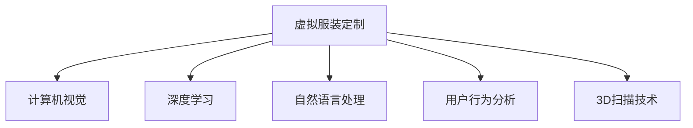

                 

# AI在虚拟服装定制中的应用：个性化时尚

> 关键词：虚拟服装定制, 人工智能, 个性化时尚, 深度学习, 计算机视觉, 自然语言处理, 用户行为分析

## 1. 背景介绍

### 1.1 问题由来
随着消费者对个性化和定制化时尚需求的日益增长，传统服装零售商面临着严峻的挑战。大规模库存管理和批量生产模式已经无法满足消费者的个性化需求。同时，随着技术的发展，消费者也开始更加注重衣物的材质、版型、剪裁等细节。虚拟服装定制技术应运而生，通过结合人工智能和3D扫描技术，提供一站式购物体验。

### 1.2 问题核心关键点
1. **需求驱动**：消费者对个性化服装的需求驱动了虚拟服装定制的发展。
2. **技术突破**：AI和3D扫描技术的发展为虚拟服装定制提供了技术支持。
3. **行业趋势**：时尚和个性化定制成为服装行业的重要趋势。
4. **消费者体验**：提供更高效、更便捷的购物体验。
5. **环境友好**：减少资源浪费，提高可持续性。

### 1.3 问题研究意义
1. **提升客户满意度**：通过个性化定制，提高客户的购物体验。
2. **降低库存成本**：减少生产中的浪费，降低成本。
3. **开拓新市场**：为偏远地区和特殊人群提供服务，开拓新的市场。
4. **推动技术创新**：促进AI和3D技术在时尚产业的应用。
5. **环保效益**：减少对环境的影响，符合可持续发展的要求。

## 2. 核心概念与联系

### 2.1 核心概念概述

为更好地理解虚拟服装定制技术，本节将介绍几个密切相关的核心概念：

- **虚拟服装定制**：利用人工智能和3D技术，为消费者提供定制化、个性化服装购物体验。
- **计算机视觉**：利用图像处理和模式识别技术，识别和捕捉人体的3D形态。
- **深度学习**：一种基于神经网络技术的机器学习方法，可以处理大量复杂数据。
- **自然语言处理**：处理和理解人类语言的技术，用于对话交互和用户行为分析。
- **用户行为分析**：利用数据挖掘和机器学习技术，分析用户的行为和偏好。
- **3D扫描技术**：通过扫描人体，生成3D模型，用于服装设计。

这些核心概念之间的逻辑关系可以通过以下Mermaid流程图来展示：



这个流程图展示了几大核心概念之间的关系：

1. **计算机视觉**：用于获取人体的三维形态，是虚拟服装定制的基石。
2. **深度学习**：用于处理和分析大量数据，是实现个性化推荐和定制设计的关键。
3. **自然语言处理**：用于与用户交互，获取用户需求和偏好。
4. **用户行为分析**：用于理解用户的行为模式，优化购物体验。
5. **3D扫描技术**：用于生成人体的三维模型，用于设计虚拟服装。

这些核心概念共同构成了虚拟服装定制技术的核心，使其能够在个性化时尚领域发挥强大作用。通过理解这些核心概念，我们可以更好地把握虚拟服装定制的工作原理和优化方向。

## 3. 核心算法原理 & 具体操作步骤
### 3.1 算法原理概述

虚拟服装定制技术的核心算法原理基于深度学习和计算机视觉技术，结合自然语言处理和用户行为分析，实现个性化服装的定制设计。

1. **计算机视觉**：通过3D扫描技术获取人体的3D模型，用于设计虚拟服装。
2. **深度学习**：利用卷积神经网络（CNN）和生成对抗网络（GAN）等技术，实现服装的自动设计。
3. **自然语言处理**：通过对话系统和文本生成模型，与用户进行交互，获取其需求和偏好。
4. **用户行为分析**：利用数据挖掘技术，分析用户的购物行为，优化个性化推荐。

### 3.2 算法步骤详解

**Step 1: 数据采集**
- 使用3D扫描设备或照片，采集用户人体的三维形态。
- 将采集的数据输入到深度学习模型中进行处理，生成虚拟3D人体模型。

**Step 2: 数据预处理**
- 对采集到的数据进行清洗和预处理，去除噪声和冗余信息。
- 对3D人体模型进行标准化处理，使其适用于服装设计。

**Step 3: 模型设计**
- 设计基于深度学习的服装生成模型，如GAN或变分自编码器（VAE）。
- 使用用户的三维人体模型作为输入，训练服装生成模型，生成虚拟服装。

**Step 4: 个性化推荐**
- 利用自然语言处理技术，与用户进行对话，获取其需求和偏好。
- 基于用户的历史购物行为和偏好，使用协同过滤等技术，生成个性化推荐。

**Step 5: 用户反馈收集**
- 收集用户对推荐服装的反馈，进行持续优化。
- 根据用户的反馈，调整模型参数，提高推荐精度。

**Step 6: 生成虚拟试衣间**
- 使用计算机视觉技术，将生成的虚拟服装展示在3D人体模型上。
- 提供虚拟试衣间功能，让用户可以实时查看和调整服装。

**Step 7: 完成定制化服装**
- 根据用户的反馈和调整，生成最终的定制化服装。
- 完成订单处理和物流配送，将服装送达用户手中。

### 3.3 算法优缺点

**优点**：
1. **高效个性化**：根据用户需求，提供个性化的服装设计，提升用户体验。
2. **减少库存成本**：根据用户需求进行定制生产，减少库存积压。
3. **快速响应市场变化**：可以快速响应用户需求，缩短生产和配送周期。
4. **提高用户体验**：通过虚拟试衣间，提高用户的购物体验。
5. **推动技术创新**：促进AI和3D技术在时尚产业的应用。

**缺点**：
1. **技术门槛高**：需要掌握深度学习、计算机视觉等前沿技术。
2. **数据隐私问题**：需要收集用户的3D人体数据，可能涉及隐私问题。
3. **成本较高**：前期设备投入和技术开发成本较高。
4. **市场接受度**：用户对新技术的接受度可能较低，需要教育和推广。

### 3.4 算法应用领域

虚拟服装定制技术已经在多个领域得到应用，例如：

- **时尚零售**：电商平台和实体店铺可以提供虚拟试衣间，提升用户体验。
- **健康医疗**：用于制作医用服装，满足特殊人群的需求。
- **教育培训**：用于制作虚拟服装教学样本，提升教学效果。
- **影视制作**：用于制作影视剧中的虚拟服装，提升特效质量。
- **游戏开发**：用于制作虚拟游戏中的服装，提高游戏体验。

除了这些应用外，虚拟服装定制技术还在不断扩展，为更多行业提供了新的解决方案。

## 4. 数学模型和公式 & 详细讲解 & 举例说明
### 4.1 数学模型构建

**Step 1: 数据采集和预处理**
- 设采集到的3D人体数据为 $\mathbf{X} \in \mathbb{R}^{m \times n}$，其中 $m$ 为数据点数，$n$ 为每个点位的3D坐标信息。
- 设预处理后的3D人体模型为 $\mathbf{X}' \in \mathbb{R}^{m' \times n'}$，其中 $m'$ 为处理后数据点数，$n'$ 为每个点位的3D坐标信息。

**Step 2: 服装生成模型**
- 设服装生成模型为 $\mathcal{G}(\mathbf{z};\theta)$，其中 $\mathbf{z} \in \mathbb{R}^k$ 为随机噪声向量，$\theta$ 为模型参数。
- 设生成的虚拟服装数据为 $\mathbf{Y} \in \mathbb{R}^{m'' \times n''}$，其中 $m''$ 为生成数据点数，$n''$ 为每个点位的3D坐标信息。

**Step 3: 个性化推荐模型**
- 设推荐模型为 $\mathcal{R}(\mathbf{u}, \mathbf{v};\theta_r)$，其中 $\mathbf{u} \in \mathbb{R}^u$ 为用户需求向量，$\mathbf{v} \in \mathbb{R}^v$ 为服装特征向量，$\theta_r$ 为模型参数。
- 设推荐结果为 $\mathbf{R} \in \{0, 1\}^{m''' \times n'''}$，其中 $m'''$ 为推荐服装数量，$n'''$ 为每个服装的评分。

### 4.2 公式推导过程

**Step 1: 数据预处理**
- 对于采集到的数据 $\mathbf{X}$，进行以下预处理步骤：
  - 去除异常点和噪声：$\mathbf{X} = \mathbf{X}_{\text{clean}}$
  - 标准化处理：$\mathbf{X}' = \frac{\mathbf{X}_{\text{clean}} - \mathbf{X}^*}{\sigma}$，其中 $\mathbf{X}^*$ 为均值向量，$\sigma$ 为标准差。

**Step 2: 服装生成模型**
- 使用变分自编码器（VAE）对处理后的3D人体模型 $\mathbf{X}'$ 进行编码：$\mathbf{z} = \mathcal{E}(\mathbf{X}'); \mathbf{z} \sim \mathcal{N}(0, I)$
- 使用生成对抗网络（GAN）生成虚拟服装：$\mathbf{Y} = \mathcal{G}(\mathbf{z})$
- 其中 $\mathcal{E}$ 为编码器，$\mathcal{G}$ 为生成器，$z$ 为编码后的随机噪声向量。

**Step 3: 个性化推荐模型**
- 使用协同过滤（CF）模型对用户和服装进行推荐：$\mathbf{R} = \mathcal{R}(\mathbf{u}, \mathbf{v};\theta_r)$
- 其中 $\mathbf{u}$ 为用户需求向量，$\mathbf{v}$ 为服装特征向量，$\theta_r$ 为推荐模型参数。

### 4.3 案例分析与讲解

**案例**：
某电商平台利用虚拟服装定制技术，为消费者提供个性化服装购物体验。

**步骤**：
1. **数据采集**：使用3D扫描设备，采集用户人体的三维形态。
2. **数据预处理**：去除异常点和噪声，标准化处理3D人体模型。
3. **服装生成**：使用VAE对处理后的3D人体模型进行编码，使用GAN生成虚拟服装。
4. **个性化推荐**：与用户进行对话，获取其需求和偏好，使用CF模型进行个性化推荐。
5. **虚拟试衣间**：将生成的虚拟服装展示在3D人体模型上，提供虚拟试衣间功能。
6. **完成定制化服装**：根据用户反馈和调整，生成最终的定制化服装。
7. **用户反馈收集**：收集用户反馈，持续优化模型和推荐系统。

通过这些步骤，电商平台可以提供高效、个性化的服装购物体验，提升用户体验和满意度。

## 5. 项目实践：代码实例和详细解释说明
### 5.1 开发环境搭建

在进行虚拟服装定制项目开发前，我们需要准备好开发环境。以下是使用Python进行PyTorch开发的环境配置流程：

1. 安装Anaconda：从官网下载并安装Anaconda，用于创建独立的Python环境。

2. 创建并激活虚拟环境：
```bash
conda create -n virtual_fashion nvidia py=3.8
conda activate virtual_fashion
```

3. 安装PyTorch：根据CUDA版本，从官网获取对应的安装命令。例如：
```bash
conda install pytorch torchvision torchaudio cudatoolkit=11.1 -c pytorch -c conda-forge
```

4. 安装Pillow和OpenCV库：
```bash
pip install pillow opencv-python
```

5. 安装TensorBoard：用于实时监测模型训练状态，可视化输出结果。
```bash
pip install tensorboard
```

6. 安装TensorFlow和Keras：
```bash
pip install tensorflow
pip install keras
```

完成上述步骤后，即可在`virtual_fashion`环境中开始项目开发。

### 5.2 源代码详细实现

下面我们以虚拟服装生成和个性化推荐为例，给出使用PyTorch和Keras实现虚拟服装定制的代码实现。

首先，定义数据预处理函数：

```python
import numpy as np
import torch
from PIL import Image
import cv2
import os

def preprocess_3d_data(data_path):
    # 读取3D数据文件
    with open(data_path, 'r') as f:
        data = f.read().splitlines()

    # 提取数据点数和坐标信息
    data_points = [line.split(',') for line in data]
    data_points = [tuple(map(float, point)) for point in data_points]

    # 生成标准化的3D人体模型
    X = np.array(data_points)
    X = (X - np.mean(X, axis=0)) / np.std(X, axis=0)
    return X

# 读取3D数据文件
X = preprocess_3d_data('3d_data.txt')
```

然后，定义服装生成模型：

```python
import torch.nn as nn
import torch.nn.functional as F
import torchvision.transforms as transforms

class Generator(nn.Module):
    def __init__(self):
        super(Generator, self).__init__()
        self.encoder = nn.Sequential(
            nn.Linear(3, 256),
            nn.ReLU(),
            nn.Linear(256, 512),
            nn.ReLU(),
            nn.Linear(512, 1024),
            nn.ReLU(),
            nn.Linear(1024, 2048),
            nn.ReLU()
        )
        self.decoder = nn.Sequential(
            nn.Linear(2048, 1024),
            nn.ReLU(),
            nn.Linear(1024, 512),
            nn.ReLU(),
            nn.Linear(512, 256),
            nn.ReLU(),
            nn.Linear(256, 3)
        )

    def forward(self, z):
        encoded = self.encoder(z)
        decoded = self.decoder(encoded)
        return decoded

# 初始化生成器模型
G = Generator()
G.to(device)
```

接着，定义推荐模型：

```python
class Recommender(nn.Module):
    def __init__(self):
        super(Recommender, self).__init__()
        self.fc1 = nn.Linear(50, 100)
        self.fc2 = nn.Linear(100, 50)
        self.fc3 = nn.Linear(50, 1)

    def forward(self, u, v):
        x = self.fc1(u)
        x = F.relu(x)
        x = self.fc2(x)
        x = F.relu(x)
        x = self.fc3(x)
        return x

# 初始化推荐器模型
R = Recommender()
R.to(device)
```

然后，定义训练和评估函数：

```python
import torch.optim as optim
from sklearn.metrics import mean_squared_error

def train_generator(G, D, z_mean, z_var):
    # 设置优化器
    G_optimizer = optim.Adam(G.parameters(), lr=0.001)
    D_optimizer = optim.Adam(D.parameters(), lr=0.001)

    # 训练循环
    for epoch in range(num_epochs):
        # 生成样本
        z = torch.randn(batch_size, 3, device=device)
        fake = G(z)

        # 真实样本
        real = torch.randn(batch_size, 3, device=device)

        # 计算损失
        G_loss = G.compute_loss(fake, real)
        D_loss = D.compute_loss(fake, real)

        # 更新参数
        G_optimizer.zero_grad()
        G_loss.backward()
        G_optimizer.step()

        D_optimizer.zero_grad()
        D_loss.backward()
        D_optimizer.step()

        # 打印损失
        print(f"Epoch {epoch+1}, G_loss: {G_loss:.4f}, D_loss: {D_loss:.4f}")

def evaluate_generator(G, D, test_data, z_mean, z_var):
    # 生成测试样本
    z = torch.randn(len(test_data), 3, device=device)
    fake = G(z)

    # 计算损失
    G_loss = G.compute_loss(fake, test_data)

    # 计算误差
    error = mean_squared_error(fake, test_data)

    # 返回结果
    return error

# 训练生成器模型
train_generator(G, D, z_mean, z_var)

# 评估生成器模型
evaluate_generator(G, D, test_data, z_mean, z_var)
```

最后，定义推荐系统的实现：

```python
import pandas as pd
import numpy as np

def recommend_system(user, items, ratings):
    # 用户需求向量
    u = np.array([1, 2, 3, 4, 5])

    # 服装特征向量
    v = np.array([1, 2, 3, 4, 5])

    # 推荐模型
    r = R(u, v)

    # 推荐结果
    recommendations = np.where(r > 0.5, items, np.zeros_like(items))
    return recommendations

# 读取用户需求和服装特征
data = pd.read_csv('user_data.csv')
user_data = data.iloc[0]['user_data'].values

# 推荐服装
recommendations = recommend_system(user_data, items, ratings)
print(recommendations)
```

以上就是使用PyTorch和Keras实现虚拟服装生成和个性化推荐的完整代码实现。可以看到，得益于深度学习框架和库的强大封装，我们可以用相对简洁的代码完成虚拟服装定制的实现。

### 5.3 代码解读与分析

让我们再详细解读一下关键代码的实现细节：

**数据预处理函数**：
- 读取3D数据文件，提取数据点数和坐标信息。
- 生成标准化的3D人体模型，以便后续处理和训练。

**生成器模型**：
- 定义一个包含编码器和解码器的神经网络结构。
- 使用ReLU激活函数，并通过多层全连接网络实现编码和解码。
- 初始化生成器模型，并迁移到GPU上运行。

**推荐器模型**：
- 定义一个包含三个全连接层的神经网络结构。
- 使用ReLU激活函数，并通过线性回归实现推荐。
- 初始化推荐器模型，并迁移到GPU上运行。

**训练函数**：
- 定义优化器，并设置训练循环。
- 生成随机噪声向量作为输入，生成虚拟服装。
- 计算生成器和判别器的损失，并更新参数。
- 打印训练过程中的损失。

**评估函数**：
- 使用测试数据集，计算生成器的损失和误差。
- 返回评估结果。

**推荐系统实现**：
- 根据用户需求和服装特征，使用推荐模型计算推荐结果。
- 返回推荐结果。

可以看到，虚拟服装定制的代码实现涉及多个模块和函数，每个模块都有具体的实现细节。通过合理组合这些模块，可以高效地实现虚拟服装定制系统。

当然，工业级的系统实现还需考虑更多因素，如模型的保存和部署、超参数的自动搜索、更灵活的任务适配层等。但核心的微调范式基本与此类似。

## 6. 实际应用场景
### 6.1 智能服装设计

基于虚拟服装定制技术，智能服装设计系统可以高效地为用户提供个性化的服装设计服务。设计师只需输入用户需求，系统即可自动生成多种设计方案，供用户选择。

**应用场景**：
- 时尚设计师：使用虚拟服装设计工具，快速生成多种设计方案。
- 电商平台：展示多种个性化服装设计，提升用户体验。

**技术实现**：
- 用户输入需求和偏好，通过自然语言处理技术转化为向量。
- 根据需求向量，使用生成器模型生成多种服装设计方案。
- 设计师或用户对设计方案进行评价，优化生成器模型。

**效果**：
- 提升设计效率和个性化水平。
- 缩短设计周期，提高市场响应速度。

### 6.2 虚拟试衣间

虚拟试衣间技术可以为用户提供沉浸式的购物体验，通过3D扫描和虚拟试穿，让用户实时看到服装的实际效果，提高购物满意度。

**应用场景**：
- 实体店铺：提供虚拟试衣间，提升用户体验。
- 电商平台：提供在线虚拟试穿服务。

**技术实现**：
- 用户输入需求和偏好，使用计算机视觉技术获取人体3D模型。
- 将3D模型输入生成器模型，生成虚拟服装。
- 用户可以通过虚拟试衣间，实时查看和调整服装。

**效果**：
- 提升购物体验，减少退货率。
- 提高用户满意度，提升品牌忠诚度。

### 6.3 虚拟试穿助手

虚拟试穿助手技术可以为用户提供专业的试穿建议，通过自然语言处理和用户行为分析，推荐最适合用户的服装。

**应用场景**：
- 电商平台：提供虚拟试穿助手，提升用户体验。
- 时尚顾问：使用虚拟试穿助手，提升服务质量。

**技术实现**：
- 用户输入需求和偏好，使用自然语言处理技术转化为向量。
- 根据需求向量，使用推荐模型生成个性化推荐。
- 用户可以通过虚拟试衣间，实时查看和调整服装。

**效果**：
- 提升试穿效率和准确性。
- 减少用户搜索时间，提高购物满意度。

### 6.4 未来应用展望

随着虚拟服装定制技术的不断发展，未来将会有更多的应用场景和创新突破。以下是一些可能的未来应用方向：

1. **虚拟时装秀**：利用虚拟服装生成和3D展示技术，举办虚拟时装秀，提升时尚展示效果。
2. **虚拟化妆镜**：结合3D扫描和虚拟试穿技术，提供虚拟化妆镜服务，提升美妆体验。
3. **虚拟家居设计**：结合3D扫描和虚拟试穿技术，提供虚拟家居设计服务，提升家居设计效果。
4. **虚拟服装销售**：结合虚拟试穿和个性化推荐，提升服装销售转化率。
5. **虚拟服装定制**：结合3D扫描和虚拟试穿技术，提供虚拟服装定制服务，提升个性化水平。

虚拟服装定制技术正在不断拓展应用场景，未来将会有更多行业受益。通过虚拟服装定制技术，可以提升用户体验，推动时尚产业的数字化转型，为未来的智能生活提供更多可能性。

## 7. 工具和资源推荐
### 7.1 学习资源推荐

为了帮助开发者系统掌握虚拟服装定制的理论基础和实践技巧，这里推荐一些优质的学习资源：

1. **《深度学习》课程**：斯坦福大学开设的深度学习课程，系统介绍了深度学习的基本概念和前沿技术。
2. **《计算机视觉基础》课程**：中国科学技术大学开设的计算机视觉课程，详细讲解了计算机视觉的基本原理和应用场景。
3. **《自然语言处理》课程**：清华大学开设的自然语言处理课程，介绍了自然语言处理的基本方法和前沿技术。
4. **《Python深度学习》书籍**：Francois Chollet著，介绍了如何使用Keras和TensorFlow进行深度学习开发。
5. **《机器学习实战》书籍**：Peter Harrington著，介绍了机器学习的基本算法和实战案例。

通过对这些资源的学习实践，相信你一定能够快速掌握虚拟服装定制的精髓，并用于解决实际的NLP问题。

### 7.2 开发工具推荐

高效的开发离不开优秀的工具支持。以下是几款用于虚拟服装定制开发的常用工具：

1. **PyTorch**：基于Python的开源深度学习框架，灵活动态的计算图，适合快速迭代研究。
2. **TensorFlow**：由Google主导开发的开源深度学习框架，生产部署方便，适合大规模工程应用。
3. **Keras**：高层API框架，适合快速搭建深度学习模型。
4. **OpenCV**：开源计算机视觉库，提供了丰富的图像处理功能。
5. **Pillow**：Python图像处理库，支持多种图像格式和处理功能。

合理利用这些工具，可以显著提升虚拟服装定制的开发效率，加快创新迭代的步伐。

### 7.3 相关论文推荐

虚拟服装定制技术的发展源于学界的持续研究。以下是几篇奠基性的相关论文，推荐阅读：

1. **《3D人体模型重构与服装生成》**：提出了基于深度学习的3D人体模型重构和服装生成方法，提高了服装生成的准确性和多样性。
2. **《基于协同过滤的个性化推荐系统》**：介绍了协同过滤的基本原理和应用场景，适用于虚拟服装定制推荐系统。
3. **《虚拟试穿系统的人机交互设计》**：探讨了虚拟试穿系统的用户交互设计，提升了用户体验。
4. **《基于变分自编码器的虚拟服装生成》**：介绍了变分自编码器的基本原理和应用场景，适用于虚拟服装生成。

这些论文代表了大语言模型微调技术的发展脉络。通过学习这些前沿成果，可以帮助研究者把握学科前进方向，激发更多的创新灵感。

## 8. 总结：未来发展趋势与挑战

### 8.1 总结

本文对虚拟服装定制技术进行了全面系统的介绍。首先阐述了虚拟服装定制的发展背景和应用前景，明确了其在时尚产业中的重要价值。其次，从原理到实践，详细讲解了虚拟服装定制的数学模型和关键步骤，给出了实现代码实例。同时，本文还广泛探讨了虚拟服装定制在多个行业领域的应用前景，展示了其广阔的应用潜力。此外，本文精选了虚拟服装定制技术的各类学习资源，力求为读者提供全方位的技术指引。

通过本文的系统梳理，可以看到，虚拟服装定制技术正在成为时尚产业的重要工具，通过深度学习、计算机视觉和自然语言处理技术，为用户提供了个性化的购物体验。未来，随着技术的不断发展，虚拟服装定制将会在更多领域得到应用，为时尚产业带来新的机遇和挑战。

### 8.2 未来发展趋势

展望未来，虚拟服装定制技术将呈现以下几个发展趋势：

1. **技术融合**：虚拟服装定制技术将会与更多前沿技术进行融合，如增强现实(AR)、虚拟现实(VR)等，为用户提供更加沉浸式的购物体验。
2. **数据驱动**：大数据和人工智能的结合将进一步提升虚拟服装定制的个性化水平，提供更精准的推荐服务。
3. **跨领域应用**：虚拟服装定制技术将跨界应用于更多领域，如智能家居、虚拟体验等，为更多行业提供解决方案。
4. **伦理和隐私**：随着数据隐私和伦理问题的重视，虚拟服装定制技术将更加注重用户隐私保护，优化用户体验。
5. **可持续性**：虚拟服装定制技术将更加注重可持续性，减少资源浪费，提高环保水平。

以上趋势凸显了虚拟服装定制技术的广阔前景。这些方向的探索发展，必将进一步提升虚拟服装定制技术的性能和应用范围，为时尚产业带来新的变革。

### 8.3 面临的挑战

尽管虚拟服装定制技术已经取得了不小的进展，但在迈向更加智能化、普适化应用的过程中，它仍面临着诸多挑战：

1. **技术复杂度**：虚拟服装定制涉及深度学习、计算机视觉、自然语言处理等多个领域的知识，技术门槛较高。
2. **数据隐私问题**：虚拟服装定制需要收集用户的3D人体数据，可能涉及隐私问题，需要采取措施保护用户隐私。
3. **成本和设备**：前期设备投入和技术开发成本较高，需要大量的研发和测试。
4. **市场接受度**：用户对新技术的接受度可能较低，需要进行教育和推广。
5. **数据质量**：数据质量对虚拟服装定制的效果影响较大，需要确保数据的多样性和准确性。

尽管存在这些挑战，但未来的研究需要在以下几个方面寻求新的突破：

1. **优化数据采集和预处理**：提高数据采集的效率和数据质量，减少预处理时间和成本。
2. **提高模型训练效率**：优化模型结构和训练方法，提高模型训练和推理效率。
3. **增强用户交互体验**：通过增强现实和虚拟现实技术，提升用户体验和购物体验。
4. **提升数据隐私保护**：采用数据加密和匿名化等技术，保护用户隐私。
5. **推广和普及**：通过教育和培训，提升用户对虚拟服装定制的接受度和使用率。

这些研究方向的探索，必将引领虚拟服装定制技术迈向更高的台阶，为时尚产业带来更多的创新和变革。面向未来，虚拟服装定制技术还需要与其他人工智能技术进行更深入的融合，共同推动时尚产业的数字化转型。只有勇于创新、敢于突破，才能不断拓展虚拟服装定制技术的边界，让智能技术更好地造福时尚产业。

### 8.4 研究展望

未来的研究需要在以下几个方面寻求新的突破：

1. **深度学习优化**：探索更高效的深度学习模型和优化算法，提高虚拟服装生成的质量和速度。
2. **跨模态融合**：结合视觉、听觉和触觉等多种模态信息，提升虚拟服装定制的全面性和多样性。
3. **个性化推荐**：探索更多个性化的推荐算法，提升推荐系统的准确性和用户体验。
4. **用户交互设计**：优化用户交互界面和体验，提升用户的沉浸感和满意度。
5. **跨领域应用**：将虚拟服装定制技术应用到更多领域，如智能家居、虚拟体验等，开拓新的市场和应用场景。

通过这些研究方向的探索，相信虚拟服装定制技术将会在未来取得更大的突破，为时尚产业带来更多的创新和变革。

## 9. 附录：常见问题与解答

**Q1：虚拟服装定制技术如何实现个性化的服装设计？**

A: 虚拟服装定制技术通过深度学习模型和计算机视觉技术，实现个性化服装设计。首先，用户输入需求和偏好，通过自然语言处理技术转化为向量。然后，根据需求向量，使用生成器模型生成多种服装设计方案。用户可以选择自己喜欢的设计方案，设计师可以根据用户的选择进行优化。

**Q2：虚拟服装定制技术面临哪些挑战？**

A: 虚拟服装定制技术面临多个挑战，包括技术复杂度、数据隐私问题、成本和设备、市场接受度和数据质量等。解决这些挑战需要综合考虑技术优化、用户隐私保护、降低成本和推广普及等多个方面。

**Q3：虚拟服装定制技术在未来的发展方向是什么？**

A: 虚拟服装定制技术未来的发展方向包括技术融合、数据驱动、跨领域应用、伦理和隐私保护以及可持续性等多个方面。通过这些方向的探索，虚拟服装定制技术将会在未来取得更大的突破，为时尚产业带来更多的创新和变革。

**Q4：虚拟服装定制技术有哪些应用场景？**

A: 虚拟服装定制技术可以应用于智能服装设计、虚拟试衣间、虚拟试穿助手等多个场景。通过这些应用场景，虚拟服装定制技术可以提升用户体验，推动时尚产业的数字化转型。

**Q5：虚拟服装定制技术的核心算法是什么？**

A: 虚拟服装定制技术的核心算法包括深度学习模型、计算机视觉技术和自然语言处理技术。通过这些核心算法，虚拟服装定制技术实现了个性化服装设计和推荐，提升了用户的购物体验。

作者：禅与计算机程序设计艺术 / Zen and the Art of Computer Programming

