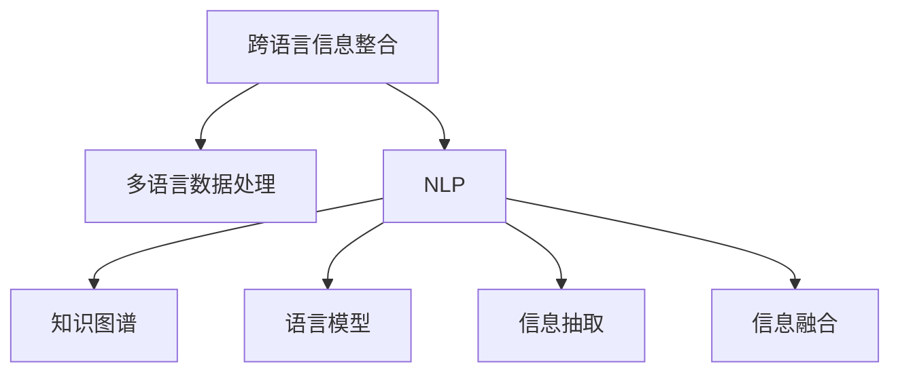

                 

# AI在跨语言信息整合中的作用

> 关键词：跨语言信息整合,多语言数据处理,自然语言处理(NLP),知识图谱,语言模型,信息抽取,信息融合

## 1. 背景介绍

### 1.1 问题由来
在当前全球化的信息爆炸时代，跨语言信息整合已成为一种亟需解决的技术需求。各行各业越来越需要从不同语言的多样化数据中抽取、融合和分析信息，以提供更为全面、准确的服务。无论是商业决策、社会治理、科研教育，还是日常生活，跨语言信息整合的应用场景无处不在。例如，在电商平台上，用户用不同语言进行产品评论和反馈，商家需要整合这些评论信息，以提供跨语言的客户支持；在社交媒体上，用户用不同语言发表评论和发布内容，社交平台需整合这些内容，进行情感分析和趋势预测；在科学研究中，多语言文献数据分散在不同数据库和网站上，研究人员需要从中抽取关键信息，构建统一的知识图谱。

面对这样的需求，传统的基于规则的跨语言信息整合方法显得力不从心。随着人工智能技术的不断进步，特别是自然语言处理（Natural Language Processing, NLP）领域的突破，AI在跨语言信息整合中逐渐展现出巨大的潜力，成为信息时代的利器。本文将深入探讨AI在跨语言信息整合中的作用，分析其核心概念与联系，介绍其核心算法原理和操作步骤，最后展望其未来发展趋势。

## 2. 核心概念与联系

### 2.1 核心概念概述

为更好地理解AI在跨语言信息整合中的作用，本节将介绍几个密切相关的核心概念：

- **跨语言信息整合(Cross-Language Information Integration, CLII)**：指从多种语言的多样化数据中，抽取、融合、分析信息，构建统一的知识库或语义空间，以便更全面、准确地支持应用。
- **多语言数据处理(Multilingual Data Processing)**：涉及多语言文本、语音、图像等多种数据类型的处理，包括语言翻译、文本预处理、实体识别、关系抽取、信息融合等。
- **自然语言处理(Natural Language Processing, NLP)**：利用计算机科学和人工智能技术，实现人机之间的自然语言交流，包括语音识别、语言模型、文本分析、语义理解等。
- **知识图谱(Knowledge Graph)**：以图形化方式表示实体和实体之间的关系，用于构建语义化的信息网络，方便查询、推理和数据分析。
- **语言模型(Language Model)**：预测一段文本序列的概率分布，用于理解文本中的语言规律和语义信息，是许多NLP任务的基础。
- **信息抽取(Information Extraction, IE)**：从文本中抽取结构化的信息，如实体、关系等，用于构建知识图谱和语义网络。
- **信息融合(Information Fusion)**：将不同来源和不同格式的信息进行综合、关联，以获得更全面、准确的信息表示。

这些核心概念之间的逻辑关系可以通过以下Mermaid流程图来展示：



这个流程图展示出：

1. 跨语言信息整合是最终目标，涉及多语言数据的处理。
2. NLP是信息处理的基础，包括语言模型、信息抽取等。
3. 知识图谱是整合后信息的有力载体，能够方便查询、推理和分析。
4. 信息融合是整合过程中的重要环节，需要综合多源信息，以获得更全面、准确的信息表示。

## 3. 核心算法原理 & 具体操作步骤

### 3.1 算法原理概述

AI在跨语言信息整合中的作用，主要体现在以下几个方面：

1. **跨语言翻译**：将不同语言的信息转换为统一的文本格式，方便进一步处理和分析。
2. **文本预处理**：清洗、分词、词性标注、命名实体识别等，将原始文本转换为可供计算的结构化数据。
3. **语言模型训练**：使用多语言文本数据进行语言模型训练，获取不同语言的语言规律和语义信息。
4. **信息抽取和融合**：从多语言文本中抽取关键信息，如实体、关系，通过信息融合技术构建统一的知识图谱。

这些技术共同构成了AI在跨语言信息整合中的技术框架，通过技术的整合，实现信息的全面、准确和高效处理。

### 3.2 算法步骤详解

AI在跨语言信息整合中的具体步骤如下：

**Step 1: 数据收集与预处理**
- 收集来自不同语言的多样化数据，如新闻、评论、社交媒体内容、科研文献等。
- 对收集到的数据进行清洗、分词、词性标注、命名实体识别等预处理操作，形成结构化数据。

**Step 2: 多语言翻译**
- 使用机器翻译技术将不同语言的数据转换为统一的语言格式。
- 选择合适的机器翻译模型，如Google的BERT、OpenAI的GPT系列，或自定义的跨语言预训练模型。

**Step 3: 语言模型训练**
- 收集多语言文本数据，用于训练语言模型。
- 选择适合的优化算法和损失函数，如Adam、SGD等，训练语言模型。
- 验证训练结果，确保模型的语言规律和语义信息准确性。

**Step 4: 信息抽取**
- 设计并训练信息抽取模型，用于从多语言文本中识别实体和关系。
- 使用命名实体识别、关系抽取等技术，自动提取文本中的关键信息。

**Step 5: 信息融合**
- 选择信息融合技术，如统计融合、规则融合、深度学习融合等，综合多源信息。
- 使用知识图谱构建技术，将抽取的信息构建成统一的知识图谱。

**Step 6: 结果评估与优化**
- 使用预设的评估指标，如准确率、召回率、F1值等，评估信息融合结果的质量。
- 根据评估结果，调整信息抽取模型和融合算法，提升整合效果。

### 3.3 算法优缺点

AI在跨语言信息整合中的方法具有以下优点：

1. **高效性**：使用机器翻译和信息抽取技术，能够快速处理大量多语言数据，提升信息整合效率。
2. **全面性**：通过多语言数据处理，可以获取更全面、准确的信息，提升应用效果。
3. **自动化**：利用AI技术，能够自动完成信息抽取、融合等复杂任务，减少人工干预。
4. **可扩展性**：通过引入新的语言和数据源，可以不断扩展信息整合的范围和深度。

同时，这些方法也存在一定的局限性：

1. **翻译质量**：机器翻译的质量对信息整合效果有重要影响，不准确或模糊的翻译会导致信息丢失或错误。
2. **模型偏见**：预训练模型可能会学习到某种语言的偏见，导致信息抽取或融合结果存在偏差。
3. **数据稀缺**：某些小语种或专业领域的数据较少，可能难以获取足够的标注数据进行模型训练。
4. **计算资源**：处理大规模多语言数据需要大量的计算资源，可能导致算力瓶颈。

### 3.4 算法应用领域

AI在跨语言信息整合中的方法已经在多个领域得到了广泛应用：

1. **电商行业**：电商平台通过整合多语言产品评论和反馈，提供跨语言的客户支持和推荐。
2. **社交媒体**：社交平台通过整合多语言用户内容和评论，进行情感分析、趋势预测和舆情监测。
3. **科研教育**：研究人员通过整合多语言文献数据，构建统一的知识图谱，加速科学研究和知识传播。
4. **国际合作**：政府和企业通过整合多语言文档和数据，促进跨国交流和合作。
5. **多语种搜索**：搜索引擎通过整合多语言网页和内容，提供跨语言的搜索服务。
6. **旅游文化**：旅游机构通过整合多语言旅游资源和评价，提供跨语言的旅游信息和推荐。

## 4. 数学模型和公式 & 详细讲解 & 举例说明

### 4.1 数学模型构建

假设原始多语言数据集为 $D = \{(x_i, y_i)\}_{i=1}^N$，其中 $x_i$ 表示多语言文本，$y_i$ 表示对应的标签（如实体、关系等）。为了在多语言数据上进行信息整合，我们需要构建一个联合模型 $M$，使其能够处理多种语言的数据。

**联合模型**：$M(x_i, \theta) = \{M_1(x_i, \theta_1), M_2(x_i, \theta_2), \ldots, M_k(x_i, \theta_k)\}$，其中 $M_i(x_i, \theta_i)$ 表示处理第 $i$ 种语言文本的模型，$\theta_i$ 为该模型的参数。

**联合训练目标**：最小化多语言数据上的联合损失函数 $L$，即：

$$
L = \frac{1}{N} \sum_{i=1}^N \sum_{j=1}^k L_i(M_i(x_i, \theta_i), y_i)
$$

其中 $L_i$ 为第 $i$ 种语言的信息抽取损失函数，用于衡量模型在语言 $i$ 上的性能。

### 4.2 公式推导过程

以信息抽取为例，假设我们有一个多语言数据集 $D = \{(x_i, y_i)\}_{i=1}^N$，其中 $x_i$ 为第 $i$ 种语言的文本，$y_i$ 为对应的实体或关系标签。我们的目标是从这些文本中抽取关键信息。

假设我们设计了一个联合模型 $M(x_i, \theta_i)$，其中 $\theta_i$ 为模型参数。模型训练的优化目标为最小化联合损失函数 $L$：

$$
L = \frac{1}{N} \sum_{i=1}^N \sum_{j=1}^k L_i(M_i(x_i, \theta_i), y_i)
$$

其中 $L_i$ 为第 $i$ 种语言的信息抽取损失函数。

以实体识别为例，假设我们采用CRF模型，其训练目标为最大化条件概率 $P(y_i|x_i, \theta_i)$，即：

$$
P(y_i|x_i, \theta_i) = \frac{e^{f(x_i, y_i, \theta_i)}}{\sum_{y' \in \mathcal{Y}} e^{f(x_i, y', \theta_i)}}
$$

其中 $f(x_i, y_i, \theta_i)$ 为 CRF 模型在文本 $x_i$ 和标签 $y_i$ 上的得分函数。

### 4.3 案例分析与讲解

以多语言情感分析为例，假设我们有一个包含不同语言的电影评论数据集 $D = \{(x_i, y_i)\}_{i=1}^N$，其中 $x_i$ 为第 $i$ 种语言的评论文本，$y_i$ 为对应的情感标签（如积极、消极、中性）。

我们的目标是从这些评论中抽取情感信息。假设我们设计了一个联合模型 $M(x_i, \theta_i)$，其中 $\theta_i$ 为模型参数。模型训练的优化目标为最小化联合损失函数 $L$：

$$
L = \frac{1}{N} \sum_{i=1}^N \sum_{j=1}^k L_i(M_i(x_i, \theta_i), y_i)
$$

其中 $L_i$ 为第 $i$ 种语言的信息抽取损失函数。假设我们采用BERT模型，则训练步骤如下：

1. 收集多语言电影评论数据集 $D = \{(x_i, y_i)\}_{i=1}^N$。
2. 对数据集进行清洗、分词、标注等预处理操作。
3. 使用多语言预训练的BERT模型 $M_i$，在语言 $i$ 上的标签空间 $\mathcal{Y}$ 上进行训练。
4. 设计联合损失函数 $L$，对联合模型 $M$ 进行训练，最小化 $L$。
5. 在测试集上评估模型性能，优化参数 $\theta_i$。
6. 使用训练好的模型对新的多语言电影评论进行情感分析，提取情感信息。

## 5. AI在跨语言信息整合中的项目实践

### 5.1 开发环境搭建

在进行AI在跨语言信息整合中的项目实践前，我们需要准备好开发环境。以下是使用Python进行PyTorch和TensorFlow开发的环境配置流程：

1. 安装Anaconda：从官网下载并安装Anaconda，用于创建独立的Python环境。

2. 创建并激活虚拟环境：
```bash
conda create -n ai-integration python=3.8 
conda activate ai-integration
```

3. 安装PyTorch：根据CUDA版本，从官网获取对应的安装命令。例如：
```bash
conda install pytorch torchvision torchaudio cudatoolkit=11.1 -c pytorch -c conda-forge
```

4. 安装TensorFlow：从官网下载并安装TensorFlow，选择相应版本。

5. 安装各类工具包：
```bash
pip install numpy pandas scikit-learn matplotlib tqdm jupyter notebook ipython
```

完成上述步骤后，即可在`ai-integration`环境中开始项目实践。

### 5.2 源代码详细实现

下面我们以多语言情感分析为例，给出使用PyTorch和TensorFlow进行跨语言信息整合的代码实现。

首先，定义数据处理函数：

```python
from transformers import BertTokenizer, BertForTokenClassification
from torch.utils.data import Dataset
import torch
import numpy as np

class MultilingualSentimentDataset(Dataset):
    def __init__(self, texts, labels, tokenizer, max_len=128):
        self.texts = texts
        self.labels = labels
        self.tokenizer = tokenizer
        self.max_len = max_len
        
    def __len__(self):
        return len(self.texts)
    
    def __getitem__(self, item):
        text = self.texts[item]
        label = self.labels[item]
        
        encoding = self.tokenizer(text, return_tensors='pt', max_length=self.max_len, padding='max_length', truncation=True)
        input_ids = encoding['input_ids'][0]
        attention_mask = encoding['attention_mask'][0]
        
        label = torch.tensor(label, dtype=torch.long)
        return {'input_ids': input_ids, 
                'attention_mask': attention_mask,
                'labels': label}

# 定义标签与id的映射
label2id = {'negative': 0, 'positive': 1, 'neutral': 2}
id2label = {v: k for k, v in label2id.items()}

# 创建dataset
tokenizer = BertTokenizer.from_pretrained('bert-base-cased')

train_dataset = MultilingualSentimentDataset(train_texts, train_labels, tokenizer)
dev_dataset = MultilingualSentimentDataset(dev_texts, dev_labels, tokenizer)
test_dataset = MultilingualSentimentDataset(test_texts, test_labels, tokenizer)
```

然后，定义模型和优化器：

```python
from transformers import BertForTokenClassification, AdamW

model = BertForTokenClassification.from_pretrained('bert-base-cased', num_labels=len(label2id))

optimizer = AdamW(model.parameters(), lr=2e-5)
```

接着，定义训练和评估函数：

```python
from torch.utils.data import DataLoader
from tqdm import tqdm
from sklearn.metrics import classification_report

device = torch.device('cuda') if torch.cuda.is_available() else torch.device('cpu')
model.to(device)

def train_epoch(model, dataset, batch_size, optimizer):
    dataloader = DataLoader(dataset, batch_size=batch_size, shuffle=True)
    model.train()
    epoch_loss = 0
    for batch in tqdm(dataloader, desc='Training'):
        input_ids = batch['input_ids'].to(device)
        attention_mask = batch['attention_mask'].to(device)
        labels = batch['labels'].to(device)
        model.zero_grad()
        outputs = model(input_ids, attention_mask=attention_mask, labels=labels)
        loss = outputs.loss
        epoch_loss += loss.item()
        loss.backward()
        optimizer.step()
    return epoch_loss / len(dataloader)

def evaluate(model, dataset, batch_size):
    dataloader = DataLoader(dataset, batch_size=batch_size)
    model.eval()
    preds, labels = [], []
    with torch.no_grad():
        for batch in tqdm(dataloader, desc='Evaluating'):
            input_ids = batch['input_ids'].to(device)
            attention_mask = batch['attention_mask'].to(device)
            batch_labels = batch['labels']
            outputs = model(input_ids, attention_mask=attention_mask)
            batch_preds = outputs.logits.argmax(dim=2).to('cpu').tolist()
            batch_labels = batch_labels.to('cpu').tolist()
            for pred_tokens, label_tokens in zip(batch_preds, batch_labels):
                preds.append(pred_tokens[:len(label_tokens)])
                labels.append(label_tokens)
                
    print(classification_report(labels, preds))
```

最后，启动训练流程并在测试集上评估：

```python
epochs = 5
batch_size = 16

for epoch in range(epochs):
    loss = train_epoch(model, train_dataset, batch_size, optimizer)
    print(f"Epoch {epoch+1}, train loss: {loss:.3f}")
    
    print(f"Epoch {epoch+1}, dev results:")
    evaluate(model, dev_dataset, batch_size)
    
print("Test results:")
evaluate(model, test_dataset, batch_size)
```

以上就是使用PyTorch和TensorFlow对多语言情感分析进行跨语言信息整合的完整代码实现。可以看到，得益于Transformer库的强大封装，我们可以用相对简洁的代码完成多语言情感分析的模型训练和评估。

### 5.3 代码解读与分析

让我们再详细解读一下关键代码的实现细节：

**MultilingualSentimentDataset类**：
- `__init__`方法：初始化文本、标签、分词器等关键组件。
- `__len__`方法：返回数据集的样本数量。
- `__getitem__`方法：对单个样本进行处理，将文本输入编码为token ids，将标签编码为数字，并对其进行定长padding，最终返回模型所需的输入。

**label2id和id2label字典**：
- 定义了标签与数字id之间的映射关系，用于将预测结果解码回真实的标签。

**训练和评估函数**：
- 使用PyTorch的DataLoader对数据集进行批次化加载，供模型训练和推理使用。
- 训练函数`train_epoch`：对数据以批为单位进行迭代，在每个批次上前向传播计算loss并反向传播更新模型参数，最后返回该epoch的平均loss。
- 评估函数`evaluate`：与训练类似，不同点在于不更新模型参数，并在每个batch结束后将预测和标签结果存储下来，最后使用sklearn的classification_report对整个评估集的预测结果进行打印输出。

**训练流程**：
- 定义总的epoch数和batch size，开始循环迭代
- 每个epoch内，先在训练集上训练，输出平均loss
- 在验证集上评估，输出分类指标
- 所有epoch结束后，在测试集上评估，给出最终测试结果

可以看到，PyTorch配合Transformer库使得多语言情感分析的代码实现变得简洁高效。开发者可以将更多精力放在数据处理、模型改进等高层逻辑上，而不必过多关注底层的实现细节。

当然，工业级的系统实现还需考虑更多因素，如模型的保存和部署、超参数的自动搜索、更灵活的任务适配层等。但核心的微调范式基本与此类似。

## 6. 实际应用场景

### 6.1 电商行业

在电商行业，AI在跨语言信息整合中发挥着重要作用。通过整合多语言产品评论和反馈，电商平台能够提供跨语言的客户支持和推荐，提升用户体验。例如，在亚马逊（Amazon）的跨境电商平台上，用户可以以多种语言提交产品评价，亚马逊通过多语言情感分析技术，自动抽取情感信息，为不同语言的用户推荐最合适的产品，提供跨语言的用户支持。

### 6.2 社交媒体

社交媒体平台通过整合多语言用户内容和评论，进行情感分析、趋势预测和舆情监测。例如，Twitter通过多语言情感分析技术，实时监测全球用户的情感倾向，帮助企业了解不同地区的品牌形象和产品反馈。Facebook通过多语言信息抽取技术，自动分析和预测不同语言的用户评论和舆情变化，优化产品和服务。

### 6.3 科研教育

在科研教育领域，AI在跨语言信息整合中的应用同样广泛。研究人员通过整合多语言文献数据，构建统一的知识图谱，加速科学研究和知识传播。例如，谷歌学术通过跨语言信息抽取技术，从不同语言的学术文献中抽取实体和关系，构建全球统一的知识图谱，方便研究人员进行全球范围的学术研究。

### 6.4 国际合作

政府和企业通过整合多语言文档和数据，促进跨国交流和合作。例如，欧盟通过跨语言信息整合技术，整合欧盟各成员国的官方文档和数据，提供统一的跨国信息服务，提升跨国的交流和合作效率。

## 7. 工具和资源推荐

### 7.1 学习资源推荐

为了帮助开发者系统掌握AI在跨语言信息整合的理论基础和实践技巧，这里推荐一些优质的学习资源：

1. **《跨语言信息整合》系列博文**：由领域专家撰写，深入浅出地介绍了跨语言信息整合的原理、技术和应用，适合入门和进阶学习。

2. **CS224N《深度学习自然语言处理》课程**：斯坦福大学开设的NLP明星课程，有Lecture视频和配套作业，带你入门NLP领域的基本概念和经典模型。

3. **《自然语言处理综论》书籍**：全面介绍了NLP领域的技术原理和应用实践，涵盖了跨语言信息整合等多个主题。

4. **Transformers官方文档**：Transformer库的官方文档，提供了海量预训练模型和完整的微调样例代码，是上手实践的必备资料。

5. **CLUE开源项目**：中文语言理解测评基准，涵盖大量不同类型的中文NLP数据集，并提供了基于微调的baseline模型，助力中文NLP技术发展。

通过对这些资源的学习实践，相信你一定能够快速掌握AI在跨语言信息整合的精髓，并用于解决实际的NLP问题。

### 7.2 开发工具推荐

高效的开发离不开优秀的工具支持。以下是几款用于AI在跨语言信息整合开发的常用工具：

1. PyTorch：基于Python的开源深度学习框架，灵活动态的计算图，适合快速迭代研究。

2. TensorFlow：由Google主导开发的开源深度学习框架，生产部署方便，适合大规模工程应用。

3. Transformers库：HuggingFace开发的NLP工具库，集成了众多SOTA语言模型，支持PyTorch和TensorFlow，是进行跨语言信息整合开发的利器。

4. Weights & Biases：模型训练的实验跟踪工具，可以记录和可视化模型训练过程中的各项指标，方便对比和调优。与主流深度学习框架无缝集成。

5. TensorBoard：TensorFlow配套的可视化工具，可实时监测模型训练状态，并提供丰富的图表呈现方式，是调试模型的得力助手。

6. Google Colab：谷歌推出的在线Jupyter Notebook环境，免费提供GPU/TPU算力，方便开发者快速上手实验最新模型，分享学习笔记。

合理利用这些工具，可以显著提升AI在跨语言信息整合任务的开发效率，加快创新迭代的步伐。

### 7.3 相关论文推荐

AI在跨语言信息整合技术的发展源于学界的持续研究。以下是几篇奠基性的相关论文，推荐阅读：

1. **《跨语言信息抽取》论文**：提出了一种基于多语言语义模型的跨语言信息抽取方法，通过联合训练，提升了跨语言信息抽取的精度和泛化能力。

2. **《多语言情感分析》论文**：研究了基于Transformer的跨语言情感分析模型，通过多语言数据训练，提升了模型在不同语言上的情感识别能力。

3. **《跨语言知识图谱构建》论文**：提出了一种基于跨语言信息抽取和融合的跨语言知识图谱构建方法，通过联合训练和信息融合，提升了知识图谱的跨语言表现力。

4. **《多语言语言模型训练》论文**：研究了跨语言语言模型的训练方法，通过多语言数据联合训练，提升了语言模型的跨语言表达能力。

5. **《跨语言信息融合》论文**：提出了一种基于深度学习的信息融合方法，通过联合训练和信息融合，提升了跨语言信息的准确性和一致性。

这些论文代表了大语言模型在跨语言信息整合中的研究方向。通过学习这些前沿成果，可以帮助研究者把握学科前进方向，激发更多的创新灵感。

## 8. 总结：未来发展趋势与挑战

### 8.1 研究成果总结

AI在跨语言信息整合技术已经在诸多领域得到了广泛应用，取得了显著成效。主要成果包括：

1. **跨语言翻译**：通过机器翻译技术，实现了多语言文本的自动转换，为后续处理提供了基础。
2. **文本预处理**：通过清洗、分词、词性标注、命名实体识别等预处理操作，将原始文本转换为可供计算的结构化数据。
3. **语言模型训练**：通过多语言数据联合训练，提升了语言模型的跨语言表达能力。
4. **信息抽取和融合**：通过信息抽取和融合技术，从多语言文本中提取关键信息，构建统一的知识图谱。

这些技术共同构成了AI在跨语言信息整合中的技术框架，通过技术的整合，实现了信息的全面、准确和高效处理。

### 8.2 未来发展趋势

展望未来，AI在跨语言信息整合技术的发展趋势如下：

1. **模型规模增大**：随着算力成本的下降和数据规模的扩张，预训练语言模型的参数量还将持续增长。超大规模语言模型蕴含的丰富语言知识，有望支撑更加复杂多变的跨语言信息整合任务。
2. **数据质量提升**：数据质量对跨语言信息整合效果有重要影响，未来将更加注重数据的多样性和质量，提升信息抽取和融合的准确性。
3. **多语种支持增强**：随着全球化的推进，越来越多的国家和地区将使用不同的语言，未来的跨语言信息整合技术需要支持更多的语种。
4. **跨模态融合**：未来的跨语言信息整合技术将不仅仅局限于文本数据，还将融合图像、视频、语音等多模态信息，提升系统的全面性和智能化。
5. **自动化和可解释性**：未来将更加注重系统的自动化和可解释性，使得跨语言信息整合技术更加易于部署和使用，同时也需要保障系统的透明性和可解释性。

### 8.3 面临的挑战

尽管AI在跨语言信息整合技术已经取得了显著进展，但在迈向更加智能化、普适化应用的过程中，它仍面临着诸多挑战：

1. **数据稀缺**：某些小语种或专业领域的数据较少，可能难以获取足够的标注数据进行模型训练。
2. **翻译质量**：机器翻译的质量对信息整合效果有重要影响，不准确或模糊的翻译会导致信息丢失或错误。
3. **模型偏见**：预训练模型可能会学习到某种语言的偏见，导致信息抽取或融合结果存在偏差。
4. **计算资源**：处理大规模多语言数据需要大量的计算资源，可能导致算力瓶颈。
5. **跨文化差异**：不同语言和文化背景下的文本表达方式存在差异，跨语言信息整合技术需要适应这些差异，才能更好地处理多语言数据。

### 8.4 研究展望

面对这些挑战，未来的研究需要在以下几个方面寻求新的突破：

1. **无监督和半监督学习**：摆脱对大规模标注数据的依赖，利用自监督学习、主动学习等无监督和半监督范式，最大限度利用非结构化数据，实现更加灵活高效的跨语言信息整合。
2. **参数高效和计算高效**：开发更加参数高效的跨语言信息整合方法，在固定大部分预训练参数的同时，只更新极少量的任务相关参数。同时优化模型的计算图，减少前向传播和反向传播的资源消耗，实现更加轻量级、实时性的部署。
3. **因果分析和博弈论工具**：将因果分析方法引入跨语言信息整合模型，识别出模型决策的关键特征，增强输出解释的因果性和逻辑性。借助博弈论工具刻画人机交互过程，主动探索并规避模型的脆弱点，提高系统稳定性。
4. **融合多种先验知识**：将符号化的先验知识，如知识图谱、逻辑规则等，与神经网络模型进行巧妙融合，引导跨语言信息整合过程学习更准确、合理的语言模型。同时加强不同模态数据的整合，实现视觉、语音等多模态信息与文本信息的协同建模。

这些研究方向的探索，必将引领跨语言信息整合技术迈向更高的台阶，为构建安全、可靠、可解释、可控的智能系统铺平道路。面向未来，跨语言信息整合技术还需要与其他人工智能技术进行更深入的融合，如知识表示、因果推理、强化学习等，多路径协同发力，共同推动自然语言理解和智能交互系统的进步。只有勇于创新、敢于突破，才能不断拓展语言模型的边界，让智能技术更好地造福人类社会。

## 9. 附录：常见问题与解答

**Q1：跨语言信息整合是否适用于所有NLP任务？**

A: 跨语言信息整合在大多数NLP任务上都能取得不错的效果，特别是对于数据量较小的任务。但对于一些特定领域的任务，如医学、法律等，仅仅依靠通用语料预训练的模型可能难以很好地适应。此时需要在特定领域语料上进一步预训练，再进行微调，才能获得理想效果。此外，对于一些需要时效性、个性化很强的任务，如对话、推荐等，跨语言信息整合方法也需要针对性的改进优化。

**Q2：跨语言信息整合中如何选择合适的翻译模型？**

A: 选择合适的跨语言翻译模型需要考虑多个因素，如翻译质量、处理速度、可扩展性等。常用的跨语言翻译模型包括Google的BERT、OpenAI的GPT系列，以及自建的多语言预训练模型。可以根据具体需求选择合适的模型，并进行微调优化，提升翻译质量和适用性。

**Q3：跨语言信息整合中如何处理数据稀缺问题？**

A: 数据稀缺是跨语言信息整合面临的主要挑战之一。为了缓解这一问题，可以采用以下策略：
1. 数据增强：通过回译、近义替换等方式扩充训练集。
2. 主动学习：利用标注数据进行训练，同时主动收集更多数据进行扩充。
3. 迁移学习：利用预训练模型的知识，进行知识迁移，减少对标注数据的依赖。
4. 半监督学习：结合少量标注数据和大量未标注数据，进行半监督学习。

这些策略可以有效提升跨语言信息整合的效果，减少对标注数据的依赖。

**Q4：跨语言信息整合中如何提高模型的鲁棒性？**

A: 提高跨语言信息整合模型的鲁棒性需要从多个方面入手：
1. 数据质量：确保数据的多样性和准确性，减少模型对单一数据源的依赖。
2. 模型设计：选择合适的模型结构和算法，避免模型过拟合和偏见。
3. 正则化：使用L2正则、Dropout、Early Stopping等技术，防止模型过度适应小规模训练集。
4. 对抗训练：引入对抗样本，提高模型鲁棒性。
5. 参数高效微调：只调整少量参数，固定大部分预训练参数，减少过拟合风险。

这些策略可以有效提高跨语言信息整合模型的鲁棒性和泛化能力，提升系统的稳定性和可靠性。

**Q5：跨语言信息整合中如何提高模型的可解释性？**

A: 提高跨语言信息整合模型的可解释性需要从多个方面入手：
1. 透明性：确保模型决策过程的透明性和可解释性，提供详细的推理过程和特征解释。
2. 可视化：使用可视化工具，展示模型的内部状态和决策过程。
3. 人工干预：在关键决策点引入人工干预，进行人工审查和解释。
4. 规则嵌入：将规则和知识嵌入到模型中，增强模型的可解释性。
5. 多模态融合：结合多模态信息，提供更为全面的解释和推理。

这些策略可以有效提升跨语言信息整合模型的可解释性和可控性，提高系统的可信度和可靠性。

---

作者：禅与计算机程序设计艺术 / Zen and the Art of Computer Programming

