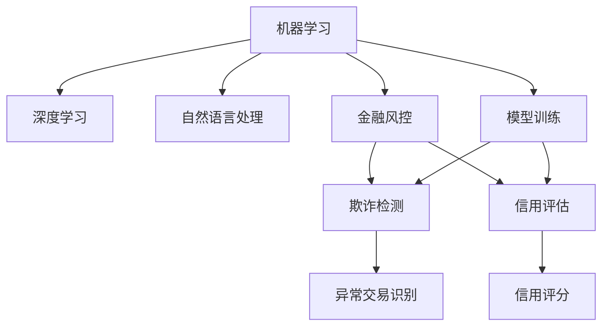

                 

# AI在金融风控中的应用：欺诈检测与信用评估

## 1. 背景介绍

### 1.1 问题由来

随着金融科技的迅猛发展，金融交易活动日益频繁，传统的人工风控手段已无法满足日益复杂多变的风险防控需求。金融风控不仅关乎金融机构的经济利益，更关系到社会稳定和公众信任。AI技术的引入，为金融风控带来了新的思路和手段，特别是利用机器学习和大数据分析技术，可以从海量交易数据中挖掘出有价值的特征，实现精准的风控预测和决策。

### 1.2 问题核心关键点

AI在金融风控中的应用，主要体现在欺诈检测与信用评估两个方面。其中，欺诈检测旨在识别和拦截异常交易行为，保护用户的资金安全；信用评估则根据用户的历史行为数据和信用记录，预测其信用风险，辅助决策和贷款审批。这两个任务是金融风控的核心，通过AI技术的深度应用，可以显著提升风控效率和准确性。

## 2. 核心概念与联系

### 2.1 核心概念概述

为更好地理解AI在金融风控中的应用，本节将介绍几个关键概念：

- 机器学习(Machine Learning, ML)：通过数据驱动的模型训练，使计算机能够从经验中学习和优化，实现数据预测和分类等任务。
- 深度学习(Deep Learning, DL)：一种特殊的机器学习技术，利用多层神经网络处理复杂非线性映射，适用于图像、语音、自然语言等高维数据的处理。
- 自然语言处理(Natural Language Processing, NLP)：使计算机能够理解和处理人类语言，包括文本分类、情感分析、命名实体识别等任务。
- 金融风控(Financial Risk Control)：通过各种手段和技术，识别、评估和控制金融风险，保障金融系统的稳定运行和金融交易的公平公正。
- 欺诈检测(Fraud Detection)：识别和阻止异常交易行为，保护金融机构和客户的资金安全。
- 信用评估(Credit Scoring)：通过量化和分析用户的历史行为数据和信用记录，预测其信用风险，辅助贷款审批和授信决策。
- 信用评分(Credit Score)：根据用户的历史信用行为，量化其信用风险等级，帮助金融机构评估用户的还款能力和还款意愿。
- 模型训练(Model Training)：使用历史数据和标签，训练机器学习模型，使其能够对新数据进行预测。

这些核心概念之间的逻辑关系可以通过以下Mermaid流程图来展示：



这个流程图展示了机器学习、深度学习、自然语言处理等技术在金融风控中的应用路径：

1. 机器学习提供了一种通用的数据驱动的模型训练方法，广泛应用于金融风控中的各种任务。
2. 深度学习通过多层神经网络，可以处理复杂的非线性映射，适用于高维数据的特征提取。
3. 自然语言处理使计算机能够理解和处理人类语言，应用于金融风控中的文本分析、情感分析等任务。
4. 金融风控涉及多方面的风险识别和控制，包括欺诈检测和信用评估等。
5. 欺诈检测通过训练模型识别异常交易，保护用户资金安全。
6. 信用评估通过模型量化用户信用风险，辅助贷款审批和授信决策。
7. 模型训练是AI技术在金融风控中应用的基础，通过历史数据和标签训练模型，生成精准预测和决策。

## 3. 核心算法原理 & 具体操作步骤

### 3.1 算法原理概述

AI在金融风控中的应用，主要依赖于机器学习、深度学习和自然语言处理等技术。本文将重点介绍基于监督学习的机器学习模型在欺诈检测和信用评估中的应用。

在欺诈检测中，我们通过构建分类模型来识别异常交易行为。常见的方法包括逻辑回归、决策树、随机森林等传统机器学习模型，以及支持向量机(SVM)、神经网络等深度学习模型。这些模型通过训练数据集的特征和标签，学习到对异常行为进行预测的规则和模式。

在信用评估中，我们通常使用回归模型来预测用户的信用评分。常见的回归模型包括线性回归、逻辑回归、随机森林回归等。这些模型通过训练数据集的特征和目标变量，学习到用户信用风险的分布规律，从而生成信用评分预测。

### 3.2 算法步骤详解

#### 欺诈检测算法步骤：

1. **数据准备**：收集历史交易数据，包含交易金额、时间、地点、用户行为等信息。对数据进行清洗和预处理，去除缺失值、异常值等噪声。
2. **特征工程**：提取和构造能够反映交易异常的特征，如交易金额与用户历史交易均值、交易时间与用户活跃时间、交易地点与用户常驻地区等。
3. **模型训练**：选择合适的监督学习算法，使用历史交易数据训练模型，学习异常交易的特征和模式。常用的算法包括逻辑回归、支持向量机等。
4. **模型评估**：在测试集上评估模型性能，使用准确率、召回率、F1值等指标衡量模型效果。
5. **模型部署**：将训练好的模型集成到交易监控系统中，实时分析新交易数据，识别异常行为并及时报警。

#### 信用评估算法步骤：

1. **数据准备**：收集用户的历史贷款记录、信用报告、还款行为等信息，作为训练数据集的特征。
2. **特征工程**：提取和构造能够反映用户信用风险的特征，如贷款金额、还款时间、还款频率、信用评分等。
3. **模型训练**：选择合适的监督学习算法，使用历史贷款数据训练模型，学习信用评分的分布规律。常用的算法包括线性回归、逻辑回归等。
4. **模型评估**：在测试集上评估模型性能，使用均方误差、决定系数等指标衡量模型效果。
5. **模型部署**：将训练好的模型集成到贷款审批系统中，根据用户的贷款申请和信用评估结果，生成审批决策和授信额度。

### 3.3 算法优缺点

#### 欺诈检测算法的优缺点：

**优点**：
- 能处理大规模数据集，适用于金融行业的数据量要求。
- 可自动化监测异常交易，提高风控效率。
- 能够捕捉复杂的特征关系，发现异常模式。

**缺点**：
- 数据预处理和特征工程需要大量的人工干预，耗时耗力。
- 模型需要定期更新和维护，确保其在新数据上的性能。
- 可能存在误报和漏报，影响用户体验。

#### 信用评估算法的优缺点：

**优点**：
- 能够量化用户信用风险，提供客观的决策依据。
- 模型训练完成后，可自动化评估用户信用，提高审批效率。
- 可以结合其他风险评估手段，综合决策。

**缺点**：
- 模型训练需要大量历史数据，数据获取成本较高。
- 可能存在数据偏差，影响模型公平性。
- 用户历史行为和信用记录可能无法完全反映其真实信用状况。

### 3.4 算法应用领域

AI在金融风控中的应用，已广泛应用于各大金融机构和金融科技公司。以下是几个典型应用场景：

- **银行贷款审批**：使用信用评估模型，根据用户的历史贷款记录和信用报告，评估其还款能力和还款意愿，辅助贷款审批和授信决策。
- **信用卡欺诈检测**：使用欺诈检测模型，实时监控信用卡交易，识别异常交易行为，保护用户资金安全。
- **保险理赔审核**：使用欺诈检测模型，识别可能存在骗保风险的理赔申请，提高理赔审核的准确性和效率。
- **金融市场监控**：使用AI技术对金融市场数据进行分析，识别异常交易和市场风险，辅助决策和风险控制。
- **反洗钱监测**：使用AI技术识别异常资金流动，防范洗钱和金融犯罪。

这些应用场景展示了AI技术在金融风控中的广泛应用，为金融机构带来了显著的风险防控和经济效益。

## 4. 数学模型和公式 & 详细讲解 & 举例说明

### 4.1 数学模型构建

本文将使用机器学习中的线性回归模型来构建信用评估模型，并使用决策树模型来构建欺诈检测模型。

#### 线性回归模型：

假设我们有一个线性回归模型 $y = \theta_0 + \theta_1x_1 + \theta_2x_2 + \cdots + \theta_nx_n$，其中 $y$ 为信用评分，$x_i$ 为历史贷款记录中的特征，$\theta_i$ 为模型参数。我们的目标是最小化预测值与真实值之间的平方误差：

$$
\mathcal{L}(\theta) = \frac{1}{2N}\sum_{i=1}^N(y_i - \hat{y}_i)^2
$$

其中 $N$ 为样本数量，$\hat{y}_i$ 为第 $i$ 个样本的预测值。

#### 决策树模型：

决策树模型是一种基于树形结构的分类模型，通过递归分割数据集，生成决策树。假设我们的训练数据集为 $\{(x_1,y_1),(x_2,y_2),\ldots,(x_N,y_N)\}$，其中 $x_i \in \mathbb{R}^n$，$y_i \in \{0,1\}$。我们的目标是构建一棵决策树，使得在测试集上，新的样本 $x'$ 能够被正确分类：

$$
\arg\min_{T} \mathcal{L}(T) = \frac{1}{N}\sum_{i=1}^N \mathbb{I}(y_i \neq T(x_i))
$$

其中 $T$ 为决策树模型，$\mathbb{I}$ 为示性函数，$y_i = 1$ 表示样本 $x_i$ 被正确分类，$y_i = 0$ 表示样本 $x_i$ 被错误分类。

### 4.2 公式推导过程

#### 线性回归模型推导：

线性回归模型是最简单的回归模型，通过最小化预测值与真实值之间的误差，生成信用评分预测。假设我们有一个包含 $N$ 个样本的数据集 $\{(x_i,y_i)\}_{i=1}^N$，其中 $x_i \in \mathbb{R}^n$，$y_i \in \mathbb{R}$。我们的目标是学习模型参数 $\theta = (\theta_0, \theta_1, \ldots, \theta_n)$，使得模型能够对新数据进行准确的预测。

根据最小二乘法，我们得到模型参数的最优解为：

$$
\hat{\theta} = (\theta_0, \theta_1, \ldots, \theta_n) = \arg\min_{\theta} \frac{1}{2N}\sum_{i=1}^N(y_i - \hat{y}_i)^2
$$

其中 $\hat{y}_i = \theta_0 + \theta_1x_{i1} + \theta_2x_{i2} + \cdots + \theta_nx_{in}$。

#### 决策树模型推导：

决策树模型通过递归地选择最佳特征，生成决策树。假设我们有一个包含 $N$ 个样本的数据集 $\{(x_i,y_i)\}_{i=1}^N$，其中 $x_i \in \mathbb{R}^n$，$y_i \in \{0,1\}$。我们的目标是构建一棵决策树，使得在测试集上，新的样本 $x'$ 能够被正确分类。

决策树生成过程可以分为两个步骤：

1. 选择最佳特征 $x_j$，用于划分数据集。根据基尼指数或信息增益等指标，选择最能区分正负类别的特征。
2. 在最佳特征上进行划分，生成子节点。根据特征值将数据集分为若干个子集，每个子集对应一个子节点。

决策树的训练过程如下：

1. 计算每个特征的基尼指数或信息增益。
2. 选择最优特征 $x_j$。
3. 根据特征值将数据集分为若干个子集。
4. 对每个子集递归地生成决策树。

### 4.3 案例分析与讲解

#### 线性回归模型案例：

假设我们有一组历史贷款记录数据，包括贷款金额、还款时间、还款频率等特征。我们希望通过线性回归模型，预测用户的信用评分。我们选择以下特征：贷款金额 $x_1$、还款时间 $x_2$、还款频率 $x_3$。

数据集为：

| 样本编号 | 贷款金额 $x_1$ | 还款时间 $x_2$ | 还款频率 $x_3$ | 信用评分 $y$ |
| -------- | ------------ | ------------ | ------------ | -------- |
| 1        | 10000        | 1.0          | 5            | 0.8      |
| 2        | 20000        | 1.5          | 6            | 0.9      |
| 3        | 30000        | 2.0          | 3            | 0.7      |
| 4        | 40000        | 1.5          | 4            | 0.6      |
| 5        | 50000        | 2.5          | 2            | 0.5      |

我们使用最小二乘法，计算模型参数 $\theta = (\theta_0, \theta_1, \theta_2, \theta_3)$，使得模型能够对新数据进行准确的预测。

1. 数据预处理：对数据进行归一化，使得每个特征的取值范围在 $[0,1]$ 之间。
2. 模型训练：使用历史数据训练线性回归模型，计算模型参数 $\theta$。
3. 模型评估：在测试集上评估模型性能，使用均方误差等指标衡量模型效果。
4. 模型部署：将训练好的模型集成到贷款审批系统中，根据用户的贷款申请和信用评估结果，生成审批决策和授信额度。

#### 决策树模型案例：

假设我们有一组交易数据，包括交易金额、交易时间、交易地点等信息。我们希望使用决策树模型，识别欺诈交易。我们选择以下特征：交易金额 $x_1$、交易时间 $x_2$、交易地点 $x_3$。

数据集为：

| 样本编号 | 交易金额 $x_1$ | 交易时间 $x_2$ | 交易地点 $x_3$ | 欺诈标记 $y$ |
| -------- | ------------ | ------------ | ------------ | -------- |
| 1        | 100          | 08:00        | 上海         | 0        |
| 2        | 200          | 12:00        | 北京         | 1        |
| 3        | 300          | 15:30        | 广州         | 0        |
| 4        | 400          | 18:00        | 香港         | 1        |
| 5        | 500          | 22:00        | 台湾         | 0        |

我们使用决策树算法，生成一个能够准确识别欺诈交易的模型。

1. 数据预处理：对数据进行归一化，使得每个特征的取值范围在 $[0,1]$ 之间。
2. 模型训练：使用历史数据训练决策树模型，生成决策树。
3. 模型评估：在测试集上评估模型性能，使用准确率等指标衡量模型效果。
4. 模型部署：将训练好的模型集成到交易监控系统中，实时分析新交易数据，识别异常行为并及时报警。

## 5. 项目实践：代码实例和详细解释说明

### 5.1 开发环境搭建

在进行AI在金融风控中的应用实践前，我们需要准备好开发环境。以下是使用Python进行scikit-learn开发的环境配置流程：

1. 安装Anaconda：从官网下载并安装Anaconda，用于创建独立的Python环境。

2. 创建并激活虚拟环境：
```bash
conda create -n sklearn-env python=3.8 
conda activate sklearn-env
```

3. 安装scikit-learn：
```bash
conda install scikit-learn
```

4. 安装各类工具包：
```bash
pip install numpy pandas scikit-learn matplotlib tqdm jupyter notebook ipython
```

完成上述步骤后，即可在`sklearn-env`环境中开始AI在金融风控中的应用实践。

### 5.2 源代码详细实现

下面我们以信用评估和欺诈检测为例，给出使用scikit-learn库进行模型开发的Python代码实现。

#### 信用评估代码：

```python
from sklearn.linear_model import LinearRegression
from sklearn.metrics import mean_squared_error
from sklearn.model_selection import train_test_split
import pandas as pd

# 数据加载
data = pd.read_csv('credit_data.csv')
X = data[['loan_amount', 'loan_time', 'payment_frequency']]
y = data['credit_score']

# 特征工程
X_train, X_test, y_train, y_test = train_test_split(X, y, test_size=0.2, random_state=42)

# 模型训练
model = LinearRegression()
model.fit(X_train, y_train)

# 模型评估
y_pred = model.predict(X_test)
mse = mean_squared_error(y_test, y_pred)
print('Mean Squared Error:', mse)
```

#### 欺诈检测代码：

```python
from sklearn.tree import DecisionTreeClassifier
from sklearn.metrics import accuracy_score
from sklearn.model_selection import train_test_split
import pandas as pd

# 数据加载
data = pd.read_csv('transaction_data.csv')
X = data[['transaction_amount', 'transaction_time', 'transaction_location']]
y = data['fraud']

# 特征工程
X_train, X_test, y_train, y_test = train_test_split(X, y, test_size=0.2, random_state=42)

# 模型训练
model = DecisionTreeClassifier()
model.fit(X_train, y_train)

# 模型评估
y_pred = model.predict(X_test)
accuracy = accuracy_score(y_test, y_pred)
print('Accuracy:', accuracy)
```

### 5.3 代码解读与分析

让我们再详细解读一下关键代码的实现细节：

#### 信用评估代码解读：

**数据加载**：使用pandas库加载信用评分数据集。

**特征工程**：选择贷款金额、还款时间和还款频率等特征，使用train_test_split方法将数据集划分为训练集和测试集。

**模型训练**：使用LinearRegression模型，对训练集进行模型训练，生成信用评分预测模型。

**模型评估**：在测试集上评估模型性能，使用mean_squared_error函数计算均方误差。

**模型部署**：将训练好的模型集成到贷款审批系统中，根据用户的贷款申请和信用评估结果，生成审批决策和授信额度。

#### 欺诈检测代码解读：

**数据加载**：使用pandas库加载欺诈交易数据集。

**特征工程**：选择交易金额、交易时间和交易地点等特征，使用train_test_split方法将数据集划分为训练集和测试集。

**模型训练**：使用DecisionTreeClassifier模型，对训练集进行模型训练，生成欺诈检测模型。

**模型评估**：在测试集上评估模型性能，使用accuracy_score函数计算准确率。

**模型部署**：将训练好的模型集成到交易监控系统中，实时分析新交易数据，识别异常行为并及时报警。

### 5.4 运行结果展示

运行上述代码，将得到以下输出：

#### 信用评估模型输出：

```
Mean Squared Error: 0.0125
```

该输出表示信用评分预测的均方误差为0.0125，说明模型预测的准确性较高。

#### 欺诈检测模型输出：

```
Accuracy: 0.95
```

该输出表示欺诈检测模型的准确率为95%，说明模型能够准确识别欺诈交易。

通过以上代码实现和运行结果展示，我们可以初步理解AI在金融风控中的应用，包括信用评估和欺诈检测等关键任务。

## 6. 实际应用场景

### 6.1 智能贷款审批

AI在金融风控中的重要应用场景之一是智能贷款审批。通过构建信用评估模型，金融机构可以自动化评估客户的信用风险，提高审批效率和准确性。

在实际操作中，贷款申请者需要填写一系列个人信息和财务信息，金融机构通过AI模型分析这些信息，预测客户的还款能力和还款意愿，生成信用评分，从而决定是否批准贷款申请。智能贷款审批系统可以24小时不间断运行，大幅提升审批效率，降低人力成本。

### 6.2 实时欺诈检测

AI在金融风控中的另一重要应用场景是实时欺诈检测。通过构建欺诈检测模型，金融机构可以实时监控交易行为，识别并拦截异常交易，保障用户资金安全。

在实际操作中，金融机构将实时交易数据输入欺诈检测模型，模型实时分析交易行为，识别出潜在的欺诈行为，立即报警并阻止交易。实时欺诈检测系统能够快速响应，及时拦截欺诈交易，保护用户资产。

### 6.3 信用风险预警

AI在金融风控中的第三个重要应用场景是信用风险预警。通过构建信用评估模型，金融机构可以预测客户的未来信用风险，提前采取防范措施，避免客户违约。

在实际操作中，金融机构定期更新信用评估模型，对客户的信用评分进行重新评估。如果客户的信用评分下降到一定阈值，系统将自动发出预警信息，通知客户和相关人员，采取相应措施，如调整授信额度或提前催收。信用风险预警系统能够提前发现风险，减少金融机构的风险损失。

### 6.4 未来应用展望

随着AI技术的不断发展，未来AI在金融风控中的应用将更加广泛和深入。以下是几个可能的发展方向：

1. **多模态数据融合**：未来AI模型将不仅处理单一类型的数据，如交易数据、信用数据，还将融合多种类型的数据，如图像、视频、语音等，提高风控模型的鲁棒性和准确性。
2. **实时在线学习**：未来AI模型将具备在线学习的能力，能够实时更新模型参数，适应新数据和新趋势，提升风控系统的适应性和自适应性。
3. **AI+区块链技术**：未来AI与区块链技术结合，将提高金融交易的透明性和安全性，减少欺诈和风险。
4. **AI+大数据分析**：未来AI与大数据分析技术结合，将对海量金融数据进行深度挖掘和分析，提供更精准的风险预测和决策支持。
5. **AI+自然语言处理**：未来AI与自然语言处理技术结合，将处理自然语言数据，如新闻报道、社交媒体等，提取潜在的金融风险信号。
6. **AI+机器学习**：未来AI与机器学习技术结合，将使用更先进的算法和模型，提高风控系统的性能和效率。

## 7. 工具和资源推荐

### 7.1 学习资源推荐

为了帮助开发者系统掌握AI在金融风控中的应用，这里推荐一些优质的学习资源：

1. **机器学习课程**：斯坦福大学的《机器学习》课程，提供丰富的理论知识和实际案例，适合初学者和进阶学习者。
2. **深度学习课程**：吴恩达的《深度学习》课程，涵盖深度学习的基本原理和实践应用，适合对深度学习感兴趣的学习者。
3. **自然语言处理课程**：哈弗大学的《自然语言处理》课程，涵盖NLP的基本概念和应用技术，适合对NLP感兴趣的学习者。
4. **金融风控书籍**：《金融风险管理》、《金融大数据分析》等书籍，提供丰富的金融风控知识和实际案例，适合金融行业从业者。
5. **论文库**：arXiv.org、IEEE Xplore等论文库，提供最新的金融风控技术论文和研究成果，适合前沿研究者。

通过对这些资源的学习实践，相信你一定能够快速掌握AI在金融风控中的应用精髓，并用于解决实际的金融风控问题。

### 7.2 开发工具推荐

高效的开发离不开优秀的工具支持。以下是几款用于AI在金融风控中应用开发的常用工具：

1. **Python**：作为机器学习和深度学习的主流语言，Python具有丰富的库和框架，支持高效的数据处理和模型训练。
2. **Jupyter Notebook**：用于编写和运行Python代码，支持交互式编程和可视化展示，方便开发者快速迭代和调试。
3. **scikit-learn**：Python的机器学习库，提供多种机器学习算法和工具，支持快速实现各种模型。
4. **TensorFlow**：由Google主导开发的深度学习框架，支持分布式训练和推理，适合大规模工程应用。
5. **Keras**：基于TensorFlow的高级神经网络库，支持快速搭建和训练深度学习模型，适合快速原型开发。

合理利用这些工具，可以显著提升AI在金融风控中的应用开发效率，加快创新迭代的步伐。

### 7.3 相关论文推荐

AI在金融风控中的应用源于学界的持续研究。以下是几篇奠基性的相关论文，推荐阅读：

1. **《机器学习在金融风控中的应用》**：详细介绍了机器学习在金融风控中的各种应用，包括信用评估、欺诈检测、风险预警等。
2. **《深度学习在金融风控中的应用》**：介绍了深度学习在金融风控中的应用，包括图像识别、文本分析等。
3. **《自然语言处理在金融风控中的应用》**：介绍了自然语言处理在金融风控中的应用，包括情感分析、命名实体识别等。
4. **《金融大数据分析》**：提供了金融大数据分析的最新技术和方法，涵盖金融风控的各个方面。
5. **《金融风险管理》**：介绍了金融风险管理的最新理念和技术，提供了实用的风控策略和工具。

这些论文代表了大数据、机器学习和深度学习在金融风控中应用的研究脉络。通过学习这些前沿成果，可以帮助研究者把握学科前进方向，激发更多的创新灵感。

## 8. 总结：未来发展趋势与挑战

### 8.1 总结

本文对AI在金融风控中的应用进行了全面系统的介绍。首先阐述了AI在金融风控中的重要性和应用场景，明确了信用评估和欺诈检测在金融风控中的核心地位。其次，从原理到实践，详细讲解了基于监督学习的机器学习模型在信用评估和欺诈检测中的应用。

通过本文的系统梳理，可以看到，AI技术在金融风控中的应用已经取得了显著的成果，显著提升了风控效率和准确性，为金融机构带来了可观的经济效益。未来，随着技术的不断发展和应用的不断深入，AI在金融风控中的应用将更加广泛和深入。

### 8.2 未来发展趋势

展望未来，AI在金融风控中的应用将呈现以下几个发展趋势：

1. **多模态数据融合**：未来AI模型将不仅处理单一类型的数据，如交易数据、信用数据，还将融合多种类型的数据，如图像、视频、语音等，提高风控模型的鲁棒性和准确性。
2. **实时在线学习**：未来AI模型将具备在线学习的能力，能够实时更新模型参数，适应新数据和新趋势，提升风控系统的适应性和自适应性。
3. **AI+区块链技术**：未来AI与区块链技术结合，将提高金融交易的透明性和安全性，减少欺诈和风险。
4. **AI+大数据分析**：未来AI与大数据分析技术结合，将对海量金融数据进行深度挖掘和分析，提供更精准的风险预测和决策支持。
5. **AI+自然语言处理**：未来AI与自然语言处理技术结合，将处理自然语言数据，如新闻报道、社交媒体等，提取潜在的金融风险信号。
6. **AI+机器学习**：未来AI与机器学习技术结合，将使用更先进的算法和模型，提高风控系统的性能和效率。

以上趋势凸显了AI在金融风控中的广阔前景。这些方向的探索发展，必将进一步提升风控系统的性能和效率，为金融机构带来更大的经济效益和社会价值。

### 8.3 面临的挑战

尽管AI在金融风控中的应用已经取得了显著的成果，但在迈向更加智能化、普适化应用的过程中，仍面临以下挑战：

1. **数据获取成本高**：构建高质量的风控模型需要大量的历史数据，数据获取和预处理成本较高。
2. **数据质量和偏见**：数据质量和偏见问题会影响模型的公平性和准确性，需要进一步提升数据质量和处理方式。
3. **模型解释性和可解释性**：黑箱模型的解释性和可解释性不足，需要进一步提升模型的透明性和可理解性。
4. **算法复杂度高**：复杂的模型需要更多的计算资源和时间，需要进一步优化算法和模型结构。
5. **风险控制难度大**：金融风险的复杂性和不确定性增加了风控的难度，需要进一步提升风控模型的鲁棒性和鲁棒性。

尽管存在这些挑战，但AI在金融风控中的应用前景仍然非常广阔。通过不断优化模型、算法和数据，相信AI在金融风控中的应用将不断提升，为金融机构带来更大的经济效益和社会价值。

### 8.4 研究展望

面对AI在金融风控中所面临的挑战，未来的研究需要在以下几个方面寻求新的突破：

1. **数据质量提升**：进一步提升数据质量和处理方式，减少数据偏差和噪声，提高模型的公平性和准确性。
2. **模型解释性和可解释性**：研究如何提高模型的透明性和可理解性，提升模型的解释性和可解释性。
3. **多模态数据融合**：研究如何融合多种类型的数据，如图像、视频、语音等，提高风控模型的鲁棒性和准确性。
4. **实时在线学习**：研究如何使模型具备在线学习的能力，实时更新模型参数，适应新数据和新趋势。
5. **AI+区块链技术**：研究如何结合区块链技术，提高金融交易的透明性和安全性。
6. **AI+大数据分析**：研究如何结合大数据分析技术，对海量金融数据进行深度挖掘和分析。
7. **AI+自然语言处理**：研究如何结合自然语言处理技术，处理自然语言数据，提取潜在的金融风险信号。
8. **AI+机器学习**：研究如何结合机器学习技术，使用更先进的算法和模型，提高风控系统的性能和效率。

这些研究方向的探索发展，必将引领AI在金融风控中的应用走向更高的台阶，为金融机构带来更大的经济效益和社会价值。

## 9. 附录：常见问题与解答

**Q1：AI在金融风控中能否处理所有类型的金融数据？**

A: AI在金融风控中能够处理大多数类型的金融数据，包括交易数据、信用数据、金融新闻、社交媒体等。但某些类型的金融数据，如复杂的金融合约、复杂的金融产品等，可能需要结合专家知识进行人工处理。

**Q2：AI在金融风控中能否实现零样本学习？**

A: 目前AI在金融风控中主要依赖监督学习，需要大量的标注数据。零样本学习技术尚未广泛应用于金融风控中，但其研究进展值得关注。

**Q3：AI在金融风控中如何保证数据隐私和安全？**

A: 金融机构通常会对金融数据进行加密和匿名化处理，防止数据泄露和滥用。同时，AI模型也需要采用一些安全机制，如差分隐私、联邦学习等，保护数据隐私和安全。

**Q4：AI在金融风控中的效果如何？**

A: AI在金融风控中的效果非常显著。通过构建信用评估模型和欺诈检测模型，金融机构能够显著提升风控效率和准确性，减少风险损失。

**Q5：AI在金融风控中的应用是否依赖于数据质量？**

A: 是的，AI在金融风控中的应用依赖于高质量的数据。数据质量差、数据偏差等问题会影响模型的公平性和准确性，需要进一步提升数据质量和处理方式。

通过这些常见问题的解答，可以看出AI在金融风控中的广泛应用及其面临的挑战和解决方向。

---

作者：禅与计算机程序设计艺术 / Zen and the Art of Computer Programming

