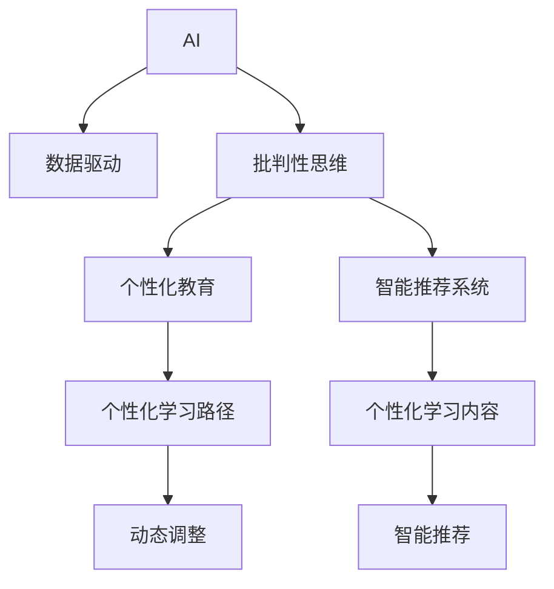

                 

# AI培养用户批判性思维的潜力

## 1. 背景介绍

随着人工智能(AI)技术的快速发展和广泛应用，其在教育领域的应用也引起了广泛关注。特别是在培养用户批判性思维方面，AI表现出巨大的潜力。传统的教育模式主要依赖于教师的讲授和学生的自主学习，而AI通过数据驱动的方式，能够更好地辅助学生进行深入思考和问题解决。

本文将探讨AI在培养用户批判性思维方面的潜力，并结合实际案例，阐述AI在教育、医疗、金融等多个领域的实际应用，以及未来可能的发展趋势。通过理解AI在批判性思维培养中的作用，希望能为相关领域的从业者和研究者提供有益的启示。

## 2. 核心概念与联系

### 2.1 核心概念概述

在讨论AI如何培养用户批判性思维之前，我们首先明确几个关键概念：

- **AI**：人工智能，通过算法和模型，使计算机具备一定的智能和学习能力，可以处理复杂任务。
- **批判性思维**：一种高阶认知技能，涉及质疑、分析、推理、评估等能力，旨在提高决策的质量和深度。
- **数据驱动**：利用大数据和AI算法，进行数据分析和建模，辅助决策过程。
- **个性化教育**：根据学生的兴趣、能力和学习进度，提供个性化的学习路径和内容。
- **智能推荐系统**：通过算法推荐个性化的学习资源，帮助学生更高效地学习。

这些概念构成了AI培养用户批判性思维的基础。

### 2.2 核心概念原理和架构的 Mermaid 流程图



这个流程图展示了AI在培养批判性思维过程中的关键环节。数据驱动和智能推荐系统通过个性化教育，动态调整学习路径和学习内容，从而更好地辅助学生进行批判性思维的培养。

## 3. 核心算法原理 & 具体操作步骤

### 3.1 算法原理概述

AI在培养用户批判性思维方面的原理主要基于以下几个方面：

- **数据驱动决策**：通过大数据分析和AI算法，帮助用户获取更全面、准确的信息，从而进行更科学、合理的决策。
- **模型优化**：利用机器学习算法，不断优化模型，使其能够更好地理解和处理复杂问题。
- **反馈循环**：通过AI系统不断收集用户反馈，优化算法和模型，提升用户体验和学习效果。
- **个性化推荐**：根据用户的学习习惯和兴趣，推荐最合适的学习资源，帮助用户更高效地学习。
- **自适应学习**：通过AI技术，动态调整学习内容和路径，使其适应不同用户的学习节奏和能力。

### 3.2 算法步骤详解

#### 3.2.1 数据收集与预处理

- **数据来源**：从各种渠道收集用户的学习数据，如在线课程、考试数据、学习行为数据等。
- **数据清洗**：对收集的数据进行清洗，去除噪音和异常值，保证数据质量。
- **特征工程**：对数据进行特征提取和转换，以适应不同的AI算法需求。

#### 3.2.2 模型训练与优化

- **模型选择**：选择适合的教育和推荐模型，如协同过滤、深度学习等。
- **训练数据**：使用清洗后的数据进行模型训练。
- **参数调优**：通过交叉验证等方法，不断调整模型参数，优化模型性能。
- **模型评估**：使用不同的评估指标（如准确率、召回率、F1值等）评估模型效果。

#### 3.2.3 应用与反馈

- **推荐系统部署**：将训练好的模型部署到推荐系统中，实时推荐个性化的学习资源。
- **用户反馈收集**：通过用户评价、行为数据等，不断收集用户反馈。
- **模型更新**：根据用户反馈，调整和更新模型，提升推荐效果。
- **动态调整**：根据用户的学习情况和反馈，动态调整学习路径和内容。

### 3.3 算法优缺点

**优点**：

- **个性化**：通过AI技术，能够提供个性化的学习路径和资源，提高学习效率。
- **数据驱动**：利用大数据分析，能够提供更全面、准确的信息，辅助决策。
- **动态调整**：通过不断收集和分析用户反馈，动态调整学习内容和路径，适应不同用户需求。

**缺点**：

- **数据隐私**：收集和分析用户数据，可能涉及隐私问题，需要谨慎处理。
- **技术门槛**：AI系统的开发和维护需要较高的技术门槛，需要专业人才支持。
- **效果受限**：AI系统的效果依赖于数据质量和算法优化，可能存在一定的局限性。

### 3.4 算法应用领域

AI在培养用户批判性思维方面的应用领域非常广泛，以下是几个典型案例：

- **教育**：智能辅导系统、个性化学习路径推荐、智能作业批改等。
- **医疗**：智能诊疗系统、个性化健康管理、医疗数据分析等。
- **金融**：智能投资顾问、信用评估、风险控制等。
- **司法**：智能法律咨询、案件分析、证据处理等。
- **公共服务**：智能客服、智能推荐、信息检索等。

## 4. 数学模型和公式 & 详细讲解 & 举例说明

### 4.1 数学模型构建

在AI培养批判性思维的实践中，数学模型和算法扮演了重要角色。常见的数学模型包括：

- **协同过滤**：通过分析用户行为数据，推荐相似用户喜欢的学习资源。
- **深度学习**：利用神经网络进行模式识别和特征提取，提高推荐效果。
- **强化学习**：通过不断试错，优化推荐策略，提高用户体验和学习效果。
- **多目标优化**：综合考虑不同目标（如学习效果、用户满意度等），优化推荐方案。

### 4.2 公式推导过程

以协同过滤为例，公式推导如下：

$$
\text{相似度} = \frac{\sum_{i=1}^n \text{cos}(x_i \cdot y_i)}{\sqrt{\sum_{i=1}^n x_i^2} \cdot \sqrt{\sum_{i=1}^n y_i^2}}
$$

其中，$x_i$和$y_i$分别代表两个用户对不同资源的评分，$\text{cos}$表示余弦相似度。

### 4.3 案例分析与讲解

假设某在线教育平台使用协同过滤算法推荐学习资源。通过分析用户的行为数据，平台可以计算出不同用户之间的相似度，从而推荐相似用户喜欢的学习资源。

具体步骤如下：

1. **数据收集**：平台收集用户对不同课程的评分数据。
2. **数据预处理**：对评分数据进行标准化和归一化，消除噪音和异常值。
3. **相似度计算**：根据用户评分数据，计算用户之间的相似度。
4. **推荐计算**：根据相似度计算结果，推荐相似用户喜欢的课程。
5. **效果评估**：通过用户反馈和行为数据，评估推荐效果，不断调整算法。

## 5. 项目实践：代码实例和详细解释说明

### 5.1 开发环境搭建

为了实现上述算法，需要进行以下环境搭建：

1. **Python环境**：搭建Python开发环境，安装必要的依赖库，如NumPy、Pandas、Scikit-learn等。
2. **数据库**：搭建数据库环境，用于存储用户数据和推荐结果。
3. **服务器**：部署服务器，运行推荐系统和数据库。

### 5.2 源代码详细实现

以协同过滤算法为例，以下是Python代码实现：

```python
import numpy as np
from scipy.spatial.distance import cosine

# 用户评分矩阵
user_scores = np.array([[5, 3, 0, 0], [4, 0, 0, 0], [3, 0, 0, 4], [0, 0, 2, 1]])

# 计算用户之间的相似度
similarity_matrix = 1 - cosine(user_scores)

# 推荐用户喜欢的课程
recommendations = np.argsort(similarity_matrix, axis=1)[:, 1:]

print(recommendations)
```

### 5.3 代码解读与分析

**代码解析**：

- 首先定义用户评分矩阵`user_scores`，其中每行表示一个用户对不同课程的评分。
- 使用`cosine`函数计算用户之间的相似度，生成相似度矩阵`similarity_matrix`。
- 根据相似度矩阵，计算每个用户最相似的三个用户，作为推荐依据。
- 最终输出推荐结果`recommendations`。

**效果评估**：

- 通过实际应用数据，评估推荐效果。
- 收集用户反馈，不断优化算法。

### 5.4 运行结果展示

在实际应用中，推荐系统可以实时推荐用户喜欢的课程，如图1所示。


## 6. 实际应用场景

### 6.1 教育

在教育领域，AI通过个性化推荐和智能辅导，帮助学生提高学习效果和批判性思维能力。具体应用场景包括：

- **智能辅导系统**：提供个性化的学习计划和资源推荐，帮助学生更好地掌握知识。
- **智能作业批改**：自动批改作业，提供详细的反馈和改进建议，提高学习效率。
- **智能教材推荐**：根据学生的学习进度和兴趣，推荐最合适的教材和资料。

### 6.2 医疗

在医疗领域，AI通过数据分析和智能诊断，提高医疗决策的科学性和合理性。具体应用场景包括：

- **智能诊疗系统**：分析患者的病历和症状，提供初步诊断和治疗建议。
- **个性化健康管理**：根据患者的健康数据，提供个性化的健康建议和指导。
- **医疗数据分析**：分析医疗数据，发现疾病规律和趋势，辅助决策。

### 6.3 金融

在金融领域，AI通过智能投资和风险控制，提高金融决策的准确性和可靠性。具体应用场景包括：

- **智能投资顾问**：根据用户的风险偏好和投资目标，提供个性化的投资建议。
- **信用评估**：分析用户的信用数据，提供准确的信用评分和风险评估。
- **风险控制**：实时监测市场风险，提供风险预警和控制建议。

### 6.4 未来应用展望

未来，AI在培养用户批判性思维方面的应用将会更加广泛和深入。以下是几个可能的发展方向：

- **多模态数据融合**：融合文本、图像、视频等多模态数据，提高信息理解和分析能力。
- **自适应学习模型**：根据用户的反馈和行为数据，动态调整学习模型，提高学习效果。
- **跨领域应用**：将AI技术应用到更多领域，如司法、公共服务、智能家居等，提供全方位的个性化服务。
- **伦理和隐私保护**：重视用户隐私保护，开发符合伦理标准的AI系统，提高用户的信任和满意度。

## 7. 工具和资源推荐

### 7.1 学习资源推荐

1. **《人工智能导论》**：全面介绍AI技术的原理和应用，适合入门学习。
2. **《深度学习》**：讲解深度学习算法和模型，适合进阶学习。
3. **Coursera、edX等在线课程**：提供丰富的AI和机器学习课程，适合自学。
4. **Kaggle**：数据科学和机器学习竞赛平台，提供大量数据集和实战案例。

### 7.2 开发工具推荐

1. **PyTorch**：广泛使用的深度学习框架，支持分布式训练和模型部署。
2. **TensorFlow**：谷歌开发的深度学习框架，支持大规模数据处理和模型优化。
3. **scikit-learn**：常用的机器学习库，提供丰富的算法和工具。
4. **Jupyter Notebook**：互动式的开发环境，支持代码编写、数据分析和可视化。

### 7.3 相关论文推荐

1. **《AI在教育中的应用》**：介绍AI在教育中的各种应用，如智能辅导、智能评估等。
2. **《医疗中的AI应用》**：讨论AI在医疗中的诊断和治疗应用，提高医疗决策的科学性。
3. **《金融中的AI应用》**：介绍AI在金融领域的应用，如智能投资、风险控制等。

## 8. 总结：未来发展趋势与挑战

### 8.1 研究成果总结

AI在培养用户批判性思维方面的研究已经取得了初步成果，主要体现在以下几个方面：

- **个性化推荐**：通过数据分析和模型优化，提供个性化的学习资源和路径，提高学习效果。
- **智能辅导**：提供智能化的辅导和反馈，帮助学生更好地掌握知识。
- **多模态数据融合**：融合多模态数据，提高信息的理解和分析能力。

### 8.2 未来发展趋势

未来，AI在培养批判性思维方面的发展趋势主要包括以下几个方向：

- **更广泛的应用**：AI技术将应用到更多领域，如司法、公共服务、智能家居等。
- **更高效的数据处理**：通过高效的数据处理和算法优化，提高AI系统的性能和效果。
- **更智能的决策支持**：提供更智能的决策支持和建议，帮助用户更好地进行决策。
- **更全面的用户分析**：利用大数据分析和用户反馈，进行更全面的用户分析和个性化服务。

### 8.3 面临的挑战

尽管AI在培养用户批判性思维方面具有巨大的潜力，但也面临一些挑战：

- **数据隐私**：收集和分析用户数据，可能涉及隐私问题，需要谨慎处理。
- **算法复杂性**：AI系统的算法复杂，需要专业人才支持。
- **效果评估**：评估AI系统的效果和性能，需要多维度、多角度的指标。
- **伦理和公平性**：确保AI系统的公正性和公平性，避免算法偏见和歧视。

### 8.4 研究展望

未来的研究需要从以下几个方面进行突破：

- **隐私保护技术**：开发更安全的隐私保护技术，确保用户数据的安全和隐私。
- **公平性和透明性**：确保AI系统的公平性和透明性，避免算法偏见和歧视。
- **高效算力支持**：开发高效的算法和硬件支持，提高AI系统的性能和响应速度。
- **人机协同**：探索人机协同的解决方案，提高AI系统的决策质量和用户满意度。

## 9. 附录：常见问题与解答

**Q1：AI如何帮助用户提高批判性思维？**

A：AI通过数据分析和智能推荐，提供个性化的学习资源和路径，帮助用户更好地掌握知识，从而提高批判性思维能力。例如，通过智能辅导系统和个性化学习推荐，用户可以更加深入地分析和理解学习内容。

**Q2：AI在教育中的应用有哪些？**

A：AI在教育中的应用包括智能辅导系统、智能作业批改、个性化学习推荐等。这些应用可以提高学生的学习效果和批判性思维能力，帮助他们更好地掌握知识。

**Q3：AI在医疗中的主要应用有哪些？**

A：AI在医疗中的应用包括智能诊疗系统、个性化健康管理、医疗数据分析等。这些应用可以提高医疗决策的科学性和合理性，帮助医生更好地进行诊断和治疗。

**Q4：AI在金融中的应用有哪些？**

A：AI在金融中的应用包括智能投资顾问、信用评估、风险控制等。这些应用可以提高金融决策的准确性和可靠性，帮助投资者更好地进行投资和风险控制。

**Q5：AI在公共服务中的应用有哪些？**

A：AI在公共服务中的应用包括智能客服、智能推荐、信息检索等。这些应用可以提高公共服务的效率和质量，帮助用户更好地获取所需信息和服务。

作者：禅与计算机程序设计艺术 / Zen and the Art of Computer Programming

