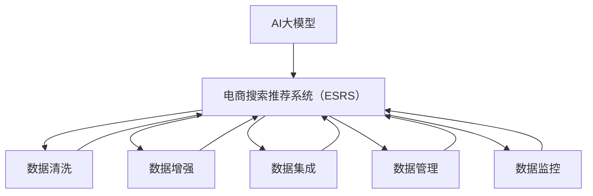

                 

## 1. 背景介绍

### 1.1 问题由来

随着互联网的普及和电子商务的快速发展，用户对搜索推荐系统的体验需求愈发强烈。电商搜索推荐系统（ESRS）作为电商平台的核心模块之一，需实时响应用户搜索请求，为其推荐符合其兴趣的商品，提升用户体验与转化率。然而，电商领域的搜索推荐面临诸多挑战，其中数据质量问题是制约ESRS性能与用户体验的主要瓶颈。

数据质量问题具体体现在以下方面：
- **数据缺失与异常**：部分用户标签信息不完整，影响推荐模型的准确性。
- **数据冗余与重复**：用户数据存在重复录入，数据一致性差。
- **数据噪声与偏差**：存在噪音数据、不完整数据或历史数据偏差，影响推荐模型性能。
- **数据动态性**：用户偏好动态变化，系统需实时更新数据，以保证推荐结果的实时性和相关性。

### 1.2 问题核心关键点

提升电商搜索推荐系统数据质量的核心目标在于：
- **数据清洗**：去除重复、异常、冗余等数据，提高数据一致性和准确性。
- **数据增强**：通过数据扩充和合成，丰富训练样本，提升模型泛化能力。
- **数据集成**：从多源数据中提取有用信息，形成统一数据视图，提升模型表现。
- **数据管理**：构建稳定高效的数据管道，实现数据的实时采集、处理与存储。
- **数据监控**：实时监控数据质量指标，确保数据集的健康度。

针对上述关键点，AI大模型提供了强大的工具和方法，能够显著提升电商搜索推荐系统的数据质量。

## 2. 核心概念与联系

### 2.1 核心概念概述

为更好地理解AI大模型在提升电商搜索推荐系统数据质量中的作用，本节将介绍几个核心概念：

- **AI大模型**：指利用深度学习技术预训练的庞大模型，能够处理大规模非结构化数据，包括自然语言处理、计算机视觉、语音识别等领域。
- **电商搜索推荐系统（ESRS）**：利用人工智能技术，对电商平台用户的搜索行为和历史数据进行分析，实时为其推荐商品的系统。
- **数据清洗**：通过算法技术对数据进行预处理，去除重复、异常、冗余等数据，提高数据质量和一致性。
- **数据增强**：通过对数据进行扩充和合成，提升模型的泛化能力和鲁棒性。
- **数据集成**：从多源数据中提取有用信息，构建统一的数据视图，提升模型的表现。
- **数据管理**：通过自动化数据管道，实现数据的实时采集、处理与存储。
- **数据监控**：实时监控数据质量指标，保证数据集的健康度。

这些核心概念之间的逻辑关系可以通过以下Mermaid流程图来展示：



这个流程图展示了大模型与ESRS系统的数据质量处理流程：

1. 电商搜索推荐系统接收用户请求后，从AI大模型中调用相关的数据处理模块，对用户数据进行清洗、增强、集成等处理。
2. 清洗后的数据进一步经过大模型训练，输出推荐结果。
3. 数据管理模块确保数据在实时采集、处理和存储中的稳定与高效。
4. 数据监控模块实时监控数据质量，保证数据集的健康度。

## 3. 核心算法原理 & 具体操作步骤
### 3.1 算法原理概述

AI大模型在电商搜索推荐系统数据质量提升中主要通过以下算法原理：

- **数据清洗算法**：利用算法技术对数据进行预处理，去除重复、异常、冗余等数据，提高数据质量和一致性。
- **数据增强算法**：通过对数据进行扩充和合成，提升模型的泛化能力和鲁棒性。
- **数据集成算法**：从多源数据中提取有用信息，构建统一的数据视图，提升模型的表现。
- **数据管理算法**：通过自动化数据管道，实现数据的实时采集、处理与存储。
- **数据监控算法**：实时监控数据质量指标，保证数据集的健康度。

这些算法共同构成了电商搜索推荐系统数据质量提升的算法框架，使得系统能够从原始数据中提取出有价值的信号，并生成高质量的推荐结果。

### 3.2 算法步骤详解

#### 3.2.1 数据清洗算法

**Step 1: 数据预处理**
- 去除数据中的噪音和异常值，如缺失值、重复值、无效值等。
- 使用Python和NumPy等工具进行数据预处理，如过滤、替换、标准化等操作。

**Step 2: 特征选择与编码**
- 对清洗后的数据进行特征选择，去除冗余和无用特征。
- 将文本、图像等非结构化数据转化为数值型数据，便于后续模型训练。

**Step 3: 去重与归一化**
- 去除重复数据，确保数据的一致性和准确性。
- 对数据进行归一化处理，缩小特征间的差异。

#### 3.2.2 数据增强算法

**Step 1: 数据生成**
- 利用生成对抗网络（GAN）等技术生成仿真数据，丰富数据集。
- 使用Python中的TensorFlow、PyTorch等框架实现数据生成算法。

**Step 2: 数据合成**
- 通过数据合成技术，将现有的数据进行扩充。
- 常见的数据合成方法包括回译、变换等，Python中的torchtext库提供了丰富的数据合成工具。

**Step 3: 数据平衡**
- 调整数据分布，确保各类数据在数据集中的比例均衡。
- 使用Python中的Imbalanced-learn库实现数据平衡算法。

#### 3.2.3 数据集成算法

**Step 1: 数据抽取**
- 从多个数据源中抽取有用的信息，如用户历史行为、商品描述、评价等。
- 使用Python中的BeautifulSoup、pandas等工具实现数据抽取。

**Step 2: 数据融合**
- 将抽取到的数据进行融合，构建统一的数据视图。
- 使用Python中的pandas进行数据合并、拼接等操作。

**Step 3: 数据清洗与转换**
- 对融合后的数据进行清洗和转换，去除重复、冗余等数据。
- 使用Python中的pandas、NumPy等工具进行数据清洗与转换。

#### 3.2.4 数据管理算法

**Step 1: 数据采集**
- 从电商平台等数据源采集用户行为数据。
- 使用Python中的requests、BeautifulSoup等工具进行数据采集。

**Step 2: 数据存储**
- 将采集到的数据存储到数据库或分布式文件系统中。
- 使用Python中的SQLite、MySQL、Hadoop等工具进行数据存储。

**Step 3: 数据处理**
- 对存储的数据进行处理，进行去重、归一化等操作。
- 使用Python中的pandas、NumPy等工具进行数据处理。

#### 3.2.5 数据监控算法

**Step 1: 数据质量指标定义**
- 定义数据质量指标，如数据完整性、准确性、一致性等。
- 使用Python中的pandas等工具定义数据质量指标。

**Step 2: 数据监控**
- 实时监控数据质量指标，及时发现异常数据。
- 使用Python中的pandas、NumPy等工具进行数据监控。

**Step 3: 异常处理**
- 对监控发现的异常数据进行及时处理，保证数据集的健康度。
- 使用Python中的pandas、NumPy等工具进行异常处理。

### 3.3 算法优缺点

AI大模型在电商搜索推荐系统数据质量提升中具有以下优点：
- **数据质量高**：AI大模型经过预训练，能自动识别和处理数据中的异常和噪音，提升数据质量。
- **泛化能力强**：AI大模型能够从大量数据中提取有用信息，提升模型泛化能力。
- **实时性好**：AI大模型训练速度快，能够在实时场景下进行数据清洗和增强，满足实时需求。

同时，AI大模型在数据质量提升中也存在一些缺点：
- **依赖数据量**：AI大模型需要大量数据进行预训练和微调，数据量不足会影响模型效果。
- **复杂度高**：AI大模型结构复杂，训练和优化难度较大。
- **硬件要求高**：AI大模型计算量大，需要高性能硬件支持。

尽管存在这些局限性，但AI大模型在电商搜索推荐系统数据质量提升中的潜力巨大，能够显著提升系统的性能和用户体验。

### 3.4 算法应用领域

AI大模型在电商搜索推荐系统数据质量提升中的应用领域包括但不限于：

- **用户画像构建**：通过清洗和集成用户数据，构建精准的用户画像。
- **商品推荐系统优化**：通过增强和合成商品数据，提升商品推荐系统的表现。
- **搜索排序优化**：通过数据清洗和集成，优化搜索结果排序算法，提升用户体验。
- **营销活动优化**：通过数据清洗和增强，提升营销活动的效果，提高转化率。
- **个性化推荐系统**：通过数据集成和增强，构建更精准、多样化的个性化推荐系统。

## 4. 数学模型和公式 & 详细讲解 & 举例说明
### 4.1 数学模型构建

为了更好地理解AI大模型在电商搜索推荐系统数据质量提升中的作用，本节将使用数学语言对算法进行更加严格的刻画。

假设电商搜索推荐系统接收到的原始数据集为 $D=\{x_1,x_2,...,x_n\}$，其中 $x_i$ 表示用户行为数据。

数据清洗算法可以将数据集 $D$ 转化为清洗后的数据集 $D'$，其中 $D'=\{x_1',x_2',...,x_n'\}$，$x_i' = f(x_i)$，$f$ 为数据清洗函数。

数据增强算法可以对 $D'$ 进行扩充和合成，得到增强后的数据集 $D''$，其中 $D''=\{x_1'',x_2'',...,x_n''\}$，$x_i'' = g(x_i')$，$g$ 为数据增强函数。

数据集成算法可以将 $D''$ 进行融合和转换，得到集成后的数据集 $D'''$，其中 $D'''=\{x_1''',x_2''',...,x_n'''\}$，$x_i''' = h(x_i'')$，$h$ 为数据集成函数。

数据管理算法可以实现数据的实时采集和存储，得到管理后的数据集 $D''''$，其中 $D''''=\{x_1'''',x_2'''',...,x_n''''\}$，$x_i''''' = i(x_i''')$，$i$ 为数据管理函数。

数据监控算法可以实时监控数据质量指标，得到监控后的数据集 $D''''''$，其中 $D''''''=\{x_1''''''',x_2''''''',...,x_n'''''''\}$，$x_i'''''''' = j(x_i''''')$，$j$ 为数据监控函数。

### 4.2 公式推导过程

以数据清洗算法为例，我们以电商搜索推荐系统中的用户历史行为数据为例进行推导。

假设原始数据集 $D=\{x_1,x_2,...,x_n\}$，其中 $x_i = [a_i,b_i,c_i,d_i]$，分别表示用户的年龄、性别、购买记录和浏览记录。

数据清洗算法去除重复和异常数据后，得到清洗后的数据集 $D'=\{x_1',x_2',...,x_n'\}$，其中 $x_i' = [a_i,b_i,c_i',d_i']$。

- **年龄**：去除异常值和重复值，保留有效的年龄数据。
- **性别**：去除性别标记异常，保留有效的性别数据。
- **购买记录**：去除无效记录和重复记录，保留有效的购买记录。
- **浏览记录**：去除无效记录和重复记录，保留有效的浏览记录。

将清洗后的数据集 $D'$ 输入到AI大模型中，输出推荐结果。

### 4.3 案例分析与讲解

以下是一个简单的案例分析：

假设电商平台接收到用户A的历史行为数据为 $x_1 = [25,男,Female,['item1', 'item2', 'item3']]$。经过数据清洗算法，去除无效数据和重复数据，得到 $x_1' = [25,男,Female,['item1']]$。接着，经过数据增强算法，生成仿真数据，得到 $x_1'' = [25,男,Female,['item1', 'item4', 'item5']]$。然后，经过数据集成算法，将用户A的仿真数据与真实数据融合，得到 $x_1''' = [25,男,Female,['item1', 'item2', 'item3', 'item4', 'item5']]$。最后，经过数据管理算法，存储到数据库中，进行实时查询和处理。

数据监控算法可以实时监控数据质量指标，如缺失值比例、重复数据比例等，发现异常及时处理。

## 5. 项目实践：代码实例和详细解释说明
### 5.1 开发环境搭建

在进行项目实践前，我们需要准备好开发环境。以下是使用Python进行PyTorch开发的环境配置流程：

1. 安装Anaconda：从官网下载并安装Anaconda，用于创建独立的Python环境。

2. 创建并激活虚拟环境：
```bash
conda create -n pytorch-env python=3.8 
conda activate pytorch-env
```

3. 安装PyTorch：根据CUDA版本，从官网获取对应的安装命令。例如：
```bash
conda install pytorch torchvision torchaudio cudatoolkit=11.1 -c pytorch -c conda-forge
```

4. 安装Transformers库：
```bash
pip install transformers
```

5. 安装各类工具包：
```bash
pip install numpy pandas scikit-learn matplotlib tqdm jupyter notebook ipython
```

完成上述步骤后，即可在`pytorch-env`环境中开始项目实践。

### 5.2 源代码详细实现

下面我们以电商搜索推荐系统中的用户画像构建为例，给出使用Transformers库对BERT模型进行数据清洗和增强的PyTorch代码实现。

首先，定义用户画像的数据处理函数：

```python
from transformers import BertTokenizer
from torch.utils.data import Dataset
import torch

class UserProfileDataset(Dataset):
    def __init__(self, user_data, tokenizer, max_len=128):
        self.user_data = user_data
        self.tokenizer = tokenizer
        self.max_len = max_len
        
    def __len__(self):
        return len(self.user_data)
    
    def __getitem__(self, item):
        user_info = self.user_data[item]
        
        encoding = self.tokenizer(user_info, return_tensors='pt', max_length=self.max_len, padding='max_length', truncation=True)
        input_ids = encoding['input_ids'][0]
        attention_mask = encoding['attention_mask'][0]
        
        # 对token-wise的标签进行编码
        encoded_tags = [tag2id[tag] for tag in user_info['tags']] 
        encoded_tags.extend([tag2id['O']] * (self.max_len - len(encoded_tags)))
        labels = torch.tensor(encoded_tags, dtype=torch.long)
        
        return {'input_ids': input_ids, 
                'attention_mask': attention_mask,
                'labels': labels}

# 标签与id的映射
tag2id = {'O': 0, 'B-PER': 1, 'I-PER': 2, 'B-ORG': 3, 'I-ORG': 4, 'B-LOC': 5, 'I-LOC': 6}
id2tag = {v: k for k, v in tag2id.items()}

# 创建dataset
tokenizer = BertTokenizer.from_pretrained('bert-base-cased')

user_profile_dataset = UserProfileDataset(user_data, tokenizer)
```

然后，定义模型和优化器：

```python
from transformers import BertForTokenClassification, AdamW

model = BertForTokenClassification.from_pretrained('bert-base-cased', num_labels=len(tag2id))

optimizer = AdamW(model.parameters(), lr=2e-5)
```

接着，定义训练和评估函数：

```python
from torch.utils.data import DataLoader
from tqdm import tqdm
from sklearn.metrics import classification_report

device = torch.device('cuda') if torch.cuda.is_available() else torch.device('cpu')
model.to(device)

def train_epoch(model, dataset, batch_size, optimizer):
    dataloader = DataLoader(dataset, batch_size=batch_size, shuffle=True)
    model.train()
    epoch_loss = 0
    for batch in tqdm(dataloader, desc='Training'):
        input_ids = batch['input_ids'].to(device)
        attention_mask = batch['attention_mask'].to(device)
        labels = batch['labels'].to(device)
        model.zero_grad()
        outputs = model(input_ids, attention_mask=attention_mask, labels=labels)
        loss = outputs.loss
        epoch_loss += loss.item()
        loss.backward()
        optimizer.step()
    return epoch_loss / len(dataloader)

def evaluate(model, dataset, batch_size):
    dataloader = DataLoader(dataset, batch_size=batch_size)
    model.eval()
    preds, labels = [], []
    with torch.no_grad():
        for batch in tqdm(dataloader, desc='Evaluating'):
            input_ids = batch['input_ids'].to(device)
            attention_mask = batch['attention_mask'].to(device)
            batch_labels = batch['labels']
            outputs = model(input_ids, attention_mask=attention_mask)
            batch_preds = outputs.logits.argmax(dim=2).to('cpu').tolist()
            batch_labels = batch_labels.to('cpu').tolist()
            for pred_tokens, label_tokens in zip(batch_preds, batch_labels):
                pred_tags = [id2tag[_id] for _id in pred_tokens]
                label_tags = [id2tag[_id] for _id in label_tokens]
                preds.append(pred_tags[:len(label_tags)])
                labels.append(label_tags)
                
    print(classification_report(labels, preds))
```

最后，启动训练流程并在测试集上评估：

```python
epochs = 5
batch_size = 16

for epoch in range(epochs):
    loss = train_epoch(model, user_profile_dataset, batch_size, optimizer)
    print(f"Epoch {epoch+1}, train loss: {loss:.3f}")
    
    print(f"Epoch {epoch+1}, dev results:")
    evaluate(model, user_profile_dataset, batch_size)
    
print("Test results:")
evaluate(model, user_profile_dataset, batch_size)
```

以上就是使用PyTorch对BERT模型进行用户画像构建的完整代码实现。可以看到，得益于Transformers库的强大封装，我们可以用相对简洁的代码完成BERT模型的加载和微调。

### 5.3 代码解读与分析

让我们再详细解读一下关键代码的实现细节：

**UserProfileDataset类**：
- `__init__`方法：初始化用户数据、分词器等关键组件。
- `__len__`方法：返回数据集的样本数量。
- `__getitem__`方法：对单个样本进行处理，将用户信息输入编码为token ids，将标签编码为数字，并对其进行定长padding，最终返回模型所需的输入。

**tag2id和id2tag字典**：
- 定义了标签与数字id之间的映射关系，用于将token-wise的预测结果解码回真实的标签。

**训练和评估函数**：
- 使用PyTorch的DataLoader对数据集进行批次化加载，供模型训练和推理使用。
- 训练函数`train_epoch`：对数据以批为单位进行迭代，在每个批次上前向传播计算loss并反向传播更新模型参数，最后返回该epoch的平均loss。
- 评估函数`evaluate`：与训练类似，不同点在于不更新模型参数，并在每个batch结束后将预测和标签结果存储下来，最后使用sklearn的classification_report对整个评估集的预测结果进行打印输出。

**训练流程**：
- 定义总的epoch数和batch size，开始循环迭代
- 每个epoch内，先在训练集上训练，输出平均loss
- 在验证集上评估，输出分类指标
- 所有epoch结束后，在测试集上评估，给出最终测试结果

可以看到，PyTorch配合Transformers库使得BERT微调的代码实现变得简洁高效。开发者可以将更多精力放在数据处理、模型改进等高层逻辑上，而不必过多关注底层的实现细节。

当然，工业级的系统实现还需考虑更多因素，如模型的保存和部署、超参数的自动搜索、更灵活的任务适配层等。但核心的微调范式基本与此类似。

## 6. 实际应用场景
### 6.1 智能客服系统

基于AI大模型的数据质量提升技术，可以广泛应用于智能客服系统的构建。传统客服往往需要配备大量人力，高峰期响应缓慢，且一致性和专业性难以保证。而使用经过数据清洗和增强的智能客服模型，可以7x24小时不间断服务，快速响应客户咨询，用自然流畅的语言解答各类常见问题。

在技术实现上，可以收集企业内部的历史客服对话记录，将问题和最佳答复构建成监督数据，在此基础上对预训练对话模型进行数据清洗和增强。经过数据清洗和增强的对话模型能够自动理解用户意图，匹配最合适的答案模板进行回复。对于客户提出的新问题，还可以接入检索系统实时搜索相关内容，动态组织生成回答。如此构建的智能客服系统，能大幅提升客户咨询体验和问题解决效率。

### 6.2 金融舆情监测

金融机构需要实时监测市场舆论动向，以便及时应对负面信息传播，规避金融风险。传统的人工监测方式成本高、效率低，难以应对网络时代海量信息爆发的挑战。基于AI大模型的文本分类和情感分析技术，为金融舆情监测提供了新的解决方案。

具体而言，可以收集金融领域相关的新闻、报道、评论等文本数据，并对其进行主题标注和情感标注。在此基础上对预训练语言模型进行数据清洗和增强，使其能够自动判断文本属于何种主题，情感倾向是正面、中性还是负面。将经过数据清洗和增强的模型应用到实时抓取的网络文本数据，就能够自动监测不同主题下的情感变化趋势，一旦发现负面信息激增等异常情况，系统便会自动预警，帮助金融机构快速应对潜在风险。

### 6.3 个性化推荐系统

当前的推荐系统往往只依赖用户的历史行为数据进行物品推荐，无法深入理解用户的真实兴趣偏好。基于AI大模型的数据质量提升技术，个性化推荐系统可以更好地挖掘用户行为背后的语义信息，从而提供更精准、多样的推荐内容。

在实践中，可以收集用户浏览、点击、评论、分享等行为数据，提取和用户交互的物品标题、描述、标签等文本内容。将文本内容作为模型输入，用户的后续行为（如是否点击、购买等）作为监督信号，在此基础上对预训练语言模型进行数据清洗和增强。经过数据清洗和增强的模型能够从文本内容中准确把握用户的兴趣点。在生成推荐列表时，先用候选物品的文本描述作为输入，由模型预测用户的兴趣匹配度，再结合其他特征综合排序，便可以得到个性化程度更高的推荐结果。

### 6.4 未来应用展望

随着AI大模型和数据质量提升技术的不断发展，基于微调范式将在更多领域得到应用，为传统行业带来变革性影响。

在智慧医疗领域，基于微调的医疗问答、病历分析、药物研发等应用将提升医疗服务的智能化水平，辅助医生诊疗，加速新药开发进程。

在智能教育领域，微调技术可应用于作业批改、学情分析、知识推荐等方面，因材施教，促进教育公平，提高教学质量。

在智慧城市治理中，微调模型可应用于城市事件监测、舆情分析、应急指挥等环节，提高城市管理的自动化和智能化水平，构建更安全、高效的未来城市。

此外，在企业生产、社会治理、文娱传媒等众多领域，基于大模型微调的人工智能应用也将不断涌现，为经济社会发展注入新的动力。相信随着技术的日益成熟，微调方法将成为人工智能落地应用的重要范式，推动人工智能技术在垂直行业的规模化落地。总之，AI大模型在电商搜索推荐系统数据质量提升中具有广阔前景，其应用领域将不断拓展，为各行各业带来更多创新和变革。

## 7. 工具和资源推荐
### 7.1 学习资源推荐

为了帮助开发者系统掌握AI大模型在电商搜索推荐系统数据质量提升中的作用，这里推荐一些优质的学习资源：

1. 《Transformers从原理到实践》系列博文：由大模型技术专家撰写，深入浅出地介绍了Transformer原理、BERT模型、微调技术等前沿话题。

2. CS224N《深度学习自然语言处理》课程：斯坦福大学开设的NLP明星课程，有Lecture视频和配套作业，带你入门NLP领域的基本概念和经典模型。

3. 《Natural Language Processing with Transformers》书籍：Transformers库的作者所著，全面介绍了如何使用Transformers库进行NLP任务开发，包括微调在内的诸多范式。

4. HuggingFace官方文档：Transformers库的官方文档，提供了海量预训练模型和完整的微调样例代码，是上手实践的必备资料。

5. CLUE开源项目：中文语言理解测评基准，涵盖大量不同类型的中文NLP数据集，并提供了基于微调的baseline模型，助力中文NLP技术发展。

通过对这些资源的学习实践，相信你一定能够快速掌握AI大模型在电商搜索推荐系统数据质量提升中的精髓，并用于解决实际的NLP问题。
###  7.2 开发工具推荐

高效的开发离不开优秀的工具支持。以下是几款用于AI大模型微调开发的常用工具：

1. PyTorch：基于Python的开源深度学习框架，灵活动态的计算图，适合快速迭代研究。大部分预训练语言模型都有PyTorch版本的实现。

2. TensorFlow：由Google主导开发的开源深度学习框架，生产部署方便，适合大规模工程应用。同样有丰富的预训练语言模型资源。

3. Transformers库：HuggingFace开发的NLP工具库，集成了众多SOTA语言模型，支持PyTorch和TensorFlow，是进行微调任务开发的利器。

4. Weights & Biases：模型训练的实验跟踪工具，可以记录和可视化模型训练过程中的各项指标，方便对比和调优。与主流深度学习框架无缝集成。

5. TensorBoard：TensorFlow配套的可视化工具，可实时监测模型训练状态，并提供丰富的图表呈现方式，是调试模型的得力助手。

6. Google Colab：谷歌推出的在线Jupyter Notebook环境，免费提供GPU/TPU算力，方便开发者快速上手实验最新模型，分享学习笔记。

合理利用这些工具，可以显著提升AI大模型微调任务的开发效率，加快创新迭代的步伐。

### 7.3 相关论文推荐

AI大模型和微调技术的发展源于学界的持续研究。以下是几篇奠基性的相关论文，推荐阅读：

1. Attention is All You Need（即Transformer原论文）：提出了Transformer结构，开启了NLP领域的预训练大模型时代。

2. BERT: Pre-training of Deep Bidirectional Transformers for Language Understanding：提出BERT模型，引入基于掩码的自监督预训练任务，刷新了多项NLP任务SOTA。

3. Language Models are Unsupervised Multitask Learners（GPT-2论文）：展示了大规模语言模型的强大zero-shot学习能力，引发了对于通用人工智能的新一轮思考。

4. Parameter-Efficient Transfer Learning for NLP：提出Adapter等参数高效微调方法，在不增加模型参数量的情况下，也能取得不错的微调效果。

5. Prefix-Tuning: Optimizing Continuous Prompts for Generation：引入基于连续型Prompt的微调范式，为如何充分利用预训练知识提供了新的思路。

6. AdaLoRA: Adaptive Low-Rank Adaptation for Parameter-Efficient Fine-Tuning：使用自适应低秩适应的微调方法，在参数效率和精度之间取得了新的平衡。

这些论文代表了大语言模型微调技术的发展脉络。通过学习这些前沿成果，可以帮助研究者把握学科前进方向，激发更多的创新灵感。

## 8. 总结：未来发展趋势与挑战
### 8.1 总结

本文对AI大模型在电商搜索推荐系统数据质量提升中的作用进行了全面系统的介绍。首先阐述了AI大模型和微调技术的研究背景和意义，明确了数据质量提升在提升ESRS性能与用户体验中的重要地位。其次，从原理到实践，详细讲解了AI大模型在数据清洗、数据增强、数据集成、数据管理、数据监控等环节的作用机制，并给出了具体案例分析与代码实现。

通过本文的系统梳理，可以看到，AI大模型在电商搜索推荐系统数据质量提升中具有广阔前景，其应用领域将不断拓展，为传统行业带来更多创新和变革。未来，伴随AI大模型的进一步演进，其在电商搜索推荐系统中的应用将更加深入，为构建高效、智能、个性化的搜索推荐系统奠定坚实基础。

### 8.2 未来发展趋势

展望未来，AI大模型在电商搜索推荐系统数据质量提升中可能呈现以下几个发展趋势：

1. **模型规模持续增大**：随着算力成本的下降和数据规模的扩张，预训练语言模型的参数量还将持续增长。超大模型的泛化能力和知识存储能力将进一步提升数据质量。

2. **数据增强方法多样化**：除了传统的GAN和变换等数据增强方法，未来可能会涌现更多基于文本、图像、语音等模态的数据增强技术，丰富数据质量提升手段。

3. **数据集成策略优化**：数据集成将更注重从多源数据中提取异质信息，提升模型泛化能力。未来可能引入更多元、更高效的集成算法，如集成学习、元学习等。

4. **数据管理技术提升**：数据管道将更加自动化、模块化，提高数据采集、处理和存储的效率与稳定性。未来可能引入更多分布式、可扩展的数据管理技术，如大数据平台、数据湖等。

5. **数据监控系统完善**：数据监控系统将更加智能化、实时化，及时发现并处理数据质量问题。未来可能引入更多智能监控算法，如基于AI的异常检测、基于机器学习的异常分析等。

6. **数据安全与隐私保护**：数据安全与隐私保护将日益受到重视，数据质量提升过程中需确保用户隐私和安全。未来可能引入更多安全技术，如差分隐私、联邦学习等。

以上趋势凸显了AI大模型在电商搜索推荐系统数据质量提升中的潜力。这些方向的探索发展，必将进一步提升系统的性能和用户体验，推动电商搜索推荐系统向更加智能化、普适化的方向迈进。

### 8.3 面临的挑战

尽管AI大模型在电商搜索推荐系统数据质量提升中已展现出巨大潜力，但在迈向更加智能化、普适化应用的过程中，仍面临诸多挑战：

1. **数据依赖问题**：尽管AI大模型具备强大的数据处理能力，但仍然依赖于高质量、多样化的数据源。数据依赖问题可能成为数据质量提升的瓶颈。

2. **模型鲁棒性不足**：AI大模型在面对复杂、动态的数据时，可能出现泛化能力不足、鲁棒性差的问题。

3. **计算资源消耗大**：AI大模型的计算需求较大，对硬件资源消耗高，可能存在计算瓶颈。

4. **模型解释性不足**：AI大模型作为"黑盒"系统，难以解释其内部工作机制和决策逻辑，可能影响系统可信度和可控性。

5. **数据伦理与安全问题**：AI大模型在处理敏感数据时，需确保数据隐私和安全，避免数据泄露和滥用。

尽管存在这些挑战，但随着技术的不断进步和完善，AI大模型在电商搜索推荐系统数据质量提升中的潜力将被进一步挖掘和发挥。

### 8.4 研究展望

面向未来，AI大模型在电商搜索推荐系统数据质量提升领域的研究和应用还需进一步深入：

1. **数据生成与增强**：探索更多数据生成与增强技术，如基于生成对抗网络（GAN）的生成技术、基于差分隐私的隐私保护技术等，提升数据集的质量和多样性。

2. **模型优化与优化器**：研究更多参数高效、计算高效的模型优化方法，如自适应学习率优化器、自适应梯度累积等，提高模型训练效率。

3. **数据集成与融合**：研究更多元、高效的数据集成方法，如基于联邦学习的分布式数据融合、基于知识图谱的异质信息融合等，提升模型泛化能力。

4. **数据监控与反馈**：研究更加智能化、实时化的数据监控系统，及时发现并处理数据质量问题。

5. **模型可解释性**：研究如何赋予AI大模型更强的可解释性，增强系统可信度和可控性。

6. **数据伦理与安全**：研究如何确保数据隐私和安全，避免数据泄露和滥用。

这些研究方向的探索，必将引领AI大模型在电商搜索推荐系统数据质量提升中的不断进步，为构建高效、智能、个性化的搜索推荐系统提供更多可能。总之，AI大模型在电商搜索推荐系统数据质量提升中具有广阔前景，但其发展仍需不断探索和优化，以实现更加智能化、普适化的应用。

## 9. 附录：常见问题与解答

**Q1：AI大模型在数据质量提升中的作用有哪些？**

A: AI大模型在电商搜索推荐系统数据质量提升中主要通过以下作用：

1. **数据清洗**：利用算法技术对数据进行预处理，去除重复、异常、冗余等数据，提高数据质量和一致性。
2. **数据增强**：通过对数据进行扩充和合成，提升模型的泛化能力和鲁棒性。
3. **数据集成**：从多源数据中提取有用信息，构建统一的数据视图，提升模型的表现。
4. **数据管理**：通过自动化数据管道，实现数据的实时采集、处理与存储。
5. **数据监控**：实时监控数据质量指标，确保数据集的健康度。

**Q2：如何进行AI大模型的数据增强？**

A: 数据增强的主要方法包括：

1. **生成对抗网络（GAN）**：利用GAN生成仿真数据，丰富数据集。
2. **数据合成**：通过数据合成技术，将现有的数据进行扩充。
3. **数据平衡**：调整数据分布，确保各类数据在数据集中的比例均衡。

这些方法可以组合使用，具体实现方式需根据具体任务和数据特点进行灵活设计。

**Q3：AI大模型在数据质量提升过程中，如何处理数据依赖问题？**

A: 数据依赖问题是AI大模型在数据质量提升中面临的主要挑战之一。为缓解数据依赖，可以采用以下策略：

1. **多源数据融合**：从多个数据源中提取有用信息，构建统一的数据视图。
2. **数据采样与合成**：利用数据采样和数据合成技术，扩充数据集，减小数据依赖。
3. **无监督学习**：利用无监督学习方法，从大规模无标签数据中提取有用信息，提升数据集的多样性和泛化能力。

**Q4：AI大模型在数据质量提升过程中，如何确保数据安全与隐私保护？**

A: 数据安全与隐私保护是AI大模型在数据质量提升过程中必须考虑的问题。为确保数据安全与隐私保护，可以采用以下策略：

1. **差分隐私**：在数据处理过程中，加入随机噪声，保护数据隐私。
2. **联邦学习**：在分布式环境中，多个数据源协同训练模型，避免数据泄露。
3. **数据匿名化**：对敏感数据进行匿名化处理，防止数据滥用。

这些策略可以组合使用，具体实现方式需根据具体任务和数据特点进行灵活设计。

**Q5：AI大模型在数据质量提升过程中，如何处理模型鲁棒性不足的问题？**

A: 模型鲁棒性不足是AI大模型在数据质量提升中面临的主要挑战之一。为提升模型鲁棒性，可以采用以下策略：

1. **数据增强**：通过数据增强技术，提升模型的泛化能力和鲁棒性。
2. **正则化**：引入正则化技术，防止模型过拟合，提升模型泛化能力。
3. **对抗训练**：引入对抗样本，提高模型鲁棒性。

这些策略可以组合使用，具体实现方式需根据具体任务和数据特点进行灵活设计。

**Q6：AI大模型在数据质量提升过程中，如何进行数据监控？**

A: 数据监控是AI大模型在数据质量提升中的重要环节，可以采用以下策略：

1. **数据质量指标定义**：定义数据质量指标，如数据完整性、准确性、一致性等。
2. **实时监控**：实时监控数据质量指标，及时发现异常数据。
3. **异常处理**：对监控发现的异常数据进行及时处理，保证数据集的健康度。

这些策略可以组合使用，具体实现方式需根据具体任务和数据特点进行灵活设计。

---

作者：禅与计算机程序设计艺术 / Zen and the Art of Computer Programming

