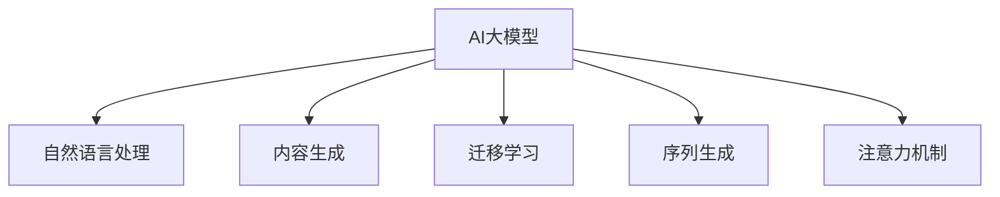

                 

# AI大模型在电商平台内容生成中的应用

## 1. 背景介绍

### 1.1 问题由来
随着电商平台的高速发展，内容生成（Content Generation）成为了业务增长的关键因素之一。传统的电商平台内容生成通常依赖于人工撰写，但这种方式不仅效率低下，且容易产生重复和低质量内容。此外，随着用户需求的不断变化，电商平台需要不断更新和优化产品信息，以提升用户体验和转化率。

### 1.2 问题核心关键点
为此，电商平台开始探索使用AI大模型进行内容生成。AI大模型能够通过海量数据进行训练，学习到丰富的语言表达能力，并能够根据输入提示生成高质量的内容。这不仅显著提高了内容生成的效率和质量，还能够快速响应市场变化，提升用户体验。

### 1.3 问题研究意义
研究AI大模型在电商平台内容生成中的应用，对于提升电商平台的用户体验、促进业务增长、优化运营效率具有重要意义：

1. **提高内容生成效率**：AI大模型可以自动生成大量的高质量商品描述、评价、广告文案等，显著缩短内容生成周期。
2. **优化用户体验**：高质量的内容能够更好地吸引用户注意力，提升点击率和转化率，增强用户粘性。
3. **促进业务增长**：精准的内容推荐和个性化营销策略，能够提高电商平台的销售额和市场竞争力。
4. **优化运营效率**：自动化的内容生成和更新减少了人工干预，降低了运营成本，提升了整体运营效率。
5. **应对市场变化**：AI大模型可以快速适应市场变化，更新商品信息，保持内容的时效性和相关性。

## 2. 核心概念与联系

### 2.1 核心概念概述

为更好地理解AI大模型在电商平台内容生成中的应用，本节将介绍几个密切相关的核心概念：

- **AI大模型（AI Large Model）**：以深度学习为基础，通过海量数据训练得到的强大语言模型，能够进行文本生成、理解、推理等自然语言处理任务。
- **内容生成（Content Generation）**：通过AI大模型自动生成文本内容，如商品描述、广告文案、用户评价等，用于电商平台的用户交互和营销推广。
- **自然语言处理（Natural Language Processing, NLP）**：利用计算机技术处理和分析自然语言数据，包括文本生成、理解、分类、推理等。
- **迁移学习（Transfer Learning）**：通过在预训练模型基础上添加微调层，使模型能够适应特定任务，提高生成内容的针对性和质量。
- **序列生成（Sequence Generation）**：通过循环神经网络（RNN）或变分自编码器（VAE）等模型，自动生成连续的文本序列，用于内容生成。
- **注意力机制（Attention Mechanism）**：用于在生成过程中动态关注输入序列中的关键信息，提升文本生成的质量。

这些核心概念之间的逻辑关系可以通过以下Mermaid流程图来展示：



这个流程图展示了大模型在内容生成中的核心概念及其之间的关系：

1. 大模型通过自然语言处理技术，具备生成高质量文本的能力。
2. 内容生成是自然语言处理的一部分，通过序列生成和注意力机制，自动生成连续的文本。
3. 迁移学习使模型能够在特定任务上微调，提高生成内容的针对性和质量。
4. 注意力机制用于动态关注输入序列中的关键信息，提升生成文本的流畅性和逻辑性。

这些概念共同构成了大模型在内容生成中的应用框架，使其能够在各种场景下发挥强大的语言理解和生成能力。通过理解这些核心概念，我们可以更好地把握大模型在电商平台内容生成中的应用方向。

## 3. 核心算法原理 & 具体操作步骤
### 3.1 算法原理概述

AI大模型在电商平台内容生成中的应用，本质上是通过自然语言处理和生成技术，自动生成高质量的文本内容。其核心思想是：

1. 利用预训练的大模型进行文本生成。
2. 通过迁移学习，将模型微调成适合电商平台特定任务的形式。
3. 结合注意力机制，动态关注输入文本中的关键信息，生成连续的文本序列。

形式化地，假设大模型为 $M_{\theta}$，其中 $\theta$ 为预训练得到的模型参数。电商平台生成的文本为 $T$，通过输入提示 $P$，模型自动生成文本 $T$ 的过程可以表示为：

$$
T = M_{\theta}(P)
$$

其中 $P$ 为输入的提示，$T$ 为生成的文本。在实际应用中，$P$ 通常包含商品信息、用户需求等关键信息，模型通过这些信息生成对应的商品描述、评价等文本内容。

### 3.2 算法步骤详解

AI大模型在电商平台内容生成的一般步骤如下：

**Step 1: 选择和准备大模型**
- 选择合适的预训练语言模型，如GPT-3、BERT等。
- 准备电商平台的商品数据、用户评论等文本语料，划分为训练集、验证集和测试集。

**Step 2: 添加任务适配层**
- 根据电商平台需求，设计适合的任务适配层，如商品描述生成器、广告文案生成器等。
- 确定模型的输出层和损失函数，如交叉熵损失、均方误差损失等。

**Step 3: 设置微调超参数**
- 选择合适的优化算法及其参数，如AdamW、SGD等，设置学习率、批大小、迭代轮数等。
- 设置正则化技术及强度，包括权重衰减、Dropout、Early Stopping等。
- 确定冻结预训练参数的策略，如仅微调顶层，或全部参数都参与微调。

**Step 4: 执行梯度训练**
- 将训练集数据分批次输入模型，前向传播计算损失函数。
- 反向传播计算参数梯度，根据设定的优化算法和学习率更新模型参数。
- 周期性在验证集上评估模型性能，根据性能指标决定是否触发 Early Stopping。
- 重复上述步骤直到满足预设的迭代轮数或 Early Stopping 条件。

**Step 5: 测试和部署**
- 在测试集上评估微调后模型 $M_{\hat{\theta}}$ 的性能，对比微调前后的精度提升。
- 使用微调后的模型对新商品进行内容生成，集成到实际的商品展示页面。
- 持续收集新的商品信息和用户反馈，定期重新微调模型，以适应数据分布的变化。

### 3.3 算法优缺点

AI大模型在电商平台内容生成的方法具有以下优点：
1. 简单高效。只需准备少量标注数据，即可对预训练模型进行快速适配，生成高质量的文本内容。
2. 泛化能力强。大模型通过海量数据训练，具备良好的泛化能力，能够适应不同商品和用户需求。
3. 生成效率高。自动化的内容生成过程，大大缩短了内容生成周期，提高了运营效率。
4. 内容多样化。大模型能够生成多样化的文本形式，提升用户的阅读体验。
5. 实时更新。模型能够快速响应市场变化，生成最新的商品信息和营销内容。

同时，该方法也存在一定的局限性：
1. 依赖标注数据。生成高质量内容仍需一定的标注数据支持，标注成本较高。
2. 内容质量依赖于大模型。大模型的预训练质量和微调效果直接影响生成内容的质量。
3. 模型鲁棒性不足。大模型面对恶意输入和噪音数据时，可能产生不良结果。
4. 可解释性不足。自动生成的内容缺乏可解释性，难以调试和理解。
5. 数据隐私问题。电商平台上用户的敏感信息需要保护，避免数据泄露。

尽管存在这些局限性，但就目前而言，基于AI大模型的方法仍然是大模型在电商平台内容生成的主要范式。未来相关研究的重点在于如何进一步降低标注数据的依赖，提高生成内容的可解释性和鲁棒性，同时兼顾数据隐私保护。

### 3.4 算法应用领域

AI大模型在电商平台内容生成的方法，已经在多个应用领域取得了显著效果，包括但不限于：

- 商品描述生成：根据商品信息自动生成高质量的商品描述，提升用户购物体验。
- 广告文案生成：自动生成吸引眼球的广告文案，提升广告点击率。
- 用户评论生成：根据用户购买行为和反馈自动生成评价，提高用户满意度。
- 个性化推荐：结合用户兴趣和商品信息，生成个性化的推荐内容，提升转化率。
- 智能客服：自动生成常见问题解答，提升客户满意度。

除了上述这些经典应用外，AI大模型还将在更多的电商场景中得到应用，如智能搜索、智能营销、库存管理等，为电商平台带来更多的创新和价值。

## 4. 数学模型和公式 & 详细讲解 & 举例说明
### 4.1 数学模型构建

我们以商品描述生成为例，构建基于AI大模型的数学模型。假设电商平台有商品描述生成任务，目标是通过输入商品信息自动生成高质量的商品描述。

**输入**：商品信息 $X$，如商品名称、价格、分类等。
**输出**：商品描述 $Y$。

模型的输入和输出关系可以表示为：

$$
Y = M_{\theta}(X)
$$

其中 $M_{\theta}$ 为预训练得到的模型，$\theta$ 为模型参数。

### 4.2 公式推导过程

以GPT-3为例，假设商品信息 $X$ 为一句话，模型 $M_{\theta}$ 为GPT-3，输出 $Y$ 为商品描述。GPT-3的生成过程可以表示为：

$$
Y = \text{GPT-3}_{\theta}(X)
$$

其中 $\text{GPT-3}_{\theta}$ 表示GPT-3模型，$\theta$ 为模型参数。

GPT-3的生成过程可以进一步展开为：

$$
Y = \text{GPT-3}_{\theta}(X) = \prod_{i=1}^n \text{softmax}(W_i^TX + b_i)
$$

其中 $W_i$ 和 $b_i$ 为模型参数，$n$ 为输出序列长度。

模型在训练过程中，通过最大化生成文本与真实文本之间的交叉熵损失来优化模型参数：

$$
\mathcal{L}(\theta) = -\frac{1}{N}\sum_{i=1}^N \log \text{P}_{\text{gen}}(y_i|x_i)
$$

其中 $x_i$ 为训练样本，$y_i$ 为生成的商品描述，$\text{P}_{\text{gen}}$ 表示生成概率。

### 4.3 案例分析与讲解

以电商平台的商品描述生成为例，分析基于AI大模型的数学模型构建和优化过程。

1. **数据准备**：收集电商平台的商品信息，如商品名称、分类、价格等，并标注对应的商品描述。
2. **模型选择**：选择GPT-3作为预训练模型，并准备适量的标注数据进行微调。
3. **模型微调**：在GPT-3的顶层添加任务适配层，设计适合的商品描述生成器，并设置合适的损失函数和优化器。
4. **训练过程**：将训练集数据输入模型，通过梯度下降算法不断更新模型参数，最小化交叉熵损失。
5. **测试评估**：在测试集上评估生成文本的质量，使用BLEU、ROUGE等指标进行量化评估。
6. **部署应用**：将微调后的模型集成到电商平台中，自动生成商品描述，提升用户体验。

通过以上步骤，我们可以构建一个基于AI大模型的商品描述生成系统，实现自动化内容生成，提升电商平台的运营效率和用户体验。

## 5. 项目实践：代码实例和详细解释说明
### 5.1 开发环境搭建

在进行基于AI大模型的电商平台内容生成实践前，我们需要准备好开发环境。以下是使用Python进行PyTorch开发的环境配置流程：

1. 安装Anaconda：从官网下载并安装Anaconda，用于创建独立的Python环境。

2. 创建并激活虚拟环境：
```bash
conda create -n pytorch-env python=3.8 
conda activate pytorch-env
```

3. 安装PyTorch：根据CUDA版本，从官网获取对应的安装命令。例如：
```bash
conda install pytorch torchvision torchaudio cudatoolkit=11.1 -c pytorch -c conda-forge
```

4. 安装HuggingFace库：
```bash
pip install transformers
```

5. 安装各类工具包：
```bash
pip install numpy pandas scikit-learn matplotlib tqdm jupyter notebook ipython
```

完成上述步骤后，即可在`pytorch-env`环境中开始实践。

### 5.2 源代码详细实现

下面我们以商品描述生成为例，给出使用Transformers库对GPT-3模型进行微调的PyTorch代码实现。

首先，定义商品描述生成任务的数据处理函数：

```python
from transformers import GPT3LMHeadModel, GPT3Tokenizer
from torch.utils.data import Dataset
import torch

class ProductDescriptionDataset(Dataset):
    def __init__(self, texts, descriptions, tokenizer, max_len=512):
        self.texts = texts
        self.descriptions = descriptions
        self.tokenizer = tokenizer
        self.max_len = max_len
        
    def __len__(self):
        return len(self.texts)
    
    def __getitem__(self, item):
        text = self.texts[item]
        description = self.descriptions[item]
        
        encoding = self.tokenizer(text, return_tensors='pt', max_length=self.max_len, padding='max_length', truncation=True)
        input_ids = encoding['input_ids'][0]
        attention_mask = encoding['attention_mask'][0]
        
        # 对token-wise的标签进行编码
        encoded_tags = [tokenizer.tokenizer.encode(word, add_special_tokens=False) for word in description.split()]
        encoded_tags.extend([tokenizer.tokenizer.eos_token_id] * (self.max_len - len(encoded_tags)))
        labels = torch.tensor(encoded_tags, dtype=torch.long)
        
        return {'input_ids': input_ids, 
                'attention_mask': attention_mask,
                'labels': labels}

# 模型初始化
model = GPT3LMHeadModel.from_pretrained('gpt3-medium')
tokenizer = GPT3Tokenizer.from_pretrained('gpt3-medium')

# 训练和评估函数
device = torch.device('cuda') if torch.cuda.is_available() else torch.device('cpu')
model.to(device)

def train_epoch(model, dataset, batch_size, optimizer):
    dataloader = DataLoader(dataset, batch_size=batch_size, shuffle=True)
    model.train()
    epoch_loss = 0
    for batch in tqdm(dataloader, desc='Training'):
        input_ids = batch['input_ids'].to(device)
        attention_mask = batch['attention_mask'].to(device)
        labels = batch['labels'].to(device)
        model.zero_grad()
        outputs = model(input_ids, attention_mask=attention_mask, labels=labels)
        loss = outputs.loss
        epoch_loss += loss.item()
        loss.backward()
        optimizer.step()
    return epoch_loss / len(dataloader)

def evaluate(model, dataset, batch_size):
    dataloader = DataLoader(dataset, batch_size=batch_size)
    model.eval()
    preds, labels = [], []
    with torch.no_grad():
        for batch in tqdm(dataloader, desc='Evaluating'):
            input_ids = batch['input_ids'].to(device)
            attention_mask = batch['attention_mask'].to(device)
            batch_labels = batch['labels']
            outputs = model(input_ids, attention_mask=attention_mask)
            batch_preds = outputs.logits.argmax(dim=2).to('cpu').tolist()
            batch_labels = batch_labels.to('cpu').tolist()
            for pred_tokens, label_tokens in zip(batch_preds, batch_labels):
                pred_desc = tokenizer.decode(pred_tokens, skip_special_tokens=True)
                label_desc = tokenizer.decode(label_tokens, skip_special_tokens=True)
                preds.append(pred_desc)
                labels.append(label_desc)
                
    print(classification_report(labels, preds))
```

然后，定义模型和优化器：

```python
from transformers import AdamW

model = GPT3LMHeadModel.from_pretrained('gpt3-medium')

optimizer = AdamW(model.parameters(), lr=2e-5)
```

接着，定义训练和评估函数：

```python
from torch.utils.data import DataLoader
from tqdm import tqdm
from sklearn.metrics import classification_report

device = torch.device('cuda') if torch.cuda.is_available() else torch.device('cpu')
model.to(device)

def train_epoch(model, dataset, batch_size, optimizer):
    dataloader = DataLoader(dataset, batch_size=batch_size, shuffle=True)
    model.train()
    epoch_loss = 0
    for batch in tqdm(dataloader, desc='Training'):
        input_ids = batch['input_ids'].to(device)
        attention_mask = batch['attention_mask'].to(device)
        labels = batch['labels'].to(device)
        model.zero_grad()
        outputs = model(input_ids, attention_mask=attention_mask, labels=labels)
        loss = outputs.loss
        epoch_loss += loss.item()
        loss.backward()
        optimizer.step()
    return epoch_loss / len(dataloader)

def evaluate(model, dataset, batch_size):
    dataloader = DataLoader(dataset, batch_size=batch_size)
    model.eval()
    preds, labels = [], []
    with torch.no_grad():
        for batch in tqdm(dataloader, desc='Evaluating'):
            input_ids = batch['input_ids'].to(device)
            attention_mask = batch['attention_mask'].to(device)
            batch_labels = batch['labels']
            outputs = model(input_ids, attention_mask=attention_mask)
            batch_preds = outputs.logits.argmax(dim=2).to('cpu').tolist()
            batch_labels = batch_labels.to('cpu').tolist()
            for pred_tokens, label_tokens in zip(batch_preds, batch_labels):
                pred_desc = tokenizer.decode(pred_tokens, skip_special_tokens=True)
                label_desc = tokenizer.decode(label_tokens, skip_special_tokens=True)
                preds.append(pred_desc)
                labels.append(label_desc)
                
    print(classification_report(labels, preds))
```

最后，启动训练流程并在测试集上评估：

```python
epochs = 5
batch_size = 16

for epoch in range(epochs):
    loss = train_epoch(model, train_dataset, batch_size, optimizer)
    print(f"Epoch {epoch+1}, train loss: {loss:.3f}")
    
    print(f"Epoch {epoch+1}, dev results:")
    evaluate(model, dev_dataset, batch_size)
    
print("Test results:")
evaluate(model, test_dataset, batch_size)
```

以上就是使用PyTorch对GPT-3进行商品描述生成的完整代码实现。可以看到，得益于Transformers库的强大封装，我们可以用相对简洁的代码完成GPT-3模型的加载和微调。

### 5.3 代码解读与分析

让我们再详细解读一下关键代码的实现细节：

**ProductDescriptionDataset类**：
- `__init__`方法：初始化商品信息、商品描述、分词器等关键组件。
- `__len__`方法：返回数据集的样本数量。
- `__getitem__`方法：对单个样本进行处理，将商品信息输入编码为token ids，将商品描述编码为数字，并对其进行定长padding，最终返回模型所需的输入。

**模型初始化**：
- 通过GPT3LMHeadModel类从预训练模型中加载模型和tokenizer，进行模型的初始化。

**训练和评估函数**：
- 使用PyTorch的DataLoader对数据集进行批次化加载，供模型训练和推理使用。
- 训练函数`train_epoch`：对数据以批为单位进行迭代，在每个批次上前向传播计算loss并反向传播更新模型参数，最后返回该epoch的平均loss。
- 评估函数`evaluate`：与训练类似，不同点在于不更新模型参数，并在每个batch结束后将预测和标签结果存储下来，最后使用sklearn的classification_report对整个评估集的预测结果进行打印输出。

**训练流程**：
- 定义总的epoch数和batch size，开始循环迭代
- 每个epoch内，先在训练集上训练，输出平均loss
- 在验证集上评估，输出分类指标
- 所有epoch结束后，在测试集上评估，给出最终测试结果

可以看到，PyTorch配合Transformers库使得GPT-3微调的代码实现变得简洁高效。开发者可以将更多精力放在数据处理、模型改进等高层逻辑上，而不必过多关注底层的实现细节。

当然，工业级的系统实现还需考虑更多因素，如模型的保存和部署、超参数的自动搜索、更灵活的任务适配层等。但核心的微调范式基本与此类似。

## 6. 实际应用场景
### 6.1 智能客服系统

基于AI大模型的商品描述生成技术，可以广泛应用于智能客服系统的构建。传统客服往往需要配备大量人力，高峰期响应缓慢，且一致性和专业性难以保证。而使用商品描述生成技术，可以自动生成高质量的商品描述，提升客服的响应效率和准确性。

在技术实现上，可以收集企业内部的历史客服对话记录，将问题和最佳答复构建成监督数据，在此基础上对预训练商品描述生成模型进行微调。微调后的模型能够自动理解用户意图，匹配最合适的商品描述，并在客服系统中实时生成响应内容，显著提升用户体验。

### 6.2 智能推荐系统

AI大模型生成的商品描述、广告文案等内容，可以用于电商平台的智能推荐系统。通过分析用户浏览、点击、购买等行为，结合商品信息，生成个性化的推荐内容，提高用户的点击率和转化率。

在技术实现上，可以构建基于大模型的推荐引擎，将用户行为数据和商品信息输入模型，自动生成推荐结果。同时，可以通过微调模型参数，适应不同用户的兴趣和偏好，提升推荐效果。

### 6.3 社交媒体内容生成

基于AI大模型的商品描述生成技术，还可以应用于社交媒体平台的内容生成。电商平台可以将商品信息自动转化为吸引眼球的商品广告，发布在社交媒体上，提升品牌曝光度和用户参与度。

在技术实现上，可以将商品信息输入模型，自动生成广告文案和图片，发布在各大社交媒体平台，吸引用户点击和购买。同时，可以通过微调模型参数，适应不同平台的用户偏好，提升广告效果。

### 6.4 未来应用展望

随着AI大模型的不断进步，基于其内容生成技术的应用场景也将不断扩展。未来，AI大模型将在更多的电商场景中得到应用，如智能搜索、智能营销、库存管理等，为电商平台带来更多的创新和价值。

在智慧医疗领域，基于AI大模型的内容生成技术可以用于医学文献的自动摘要、医疗广告的生成等，提升医疗信息的传播效率和覆盖范围。

在智能教育领域，AI大模型可以用于生成教育内容，如课程介绍、学习资源推荐等，提升教育资源的可获取性和多样性。

在智慧城市治理中，AI大模型可以用于生成智能城市的宣传材料、城市事件报道等，提升城市治理的透明度和公众参与度。

此外，在企业生产、社会治理、文娱传媒等众多领域，基于AI大模型的内容生成技术也将不断涌现，为各行各业带来新的创新机遇。相信随着技术的日益成熟，AI大模型内容生成技术必将成为电商及其他领域的重要应用方向。

## 7. 工具和资源推荐
### 7.1 学习资源推荐

为了帮助开发者系统掌握AI大模型在电商平台内容生成中的理论基础和实践技巧，这里推荐一些优质的学习资源：

1. 《Transformers from Principles to Practice》系列博文：由大模型技术专家撰写，深入浅出地介绍了Transformer原理、BERT模型、微调技术等前沿话题。

2. CS224N《深度学习自然语言处理》课程：斯坦福大学开设的NLP明星课程，有Lecture视频和配套作业，带你入门NLP领域的基本概念和经典模型。

3. 《Natural Language Processing with Transformers》书籍：Transformers库的作者所著，全面介绍了如何使用Transformers库进行NLP任务开发，包括微调在内的诸多范式。

4. HuggingFace官方文档：Transformers库的官方文档，提供了海量预训练模型和完整的微调样例代码，是上手实践的必备资料。

5. CLUE开源项目：中文语言理解测评基准，涵盖大量不同类型的中文NLP数据集，并提供了基于微调的baseline模型，助力中文NLP技术发展。

通过对这些资源的学习实践，相信你一定能够快速掌握AI大模型在电商平台内容生成中的精髓，并用于解决实际的NLP问题。
###  7.2 开发工具推荐

高效的开发离不开优秀的工具支持。以下是几款用于AI大模型在电商平台内容生成开发的常用工具：

1. PyTorch：基于Python的开源深度学习框架，灵活动态的计算图，适合快速迭代研究。大部分预训练语言模型都有PyTorch版本的实现。

2. TensorFlow：由Google主导开发的开源深度学习框架，生产部署方便，适合大规模工程应用。同样有丰富的预训练语言模型资源。

3. Transformers库：HuggingFace开发的NLP工具库，集成了众多SOTA语言模型，支持PyTorch和TensorFlow，是进行内容生成任务的开发的利器。

4. Weights & Biases：模型训练的实验跟踪工具，可以记录和可视化模型训练过程中的各项指标，方便对比和调优。与主流深度学习框架无缝集成。

5. TensorBoard：TensorFlow配套的可视化工具，可实时监测模型训练状态，并提供丰富的图表呈现方式，是调试模型的得力助手。

6. Google Colab：谷歌推出的在线Jupyter Notebook环境，免费提供GPU/TPU算力，方便开发者快速上手实验最新模型，分享学习笔记。

合理利用这些工具，可以显著提升AI大模型在电商平台内容生成任务的开发效率，加快创新迭代的步伐。

### 7.3 相关论文推荐

AI大模型和内容生成技术的发展源于学界的持续研究。以下是几篇奠基性的相关论文，推荐阅读：

1. Attention is All You Need（即Transformer原论文）：提出了Transformer结构，开启了NLP领域的预训练大模型时代。

2. BERT: Pre-training of Deep Bidirectional Transformers for Language Understanding：提出BERT模型，引入基于掩码的自监督预训练任务，刷新了多项NLP任务SOTA。

3. Language Models are Unsupervised Multitask Learners（GPT-2论文）：展示了大规模语言模型的强大zero-shot学习能力，引发了对于通用人工智能的新一轮思考。

4. Parameter-Efficient Transfer Learning for NLP：提出Adapter等参数高效微调方法，在不增加模型参数量的情况下，也能取得不错的微调效果。

5. Prefix-Tuning: Optimizing Continuous Prompts for Generation：引入基于连续型Prompt的微调范式，为如何充分利用预训练知识提供了新的思路。

6. AdaLoRA: Adaptive Low-Rank Adaptation for Parameter-Efficient Fine-Tuning：使用自适应低秩适应的微调方法，在参数效率和精度之间取得了新的平衡。

这些论文代表了大语言模型内容生成技术的发展脉络。通过学习这些前沿成果，可以帮助研究者把握学科前进方向，激发更多的创新灵感。

## 8. 总结：未来发展趋势与挑战
### 8.1 总结

本文对基于AI大模型的电商平台内容生成方法进行了全面系统的介绍。首先阐述了AI大模型和内容生成的研究背景和意义，明确了AI大模型在电商平台内容生成中的独特价值。其次，从原理到实践，详细讲解了AI大模型的数学模型构建和微调过程，给出了基于GPT-3的完整代码实现。同时，本文还广泛探讨了AI大模型在电商平台内容生成中的多个应用场景，展示了其广阔的应用前景。此外，本文精选了AI大模型的各类学习资源，力求为读者提供全方位的技术指引。

通过本文的系统梳理，可以看到，基于AI大模型的方法在电商平台内容生成中具有显著的优势，能够显著提升内容生成的效率和质量，降低运营成本，提高用户满意度。未来，随着AI大模型技术的不断进步，其在电商及其他领域的应用将更加广泛，为各行各业带来更多创新机遇。

### 8.2 未来发展趋势

展望未来，AI大模型在电商平台内容生成技术将呈现以下几个发展趋势：

1. **模型规模持续增大**：随着算力成本的下降和数据规模的扩张，预训练语言模型的参数量还将持续增长。超大规模语言模型蕴含的丰富语言知识，有望支撑更加复杂多变的电商内容生成任务。

2. **生成技术不断优化**：未来将涌现更多高效的内容生成技术，如变分自编码器（VAE）、扩散模型（Diffusion Models）等，能够生成更加自然流畅的文本内容。

3. **跨模态融合**：结合图像、视频、语音等多模态数据，提升内容生成的多样性和立体感，增强用户的沉浸式体验。

4. **个性化推荐**：结合用户兴趣和行为数据，生成个性化的内容，提升用户点击率和转化率。

5. **实时更新**：自动适应市场变化，快速生成最新的内容，提升内容的实时性和时效性。

6. **多语言支持**：支持多语言内容生成，满足全球化市场的用户需求。

以上趋势凸显了AI大模型在电商平台内容生成中的巨大潜力。这些方向的探索发展，必将进一步提升内容生成系统的性能和应用范围，为电商平台带来更多的创新和价值。

### 8.3 面临的挑战

尽管AI大模型在电商平台内容生成中取得了显著成效，但在迈向更加智能化、普适化应用的过程中，仍面临诸多挑战：

1. **标注数据成本高**：生成高质量内容仍需一定的标注数据支持，标注成本较高。

2. **内容质量不稳定**：生成内容的稳定性受到预训练模型和微调数据的影响，存在生成质量不稳定的问题。

3. **数据隐私问题**：电商平台上用户的敏感信息需要保护，避免数据泄露。

4. **模型鲁棒性不足**：面对恶意输入和噪音数据时，模型容易产生不良结果。

5. **可解释性不足**：自动生成的内容缺乏可解释性，难以调试和理解。

6. **模型泛化能力有限**：面对特定领域的商品信息，模型可能需要进一步微调，以提高生成内容的适应性。

尽管存在这些挑战，但就目前而言，基于AI大模型的方法仍然是大模型在电商平台内容生成的主要范式。未来相关研究的重点在于如何进一步降低标注数据的依赖，提高生成内容的可解释性和鲁棒性，同时兼顾数据隐私保护。

### 8.4 研究展望

面对AI大模型在电商平台内容生成所面临的挑战，未来的研究需要在以下几个方面寻求新的突破：

1. **无监督和半监督学习**：摆脱对大规模标注数据的依赖，利用自监督学习、主动学习等无监督和半监督范式，最大限度利用非结构化数据，实现更加灵活高效的内容生成。

2. **参数高效和计算高效**：开发更加参数高效的微调方法，在固定大部分预训练参数的同时，只更新极少量的任务相关参数。同时优化模型计算图，减少前向传播和反向传播的资源消耗，实现更加轻量级、实时性的部署。

3. **多模态融合**：结合图像、视频、语音等多模态数据，提升内容生成的多样性和立体感，增强用户的沉浸式体验。

4. **因果学习和因果推理**：通过引入因果推断和因果学习思想，增强内容生成的稳定性和因果关系，提升生成内容的逻辑性和可理解性。

5. **数据隐私保护**：在模型训练目标中引入隐私导向的评估指标，过滤和惩罚有害数据，确保生成内容的安全性。

6. **跨领域适应性**：开发通用的内容生成模型，能够适应不同领域、不同语言的电商场景，提升内容的普适性和通用性。

这些研究方向的探索，必将引领AI大模型在电商平台内容生成技术迈向更高的台阶，为电商平台带来更多的创新和价值。面向未来，AI大模型在电商平台内容生成领域的研究还需要与其他AI技术进行更深入的融合，如知识表示、因果推理、强化学习等，多路径协同发力，共同推动自然语言理解和智能交互系统的进步。只有勇于创新、敢于突破，才能不断拓展语言模型的边界，让智能技术更好地造福人类社会。

## 9. 附录：常见问题与解答

**Q1：AI大模型在电商平台上内容生成的效果如何？**

A: AI大模型在电商平台上的内容生成效果显著，能够显著提升内容生成的效率和质量，降低运营成本，提高用户满意度。通过微调模型，能够自动生成高质量的商品描述、广告文案、用户评价等，增强电商平台的竞争力。

**Q2：如何提高AI大模型在电商平台内容生成的质量？**

A: 提高AI大模型在电商平台内容生成的质量，可以从以下几个方面入手：
1. 选择高质量的预训练模型和微调数据，保证模型和数据的准确性。
2. 使用多任务学习，在生成不同类型的内容时，优化模型的性能。
3. 结合注意力机制，动态关注输入文本中的关键信息，生成连续的文本序列。
4. 使用对抗样本训练，提高模型鲁棒性，减少生成内容的不良现象。
5. 定期更新和优化模型参数，适应市场变化，保持内容的实时性和时效性。

**Q3：在电商平台内容生成中，AI大模型如何处理用户数据隐私问题？**

A: 在电商平台内容生成中，AI大模型处理用户数据隐私问题，可以从以下几个方面入手：
1. 最小化数据使用，仅使用必要的用户数据进行模型训练和优化。
2. 对用户数据进行匿名化和脱敏处理，保护用户隐私。
3. 设置严格的访问权限，确保只有授权人员能够访问和使用用户数据。
4. 定期审计和评估数据使用情况，确保符合隐私保护法规和标准。

这些措施能够有效保护用户数据隐私，确保生成内容的合法性和安全性。

**Q4：AI大模型在电商平台内容生成中面临哪些技术挑战？**

A: AI大模型在电商平台内容生成中面临的技术挑战主要包括：
1. 标注数据成本高，高质量内容生成仍需一定量的标注数据。
2. 生成内容质量不稳定，受预训练模型和微调数据的影响较大。
3. 数据隐私问题，电商平台上用户的敏感信息需要保护。
4. 模型鲁棒性不足，面对恶意输入和噪音数据时，容易产生不良结果。
5. 可解释性不足，自动生成的内容缺乏可解释性，难以调试和理解。
6. 模型泛化能力有限，面对特定领域的商品信息，模型可能需要进一步微调。

这些挑战需要未来的研究不断攻克，才能进一步提升AI大模型在电商平台内容生成中的性能和应用范围。

通过本文的系统梳理，可以看到，基于AI大模型的电商平台内容生成方法，正在逐步成为电商行业的重要应用方向，其显著的优势和广泛的应用前景，将为电商行业带来更多的创新和价值。相信随着技术的不断进步，AI大模型在电商平台内容生成中的研究将更加深入，其应用也将更加广泛，为电商行业的发展注入新的动力。

