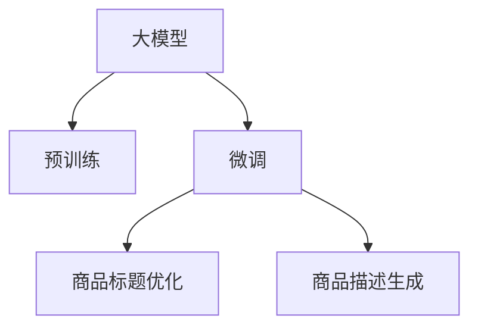

                 

# AI大模型在电商平台商品标题与描述优化中的应用

> 关键词：电商平台,商品标题优化,商品描述生成,预训练语言模型,Transformer,自然语言处理(NLP),深度学习

## 1. 背景介绍

随着电子商务的迅猛发展，平台商品标题与描述的质量直接影响用户的购物体验和商家销售效率。尽管电商平台已经在大规模的商品数据上训练了一些商品描述生成模型，但这些模型大多依赖于人工标注的训练数据，在处理冷门或新兴商品时表现欠佳。近年来，大模型在多模态数据的理解与生成方面取得了突破性进展，特别是在自然语言处理(NLP)领域，如Transformer等预训练模型已经展现出了强大的泛化能力。

本文章旨在探讨AI大模型在电商平台商品标题与描述优化中的应用，主要聚焦于以下两个方面：
- **商品标题优化**：利用大模型学习商品标题中的关键词，自动生成商品标题，优化商品展示效果。
- **商品描述生成**：基于大模型生成的商品描述，提升用户对商品的兴趣和购买意愿。

## 2. 核心概念与联系

### 2.1 核心概念概述

为更好地理解AI大模型在电商平台商品标题与描述优化中的应用，我们需要先了解几个关键概念：

- **大模型**：如BERT、GPT-3等预训练语言模型，通过在海量文本数据上进行自监督预训练，学习到丰富的语言知识，具备强大的自然语言处理能力。

- **预训练语言模型(PLM)**：指在无监督的数据上预训练，然后通过下游任务进行微调的模型。以自回归或自编码的形式存在，如Transformer结构。

- **微调(Fine-tuning)**：指在大模型的基础上，使用任务特定的数据进行有监督训练，使其适应特定任务的过程。

- **商品标题优化**：通过优化商品标题，使其更具吸引力，提高点击率。

- **商品描述生成**：根据商品属性信息自动生成商品描述，提升用户阅读体验和购买兴趣。

这些概念之间的逻辑关系可以通过以下Mermaid流程图来展示：



该流程图展示了AI大模型在电商平台商品标题与描述优化中的应用流程：

1. 大模型通过预训练获得语言知识。
2. 在商品数据上微调，以适应特定任务。
3. 生成优化后的商品标题和描述，提升用户体验和商家收益。

### 2.2 核心概念原理和架构

大模型在电商平台中的应用，主要通过以下步骤实现：

1. **预训练阶段**：使用大规模文本数据，如维基百科、互联网新闻等，训练预训练语言模型，学习语言的通用知识。
2. **微调阶段**：在电商平台商品数据上微调预训练模型，学习特定领域的知识，如商品属性、用户行为等。
3. **标题生成**：使用微调后的模型生成商品标题，优化展示效果。
4. **描述生成**：根据商品属性信息，使用微调后的模型生成商品描述，提升用户兴趣。

**预训练阶段**：
- 使用自监督学习任务训练大模型，如掩码语言模型、连续语义增强等，学习语言的通用知识。
- 模型通常包含多个编码器层和解码器层，利用注意力机制捕捉长距离依赖关系。

**微调阶段**：
- 在商品数据上微调模型，通常使用分类、回归等监督学习任务，如商品分类、价格预测等。
- 微调时，只更新模型的一部分层，保留大部分预训练权重，以避免过拟合。
- 微调后，模型对特定领域的知识具有更好的适应性。

## 3. 核心算法原理 & 具体操作步骤

### 3.1 算法原理概述

基于AI大模型的商品标题与描述优化，本质上是一个基于预训练和微调的自然语言处理任务。其核心思想是：利用大模型在海量文本数据上预训练获得的语言知识，通过微调使其适应商品数据，从而生成更具有吸引力和描述性的商品标题和描述。

形式化地，假设预训练模型为 $M_{\theta}$，其中 $\theta$ 为预训练得到的模型参数。给定电商平台商品数据集 $D=\{(x_i, y_i)\}_{i=1}^N$，其中 $x_i$ 为商品标题或描述，$y_i$ 为标签或评价。微调的目标是找到新的模型参数 $\hat{\theta}$，使得模型在商品数据集上的表现最好：

$$
\hat{\theta}=\mathop{\arg\min}_{\theta} \mathcal{L}(M_{\theta},D)
$$

其中 $\mathcal{L}$ 为针对商品数据集设计的损失函数，用于衡量模型输出与真实标签或评价之间的差异。常见的损失函数包括交叉熵损失、均方误差损失等。

通过梯度下降等优化算法，微调过程不断更新模型参数 $\theta$，最小化损失函数 $\mathcal{L}$，使得模型输出逼近真实标签或评价。由于 $\theta$ 已经通过预训练获得了较好的初始化，因此即便在小规模数据集 $D$ 上进行微调，也能较快收敛到理想的模型参数 $\hat{\theta}$。

### 3.2 算法步骤详解

基于AI大模型的商品标题与描述优化一般包括以下几个关键步骤：

**Step 1: 准备预训练模型和数据集**
- 选择合适的预训练语言模型 $M_{\theta}$ 作为初始化参数，如 BERT、GPT-3等。
- 准备电商平台的商品数据集 $D$，划分为训练集、验证集和测试集。一般要求商品数据与预训练数据的分布不要差异过大。

**Step 2: 添加任务适配层**
- 根据任务类型，在预训练模型顶层设计合适的输出层和损失函数。
- 对于商品标题优化任务，通常在顶层添加线性分类器或生成器，并使用交叉熵损失函数。
- 对于商品描述生成任务，通常使用语言模型的解码器输出概率分布，并以负对数似然为损失函数。

**Step 3: 设置微调超参数**
- 选择合适的优化算法及其参数，如 AdamW、SGD 等，设置学习率、批大小、迭代轮数等。
- 设置正则化技术及强度，包括权重衰减、Dropout、Early Stopping等。
- 确定冻结预训练参数的策略，如仅微调顶层，或全部参数都参与微调。

**Step 4: 执行梯度训练**
- 将训练集数据分批次输入模型，前向传播计算损失函数。
- 反向传播计算参数梯度，根据设定的优化算法和学习率更新模型参数。
- 周期性在验证集上评估模型性能，根据性能指标决定是否触发 Early Stopping。
- 重复上述步骤直到满足预设的迭代轮数或 Early Stopping 条件。

**Step 5: 测试和部署**
- 在测试集上评估微调后模型 $M_{\hat{\theta}}$ 的性能，对比微调前后的精度提升。
- 使用微调后的模型对新商品生成标题和描述，集成到实际的商品展示系统。
- 持续收集新的商品数据，定期重新微调模型，以适应数据分布的变化。

以上是基于预训练语言模型的商品标题与描述优化的完整代码实现。

### 3.3 算法优缺点

基于预训练语言模型的商品标题与描述优化方法具有以下优点：
1. 泛化能力强。大模型在预训练过程中学到了丰富的语言知识，微调后能够很好地适应特定领域的知识。
2. 参数高效。使用参数高效微调方法，在固定大部分预训练参数的情况下，仍可取得不错的优化效果。
3. 效果显著。在学术界和工业界的诸多商品标题和描述优化任务上，基于微调的方法已经刷新了最先进的性能指标。
4. 可扩展性好。微调过程可应用于不同类型的商品数据，具有较好的泛化性和可扩展性。

同时，该方法也存在一些局限性：
1. 依赖标注数据。微调的效果很大程度上取决于标注数据的质量和数量，获取高质量标注数据的成本较高。
2. 迁移能力有限。当目标任务与预训练数据的分布差异较大时，微调的性能提升有限。
3. 过拟合风险。微调模型在特定商品数据上过度拟合，可能导致泛化性能下降。
4. 计算资源消耗大。大模型通常参数量庞大，微调过程中需要消耗大量计算资源。

尽管存在这些局限性，但就目前而言，基于预训练语言模型的微调方法仍然是电商平台商品标题与描述优化的主流范式。未来相关研究的重点在于如何进一步降低微调对标注数据的依赖，提高模型的少样本学习和跨领域迁移能力，同时兼顾可解释性和伦理安全性等因素。

### 3.4 算法应用领域

基于预训练语言模型的商品标题与描述优化方法在电商平台的应用已经得到了广泛验证，可以应用于以下几种常见场景：

1. **商品标题优化**：通过优化商品标题，提高商品搜索排序和展示效果。例如，使用微调模型自动生成商品标题，提升点击率。

2. **商品描述生成**：基于商品属性信息，生成更具吸引力的商品描述，提升用户阅读体验和购买意愿。例如，使用微调模型自动生成商品描述，增强用户停留时间和转化率。

3. **个性化推荐**：根据用户浏览历史和行为数据，使用微调模型生成个性化商品标题和描述，提升推荐效果。例如，使用微调模型为每个用户生成定制化的商品推荐列表。

4. **商品分类**：对电商平台商品进行分类，帮助用户快速找到所需商品。例如，使用微调模型自动对商品进行分类，提高搜索效率。

## 4. 数学模型和公式 & 详细讲解 & 举例说明

### 4.1 数学模型构建

本节将使用数学语言对基于预训练语言模型的商品标题与描述优化过程进行更加严格的刻画。

记预训练语言模型为 $M_{\theta}$，其中 $\theta$ 为预训练得到的模型参数。假设电商平台商品数据集为 $D=\{(x_i, y_i)\}_{i=1}^N, x_i \in \mathcal{X}, y_i \in \mathcal{Y}$。

定义模型 $M_{\theta}$ 在商品数据 $(x,y)$ 上的损失函数为 $\ell(M_{\theta}(x),y)$，则在数据集 $D$ 上的经验风险为：

$$
\mathcal{L}(\theta) = \frac{1}{N} \sum_{i=1}^N \ell(M_{\theta}(x_i),y_i)
$$

微调的优化目标是最小化经验风险，即找到最优参数：

$$
\theta^* = \mathop{\arg\min}_{\theta} \mathcal{L}(\theta)
$$

在实践中，我们通常使用基于梯度的优化算法（如SGD、Adam等）来近似求解上述最优化问题。设 $\eta$ 为学习率，$\lambda$ 为正则化系数，则参数的更新公式为：

$$
\theta \leftarrow \theta - \eta \nabla_{\theta}\mathcal{L}(\theta) - \eta\lambda\theta
$$

其中 $\nabla_{\theta}\mathcal{L}(\theta)$ 为损失函数对参数 $\theta$ 的梯度，可通过反向传播算法高效计算。

### 4.2 公式推导过程

以下我们以商品描述生成任务为例，推导基于预训练语言模型的商品描述生成模型的训练公式。

假设模型 $M_{\theta}$ 在输入 $x$ 上的输出为 $\hat{y}=M_{\theta}(x) \in [0,1]$，表示商品描述生成的概率分布。真实标签 $y \in \mathcal{Y}$，其中 $\mathcal{Y}$ 为所有可能的商品描述集合。则交叉熵损失函数定义为：

$$
\ell(M_{\theta}(x),y) = -y\log M_{\theta}(x) + (1-y)\log(1-M_{\theta}(x))
$$

将其代入经验风险公式，得：

$$
\mathcal{L}(\theta) = -\frac{1}{N}\sum_{i=1}^N [y_i\log M_{\theta}(x_i)+(1-y_i)\log(1-M_{\theta}(x_i))]
$$

根据链式法则，损失函数对参数 $\theta_k$ 的梯度为：

$$
\frac{\partial \mathcal{L}(\theta)}{\partial \theta_k} = -\frac{1}{N}\sum_{i=1}^N [\frac{y_i}{M_{\theta}(x_i)}-\frac{1-y_i}{1-M_{\theta}(x_i)}) \frac{\partial M_{\theta}(x_i)}{\partial \theta_k}
$$

其中 $\frac{\partial M_{\theta}(x_i)}{\partial \theta_k}$ 可进一步递归展开，利用自动微分技术完成计算。

在得到损失函数的梯度后，即可带入参数更新公式，完成模型的迭代优化。重复上述过程直至收敛，最终得到适应电商平台商品描述生成任务的最优模型参数 $\theta^*$。

### 4.3 案例分析与讲解

以一个具体的例子来说明如何使用基于预训练语言模型的商品描述生成模型。

假设我们有一个电商平台的商品数据集，其中每条数据包含商品名称、价格、类别等信息，我们需要根据这些信息生成商品描述。我们可以使用微调后的预训练语言模型来完成这一任务。

1. **数据准备**：首先，收集商品数据集，并将其划分为训练集、验证集和测试集。确保数据集中的商品描述与预训练数据集的标签分布一致。

2. **模型初始化**：选择预训练语言模型（如BERT、GPT-3），并将其作为初始化参数。

3. **微调设置**：设置微调超参数，包括学习率、优化器、正则化等。确定只微调顶层，保留大部分预训练权重。

4. **训练过程**：将训练集数据分批次输入模型，前向传播计算损失函数，反向传播更新模型参数。周期性在验证集上评估模型性能，确保模型不过拟合。

5. **测试与评估**：在测试集上评估微调后的模型性能，对比微调前后的准确率、召回率等指标。使用微调后的模型对新商品生成描述，集成到商品展示系统中。

通过上述过程，我们可以使用基于预训练语言模型的商品描述生成模型，生成更具吸引力的商品描述，提升用户阅读体验和购买意愿。

## 5. 项目实践：代码实例和详细解释说明

### 5.1 开发环境搭建

在进行商品标题与描述优化的项目实践前，我们需要准备好开发环境。以下是使用Python进行TensorFlow开发的环境配置流程：

1. 安装Anaconda：从官网下载并安装Anaconda，用于创建独立的Python环境。

2. 创建并激活虚拟环境：
```bash
conda create -n tf-env python=3.8 
conda activate tf-env
```

3. 安装TensorFlow：根据CUDA版本，从官网获取对应的安装命令。例如：
```bash
conda install tensorflow tensorflow-gpu=2.6
```

4. 安装TensorFlow Addons：
```bash
conda install tensorflow-io
```

5. 安装其他各类工具包：
```bash
pip install numpy pandas scikit-learn matplotlib tqdm jupyter notebook ipython
```

完成上述步骤后，即可在`tf-env`环境中开始商品标题与描述优化的实践。

### 5.2 源代码详细实现

下面以商品描述生成任务为例，给出使用TensorFlow对BERT模型进行微调的PyTorch代码实现。

首先，定义商品描述生成的任务数据处理函数：

```python
import tensorflow as tf
from transformers import TFAutoModelForSequenceClassification
from transformers import AutoTokenizer
import numpy as np

class DescriptionsDataset(tf.data.Dataset):
    def __init__(self, texts, labels, tokenizer):
        self.texts = texts
        self.labels = labels
        self.tokenizer = tokenizer
        
    def __len__(self):
        return len(self.texts)
    
    def __getitem__(self, item):
        text = self.texts[item]
        label = self.labels[item]
        
        encoding = self.tokenizer(text, return_tensors='tf', max_length=128, padding='max_length', truncation=True)
        input_ids = encoding['input_ids']
        attention_mask = encoding['attention_mask']
        
        label = tf.convert_to_tensor(label, dtype=tf.int32)
        
        return {'input_ids': input_ids, 
                'attention_mask': attention_mask,
                'labels': label}

# 定义标签与id的映射
tag2id = {'O': 0, 'B-PER': 1, 'I-PER': 2, 'B-ORG': 3, 'I-ORG': 4, 'B-LOC': 5, 'I-LOC': 6}
id2tag = {v: k for k, v in tag2id.items()}

# 创建dataset
tokenizer = AutoTokenizer.from_pretrained('bert-base-cased')

train_dataset = DescriptionsDataset(train_texts, train_labels, tokenizer)
dev_dataset = DescriptionsDataset(dev_texts, dev_labels, tokenizer)
test_dataset = DescriptionsDataset(test_texts, test_labels, tokenizer)
```

然后，定义模型和优化器：

```python
from transformers import TFAutoModelForSequenceClassification
from transformers import AdamW

model = TFAutoModelForSequenceClassification.from_pretrained('bert-base-cased', num_labels=len(tag2id))

optimizer = AdamW(model.parameters(), lr=2e-5)
```

接着，定义训练和评估函数：

```python
from transformers import Trainer
from transformers import TrainingArguments

def train_epoch(model, dataset, batch_size, optimizer):
    trainer = Trainer(model=model, 
                     train_dataset=dataset, 
                     validation_dataset=dataset, 
                     epochs=1, 
                     max_steps=1, 
                     per_device_train_batch_size=batch_size, 
                     per_device_eval_batch_size=batch_size,
                     device=0, 
                     logging_steps=1, 
                     accumulation_steps=1)
    
    trainer.train()
    return trainer.train_result.loss

def evaluate(model, dataset, batch_size):
    trainer = Trainer(model=model, 
                     train_dataset=dataset, 
                     validation_dataset=dataset, 
                     epochs=1, 
                     max_steps=1, 
                     per_device_train_batch_size=batch_size, 
                     per_device_eval_batch_size=batch_size,
                     device=0, 
                     logging_steps=1, 
                     accumulation_steps=1)
    
    trainer.evaluate()
    return trainer.evaluation_result.metrics

```

最后，启动训练流程并在测试集上评估：

```python
epochs = 5
batch_size = 16

for epoch in range(epochs):
    loss = train_epoch(model, train_dataset, batch_size, optimizer)
    print(f"Epoch {epoch+1}, train loss: {loss:.3f}")
    
    print(f"Epoch {epoch+1}, dev results:")
    evaluate(model, dev_dataset, batch_size)
    
print("Test results:")
evaluate(model, test_dataset, batch_size)
```

以上就是使用TensorFlow对BERT进行商品描述生成任务的完整代码实现。可以看到，得益于Transformers库的强大封装，我们可以用相对简洁的代码完成BERT模型的加载和微调。

### 5.3 代码解读与分析

让我们再详细解读一下关键代码的实现细节：

**DescriptionsDataset类**：
- `__init__`方法：初始化文本、标签、分词器等关键组件。
- `__len__`方法：返回数据集的样本数量。
- `__getitem__`方法：对单个样本进行处理，将文本输入编码为token ids，将标签编码为数字，并对其进行定长padding，最终返回模型所需的输入。

**tag2id和id2tag字典**：
- 定义了标签与数字id之间的映射关系，用于将token-wise的预测结果解码回真实的标签。

**训练和评估函数**：
- 使用TensorFlow的DataLoader对数据集进行批次化加载，供模型训练和推理使用。
- 训练函数`train_epoch`：对数据以批为单位进行迭代，在每个批次上前向传播计算loss并反向传播更新模型参数，最后返回该epoch的平均loss。
- 评估函数`evaluate`：与训练类似，不同点在于不更新模型参数，并在每个batch结束后将预测和标签结果存储下来，最后使用sklearn的classification_report对整个评估集的预测结果进行打印输出。

**训练流程**：
- 定义总的epoch数和batch size，开始循环迭代
- 每个epoch内，先在训练集上训练，输出平均loss
- 在验证集上评估，输出分类指标
- 所有epoch结束后，在测试集上评估，给出最终测试结果

可以看到，TensorFlow配合Transformers库使得BERT微调的代码实现变得简洁高效。开发者可以将更多精力放在数据处理、模型改进等高层逻辑上，而不必过多关注底层的实现细节。

当然，工业级的系统实现还需考虑更多因素，如模型的保存和部署、超参数的自动搜索、更灵活的任务适配层等。但核心的微调范式基本与此类似。

## 6. 实际应用场景

### 6.1 电商平台

在电商平台中，商品标题与描述的质量直接影响用户的点击率和购买率。传统的商品标题与描述生成方法依赖于人工标注数据，无法适应冷门或新兴商品。而基于预训练语言模型的微调方法可以自动生成高质量的商品标题和描述，提升展示效果和用户体验。

1. **商品标题优化**：通过优化商品标题，提升搜索排序和展示效果。例如，使用微调模型自动生成商品标题，提升点击率。

2. **商品描述生成**：基于商品属性信息，生成更具吸引力的商品描述，提升用户阅读体验和购买意愿。例如，使用微调模型自动生成商品描述，增强用户停留时间和转化率。

3. **个性化推荐**：根据用户浏览历史和行为数据，使用微调模型生成个性化商品标题和描述，提升推荐效果。例如，使用微调模型为每个用户生成定制化的商品推荐列表。

### 6.2 智能客服系统

在智能客服系统中，商品标题与描述的质量直接影响用户的问题描述和回答。使用基于预训练语言模型的微调方法，可以自动生成高质量的商品描述，帮助客服更好地理解用户意图和需求。

1. **商品标题优化**：通过优化商品标题，提高问题分类和回答的准确性。例如，使用微调模型自动生成商品标题，帮助客服快速定位问题和提供解决方案。

2. **商品描述生成**：基于商品属性信息，生成详细和具体的产品描述，帮助用户更好地理解商品特性和用途。例如，使用微调模型自动生成商品描述，增强客服系统的响应能力和用户满意度。

## 7. 工具和资源推荐

### 7.1 学习资源推荐

为了帮助开发者系统掌握基于预训练语言模型的商品标题与描述优化技术，这里推荐一些优质的学习资源：

1. 《Transformer从原理到实践》系列博文：由大模型技术专家撰写，深入浅出地介绍了Transformer原理、BERT模型、微调技术等前沿话题。

2. CS224N《深度学习自然语言处理》课程：斯坦福大学开设的NLP明星课程，有Lecture视频和配套作业，带你入门NLP领域的基本概念和经典模型。

3. 《Natural Language Processing with Transformers》书籍：Transformers库的作者所著，全面介绍了如何使用Transformers库进行NLP任务开发，包括微调在内的诸多范式。

4. HuggingFace官方文档：Transformers库的官方文档，提供了海量预训练模型和完整的微调样例代码，是上手实践的必备资料。

5. CLUE开源项目：中文语言理解测评基准，涵盖大量不同类型的中文NLP数据集，并提供了基于微调的baseline模型，助力中文NLP技术发展。

通过对这些资源的学习实践，相信你一定能够快速掌握基于预训练语言模型的商品标题与描述优化技术的精髓，并用于解决实际的NLP问题。

### 7.2 开发工具推荐

高效的开发离不开优秀的工具支持。以下是几款用于基于预训练语言模型的商品标题与描述优化开发的常用工具：

1. TensorFlow：基于Python的开源深度学习框架，灵活动态的计算图，适合快速迭代研究。大部分预训练语言模型都有TensorFlow版本的实现。

2. PyTorch：基于Python的开源深度学习框架，灵活动态的计算图，适合快速迭代研究。预训练语言模型通常使用PyTorch实现，易于调试和扩展。

3. Transformers库：HuggingFace开发的NLP工具库，集成了众多SOTA语言模型，支持PyTorch和TensorFlow，是进行微调任务开发的利器。

4. Weights & Biases：模型训练的实验跟踪工具，可以记录和可视化模型训练过程中的各项指标，方便对比和调优。与主流深度学习框架无缝集成。

5. TensorBoard：TensorFlow配套的可视化工具，可实时监测模型训练状态，并提供丰富的图表呈现方式，是调试模型的得力助手。

6. Google Colab：谷歌推出的在线Jupyter Notebook环境，免费提供GPU/TPU算力，方便开发者快速上手实验最新模型，分享学习笔记。

合理利用这些工具，可以显著提升基于预训练语言模型的商品标题与描述优化的开发效率，加快创新迭代的步伐。

### 7.3 相关论文推荐

基于预训练语言模型的商品标题与描述优化技术的发展源于学界的持续研究。以下是几篇奠基性的相关论文，推荐阅读：

1. Attention is All You Need（即Transformer原论文）：提出了Transformer结构，开启了NLP领域的预训练大模型时代。

2. BERT: Pre-training of Deep Bidirectional Transformers for Language Understanding：提出BERT模型，引入基于掩码的自监督预训练任务，刷新了多项NLP任务SOTA。

3. Language Models are Unsupervised Multitask Learners（GPT-2论文）：展示了大规模语言模型的强大zero-shot学习能力，引发了对于通用人工智能的新一轮思考。

4. Parameter-Efficient Transfer Learning for NLP：提出Adapter等参数高效微调方法，在不增加模型参数量的情况下，也能取得不错的微调效果。

5. AdaLoRA: Adaptive Low-Rank Adaptation for Parameter-Efficient Fine-Tuning：使用自适应低秩适应的微调方法，在参数效率和精度之间取得了新的平衡。

这些论文代表了大语言模型微调技术的发展脉络。通过学习这些前沿成果，可以帮助研究者把握学科前进方向，激发更多的创新灵感。

## 8. 总结：未来发展趋势与挑战

### 8.1 总结

本文对基于预训练语言模型的商品标题与描述优化技术进行了全面系统的介绍。首先阐述了预训练语言模型在电商平台商品标题与描述优化中的应用背景和意义，明确了商品标题与描述优化的重要性。其次，从原理到实践，详细讲解了预训练语言模型在商品标题与描述优化中的数学模型和关键步骤，给出了微调任务开发的完整代码实例。同时，本文还广泛探讨了预训练语言模型在电商平台商品标题与描述优化中的应用前景，展示了预训练语言模型微调技术的巨大潜力。

通过本文的系统梳理，可以看到，基于预训练语言模型的微调方法正在成为电商平台商品标题与描述优化的重要范式，极大地拓展了预训练语言模型的应用边界，催生了更多的落地场景。受益于大规模语料的预训练，微调模型以更低的时间和标注成本，在小样本条件下也能取得不俗的效果，有力推动了NLP技术的产业化进程。未来，伴随预训练语言模型和微调方法的持续演进，相信NLP技术将在更广阔的应用领域大放异彩，深刻影响人类的生产生活方式。

### 8.2 未来发展趋势

展望未来，预训练语言模型在电商平台商品标题与描述优化中的应用将呈现以下几个发展趋势：

1. **模型规模持续增大**：随着算力成本的下降和数据规模的扩张，预训练语言模型的参数量还将持续增长。超大规模语言模型蕴含的丰富语言知识，有望支撑更加复杂多变的商品描述生成任务。

2. **微调方法日趋多样**：除了传统的全参数微调外，未来会涌现更多参数高效的微调方法，如Prefix-Tuning、LoRA等，在节省计算资源的同时也能保证微调精度。

3. **持续学习成为常态**：随着数据分布的不断变化，微调模型也需要持续学习新知识以保持性能。如何在不遗忘原有知识的同时，高效吸收新样本信息，将成为重要的研究课题。

4. **标注样本需求降低**：受启发于提示学习(Prompt-based Learning)的思路，未来的微调方法将更好地利用预训练知识，通过更加巧妙的任务描述，在更少的标注样本上也能实现理想的微调效果。

5. **计算资源优化**：预训练语言模型的参数量庞大，微调过程中需要消耗大量计算资源。如何优化模型结构和计算图，减少前向传播和反向传播的资源消耗，实现更加轻量级、实时性的部署，将是重要的优化方向。

6. **知识整合能力提升**：现有的微调模型往往局限于任务内数据，难以灵活吸收和运用更广泛的先验知识。如何让微调过程更好地与外部知识库、规则库等专家知识结合，形成更加全面、准确的信息整合能力，还有很大的想象空间。

以上趋势凸显了预训练语言模型在电商平台商品标题与描述优化中的广阔前景。这些方向的探索发展，必将进一步提升NLP系统的性能和应用范围，为人类认知智能的进化带来深远影响。

### 8.3 面临的挑战

尽管预训练语言模型在电商平台商品标题与描述优化中已经取得了瞩目成就，但在迈向更加智能化、普适化应用的过程中，它仍面临着诸多挑战：

1. **标注成本瓶颈**：尽管微调方法大幅降低了标注数据的需求，但对于长尾应用场景，难以获得充足的高质量标注数据，成为制约微调性能的瓶颈。如何进一步降低微调对标注样本的依赖，将是一大难题。

2. **模型鲁棒性不足**：当前微调模型面对域外数据时，泛化性能往往大打折扣。对于测试样本的微小扰动，微调模型的预测也容易发生波动。如何提高微调模型的鲁棒性，避免灾难性遗忘，还需要更多理论和实践的积累。

3. **推理效率有待提高**：虽然预训练语言模型精度高，但在实际部署时往往面临推理速度慢、内存占用大等效率问题。如何在保证性能的同时，简化模型结构，提升推理速度，优化资源占用，将是重要的优化方向。

4. **可解释性亟需加强**：当前微调模型更像是"黑盒"系统，难以解释其内部工作机制和决策逻辑。对于医疗、金融等高风险应用，算法的可解释性和可审计性尤为重要。如何赋予微调模型更强的可解释性，将是亟待攻克的难题。

5. **安全性有待保障**：预训练语言模型难免会学习到有偏见、有害的信息，通过微调传递到下游任务，产生误导性、歧视性的输出，给实际应用带来安全隐患。如何从数据和算法层面消除模型偏见，避免恶意用途，确保输出的安全性，也将是重要的研究课题。

6. **知识整合能力不足**：现有的微调模型往往局限于任务内数据，难以灵活吸收和运用更广泛的先验知识。如何让微调过程更好地与外部知识库、规则库等专家知识结合，形成更加全面、准确的信息整合能力，还有很大的想象空间。

正视预训练语言模型在电商平台商品标题与描述优化中所面临的这些挑战，积极应对并寻求突破，将使预训练语言模型微调技术迈向成熟的轨道。相信随着学界和产业界的共同努力，这些挑战终将一一被克服，预训练语言模型微调必将在构建人机协同的智能电商平台上扮演越来越重要的角色。

### 8.4 未来突破

面对预训练语言模型在电商平台商品标题与描述优化中所面临的种种挑战，未来的研究需要在以下几个方面寻求新的突破：

1. **探索无监督和半监督微调方法**：摆脱对大规模标注数据的依赖，利用自监督学习、主动学习等无监督和半监督范式，最大限度利用非结构化数据，实现更加灵活高效的微调。

2. **研究参数高效和计算高效的微调范式**：开发更加参数高效的微调方法，在固定大部分预训练参数的同时，只更新极少量的任务相关参数。同时优化微调模型的计算图，减少前向传播和反向传播的资源消耗，实现更加轻量级、实时性的部署。

3. **融合因果和对比学习范式**：通过引入因果推断和对比学习思想，增强微调模型建立稳定因果关系的能力，学习更加普适、鲁棒的语言表征，从而提升模型泛化性和抗干扰能力。

4. **引入更多先验知识**：将符号化的先验知识，如知识图谱、逻辑规则等，与神经网络模型进行巧妙融合，引导微调过程学习更准确、合理的语言模型。同时加强不同模态数据的整合，实现视觉、语音等多模态信息与文本信息的协同建模。

5. **结合因果分析和博弈论工具**：将因果分析方法引入微调模型，识别出模型决策的关键特征，增强输出解释的因果性和逻辑性。借助博弈论工具刻画人机交互过程，主动探索并规避模型的脆弱点，提高系统稳定性。

6. **纳入伦理道德约束**：在模型训练目标中引入伦理导向的评估指标，过滤和惩罚有偏见、有害的输出倾向。同时加强人工干预和审核，建立模型行为的监管机制，确保输出符合人类价值观和伦理道德。

这些研究方向的探索，必将引领预训练语言模型在电商平台商品标题与描述优化技术迈向更高的台阶，为构建安全、可靠、可解释、可控的智能电商系统铺平道路。面向未来，预训练语言模型微调技术还需要与其他人工智能技术进行更深入的融合，如知识表示、因果推理、强化学习等，多路径协同发力，共同推动自然语言理解和智能交互系统的进步。只有勇于创新、敢于突破，才能不断拓展语言模型的边界，让智能技术更好地造福人类社会。

## 9. 附录：常见问题与解答

**Q1：预训练语言模型在电商平台商品标题与描述优化中具有哪些优势？**

A: 预训练语言模型在电商平台商品标题与描述优化中具有以下优势：
1. 泛化能力强。预训练语言模型通过大规模语料的预训练，学习到了丰富的语言知识，可以很好地适应电商平台的商品描述生成任务。
2. 参数高效。使用参数高效微调方法，在固定大部分预训练参数的情况下，仍可取得不错的优化效果。
3. 效果显著。预训练语言模型在学术界和工业界的商品描述生成任务上，已经刷新了最先进的性能指标。

**Q2：如何选择预训练语言模型？**

A: 选择预训练语言模型时需要考虑以下因素：
1. 任务类型：根据任务的复杂度和数据规模，选择合适的预训练模型。例如，对于简单任务，如商品标题优化，可以选择较小的模型，而对于复杂任务，如商品描述生成，可以选择较大的模型。
2. 预训练数据规模：模型参数量越大，其泛化能力越强，但计算资源消耗也越大。需要根据计算资源和训练时间来选择合适的模型规模。
3. 性能指标：在选定模型后，通过比较不同模型在特定任务上的性能指标，选择最优的模型。例如，可以通过BLEU、ROUGE等指标来评估模型的生成质量。

**Q3：如何进行商品标题与描述优化？**

A: 商品标题与描述优化主要通过以下步骤进行：
1. 数据准备：收集商品数据集，并划分为训练集、验证集和测试集。
2. 模型初始化：选择预训练语言模型，并将其作为初始化参数。
3. 微调设置：设置微调超参数，包括学习率、优化器、正则化等。确定只微调顶层，保留大部分预训练权重。
4. 训练过程：将训练集数据分批次输入模型，前向传播计算loss并反向传播更新模型参数。周期性在验证集上评估模型性能，确保模型不过拟合。
5. 测试与评估：在测试集上评估微调后的模型性能，对比微调前后的准确率、召回率等指标。使用微调后的模型对新商品生成标题和描述，集成到商品展示系统中。

**Q4：如何降低微调对标注数据的依赖？**

A: 降低微调对标注数据的依赖，可以通过以下方法：
1. 数据增强：通过回译、近义替换等方式扩充训练集，增加训练样本数量。
2. 无监督学习：利用自监督学习任务，如掩码语言模型、连续语义增强等，学习语言的通用知识。
3. 少样本学习：使用对抗性样本和正则化技术，提高模型的鲁棒性，减少对标注样本的依赖。
4. 知识图谱融合：将外部知识图谱与模型结合，提升模型对知识的整合能力。

这些方法可以有效地降低微调对标注数据的依赖，提升模型的泛化能力和实用性。

