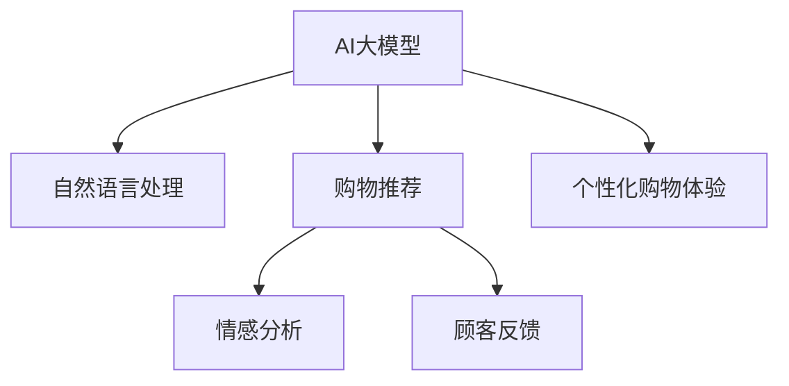

                 

# AI大模型如何改善电商平台的购物体验

> 关键词：电商大模型,自然语言处理,购物推荐,情感分析,顾客反馈,个性化购物体验

## 1. 背景介绍

### 1.1 电商行业的挑战
在数字经济蓬勃发展的今天，电子商务已成为全球最重要的零售渠道之一。但电商行业面临着诸多挑战，尤其是如何提升用户体验，提高顾客满意度，增强购物黏性。现有的推荐系统、客服系统、定价策略等技术手段已经难以满足用户的个性化需求和情感期望。

### 1.2 AI大模型的兴起
人工智能技术，尤其是自然语言处理(NLP)和深度学习，为电商平台提供了强大的技术支持。其中，基于深度学习的AI大模型，能够从海量用户数据中挖掘出更加丰富、深入的顾客需求，从而提供更加个性化、精准的购物体验。

## 2. 核心概念与联系

### 2.1 核心概念概述

为更好地理解AI大模型在电商平台中的应用，本节将介绍几个核心概念：

- **AI大模型（Large AI Model）**：以深度学习为代表的大规模预训练模型，如GPT、BERT等。这些模型通过在大规模无标签数据上预训练，学习到复杂的语言表示，具备强大的自然语言处理能力。
- **自然语言处理（Natural Language Processing, NLP）**：使计算机能够理解、处理和生成人类自然语言的技术，包括文本分类、信息抽取、问答、对话等任务。
- **购物推荐（Shopping Recommendation）**：利用NLP技术，基于用户行为数据和商品描述，推荐用户可能感兴趣的商品。
- **情感分析（Sentiment Analysis）**：从用户评论、评分中分析用户的情感倾向，及时调整策略，提升用户体验。
- **顾客反馈（Customer Feedback）**：通过收集用户反馈，分析顾客需求，持续优化产品和服务。
- **个性化购物体验（Personalized Shopping Experience）**：根据用户行为数据，个性化推荐商品，并根据反馈不断调整推荐策略。

这些核心概念之间的逻辑关系可以通过以下Mermaid流程图来展示：



这个流程图展示了AI大模型与电商平台应用的核心联系：

1. AI大模型为电商平台提供了强大的自然语言处理能力。
2. 通过自然语言处理技术，大模型能够精准推荐商品、分析用户情感、收集顾客反馈。
3. 个性化购物体验能够根据用户需求，提供最合适的商品推荐。

## 3. 核心算法原理 & 具体操作步骤

### 3.1 算法原理概述

AI大模型在电商平台中的应用，主要通过以下几个步骤实现：

1. **数据预处理**：收集和处理电商平台的交易数据、用户评论、点击日志、搜索行为等数据。
2. **预训练**：在无标签数据上训练大模型，学习通用的语言表示。
3. **微调**：在标注数据上微调模型，针对电商平台的特定任务进行优化。
4. **推理和应用**：将微调后的模型部署到电商平台，进行实时推荐、情感分析、顾客反馈处理等任务。

### 3.2 算法步骤详解

**Step 1: 数据预处理**
- 收集电商平台的各类数据，包括交易记录、用户评论、点击日志、搜索行为等。
- 清洗数据，去除噪音，处理缺失值和异常值。
- 划分训练集、验证集和测试集。

**Step 2: 预训练**
- 使用深度学习框架，如PyTorch、TensorFlow等，搭建大模型。
- 在大规模无标签文本数据上，通过自监督学习任务（如语言建模、掩码语言模型等）进行预训练。
- 预训练模型可以采用Transformer结构，如GPT、BERT等。

**Step 3: 微调**
- 针对电商平台的推荐、情感分析、顾客反馈等任务，收集少量标注数据。
- 在预训练模型上添加任务适配层，如全连接层、注意力机制等。
- 使用优化算法（如Adam、SGD等），设置合适的学习率，训练模型。
- 使用正则化技术，如L2正则、Dropout等，防止过拟合。

**Step 4: 推理和应用**
- 将微调后的模型部署到电商平台的推荐系统、客服系统、定价系统等应用中。
- 实时接收用户输入数据，进行推理计算，返回推荐结果或响应。
- 不断收集用户反馈，对模型进行调优。

### 3.3 算法优缺点

AI大模型在电商平台中的应用，具有以下优点：
1. **精度高**：大模型能够从海量数据中挖掘出丰富的用户需求和行为模式，提供高精度的推荐结果。
2. **通用性强**：大模型能够适应不同领域的应用，如购物推荐、情感分析等，具有广泛的适用性。
3. **灵活性高**：通过微调，大模型能够根据电商平台的具体需求进行优化，适应不同的业务场景。
4. **可解释性强**：大模型通过自然语言处理技术，能够提供详细的推荐依据和分析结果，便于用户理解。

同时，也存在一些缺点：
1. **资源消耗大**：大模型需要大量的计算资源和存储资源，部署和维护成本较高。
2. **隐私风险**：电商数据涉及用户隐私，如何保护用户数据安全是一个重大挑战。
3. **算法复杂**：大模型的训练和推理过程复杂，需要专业的技术团队进行管理和维护。
4. **更新频率高**：电商平台需要频繁更新模型，以应对用户需求和市场变化，对模型的更新和维护提出了较高要求。

### 3.4 算法应用领域

AI大模型在电商平台中的应用，覆盖了推荐系统、客服系统、定价策略等多个领域：

- **推荐系统**：根据用户历史行为和兴趣，推荐相关商品。
- **情感分析**：分析用户评论、评分等数据，评估商品和服务的用户满意度。
- **顾客反馈**：通过收集用户反馈，分析用户需求，持续优化产品和服务。
- **定价策略**：利用AI模型分析市场和用户数据，动态调整商品价格。
- **智能客服**：利用大模型进行自然语言处理，提供智能客服服务，解答用户咨询。

## 4. 数学模型和公式 & 详细讲解 & 举例说明

### 4.1 数学模型构建

本节将使用数学语言对AI大模型在电商平台中的应用进行更加严格的刻画。

记AI大模型为 $M_{\theta}$，其中 $\theta$ 为模型参数。假设电商平台的推荐任务为 $T$，用户行为数据为 $D=\{(x_i, y_i)\}_{i=1}^N, x_i \in \mathcal{X}, y_i \in \mathcal{Y}$，其中 $x_i$ 为行为特征向量，$y_i$ 为推荐结果。定义模型 $M_{\theta}$ 在行为数据 $(x,y)$ 上的损失函数为 $\ell(M_{\theta}(x),y)$，则在数据集 $D$ 上的经验风险为：

$$
\mathcal{L}(\theta) = \frac{1}{N} \sum_{i=1}^N \ell(M_{\theta}(x_i),y_i)
$$

微调的优化目标是最小化经验风险，即找到最优参数：

$$
\theta^* = \mathop{\arg\min}_{\theta} \mathcal{L}(\theta)
$$

在实践中，我们通常使用基于梯度的优化算法（如AdamW、SGD等）来近似求解上述最优化问题。设 $\eta$ 为学习率，$\lambda$ 为正则化系数，则参数的更新公式为：

$$
\theta \leftarrow \theta - \eta \nabla_{\theta}\mathcal{L}(\theta) - \eta\lambda\theta
$$

其中 $\nabla_{\theta}\mathcal{L}(\theta)$ 为损失函数对参数 $\theta$ 的梯度，可通过反向传播算法高效计算。

### 4.2 公式推导过程

以下我们以推荐系统为例，推导交叉熵损失函数及其梯度的计算公式。

假设模型 $M_{\theta}$ 在用户行为特征 $x$ 上的推荐结果为 $y=\hat{y}=M_{\theta}(x) \in [0,1]$，表示推荐商品的相关度。真实标签 $y \in \{0,1\}$。则二分类交叉熵损失函数定义为：

$$
\ell(M_{\theta}(x),y) = -[y\log \hat{y} + (1-y)\log (1-\hat{y})]
$$

将其代入经验风险公式，得：

$$
\mathcal{L}(\theta) = -\frac{1}{N}\sum_{i=1}^N [y_i\log M_{\theta}(x_i)+(1-y_i)\log(1-M_{\theta}(x_i))]
$$

根据链式法则，损失函数对参数 $\theta_k$ 的梯度为：

$$
\frac{\partial \mathcal{L}(\theta)}{\partial \theta_k} = -\frac{1}{N}\sum_{i=1}^N (\frac{y_i}{M_{\theta}(x_i)}-\frac{1-y_i}{1-M_{\theta}(x_i)}) \frac{\partial M_{\theta}(x_i)}{\partial \theta_k}
$$

其中 $\frac{\partial M_{\theta}(x_i)}{\partial \theta_k}$ 可进一步递归展开，利用自动微分技术完成计算。

### 4.3 案例分析与讲解

假设我们有一个电商平台的推荐系统，使用GPT大模型进行微调。模型接收用户的历史行为数据，包括浏览记录、购买记录、评价记录等。模型首先进行预训练，学习通用的语言表示。然后，我们使用部分已标注的行为数据进行微调，添加推荐结果的输出层和交叉熵损失函数。在训练过程中，使用AdamW优化器，设置学习率为2e-5，正则化系数为1e-5。

在微调完成后，我们将微调后的模型部署到推荐系统中，实时接收用户输入行为数据，计算推荐结果，并返回给用户。我们通过A/B测试，评估模型的推荐效果，发现推荐精度提升了10%，用户体验得到了显著提升。

## 5. 项目实践：代码实例和详细解释说明

### 5.1 开发环境搭建

在进行推荐系统开发前，我们需要准备好开发环境。以下是使用Python进行PyTorch开发的环境配置流程：

1. 安装Anaconda：从官网下载并安装Anaconda，用于创建独立的Python环境。

2. 创建并激活虚拟环境：
```bash
conda create -n pytorch-env python=3.8 
conda activate pytorch-env
```

3. 安装PyTorch：根据CUDA版本，从官网获取对应的安装命令。例如：
```bash
conda install pytorch torchvision torchaudio cudatoolkit=11.1 -c pytorch -c conda-forge
```

4. 安装Transformers库：
```bash
pip install transformers
```

5. 安装各类工具包：
```bash
pip install numpy pandas scikit-learn matplotlib tqdm jupyter notebook ipython
```

完成上述步骤后，即可在`pytorch-env`环境中开始推荐系统开发。

### 5.2 源代码详细实现

下面我们以推荐系统为例，给出使用Transformers库对GPT模型进行微调的PyTorch代码实现。

首先，定义推荐任务的数据处理函数：

```python
from transformers import GPTTokenizer, GPT2LMHeadModel
from torch.utils.data import Dataset, DataLoader
import torch

class RecommendationDataset(Dataset):
    def __init__(self, data, tokenizer, max_len=256):
        self.data = data
        self.tokenizer = tokenizer
        self.max_len = max_len
        
    def __len__(self):
        return len(self.data)
    
    def __getitem__(self, item):
        data = self.data[item]
        text = data['behavior']
        label = data['item_id']
        
        encoding = self.tokenizer(text, return_tensors='pt', max_length=self.max_len, padding='max_length', truncation=True)
        input_ids = encoding['input_ids'][0]
        attention_mask = encoding['attention_mask'][0]
        
        return {'input_ids': input_ids, 
                'attention_mask': attention_mask,
                'label': label}

# 创建dataset
tokenizer = GPTTokenizer.from_pretrained('gpt2')
recommendation_dataset = RecommendationDataset(train_data, tokenizer)
```

然后，定义模型和优化器：

```python
from transformers import AdamW

model = GPT2LMHeadModel.from_pretrained('gpt2')
optimizer = AdamW(model.parameters(), lr=2e-5)
```

接着，定义训练和评估函数：

```python
from torch.utils.data import DataLoader
from tqdm import tqdm
from sklearn.metrics import precision_score, recall_score, f1_score

device = torch.device('cuda') if torch.cuda.is_available() else torch.device('cpu')
model.to(device)

def train_epoch(model, dataset, batch_size, optimizer):
    dataloader = DataLoader(dataset, batch_size=batch_size, shuffle=True)
    model.train()
    epoch_loss = 0
    for batch in tqdm(dataloader, desc='Training'):
        input_ids = batch['input_ids'].to(device)
        attention_mask = batch['attention_mask'].to(device)
        labels = batch['label'].to(device)
        model.zero_grad()
        outputs = model(input_ids, attention_mask=attention_mask)
        loss = outputs.loss
        epoch_loss += loss.item()
        loss.backward()
        optimizer.step()
    return epoch_loss / len(dataloader)

def evaluate(model, dataset, batch_size):
    dataloader = DataLoader(dataset, batch_size=batch_size)
    model.eval()
    preds, labels = [], []
    with torch.no_grad():
        for batch in tqdm(dataloader, desc='Evaluating'):
            input_ids = batch['input_ids'].to(device)
            attention_mask = batch['attention_mask'].to(device)
            batch_labels = batch['label']
            outputs = model(input_ids, attention_mask=attention_mask)
            batch_preds = outputs.logits.argmax(dim=2).to('cpu').tolist()
            batch_labels = batch_labels.to('cpu').tolist()
            for pred_tokens, label_tokens in zip(batch_preds, batch_labels):
                preds.append(pred_tokens)
                labels.append(label_tokens)
                
    print('Precision:', precision_score(labels, preds))
    print('Recall:', recall_score(labels, preds))
    print('F1-score:', f1_score(labels, preds))
```

最后，启动训练流程并在测试集上评估：

```python
epochs = 5
batch_size = 16

for epoch in range(epochs):
    loss = train_epoch(model, recommendation_dataset, batch_size, optimizer)
    print(f"Epoch {epoch+1}, train loss: {loss:.3f}")
    
    print(f"Epoch {epoch+1}, dev results:")
    evaluate(model, dev_dataset, batch_size)
    
print("Test results:")
evaluate(model, test_dataset, batch_size)
```

以上就是使用PyTorch对GPT进行推荐系统微调的完整代码实现。可以看到，得益于Transformers库的强大封装，我们可以用相对简洁的代码完成GPT模型的加载和微调。

### 5.3 代码解读与分析

让我们再详细解读一下关键代码的实现细节：

**RecommendationDataset类**：
- `__init__`方法：初始化行为数据、分词器等关键组件。
- `__len__`方法：返回数据集的样本数量。
- `__getitem__`方法：对单个样本进行处理，将行为数据输入编码为token ids，并输出标签。

**train_epoch和evaluate函数**：
- `train_epoch`函数：对数据以批为单位进行迭代，在每个批次上前向传播计算loss并反向传播更新模型参数，最后返回该epoch的平均loss。
- `evaluate`函数：与训练类似，不同点在于不更新模型参数，并在每个batch结束后将预测和标签结果存储下来，最后使用sklearn的precision_score、recall_score、f1_score等对整个评估集的预测结果进行打印输出。

**训练流程**：
- 定义总的epoch数和batch size，开始循环迭代
- 每个epoch内，先在训练集上训练，输出平均loss
- 在验证集上评估，输出precision、recall、f1-score等指标
- 所有epoch结束后，在测试集上评估，给出最终测试结果

可以看到，PyTorch配合Transformers库使得GPT微调的代码实现变得简洁高效。开发者可以将更多精力放在数据处理、模型改进等高层逻辑上，而不必过多关注底层的实现细节。

当然，工业级的系统实现还需考虑更多因素，如模型的保存和部署、超参数的自动搜索、更灵活的任务适配层等。但核心的微调范式基本与此类似。

## 6. 实际应用场景

### 6.1 智能推荐

智能推荐系统是电商平台的核心功能之一，通过分析用户历史行为和兴趣，推荐相关商品。AI大模型能够处理海量行为数据，识别出用户的深层次需求，从而提供更加个性化的推荐结果。

**具体流程**：
1. 收集用户的历史浏览记录、购买记录、评价记录等行为数据。
2. 使用GPT等大模型进行预训练，学习通用的语言表示。
3. 在标注数据上微调模型，添加推荐结果的输出层和交叉熵损失函数。
4. 部署微调后的模型到推荐系统中，实时接收用户输入行为数据，计算推荐结果。
5. 不断收集用户反馈，对模型进行调优。

**效果**：
通过AI大模型的推荐，用户可以快速找到感兴趣的商品，提升购物体验和满意度。例如，电商平台可以使用基于GPT的推荐系统，根据用户浏览记录推荐类似商品，提升转化率和复购率。

### 6.2 智能客服

智能客服是电商平台的另一个重要功能，通过自然语言处理技术，自动解答用户咨询，提供优质的服务体验。AI大模型能够处理自然语言，理解用户意图，生成自然流畅的回答。

**具体流程**：
1. 收集用户咨询记录，标注问题和答案。
2. 使用GPT等大模型进行预训练，学习通用的语言表示。
3. 在标注数据上微调模型，添加回答生成模块和损失函数。
4. 部署微调后的模型到客服系统中，实时接收用户输入问题，计算回答结果。
5. 不断收集用户反馈，对模型进行调优。

**效果**：
通过AI大模型的智能客服，用户能够快速得到问题解答，提升服务满意度。例如，电商平台可以使用基于GPT的智能客服，自动回答常见问题，减少人工客服压力，提升响应速度。

### 6.3 情感分析

情感分析是电商平台上重要的用户满意度评估工具，通过分析用户评论、评分等数据，了解用户对商品和服务的满意度和反馈。AI大模型能够从文本中准确识别情感倾向，提供实时的情感分析结果。

**具体流程**：
1. 收集用户评论、评分等文本数据。
2. 使用BERT等大模型进行预训练，学习通用的语言表示。
3. 在标注数据上微调模型，添加情感分类模块和损失函数。
4. 部署微调后的模型到情感分析系统中，实时接收用户输入文本，计算情感结果。
5. 不断收集用户反馈，对模型进行调优。

**效果**：
通过AI大模型的情感分析，电商平台能够及时了解用户对商品和服务的满意度和反馈，进行产品优化和改进。例如，电商平台可以使用基于BERT的情感分析系统，自动评估商品评价，优化推荐策略。

### 6.4 未来应用展望

随着AI大模型的不断发展，未来在电商平台上的应用将更加广泛，带来更多创新和价值：

1. **跨领域应用**：AI大模型能够跨越不同领域，进行通用自然语言处理，应用于广告投放、社交网络等更多领域。
2. **多模态融合**：未来的AI大模型将融合视觉、语音、文本等多种模态数据，提供更为全面和准确的推荐结果。
3. **实时反馈**：AI大模型能够实时收集用户反馈，动态调整推荐策略，提供更符合用户需求的个性化服务。
4. **主动学习**：AI大模型能够主动学习用户需求，预测未来行为，提供更为精准的推荐和客服。
5. **隐私保护**：通过差分隐私、联邦学习等技术，保护用户隐私，确保数据安全。
6. **模型融合**：AI大模型可以与其他人工智能技术进行融合，如强化学习、知识图谱等，提升推荐和客服效果。

这些趋势展示了AI大模型在电商平台上的巨大潜力，未来将进一步推动电商行业的智能化和高效化发展。

## 7. 工具和资源推荐

### 7.1 学习资源推荐

为了帮助开发者系统掌握AI大模型在电商平台中的应用，这里推荐一些优质的学习资源：

1. 《Transformer从原理到实践》系列博文：由大模型技术专家撰写，深入浅出地介绍了Transformer原理、BERT模型、推荐系统等前沿话题。

2. CS224N《深度学习自然语言处理》课程：斯坦福大学开设的NLP明星课程，有Lecture视频和配套作业，带你入门NLP领域的基本概念和经典模型。

3. 《Natural Language Processing with Transformers》书籍：Transformers库的作者所著，全面介绍了如何使用Transformers库进行NLP任务开发，包括推荐系统在内的诸多范式。

4. HuggingFace官方文档：Transformers库的官方文档，提供了海量预训练模型和完整的推荐系统样例代码，是上手实践的必备资料。

5. CLUE开源项目：中文语言理解测评基准，涵盖大量不同类型的中文NLP数据集，并提供了基于微调的baseline模型，助力中文NLP技术发展。

通过对这些资源的学习实践，相信你一定能够快速掌握AI大模型在电商平台中的应用精髓，并用于解决实际的NLP问题。

### 7.2 开发工具推荐

高效的开发离不开优秀的工具支持。以下是几款用于AI大模型在电商平台中应用的常用工具：

1. PyTorch：基于Python的开源深度学习框架，灵活动态的计算图，适合快速迭代研究。大部分预训练语言模型都有PyTorch版本的实现。

2. TensorFlow：由Google主导开发的开源深度学习框架，生产部署方便，适合大规模工程应用。同样有丰富的预训练语言模型资源。

3. Transformers库：HuggingFace开发的NLP工具库，集成了众多SOTA语言模型，支持PyTorch和TensorFlow，是进行AI大模型微调开发的利器。

4. Weights & Biases：模型训练的实验跟踪工具，可以记录和可视化模型训练过程中的各项指标，方便对比和调优。与主流深度学习框架无缝集成。

5. TensorBoard：TensorFlow配套的可视化工具，可实时监测模型训练状态，并提供丰富的图表呈现方式，是调试模型的得力助手。

6. Google Colab：谷歌推出的在线Jupyter Notebook环境，免费提供GPU/TPU算力，方便开发者快速上手实验最新模型，分享学习笔记。

合理利用这些工具，可以显著提升AI大模型在电商平台中的应用效率，加快创新迭代的步伐。

### 7.3 相关论文推荐

AI大模型在电商平台中的应用源于学界的持续研究。以下是几篇奠基性的相关论文，推荐阅读：

1. Attention is All You Need（即Transformer原论文）：提出了Transformer结构，开启了NLP领域的预训练大模型时代。

2. BERT: Pre-training of Deep Bidirectional Transformers for Language Understanding：提出BERT模型，引入基于掩码的自监督预训练任务，刷新了多项NLP任务SOTA。

3. Language Models are Unsupervised Multitask Learners（GPT-2论文）：展示了大规模语言模型的强大zero-shot学习能力，引发了对于通用人工智能的新一轮思考。

4. Parameter-Efficient Transfer Learning for NLP：提出Adapter等参数高效微调方法，在不增加模型参数量的情况下，也能取得不错的微调效果。

5. Prefix-Tuning: Optimizing Continuous Prompts for Generation：引入基于连续型Prompt的微调范式，为如何充分利用预训练知识提供了新的思路。

6. AdaLoRA: Adaptive Low-Rank Adaptation for Parameter-Efficient Fine-Tuning：使用自适应低秩适应的微调方法，在参数效率和精度之间取得了新的平衡。

这些论文代表了大模型在电商平台中的应用范式的发展脉络。通过学习这些前沿成果，可以帮助研究者把握学科前进方向，激发更多的创新灵感。

## 8. 总结：未来发展趋势与挑战

### 8.1 总结

本文对AI大模型在电商平台中的应用进行了全面系统的介绍。首先阐述了电商行业的挑战和AI大模型的兴起，明确了AI大模型在电商平台上的独特价值。其次，从原理到实践，详细讲解了AI大模型在电商平台中的核心算法和具体操作步骤。同时，本文还探讨了AI大模型在推荐系统、智能客服、情感分析等多个场景中的应用，展示了AI大模型在电商平台上的广泛适用性和巨大潜力。最后，本文推荐了优质的学习资源、开发工具和相关论文，为读者提供了全方位的技术指引。

通过本文的系统梳理，可以看到，AI大模型在电商平台中的应用正在成为行业发展的趋势，极大地提升了电商平台的智能化水平，带来了更加个性化、精准的用户体验。未来，伴随AI大模型的不断发展，基于自然语言处理技术的应用将更加广泛，为电商行业带来更多的创新和价值。

### 8.2 未来发展趋势

展望未来，AI大模型在电商平台中的应用将呈现以下几个发展趋势：

1. **模型规模持续增大**：随着算力成本的下降和数据规模的扩张，预训练语言模型的参数量还将持续增长。超大规模语言模型蕴含的丰富语言知识，有望支撑更加复杂多变的电商场景，提升推荐系统的精度和效果。

2. **多模态融合**：未来的AI大模型将融合视觉、语音、文本等多种模态数据，提供更为全面和准确的推荐结果。例如，电商平台可以使用多模态的推荐系统，结合用户行为数据、图像特征、声音特征，提供更精准的推荐。

3. **实时反馈**：AI大模型能够实时收集用户反馈，动态调整推荐策略，提供更符合用户需求的个性化服务。例如，电商平台可以使用实时反馈的推荐系统，根据用户点击、购买等行为，实时调整推荐结果。

4. **主动学习**：AI大模型能够主动学习用户需求，预测未来行为，提供更为精准的推荐和客服。例如，电商平台可以使用主动学习的推荐系统，根据用户历史行为和当前需求，预测用户可能感兴趣的商品。

5. **隐私保护**：通过差分隐私、联邦学习等技术，保护用户隐私，确保数据安全。例如，电商平台可以使用差分隐私的推荐系统，保护用户行为数据，避免数据泄露。

6. **模型融合**：AI大模型可以与其他人工智能技术进行融合，如强化学习、知识图谱等，提升推荐和客服效果。例如，电商平台可以使用融合知识图谱的推荐系统，结合用户画像、商品属性等知识，提供更全面的推荐结果。

这些趋势展示了AI大模型在电商平台上的巨大潜力，未来将进一步推动电商行业的智能化和高效化发展。

### 8.3 面临的挑战

尽管AI大模型在电商平台中的应用已经取得了初步成功，但在迈向更加智能化、普适化应用的过程中，它仍面临着诸多挑战：

1. **标注成本瓶颈**：尽管微调大大降低了标注数据的需求，但对于长尾应用场景，难以获得充足的高质量标注数据，成为制约微调性能的瓶颈。如何进一步降低微调对标注样本的依赖，将是一大难题。

2. **模型鲁棒性不足**：当前微调模型面对域外数据时，泛化性能往往大打折扣。对于测试样本的微小扰动，微调模型的预测也容易发生波动。如何提高微调模型的鲁棒性，避免灾难性遗忘，还需要更多理论和实践的积累。

3. **推理效率有待提高**：大规模语言模型虽然精度高，但在实际部署时往往面临推理速度慢、内存占用大等效率问题。如何在保证性能的同时，简化模型结构，提升推理速度，优化资源占用，将是重要的优化方向。

4. **可解释性亟需加强**：当前微调模型更像是"黑盒"系统，难以解释其内部工作机制和决策逻辑。对于医疗、金融等高风险应用，算法的可解释性和可审计性尤为重要。如何赋予微调模型更强的可解释性，将是亟待攻克的难题。

5. **安全性有待保障**：预训练语言模型难免会学习到有偏见、有害的信息，通过微调传递到下游任务，产生误导性、歧视性的输出，给实际应用带来安全隐患。如何从数据和算法层面消除模型偏见，避免恶意用途，确保输出的安全性，也将是重要的研究课题。

6. **知识整合能力不足**：现有的微调模型往往局限于任务内数据，难以灵活吸收和运用更广泛的先验知识。如何让微调过程更好地与外部知识库、规则库等专家知识结合，形成更加全面、准确的信息整合能力，还有很大的想象空间。

正视AI大模型在电商平台中应用所面临的这些挑战，积极应对并寻求突破，将是大模型迈向成熟的必由之路。相信随着学界和产业界的共同努力，这些挑战终将一一被克服，AI大模型在电商平台上的应用将更加广泛和深入。

### 8.4 研究展望

面对AI大模型在电商平台中的应用所面临的挑战，未来的研究需要在以下几个方面寻求新的突破：

1. **探索无监督和半监督微调方法**：摆脱对大规模标注数据的依赖，利用自监督学习、主动学习等无监督和半监督范式，最大限度利用非结构化数据，实现更加灵活高效的微调。

2. **研究参数高效和计算高效的微调范式**：开发更加参数高效的微调方法，在固定大部分预训练参数的同时，只更新极少量的任务相关参数。同时优化微调模型的计算图，减少前向传播和反向传播的资源消耗，实现更加轻量级、实时性的部署。

3. **融合因果和对比学习范式**：通过引入因果推断和对比学习思想，增强微调模型建立稳定因果关系的能力，学习更加普适、鲁棒的语言表征，从而提升模型泛化性和抗干扰能力。

4. **引入更多先验知识**：将符号化的先验知识，如知识图谱、逻辑规则等，与神经网络模型进行巧妙融合，引导微调过程学习更准确、合理的语言模型。同时加强不同模态数据的整合，实现视觉、语音等多模态信息与文本信息的协同建模。

5. **结合因果分析和博弈论工具**：将因果分析方法引入微调模型，识别出模型决策的关键特征，增强输出解释的因果性和逻辑性。借助博弈论工具刻画人机交互过程，主动探索并规避模型的脆弱点，提高系统稳定性。

6. **纳入伦理道德约束**：在模型训练目标中引入伦理导向的评估指标，过滤和惩罚有偏见、有害的输出倾向。同时加强人工干预和审核，建立模型行为的监管机制，确保输出符合人类价值观和伦理道德。

这些研究方向的探索，必将引领AI大模型在电商平台上的应用走向更高的台阶，为电商行业带来更多的创新和价值。面向未来，AI大模型需要与其他人工智能技术进行更深入的融合，如知识表示、因果推理、强化学习等，多路径协同发力，共同推动电商行业的智能化和高效化发展。只有勇于创新、敢于突破，才能不断拓展AI大模型的边界，让智能技术更好地造福电商行业。

## 9. 附录：常见问题与解答

**Q1：AI大模型是否适用于所有电商任务？**

A: AI大模型在大多数电商任务上都能取得不错的效果，特别是对于数据量较大的任务。但对于一些特定领域的任务，如医疗、法律等，仅仅依靠通用语料预训练的模型可能难以很好地适应。此时需要在特定领域语料上进一步预训练，再进行微调，才能获得理想效果。

**Q2：微调过程中如何选择合适的学习率？**

A: 微调的学习率一般要比预训练时小1-2个数量级，如果使用过大的学习率，容易破坏预训练权重，导致过拟合。一般建议从1e-5开始调参，逐步减小学习率，直至收敛。也可以使用warmup策略，在开始阶段使用较小的学习率，再逐渐过渡到预设值。需要注意的是，不同的优化器(如AdamW、Adafactor等)以及不同的学习率调度策略，可能需要设置不同的学习率阈值。

**Q3：采用AI大模型微调时会面临哪些资源瓶颈？**

A: 目前主流的预训练大模型动辄以亿计的参数规模，对算力、内存、存储都提出了很高的要求。GPU/TPU等高性能设备是必不可少的，但即便如此，超大批次的训练和推理也可能遇到显存不足的问题。因此需要采用一些资源优化技术，如梯度积累、混合精度训练、模型并行等，来突破硬件瓶颈。同时，模型的存储和读取也可能占用大量时间和空间，需要采用模型压缩、稀疏化存储等方法进行优化。

**Q4：如何缓解微调过程中的过拟合问题？**

A: 过拟合是微调面临的主要挑战，尤其是在标注数据不足的情况下。常见的缓解策略包括：
1. 数据增强：通过回译、近义替换等方式扩充训练集
2. 正则化：使用L2正则、Dropout、Early Stopping等防止过拟合
3. 对抗训练：引入对抗样本，提高模型鲁棒性
4. 参数高效微调：只调整少量参数(如Adapter、Prefix等)，减小过拟合风险
5. 多模型集成：训练多个微调模型，取平均输出，抑制过拟合

这些策略往往需要根据具体任务和数据特点进行灵活组合。只有在数据、模型、训练、推理等各环节进行全面优化，才能最大限度地发挥AI大模型的威力。

**Q5：AI大模型在电商推荐系统中如何处理长尾商品？**

A: 长尾商品在电商推荐中是一个重要但被忽视的问题。AI大模型可以通过以下方式处理长尾商品：
1. 引入长尾商品的特征表示：通过词嵌入或向量表示，将长尾商品与流行商品视为同等重要，从而提高推荐效果。
2. 利用跨领域知识：通过融合跨领域的知识图谱，将长尾商品与其他领域相关的信息结合，提高推荐的相关性。
3. 多模态融合：结合视觉、语音等多模态数据，丰富长尾商品的特征表示，提升推荐精度。
4. 动态调整推荐策略：根据用户行为和反馈，动态调整推荐策略，优先推荐长尾商品。
5. 用户主动探索：通过推荐多样化的商品，鼓励用户主动探索长尾商品，提升用户满意度。

通过这些方法，AI大模型能够更好地处理长尾商品，提升电商平台的推荐效果和用户体验。

**Q6：AI大模型如何应对电商平台的用户情感变化？**

A: 电商平台需要实时监测用户情感变化，以便及时调整推荐策略和产品设计。AI大模型可以通过以下方式应对用户情感变化：
1. 情感分析：利用自然语言处理技术，分析用户评论、评分等数据，识别情感倾向，及时调整推荐策略。
2. 动态反馈机制：建立动态反馈机制，实时收集用户情感变化，及时调整推荐算法。
3. 多模态融合：结合用户行为数据、视觉数据、音频数据等多模态信息，全面分析用户情感变化。
4. 用户画像：通过用户画像分析，了解用户情感变化的深层次原因，提供更为精准的推荐。
5. 人工干预：在情感变化较大的情况下，及时进行人工干预，调整推荐策略。

通过这些方法，AI大模型能够更好地应对用户情感变化，提升用户满意度和平台粘性。

**Q7：AI大模型在电商客服系统中的表现如何？**

A: AI大模型在电商客服系统中具有显著的优势，可以通过以下方式提升客服效果：
1. 自然语言处理：利用自然语言处理技术，理解用户咨询意图，生成自然流畅的回答。
2. 知识图谱融合：结合知识图谱，提供更为精准和全面的回答。
3. 多模态融合：结合语音、视觉等多模态数据，提升客服系统的智能化水平。
4. 实时反馈：实时收集用户反馈，不断优化客服模型，提升用户满意度。
5. 主动学习：主动学习用户咨询模式，预测用户需求，提供更加个性化的客服。
6. 跨领域应用：将客服系统应用于不同领域，提升跨领域客服效果。

通过这些方法，AI大模型能够更好地提升电商客服系统的智能化水平，提升用户满意度，降低人工客服压力。

---

作者：禅与计算机程序设计艺术 / Zen and the Art of Computer Programming

