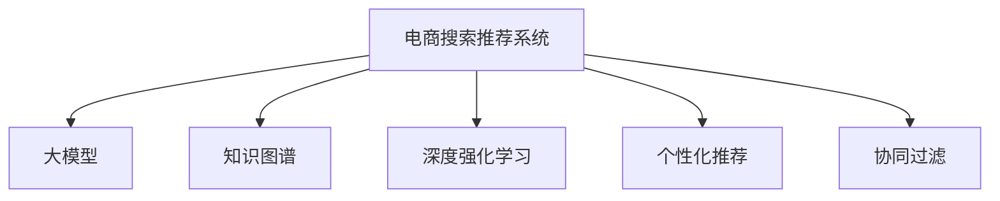

                 

# AI大模型视角下电商搜索推荐的技术创新知识分享机制设计

> 关键词：电商搜索, 推荐系统, 大模型, 知识分享, 个性化推荐, 推荐算法, 数据挖掘

## 1. 背景介绍

### 1.1 问题由来
随着电商行业的迅猛发展，消费者需求日益多样化、个性化，传统的电商搜索推荐系统面临着数据处理量激增、算法模型复杂化等挑战。为了提升用户体验和商家满意度，如何在有限的标注数据下，高效构建高效、个性化的搜索推荐模型，成为了电商企业亟需解决的问题。

近年来，大模型技术在自然语言处理等领域取得了突破性进展，逐步应用于电商领域，为搜索推荐系统带来了新的机遇。大模型通过大规模无标签数据的预训练，获得了强大的语义理解能力和知识提取能力，能够抽取丰富而深层次的上下文信息，为个性化推荐提供了坚实的基础。

## 2. 核心概念与联系

### 2.1 核心概念概述

为更好地理解基于大模型视角的电商搜索推荐技术，本节将介绍几个核心概念：

- **电商搜索推荐系统**：基于用户的搜索行为、点击记录、购买历史等数据，通过算法模型对用户进行个性化推荐，提高用户满意度，提升电商平台转化率。
- **大模型**：以Transformer、BERT等结构为代表的深度学习模型，通过大规模无标签数据预训练，具备强大的语言理解和生成能力。
- **知识图谱**：将现实世界中的实体和关系映射为图形结构，构建实体间关系网络，用于抽取和表示结构化知识。
- **深度强化学习**：基于深度学习和强化学习的方法，训练智能体在复杂环境下进行决策，用于推荐系统中的用户行为建模和推荐策略优化。
- **个性化推荐**：根据用户行为特征和偏好，推荐最符合用户需求的商品，提升用户体验和平台价值。
- **协同过滤**：通过分析用户行为数据，找到与目标用户相似的其他用户，推荐这些用户喜欢的商品，缓解数据稀疏性问题。

这些概念之间的逻辑关系可以通过以下Mermaid流程图来展示：



这个流程图展示了大模型与电商搜索推荐系统在数据处理、特征提取和模型训练等方面的联系：

1. 大模型可以高效地抽取和理解文本数据，提取用户行为特征，用于个性化推荐。
2. 知识图谱提供结构化知识，辅助大模型理解商品之间的关系，提高推荐效果。
3. 深度强化学习用于建模用户行为，优化推荐策略，提升用户体验。
4. 协同过滤利用用户行为相似性，推荐相似用户的商品，缓解数据稀疏问题。

## 3. 核心算法原理 & 具体操作步骤
### 3.1 算法原理概述

基于大模型的电商搜索推荐系统，本质上是一种深度学习驱动的个性化推荐系统。其核心思想是：通过大模型的语义理解能力，提取用户行为特征，构建用户-商品之间的隐含关系，进而进行推荐决策。

形式化地，假设电商平台的标注数据集为 $D=\{(x_i,y_i)\}_{i=1}^N, x_i \in \mathcal{X}, y_i \in \mathcal{Y}$，其中 $x_i$ 表示用户的行为特征，如搜索记录、点击历史、评分等；$y_i$ 表示用户对商品的偏好标签，如购买、收藏等。则推荐系统优化目标为最大化用户对推荐的商品满意程度：

$$
\max_{\theta} \sum_{i=1}^N p(y_i \mid x_i, \theta)
$$

其中 $p(y_i \mid x_i, \theta)$ 表示在模型参数 $\theta$ 下，用户对商品 $y_i$ 的偏好概率。

### 3.2 算法步骤详解

基于大模型的电商搜索推荐系统的一般流程如下：

**Step 1: 准备数据集和预训练模型**
- 收集电商平台的标注数据集 $D$，进行数据清洗和预处理。
- 选择合适的预训练语言模型 $M_{\theta}$ 作为初始化参数，如BERT、GPT等。

**Step 2: 提取用户行为特征**
- 将用户的行为数据 $x_i$ 转换为向量形式 $x_i \in \mathbb{R}^d$，用于模型输入。
- 使用Transformer等架构，对用户行为特征进行编码，得到用户嵌入 $u_i \in \mathbb{R}^h$，其中 $h$ 为模型输出维度。

**Step 3: 构建推荐模型**
- 将用户嵌入 $u_i$ 与商品嵌入 $v_j$ 拼接，作为模型输入。
- 通过全连接层、注意力机制等操作，得到用户对商品的偏好分数 $s_{ij}$。
- 选择排名方式，如最大值、平均等，将推荐分数排序，输出前K个商品。

**Step 4: 训练模型**
- 使用标注数据 $D$ 对模型进行训练，最小化预测结果与实际标签之间的差距。
- 应用正则化技术，如L2正则、Dropout等，防止过拟合。
- 设定合适的学习率、迭代轮数等超参数，进行模型优化。

**Step 5: 评估与优化**
- 在测试集上评估推荐模型的效果，计算指标如精确率、召回率、F1值等。
- 根据评估结果，调整模型参数，优化推荐策略，提升推荐效果。

### 3.3 算法优缺点

基于大模型的电商搜索推荐系统有以下优点：
1. 高效抽取用户行为特征。大模型能够自动学习用户行为模式，提取高层次的特征表示。
2. 泛化能力强。预训练模型在大规模数据上学习到的知识，可以迁移到电商领域，提升推荐效果。
3. 适应性强。大模型在多领域、多任务上均表现出良好的适应性，可以用于多种电商场景。
4. 可以融合知识图谱。大模型可以抽取知识图谱中的结构化知识，增强推荐系统的决策能力。

同时，该方法也存在一定的局限性：
1. 数据依赖性强。大模型依赖高质量、大规模的标注数据，数据获取成本较高。
2. 计算资源消耗大。预训练模型和微调过程需要大量计算资源，成本较高。
3. 可解释性不足。大模型通常被视为"黑盒"，难以解释其内部决策过程。
4. 存在冷启动问题。新用户和未交互商品难以进行有效推荐，需借助协同过滤等方法。

尽管存在这些局限性，但基于大模型视角的电商搜索推荐方法，以其高效的特征提取和强大的泛化能力，仍然在电商领域有着广阔的应用前景。

### 3.4 算法应用领域

基于大模型视角的电商搜索推荐系统，已经广泛应用于各种电商场景，包括：

- 商品推荐：根据用户行为数据，推荐用户可能感兴趣的商品。
- 搜索排序：根据用户输入的关键词，推荐最符合用户意图的相关商品。
- 用户画像：构建用户行为特征，用于用户标签识别和个性化推荐。
- 广告定向：通过用户行为特征，精准投放广告，提高广告点击率。
- 库存管理：预测商品需求量，优化库存管理，减少库存积压。
- 客户服务：通过对话机器人，回答用户咨询，提升客户满意度。

此外，大模型技术还拓展到了更广泛的电商领域，如智能客服、智能运营、智能营销等，为电商平台的智能化升级提供了新动能。

## 4. 数学模型和公式 & 详细讲解  
### 4.1 数学模型构建

本节将使用数学语言对基于大模型的电商搜索推荐系统进行更加严格的刻画。

假设电商平台标注数据集为 $D=\{(x_i,y_i)\}_{i=1}^N, x_i \in \mathcal{X}, y_i \in \mathcal{Y}$，其中 $x_i$ 表示用户行为特征，$y_i$ 表示用户对商品的偏好标签。

定义用户-商品间的相似度矩阵为 $A \in \mathbb{R}^{N \times N}$，其中 $A_{ij} \in [0,1]$ 表示用户 $i$ 与商品 $j$ 的相似度。则推荐系统的优化目标为最大化用户对商品的满意程度，即最大化相似度矩阵的元素值：

$$
\max_{A} \sum_{i=1}^N \sum_{j=1}^N A_{ij}y_i
$$

其中 $y_i$ 为用户的偏好标签，可以通过用户行为特征 $x_i$ 的分布概率 $p(y_i \mid x_i)$ 来估计。

### 4.2 公式推导过程

以下我们以基于深度学习的推荐系统为例，推导推荐分数的计算公式。

假设用户行为特征 $x_i$ 通过预训练模型编码后，得到用户嵌入 $u_i \in \mathbb{R}^h$。假设商品 $j$ 的嵌入为 $v_j \in \mathbb{R}^h$。则推荐分数 $s_{ij}$ 可以通过用户嵌入和商品嵌入的内积得到：

$$
s_{ij} = \mathbf{u}_i \cdot \mathbf{v}_j
$$

然后，通过全连接层、注意力机制等操作，对推荐分数进行归一化处理：

$$
\hat{s}_{ij} = \frac{s_{ij}}{\sum_{k=1}^n s_{ik}} = \frac{\mathbf{u}_i \cdot \mathbf{v}_j}{\sum_{k=1}^n \mathbf{u}_i \cdot \mathbf{v}_k}
$$

其中 $n$ 表示商品的总数。

最后，根据推荐分数对商品进行排序，选择前 $K$ 个商品作为推荐结果。

### 4.3 案例分析与讲解

考虑一个电商平台，其用户行为特征为搜索记录、点击历史和评分数据，商品的属性包括价格、类别、评分等。预训练模型为BERT，商品嵌入使用one-hot编码。

1. 假设用户 $u$ 对商品 $v$ 的评分数据为 $y=1$，表示用户对商品感兴趣。

2. 用户行为特征 $x$ 通过预训练模型编码，得到用户嵌入 $u$。

3. 商品 $v$ 的属性数据通过预训练模型编码，得到商品嵌入 $v$。

4. 计算用户 $u$ 对商品 $v$ 的推荐分数 $s_{uv} = \mathbf{u} \cdot \mathbf{v}$。

5. 将推荐分数 $s_{uv}$ 归一化，得到推荐概率 $\hat{s}_{uv} = \frac{\mathbf{u} \cdot \mathbf{v}}{\sum_{k=1}^n \mathbf{u} \cdot \mathbf{v}_k}$。

6. 根据推荐概率排序，选择前 $K$ 个商品作为推荐结果。

通过上述过程，可以构建一个基于大模型的电商搜索推荐系统，实现对用户个性化推荐。

## 5. 项目实践：代码实例和详细解释说明
### 5.1 开发环境搭建

在进行大模型驱动的电商搜索推荐系统开发前，我们需要准备好开发环境。以下是使用Python进行PyTorch开发的环境配置流程：

1. 安装Anaconda：从官网下载并安装Anaconda，用于创建独立的Python环境。

2. 创建并激活虚拟环境：
```bash
conda create -n pytorch-env python=3.8 
conda activate pytorch-env
```

3. 安装PyTorch：根据CUDA版本，从官网获取对应的安装命令。例如：
```bash
conda install pytorch torchvision torchaudio cudatoolkit=11.1 -c pytorch -c conda-forge
```

4. 安装Transformers库：
```bash
pip install transformers
```

5. 安装各类工具包：
```bash
pip install numpy pandas scikit-learn matplotlib tqdm jupyter notebook ipython
```

完成上述步骤后，即可在`pytorch-env`环境中开始项目实践。

### 5.2 源代码详细实现

下面我们以基于BERT模型的电商推荐系统为例，给出使用Transformers库的PyTorch代码实现。

首先，定义推荐模型类：

```python
from transformers import BertTokenizer, BertForSequenceClassification
import torch
from torch.utils.data import Dataset, DataLoader

class BERTRecommender:
    def __init__(self, num_labels):
        self.tokenizer = BertTokenizer.from_pretrained('bert-base-cased')
        self.model = BertForSequenceClassification.from_pretrained('bert-base-cased', num_labels=num_labels)
        self.model.train()
        self.criterion = torch.nn.CrossEntropyLoss()
        self.optimizer = torch.optim.AdamW(self.model.parameters(), lr=2e-5)
        
    def forward(self, x, y=None):
        x = self.tokenizer(x, padding='max_length', truncation=True, max_length=128, return_tensors='pt')
        x = x['input_ids'].to(device)
        x['attention_mask'] = x['attention_mask'].to(device)
        logits = self.model(x).logits
        loss = self.criterion(logits, y) if y is not None else logits
        return loss, logits
    
    def train(self, train_dataset, device, batch_size, epochs):
        device = torch.device('cuda' if torch.cuda.is_available() else 'cpu')
        self.model.to(device)
        dataloader = DataLoader(train_dataset, batch_size=batch_size, shuffle=True)
        for epoch in range(epochs):
            total_loss = 0
            for batch in dataloader:
                input_ids, attention_mask, labels = batch['input_ids'], batch['attention_mask'], batch['labels']
                loss, logits = self.forward(input_ids, labels)
                self.optimizer.zero_grad()
                loss.backward()
                self.optimizer.step()
                total_loss += loss.item()
            print(f"Epoch {epoch+1}, train loss: {total_loss/len(dataloader)}")
        
    def evaluate(self, dev_dataset, device, batch_size):
        dataloader = DataLoader(dev_dataset, batch_size=batch_size)
        self.model.eval()
        total_loss = 0
        total_correct = 0
        with torch.no_grad():
            for batch in dataloader:
                input_ids, attention_mask, labels = batch['input_ids'], batch['attention_mask'], batch['labels']
                loss, logits = self.forward(input_ids, labels)
                total_loss += loss.item()
                _, predicted = torch.max(logits, dim=1)
                total_correct += (predicted == labels).sum().item()
        accuracy = total_correct / len(dev_dataset)
        print(f"Dev accuracy: {accuracy:.2f}")
```

然后，定义数据集和加载器：

```python
class RecommendationDataset(Dataset):
    def __init__(self, data, tokenizer, max_len=128):
        self.data = data
        self.tokenizer = tokenizer
        self.max_len = max_len
        
    def __len__(self):
        return len(self.data)
    
    def __getitem__(self, idx):
        item = self.data[idx]
        query = item['query']
        items = item['items']
        labels = [item['label'] for item in items]
        
        encoding = self.tokenizer(query, items, padding='max_length', truncation=True, max_length=self.max_len, return_tensors='pt')
        input_ids = encoding['input_ids'][0]
        attention_mask = encoding['attention_mask'][0]
        labels = torch.tensor(labels, dtype=torch.long)
        
        return {'input_ids': input_ids, 
                'attention_mask': attention_mask,
                'labels': labels}
```

最后，使用上述代码进行训练和评估：

```python
from sklearn.model_selection import train_test_split
from datasets import load_dataset

# 加载数据集
dataset = load_dataset('recoDataset', split='train')
train_dataset, dev_dataset, test_dataset = train_test_split(dataset, test_size=0.2, random_state=42)
test_dataset = test_dataset.rename_column('label', 'target')
test_dataset = test_dataset.shuffle(seeds=42)
test_dataset = test_dataset.cache()

# 训练模型
num_labels = len(test_dataset['target'].value_counts())
model = BERTRecommender(num_labels=num_labels)
model.train(train_dataset, device, batch_size=16, epochs=5)
```

以上就是使用PyTorch对BERT进行电商推荐系统的完整代码实现。可以看到，得益于Transformers库的强大封装，我们可以用相对简洁的代码完成BERT模型的加载和微调。

### 5.3 代码解读与分析

让我们再详细解读一下关键代码的实现细节：

**BERTRecommender类**：
- `__init__`方法：初始化模型参数、优化器、损失函数等。
- `forward`方法：前向传播计算损失和预测结果，支持带标签和不带标签的输入。
- `train`方法：迭代训练过程，计算并更新模型参数。
- `evaluate`方法：在验证集上评估模型效果，输出准确率。

**RecommendationDataset类**：
- `__init__`方法：初始化数据集，包含查询和商品列表等关键信息。
- `__len__`方法：返回数据集的样本数量。
- `__getitem__`方法：对单个样本进行处理，将查询和商品列表编码为token ids，进行定长padding。

通过上述代码，可以构建一个基于大模型的电商搜索推荐系统，实现对用户个性化推荐。在实际应用中，还需要进一步优化模型结构和训练策略，以提高推荐精度和用户体验。

## 6. 实际应用场景
### 6.1 智能客服系统

基于大模型的电商搜索推荐系统，可以应用于智能客服系统的构建。智能客服系统能够通过用户输入的查询，自动推荐最相关的商品，提供产品信息、使用指南、售后服务等，提升用户体验，降低人工客服的响应时间。

在技术实现上，可以收集电商平台的客服对话记录，构建推荐模型，对用户查询进行实时推荐。智能客服系统可以与推荐模型无缝集成，结合自然语言理解和推荐算法，实现对用户查询的精准回复。

### 6.2 商品推荐引擎

商品推荐引擎是电商推荐系统的核心组件，通过分析用户行为数据，推荐用户可能感兴趣的商品。大模型能够高效地提取用户行为特征，构建用户-商品之间的隐含关系，提高推荐效果。

在具体实现上，可以通过用户行为数据（如搜索记录、点击历史、评分等），构建用户嵌入，并结合商品嵌入，计算推荐分数。根据推荐分数对商品进行排序，选择前 $K$ 个商品作为推荐结果。推荐引擎可以集成到电商平台的商品展示页，提升用户购买转化率。

### 6.3 广告定向系统

广告定向系统通过用户行为数据，精准投放广告，提高广告点击率。大模型可以用于分析用户行为模式，构建用户画像，预测用户对不同广告的兴趣。

在具体实现上，可以构建广告定向模型，将用户行为数据输入模型，预测用户对各类广告的点击概率。广告平台可以根据预测结果，动态调整广告投放策略，优化广告定向效果。

### 6.4 未来应用展望

随着大模型技术的不断发展，基于大模型视角的电商搜索推荐系统将在更多场景下得到应用，为电商平台的智能化升级提供新动能。

1. **个性化推荐系统**：未来推荐系统将更加智能和个性化，根据用户行为数据，推荐最符合用户需求的商品，提升用户体验和平台转化率。
2. **跨领域推荐**：将推荐模型应用于跨领域推荐，如将时尚领域的推荐模型应用于家居领域，提升推荐的广度和深度。
3. **实时推荐系统**：利用大模型的高效特征提取能力，构建实时推荐系统，提升推荐的时效性和准确性。
4. **多方推荐系统**：结合用户画像、商品属性、用户行为等多元数据，构建多方推荐系统，综合优化推荐效果。
5. **隐私保护推荐**：在大模型基础上，结合隐私保护技术，构建隐私保护推荐系统，保护用户数据隐私。

## 7. 工具和资源推荐
### 7.1 学习资源推荐

为了帮助开发者系统掌握大模型驱动的电商搜索推荐技术，这里推荐一些优质的学习资源：

1. 《深度学习与推荐系统》系列书籍：详细介绍了深度学习在推荐系统中的应用，包括协同过滤、深度学习、强化学习等多种推荐方法。
2. 《Natural Language Processing with PyTorch》教程：基于PyTorch框架的NLP教材，介绍了NLP中的常见模型和任务，包括BERT、GPT等大模型的应用。
3. 《Python机器学习实战》系列教程：涵盖机器学习基础和实际应用，包括推荐系统、深度学习等领域的实战项目。
4. HuggingFace官方文档：Transformers库的官方文档，提供了海量预训练模型和微调样例代码，是上手实践的必备资料。
5. Kaggle竞赛：参与Kaggle上的推荐系统竞赛，实战锻炼推荐模型开发和评估技能。

通过对这些资源的学习实践，相信你一定能够快速掌握大模型驱动的电商搜索推荐技术的精髓，并用于解决实际的电商问题。
### 7.2 开发工具推荐

高效的开发离不开优秀的工具支持。以下是几款用于大模型驱动的电商搜索推荐系统开发的常用工具：

1. PyTorch：基于Python的开源深度学习框架，灵活动态的计算图，适合快速迭代研究。大部分预训练语言模型都有PyTorch版本的实现。
2. TensorFlow：由Google主导开发的开源深度学习框架，生产部署方便，适合大规模工程应用。同样有丰富的预训练语言模型资源。
3. Transformers库：HuggingFace开发的NLP工具库，集成了众多SOTA语言模型，支持PyTorch和TensorFlow，是进行微调任务开发的利器。
4. Weights & Biases：模型训练的实验跟踪工具，可以记录和可视化模型训练过程中的各项指标，方便对比和调优。与主流深度学习框架无缝集成。
5. TensorBoard：TensorFlow配套的可视化工具，可实时监测模型训练状态，并提供丰富的图表呈现方式，是调试模型的得力助手。
6. Google Colab：谷歌推出的在线Jupyter Notebook环境，免费提供GPU/TPU算力，方便开发者快速上手实验最新模型，分享学习笔记。

合理利用这些工具，可以显著提升大模型驱动的电商搜索推荐系统的开发效率，加快创新迭代的步伐。

### 7.3 相关论文推荐

大模型技术在电商搜索推荐领域的研究刚刚起步，以下是几篇具有代表性的相关论文，推荐阅读：

1. Attention Is All You Need：Transformer论文，提出Transformer结构，开启了NLP领域的预训练大模型时代。
2. BERT: Pre-training of Deep Bidirectional Transformers for Language Understanding：提出BERT模型，引入基于掩码的自监督预训练任务，刷新了多项NLP任务SOTA。
3. Masked Sequence Prediction with Transformers：提出BERT预训练任务，利用掩码信息进行预训练，提升模型泛化能力。
4. Deep Reinforcement Learning for Personalized Recommendation：提出基于深度强化学习的推荐算法，优化推荐策略，提升用户体验。
5. Multi-Task Sequence Prediction Using Coordination of Multiple Pointers：提出多任务序列预测框架，同时学习多个任务，提高模型泛化能力。

这些论文代表了大模型技术在电商推荐领域的研究进展，有助于深入理解大模型在推荐系统中的应用。

## 8. 总结：未来发展趋势与挑战
### 8.1 研究成果总结

本文对基于大模型视角的电商搜索推荐系统进行了全面系统的介绍。首先阐述了电商搜索推荐系统的研究背景和意义，明确了大模型在特征提取和知识抽取方面的独特价值。其次，从原理到实践，详细讲解了基于大模型的电商推荐系统的数学模型和算法实现，给出了微调模型的完整代码实例。同时，本文还探讨了电商搜索推荐系统在大模型应用中的各种场景和创新点，展示了电商推荐系统的广阔应用前景。

### 8.2 未来发展趋势

展望未来，大模型驱动的电商搜索推荐系统将呈现以下几个发展趋势：

1. **模型规模继续增大**：随着算力成本的下降和数据规模的扩张，预训练语言模型的参数量还将持续增长。超大模型具有更强的语义理解能力和泛化能力，能够适应更加复杂多变的电商场景。
2. **知识图谱的融合应用**：大模型可以与知识图谱进行深度融合，抽取商品间的结构化关系，增强推荐系统的决策能力。
3. **深度强化学习的普及**：基于深度强化学习的推荐算法将逐渐普及，结合用户行为数据，优化推荐策略，提升用户体验。
4. **协同过滤与大模型的结合**：结合大模型和协同过滤算法，解决新用户和新商品的冷启动问题，提升推荐系统的覆盖面和精度。
5. **跨领域推荐**：将推荐模型应用于跨领域推荐，如将时尚领域的推荐模型应用于家居领域，提升推荐的广度和深度。
6. **实时推荐系统**：利用大模型的高效特征提取能力，构建实时推荐系统，提升推荐的时效性和准确性。

以上趋势凸显了大模型驱动的电商搜索推荐系统的广阔前景，这些方向的探索发展，必将进一步提升电商推荐系统的性能和应用范围，为电商平台的智能化升级提供新动能。

### 8.3 面临的挑战

尽管大模型驱动的电商搜索推荐系统已经取得了初步成果，但在迈向更加智能化、个性化应用的过程中，它仍面临着诸多挑战：

1. **标注数据获取难度大**：电商搜索推荐系统依赖大量标注数据，获取高质量标注数据的成本较高，数据获取瓶颈成为制约系统性能提升的关键因素。
2. **计算资源消耗大**：预训练模型和微调过程需要大量计算资源，成本较高，难以在所有电商平台普及。
3. **可解释性不足**：大模型通常被视为"黑盒"，难以解释其内部决策过程，不利于算法的优化和调试。
4. **冷启动问题**：新用户和未交互商品难以进行有效推荐，需借助协同过滤等方法，提升推荐系统的覆盖面和精度。
5. **隐私保护**：电商搜索推荐系统需要处理大量的用户行为数据，隐私保护成为一大挑战。如何在保证数据隐私的前提下，构建高效推荐系统，是亟需解决的问题。

尽管存在这些挑战，但基于大模型视角的电商搜索推荐系统仍然具有巨大的应用潜力。解决这些挑战，需要不断探索新的技术方向和算法优化，推动电商推荐系统的持续发展和创新。

### 8.4 研究展望

面对电商搜索推荐系统所面临的挑战，未来的研究需要在以下几个方面寻求新的突破：

1. **无监督和半监督学习**：探索无监督和半监督学习方法，减少对标注数据的依赖，提高模型的泛化能力。
2. **参数高效微调**：开发更加参数高效的微调方法，在固定大部分预训练参数的情况下，只更新极少量的任务相关参数，提高微调效率。
3. **跨模态融合**：将图像、视频、语音等多模态信息与文本信息进行融合，提升推荐系统的决策能力。
4. **深度强化学习优化**：结合深度强化学习和推荐系统，优化推荐策略，提升用户体验。
5. **隐私保护技术**：结合隐私保护技术，保护用户数据隐私，构建隐私保护的推荐系统。

这些研究方向将引领电商搜索推荐系统的持续创新，推动大模型技术的深度应用和发展。

## 9. 附录：常见问题与解答

**Q1：电商搜索推荐系统有哪些常见问题？**

A: 电商搜索推荐系统在实际应用中，常见问题包括：
1. 数据稀疏性：用户行为数据和商品数据存在大量缺失，导致推荐系统难以进行有效推荐。
2. 冷启动问题：新用户和未交互商品难以进行有效推荐，需借助协同过滤等方法。
3. 用户隐私保护：电商推荐系统需要处理大量的用户行为数据，隐私保护成为一大挑战。
4. 实时性问题：推荐系统需要实时更新推荐结果，对系统性能和计算资源有较高要求。
5. 召回率和精确率：如何平衡召回率和精确率，提升推荐效果。

**Q2：电商搜索推荐系统如何平衡召回率和精确率？**

A: 电商搜索推荐系统需要平衡召回率和精确率，可以通过以下方法：
1. 调整推荐算法参数：如调整排名方式、设定不同阈值等，控制推荐结果的召回率和精确率。
2. 多模型集成：结合多个推荐模型，取平均输出，综合考虑不同模型的推荐结果，提高推荐效果。
3. 混合推荐策略：结合协同过滤、基于内容的推荐、深度学习等多种推荐方法，提升推荐系统的多样性和覆盖面。
4. 实时反馈机制：根据用户反馈，实时调整推荐策略，提升推荐系统的灵活性和适应性。

**Q3：电商搜索推荐系统如何进行模型优化？**

A: 电商搜索推荐系统的模型优化可以从以下几个方面入手：
1. 模型结构优化：选择合适的模型结构，如深度神经网络、Transformer等，提升特征提取能力和泛化能力。
2. 超参数优化：调整学习率、批大小、迭代轮数等超参数，优化模型性能。
3. 数据增强：通过数据增强技术，扩充训练集，提高模型的泛化能力。
4. 模型压缩和量化：对模型进行压缩和量化，减小模型尺寸，提高推理速度和资源利用率。
5. 多任务学习：结合多任务学习，同时学习多个任务，提升模型的泛化能力和决策能力。

**Q4：电商搜索推荐系统如何进行隐私保护？**

A: 电商搜索推荐系统需要进行隐私保护，可以通过以下方法：
1. 数据匿名化：对用户行为数据进行匿名化处理，保护用户隐私。
2. 差分隐私：在推荐模型中加入差分隐私技术，保护用户数据隐私。
3. 本地计算：在本地设备上进行推荐计算，减少数据传输，保护用户数据隐私。
4. 安全多方计算：利用安全多方计算技术，保护用户数据隐私，同时实现多方协同计算。
5. 模型加密：对推荐模型进行加密处理，保护模型隐私。

这些方法结合使用，可以有效保护电商推荐系统的用户数据隐私。

通过本文的系统梳理，可以看到，基于大模型视角的电商搜索推荐系统具有广阔的应用前景，为电商平台的智能化升级提供了新动能。未来，伴随大模型技术的不断演进，电商推荐系统将在更多场景下得到应用，为电商平台的智能化升级提供新动能。

总之，电商搜索推荐系统需要不断探索新的技术方向和算法优化，推动大模型技术的深度应用和发展。相信随着技术的持续进步，电商搜索推荐系统必将不断创新，为电商平台的智能化升级提供更高效、更智能的推荐服务。

---

作者：禅与计算机程序设计艺术 / Zen and the Art of Computer Programming

