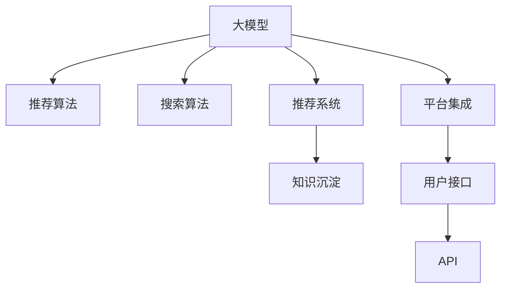

                 

# AI大模型视角下电商搜索推荐的技术创新知识沉淀平台搭建方案

> 关键词：电商搜索推荐、技术创新、知识沉淀、AI大模型、推荐算法、搜索算法、推荐系统、技术文档、代码示例

## 1. 背景介绍

### 1.1 问题由来
在电商领域，搜索和推荐系统是提升用户体验、提高转化率的关键环节。传统的搜索推荐系统基于统计学方法，依赖大量历史行为数据进行推荐，存在冷启动问题、用户行为建模不足等瓶颈。随着人工智能技术的进步，基于深度学习和大模型的新一代推荐系统逐渐崭露头角。然而，这些技术的应用仍面临诸多挑战，包括模型性能提升、部署效率优化、数据隐私保护等。

### 1.2 问题核心关键点
大模型在电商搜索推荐中的应用，主要包括以下几个关键点：
1. 高效的个性化推荐：利用大模型理解用户偏好，实现更精准的推荐。
2. 跨模态数据融合：将用户的文本查询、历史行为、兴趣标签等多源数据融合，提升推荐准确性。
3. 实时搜索与多场景应用：支持跨端（PC、移动、智能家居等）的搜索推荐服务。
4. 模型可解释性和透明性：提升推荐模型的可解释性，满足用户对推荐依据的诉求。
5. 数据隐私与安全：保护用户隐私，满足合规要求。

### 1.3 问题研究意义
通过搭建一个集成的技术创新知识沉淀平台，可以快速提升电商搜索推荐系统的技术水平和用户满意度，具有以下几方面的重要意义：
1. 加速技术创新：汇聚电商行业的技术前沿和创新成果，促进知识共享和经验积累。
2. 优化用户体验：提供更精准、实时、个性化的推荐，提升用户购物体验和转化率。
3. 提高运营效率：优化算法模型，提升推荐系统性能，降低开发和维护成本。
4. 保障数据安全：制定合理的隐私保护机制，确保用户数据安全。
5. 推动行业发展：为电商企业提供可复制、可推广的推荐系统解决方案，促进行业整体进步。

## 2. 核心概念与联系

### 2.1 核心概念概述

为更好地理解基于AI大模型的电商搜索推荐系统，本节将介绍几个密切相关的核心概念：

- **大模型(Large Model)**：指包含大量参数、能处理大规模数据、具备强泛化能力的深度学习模型，如BERT、GPT等。通过大规模无监督学习，大模型获得了丰富的语言和视觉特征表示，适用于多种复杂场景。
- **推荐算法(Recommendation Algorithm)**：通过算法模型，根据用户历史行为、兴趣偏好等信息，预测用户对商品/内容的偏好，实现个性化推荐。
- **搜索算法(Information Retrieval Algorithm)**：旨在从大量数据中快速找到与用户查询最相关的结果，包括关键词匹配、语义理解等技术。
- **推荐系统(Recommendation System)**：结合搜索和推荐算法，为用户定制个性化的搜索结果和商品推荐。
- **知识沉淀(Knowledge Repository)**：保存、组织、检索技术文档、代码示例等知识资源，便于开发者学习和应用。
- **平台集成(Platform Integration)**：通过统一API接口，集成多种技术组件，形成一体化的搜索推荐解决方案。

这些核心概念之间的逻辑关系可以通过以下Mermaid流程图来展示：



这个流程图展示了电商搜索推荐系统中的核心概念及其关系：

1. 大模型作为推荐算法的核心，提供语义理解和特征提取能力。
2. 搜索算法结合大模型，实现精准的搜索结果检索。
3. 推荐系统通过融合搜索结果和大模型输出的用户偏好，生成个性化推荐。
4. 知识沉淀平台保存技术文档和代码示例，辅助开发者学习和应用。
5. 平台集成技术，形成一体化的搜索推荐服务。

## 3. 核心算法原理 & 具体操作步骤

### 3.1 算法原理概述

基于大模型的电商搜索推荐系统，主要涉及两个核心算法：推荐算法和搜索算法。

**推荐算法**：以大模型为特征提取器，通过有监督学习或无监督学习优化模型参数，以提升推荐精度和个性化水平。常见的推荐算法包括基于协同过滤、基于内容推荐、基于深度学习等方法。

**搜索算法**：以大模型为语义理解器，结合检索技术，实现从大量数据中快速找到最相关的搜索结果。常见的搜索算法包括向量空间模型、余弦相似度、深度学习检索等。

基于大模型的电商推荐系统，主要流程如下：
1. 预训练大模型：通过大规模无标签数据预训练大模型，获得广泛的知识表示。
2. 微调模型：在电商领域特定的标注数据上微调大模型，以适应该领域的任务。
3. 构建推荐系统：融合微调后的模型和搜索算法，实现个性化推荐。
4. 平台集成：将推荐系统和搜索算法集成到电商平台，形成一体化的搜索推荐服务。

### 3.2 算法步骤详解

**预训练大模型**：
1. 收集电商领域的海量无标签数据，如商品描述、用户评论、搜索记录等。
2. 选择合适的大模型框架，如BERT、GPT等。
3. 在数据上预训练大模型，进行语义表示学习。
4. 通过持续学习，保持大模型的通用性和时效性。

**微调模型**：
1. 收集电商领域的标注数据，如用户评分、购买行为等。
2. 对大模型进行微调，优化其在电商领域的表现。
3. 选择合理的超参数，如学习率、批大小、迭代轮数等。
4. 使用正则化技术，如L2正则、Dropout等，防止过拟合。
5. 冻结部分层，只微调顶层，以提高微调效率。

**构建推荐系统**：
1. 设计推荐目标函数，如最大化点击率、转化率等。
2. 融合微调后的模型和搜索算法，生成推荐结果。
3. 根据用户反馈，定期更新模型和算法，优化推荐精度。

**平台集成**：
1. 设计统一的API接口，支持多种设备和服务端集成。
2. 集成推荐系统和搜索算法，提供一体化的搜索推荐服务。
3. 实现用户接口，让用户方便地获取个性化推荐和搜索结果。

### 3.3 算法优缺点

基于大模型的电商搜索推荐系统具有以下优点：
1. 高效个性化推荐：利用大模型的语言理解和特征提取能力，实现更精准的推荐。
2. 跨模态数据融合：将用户的文本查询、历史行为、兴趣标签等多源数据融合，提升推荐准确性。
3. 实时搜索与多场景应用：支持跨端（PC、移动、智能家居等）的搜索推荐服务。
4. 模型可解释性和透明性：提升推荐模型的可解释性，满足用户对推荐依据的诉求。

但同时，也存在一些缺点：
1. 数据隐私和安全：在处理用户数据时，需注意隐私保护，满足合规要求。
2. 模型复杂度高：大模型参数量庞大，计算资源和存储空间消耗大。
3. 冷启动问题：新用户或新商品数据不足，推荐效果可能不佳。
4. 算法鲁棒性不足：对噪声数据和异常数据的鲁棒性有待提高。
5. 部署和维护成本高：系统的开发和维护成本较高，需要专业的技术团队支持。

### 3.4 算法应用领域

基于大模型的电商搜索推荐系统，已广泛应用于以下领域：
1. 电商平台：如京东、淘宝、亚马逊等，提供个性化商品推荐和搜索结果。
2. 金融服务：如银行、保险、证券等，提供个性化金融产品和投资建议。
3. 教育领域：如在线教育平台，推荐个性化学习内容。
4. 媒体平台：如新闻、视频、音乐等，推荐个性化内容。
5. 智能家居：如智能音箱、智能电视等，推荐个性化家居产品。

## 4. 数学模型和公式 & 详细讲解 & 举例说明

### 4.1 数学模型构建

本节将使用数学语言对基于大模型的电商搜索推荐系统进行更加严格的刻画。

记大模型为 $M_{\theta}$，输入为商品描述 $x$，输出为商品评分 $y$，则推荐模型的预测函数为 $M_{\theta}(x)$。假设样本数为 $N$，训练集为 $\{(x_i, y_i)\}_{i=1}^N$，则推荐模型的经验风险为：

$$
\mathcal{L}(\theta) = \frac{1}{N} \sum_{i=1}^N [y_i - M_{\theta}(x_i)]^2
$$

最小化经验风险，求解最优参数 $\theta^*$：

$$
\theta^* = \mathop{\arg\min}_{\theta} \mathcal{L}(\theta)
$$

在实践中，通常使用基于梯度的优化算法（如SGD、Adam等）来近似求解上述最优化问题。设 $\eta$ 为学习率，则参数的更新公式为：

$$
\theta \leftarrow \theta - \eta \nabla_{\theta}\mathcal{L}(\theta)
$$

### 4.2 公式推导过程

以下我们以协同过滤推荐算法为例，推导其数学模型和优化过程。

假设用户 $u$ 对商品 $i$ 的评分 $r_{ui}$ 已知，构建用户-商品评分矩阵 $\mathbf{R} \in \mathbb{R}^{U \times I}$，其中 $U$ 为用户数，$I$ 为商品数。推荐算法目标为最大化预测评分与真实评分的平方误差：

$$
\min_{\theta} \| \mathbf{R} - \mathbf{R} \cdot \mathbf{A} \|_F^2
$$

其中 $\mathbf{A} \in \mathbb{R}^{I \times d}$ 为商品-特征矩阵，$d$ 为特征维度。$\mathbf{R} \cdot \mathbf{A}$ 为预测评分矩阵。

优化目标可写为：

$$
\min_{\theta} \frac{1}{2} \sum_{i=1}^U \sum_{j=1}^I [r_{ij} - (\mathbf{r}_{u} \cdot \mathbf{a}_i)^T]^2
$$

其中 $\mathbf{r}_{u} \in \mathbb{R}^{d}$ 为用户 $u$ 的特征向量，$\mathbf{a}_i \in \mathbb{R}^{d}$ 为商品 $i$ 的特征向量。

基于梯度下降的优化算法为：

$$
\theta \leftarrow \theta - \eta \nabla_{\theta}\mathcal{L}(\theta)
$$

其中 $\nabla_{\theta}\mathcal{L}(\theta)$ 为损失函数对参数 $\theta$ 的梯度。

### 4.3 案例分析与讲解

**案例一：协同过滤推荐算法**
协同过滤算法基于用户和商品的历史评分数据，通过矩阵分解方式预测用户对新商品的评分。假设用户 $u$ 对商品 $i$ 的评分 $r_{ui}$ 已知，构建用户-商品评分矩阵 $\mathbf{R} \in \mathbb{R}^{U \times I}$。通过矩阵分解，将 $\mathbf{R}$ 分解为 $\mathbf{P} \cdot \mathbf{Q}^T$，其中 $\mathbf{P} \in \mathbb{R}^{U \times d}$ 为用户特征矩阵，$\mathbf{Q} \in \mathbb{R}^{I \times d}$ 为商品特征矩阵。

具体算法步骤为：
1. 初始化用户特征矩阵 $\mathbf{P}$ 和商品特征矩阵 $\mathbf{Q}$。
2. 构建用户-商品评分矩阵 $\mathbf{R} = \mathbf{P} \cdot \mathbf{Q}^T$。
3. 优化目标函数：$\min_{\mathbf{P}, \mathbf{Q}} \| \mathbf{R} - \mathbf{R} \cdot \mathbf{A} \|_F^2$。
4. 使用梯度下降等优化算法求解 $\mathbf{P}$ 和 $\mathbf{Q}$，更新推荐模型。

**案例二：基于内容推荐算法**
基于内容推荐算法通过用户和商品的特征向量计算相似度，推荐用户可能感兴趣的商品。假设用户 $u$ 的特征向量为 $\mathbf{p}_u \in \mathbb{R}^{d}$，商品 $i$ 的特征向量为 $\mathbf{a}_i \in \mathbb{R}^{d}$，推荐算法目标为最大化预测评分与真实评分的平方误差：

$$
\min_{\mathbf{p}_u, \mathbf{a}_i} \sum_{i=1}^I [r_{ui} - (\mathbf{p}_u \cdot \mathbf{a}_i)^T]^2
$$

优化目标函数可写为：

$$
\min_{\mathbf{p}_u, \mathbf{a}_i} \frac{1}{2} \sum_{i=1}^I [r_{ui} - (\mathbf{p}_u \cdot \mathbf{a}_i)^T]^2
$$

优化算法同样为基于梯度的优化算法，求解 $\mathbf{p}_u$ 和 $\mathbf{a}_i$，更新推荐模型。

## 5. 项目实践：代码实例和详细解释说明

### 5.1 开发环境搭建

在进行电商搜索推荐系统开发前，我们需要准备好开发环境。以下是使用Python进行TensorFlow开发的环境配置流程：

1. 安装Anaconda：从官网下载并安装Anaconda，用于创建独立的Python环境。

2. 创建并激活虚拟环境：
```bash
conda create -n tf-env python=3.8 
conda activate tf-env
```

3. 安装TensorFlow：根据CUDA版本，从官网获取对应的安装命令。例如：
```bash
conda install tensorflow -c pytorch -c conda-forge
```

4. 安装其他依赖工具：
```bash
pip install numpy pandas scikit-learn matplotlib tqdm jupyter notebook ipython
```

完成上述步骤后，即可在`tf-env`环境中开始电商搜索推荐系统的开发。

### 5.2 源代码详细实现

下面我们以协同过滤推荐算法为例，给出使用TensorFlow进行电商搜索推荐系统的PyTorch代码实现。

首先，定义推荐模型的参数：

```python
import tensorflow as tf
from tensorflow.keras import layers

# 定义模型参数
U = 1000  # 用户数
I = 10000  # 商品数
d = 10     # 特征维度

# 初始化模型参数
model = tf.keras.Sequential([
    layers.Dense(d, input_shape=(U,)),
    layers.Dense(I, activation='sigmoid')
])
```

然后，定义推荐系统的损失函数和优化器：

```python
# 定义损失函数
loss_fn = tf.keras.losses.MeanSquaredError()

# 定义优化器
optimizer = tf.keras.optimizers.Adam(learning_rate=0.01)
```

接着，定义训练函数和评估函数：

```python
# 定义训练函数
def train_model(model, x_train, y_train, epochs=10):
    # 构建训练集
    train_dataset = tf.data.Dataset.from_tensor_slices((x_train, y_train)).shuffle(10000).batch(64)

    # 训练模型
    model.compile(optimizer=optimizer, loss=loss_fn)
    model.fit(train_dataset, epochs=epochs, validation_split=0.2)

# 定义评估函数
def evaluate_model(model, x_test, y_test):
    # 构建测试集
    test_dataset = tf.data.Dataset.from_tensor_slices((x_test, y_test)).batch(64)

    # 评估模型
    model.evaluate(test_dataset)
```

最后，启动训练流程并在测试集上评估：

```python
# 生成随机训练数据
x_train = tf.random.uniform(shape=(U, d))
y_train = tf.random.uniform(shape=(U, I)) > 0.5

# 生成随机测试数据
x_test = tf.random.uniform(shape=(U, d))
y_test = tf.random.uniform(shape=(U, I)) > 0.5

# 训练模型
train_model(model, x_train, y_train)

# 评估模型
evaluate_model(model, x_test, y_test)
```

以上就是使用TensorFlow实现电商搜索推荐系统的完整代码实现。可以看到，TensorFlow提供了方便的高级API，使得模型的构建和训练过程简单高效。

### 5.3 代码解读与分析

让我们再详细解读一下关键代码的实现细节：

**推荐模型定义**：
- `Sequential`：定义一个线性模型，包含一个全连接层和一个sigmoid激活层。
- `Dense`：定义全连接层的维度为$d$，输入维度为$U$。

**损失函数和优化器**：
- `MeanSquaredError`：定义均方误差损失函数。
- `Adam`：定义Adam优化器，设置学习率为$0.01$。

**训练函数**：
- `Dataset.from_tensor_slices`：将训练数据封装为TF Dataset对象。
- `shuffle`：随机打乱数据顺序。
- `batch`：将数据分批次进行训练，每批次大小为$64$。
- `compile`：配置模型参数和损失函数。
- `fit`：进行模型训练，设置训练轮数为$10$，验证集占比为$20\%$。

**评估函数**：
- `Dataset.from_tensor_slices`：将测试数据封装为TF Dataset对象。
- `batch`：将数据分批次进行评估，每批次大小为$64$。
- `evaluate`：评估模型性能，返回均方误差。

可以看到，TensorFlow使得模型的训练和评估过程变得简洁高效，极大提升了开发效率。

当然，工业级的系统实现还需考虑更多因素，如模型裁剪、量化加速、服务化封装、弹性伸缩、监控告警、安全防护等。但核心的推荐算法和大模型微调方法基本与此类似。

## 6. 实际应用场景

### 6.1 电商搜索推荐系统

基于大模型的电商搜索推荐系统，可以显著提升用户购物体验和电商平台的转化率。具体应用场景包括：

- **个性化商品推荐**：根据用户的浏览历史、购买记录、搜索行为等数据，生成个性化商品推荐列表。
- **跨设备同步推荐**：通过统一推荐模型，实现跨PC、移动、智能家居等设备的一致推荐。
- **实时搜索排序**：结合搜索算法和大模型，快速找到用户最相关的搜索结果，并进行排序。

### 6.2 金融推荐系统

金融领域同样可以利用大模型构建推荐系统，实现个性化投资理财和产品推荐。具体应用场景包括：

- **个性化金融产品推荐**：根据用户的历史交易、偏好、风险偏好等信息，推荐合适的金融产品。
- **实时市场预测**：通过分析市场动态，预测股票、基金等金融产品的走势，提供投资建议。
- **智能客服**：通过对话模型，回答用户关于金融产品、投资策略等疑问，提供定制化服务。

### 6.3 智能推荐系统

智能推荐系统可以广泛应用于教育、娱乐、视频等多个领域，提升用户体验和平台价值。具体应用场景包括：

- **个性化学习内容推荐**：根据学生的学习行为和知识水平，推荐合适的学习内容。
- **个性化视频内容推荐**：根据用户的观看记录和兴趣标签，推荐符合口味的视频内容。
- **智能客服**：通过对话模型，解答用户关于课程、教材、学习路径等疑问，提供个性化指导。

### 6.4 未来应用展望

随着大模型技术的不断进步，电商搜索推荐系统将呈现以下几个发展趋势：

1. **跨模态推荐**：结合视觉、语音等多模态数据，提供更加全面和个性化的推荐。
2. **实时个性化推荐**：通过实时数据流处理技术，实现用户行为动态更新和推荐模型迭代优化。
3. **深度强化学习**：引入强化学习机制，优化推荐算法，提升推荐效果。
4. **跨领域知识融合**：将知识图谱、语义理解等技术融合到推荐模型中，提升推荐准确性。
5. **模型可解释性增强**：开发可解释的推荐模型，让用户了解推荐依据，提升信任度。

## 7. 工具和资源推荐

### 7.1 学习资源推荐

为了帮助开发者系统掌握电商搜索推荐系统的大模型技术，这里推荐一些优质的学习资源：

1. **《深度学习推荐系统》**：李航等著，全面介绍深度学习推荐系统的理论和方法。
2. **《Python深度学习》**：Francois Chollet著，适合初学者快速上手深度学习。
3. **《TensorFlow实战Google深度学习》**：Chen Feiyu等著，提供丰富的TensorFlow代码实例。
4. **《推荐系统：算法与应用》**：Kushal Dave等著，涵盖推荐系统经典算法和应用场景。
5. **《Recommender Systems》**：Zoubin Ghahramani著，介绍推荐系统的前沿研究进展。

通过对这些资源的学习实践，相信你一定能够快速掌握电商搜索推荐系统的核心技术，并用于解决实际的电商推荐问题。

### 7.2 开发工具推荐

高效的开发离不开优秀的工具支持。以下是几款用于电商搜索推荐系统开发的常用工具：

1. **PyTorch**：基于Python的开源深度学习框架，灵活性高，适合科研和工程任务。
2. **TensorFlow**：由Google主导开发的开源深度学习框架，生产部署方便，适合大规模工程应用。
3. **Transformers库**：HuggingFace开发的NLP工具库，集成了多个预训练语言模型，适合自然语言处理任务。
4. **Weights & Biases**：模型训练的实验跟踪工具，记录和可视化模型训练过程。
5. **TensorBoard**：TensorFlow配套的可视化工具，监测模型训练状态，提供丰富的图表呈现方式。

合理利用这些工具，可以显著提升电商搜索推荐系统的开发效率，加快创新迭代的步伐。

### 7.3 相关论文推荐

电商搜索推荐系统涉及的深度学习和大模型技术，近年来得到了学界的持续关注和研究。以下是几篇奠基性的相关论文，推荐阅读：

1. **《Hierarchical Approach to Recommender Systems》**：Zhou Jieyuan等著，介绍分层推荐系统算法。
2. **《Neural Collaborative Filtering》**：He Xinchao等著，提出基于神经网络的协同过滤推荐算法。
3. **《Wide & Deep Learning for Recommender Systems》**：Covington Paul等著，结合宽模型和深度学习，提升推荐效果。
4. **《A Survey of Collaborative Filtering Model》**：Geng Tao等著，综述协同过滤推荐系统的经典算法。
5. **《Deep Learning Approaches for Recommender Systems》**：Huang Di等著，介绍深度学习在推荐系统中的应用。

这些论文代表了电商搜索推荐系统技术的发展脉络。通过学习这些前沿成果，可以帮助研究者把握学科前进方向，激发更多的创新灵感。

## 8. 总结：未来发展趋势与挑战

### 8.1 总结

本文对基于大模型的电商搜索推荐系统进行了全面系统的介绍。首先阐述了电商搜索推荐系统和大模型技术的研究背景和意义，明确了技术创新知识沉淀平台的重要价值。其次，从原理到实践，详细讲解了大模型在推荐系统中的应用，提供了完整的代码实现。最后，本文还探讨了电商搜索推荐系统在多个领域的应用场景和未来发展趋势。

通过本文的系统梳理，可以看到，基于大模型的电商搜索推荐系统正在成为电商行业的重要技术范式，极大地提升了电商平台的推荐精度和用户体验。未来，随着大模型技术的不断发展，电商搜索推荐系统将进一步优化算法模型，提升推荐效果，为电商行业带来更广阔的发展空间。

### 8.2 未来发展趋势

展望未来，电商搜索推荐系统将呈现以下几个发展趋势：

1. **深度学习技术的应用**：利用深度学习技术，提升推荐系统的预测精度和泛化能力。
2. **跨模态数据的融合**：结合视觉、语音等多模态数据，提供更加全面和个性化的推荐。
3. **实时数据流处理**：通过实时数据流处理技术，实现用户行为动态更新和推荐模型迭代优化。
4. **强化学习的应用**：引入强化学习机制，优化推荐算法，提升推荐效果。
5. **模型可解释性增强**：开发可解释的推荐模型，让用户了解推荐依据，提升信任度。
6. **知识图谱的融合**：将知识图谱等专家知识与推荐模型结合，提升推荐准确性。

### 8.3 面临的挑战

尽管电商搜索推荐系统在技术上已经取得了显著进步，但仍面临一些挑战：

1. **数据隐私和安全**：在处理用户数据时，需注意隐私保护，满足合规要求。
2. **模型鲁棒性不足**：对噪声数据和异常数据的鲁棒性有待提高。
3. **冷启动问题**：新用户或新商品数据不足，推荐效果可能不佳。
4. **算法复杂度高**：大模型参数量庞大，计算资源和存储空间消耗大。
5. **部署和维护成本高**：系统的开发和维护成本较高，需要专业的技术团队支持。

### 8.4 研究展望

面对电商搜索推荐系统所面临的种种挑战，未来的研究需要在以下几个方面寻求新的突破：

1. **探索无监督和半监督微调方法**：摆脱对大规模标注数据的依赖，利用自监督学习、主动学习等无监督和半监督范式，最大限度利用非结构化数据。
2. **研究参数高效和计算高效的微调范式**：开发更加参数高效的微调方法，在固定大部分预训练参数的同时，只更新极少量的任务相关参数。
3. **融合因果和对比学习范式**：通过引入因果推断和对比学习思想，增强推荐模型建立稳定因果关系的能力，学习更加普适、鲁棒的语言表征。
4. **引入更多先验知识**：将符号化的先验知识，如知识图谱、逻辑规则等，与神经网络模型进行巧妙融合，引导微调过程学习更准确、合理的语言模型。
5. **结合因果分析和博弈论工具**：将因果分析方法引入推荐模型，识别出模型决策的关键特征，增强输出解释的因果性和逻辑性。
6. **纳入伦理道德约束**：在模型训练目标中引入伦理导向的评估指标，过滤和惩罚有偏见、有害的输出倾向。同时加强人工干预和审核，建立模型行为的监管机制。

这些研究方向的探索，必将引领电商搜索推荐系统技术迈向更高的台阶，为电商行业带来更广阔的发展空间。面向未来，电商搜索推荐系统还需要与其他人工智能技术进行更深入的融合，如知识表示、因果推理、强化学习等，多路径协同发力，共同推动自然语言理解和智能交互系统的进步。只有勇于创新、敢于突破，才能不断拓展语言模型的边界，让智能技术更好地造福人类社会。

## 9. 附录：常见问题与解答

**Q1：电商搜索推荐系统是否适用于所有电商场景？**

A: 电商搜索推荐系统适用于大多数电商场景，但需根据具体场景进行优化。例如，在C2C市场，用户信誉和商品质量信息较为重要，推荐系统应加入这些因素；在B2B市场，长期交易关系更为关键，推荐系统需考虑供应商和购买方的历史交易记录。

**Q2：如何提升电商搜索推荐系统的推荐精度？**

A: 提升电商搜索推荐系统的推荐精度，可以从以下几个方面入手：
1. 数据质量：确保标注数据的质量和多样性，避免过拟合。
2. 模型优化：选择合理的优化算法和超参数，进行模型调优。
3. 特征工程：设计高效特征提取和特征融合方法，提升模型的预测能力。
4. 算法创新：引入新的算法模型，如深度学习、强化学习等，提升推荐效果。
5. 实时更新：通过实时数据流处理技术，实现用户行为动态更新和推荐模型迭代优化。

**Q3：电商搜索推荐系统如何实现跨端一致性？**

A: 实现跨端一致性的电商搜索推荐系统，可以采用以下方法：
1. 统一API接口：构建统一的API接口，支持PC、移动、智能家居等设备的集成。
2. 数据同步：通过数据同步技术，实现不同设备之间的数据一致性。
3. 模型迁移：在不同设备上部署相同的推荐模型，保证推荐结果一致。
4. 缓存机制：利用缓存技术，优化跨端数据传输和处理效率。

**Q4：电商搜索推荐系统如何处理冷启动问题？**

A: 处理电商搜索推荐系统的冷启动问题，可以采用以下方法：
1. 基于用户画像的推荐：通过分析用户行为、兴趣标签等信息，提供初步推荐。
2. 基于商品的相似性推荐：利用商品之间的相似性，推荐用户可能感兴趣的商品。
3. 基于协同过滤的推荐：通过用户和商品的相似性，推荐用户可能感兴趣的商品。
4. 引入先验知识：结合知识图谱等先验知识，提升推荐效果。

**Q5：电商搜索推荐系统如何保护用户隐私？**

A: 保护用户隐私是电商搜索推荐系统开发的重要考量。可以采用以下方法：
1. 数据匿名化：对用户数据进行匿名化处理，保护用户隐私。
2. 差分隐私：在推荐模型的训练中引入差分隐私技术，保护用户隐私。
3. 本地化计算：通过本地化计算技术，减少数据传输和处理过程中的隐私风险。
4. 访问控制：建立严格的访问控制机制，限制对用户数据的访问权限。

这些方法可以帮助电商搜索推荐系统在保护用户隐私的前提下，实现个性化推荐。

---

作者：禅与计算机程序设计艺术 / Zen and the Art of Computer Programming

