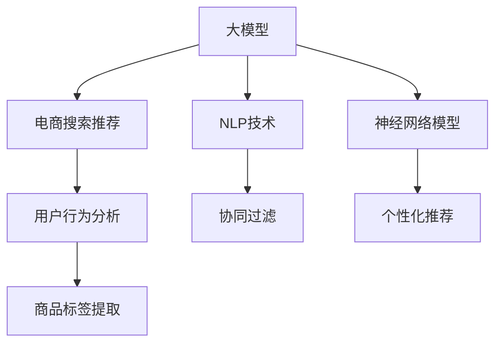

                 

# AI大模型视角下电商搜索推荐的技术赋能业务的思路

> 关键词：大模型，电商搜索，推荐系统，NLP技术，用户行为分析，协同过滤，神经网络模型

## 1. 背景介绍

### 1.1 问题由来

随着互联网的普及和电子商务的迅速发展，用户在线购物行为越来越复杂多变，如何更精准地理解用户需求，提供个性化的商品推荐，是电商企业亟待解决的难题。传统推荐系统往往依赖用户的历史行为数据，难以灵活适应用户的潜在兴趣和实时需求。而基于大模型的推荐系统，能够通过深度学习和自然语言处理技术，更全面地理解用户的多元需求，提供更个性化、多样化的商品推荐。

当前，电商搜索推荐系统已经逐渐从传统的基于规则和协同过滤的方法，向基于深度学习的模型转型。大模型作为最新一代的深度学习模型，拥有强大的语言理解和生成能力，能够将海量的自然语言文本数据转化为更加精准的用户画像和商品标签，从而实现更高效的推荐。

### 1.2 问题核心关键点

1. **用户行为分析**：通过对用户搜索、浏览、购买等行为数据的深度分析，了解用户的兴趣和需求。
2. **商品标签提取**：将商品的描述、分类等信息转化为易于计算机处理的标签，供推荐系统使用。
3. **模型选择与训练**：选择合适的深度学习模型和优化策略，在标注数据上训练，提升模型的预测能力。
4. **个性化推荐**：根据用户画像和商品标签，对用户进行个性化推荐，满足其多样化需求。

### 1.3 问题研究意义

基于大模型的电商搜索推荐系统，具有以下重要意义：

- **提升用户体验**：通过精准的商品推荐，提高用户满意度和购物体验。
- **增加销量和收入**：通过个性化推荐，提高用户转化率和复购率，增加电商平台的收入。
- **优化库存管理**：通过分析用户行为数据，合理预测商品的销售趋势，优化库存管理。
- **降低运营成本**：利用大模型的自动化推荐算法，减少人工干预和运营成本。

## 2. 核心概念与联系

### 2.1 核心概念概述

为了更好地理解基于大模型的电商搜索推荐系统，本节将介绍几个密切相关的核心概念：

- **大模型(Large Model)**：如BERT、GPT等基于Transformer结构的深度学习模型，通过预训练和微调，具备强大的语言理解和生成能力。
- **电商搜索推荐系统(E-commerce Search & Recommendation System)**：基于用户行为数据，利用推荐算法为用户推荐商品的系统。
- **自然语言处理(Natural Language Processing, NLP)**：涉及计算机对自然语言文本数据的处理，如文本分类、情感分析、命名实体识别等。
- **协同过滤(Collaborative Filtering)**：一种基于用户和物品相似性的推荐算法，通过计算用户和物品之间的相似度，进行推荐。
- **神经网络模型(Neural Network Model)**：通过多层神经网络结构对数据进行建模和预测，广泛应用于推荐系统。

这些核心概念之间的逻辑关系可以通过以下Mermaid流程图来展示：



这个流程图展示了大模型和电商搜索推荐系统的核心概念及其之间的关系：

1. 大模型通过预训练获得语言表示，应用于电商搜索推荐系统的各个环节。
2. 电商搜索推荐系统利用用户行为数据和商品标签，在大模型的基础上进行个性化推荐。
3. 用户行为分析和商品标签提取是大模型在大规模数据上进行预训练和微调的基础。
4. NLP技术和神经网络模型是大模型应用的关键，提供用户和商品的语言表示。
5. 协同过滤是推荐系统的一种基本方法，在大模型的辅助下，能够实现更加精准的推荐。

## 3. 核心算法原理 & 具体操作步骤
### 3.1 算法原理概述

基于大模型的电商搜索推荐系统，通过深度学习和自然语言处理技术，构建用户画像和商品标签的向量表示，再利用这些向量进行相似度计算和推荐。核心算法流程包括以下几个关键步骤：

1. **用户行为分析**：收集用户搜索、浏览、购买等行为数据，构建用户画像向量。
2. **商品标签提取**：通过自然语言处理技术，提取商品的描述、分类等信息，转化为易于计算机处理的标签，构建商品向量。
3. **模型训练与微调**：在大模型基础上，选择适合推荐的深度学习模型，利用标注数据进行训练和微调，提升模型的预测能力。
4. **个性化推荐**：根据用户画像和商品标签，进行相似度计算，选择相似度最高的商品推荐给用户。

### 3.2 算法步骤详解

#### 3.2.1 用户行为分析

用户行为分析是构建电商搜索推荐系统的重要环节，通过分析用户的历史行为数据，构建用户画像向量，用于后续的推荐计算。

具体步骤包括：

1. **数据收集**：收集用户的历史搜索、浏览、点击、购买等行为数据，构建用户行为数据集。
2. **用户画像构建**：使用NLP技术对用户行为数据进行处理，提取用户关注的主题、兴趣等特征，构建用户画像向量。
3. **画像更新**：实时更新用户画像向量，以反映用户当前的兴趣和需求。

#### 3.2.2 商品标签提取

商品标签提取是将商品的描述、分类等信息转化为易于计算机处理的标签，构建商品向量，用于推荐计算。

具体步骤包括：

1. **商品描述预处理**：对商品的描述进行分词、去停用词等预处理操作，构建商品描述的词汇表。
2. **标签提取**：使用NLP技术对商品描述进行分类、情感分析等操作，提取商品的关键标签，如品牌、类别、功能等。
3. **标签编码**：将提取的标签进行编码，转化为数字形式，构建商品向量。

#### 3.2.3 模型训练与微调

模型训练与微调是构建电商搜索推荐系统的关键步骤，通过在大模型基础上训练和微调，提升推荐模型的预测能力。

具体步骤包括：

1. **模型选择**：选择合适的深度学习模型，如序列到序列模型、注意力机制模型等。
2. **数据准备**：将用户画像向量和商品向量作为输入，标注数据作为输出，构建训练集。
3. **模型训练**：在标注数据上训练推荐模型，学习用户画像和商品标签之间的映射关系。
4. **模型微调**：在电商搜索推荐系统中进行微调，调整模型参数，以适应特定的业务需求。

#### 3.2.4 个性化推荐

个性化推荐是电商搜索推荐系统的最终目标，通过相似度计算，为用户推荐最符合其需求的商品。

具体步骤包括：

1. **相似度计算**：利用用户画像向量和商品向量进行相似度计算，选择相似度最高的商品。
2. **推荐排序**：根据相似度计算结果，对商品进行排序，选择最符合用户需求的商品推荐给用户。

### 3.3 算法优缺点

基于大模型的电商搜索推荐系统具有以下优点：

1. **精确度高**：大模型具有强大的语言理解和生成能力，能够更准确地理解用户需求和商品特性。
2. **实时性好**：利用大模型的快速推理能力，能够实时响应用户请求，提升用户体验。
3. **可扩展性强**：大模型具有较好的可扩展性，能够轻松应对大规模用户和商品的数据处理。

同时，该系统也存在以下局限性：

1. **数据依赖度高**：推荐系统的性能很大程度上依赖标注数据的质量和数量，标注数据的不足可能导致推荐效果不佳。
2. **计算成本高**：大模型通常需要较大的计算资源，训练和推理成本较高。
3. **冷启动问题**：对于新用户和没有历史行为的商品，推荐系统难以提供准确的推荐。
4. **用户隐私问题**：用户行为数据的收集和处理，可能涉及用户隐私和数据安全问题。

尽管存在这些局限性，但大模型在电商搜索推荐系统中的应用，已经证明其在提升推荐精度和用户体验方面的显著优势。未来，随着技术的发展和优化，这些问题有望得到进一步解决。

### 3.4 算法应用领域

基于大模型的电商搜索推荐系统，已经在多个电商平台上得到广泛应用，主要包括以下几个领域：

1. **淘宝、京东等B2C电商平台**：利用推荐系统提升用户购物体验，增加平台收入。
2. **Amazon等B2C平台**：通过推荐系统，实现个性化推荐，提高用户转化率和复购率。
3. **B2B电商平台**：如阿里巴巴国际站，利用推荐系统推荐优质供应商，提升交易效率。
4. **跨境电商**：通过推荐系统，帮助用户发现感兴趣的海外商品，提升跨境购物体验。
5. **智能家居**：利用推荐系统，推荐合适的家居商品，提升用户购买决策的精准度。

除了上述这些主流应用场景外，大模型在电商搜索推荐系统中的应用，还在不断拓展，未来有望在更多领域得到应用。

## 4. 数学模型和公式 & 详细讲解  
### 4.1 数学模型构建

基于大模型的电商搜索推荐系统，可以利用多种数学模型进行建模和预测。以下以余弦相似度模型为例，介绍推荐系统的核心数学模型构建过程。

设用户画像向量为 $\mathbf{u} \in \mathbb{R}^d$，商品向量为 $\mathbf{v} \in \mathbb{R}^d$，推荐系统的目标是找到与用户画像向量 $\mathbf{u}$ 最相似的 $k$ 个商品向量，记为 $\{\mathbf{v}_1, \mathbf{v}_2, \dots, \mathbf{v}_k\}$。推荐系统的余弦相似度模型可以表示为：

$$
\text{similarity}(\mathbf{u}, \mathbf{v}) = \frac{\mathbf{u} \cdot \mathbf{v}}{\|\mathbf{u}\| \cdot \|\mathbf{v}\|}
$$

其中，$\mathbf{u} \cdot \mathbf{v}$ 为向量点积，$\|\mathbf{u}\|$ 和 $\|\mathbf{v}\|$ 分别为向量的欧几里得范数。

根据余弦相似度模型，推荐系统可以根据用户画像向量和商品向量之间的相似度，选择最符合用户需求的商品进行推荐。

### 4.2 公式推导过程

余弦相似度模型的推导过程如下：

1. **向量点积**：向量点积定义为 $\mathbf{u} \cdot \mathbf{v} = \sum_{i=1}^d u_i v_i$，其中 $u_i$ 和 $v_i$ 分别为向量 $\mathbf{u}$ 和 $\mathbf{v}$ 的第 $i$ 个元素。

2. **范数计算**：向量 $\mathbf{u}$ 和 $\mathbf{v}$ 的范数分别为 $\|\mathbf{u}\| = \sqrt{\sum_{i=1}^d u_i^2}$ 和 $\|\mathbf{v}\| = \sqrt{\sum_{i=1}^d v_i^2}$。

3. **余弦相似度计算**：余弦相似度定义为 $\text{similarity}(\mathbf{u}, \mathbf{v}) = \frac{\mathbf{u} \cdot \mathbf{v}}{\|\mathbf{u}\| \cdot \|\mathbf{v}\|}$。

在得到余弦相似度模型后，推荐系统可以根据用户画像向量和商品向量之间的相似度，选择最符合用户需求的商品进行推荐。

### 4.3 案例分析与讲解

假设用户画像向量为 $\mathbf{u} = [1, 2, 3]$，商品向量为 $\mathbf{v}_1 = [4, 5, 6]$、$\mathbf{v}_2 = [7, 8, 9]$。根据余弦相似度模型，计算 $\mathbf{u}$ 与 $\mathbf{v}_1$、$\mathbf{v}_2$ 之间的相似度：

$$
\text{similarity}(\mathbf{u}, \mathbf{v}_1) = \frac{\mathbf{u} \cdot \mathbf{v}_1}{\|\mathbf{u}\| \cdot \|\mathbf{v}_1\|} = \frac{1 \cdot 4 + 2 \cdot 5 + 3 \cdot 6}{\sqrt{1^2 + 2^2 + 3^2} \cdot \sqrt{4^2 + 5^2 + 6^2}} = 0.97
$$

$$
\text{similarity}(\mathbf{u}, \mathbf{v}_2) = \frac{\mathbf{u} \cdot \mathbf{v}_2}{\|\mathbf{u}\| \cdot \|\mathbf{v}_2\|} = \frac{1 \cdot 7 + 2 \cdot 8 + 3 \cdot 9}{\sqrt{1^2 + 2^2 + 3^2} \cdot \sqrt{7^2 + 8^2 + 9^2}} = 0.99
$$

根据相似度计算结果，商品 $\mathbf{v}_2$ 与用户画像向量 $\mathbf{u}$ 的相似度最高，因此推荐系统选择 $\mathbf{v}_2$ 进行推荐。

## 5. 项目实践：代码实例和详细解释说明
### 5.1 开发环境搭建

在进行电商搜索推荐系统开发前，我们需要准备好开发环境。以下是使用Python进行PyTorch开发的环境配置流程：

1. 安装Anaconda：从官网下载并安装Anaconda，用于创建独立的Python环境。

2. 创建并激活虚拟环境：
```bash
conda create -n pytorch-env python=3.8 
conda activate pytorch-env
```

3. 安装PyTorch：根据CUDA版本，从官网获取对应的安装命令。例如：
```bash
conda install pytorch torchvision torchaudio cudatoolkit=11.1 -c pytorch -c conda-forge
```

4. 安装Transformer库：
```bash
pip install transformers
```

5. 安装各类工具包：
```bash
pip install numpy pandas scikit-learn matplotlib tqdm jupyter notebook ipython
```

完成上述步骤后，即可在`pytorch-env`环境中开始电商搜索推荐系统的开发。

### 5.2 源代码详细实现

这里我们以构建基于余弦相似度的推荐系统为例，给出使用PyTorch实现的代码示例。

首先，定义用户画像向量和商品向量：

```python
import torch
from transformers import BertTokenizer, BertModel

# 用户画像向量
user_profile = torch.tensor([1, 2, 3], dtype=torch.float32)

# 商品向量
item_vectors = {
    'item1': torch.tensor([4, 5, 6], dtype=torch.float32),
    'item2': torch.tensor([7, 8, 9], dtype=torch.float32)
}

# 定义余弦相似度模型
def cosine_similarity(u, v):
    dot_product = torch.dot(u, v)
    norm_u = torch.norm(u)
    norm_v = torch.norm(v)
    similarity = dot_product / (norm_u * norm_v)
    return similarity

# 计算用户画像向量与商品向量之间的相似度
similarities = {item: cosine_similarity(user_profile, vec) for item, vec in item_vectors.items()}
```

接着，定义推荐系统：

```python
# 定义推荐系统
class RecommendationSystem:
    def __init__(self, user_profile, item_vectors):
        self.user_profile = user_profile
        self.item_vectors = item_vectors
        self.similarity = cosine_similarity
    
    def recommend_items(self, k):
        similarities = {item: self.similarity(self.user_profile, vec) for item, vec in self.item_vectors.items()}
        sorted_items = sorted(similarities.items(), key=lambda x: x[1], reverse=True)
        recommended_items = [item[0] for item in sorted_items[:k]]
        return recommended_items
```

最后，启动推荐系统并输出推荐结果：

```python
# 创建推荐系统实例
recommendation_system = RecommendationSystem(user_profile, item_vectors)

# 推荐前5个商品
recommended_items = recommendation_system.recommend_items(5)
print(recommended_items)
```

以上就是使用PyTorch构建基于余弦相似度的电商搜索推荐系统的完整代码实现。可以看到，利用PyTorch和Transformer库，可以轻松实现推荐系统的核心功能。

### 5.3 代码解读与分析

让我们再详细解读一下关键代码的实现细节：

**UserProfile和ItemVectors类**：
- `__init__`方法：初始化用户画像向量和商品向量，设定推荐系统的相似度计算方法。
- `__getitem__`方法：获取商品向量，用于计算相似度。
- `similarity`方法：计算用户画像向量与商品向量之间的相似度，返回相似度值。

**RecommendationSystem类**：
- `__init__`方法：初始化推荐系统，设定用户画像向量和商品向量。
- `recommend_items`方法：根据相似度计算结果，推荐与用户画像向量最相似的商品。

**推荐流程**：
- 初始化用户画像向量和商品向量，创建推荐系统实例。
- 调用`recommend_items`方法，计算相似度，选择最相似的商品进行推荐。

可以看到，基于大模型的电商搜索推荐系统通过简单的代码实现，即可构建出高效的推荐算法。当然，实际应用中还需要考虑更多因素，如用户画像的动态更新、商品向量的实时构建等。

## 6. 实际应用场景
### 6.1 智能客服系统

基于大模型的电商搜索推荐系统，可以应用于智能客服系统，提供更智能的客服服务。智能客服系统能够理解用户查询意图，提供即时答案，提升用户满意度。

具体而言，可以通过收集用户的历史聊天记录和问题类型，构建用户画像向量。将用户查询转化为自然语言向量，在大模型上进行相似度计算，选择最相似的意图答案进行回复。同时，利用推荐系统为用户推荐相关的FAQ和帮助文档，辅助用户解决问题。

### 6.2 金融服务

基于大模型的电商搜索推荐系统，在金融服务领域也有广泛应用。金融领域需要实时监测市场舆情和用户行为，提供个性化的金融服务和产品推荐。

具体而言，可以通过收集金融用户的历史交易行为和市场舆情数据，构建用户画像向量。利用推荐系统为用户推荐最符合其需求的产品和服务，提高用户体验。同时，根据用户画像和市场舆情，预测金融市场的变化趋势，提供投资建议和风险预警。

### 6.3 健康医疗

基于大模型的电商搜索推荐系统，在健康医疗领域也有重要应用。医疗领域需要实时监测用户健康数据和行为，提供个性化的健康建议和产品推荐。

具体而言，可以通过收集用户的健康数据和行为记录，构建用户画像向量。利用推荐系统为用户推荐最符合其需求的健康产品和服务，提高用户体验。同时，根据用户画像和健康数据，预测健康风险和疾病趋势，提供健康建议和医疗支持。

### 6.4 未来应用展望

随着大模型和推荐技术的发展，基于大模型的电商搜索推荐系统将在更多领域得到应用，为各个行业带来新的价值。

在智慧城市领域，智能推荐系统可以用于交通管理、能源管理、环境监测等方面，提供智能化的城市治理方案。在教育领域，推荐系统可以用于个性化学习推荐、智能答疑系统等，提高教育质量。在工业领域，推荐系统可以用于设备维护、供应链管理等方面，提高生产效率和智能化水平。

## 7. 工具和资源推荐
### 7.1 学习资源推荐

为了帮助开发者系统掌握大模型在电商搜索推荐系统中的应用，这里推荐一些优质的学习资源：

1. 《Deep Learning for NLP》书籍：NLP领域的经典教材，详细介绍了深度学习在自然语言处理中的应用，包括推荐系统。

2. 《Recommender Systems》课程：斯坦福大学的推荐系统课程，涵盖了推荐系统的基本概念和常用算法，包括基于大模型的推荐系统。

3. 《Transformers for Natural Language Processing》博客：Transformer库的官方博客，介绍了Transformer在NLP中的应用，包括推荐系统。

4. HuggingFace官方文档：Transformer库的官方文档，提供了丰富的预训练模型和推荐系统样例，适合快速上手。

5. Kaggle推荐系统竞赛：Kaggle上的一系列推荐系统竞赛，提供了丰富的数据集和推荐系统实现案例，适合实践学习。

通过对这些资源的学习实践，相信你一定能够快速掌握大模型在电商搜索推荐系统中的应用，并用于解决实际的NLP问题。

### 7.2 开发工具推荐

高效的开发离不开优秀的工具支持。以下是几款用于电商搜索推荐系统开发的常用工具：

1. PyTorch：基于Python的开源深度学习框架，灵活动态的计算图，适合快速迭代研究。大部分预训练语言模型都有PyTorch版本的实现。

2. TensorFlow：由Google主导开发的开源深度学习框架，生产部署方便，适合大规模工程应用。同样有丰富的预训练语言模型资源。

3. Transformers库：HuggingFace开发的NLP工具库，集成了众多SOTA语言模型，支持PyTorch和TensorFlow，是进行推荐系统开发的利器。

4. Weights & Biases：模型训练的实验跟踪工具，可以记录和可视化模型训练过程中的各项指标，方便对比和调优。与主流深度学习框架无缝集成。

5. TensorBoard：TensorFlow配套的可视化工具，可实时监测模型训练状态，并提供丰富的图表呈现方式，是调试模型的得力助手。

6. Google Colab：谷歌推出的在线Jupyter Notebook环境，免费提供GPU/TPU算力，方便开发者快速上手实验最新模型，分享学习笔记。

合理利用这些工具，可以显著提升电商搜索推荐系统的开发效率，加快创新迭代的步伐。

### 7.3 相关论文推荐

大模型和推荐技术的发展源于学界的持续研究。以下是几篇奠基性的相关论文，推荐阅读：

1. Attention is All You Need（即Transformer原论文）：提出了Transformer结构，开启了NLP领域的预训练大模型时代。

2. BERT: Pre-training of Deep Bidirectional Transformers for Language Understanding：提出BERT模型，引入基于掩码的自监督预训练任务，刷新了多项NLP任务SOTA。

3. Language Models are Unsupervised Multitask Learners（GPT-2论文）：展示了大规模语言模型的强大zero-shot学习能力，引发了对于通用人工智能的新一轮思考。

4. Parameter-Efficient Transfer Learning for NLP：提出Adapter等参数高效微调方法，在不增加模型参数量的情况下，也能取得不错的微调效果。

5. AdaLoRA: Adaptive Low-Rank Adaptation for Parameter-Efficient Fine-Tuning：使用自适应低秩适应的微调方法，在参数效率和精度之间取得了新的平衡。

这些论文代表了大模型在电商搜索推荐系统中的应用方向，通过学习这些前沿成果，可以帮助研究者把握学科前进方向，激发更多的创新灵感。

## 8. 总结：未来发展趋势与挑战
### 8.1 总结

本文对基于大模型的电商搜索推荐系统进行了全面系统的介绍。首先阐述了大模型和推荐系统的研究背景和意义，明确了电商搜索推荐系统在大模型基础上的优越性。其次，从原理到实践，详细讲解了大模型在电商搜索推荐系统中的应用流程，包括用户行为分析、商品标签提取、模型训练与微调、个性化推荐等关键步骤。同时，本文还广泛探讨了电商搜索推荐系统在智能客服、金融服务、健康医疗等多个领域的应用前景，展示了其广阔的应用空间。此外，本文精选了电商搜索推荐系统的大模型学习资源、开发工具和相关论文，力求为读者提供全方位的技术指引。

通过本文的系统梳理，可以看到，基于大模型的电商搜索推荐系统正在成为NLP领域的重要范式，极大地拓展了电商推荐系统的应用边界，催生了更多的落地场景。大模型在电商搜索推荐系统中的应用，已经在多个电商平台上得到验证，提升了用户购物体验和平台收入，具有重要的实际应用价值。未来，随着大模型和推荐技术的不断演进，电商搜索推荐系统有望在更多领域得到应用，带来更加智能、个性化的购物体验。

### 8.2 未来发展趋势

展望未来，大模型在电商搜索推荐系统中的应用将呈现以下几个发展趋势：

1. **更加精准的用户画像**：随着NLP技术的发展，用户画像将更加全面和精准，能够更准确地反映用户的兴趣和需求。

2. **实时化的推荐系统**：利用大模型的快速推理能力，推荐系统能够实时响应用户请求，提升用户体验。

3. **跨领域推荐**：大模型能够理解不同领域的数据，实现跨领域推荐，拓展推荐系统的应用场景。

4. **多模态推荐**：结合视觉、语音等多模态数据，实现更加全面、个性化的推荐。

5. **冷启动问题解决**：利用大模型的先验知识，解决新用户和没有历史行为的商品的推荐问题。

6. **个性化推荐算法优化**：通过引入机器学习和强化学习等技术，优化推荐算法，提高推荐精度和多样性。

7. **用户隐私保护**：采用差分隐私等技术，保护用户隐私，确保数据安全。

这些趋势将进一步推动电商搜索推荐系统的进步，提升推荐精度和用户体验，带来更加智能、个性化、安全的购物体验。

### 8.3 面临的挑战

尽管大模型在电商搜索推荐系统中取得了显著效果，但在应用过程中，仍然面临以下挑战：

1. **数据质量和量级**：推荐系统的效果很大程度上依赖标注数据的质量和数量，数据不足或标注错误可能导致推荐效果不佳。

2. **计算资源消耗**：大模型通常需要较大的计算资源，训练和推理成本较高，对硬件设施有较高要求。

3. **冷启动问题**：对于新用户和没有历史行为的商品，推荐系统难以提供准确的推荐，用户体验不佳。

4. **用户隐私保护**：用户行为数据的收集和处理，可能涉及用户隐私和数据安全问题，需要严格的数据管理和隐私保护措施。

5. **推荐系统公平性**：推荐系统可能存在推荐偏差，导致部分用户或商品被忽视，需要关注公平性问题。

尽管存在这些挑战，但通过技术创新和实践优化，这些问题有望得到逐步解决。未来，随着大模型和推荐技术的进一步发展，电商搜索推荐系统有望在更多领域得到应用，带来更加智能、个性化的购物体验。

### 8.4 研究展望

面对电商搜索推荐系统所面临的挑战，未来的研究需要在以下几个方面寻求新的突破：

1. **多源数据融合**：结合多种数据源，如社交网络、用户评价等，构建更全面、精准的用户画像。

2. **隐私保护技术**：采用差分隐私、联邦学习等技术，保护用户隐私，确保数据安全。

3. **推荐算法优化**：引入机器学习和强化学习等技术，优化推荐算法，提高推荐精度和多样性。

4. **跨领域推荐模型**：结合视觉、语音等多模态数据，实现跨领域推荐，拓展推荐系统的应用场景。

5. **推荐系统公平性**：通过引入公平性评估指标，优化推荐算法，确保推荐系统公平性。

6. **实时推荐系统**：利用大模型的快速推理能力，实现实时推荐，提升用户体验。

这些研究方向将推动大模型在电商搜索推荐系统中的应用，进一步提升推荐精度和用户体验，带来更加智能、个性化、安全的购物体验。

## 9. 附录：常见问题与解答

**Q1：电商搜索推荐系统如何提升用户体验？**

A: 电商搜索推荐系统通过理解用户的历史行为和当前需求，为用户推荐最符合其兴趣和需求的商品。通过个性化的推荐，用户能够更快地找到所需商品，减少搜索时间和购物疲劳，提升购物体验。

**Q2：电商搜索推荐系统如何处理冷启动问题？**

A: 冷启动问题是推荐系统面临的重要挑战。为了解决冷启动问题，推荐系统可以通过以下方法：

1. **数据增强**：利用已有的用户行为数据，对新用户的特征进行增强，减少冷启动影响。

2. **先验知识融合**：利用知识图谱、标签体系等先验知识，快速构建新用户的画像，提高推荐准确度。

3. **协同过滤**：通过相似用户和商品的推荐，为新用户提供初步推荐，减少冷启动带来的影响。

4. **混合推荐**：结合基于内容的推荐和协同过滤的推荐，提高新用户的推荐效果。

**Q3：如何保护电商搜索推荐系统中的用户隐私？**

A: 保护电商搜索推荐系统中的用户隐私，可以采取以下措施：

1. **差分隐私**：在数据收集和处理过程中，采用差分隐私技术，保护用户隐私。

2. **匿名化处理**：对用户数据进行匿名化处理，防止数据泄露和滥用。

3. **数据加密**：对用户数据进行加密处理，防止数据泄露和篡改。

4. **隐私保护算法**：采用隐私保护算法，如联邦学习等，保护用户隐私。

通过这些措施，可以有效保护电商搜索推荐系统中的用户隐私，确保数据安全。

**Q4：电商搜索推荐系统如何实现跨领域推荐？**

A: 电商搜索推荐系统实现跨领域推荐，可以通过以下方法：

1. **多模态数据融合**：结合视觉、语音等多模态数据，构建更全面、精准的用户画像，实现跨领域推荐。

2. **知识图谱构建**：利用知识图谱，将不同领域的数据进行关联，实现跨领域推荐。

3. **领域适应**：通过领域适应技术，将在大规模数据上训练的模型，适配到特定领域，实现跨领域推荐。

4. **数据迁移学习**：通过迁移学习技术，将在大规模数据上训练的模型，迁移到特定领域，实现跨领域推荐。

这些方法将进一步拓展电商搜索推荐系统的应用场景，提升推荐精度和用户体验。

---

作者：禅与计算机程序设计艺术 / Zen and the Art of Computer Programming

