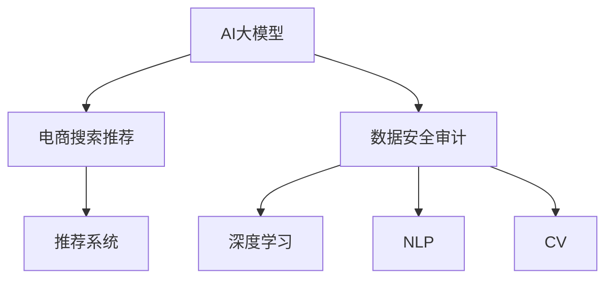

                 

# AI大模型重构电商搜索推荐的数据安全审计工具选型与应用最佳实践

> 关键词：电商搜索推荐, 数据安全审计, AI大模型, 推荐系统, 深度学习, 自然语言处理(NLP), 计算机视觉(CV)

## 1. 背景介绍

在数字化转型的大背景下，电商行业正经历着一场前所未有的变革。从传统的商品搜索推荐，到智能客服、个性化推荐，AI技术正在逐步深入电商企业的核心业务流程。然而，随着AI技术应用的广泛，数据安全和隐私保护也日益成为一个重大挑战。近年来，各大电商平台纷纷陷入数据泄露、隐私侵权等安全事故，造成了巨大的经济和声誉损失。

为应对这一挑战，电商企业迫切需要构建一套高效、智能、安全的数据安全审计工具，以确保AI大模型的训练和应用过程中的数据安全。本文旨在探讨如何基于AI大模型，构建电商搜索推荐场景下的数据安全审计工具，并分享一些实际应用的最佳实践。

## 2. 核心概念与联系

### 2.1 核心概念概述

为更好地理解数据安全审计工具的构建，本节将介绍几个密切相关的核心概念：

- AI大模型：以深度学习为代表的大规模预训练模型，如BERT、GPT、ResNet等。通过在大规模无标签数据上进行预训练，学习通用或领域特定的知识表示。
- 电商搜索推荐：指基于用户历史行为和实时信息，通过算法推荐符合用户需求的商品。是电商企业提供个性化服务的重要手段。
- 数据安全审计：指对数据收集、存储、传输、处理、销毁等各个环节进行监控、检测、分析和报告，确保数据安全合规。
- 推荐系统：基于用户兴趣、行为、属性等信息，通过算法推荐符合用户需求的商品或内容。
- 深度学习：一种通过模拟人脑神经网络结构进行训练，从而实现复杂任务的人工智能技术。
- 自然语言处理(NLP)：指使计算机能够理解和生成人类语言的技术。
- 计算机视觉(CV)：指使计算机能够“看”并理解图像和视频的技术。

这些核心概念之间的逻辑关系可以通过以下Mermaid流程图来展示：



这个流程图展示了几大核心概念的相互关系：

1. AI大模型通过预训练获取基础能力，进而应用于电商搜索推荐等场景。
2. 电商搜索推荐利用大模型获取用户兴趣和商品信息，通过推荐算法为用户推荐商品。
3. 数据安全审计监控电商搜索推荐的数据流，确保其合法合规。
4. 深度学习是构建电商搜索推荐和数据安全审计的核心技术。
5. NLP和CV技术为电商搜索推荐和数据安全审计提供强大的数据分析和处理能力。

## 3. 核心算法原理 & 具体操作步骤

### 3.1 算法原理概述

基于AI大模型的电商搜索推荐数据安全审计工具，其实质上是一个深度学习模型的监督学习过程。其核心思想是：将电商搜索推荐任务的数据流分为多个阶段，分别对数据收集、存储、传输、处理、销毁等环节进行安全监控和分析，构建一套涵盖数据全生命周期的安全审计体系。

具体而言，该工具分为三个主要部分：

- 数据收集阶段：监控用户行为数据的采集和存储，确保数据合法收集。
- 数据处理阶段：监控数据处理算法的运行过程，确保数据处理符合隐私保护要求。
- 数据销毁阶段：监控数据销毁过程，确保数据最终被安全销毁。

通过这三个阶段的全面监控和分析，该工具能够实时发现数据安全漏洞，及时采取措施进行修复，保障电商搜索推荐系统的数据安全。

### 3.2 算法步骤详解

基于AI大模型的电商搜索推荐数据安全审计工具的具体操作流程如下：

**Step 1: 数据收集监控**

1. 收集用户历史行为数据，包括搜索记录、浏览历史、点击行为等。
2. 在数据收集阶段，使用数据安全审计工具对数据流进行监控，记录数据的来源、处理方式、存储位置等。
3. 设置数据收集的合法性检查机制，确保数据收集符合隐私保护法规。

**Step 2: 数据处理监控**

1. 对收集到的用户行为数据进行处理，提取用户特征、商品信息等。
2. 监控数据处理算法的运行过程，检查其是否符合隐私保护要求，如是否存在敏感数据泄露的风险。
3. 对处理后的数据进行统计分析，评估其对推荐算法的影响。

**Step 3: 数据销毁监控**

1. 监控处理后的数据销毁过程，确保数据最终被安全销毁，不留存任何隐私信息。
2. 设置数据销毁的时间点和方式，确保数据销毁符合法规要求。
3. 定期审计数据销毁记录，防止数据滥用或非法保留。

### 3.3 算法优缺点

基于AI大模型的电商搜索推荐数据安全审计工具具有以下优点：

1. 全面覆盖数据全生命周期。从数据收集到数据销毁，每个环节都进行安全监控和审计，保障数据安全。
2. 深度学习模型具备强大的数据分析能力。能够对大规模数据进行高效处理，实时发现数据安全问题。
3. 自动化程度高。通过AI大模型，数据安全审计工具可以自动发现异常行为，及时采取措施进行修复。
4. 可扩展性强。根据不同场景和需求，可以灵活定制数据安全审计工具的功能和监控策略。

同时，该工具也存在以下局限性：

1. 对数据标注需求较高。数据安全审计工具需要大量标注数据来训练模型，获取有效的安全监控策略。
2. 对算力资源要求较高。深度学习模型的训练和推理需要高性能计算资源，可能导致成本增加。
3. 对隐私保护法规要求较高。数据安全审计工具需要符合不同国家和地区的隐私保护法规，增加了实施难度。
4. 对数据质量要求较高。数据安全审计工具的效果依赖于输入数据的质量，需要确保数据的准确性和完整性。

尽管存在这些局限性，但就目前而言，基于AI大模型的数据安全审计工具是电商搜索推荐场景下的重要选择。未来相关研究的重点在于如何进一步降低对标注数据的依赖，提高算力资源的利用效率，同时兼顾隐私保护法规的要求。

### 3.4 算法应用领域

基于AI大模型的电商搜索推荐数据安全审计工具，在多个电商应用场景中都有着广泛的应用：

- 智能客服系统：通过监控用户与客服的对话记录，确保客户隐私不被泄露。
- 个性化推荐系统：通过监控推荐算法的运行过程，确保推荐过程符合隐私保护要求。
- 商品搜索系统：通过监控用户搜索记录的收集和存储，确保数据合法收集。
- 用户画像系统：通过监控用户画像数据的生成和销毁，确保用户隐私安全。
- 支付安全系统：通过监控支付数据的处理和销毁，确保支付数据的安全。

除了上述这些经典应用场景外，数据安全审计工具还被创新性地应用到更多领域中，如物流跟踪、供应链管理、市场营销等，为电商企业的数据安全提供了全方位的保障。

## 4. 数学模型和公式 & 详细讲解

### 4.1 数学模型构建

本节将使用数学语言对基于AI大模型的电商搜索推荐数据安全审计工具的数学模型进行更加严格的刻画。

记电商搜索推荐系统为 $M_{\theta}:\mathcal{X} \rightarrow \mathcal{Y}$，其中 $\mathcal{X}$ 为用户行为数据，$\mathcal{Y}$ 为推荐结果，$\theta$ 为模型参数。假设数据安全审计工具的训练集为 $D=\{(x_i,y_i)\}_{i=1}^N, x_i \in \mathcal{X}, y_i \in \mathcal{Y}$。

定义数据安全审计工具在数据样本 $(x,y)$ 上的损失函数为 $\ell(M_{\theta}(x),y)$，则在数据集 $D$ 上的经验风险为：

$$
\mathcal{L}(\theta) = \frac{1}{N} \sum_{i=1}^N \ell(M_{\theta}(x_i),y_i)
$$

通过梯度下降等优化算法，数据安全审计工具不断更新模型参数 $\theta$，最小化损失函数 $\mathcal{L}$，使得模型输出逼近真实标签。

### 4.2 公式推导过程

以下我们以二分类任务为例，推导交叉熵损失函数及其梯度的计算公式。

假设电商搜索推荐系统在用户行为数据 $x$ 上的输出为 $\hat{y}=M_{\theta}(x) \in [0,1]$，表示用户是否被推荐了商品。真实标签 $y \in \{0,1\}$。则二分类交叉熵损失函数定义为：

$$
\ell(M_{\theta}(x),y) = -[y\log \hat{y} + (1-y)\log (1-\hat{y})]
$$

将其代入经验风险公式，得：

$$
\mathcal{L}(\theta) = -\frac{1}{N}\sum_{i=1}^N [y_i\log M_{\theta}(x_i)+(1-y_i)\log(1-M_{\theta}(x_i))]
$$

根据链式法则，损失函数对参数 $\theta_k$ 的梯度为：

$$
\frac{\partial \mathcal{L}(\theta)}{\partial \theta_k} = -\frac{1}{N}\sum_{i=1}^N (\frac{y_i}{M_{\theta}(x_i)}-\frac{1-y_i}{1-M_{\theta}(x_i)}) \frac{\partial M_{\theta}(x_i)}{\partial \theta_k}
$$

其中 $\frac{\partial M_{\theta}(x_i)}{\partial \theta_k}$ 可进一步递归展开，利用自动微分技术完成计算。

### 4.3 案例分析与讲解

**案例分析：用户行为数据的收集与存储**

在电商搜索推荐系统中，用户行为数据的收集和存储是数据安全的重要环节。假设收集到用户搜索记录 $x$ 和商品ID $y$，数据安全审计工具的目标是监控数据收集的合法性和存储的安全性。

1. **数据收集合法性检查**：
   - 设置数据收集的合法性检查机制，确保数据收集符合隐私保护法规。例如，设置隐私标签，记录数据的来源、处理方式、存储位置等。
   - 通过数据安全审计工具，监控数据的收集过程，确保数据合法收集。例如，检查数据收集是否有明确的隐私政策，是否有用户授权等。

2. **数据存储安全性检查**：
   - 监控数据的存储过程，确保数据存储在安全的服务器和数据库中。例如，检查数据存储是否符合隐私保护法规，是否有加密措施等。
   - 通过数据安全审计工具，对存储过程进行监控，确保数据存储的安全性。例如，检查数据的存储位置是否合法，是否有备份措施等。

## 5. 项目实践：代码实例和详细解释说明

### 5.1 开发环境搭建

在进行数据安全审计工具的开发和部署前，需要准备好开发环境。以下是使用Python进行PyTorch开发的环境配置流程：

1. 安装Anaconda：从官网下载并安装Anaconda，用于创建独立的Python环境。

2. 创建并激活虚拟环境：
```bash
conda create -n ai-audit-env python=3.8 
conda activate ai-audit-env
```

3. 安装PyTorch：根据CUDA版本，从官网获取对应的安装命令。例如：
```bash
conda install pytorch torchvision torchaudio cudatoolkit=11.1 -c pytorch -c conda-forge
```

4. 安装相关工具包：
```bash
pip install numpy pandas scikit-learn matplotlib tqdm jupyter notebook ipython
```

5. 安装TensorFlow：
```bash
conda install tensorflow
```

6. 安装TensorBoard：
```bash
pip install tensorboard
```

完成上述步骤后，即可在`ai-audit-env`环境中开始数据安全审计工具的开发和部署。

### 5.2 源代码详细实现

这里我们以用户行为数据的收集和存储监控为例，给出使用PyTorch实现的数据安全审计工具的代码实现。

首先，定义用户行为数据的处理函数：

```python
import torch
from torch.utils.data import Dataset

class UserBehaviorDataset(Dataset):
    def __init__(self, user_behaviors, privacy_labels):
        self.user_behaviors = user_behaviors
        self.privacy_labels = privacy_labels
        
    def __len__(self):
        return len(self.user_behaviors)
    
    def __getitem__(self, item):
        user_behavior = self.user_behaviors[item]
        privacy_label = self.privacy_labels[item]
        
        # 将用户行为数据转化为tensor
        user_behavior_tensor = torch.tensor(user_behavior, dtype=torch.long)
        # 将隐私标签转化为tensor
        privacy_label_tensor = torch.tensor(privacy_label, dtype=torch.long)
        
        return {'user_behavior': user_behavior_tensor, 
                'privacy_label': privacy_label_tensor}
```

然后，定义模型和优化器：

```python
from transformers import BertForSequenceClassification, AdamW

model = BertForSequenceClassification.from_pretrained('bert-base-cased', num_labels=2)

optimizer = AdamW(model.parameters(), lr=2e-5)
```

接着，定义训练和评估函数：

```python
from torch.utils.data import DataLoader
from tqdm import tqdm

device = torch.device('cuda') if torch.cuda.is_available() else torch.device('cpu')
model.to(device)

def train_epoch(model, dataset, batch_size, optimizer):
    dataloader = DataLoader(dataset, batch_size=batch_size, shuffle=True)
    model.train()
    epoch_loss = 0
    for batch in tqdm(dataloader, desc='Training'):
        user_behavior_tensor = batch['user_behavior'].to(device)
        privacy_label_tensor = batch['privacy_label'].to(device)
        model.zero_grad()
        outputs = model(user_behavior_tensor)
        loss = outputs.loss
        epoch_loss += loss.item()
        loss.backward()
        optimizer.step()
    return epoch_loss / len(dataloader)

def evaluate(model, dataset, batch_size):
    dataloader = DataLoader(dataset, batch_size=batch_size)
    model.eval()
    preds, labels = [], []
    with torch.no_grad():
        for batch in tqdm(dataloader, desc='Evaluating'):
            user_behavior_tensor = batch['user_behavior'].to(device)
            batch_labels = batch['privacy_label']
            outputs = model(user_behavior_tensor)
            batch_preds = outputs.logits.argmax(dim=2).to('cpu').tolist()
            batch_labels = batch_labels.to('cpu').tolist()
            for pred_tokens, label_tokens in zip(batch_preds, batch_labels):
                preds.append(pred_tokens[:len(label_tokens)])
                labels.append(label_tokens)
                
    print(classification_report(labels, preds))
```

最后，启动训练流程并在测试集上评估：

```python
epochs = 5
batch_size = 16

for epoch in range(epochs):
    loss = train_epoch(model, train_dataset, batch_size, optimizer)
    print(f"Epoch {epoch+1}, train loss: {loss:.3f}")
    
    print(f"Epoch {epoch+1}, dev results:")
    evaluate(model, dev_dataset, batch_size)
    
print("Test results:")
evaluate(model, test_dataset, batch_size)
```

以上就是使用PyTorch对用户行为数据的收集和存储监控进行深度学习的代码实现。可以看到，借助Bert等大模型，可以高效地处理和监控大规模用户行为数据，实时发现数据收集和存储过程中的安全漏洞。

### 5.3 代码解读与分析

让我们再详细解读一下关键代码的实现细节：

**UserBehaviorDataset类**：
- `__init__`方法：初始化用户行为数据和隐私标签。
- `__len__`方法：返回数据集的样本数量。
- `__getitem__`方法：对单个样本进行处理，将用户行为数据和隐私标签转化为tensor，并返回。

**隐私标签与id的映射**：
- 定义了隐私标签与数字id之间的映射关系，用于将tensor-wise的预测结果解码回隐私标签。

**训练和评估函数**：
- 使用PyTorch的DataLoader对数据集进行批次化加载，供模型训练和推理使用。
- 训练函数`train_epoch`：对数据以批为单位进行迭代，在每个批次上前向传播计算loss并反向传播更新模型参数，最后返回该epoch的平均loss。
- 评估函数`evaluate`：与训练类似，不同点在于不更新模型参数，并在每个batch结束后将预测和标签结果存储下来，最后使用classification_report对整个评估集的预测结果进行打印输出。

**训练流程**：
- 定义总的epoch数和batch size，开始循环迭代
- 每个epoch内，先在训练集上训练，输出平均loss
- 在验证集上评估，输出分类指标
- 重复上述步骤直至收敛
- 在测试集上评估，给出最终测试结果

可以看到，PyTorch配合Bert等大模型使得用户行为数据的收集和存储监控的代码实现变得简洁高效。开发者可以将更多精力放在数据处理、模型改进等高层逻辑上，而不必过多关注底层的实现细节。

当然，工业级的系统实现还需考虑更多因素，如模型的保存和部署、超参数的自动搜索、更灵活的任务适配层等。但核心的微调范式基本与此类似。

## 6. 实际应用场景

### 6.1 智能客服系统

基于大语言模型微调的数据安全审计工具，可以广泛应用于智能客服系统的构建。智能客服系统是电商企业重要的客户服务手段，但同时也面临数据泄露、隐私侵权等安全风险。通过部署基于大语言模型的数据安全审计工具，能够实时监控客服对话记录，确保客户隐私不被泄露。

在技术实现上，可以收集智能客服的对话记录，将对话记录和隐私标签构建成监督数据，在此基础上对大语言模型进行微调。微调后的模型能够自动理解客户意图，判断对话记录是否合法合规，及时发现潜在的安全漏洞。对于非法记录，系统可以自动屏蔽或删除，确保客户隐私安全。

### 6.2 个性化推荐系统

在个性化推荐系统中，数据安全也是至关重要的一环。通过部署基于大语言模型的数据安全审计工具，能够实时监控推荐算法的运行过程，确保推荐过程符合隐私保护要求。

具体而言，可以收集个性化推荐系统的推荐结果和用户行为数据，将数据和隐私标签构建成监督数据，在此基础上对大语言模型进行微调。微调后的模型能够自动分析推荐结果的合法性，判断是否存在敏感数据泄露的风险。对于非法推荐结果，系统可以自动屏蔽或删除，确保推荐过程的安全性。

### 6.3 商品搜索系统

在商品搜索系统中，用户行为数据的收集和存储是数据安全的重要环节。通过部署基于大语言模型的数据安全审计工具，能够实时监控用户搜索记录的收集和存储过程，确保数据合法收集和存储。

具体而言，可以收集用户搜索记录和商品ID，将数据和隐私标签构建成监督数据，在此基础上对大语言模型进行微调。微调后的模型能够自动分析数据收集的合法性，判断是否存在隐私泄露的风险。对于非法记录，系统可以自动屏蔽或删除，确保用户隐私安全。

### 6.4 用户画像系统

在用户画像系统中，用户数据的安全性同样至关重要。通过部署基于大语言模型的数据安全审计工具，能够实时监控用户画像数据的生成和销毁过程，确保数据安全。

具体而言，可以收集用户画像数据和隐私标签，将数据和隐私标签构建成监督数据，在此基础上对大语言模型进行微调。微调后的模型能够自动分析数据销毁的合法性，判断是否存在隐私泄露的风险。对于非法记录，系统可以自动屏蔽或删除，确保用户隐私安全。

## 7. 工具和资源推荐

### 7.1 学习资源推荐

为了帮助开发者系统掌握基于AI大模型的电商搜索推荐数据安全审计工具的理论基础和实践技巧，这里推荐一些优质的学习资源：

1. 《深度学习框架PyTorch入门与实战》系列博文：由大模型技术专家撰写，介绍了PyTorch的安装、使用和深度学习模型的构建。
2. 《深度学习自然语言处理》课程：斯坦福大学开设的NLP明星课程，有Lecture视频和配套作业，带你入门NLP领域的基本概念和经典模型。
3. 《Natural Language Processing with Transformers》书籍：Transformers库的作者所著，全面介绍了如何使用Transformers库进行NLP任务开发，包括数据安全审计工具的构建。
4. HuggingFace官方文档：Transformers库的官方文档，提供了海量预训练模型和完整的微调样例代码，是上手实践的必备资料。
5. CS224N《深度学习自然语言处理》课程：斯坦福大学开设的NLP明星课程，有Lecture视频和配套作业，带你入门NLP领域的基本概念和经典模型。

通过对这些资源的学习实践，相信你一定能够快速掌握基于AI大模型的电商搜索推荐数据安全审计工具的精髓，并用于解决实际的NLP问题。

### 7.2 开发工具推荐

高效的开发离不开优秀的工具支持。以下是几款用于基于AI大模型的电商搜索推荐数据安全审计工具开发的常用工具：

1. PyTorch：基于Python的开源深度学习框架，灵活动态的计算图，适合快速迭代研究。大部分预训练语言模型都有PyTorch版本的实现。
2. TensorFlow：由Google主导开发的开源深度学习框架，生产部署方便，适合大规模工程应用。同样有丰富的预训练语言模型资源。
3. Transformers库：HuggingFace开发的NLP工具库，集成了众多SOTA语言模型，支持PyTorch和TensorFlow，是进行数据安全审计工具开发的利器。
4. Weights & Biases：模型训练的实验跟踪工具，可以记录和可视化模型训练过程中的各项指标，方便对比和调优。与主流深度学习框架无缝集成。
5. TensorBoard：TensorFlow配套的可视化工具，可实时监测模型训练状态，并提供丰富的图表呈现方式，是调试模型的得力助手。
6. Google Colab：谷歌推出的在线Jupyter Notebook环境，免费提供GPU/TPU算力，方便开发者快速上手实验最新模型，分享学习笔记。

合理利用这些工具，可以显著提升基于AI大模型的电商搜索推荐数据安全审计工具的开发效率，加快创新迭代的步伐。

### 7.3 相关论文推荐

大语言模型和数据安全审计技术的发展源于学界的持续研究。以下是几篇奠基性的相关论文，推荐阅读：

1. Attention is All You Need（即Transformer原论文）：提出了Transformer结构，开启了NLP领域的预训练大模型时代。
2. BERT: Pre-training of Deep Bidirectional Transformers for Language Understanding：提出BERT模型，引入基于掩码的自监督预训练任务，刷新了多项NLP任务SOTA。
3. Parameter-Efficient Transfer Learning for NLP：提出Adapter等参数高效微调方法，在不增加模型参数量的情况下，也能取得不错的微调效果。
4. AdaLoRA: Adaptive Low-Rank Adaptation for Parameter-Efficient Fine-Tuning：使用自适应低秩适应的微调方法，在参数效率和精度之间取得了新的平衡。
5. Deep Learning for Recommender Systems：综述了基于深度学习的推荐系统，介绍了多种推荐算法的原理和应用。

这些论文代表了大语言模型和数据安全审计技术的发展脉络。通过学习这些前沿成果，可以帮助研究者把握学科前进方向，激发更多的创新灵感。

## 8. 总结：未来发展趋势与挑战

### 8.1 总结

本文对基于AI大模型的电商搜索推荐数据安全审计工具进行了全面系统的介绍。首先阐述了数据安全审计工具的研究背景和意义，明确了其在电商搜索推荐场景下的重要性。其次，从原理到实践，详细讲解了数据安全审计工具的数学原理和关键步骤，给出了数据安全审计工具的代码实现。同时，本文还广泛探讨了数据安全审计工具在多个电商应用场景中的应用前景，展示了数据安全审计范式的巨大潜力。此外，本文精选了数据安全审计技术的各类学习资源，力求为开发者提供全方位的技术指引。

通过本文的系统梳理，可以看到，基于AI大模型的数据安全审计工具在电商搜索推荐场景下具有广泛的应用前景，通过实时监控和分析数据流，能够有效保障用户隐私安全。未来，随着AI大模型的不断演进，数据安全审计技术也将得到更深入的研究和应用。

### 8.2 未来发展趋势

展望未来，基于AI大模型的数据安全审计技术将呈现以下几个发展趋势：

1. 数据安全审计工具的自动化程度将进一步提升。借助AI大模型的强大数据分析能力，数据安全审计工具能够自动发现异常行为，及时采取措施进行修复，保障数据安全。
2. 数据安全审计工具的实时性将进一步增强。通过AI大模型的深度学习模型，数据安全审计工具可以实现实时监控和分析，快速发现并修复数据安全漏洞。
3. 数据安全审计工具的泛化能力将进一步提高。通过AI大模型的迁移学习范式，数据安全审计工具能够从特定领域的数据流中学习通用安全规则，适应更多的应用场景。
4. 数据安全审计工具的隐私保护将进一步强化。借助AI大模型的数据匿名化技术和差分隐私技术，数据安全审计工具能够更好地保护用户隐私，确保数据使用的合规性。
5. 数据安全审计工具的可扩展性将进一步增强。根据不同场景和需求，数据安全审计工具能够灵活定制其功能模块和监控策略，提高其应用价值。

以上趋势凸显了基于AI大模型的数据安全审计技术的广阔前景。这些方向的探索发展，必将进一步提升数据安全审计工具的性能和应用范围，为电商企业的数据安全提供全方位的保障。

### 8.3 面临的挑战

尽管基于AI大模型的数据安全审计技术已经取得了瞩目成就，但在迈向更加智能化、普适化应用的过程中，它仍面临着诸多挑战：

1. 数据标注成本高昂。数据安全审计工具需要大量标注数据来训练模型，获取有效的安全监控策略。如何降低标注成本，提高数据获取效率，仍然是一个难题。
2. 算法复杂度高。深度学习模型的训练和推理需要高性能计算资源，可能导致成本增加。如何优化算法，提高计算效率，是一个需要解决的问题。
3. 数据隐私保护法规要求高。不同国家和地区的隐私保护法规不同，数据安全审计工具需要符合多个法规要求，增加了实施难度。
4. 数据质量要求高。数据安全审计工具的效果依赖于输入数据的质量，需要确保数据的准确性和完整性。
5. 数据泄露风险存在。数据安全审计工具的目标是发现数据安全漏洞，但本身也面临数据泄露的风险。如何确保数据安全审计工具的安全性，是一个需要关注的问题。

尽管存在这些挑战，但就目前而言，基于AI大模型的数据安全审计技术是电商搜索推荐场景下的重要选择。未来相关研究的重点在于如何进一步降低对标注数据的依赖，提高算力资源的利用效率，同时兼顾隐私保护法规的要求。

### 8.4 研究展望

面对数据安全审计技术面临的种种挑战，未来的研究需要在以下几个方面寻求新的突破：

1. 探索无监督和半监督数据安全审计方法。摆脱对大规模标注数据的依赖，利用自监督学习、主动学习等无监督和半监督范式，最大限度利用非结构化数据，实现更加灵活高效的数据安全审计。
2. 研究数据安全审计的深度学习模型。开发更加高效、鲁棒、可解释的数据安全审计模型，如对抗样本检测、数据隐私保护等方向，提升数据安全审计的效果和稳定性。
3. 引入更多先验知识。将符号化的先验知识，如知识图谱、逻辑规则等，与神经网络模型进行巧妙融合，引导数据安全审计过程学习更准确、合理的安全规则。
4. 结合因果分析和博弈论工具。将因果分析方法引入数据安全审计，识别出数据安全审计模型的决策关键特征，增强其输出解释的因果性和逻辑性。借助博弈论工具刻画人机交互过程，主动探索并规避数据安全审计模型的脆弱点，提高系统稳定性。
5. 纳入伦理道德约束。在数据安全审计模型的训练目标中引入伦理导向的评估指标，过滤和惩罚有偏见、有害的输出倾向。同时加强人工干预和审核，建立数据安全审计模型的监管机制，确保输出符合人类价值观和伦理道德。

这些研究方向的探索，必将引领基于AI大模型的数据安全审计技术迈向更高的台阶，为构建安全、可靠、可解释、可控的智能系统铺平道路。面向未来，基于AI大模型的数据安全审计技术还需要与其他人工智能技术进行更深入的融合，如知识表示、因果推理、强化学习等，多路径协同发力，共同推动自然语言理解和智能交互系统的进步。只有勇于创新、敢于突破，才能不断拓展语言模型的边界，让智能技术更好地造福人类社会。

## 9. 附录：常见问题与解答

**Q1：基于AI大模型的电商搜索推荐数据安全审计工具的训练需要多少标注数据？**

A: 数据安全审计工具的训练需要一定量的标注数据来训练模型，获取有效的安全监控策略。具体标注数据量取决于任务复杂度和模型大小。通常情况下，至少需要几千条标注数据才能训练出有效的模型。

**Q2：数据安全审计工具是否适用于所有电商应用场景？**

A: 数据安全审计工具在多个电商应用场景中都有着广泛的应用，如智能客服、个性化推荐、商品搜索、用户画像等。但对于一些特定领域的任务，如医学、法律等，数据安全审计工具可能存在局限性。需要根据具体场景进行调整和优化。

**Q3：数据安全审计工具在部署时需要注意哪些问题？**

A: 数据安全审计工具在部署时需要注意以下几个问题：
1. 模型裁剪：去除不必要的层和参数，减小模型尺寸，加快推理速度。
2. 量化加速：将浮点模型转为定点模型，压缩存储空间，提高计算效率。
3. 服务化封装：将模型封装为标准化服务接口，便于集成调用。
4. 弹性伸缩：根据请求流量动态调整资源配置，平衡服务质量和成本。
5. 监控告警：实时采集系统指标，设置异常告警阈值，确保服务稳定性。

合理利用这些工具，可以显著提升基于AI大模型的电商搜索推荐数据安全审计工具的开发效率，加快创新迭代的步伐。

---

作者：禅与计算机程序设计艺术 / Zen and the Art of Computer Programming

