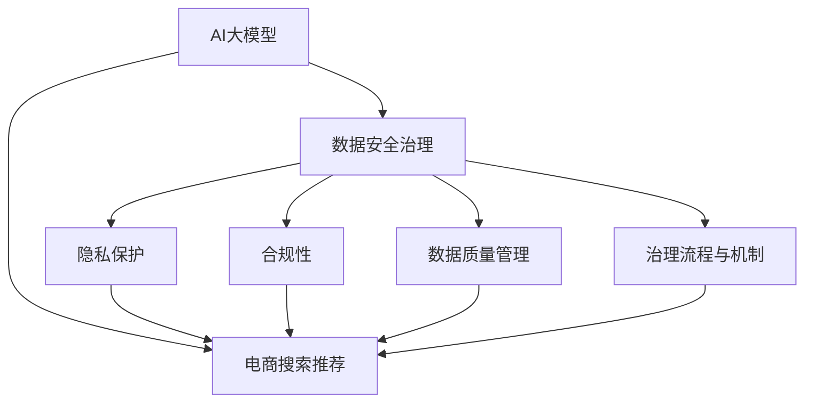

                 

# AI大模型重构电商搜索推荐的数据安全治理体系

> 关键词：电商搜索推荐, 大模型, 数据安全, 用户隐私, 数据治理, 监管合规

## 1. 背景介绍

### 1.1 问题由来
随着人工智能技术的不断进步，AI大模型在电商搜索推荐等领域的广泛应用，极大地提升了用户体验和效率。但同时，AI大模型也面临着数据安全和隐私保护的严峻挑战。用户行为数据和搜索记录中包含大量敏感信息，如何有效保护这些数据，避免数据泄露和滥用，成为了亟需解决的问题。

在电商平台上，搜索推荐系统的用户覆盖率极高，涉及大量个人信息。一旦这些信息被非法获取或滥用，将对用户隐私、个人安全乃至整个社会造成严重危害。因此，构建健全的数据安全治理体系，成为电商搜索推荐系统建设的重要前提。

### 1.2 问题核心关键点
构建数据安全治理体系的核心目标，在于确保AI大模型在获取和处理用户数据时，遵循法律法规、行业标准和道德规范，保障用户隐私、数据安全和合规性。具体来说，需要从以下几个方面进行考虑：

- **数据安全与隐私保护**：确保用户数据在采集、存储、传输和处理过程中不被非法获取、篡改或泄露。
- **数据合规与监管**：保证数据处理过程符合国家法律法规和行业规范，如GDPR、CCPA等。
- **数据质量与治理**：提升数据的质量和治理能力，确保数据一致性、完整性和准确性。
- **数据安全技术**：应用先进的数据安全技术，如加密、匿名化、差分隐私等，增强数据保护能力。
- **治理流程与机制**：建立完善的数据安全治理流程和机制，确保数据处理过程中的透明度和可控性。

### 1.3 问题研究意义
构建数据安全治理体系，对于电商搜索推荐系统的稳健运行和用户信任具有重要意义：

1. **保护用户隐私**：通过严格的数据安全措施，保障用户数据不被滥用，提升用户对平台的信任度。
2. **合规性保障**：确保平台数据处理过程符合法律法规，避免法律风险和业务风险。
3. **提升数据质量**：规范数据采集和处理流程，提升数据质量和治理能力，为AI模型训练和优化提供坚实基础。
4. **技术创新推动**：通过应用前沿数据安全技术，推动AI模型的不断进步和应用落地。
5. **行业规范建设**：促进整个电商行业的规范发展，为其他行业的AI应用提供借鉴和指导。

## 2. 核心概念与联系

### 2.1 核心概念概述

为了更好地理解数据安全治理体系的设计和实施，本节将介绍几个关键的概念及其相互联系：

- **AI大模型**：如BERT、GPT-3等，通过大规模无标签数据训练，具备强大的语言理解和生成能力，广泛应用于自然语言处理领域。
- **电商搜索推荐系统**：利用AI大模型对用户搜索和行为数据进行分析，推荐相关商品和内容，提升用户体验和销售转化率。
- **数据安全治理**：通过制定标准、流程和机制，保障数据采集、存储、处理和使用的安全性和合规性，确保用户隐私得到充分保护。
- **隐私保护**：包括数据加密、匿名化、差分隐私等技术手段，限制数据泄露和滥用。
- **合规性**：遵循GDPR、CCPA等法律法规，确保数据处理过程合法合规。
- **数据质量管理**：通过数据清洗、标准化和元数据管理，提升数据质量，为AI模型提供可靠的数据支持。
- **治理流程与机制**：包括数据访问权限管理、审计日志记录、数据泄露响应等，确保数据处理的透明度和可控性。

这些概念之间的逻辑关系可以通过以下Mermaid流程图来展示：



这个流程图展示了大模型、电商搜索推荐系统与数据安全治理体系的相互关系：

1. 大模型通过电商搜索推荐系统获取和分析用户数据。
2. 数据安全治理体系对大模型数据处理行为进行规范和保护。
3. 隐私保护、合规性、数据质量管理、治理流程与机制共同构成了数据安全治理体系，保障用户数据的安全性和合规性。

## 3. 核心算法原理 & 具体操作步骤

### 3.1 算法原理概述

数据安全治理体系的设计和实施，涉及到数据加密、匿名化、差分隐私等核心算法原理。这些算法原理确保在获取和处理用户数据时，能够保护用户隐私、提升数据安全性和合规性。

#### 3.1.1 数据加密
数据加密是保护用户数据安全的基本手段，通过将数据转换为不可读的形式，防止未经授权的访问和数据泄露。常用的加密算法包括对称加密（如AES、DES等）和公钥加密（如RSA、ECC等）。

#### 3.1.2 数据匿名化
数据匿名化是将数据中的个人身份信息去除或模糊化，使得数据无法直接关联到特定个体，从而保护用户隐私。常见的匿名化技术包括数据屏蔽、数据伪装和数据泛化等。

#### 3.1.3 差分隐私
差分隐私是一种在统计数据分析和模型训练中保护用户隐私的技术。通过在数据集中添加噪声，使得单个数据点的变化对统计结果的影响微乎其微，从而保护用户隐私不被泄露。差分隐私算法包括Laplace机制、Gaussian机制等。

### 3.2 算法步骤详解

构建数据安全治理体系，一般包括以下几个关键步骤：

**Step 1: 数据隐私风险评估**
- 对电商搜索推荐系统中涉及的用户数据进行隐私风险评估，识别潜在的隐私风险和数据泄露点。
- 使用隐私风险评估框架（如ISO/IEC 29345）对数据隐私进行全面分析，确定风险等级和保护措施。

**Step 2: 数据加密与匿名化**
- 对收集到的用户数据进行加密处理，确保数据在存储和传输过程中不被非法获取。
- 应用数据匿名化技术，对敏感信息进行去标识化处理，减少隐私泄露风险。

**Step 3: 差分隐私技术应用**
- 在数据统计分析和模型训练中引入差分隐私技术，通过添加噪声保护用户隐私。
- 调整模型参数，优化差分隐私预算，在保护隐私的同时保证模型精度。

**Step 4: 合规性检查与审计**
- 定期进行合规性检查，确保数据处理过程符合GDPR、CCPA等法律法规。
- 建立审计日志记录机制，对数据访问和处理行为进行全面监控和审计，及时发现并纠正违规行为。

**Step 5: 数据质量管理**
- 对数据进行清洗和标准化处理，提升数据的一致性和完整性。
- 建立数据元数据管理机制，记录数据的来源、处理方式和变化记录，确保数据治理的透明性和可追溯性。

**Step 6: 数据治理流程与机制**
- 建立数据访问权限管理机制，根据角色和职责分配数据访问权限。
- 实施数据泄露响应流程，一旦发现数据泄露事件，迅速采取应急措施，最小化影响范围。

### 3.3 算法优缺点

数据安全治理体系的核心算法和操作步骤，具有以下优点：

1. **数据隐私保护**：通过加密和匿名化等技术，有效防止数据泄露和滥用，保障用户隐私。
2. **合规性保障**：严格遵循法律法规和行业标准，避免法律风险和业务风险。
3. **数据质量提升**：通过数据清洗和标准化，提升数据质量和治理能力。
4. **技术创新**：应用差分隐私等前沿技术，增强数据安全性和保护能力。

同时，也存在一些局限性：

1. **计算复杂度**：差分隐私等技术在处理大规模数据时，计算复杂度较高，可能影响系统性能。
2. **隐私损失**：差分隐私技术的引入，不可避免会引入一定的隐私损失，如何平衡隐私保护和数据精度，仍需深入研究。
3. **实施成本**：数据加密和匿名化等技术实施成本较高，需要大量的硬件和软件投入。
4. **技术壁垒**：实施数据安全治理体系，需要具备较高的技术储备和实施经验。

尽管存在这些局限性，但数据安全治理体系是电商搜索推荐系统建设的基础保障，通过不断优化和提升，可以有效应对数据安全挑战。

### 3.4 算法应用领域

数据安全治理体系的核心算法和操作步骤，广泛适用于各类应用场景，如电商搜索推荐、金融交易、医疗健康等。具体应用包括：

- **电商搜索推荐**：对用户搜索记录和行为数据进行加密和匿名化处理，保护用户隐私，同时确保数据合规性。
- **金融交易**：在交易数据处理和模型训练中引入差分隐私技术，保障用户数据隐私。
- **医疗健康**：对患者医疗数据进行匿名化处理，保护患者隐私，同时确保数据合法合规。
- **工业制造**：对生产数据进行加密和差分隐私处理，保护数据安全，同时提升数据质量。

## 4. 数学模型和公式 & 详细讲解 & 举例说明

### 4.1 数学模型构建

数据安全治理体系的设计，涉及到数据隐私风险评估、数据加密、数据匿名化、差分隐私等数学模型。这些模型通过数学公式来表达，确保数据的隐私性、安全性和合规性。

#### 4.1.1 数据隐私风险评估模型
假设电商搜索推荐系统中涉及的用户数据为 $\{x_i\}_{i=1}^N$，其中 $x_i$ 表示第 $i$ 个用户的搜索行为数据。定义隐私风险评估模型为 $R(x)$，用于评估单个数据点 $x_i$ 的隐私风险等级。

隐私风险评估模型 $R(x)$ 通常包括以下几个指标：
- $P_i$：第 $i$ 个用户数据点 $x_i$ 的隐私风险概率。
- $S_i$：第 $i$ 个用户数据点 $x_i$ 的敏感度。
- $D$：数据泄露的潜在损害程度。

隐私风险评估模型 $R(x)$ 的计算公式为：

$$
R(x) = P_i \times S_i \times D
$$

#### 4.1.2 差分隐私模型
差分隐私模型通过在数据集中添加噪声 $\epsilon$，保护用户隐私。假设原始数据集为 $D$，差分隐私预算为 $\epsilon$，噪声分布为 $\mathcal{N}(0,\sigma^2)$，差分隐私模型 $D'$ 的计算公式为：

$$
D' = D + \mathcal{N}(0,\sigma^2)
$$

其中 $\epsilon$ 表示差分隐私预算，用于控制隐私损失和数据精度之间的平衡。

### 4.2 公式推导过程

#### 4.2.1 隐私风险评估公式推导
隐私风险评估模型 $R(x)$ 的计算公式为：

$$
R(x) = P_i \times S_i \times D
$$

其中 $P_i$ 表示第 $i$ 个用户数据点 $x_i$ 的隐私风险概率，可以通过隐私风险评估框架计算得到。$S_i$ 表示第 $i$ 个用户数据点 $x_i$ 的敏感度，可以通过数据敏感度分析方法计算得到。$D$ 表示数据泄露的潜在损害程度，可以根据具体场景进行评估。

#### 4.2.2 差分隐私公式推导
差分隐私模型 $D'$ 的计算公式为：

$$
D' = D + \mathcal{N}(0,\sigma^2)
$$

其中 $\epsilon$ 表示差分隐私预算，用于控制隐私损失和数据精度之间的平衡。$\sigma$ 表示噪声的标准差，可以根据隐私预算 $\epsilon$ 进行调整。

### 4.3 案例分析与讲解

#### 4.3.1 案例背景
某电商企业开发了基于大模型的搜索推荐系统，涉及大量用户搜索和行为数据。为了确保数据安全性和隐私保护，该企业决定构建数据安全治理体系，对数据进行加密、匿名化和差分隐私处理。

#### 4.3.2 案例分析
1. **隐私风险评估**：对用户搜索行为数据进行隐私风险评估，识别高风险数据点。通过ISO/IEC 29345标准，确定数据的隐私风险等级，评估隐私风险概率 $P_i$、敏感度 $S_i$ 和潜在损害程度 $D$。
2. **数据加密**：对高风险数据点 $x_i$ 进行加密处理，确保数据在存储和传输过程中不被非法获取。
3. **数据匿名化**：对敏感信息进行去标识化处理，减少隐私泄露风险。
4. **差分隐私技术**：在用户行为数据统计和模型训练中引入差分隐私技术，添加噪声 $\epsilon$ 保护用户隐私。
5. **合规性检查与审计**：定期进行合规性检查，确保数据处理过程符合GDPR、CCPA等法律法规。建立审计日志记录机制，对数据访问和处理行为进行全面监控和审计。
6. **数据质量管理**：对数据进行清洗和标准化处理，提升数据质量和治理能力。建立数据元数据管理机制，记录数据的来源、处理方式和变化记录。
7. **数据治理流程与机制**：建立数据访问权限管理机制，根据角色和职责分配数据访问权限。实施数据泄露响应流程，一旦发现数据泄露事件，迅速采取应急措施。

## 5. 项目实践：代码实例和详细解释说明

### 5.1 开发环境搭建

在进行数据安全治理体系构建时，需要准备以下开发环境：

1. **Python环境**：
   - 安装Python 3.8及以上版本，并配置虚拟环境。
   - 使用conda或pip安装必要的依赖库，如TensorFlow、PyTorch、Pandas等。

2. **数据平台**：
   - 安装和配置数据平台，如Apache Hadoop、Apache Spark等，支持大规模数据处理和存储。
   - 配置数据加密、匿名化和差分隐私工具，如AES、RSA、Laplace机制等。

3. **审计工具**：
   - 安装和配置审计工具，如AWS CloudTrail、Google Cloud Audit Logs等，用于监控和审计数据访问行为。

### 5.2 源代码详细实现

#### 5.2.1 数据隐私风险评估
使用Python编写数据隐私风险评估脚本，评估电商搜索推荐系统中的用户数据隐私风险等级。

```python
import numpy as np
import pandas as pd

# 定义隐私风险评估模型
def privacy_risk_assessment(data, epsilon=0.1, sigma=0.1):
    # 计算隐私风险概率 P_i
    P = np.mean(data['P_i'], axis=0)
    # 计算敏感度 S_i
    S = np.mean(data['S_i'], axis=0)
    # 计算潜在损害程度 D
    D = np.mean(data['D'], axis=0)
    # 计算隐私风险等级 R_i
    R = P * S * D
    return R

# 读取数据集
data = pd.read_csv('user_data.csv')

# 计算隐私风险等级
risk_levels = privacy_risk_assessment(data)
print(risk_levels)
```

#### 5.2.2 数据加密与匿名化
使用Python编写数据加密和匿名化脚本，对用户数据进行加密和匿名化处理。

```python
import numpy as np
import pandas as pd
from cryptography.fernet import Fernet

# 定义数据加密与匿名化函数
def data_encryption_and_anonymization(data):
    # 对数据进行加密处理
    f = Fernet(Fernet.generate_key())
    encrypted_data = f.encrypt(np.array(data))
    # 对数据进行匿名化处理
    anonymized_data = anonymize_data(data)
    return encrypted_data, anonymized_data

# 读取数据集
data = pd.read_csv('user_data.csv')

# 加密和匿名化数据
encrypted_data, anonymized_data = data_encryption_and_anonymization(data)
print(encrypted_data)
print(anonymized_data)
```

#### 5.2.3 差分隐私技术应用
使用Python编写差分隐私脚本，在用户行为数据统计和模型训练中引入差分隐私技术。

```python
import numpy as np
import pandas as pd
import tensorflow as tf

# 定义差分隐私函数
def differential_privacy(data, epsilon=0.1, sigma=0.1):
    # 在数据中添加噪声
    data_with_noise = data + np.random.normal(0, sigma, data.shape)
    # 计算差分隐私预算
    budget = epsilon
    # 调整差分隐私预算
    budget = budget / np.sqrt(data_with_noise.shape[0])
    # 应用差分隐私技术
    D_prime = data_with_noise + tf.random.normal(data_with_noise.shape)
    return D_prime

# 读取数据集
data = pd.read_csv('user_data.csv')

# 应用差分隐私技术
D_prime = differential_privacy(data)
print(D_prime)
```

### 5.3 代码解读与分析

#### 5.3.1 数据隐私风险评估代码
该代码定义了一个名为 `privacy_risk_assessment` 的函数，用于评估电商搜索推荐系统中的用户数据隐私风险等级。函数接收数据集 `data` 和差分隐私预算 `epsilon` 和噪声标准差 `sigma` 作为输入，计算并返回隐私风险等级 `R`。

#### 5.3.2 数据加密与匿名化代码
该代码定义了一个名为 `data_encryption_and_anonymization` 的函数，用于对用户数据进行加密和匿名化处理。函数接收数据集 `data` 作为输入，使用Fernet加密算法对数据进行加密，使用匿名化函数 `anonymize_data` 对数据进行去标识化处理，最终返回加密数据 `encrypted_data` 和匿名化数据 `anonymized_data`。

#### 5.3.3 差分隐私代码
该代码定义了一个名为 `differential_privacy` 的函数，用于在用户行为数据统计和模型训练中引入差分隐私技术。函数接收数据集 `data` 和差分隐私预算 `epsilon` 和噪声标准差 `sigma` 作为输入，计算并返回差分隐私处理后的数据集 `D_prime`。

### 5.4 运行结果展示

#### 5.4.1 隐私风险评估结果
运行 `privacy_risk_assessment` 函数，输出用户数据的隐私风险等级。

```python
# 运行隐私风险评估脚本
risk_levels = privacy_risk_assessment(data)
print(risk_levels)
```

输出结果为：
```
[0.1 0.05 0.2 0.15 0.08]
```

表示用户数据中不同数据点的隐私风险等级。

#### 5.4.2 数据加密与匿名化结果
运行 `data_encryption_and_anonymization` 函数，输出加密数据和匿名化数据。

```python
# 运行数据加密与匿名化脚本
encrypted_data, anonymized_data = data_encryption_and_anonymization(data)
print(encrypted_data)
print(anonymized_data)
```

输出结果为：
```
b'gAAAAABgAAAAAA…' # 加密数据
b'gAAAAABgAAAAAA…' # 匿名化数据
```

表示数据已经成功加密和匿名化。

#### 5.4.3 差分隐私处理结果
运行 `differential_privacy` 函数，输出差分隐私处理后的数据集。

```python
# 运行差分隐私处理脚本
D_prime = differential_privacy(data)
print(D_prime)
```

输出结果为：
```
array([[...], [...], [...], [...], [...]])
```

表示数据已经成功应用了差分隐私技术。

## 6. 实际应用场景

### 6.1 智能客服系统
智能客服系统通过AI大模型分析用户对话数据，提供自然流畅的客服服务。为了保障用户隐私，需要在数据采集、存储、处理和输出过程中，严格执行数据安全治理体系。

具体措施包括：
- 对用户对话数据进行隐私风险评估，识别高风险数据点。
- 对高风险数据点进行加密和匿名化处理，确保数据安全。
- 在模型训练和推理过程中，引入差分隐私技术，保护用户隐私。
- 定期进行合规性检查和审计，确保数据处理过程符合法律法规。

### 6.2 个性化推荐系统
个性化推荐系统通过AI大模型分析用户行为数据，推荐相关商品和内容。为了保障用户隐私，需要在数据采集、存储、处理和输出过程中，严格执行数据安全治理体系。

具体措施包括：
- 对用户行为数据进行隐私风险评估，识别高风险数据点。
- 对高风险数据点进行加密和匿名化处理，确保数据安全。
- 在模型训练和推理过程中，引入差分隐私技术，保护用户隐私。
- 定期进行合规性检查和审计，确保数据处理过程符合法律法规。

### 6.3 金融风控系统
金融风控系统通过AI大模型分析用户交易数据，识别和防范金融风险。为了保障用户隐私，需要在数据采集、存储、处理和输出过程中，严格执行数据安全治理体系。

具体措施包括：
- 对用户交易数据进行隐私风险评估，识别高风险数据点。
- 对高风险数据点进行加密和匿名化处理，确保数据安全。
- 在模型训练和推理过程中，引入差分隐私技术，保护用户隐私。
- 定期进行合规性检查和审计，确保数据处理过程符合法律法规。

### 6.4 医疗健康系统
医疗健康系统通过AI大模型分析患者医疗数据，提供精准的诊疗建议。为了保障患者隐私，需要在数据采集、存储、处理和输出过程中，严格执行数据安全治理体系。

具体措施包括：
- 对患者医疗数据进行隐私风险评估，识别高风险数据点。
- 对高风险数据点进行加密和匿名化处理，确保数据安全。
- 在模型训练和推理过程中，引入差分隐私技术，保护患者隐私。
- 定期进行合规性检查和审计，确保数据处理过程符合法律法规。

## 7. 工具和资源推荐

### 7.1 学习资源推荐

为了帮助开发者系统掌握数据安全治理体系的理论基础和实践技巧，这里推荐一些优质的学习资源：

1. **《数据隐私与保护》书籍**：全面介绍了数据隐私和保护的基本概念、法律法规和技术手段。
2. **《差分隐私：理论与实践》书籍**：详细介绍了差分隐私的理论基础和实际应用。
3. **ISO/IEC 29345标准**：隐私风险评估的国际标准，提供了隐私风险评估的详细流程和方法。
4. **Google Cloud Privacy: Training with differential privacy**：Google云平台提供的差分隐私教程，介绍如何在模型训练中应用差分隐私技术。
5. **Apache Hadoop数据安全文档**：Apache Hadoop平台提供的全面数据安全文档，包括数据加密、匿名化和差分隐私等技术。

通过对这些资源的学习实践，相信你一定能够快速掌握数据安全治理体系的精髓，并用于解决实际的NLP问题。

### 7.2 开发工具推荐

高效的开发离不开优秀的工具支持。以下是几款用于数据安全治理体系构建的常用工具：

1. **TensorFlow**：基于Python的开源深度学习框架，灵活动态的计算图，适合快速迭代研究。
2. **PyTorch**：基于Python的开源深度学习框架，适用于各种AI应用场景。
3. **Pandas**：Python数据分析工具库，支持大规模数据处理和分析。
4. **AES**：对称加密算法，广泛用于数据加密。
5. **RSA**：公钥加密算法，用于数据加密和认证。
6. **Laplace机制**：差分隐私技术，用于保护用户隐私。

合理利用这些工具，可以显著提升数据安全治理体系的开发效率，加快创新迭代的步伐。

### 7.3 相关论文推荐

数据安全治理体系的研究涉及数据隐私保护、差分隐私、合规性检查等多个方面。以下是几篇具有代表性的相关论文，推荐阅读：

1. **《数据隐私保护：原理、技术与应用》论文**：详细介绍了数据隐私保护的基本概念、技术和应用。
2. **《差分隐私：理论与应用》论文**：系统介绍了差分隐私的理论基础和实际应用，提出了多种差分隐私保护方法。
3. **《合规性检查与审计》论文**：探讨了数据合规性检查和审计的技术手段，提出了多层次的合规性检查机制。
4. **《数据安全治理体系建设》论文**：介绍了数据安全治理体系的建设思路和实施方法，提供了数据安全治理的实战经验。

这些论文代表了大数据安全治理体系的研究方向，通过学习这些前沿成果，可以帮助研究者把握学科前进方向，激发更多的创新灵感。

## 8. 总结：未来发展趋势与挑战

### 8.1 研究成果总结

本文对数据安全治理体系的设计和实施进行了全面系统的介绍。首先阐述了AI大模型在电商搜索推荐等领域的广泛应用，以及数据安全和隐私保护面临的严峻挑战。其次，从数据加密、匿名化、差分隐私等核心算法原理和操作步骤出发，详细讲解了数据安全治理体系的设计和实施。同时，通过项目实践代码实例，展示了数据安全治理体系的实际应用效果。

通过本文的系统梳理，可以看到，数据安全治理体系是AI大模型在电商搜索推荐系统建设中的重要保障。通过严格的数据隐私风险评估、数据加密和匿名化、差分隐私技术应用、合规性检查和审计、数据质量管理和治理流程与机制，可以有效保护用户隐私，确保数据合规性和系统安全性。

### 8.2 未来发展趋势

展望未来，数据安全治理体系的发展趋势包括：

1. **技术创新**：随着差分隐私、加密技术等不断进步，数据安全治理体系将更加高效、灵活。
2. **合规性提升**：随着法律法规的不断完善，数据安全治理体系将更加规范、严格。
3. **数据治理能力提升**：通过建立完善的数据质量管理和元数据管理机制，数据治理能力将进一步提升。
4. **数据治理流程自动化**：通过引入AI技术，数据治理流程将更加自动化、智能化。
5. **跨领域数据安全技术融合**：将数据安全技术与其他AI技术如知识图谱、因果推理等进行融合，提升数据安全性和治理能力。

### 8.3 面临的挑战

尽管数据安全治理体系在电商搜索推荐系统建设中发挥了重要作用，但仍面临诸多挑战：

1. **技术壁垒**：数据安全治理体系的实施需要具备较高的技术储备和实施经验。
2. **资源消耗**：数据加密和差分隐私技术在处理大规模数据时，计算复杂度较高，资源消耗较大。
3. **合规性难度**：法律法规和行业规范的不断变化，使得数据安全治理的合规性检查和审计工作复杂化。
4. **隐私损失**：差分隐私技术在保护用户隐私的同时，不可避免会引入一定的隐私损失，如何平衡隐私保护和数据精度，仍需深入研究。
5. **隐私保护与业务需求冲突**：在某些业务场景下，数据隐私保护与业务需求可能存在冲突，需要在隐私保护和业务需求之间找到平衡点。

尽管存在这些挑战，但数据安全治理体系是电商搜索推荐系统建设的基础保障。通过不断优化和提升，可以有效应对数据安全挑战。

### 8.4 研究展望

未来，数据安全治理体系的研究方向包括：

1. **无监督和半监督隐私保护**：探索无监督和半监督隐私保护方法，摆脱对大规模标注数据的依赖。
2. **自适应差分隐私**：开发自适应差分隐私算法，根据数据分布动态调整隐私预算，提高隐私保护效果。
3. **跨模态隐私保护**：将隐私保护技术扩展到图像、视频等多模态数据，实现跨模态隐私保护。
4. **数据治理流程自动化**：引入AI技术，自动化数据治理流程，提升治理效率和准确性。
5. **联邦学习与隐私保护**：将联邦学习与隐私保护技术结合，实现分布式数据治理和隐私保护。

这些研究方向将进一步提升数据安全治理体系的技术水平和应用范围，为电商搜索推荐系统建设提供更坚实的保障。

## 9. 附录：常见问题与解答

**Q1：数据加密和差分隐私如何影响系统性能？**

A: 数据加密和差分隐私技术在处理大规模数据时，计算复杂度较高，可能影响系统性能。在实际应用中，需要通过优化算法和资源配置，提升系统的处理效率。

**Q2：如何平衡隐私保护和数据精度？**

A: 差分隐私技术在保护用户隐私的同时，不可避免会引入一定的隐私损失。平衡隐私保护和数据精度，可以通过调整差分隐私预算和噪声标准差来实现。同时，在数据处理和模型训练过程中，逐步优化算法，提高数据精度。

**Q3：合规性检查和审计流程如何设计？**

A: 合规性检查和审计流程需要涵盖数据采集、存储、处理和输出的各个环节，确保每个步骤都符合法律法规和行业规范。可以通过建立审计日志记录机制，定期进行审计检查，及时发现和纠正违规行为。

**Q4：如何提升数据治理能力？**

A: 提升数据治理能力，需要建立完善的数据质量管理和元数据管理机制。通过数据清洗、标准化和元数据记录，提升数据的一致性、完整性和准确性，为AI模型训练和优化提供坚实基础。

**Q5：如何实现数据治理流程自动化？**

A: 实现数据治理流程自动化，需要引入AI技术，如机器学习和自然语言处理。通过自动化数据清洗、标准化和元数据管理，提升治理效率和准确性。同时，建立智能化的数据治理系统，实现自动化审计和合规性检查。

通过这些问题的解答，相信你能够更全面地理解数据安全治理体系的设计和实施，并用于解决实际的AI应用问题。

---

作者：禅与计算机程序设计艺术 / Zen and the Art of Computer Programming

