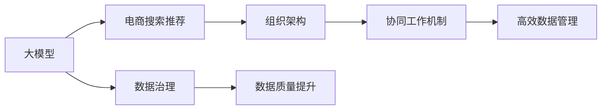

                 

# AI大模型重构电商搜索推荐的数据治理组织架构优化方案设计

> 关键词：大模型，电商搜索推荐，数据治理，组织架构，优化方案

## 1. 背景介绍

### 1.1 问题由来
随着电子商务的快速发展，电商平台的海量数据处理需求和个性化推荐策略的复杂度不断增加。为了提升用户体验和销售额，商家需要快速准确地匹配用户需求和商品信息。传统基于规则或小规模机器学习模型的推荐系统已无法满足这一需求。近年来，大规模预训练语言模型和大规模无标签数据的优势开始显现，大模型在推荐系统中的应用逐渐成为热门研究话题。

然而，现有的大模型在电商搜索推荐中的应用仍面临诸多挑战。数据质量差、数据孤岛、数据标准不统一等问题严重制约了模型的训练和部署。同时，由于数据治理组织架构的落后，数据管理的责任不明确，使得数据质量提升和利用效率低下。因此，如何通过重构数据治理组织架构，优化大模型在电商搜索推荐中的应用，成为当下亟待解决的问题。

### 1.2 问题核心关键点
大模型在电商搜索推荐中应用的核心关键点包括：
- 数据的获取、处理和治理
- 模型的训练、部署和优化
- 组织的架构设计和管理机制

通过优化数据治理和组织架构，可以大幅提升大模型在电商搜索推荐中的应用效果和效率。本文将深入探讨这些问题，提出基于大模型的电商搜索推荐数据治理组织架构优化方案。

## 2. 核心概念与联系

### 2.1 核心概念概述

为更好地理解本文提出的优化方案，我们将先介绍一些关键核心概念：

- **大模型（Large Model）**：指具有数十亿甚至上百亿参数的预训练语言模型，如GPT、BERT等。这类模型通过在大规模无标签数据上自监督预训练，学习到丰富的语言表示能力，适用于各种自然语言处理任务。

- **电商搜索推荐（E-commerce Search Recommendation）**：涉及电商平台上用户搜索行为和商品信息的匹配、推荐。目标是通过算法精准地匹配用户查询与商品，提高用户满意度和转化率。

- **数据治理（Data Governance）**：指对数据的全生命周期进行规范化管理，确保数据的准确性、完整性和一致性，提升数据质量和利用效率。

- **组织架构（Organization Architecture）**：指企业内部各职能部门和岗位的层次结构、职责分工和协作机制，直接影响企业运营效率和管理效果。

### 2.2 核心概念原理和架构的 Mermaid 流程图



以上流程图展示了各概念之间的关系：

1. 大模型通过数据治理得到高质数据，供电商搜索推荐使用。
2. 电商搜索推荐系统在组织架构的支撑下，高效协作和迭代优化。
3. 数据治理通过规范化的流程，不断提升数据质量。
4. 组织架构通过协同机制，提升团队的协作效率。

## 3. 核心算法原理 & 具体操作步骤

### 3.1 算法原理概述

基于大模型的电商搜索推荐系统，其核心算法原理主要包括以下几个方面：

1. **预训练模型**：在大量无标签文本数据上进行自监督预训练，学习通用的语言表示能力。
2. **微调优化**：在电商搜索推荐任务的标注数据上进行有监督的微调，提升模型在特定任务上的性能。
3. **协同学习**：在电商搜索推荐系统中，各模块（如搜索、推荐、评价等）之间的协同学习，进一步提升整体系统的性能。

### 3.2 算法步骤详解

**Step 1: 数据预处理**

电商搜索推荐系统需要处理海量用户数据和商品信息，因此数据预处理是关键步骤。主要包括以下几个环节：

1. **数据收集**：从电商平台的用户行为日志、交易记录、商品详情等渠道获取数据。
2. **数据清洗**：处理缺失值、异常值等，保证数据的完整性和一致性。
3. **数据标注**：对有标注的数据进行分类、排序、标记等预处理，便于后续模型训练。

**Step 2: 大模型训练**

大模型的训练分为预训练和微调两个阶段：

1. **预训练**：使用大规模无标签数据，训练大模型，学习通用的语言表示能力。
2. **微调**：在电商搜索推荐任务的标注数据上，对大模型进行微调，提升模型在特定任务上的性能。

**Step 3: 系统部署**

微调后的大模型需要部署到电商搜索推荐系统中，通过API接口提供服务：

1. **模型导出**：将训练好的大模型导出为可部署的模型格式。
2. **服务部署**：使用容器化技术（如Docker）部署模型服务，确保模型的稳定性和可扩展性。
3. **API设计**：设计API接口，保证数据输入输出格式的一致性。

**Step 4: 系统优化**

电商搜索推荐系统需要不断优化：

1. **A/B测试**：对不同模型或策略进行对比测试，评估性能。
2. **参数调整**：根据测试结果，调整模型参数，优化推荐效果。
3. **性能监控**：实时监控系统性能，及时发现和解决问题。

### 3.3 算法优缺点

大模型在电商搜索推荐中的优缺点如下：

**优点**：
1. **高性能**：大模型具备强大的语言理解和生成能力，能够处理复杂的推荐任务。
2. **泛化能力强**：预训练模型能够适应各种电商场景，提升系统的泛化能力。
3. **可扩展性**：模块化设计使得系统易于扩展和升级。

**缺点**：
1. **资源消耗大**：大模型需要大量计算资源和存储空间。
2. **训练时间长**：预训练和微调过程耗时较长。
3. **需要高质量数据**：对数据质量要求高，需花费大量时间和成本进行数据清洗和标注。

### 3.4 算法应用领域

大模型在电商搜索推荐中的应用领域包括：

1. **用户搜索行为分析**：通过分析用户搜索行为，预测用户需求，提供精准推荐。
2. **商品标签生成**：为商品自动生成标签，便于搜索和推荐。
3. **广告投放优化**：通过大模型分析用户行为，优化广告投放策略。
4. **智能客服**：利用大模型提供智能客服支持，提升用户体验。
5. **商品评论分析**：分析商品评论文本，提供商品质量评价和推荐。

## 4. 数学模型和公式 & 详细讲解 & 举例说明

### 4.1 数学模型构建

本文将重点讲解基于大模型的电商搜索推荐数学模型。假设大模型为 $M_{\theta}$，其中 $\theta$ 为模型参数。电商搜索推荐任务的输入为 $X=\{x_i\}_{i=1}^N$，输出为 $Y=\{y_i\}_{i=1}^N$，其中 $x_i$ 为用户搜索输入，$y_i$ 为用户推荐商品。

定义损失函数 $\mathcal{L}(M_{\theta}, X, Y)$，用于衡量模型输出与真实标签之间的差异：

$$
\mathcal{L}(M_{\theta}, X, Y) = \frac{1}{N} \sum_{i=1}^N \ell(M_{\theta}(x_i), y_i)
$$

其中 $\ell$ 为特定任务下的损失函数，如均方误差、交叉熵等。

### 4.2 公式推导过程

假设电商搜索推荐任务为多分类任务，采用交叉熵损失函数 $\ell$：

$$
\ell(M_{\theta}(x_i), y_i) = -\sum_{j=1}^C y_{ij} \log M_{\theta}(x_i, j)
$$

其中 $C$ 为类别数，$y_{ij}$ 表示用户 $i$ 是否选择商品 $j$。

将上述公式代入损失函数 $\mathcal{L}$：

$$
\mathcal{L}(M_{\theta}, X, Y) = -\frac{1}{N} \sum_{i=1}^N \sum_{j=1}^C y_{ij} \log M_{\theta}(x_i, j)
$$

### 4.3 案例分析与讲解

以电商平台商品推荐为例，假设有一个大模型 $M_{\theta}$，输入为用户搜索输入 $x_i$，输出为商品列表 $y_i$。假设商品有100个类别，则定义损失函数为：

$$
\mathcal{L}(M_{\theta}, X, Y) = -\frac{1}{N} \sum_{i=1}^N \sum_{j=1}^{100} y_{ij} \log M_{\theta}(x_i, j)
$$

通过反向传播算法，计算损失函数对模型参数 $\theta$ 的梯度，更新模型参数：

$$
\theta \leftarrow \theta - \eta \nabla_{\theta}\mathcal{L}(M_{\theta}, X, Y)
$$

其中 $\eta$ 为学习率，$\nabla_{\theta}\mathcal{L}$ 为损失函数对模型参数的梯度。

## 5. 项目实践：代码实例和详细解释说明

### 5.1 开发环境搭建

在进行电商搜索推荐系统的开发前，需要搭建好开发环境。以下是使用Python和PyTorch搭建开发环境的步骤：

1. 安装Anaconda：从官网下载并安装Anaconda，用于创建独立的Python环境。
2. 创建并激活虚拟环境：
```bash
conda create -n pytorch-env python=3.8 
conda activate pytorch-env
```
3. 安装PyTorch：根据CUDA版本，从官网获取对应的安装命令。例如：
```bash
conda install pytorch torchvision torchaudio cudatoolkit=11.1 -c pytorch -c conda-forge
```
4. 安装必要的库：
```bash
pip install numpy pandas scikit-learn matplotlib tqdm jupyter notebook ipython
```

完成上述步骤后，即可在`pytorch-env`环境中开始电商搜索推荐系统的开发。

### 5.2 源代码详细实现

接下来，我们将给出一个基于大模型的电商搜索推荐系统的PyTorch代码实现。

首先，定义电商搜索推荐任务的输入和输出格式：

```python
class RecommendationDataset(Dataset):
    def __init__(self, input_data, target_data):
        self.input_data = input_data
        self.target_data = target_data
    
    def __len__(self):
        return len(self.input_data)
    
    def __getitem__(self, idx):
        input_ids = self.input_data[idx]
        labels = self.target_data[idx]
        return {'input_ids': input_ids, 'labels': labels}
```

然后，定义模型和优化器：

```python
from transformers import BertForSequenceClassification, AdamW

model = BertForSequenceClassification.from_pretrained('bert-base-cased', num_labels=100)

optimizer = AdamW(model.parameters(), lr=2e-5)
```

接着，定义训练和评估函数：

```python
from torch.utils.data import DataLoader
from tqdm import tqdm

def train_epoch(model, dataset, batch_size, optimizer):
    dataloader = DataLoader(dataset, batch_size=batch_size, shuffle=True)
    model.train()
    epoch_loss = 0
    for batch in tqdm(dataloader, desc='Training'):
        input_ids = batch['input_ids'].to(device)
        labels = batch['labels'].to(device)
        model.zero_grad()
        outputs = model(input_ids)
        loss = outputs.loss
        epoch_loss += loss.item()
        loss.backward()
        optimizer.step()
    return epoch_loss / len(dataloader)

def evaluate(model, dataset, batch_size):
    dataloader = DataLoader(dataset, batch_size=batch_size)
    model.eval()
    preds, labels = [], []
    with torch.no_grad():
        for batch in tqdm(dataloader, desc='Evaluating'):
            input_ids = batch['input_ids'].to(device)
            labels = batch['labels']
            batch_preds = model(input_ids).logits.argmax(dim=2).to('cpu').tolist()
            batch_labels = labels.to('cpu').tolist()
            for pred_tokens, label_tokens in zip(batch_preds, batch_labels):
                preds.append(pred_tokens)
                labels.append(label_tokens)
    return preds, labels
```

最后，启动训练流程并在验证集上评估：

```python
epochs = 5
batch_size = 16

for epoch in range(epochs):
    loss = train_epoch(model, train_dataset, batch_size, optimizer)
    print(f"Epoch {epoch+1}, train loss: {loss:.3f}")
    
    preds, labels = evaluate(model, dev_dataset, batch_size)
    print(classification_report(labels, preds))
```

以上就是基于PyTorch对BERT进行电商搜索推荐任务微调的完整代码实现。可以看到，由于Transformers库的强大封装，代码实现变得简洁高效。

### 5.3 代码解读与分析

**RecommendationDataset类**：
- `__init__`方法：初始化输入数据和输出数据。
- `__len__`方法：返回数据集的样本数量。
- `__getitem__`方法：对单个样本进行处理，返回模型的输入和标签。

**优化器定义**：
- `train_epoch`函数：对数据以批为单位进行迭代，计算损失函数，更新模型参数，返回该epoch的平均损失。
- `evaluate`函数：在验证集上评估模型性能，输出分类指标。

**训练流程**：
- 定义总的epoch数和batch size，开始循环迭代。
- 每个epoch内，先在训练集上训练，输出平均损失。
- 在验证集上评估，输出分类指标。
- 所有epoch结束后，给出最终评估结果。

可以看到，PyTorch配合Transformers库使得BERT微调的代码实现变得简洁高效。开发者可以将更多精力放在数据处理、模型改进等高层逻辑上，而不必过多关注底层的实现细节。

## 6. 实际应用场景

### 6.1 智能搜索推荐系统

电商搜索推荐系统是电商平台的核心功能之一，通过智能推荐提升用户购物体验和满意度。智能推荐系统涉及用户画像分析、商品推荐、评价分析等多个模块。

以用户画像分析为例，可以采用大模型对用户行为数据进行分析，生成用户画像，提升推荐系统的个性化程度。具体步骤如下：

1. **数据收集**：从电商平台获取用户行为数据，包括浏览记录、购买记录、评价信息等。
2. **数据预处理**：对数据进行清洗、标注和归一化处理。
3. **大模型训练**：使用预训练模型对用户画像进行建模，学习用户特征。
4. **用户画像生成**：通过分析用户画像，生成个性化推荐。

### 6.2 商品个性化推荐

商品个性化推荐是电商推荐系统的重要组成部分。通过大模型对用户搜索行为进行分析，可以生成个性化推荐，提高用户满意度和转化率。

以商品个性化推荐为例，可以采用大模型对用户搜索行为进行分析，生成个性化推荐。具体步骤如下：

1. **数据收集**：从电商平台获取用户搜索行为数据。
2. **数据预处理**：对数据进行清洗、标注和归一化处理。
3. **大模型训练**：使用预训练模型对用户搜索行为进行建模，学习用户特征。
4. **个性化推荐生成**：通过分析用户搜索行为，生成个性化推荐。

### 6.3 智能客服系统

智能客服系统是电商平台提供用户支持的重要手段。通过智能客服系统，用户可以实时获取产品信息、解决问题等，提升用户体验。

以智能客服系统为例，可以采用大模型对用户咨询进行理解，生成智能回复。具体步骤如下：

1. **数据收集**：从电商平台获取用户咨询数据。
2. **数据预处理**：对数据进行清洗、标注和归一化处理。
3. **大模型训练**：使用预训练模型对用户咨询进行建模，学习用户意图。
4. **智能客服生成**：通过分析用户咨询，生成智能回复。

### 6.4 未来应用展望

伴随大模型和微调技术的不断发展，电商搜索推荐系统的应用场景将更加广泛。未来，基于大模型的电商搜索推荐系统将朝着以下几个方向发展：

1. **跨模态融合**：融合视觉、语音、文本等多种模态数据，提升推荐系统的智能化程度。
2. **实时推荐**：实时处理用户数据，动态生成推荐内容，提升用户体验。
3. **知识图谱应用**：结合知识图谱，提升推荐系统的知识表达和推理能力。
4. **隐私保护**：引入隐私保护技术，保护用户数据隐私。
5. **多语言支持**：支持多种语言，拓展全球市场。

## 7. 工具和资源推荐

### 7.1 学习资源推荐

为了帮助开发者系统掌握大模型在电商搜索推荐中的应用，以下是一些优质的学习资源：

1. 《Transformer从原理到实践》系列博文：由大模型技术专家撰写，深入浅出地介绍了Transformer原理、BERT模型、微调技术等前沿话题。
2. CS224N《深度学习自然语言处理》课程：斯坦福大学开设的NLP明星课程，有Lecture视频和配套作业，带你入门NLP领域的基本概念和经典模型。
3. 《Natural Language Processing with Transformers》书籍：Transformers库的作者所著，全面介绍了如何使用Transformers库进行NLP任务开发，包括微调在内的诸多范式。
4. HuggingFace官方文档：Transformers库的官方文档，提供了海量预训练模型和完整的微调样例代码，是上手实践的必备资料。
5. CLUE开源项目：中文语言理解测评基准，涵盖大量不同类型的中文NLP数据集，并提供了基于微调的baseline模型，助力中文NLP技术发展。

通过对这些资源的学习实践，相信你一定能够快速掌握大模型在电商搜索推荐中的应用方法。

### 7.2 开发工具推荐

高效的开发离不开优秀的工具支持。以下是几款用于电商搜索推荐系统开发的常用工具：

1. PyTorch：基于Python的开源深度学习框架，灵活动态的计算图，适合快速迭代研究。大部分预训练语言模型都有PyTorch版本的实现。
2. TensorFlow：由Google主导开发的开源深度学习框架，生产部署方便，适合大规模工程应用。同样有丰富的预训练语言模型资源。
3. Transformers库：HuggingFace开发的NLP工具库，集成了众多SOTA语言模型，支持PyTorch和TensorFlow，是进行电商搜索推荐任务开发的利器。
4. Weights & Biases：模型训练的实验跟踪工具，可以记录和可视化模型训练过程中的各项指标，方便对比和调优。与主流深度学习框架无缝集成。
5. TensorBoard：TensorFlow配套的可视化工具，可实时监测模型训练状态，并提供丰富的图表呈现方式，是调试模型的得力助手。
6. Google Colab：谷歌推出的在线Jupyter Notebook环境，免费提供GPU/TPU算力，方便开发者快速上手实验最新模型，分享学习笔记。

合理利用这些工具，可以显著提升电商搜索推荐系统的开发效率，加快创新迭代的步伐。

### 7.3 相关论文推荐

大模型在电商搜索推荐中的应用研究已取得不少成果。以下是几篇奠基性的相关论文，推荐阅读：

1. Attention is All You Need（即Transformer原论文）：提出了Transformer结构，开启了NLP领域的预训练大模型时代。
2. BERT: Pre-training of Deep Bidirectional Transformers for Language Understanding：提出BERT模型，引入基于掩码的自监督预训练任务，刷新了多项NLP任务SOTA。
3. Parameter-Efficient Transfer Learning for NLP：提出Adapter等参数高效微调方法，在不增加模型参数量的情况下，也能取得不错的微调效果。
4. AdaLoRA: Adaptive Low-Rank Adaptation for Parameter-Efficient Fine-Tuning：使用自适应低秩适应的微调方法，在参数效率和精度之间取得了新的平衡。
5. Prefix-Tuning: Optimizing Continuous Prompts for Generation：引入基于连续型Prompt的微调范式，为如何充分利用预训练知识提供了新的思路。

这些论文代表了大模型在电商搜索推荐领域的研究进展，阅读这些文献将有助于更好地理解电商搜索推荐系统的核心算法和技术。

## 8. 总结：未来发展趋势与挑战

### 8.1 研究成果总结

本文对大模型在电商搜索推荐中的应用进行了详细探讨，介绍了相关核心概念和技术细节。具体内容包括：

1. 电商搜索推荐系统的核心算法原理和操作步骤。
2. 大模型在电商搜索推荐中的应用场景和优化方案。
3. 电商搜索推荐系统的项目实践和代码实现。
4. 电商搜索推荐系统的实际应用场景和未来展望。

通过系统化的介绍和分析，本文希望为电商搜索推荐系统的开发者提供有价值的参考和指导。

### 8.2 未来发展趋势

展望未来，大模型在电商搜索推荐领域将呈现以下几个发展趋势：

1. **多模态融合**：融合视觉、语音、文本等多种模态数据，提升推荐系统的智能化程度。
2. **实时推荐**：实时处理用户数据，动态生成推荐内容，提升用户体验。
3. **知识图谱应用**：结合知识图谱，提升推荐系统的知识表达和推理能力。
4. **隐私保护**：引入隐私保护技术，保护用户数据隐私。
5. **多语言支持**：支持多种语言，拓展全球市场。

这些趋势凸显了大模型在电商搜索推荐领域的巨大潜力，未来将进一步推动电商平台的智能化转型。

### 8.3 面临的挑战

尽管大模型在电商搜索推荐中应用前景广阔，但在实际应用过程中仍面临诸多挑战：

1. **数据质量瓶颈**：电商搜索推荐系统对数据质量要求高，数据清洗和标注工作量大。
2. **计算资源消耗大**：大模型训练和推理需要大量计算资源，需进一步优化资源利用效率。
3. **算法复杂度高**：大模型和微调算法的复杂度高，需进一步优化算法实现。
4. **实时性问题**：实时推荐系统需高实时性，需进一步优化系统架构。
5. **隐私保护**：电商搜索推荐系统需保护用户隐私，需进一步加强隐私保护技术。

### 8.4 研究展望

面对电商搜索推荐系统面临的挑战，未来的研究需要在以下几个方面寻求新的突破：

1. **数据预处理优化**：引入数据增强、噪声注入等技术，提高数据预处理效率。
2. **模型压缩和优化**：引入模型压缩、量化等技术，减小模型资源消耗。
3. **算法简化和优化**：引入优化算法、剪枝技术，提升算法实现效率。
4. **实时性提升**：引入分布式计算、缓存等技术，提升系统实时性。
5. **隐私保护技术**：引入差分隐私、联邦学习等技术，加强隐私保护。

这些研究方向的探索，将进一步推动大模型在电商搜索推荐系统中的广泛应用，为电商平台的智能化转型提供有力支持。总之，通过不断优化数据治理和组织架构，提升大模型的应用效果和效率，未来的大模型将更好地服务电商搜索推荐系统，提升用户体验和平台收益。

## 9. 附录：常见问题与解答

**Q1：大模型在电商搜索推荐中的应用是否适合所有电商场景？**

A: 大模型在电商搜索推荐中的应用具有通用性，可以适用于大多数电商场景。但针对一些特定场景，如零售、批发、拍卖等，可能需要结合具体业务需求进行调整和优化。

**Q2：电商搜索推荐系统在部署过程中需要注意哪些问题？**

A: 电商搜索推荐系统在部署过程中需要注意以下问题：

1. **模型裁剪**：去除不必要的层和参数，减小模型尺寸，加快推理速度。
2. **量化加速**：将浮点模型转为定点模型，压缩存储空间，提高计算效率。
3. **服务化封装**：将模型封装为标准化服务接口，便于集成调用。
4. **弹性伸缩**：根据请求流量动态调整资源配置，平衡服务质量和成本。
5. **监控告警**：实时采集系统指标，设置异常告警阈值，确保服务稳定性。

**Q3：如何提升电商搜索推荐系统的数据质量？**

A: 提升电商搜索推荐系统的数据质量，需要从以下几个方面入手：

1. **数据收集**：从电商平台上收集全面、准确的数据。
2. **数据清洗**：处理缺失值、异常值等，保证数据的完整性和一致性。
3. **数据标注**：对有标注的数据进行分类、排序、标记等预处理，便于后续模型训练。
4. **数据增强**：引入数据增强技术，丰富数据样本，提升模型泛化能力。

**Q4：如何降低电商搜索推荐系统的计算资源消耗？**

A: 降低电商搜索推荐系统的计算资源消耗，可以从以下几个方面入手：

1. **模型压缩**：使用模型压缩、量化等技术，减小模型资源消耗。
2. **分布式计算**：引入分布式计算框架，提高计算效率。
3. **缓存技术**：引入缓存技术，提升数据读取速度。
4. **优化算法**：引入优化算法、剪枝技术，提升算法实现效率。

**Q5：电商搜索推荐系统如何应对用户个性化需求？**

A: 电商搜索推荐系统应对用户个性化需求，需要从以下几个方面入手：

1. **用户画像分析**：通过分析用户行为数据，生成用户画像，提升推荐系统的个性化程度。
2. **个性化推荐算法**：引入个性化推荐算法，如协同过滤、深度学习等，提高推荐系统的效果。
3. **实时推荐**：实时处理用户数据，动态生成推荐内容，提升用户体验。

总之，电商搜索推荐系统的数据治理和组织架构优化是大模型在电商领域广泛应用的基础。通过优化数据治理和组织架构，提升数据质量和利用效率，进一步提升大模型在电商搜索推荐系统中的应用效果，是大模型技术发展的关键方向。相信随着技术的不断进步，大模型在电商搜索推荐系统中的应用将更加广泛，为电商平台的智能化转型提供强大支持。

