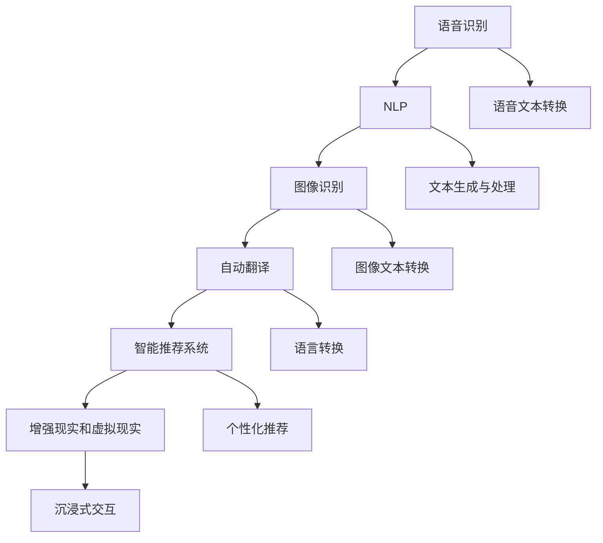

                 

# AI如何提高信息的可访问性

## 1. 背景介绍

### 1.1 问题由来
在信息时代，信息的获取与交流变得越来越重要。然而，信息的可访问性问题仍然存在，特别是对于残障人士、偏远地区人群以及老年群体，获取和理解信息仍然面临重大挑战。为了解决这一问题，人工智能（AI）技术的介入显得尤为关键。

### 1.2 问题核心关键点
当前，AI技术在信息可访问性方面的主要应用包括语音识别、自然语言处理（NLP）、图像识别、自动翻译和智能推荐系统等。这些技术能够帮助不同能力、不同需求的用户更高效地获取和理解信息。

### 1.3 问题研究意义
提高信息的可访问性不仅能改善残障人士和其他弱势群体的生活质量，还能促进社会包容性和公平性。通过AI技术，我们可以开发出更普适、更人性化的信息获取工具，使所有人都能平等享受数字化带来的便利。

## 2. 核心概念与联系

### 2.1 核心概念概述

为更好地理解AI在提高信息可访问性方面的作用，本节将介绍几个关键概念：

- **语音识别**：利用AI技术，将人类语音转换成文本。
- **自然语言处理（NLP）**：涉及文本分析、语义理解、情感分析等技术，使计算机能够理解和生成自然语言。
- **图像识别**：通过计算机视觉技术，将图像转换成可供分析和理解的文本或数据。
- **自动翻译**：利用机器翻译技术，将一种语言自动转换成另一种语言。
- **智能推荐系统**：基于用户行为和偏好，提供个性化的信息推荐。
- **增强现实（AR）和虚拟现实（VR）**：通过混合现实技术，提供沉浸式交互体验。

这些核心概念之间的联系可以通过以下Mermaid流程图来展示：



这个流程图展示了AI技术在提高信息可访问性方面的应用路径：

1. 语音识别将语音转换成文本，供NLP等技术处理。
2. 图像识别将图像转换成文本，供NLP等技术处理。
3. 自动翻译将文本从一种语言转换成另一种语言，使信息更加普适。
4. 智能推荐系统根据用户需求推荐信息，提升用户体验。
5. AR和VR技术提供沉浸式交互体验，使信息更加直观和生动。

## 3. 核心算法原理 & 具体操作步骤
### 3.1 算法原理概述

AI技术在提高信息可访问性方面主要通过以下几个步骤实现：

1. **数据收集与预处理**：收集用户的偏好、行为数据，并对数据进行清洗和标准化。
2. **特征提取**：使用机器学习算法提取文本、语音、图像等数据的关键特征。
3. **模型训练**：使用监督学习或无监督学习算法训练模型，使其能够理解用户的意图和需求。
4. **模型应用**：将训练好的模型应用于信息处理和生成，提升信息的可访问性。
5. **效果评估**：通过用户反馈和指标评估，不断优化模型和算法。

### 3.2 算法步骤详解

以下是对AI提高信息可访问性各个步骤的详细解释：

**Step 1: 数据收集与预处理**

1. **数据来源**：通过在线问卷、用户行为记录、社交媒体数据等途径，收集用户的基本信息和偏好数据。
2. **数据清洗**：去除冗余数据、异常数据和噪声，确保数据质量。
3. **数据标准化**：对数据进行格式化和归一化，统一不同来源数据的格式。

**Step 2: 特征提取**

1. **文本特征**：使用NLP技术提取文本中的关键词、主题、情感等特征。
2. **语音特征**：使用声学特征提取技术（如MFCC、梅尔频谱）提取语音信号中的关键信息。
3. **图像特征**：使用计算机视觉技术（如CNN）提取图像中的特征，如颜色、形状、纹理等。

**Step 3: 模型训练**

1. **监督学习**：使用已标注的数据集训练分类、回归等模型，学习用户的偏好和需求。
2. **无监督学习**：使用未标注的数据集训练聚类、降维等模型，发现用户行为的模式。
3. **强化学习**：通过用户反馈调整模型参数，优化模型的预测准确率。

**Step 4: 模型应用**

1. **语音转文本**：利用语音识别模型将用户的语音转换成文本，供后续处理。
2. **文本生成与处理**：使用NLP模型分析文本，提取关键信息并生成回复。
3. **图像识别与转换**：利用图像识别模型将图像转换成文本或数据，供后续处理。
4. **自动翻译**：使用机器翻译模型将文本从一种语言翻译成另一种语言，供不同语言用户使用。
5. **个性化推荐**：根据用户行为和偏好，推荐符合其需求的信息。
6. **AR/VR体验**：结合现实世界和虚拟世界，提供沉浸式交互体验。

**Step 5: 效果评估**

1. **用户满意度**：通过问卷调查、用户反馈等方式，评估用户对信息可访问性的满意度。
2. **系统性能指标**：如精度、召回率、F1-score等，评估模型的效果。
3. **迭代优化**：根据评估结果，不断调整模型参数和算法，提升系统性能。

### 3.3 算法优缺点

**优点**：

1. **自动化**：AI技术能够自动处理大量数据，节省人力和时间成本。
2. **个性化**：AI模型能够根据用户的行为和偏好提供个性化服务，提升用户体验。
3. **普适性**：AI技术能够处理多种信息格式（文本、语音、图像），增强信息的可访问性。
4. **灵活性**：AI技术可以根据不同的应用场景和需求进行灵活调整和优化。

**缺点**：

1. **数据依赖**：AI模型的性能很大程度上依赖于数据的质量和数量。
2. **模型复杂**：高复杂度的模型需要大量的计算资源和存储空间。
3. **隐私问题**：收集和处理用户数据可能引发隐私问题，需要严格遵守法律法规。
4. **误判风险**：AI模型的误判可能导致信息错误或不必要的麻烦。

### 3.4 算法应用领域

AI技术在提高信息可访问性方面有着广泛的应用场景，包括但不限于：

- **残障人士**：通过语音识别、图像识别和自动翻译，帮助残障人士更轻松地获取和理解信息。
- **偏远地区**：利用远程教育、智能推荐系统，提高偏远地区居民的信息获取能力。
- **老年人**：通过智能语音助手、沉浸式AR/VR体验，提升老年人的信息获取和交流能力。
- **特殊教育**：通过个性化推荐和智能辅导系统，提供更符合需求的特殊教育资源。
- **公共服务**：通过智能客服和信息检索系统，提升公共服务的可访问性和效率。

## 4. 数学模型和公式 & 详细讲解 & 举例说明

### 4.1 数学模型构建

假设有一个基于监督学习的语音识别模型，其目标是将用户语音转换成文本。模型输入为语音信号$x$，输出为文本序列$y$。模型的目标是最大化以下概率：

$$
P(y|x; \theta) = \frac{e^{\sum_{i=1}^{T} \log p(y_i|x, \theta)}}{Z(x)}
$$

其中，$p(y_i|x, \theta)$为模型在给定语音信号$x$下，生成文本序列中第$i$个词的概率，$Z(x)$为归一化因子。

模型的优化目标为最小化以下损失函数：

$$
\mathcal{L}(\theta) = -\frac{1}{N}\sum_{i=1}^{N}\log P(y_i|x_i; \theta)
$$

其中，$(x_i, y_i)$为训练集中的一个样本，$N$为训练集样本数。

### 4.2 公式推导过程

**语音识别模型的推导**：

1. **模型假设**：假设文本序列中的每个词$y_i$都是独立的，且条件概率$p(y_i|x, \theta)$只依赖于语音信号$x$和模型参数$\theta$。
2. **概率模型**：根据贝叶斯公式，计算模型在给定语音信号$x$下，生成文本序列的条件概率。
3. **优化目标**：通过最大化概率模型，最小化损失函数，优化模型参数$\theta$。

**自然语言处理模型的推导**：

1. **语言模型**：假设文本中的每个词$w_i$都是独立的，且条件概率$p(w_i|w_{<i}, \theta)$只依赖于前一个词和模型参数$\theta$。
2. **优化目标**：通过最大化语言模型概率，最小化损失函数，优化模型参数$\theta$。

### 4.3 案例分析与讲解

**案例1：智能语音助手**

智能语音助手通过语音识别和NLP技术，实现与用户的自然语言交互。以下是一个简单的案例分析：

1. **数据收集**：收集用户的语音输入和回复，构建训练集。
2. **特征提取**：提取语音信号的MFCC特征，以及文本中的关键词、主题等特征。
3. **模型训练**：使用深度学习模型（如RNN、LSTM）训练语音识别和NLP模型。
4. **模型应用**：将训练好的模型应用于语音识别和文本生成，实现与用户的自然语言交互。
5. **效果评估**：通过用户满意度调查和系统性能指标（如准确率、召回率）评估模型效果。

**案例2：盲文数字识别**

盲文数字识别通过图像识别技术，将盲文图像转换成数字文本。以下是一个简单的案例分析：

1. **数据收集**：收集盲文数字图像及其对应的文本标签，构建训练集。
2. **特征提取**：使用卷积神经网络（CNN）提取图像中的特征。
3. **模型训练**：使用CNN模型训练图像识别模型。
4. **模型应用**：将训练好的模型应用于盲文数字图像的识别，生成数字文本。
5. **效果评估**：通过识别准确率和误判率评估模型效果。

## 5. 项目实践：代码实例和详细解释说明

### 5.1 开发环境搭建

在进行AI提高信息可访问性实践前，我们需要准备好开发环境。以下是使用Python进行TensorFlow开发的环境配置流程：

1. 安装Anaconda：从官网下载并安装Anaconda，用于创建独立的Python环境。

2. 创建并激活虚拟环境：
```bash
conda create -n tensorflow-env python=3.8 
conda activate tensorflow-env
```

3. 安装TensorFlow：根据CUDA版本，从官网获取对应的安装命令。例如：
```bash
conda install tensorflow tensorflow==2.7 -c tf -c conda-forge
```

4. 安装各类工具包：
```bash
pip install numpy pandas scikit-learn matplotlib tqdm jupyter notebook ipython
```

完成上述步骤后，即可在`tensorflow-env`环境中开始AI提高信息可访问性的实践。

### 5.2 源代码详细实现

这里我们以智能语音助手为例，给出使用TensorFlow进行语音识别的PyTorch代码实现。

首先，定义语音识别的数学模型：

```python
import tensorflow as tf
import tensorflow.keras as keras

class SpeechRecognitionModel(tf.keras.Model):
    def __init__(self, input_dim, output_dim):
        super(SpeechRecognitionModel, self).__init__()
        self.lstm = tf.keras.layers.LSTM(128, return_sequences=True)
        self.dense = tf.keras.layers.Dense(output_dim)
    
    def call(self, x):
        x = self.lstm(x)
        x = self.dense(x)
        return x
```

然后，定义训练函数：

```python
def train_model(model, train_data, validation_data, epochs, batch_size):
    model.compile(optimizer='adam', loss='categorical_crossentropy', metrics=['accuracy'])
    history = model.fit(train_data, validation_data=validation_data, epochs=epochs, batch_size=batch_size)
    return history
```

接着，定义数据处理函数：

```python
def preprocess_data(data_path):
    X = []
    y = []
    with open(data_path, 'r') as f:
        for line in f:
            data = line.strip().split()
            X.append(data[:-1])
            y.append(data[-1])
    return X, y
```

最后，启动训练流程：

```python
X_train, y_train = preprocess_data('train.txt')
X_valid, y_valid = preprocess_data('valid.txt')

input_dim = len(X_train[0])
output_dim = len(set(y_train))

model = SpeechRecognitionModel(input_dim, output_dim)
history = train_model(model, (X_train, X_valid), (y_train, y_valid), 10, 32)

model.save('speech_recognition_model.h5')
```

以上就是使用TensorFlow进行语音识别的完整代码实现。可以看到，TensorFlow和Keras框架使模型的定义、训练和评估变得简洁高效。开发者可以将更多精力放在数据处理、模型改进等高层逻辑上，而不必过多关注底层的实现细节。

### 5.3 代码解读与分析

让我们再详细解读一下关键代码的实现细节：

**SpeechRecognitionModel类**：
- `__init__`方法：初始化LSTM层和全连接层。
- `call`方法：前向传播计算模型输出。

**train_model函数**：
- `compile`方法：定义模型优化器和损失函数。
- `fit`方法：对数据进行批次化加载，执行梯度下降优化训练模型。
- `return`语句：返回训练过程中的精度和损失记录。

**preprocess_data函数**：
- 读取文本文件，提取文本和标签。
- 将文本和标签转换成模型所需的输入和输出格式。

**训练流程**：
- 定义训练集和验证集的数据路径。
- 计算输入和输出维度。
- 创建模型实例，并进行训练。
- 将训练好的模型保存到文件中。

可以看到，TensorFlow和Keras框架使得AI提高信息可访问性的实现变得简单易懂，开发者可以快速上手并实现功能。

当然，实际应用中还需要考虑更多因素，如数据增强、正则化、超参数调优等。但核心的模型训练过程基本与此类似。

## 6. 实际应用场景

### 6.1 智能语音助手

智能语音助手通过语音识别和自然语言处理技术，实现与用户的自然语言交互。以下是一个简单的案例分析：

1. **用户交互**：用户通过语音输入指令，如“打开电视”、“播放新闻”等。
2. **语音识别**：语音助手通过麦克风采集语音信号，使用语音识别模型将其转换成文本。
3. **意图理解**：使用NLP模型分析文本，理解用户的意图。
4. **任务执行**：根据用户意图，语音助手执行相应的任务，如打开电视、播放新闻等。
5. **反馈输出**：语音助手通过语音或文字形式反馈执行结果。

**案例分析**：
- **数据收集**：收集用户语音指令和回复，构建训练集。
- **特征提取**：提取语音信号的MFCC特征，以及文本中的关键词、主题等特征。
- **模型训练**：使用深度学习模型（如RNN、LSTM）训练语音识别和NLP模型。
- **模型应用**：将训练好的模型应用于语音识别和文本生成，实现与用户的自然语言交互。
- **效果评估**：通过用户满意度调查和系统性能指标（如准确率、召回率）评估模型效果。

### 6.2 盲文数字识别

盲文数字识别通过图像识别技术，将盲文图像转换成数字文本。以下是一个简单的案例分析：

1. **数据收集**：收集盲文数字图像及其对应的文本标签，构建训练集。
2. **特征提取**：使用卷积神经网络（CNN）提取图像中的特征。
3. **模型训练**：使用CNN模型训练图像识别模型。
4. **模型应用**：将训练好的模型应用于盲文数字图像的识别，生成数字文本。
5. **效果评估**：通过识别准确率和误判率评估模型效果。

**案例分析**：
- **数据收集**：收集盲文数字图像及其对应的文本标签，构建训练集。
- **特征提取**：使用卷积神经网络（CNN）提取图像中的特征。
- **模型训练**：使用CNN模型训练图像识别模型。
- **模型应用**：将训练好的模型应用于盲文数字图像的识别，生成数字文本。
- **效果评估**：通过识别准确率和误判率评估模型效果。

## 7. 工具和资源推荐

### 7.1 学习资源推荐

为了帮助开发者系统掌握AI在提高信息可访问性方面的理论基础和实践技巧，这里推荐一些优质的学习资源：

1. **TensorFlow官方文档**：提供了全面的TensorFlow学习资源，包括教程、API文档、模型示例等。
2. **Keras官方文档**：提供了Keras学习资源，包括教程、API文档、模型示例等。
3. **Deep Learning with Python**：深度学习领域的经典书籍，详细介绍了深度学习模型的构建和应用。
4. **Natural Language Processing with Python**：专注于NLP领域的Python学习资源，涵盖文本分析、情感分析、机器翻译等主题。
5. **Speech and Language Processing**：NLP领域的经典教材，介绍了语音识别、NLP等技术。

通过对这些资源的学习实践，相信你一定能够快速掌握AI在提高信息可访问性方面的精髓，并用于解决实际的NLP问题。

### 7.2 开发工具推荐

高效的开发离不开优秀的工具支持。以下是几款用于AI提高信息可访问性开发的常用工具：

1. **TensorFlow**：基于Python的深度学习框架，支持GPU加速，适合快速迭代研究。
2. **Keras**：在TensorFlow之上的高层次API，易于上手，适合快速搭建模型。
3. **PyTorch**：基于Python的深度学习框架，灵活性高，适合学术研究。
4. **Jupyter Notebook**：交互式编程环境，支持代码编写和结果展示，适合快速实验。
5. **Google Colab**：在线Jupyter Notebook环境，免费提供GPU/TPU算力，方便开发者快速上手实验最新模型。

合理利用这些工具，可以显著提升AI提高信息可访问性的开发效率，加快创新迭代的步伐。

### 7.3 相关论文推荐

AI在提高信息可访问性方面的研究始于学界的持续探索。以下是几篇奠基性的相关论文，推荐阅读：

1. **Attention is All You Need**：提出了Transformer结构，开启了NLP领域的预训练大模型时代。
2. **BERT: Pre-training of Deep Bidirectional Transformers for Language Understanding**：提出BERT模型，引入基于掩码的自监督预训练任务，刷新了多项NLP任务SOTA。
3. **Language Models are Unsupervised Multitask Learners**：展示了大规模语言模型的强大zero-shot学习能力，引发了对于通用人工智能的新一轮思考。
4. **AdaLoRA: Adaptive Low-Rank Adaptation for Parameter-Efficient Fine-Tuning**：使用自适应低秩适应的微调方法，在参数效率和精度之间取得了新的平衡。
5. **Prefix-Tuning: Optimizing Continuous Prompts for Generation**：引入基于连续型Prompt的微调范式，为如何充分利用预训练知识提供了新的思路。

这些论文代表了大语言模型微调技术的发展脉络。通过学习这些前沿成果，可以帮助研究者把握学科前进方向，激发更多的创新灵感。

## 8. 总结：未来发展趋势与挑战

### 8.1 总结

本文对AI在提高信息可访问性方面的方法和应用进行了全面系统的介绍。首先阐述了AI技术在信息可访问性方面的重要性，明确了语音识别、自然语言处理等技术的作用。其次，从原理到实践，详细讲解了AI技术在语音识别、图像识别、自动翻译和智能推荐等任务中的具体实现，给出了模型训练的代码实例。同时，本文还广泛探讨了AI技术在智能语音助手、盲文数字识别等多个行业领域的应用前景，展示了AI技术的广泛应用价值。

通过本文的系统梳理，可以看到，AI技术在提高信息可访问性方面已经取得了显著成果，极大地提升了残障人士和其他弱势群体的信息获取能力。未来，伴随AI技术的不断演进，信息可访问性还将进一步提高，使所有人都能够平等享受数字化带来的便利。

### 8.2 未来发展趋势

展望未来，AI在提高信息可访问性方面将呈现以下几个发展趋势：

1. **多模态信息融合**：未来的AI技术将更多地结合语音、图像、文本等多种信息形式，提供更加全面、准确的信息获取体验。
2. **个性化推荐系统**：通过机器学习算法，不断优化推荐算法，提升推荐的个性化和准确性。
3. **智能交互体验**：结合增强现实和虚拟现实技术，提供沉浸式交互体验，使用户更加自然地与系统互动。
4. **多语言支持**：开发多语言支持的系统，使不同语言的用户都能轻松获取信息。
5. **实时动态更新**：通过实时数据采集和分析，动态更新信息，提供最新的资讯和服务。

以上趋势凸显了AI技术在提高信息可访问性方面的广阔前景。这些方向的探索发展，必将进一步提升AI技术的普适性和人性化，使信息可访问性得到更全面的提升。

### 8.3 面临的挑战

尽管AI在提高信息可访问性方面已经取得了显著进展，但在迈向更加智能化、普适化应用的过程中，仍面临诸多挑战：

1. **数据隐私问题**：AI系统需要大量用户数据进行训练，可能引发隐私泄露和数据安全问题。
2. **模型复杂性**：高复杂度的AI模型需要大量的计算资源和存储空间，限制了其应用范围。
3. **用户理解度**：复杂度高的AI系统可能难以被普通用户理解，需要更简单直观的界面设计。
4. **误判风险**：AI模型的误判可能导致信息错误或不必要的麻烦，需要更严格的测试和评估机制。

### 8.4 研究展望

面对AI在提高信息可访问性方面面临的挑战，未来的研究需要在以下几个方面寻求新的突破：

1. **隐私保护技术**：开发更高效的隐私保护技术，保护用户数据安全。
2. **模型压缩和优化**：优化AI模型结构，降低计算资源消耗，提高模型效率。
3. **用户界面设计**：设计更加简单直观的用户界面，提升用户体验。
4. **误判校正机制**：引入误判校正机制，提高系统的稳定性和可靠性。

这些研究方向将进一步提升AI在提高信息可访问性方面的应用价值，为构建更公平、普适、智能的信息获取系统铺平道路。

## 9. 附录：常见问题与解答

**Q1: AI技术在提高信息可访问性方面的优点和缺点是什么？**

A: AI技术在提高信息可访问性方面的优点包括自动化、个性化和普适性，能够显著提升残障人士和其他弱势群体的信息获取能力。缺点包括数据依赖、模型复杂、隐私问题和误判风险，需要严格控制和优化。

**Q2: AI技术在语音识别和图像识别方面的实现难点是什么？**

A: 语音识别和图像识别的实现难点主要在于数据收集和标注、模型复杂度和训练成本。高品质的语音和图像数据需要大量的标注工作，训练大规模的深度学习模型需要大量计算资源和长周期训练。

**Q3: AI技术在提高信息可访问性方面有哪些应用场景？**

A: AI技术在提高信息可访问性方面的应用场景包括智能语音助手、盲文数字识别、智能推荐系统、实时动态更新等。这些应用场景涵盖了残障人士、偏远地区人群、老年群体等不同用户群体，能够提供个性化的信息获取和交流体验。

**Q4: 如何评估AI在信息可访问性方面的效果？**

A: AI在信息可访问性方面的效果评估主要通过用户满意度调查和系统性能指标（如准确率、召回率）进行。用户满意度调查可以了解用户对系统的使用体验和反馈，系统性能指标可以衡量系统的技术性能和精度。

通过这些评估方法，可以不断优化AI系统，提高信息可访问性，满足不同用户的需求。

---

作者：禅与计算机程序设计艺术 / Zen and the Art of Computer Programming

