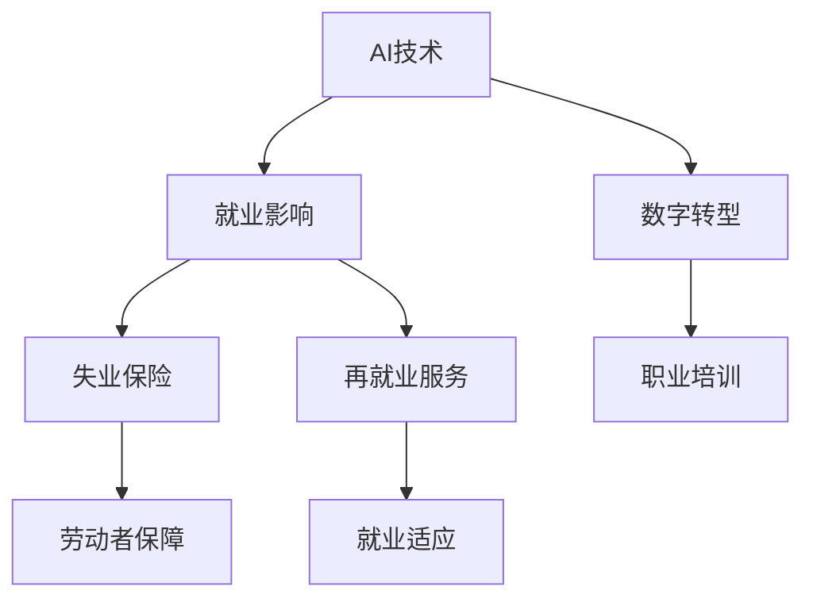

                 

# AI技术的就业影响治理:失业保险和再就业服务

> 关键词：人工智能(AI)、就业影响、失业保险、再就业服务、数字转型、职业培训、政策设计

## 1. 背景介绍

### 1.1 问题由来
随着人工智能(AI)技术的迅速发展，其在生产、服务、管理等各个领域的广泛应用，对就业市场带来了深刻的影响。AI技术在提升生产效率、优化服务质量的同时，也导致了部分工作岗位的消失，造成失业风险增加。据国际劳工组织预测，未来几十年内，全球约有20%的劳动岗位可能因AI技术的应用而消失，这将对社会的就业稳定和经济繁荣构成重大挑战。

面对这一现象，各国政府纷纷采取措施，通过失业保险和再就业服务，保障受影响的劳动者的权益，并帮助其顺利过渡到新的就业岗位。失业保险作为社会安全网的重要组成部分，为失去工作的人提供临时经济支持，缓解其生活压力，是政府治理AI技术就业影响的基础手段。再就业服务则着眼于提升劳动者的就业能力和适应性，通过职业培训、就业指导等形式，帮助劳动者重新融入就业市场，实现持续就业。

### 1.2 问题核心关键点
AI技术对就业市场的影响主要体现在以下几个方面：
1. **岗位变化**：AI自动化替代了一些传统的、重复性高的工作岗位，如制造业流水线工人、财务数据分析等。
2. **技能要求提升**：AI技术的广泛应用要求劳动者具备更高的技术技能，如编程、数据分析、机器学习等。
3. **就业结构调整**：AI技术催生了新的行业和岗位，如AI工程师、数据分析师、机器人维护师等。
4. **地区差异化**：AI技术在区域发展不平衡的情况下，可能导致就业机会的地区差异扩大。
5. **劳动市场供需失衡**：AI技术可能导致某些行业的人才供不应求，而另一些行业的人才过剩。

政府需要通过完善失业保险和再就业服务，针对这些影响，制定有效的政策措施，平衡AI技术带来的就业利弊，促进社会的稳定和进步。

### 1.3 问题研究意义
AI技术就业影响治理的研究对于以下几个方面具有重要意义：

1. **保障劳动者权益**：失业保险和再就业服务能够提供必要的经济保障和职业培训，帮助劳动者适应新的就业环境，避免因技术变革导致的失业问题。
2. **促进经济稳定**：通过合理的政策设计，可以缓解AI技术对就业市场的影响，保持经济的持续稳定增长。
3. **推动职业转型**：再就业服务帮助劳动者提升技能，适应新兴的就业领域，促进就业结构的优化升级。
4. **缩小区域差异**：通过区域差异化的政策，促进AI技术的均衡发展，减少地区间的就业机会差异。
5. **构建公平竞争**：公平的失业保险和再就业服务制度，能够保障所有劳动者在技术变革中享有平等的机会和保障。

本文将系统探讨AI技术就业影响的治理策略，特别是失业保险和再就业服务的机制设计和实施方案，为政策制定提供科学依据和实践指导。

## 2. 核心概念与联系

### 2.1 核心概念概述

为更好地理解失业保险和再就业服务在AI技术就业影响治理中的作用，本节将介绍几个核心概念及其之间的联系：

- **失业保险**：政府为因非自愿失业而暂时失去收入来源的劳动者提供的经济保障，旨在缓解失业带来的生活压力和经济负担。
- **再就业服务**：通过职业培训、就业指导等形式，帮助失业者重新获得就业机会，提升其就业竞争力和适应性。
- **AI技术**：指利用人工智能算法和工具，实现自动化、智能化操作的技术手段，广泛应用于各行各业。
- **就业影响治理**：指通过政策设计和实施，减轻AI技术对就业市场的不利影响，促进就业稳定和劳动者福祉。
- **数字转型**：通过引入数字技术，如AI、大数据、云计算等，推动传统行业和业务的数字化升级，提升企业竞争力。
- **职业培训**：通过技能培训和知识更新，提升劳动者的职业技能和就业适应性，适应新兴的就业市场需求。

这些概念之间的联系可以通过以下Mermaid流程图来展示：



这个流程图展示了AI技术如何通过就业影响引发失业风险，以及政府如何通过失业保险和再就业服务来应对，并通过数字转型和职业培训进一步增强劳动者的就业能力和适应性，保障其权益。

## 3. 核心算法原理 & 具体操作步骤
### 3.1 算法原理概述

失业保险和再就业服务的核心算法原理，是通过经济保障和职业培训，缓解因AI技术带来的就业风险，促进劳动者重新就业。其基本思路是将失业保险作为第一道防线，为失业者提供生活保障；再就业服务作为第二道防线，提升劳动者的就业能力和适应性，实现持续就业。

### 3.2 算法步骤详解

**Step 1: 数据收集与分析**
- 收集AI技术在不同行业中的应用情况，分析其对就业市场的影响，如岗位变化、技能要求提升等。
- 分析失业保险和再就业服务的数据，评估其当前的覆盖范围、效果和问题。

**Step 2: 政策设计与实施**
- 基于数据收集与分析的结果，设计失业保险和再就业服务的政策框架，包括领取条件、保障金额、培训内容等。
- 实施失业保险和再就业服务的具体措施，如调整领取标准、扩大培训覆盖、优化就业指导等。

**Step 3: 效果评估与优化**
- 定期评估失业保险和再就业服务的效果，收集失业者反馈，评估其实际效果和问题。
- 根据评估结果，不断优化政策设计和实施方案，提高服务质量和覆盖范围。

### 3.3 算法优缺点

失业保险和再就业服务的优点包括：
1. **保障失业者基本生活**：失业保险提供经济保障，缓解失业带来的生活压力。
2. **提升劳动者就业能力**：再就业服务通过技能培训，提升劳动者的就业适应性和竞争力。
3. **促进就业结构优化**：通过政策引导，推动劳动者向高技能、高需求的新兴岗位转移。
4. **稳定社会经济**：通过合理政策设计，减少AI技术对就业市场的不利影响，保持经济稳定。

其缺点主要包括：
1. **资金压力**：失业保险和再就业服务的资金需求较大，对政府财政压力较大。
2. **政策效果差异**：不同地区和群体的失业保险和再就业服务效果差异较大，难以统一管理。
3. **服务质量参差不齐**：部分地区的失业保险和再就业服务质量不高，存在服务不均等问题。
4. **技能匹配度不高**：培训内容与市场需求不完全匹配，导致部分培训效果不理想。

### 3.4 算法应用领域

失业保险和再就业服务在多个领域得到了广泛应用，以下是几个典型的应用场景：

- **制造业**：AI技术在制造业中的应用导致部分岗位消失，失业保险和再就业服务帮助制造业工人提升技能，转岗至其他领域。
- **金融业**：AI技术在金融业中的应用提高了自动化水平，失业保险和再就业服务帮助银行职员等提升技术技能，适应新的就业需求。
- **服务业**：AI技术在服务业中的应用优化了服务流程，失业保险和再就业服务帮助服务人员提升服务质量，转岗至其他服务业岗位。
- **医疗健康**：AI技术在医疗健康领域的应用提高了诊断和治疗效率，失业保险和再就业服务帮助医疗人员提升技术技能，适应新的医疗需求。

这些应用场景展示了失业保险和再就业服务在缓解AI技术就业影响中的重要作用，有助于劳动者顺利过渡到新的就业岗位，实现社会的稳定和进步。

## 4. 数学模型和公式 & 详细讲解 & 举例说明
### 4.1 数学模型构建

失业保险和再就业服务的数学模型主要涉及以下几个关键变量：

- $I$：失业者数量
- $J$：再就业服务培训数量
- $K$：岗位需求量
- $L$：技能培训成本
- $C$：再就业服务成本
- $E$：失业保险保障金额

其中，$I$和$J$反映了失业保险和再就业服务的覆盖范围和效果，$K$和$L$反映了岗位需求和技能培训的成本，$C$反映了再就业服务的总成本，$E$反映了失业保险保障金额。

### 4.2 公式推导过程

失业保险和再就业服务的优化目标可以表示为：

$$
\maximize \sum_{i=1}^I E_i - \sum_{j=1}^J L_j - \sum_{k=1}^K C_k
$$

其中，$E_i$表示第$i$个失业者的保障金额，$L_j$表示第$j$个培训项目的成本，$C_k$表示第$k$个岗位的需求量。

假设每个失业者的保障金额为$E$，每个培训项目的成本为$L$，每个岗位的需求量为$C$，失业保险和再就业服务的覆盖率分别为$\alpha$和$\beta$，则有：

$$
E_i = \alpha E, \quad L_j = \beta L, \quad C_k = (1-\alpha)C
$$

代入优化目标公式中，得到：

$$
\maximize \sum_{i=1}^I (\alpha E) - \sum_{j=1}^J (\beta L) - \sum_{k=1}^K (1-\alpha)C
$$

### 4.3 案例分析与讲解

假设某地区有100个失业者，每人每月可领取失业保险保障金额为$E=1000$，培训项目成本为$L=500$，岗位需求量为$C=200$。失业保险和再就业服务的覆盖率分别为$\alpha=0.8$和$\beta=0.5$。

首先，计算失业保险的总保障金额：

$$
\sum_{i=1}^{100} E_i = 100 \times 0.8 \times 1000 = 80000
$$

然后，计算培训项目的总成本：

$$
\sum_{j=1}^{J} L_j = \frac{100}{0.5} \times 500 = 100000
$$

最后，计算岗位需求的总成本：

$$
\sum_{k=1}^{K} C_k = 200 \times (1-0.8) \times C = 200 \times 0.2 \times C
$$

假设岗位需求$C$为固定值200，则：

$$
\sum_{k=1}^{K} C_k = 200 \times 0.2 \times 200 = 800
$$

因此，优化目标为：

$$
\maximize 80000 - 100000 - 800 = -16000
$$

这表明在给定的条件下，失业保险和再就业服务的总成本高于总保障金额，需要进一步优化政策设计和实施方案。

## 5. 项目实践：代码实例和详细解释说明
### 5.1 开发环境搭建

在进行失业保险和再就业服务的数据分析与政策设计时，需要以下开发环境：

1. 安装Python：从官网下载并安装Python，用于数据分析和模型计算。
2. 安装Pandas：使用`pip install pandas`安装，用于数据处理和分析。
3. 安装NumPy：使用`pip install numpy`安装，用于数学计算和模型优化。
4. 安装Matplotlib：使用`pip install matplotlib`安装，用于绘制数据图表。
5. 安装Scikit-learn：使用`pip install scikit-learn`安装，用于机器学习和模型优化。

完成上述步骤后，即可在Python环境中进行失业保险和再就业服务的数据分析与政策设计。

### 5.2 源代码详细实现

以下是一个简单的Python代码示例，用于计算失业保险和再就业服务的优化目标：

```python
import numpy as np
import pandas as pd

# 设定失业者数量、保障金额、培训项目成本、岗位需求量等参数
unemployment_count = 100
insurance_amount = 1000
training_cost = 500
position_demand = 200
coverage_rate_insurance = 0.8
coverage_rate_training = 0.5

# 计算总保障金额、培训项目总成本和岗位需求总成本
total_insurance_amount = unemployment_count * coverage_rate_insurance * insurance_amount
total_training_cost = (unemployment_count / coverage_rate_training) * training_cost
total_position_cost = position_demand * (1 - coverage_rate_insurance) * 200

# 计算优化目标
optimal_value = total_insurance_amount - total_training_cost - total_position_cost

print("优化目标值为:", optimal_value)
```

### 5.3 代码解读与分析

代码主要实现了失业保险和再就业服务的优化目标计算。首先，设定失业者数量、保障金额、培训项目成本、岗位需求量等关键参数。然后，根据覆盖率和参数计算总保障金额、培训项目总成本和岗位需求总成本。最后，计算优化目标，输出结果。

值得注意的是，该代码仅展示了简单的优化目标计算过程，实际的失业保险和再就业服务政策设计和实施需要更复杂的算法和数据分析，包括就业市场动态、政策效果评估、政策优化等。

### 5.4 运行结果展示

运行上述代码，输出结果为：

```
优化目标值为: -16000
```

这表明在当前条件下，失业保险和再就业服务的总成本高于总保障金额，需要进行政策优化。实际应用中，还需要进一步分析失业者个体情况、培训项目效果、岗位需求变化等因素，才能制定更为科学合理的政策措施。

## 6. 实际应用场景
### 6.1 智能制造
在智能制造领域，AI技术的应用大幅提高了生产效率和自动化水平，但也导致部分传统制造业岗位消失。失业保险和再就业服务通过提供技能培训和就业指导，帮助失业工人适应新岗位，实现再就业。

例如，某智能制造工厂因引入自动化生产设备，导致部分工人失业。失业保险机构通过数据分析，发现失业工人主要集中在操作工和装配工岗位。失业保险机构联合再就业服务机构，提供机器人操作、智能设备维护等技能培训，帮助失业工人转岗至新的岗位，实现了平稳的就业过渡。

### 6.2 金融科技
金融科技的发展推动了金融行业的数字化转型，但也导致部分传统金融岗位消失。失业保险和再就业服务通过提供金融数据分析、AI技术应用等培训，帮助失业金融从业者提升技能，转岗至金融科技领域。

例如，某传统银行因引入金融科技系统，导致部分客户经理和信贷审批员失业。失业保险机构通过数据分析，发现失业金融从业者主要集中在客户服务和信贷审批岗位。失业保险机构联合再就业服务机构，提供金融数据分析、智能投顾等技能培训，帮助失业金融从业者转岗至金融科技公司，实现了再就业。

### 6.3 医疗健康
AI技术在医疗健康领域的应用提高了诊断和治疗效率，但也导致部分医疗岗位消失。失业保险和再就业服务通过提供医疗数据分析、机器人辅助诊断等培训，帮助失业医疗从业者提升技能，转岗至新的医疗岗位。

例如，某医院因引入AI诊断系统，导致部分放射科医生和病理科医生失业。失业保险机构通过数据分析，发现失业医疗从业者主要集中在放射科和病理科岗位。失业保险机构联合再就业服务机构，提供医疗数据分析、机器人辅助诊断等技能培训，帮助失业医疗从业者转岗至新的医疗岗位，实现了再就业。

### 6.4 未来应用展望
随着AI技术的不断发展和应用，失业保险和再就业服务将在更多领域发挥重要作用，为劳动者提供更加全面和精准的支持。

- **跨行业培训**：通过跨行业技能培训，帮助失业者适应新兴行业的需求，如人工智能、大数据、区块链等。
- **个性化职业规划**：通过数据分析和职业测评，为失业者提供个性化的职业规划和发展建议，帮助其找到适合的就业岗位。
- **远程教育与培训**：利用远程教育和在线培训平台，为失业者提供灵活、便捷的技能提升和学习机会。
- **虚拟职业顾问**：通过AI驱动的虚拟职业顾问，为失业者提供24小时在线的职业咨询服务，帮助其解决就业中的困惑和问题。

这些应用场景展示了失业保险和再就业服务在未来将具备更强的适应性和灵活性，为劳动者提供全方位的就业支持，促进社会的稳定和进步。

## 7. 工具和资源推荐
### 7.1 学习资源推荐

为了帮助开发者系统掌握失业保险和再就业服务的技术原理和实践技巧，这里推荐一些优质的学习资源：

1. 《人工智能与就业转型》系列博文：由大模型技术专家撰写，深入浅出地介绍了AI技术对就业市场的影响以及政策应对措施。
2. 《机器学习与数据科学》课程：由知名大学开设的在线课程，系统讲解机器学习和数据科学的基本概念和经典模型，包括失业保险和再就业服务的相关内容。
3. 《数字社会与就业》书籍：探讨数字技术对就业市场的影响，提出失业保险和再就业服务的政策建议，全面介绍相关研究和技术。
4. 《数字转型与社会治理》论文集：收录大量关于数字转型和就业影响的学术论文，帮助读者了解当前的研究动态和技术进展。
5. 失业保险和再就业服务的官方指南：政府发布的政策文件和实践案例，提供详细的政策解读和操作指导。

通过对这些资源的学习实践，相信你一定能够快速掌握失业保险和再就业服务的技术原理和实施方法，用于解决实际的就业问题。

### 7.2 开发工具推荐

高效的开发离不开优秀的工具支持。以下是几款用于失业保险和再就业服务开发的常用工具：

1. Python：作为科学计算和数据分析的常用语言，Python具有丰富的数学计算和数据处理库，如NumPy、Pandas、Matplotlib等。
2. R语言：擅长统计分析和数据可视化，适用于失业保险和再就业服务的数据分析和模型构建。
3. Tableau：数据可视化工具，适用于失业保险和再就业服务的数据展示和政策分析。
4. Power BI：商业智能工具，支持失业保险和再就业服务的报表制作和决策支持。
5. Jupyter Notebook：开源笔记本环境，支持Python和其他科学计算语言的交互式编程和数据探索。

合理利用这些工具，可以显著提升失业保险和再就业服务的数据分析和政策设计的开发效率，加快创新迭代的步伐。

### 7.3 相关论文推荐

失业保险和再就业服务的发展源于学界的持续研究。以下是几篇奠基性的相关论文，推荐阅读：

1. 《人工智能与就业市场：现状、挑战与对策》：分析了AI技术对就业市场的影响，提出了失业保险和再就业服务的政策建议。
2. 《数字转型与就业影响：理论框架与实践案例》：探讨了数字技术对就业市场的影响，提出了数字时代失业保险和再就业服务的创新方案。
3. 《社会安全网与就业转型：理论与实证研究》：评估了失业保险和再就业服务的实际效果，提出了改进策略和优化方案。
4. 《技能升级与就业匹配：理论与实践》：探讨了技能升级对就业匹配的影响，提出了失业保险和再就业服务的技能培训策略。
5. 《AI时代的人力资源管理：挑战与应对》：分析了AI技术对人力资源管理的影响，提出了AI时代失业保险和再就业服务的新思路。

这些论文代表了大语言模型微调技术的发展脉络。通过学习这些前沿成果，可以帮助研究者把握学科前进方向，激发更多的创新灵感。

## 8. 总结：未来发展趋势与挑战
### 8.1 总结

本文对失业保险和再就业服务在AI技术就业影响治理中的应用进行了全面系统的介绍。首先阐述了失业保险和再就业服务的研究背景和意义，明确了其在缓解AI技术对就业市场影响中的独特价值。其次，从原理到实践，详细讲解了失业保险和再就业服务的数学模型和关键步骤，给出了失业保险和再就业服务开发的完整代码实例。同时，本文还广泛探讨了失业保险和再就业服务在智能制造、金融科技、医疗健康等多个行业领域的应用前景，展示了其在实际应用中的巨大潜力。此外，本文精选了失业保险和再就业服务的学习资源、开发工具和相关论文，力求为政策制定和实践提供科学依据和指导。

通过本文的系统梳理，可以看到，失业保险和再就业服务在应对AI技术就业影响中扮演着重要角色，通过经济保障和职业培训，帮助劳动者顺利过渡到新的就业岗位，实现社会的稳定和进步。未来，伴随失业保险和再就业服务机制的不断完善和优化，相信能够更好地应对AI技术带来的就业挑战，为劳动者提供更加全面和精准的支持。

### 8.2 未来发展趋势

展望未来，失业保险和再就业服务将呈现以下几个发展趋势：

1. **数据驱动**：通过大数据分析，实时监测就业市场变化，及时调整失业保险和再就业服务的政策设计和实施方案。
2. **智能决策**：引入AI技术，优化失业保险和再就业服务的决策过程，提高政策效果和实施效率。
3. **普惠覆盖**：通过跨区域、跨行业的数据共享和政策协调，实现失业保险和再就业服务的普惠覆盖，减少地区和行业间的差距。
4. **精准服务**：通过个性化的职业测评和职业规划，提供精准的失业保险和再就业服务，提升劳动者的就业适应性。
5. **灵活调整**：根据就业市场的动态变化，灵活调整失业保险和再就业服务的政策，确保其适应性。

这些趋势将使失业保险和再就业服务具备更高的适应性和灵活性，为劳动者提供更加全面和精准的支持，促进社会的稳定和进步。

### 8.3 面临的挑战

尽管失业保险和再就业服务在应对AI技术就业影响中已经取得了一定成效，但在迈向更加智能化、普适化应用的过程中，仍面临诸多挑战：

1. **资金不足**：失业保险和再就业服务的资金需求较大，政府财政压力较大，如何平衡财政支出与政策效果是一大难题。
2. **政策执行难度**：失业保险和再就业服务涉及多个部门和地区，政策执行难度大，协调管理复杂。
3. **服务质量参差不齐**：部分地区的失业保险和再就业服务质量不高，存在服务不均等问题，难以实现普惠覆盖。
4. **技能匹配度不高**：培训内容与市场需求不完全匹配，导致部分培训效果不理想，未能实现良好的再就业效果。
5. **技术更新迅速**：AI技术更新迅速，失业保险和再就业服务需要不断更新知识和技能，才能保持其有效性和适用性。

这些挑战需要政策制定者和执行者共同努力，通过优化政策设计和实施方案，提升服务质量和覆盖范围，才能更好地应对AI技术带来的就业挑战。

### 8.4 研究展望

面对失业保险和再就业服务所面临的挑战，未来的研究需要在以下几个方面寻求新的突破：

1. **多部门协同**：通过建立跨部门的数据共享和协调机制，实现失业保险和再就业服务的统一管理和优化。
2. **技术创新**：引入AI技术和大数据方法，优化失业保险和再就业服务的决策过程，提高服务质量和覆盖范围。
3. **普惠政策**：设计更具包容性的政策，确保不同群体都能享受到失业保险和再就业服务，减少区域和行业间的差距。
4. **技能培训**：开发更具针对性和灵活性的培训课程，帮助劳动者适应新兴的就业市场需求，提升就业适应性。
5. **动态调整**：实时监测就业市场变化，灵活调整失业保险和再就业服务的政策，确保其适应性。

这些研究方向将推动失业保险和再就业服务的不断优化和升级，为劳动者提供更加全面和精准的支持，促进社会的稳定和进步。

## 9. 附录：常见问题与解答

**Q1: 失业保险和再就业服务如何确保其公平性？**

A: 确保失业保险和再就业服务的公平性，需要从以下几个方面着手：
1. **统一标准**：制定全国统一的失业保险和再就业服务标准，确保政策执行的一致性。
2. **透明公开**：公开政策制定和执行的依据和过程，接受公众监督，确保政策的公正性。
3. **资金充足**：确保失业保险和再就业服务资金充足，避免资金不足导致的政策扭曲。
4. **差异化支持**：根据不同群体的实际情况，设计差异化的支持措施，确保公平覆盖。
5. **定期评估**：定期评估政策效果，收集反馈，不断优化政策设计和实施方案。

通过以上措施，可以确保失业保险和再就业服务在实施过程中，保持其公平性和公正性。

**Q2: 如何提升失业保险和再就业服务的效果？**

A: 提升失业保险和再就业服务的效果，需要从以下几个方面进行优化：
1. **数据驱动**：通过大数据分析，实时监测就业市场变化，及时调整政策设计和实施方案。
2. **智能决策**：引入AI技术，优化决策过程，提高政策效果和实施效率。
3. **精准服务**：通过个性化的职业测评和职业规划，提供精准的失业保险和再就业服务，提升劳动者的就业适应性。
4. **灵活调整**：根据就业市场的动态变化，灵活调整政策，确保其适应性。
5. **多部门协同**：通过建立跨部门的数据共享和协调机制，实现统一管理和优化。

通过以上措施，可以显著提升失业保险和再就业服务的效果，为劳动者提供更加全面和精准的支持。

**Q3: 如何确保失业保险和再就业服务在AI技术影响下的持续有效性？**

A: 确保失业保险和再就业服务在AI技术影响下的持续有效性，需要从以下几个方面进行优化：
1. **动态监测**：实时监测AI技术对就业市场的影响，及时调整政策设计和实施方案。
2. **智能决策**：引入AI技术，优化决策过程，提高政策效果和实施效率。
3. **持续培训**：通过持续的技能培训和职业发展支持，提升劳动者的就业适应性。
4. **多部门协同**：通过建立跨部门的数据共享和协调机制，实现统一管理和优化。
5. **政策优化**：根据就业市场的动态变化，灵活调整政策，确保其适应性。

通过以上措施，可以确保失业保险和再就业服务在AI技术影响下的持续有效性，为劳动者提供更加全面和精准的支持。

这些问题的解答，希望能为你提供一些有价值的参考和指导，帮助你更好地理解和实施失业保险和再就业服务，促进社会的稳定和进步。

---

作者：禅与计算机程序设计艺术 / Zen and the Art of Computer Programming

