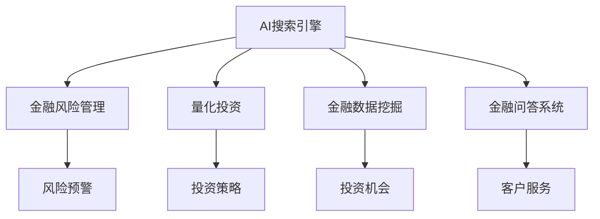

                 

# AI搜索引擎在金融领域的应用

> 关键词：AI搜索引擎, 金融风险管理, 量化投资, 金融数据挖掘, 金融问答系统

## 1. 背景介绍

### 1.1 问题由来
金融行业是一个高度竞争和瞬息万变的行业，面临着复杂多变的市场环境、海量的数据处理需求和精细的风险管理要求。随着金融科技的兴起，AI技术在金融领域的应用已经深入到业务决策、风险控制、客户服务等各个环节。AI搜索引擎作为AI技术的一个重要分支，其在金融领域的应用也引起了广泛关注。

### 1.2 问题核心关键点
AI搜索引擎在金融领域的应用，主要集中在以下几个方面：

- **数据检索**：帮助金融机构在海量金融数据中快速检索出相关信息，支持决策制定和风险管理。
- **实时监控**：通过实时监控金融市场和交易数据，预警市场风险和异常行为，辅助投资决策。
- **知识管理**：建立金融领域的知识图谱，辅助知识发现和决策支持。
- **客户服务**：构建智能问答系统，提供7x24小时客户服务，提升客户体验。
- **量化投资**：利用AI搜索引擎技术，对市场数据进行深入挖掘和分析，支持量化投资策略的构建和优化。

### 1.3 问题研究意义
AI搜索引擎在金融领域的应用，具有以下重要意义：

1. **提高决策效率**：帮助金融分析师在海量数据中快速定位关键信息，提升决策效率和准确性。
2. **增强风险管理**：通过实时监控和数据挖掘，及时发现市场异常和风险事件，保障金融稳定运行。
3. **优化客户服务**：提供智能问答系统，提升客户服务体验，增强客户黏性。
4. **促进创新发展**：推动金融科技创新，加速金融科技产业的数字化转型。
5. **应对监管挑战**：通过智能监管技术，提高金融监管的效率和公平性。

## 2. 核心概念与联系

### 2.1 核心概念概述

为了更好地理解AI搜索引擎在金融领域的应用，本节将介绍几个关键概念：

- **AI搜索引擎**：利用AI技术进行信息检索和处理，提供精准的信息获取和知识发现。
- **金融风险管理**：通过AI技术进行风险识别、评估和控制，保障金融系统的稳定运行。
- **量化投资**：利用AI技术对金融市场进行深度分析，构建基于数据的投资策略。
- **金融数据挖掘**：通过AI技术对金融数据进行挖掘和分析，发现潜在的投资机会和风险。
- **金融问答系统**：利用AI技术构建智能问答系统，提供即时的金融知识查询和互动服务。

这些概念之间的联系可以通过以下Mermaid流程图来展示：



这个流程图展示了AI搜索引擎与其他金融应用之间的相互联系：

1. AI搜索引擎提供了数据检索和知识管理能力，支持金融风险管理、量化投资和金融数据挖掘等任务。
2. 金融风险管理通过AI搜索引擎进行数据监控和风险预警。
3. 量化投资利用AI搜索引擎进行市场数据挖掘和策略优化。
4. 金融数据挖掘利用AI搜索引擎对海量金融数据进行分析和挖掘。
5. 金融问答系统通过AI搜索引擎提供金融知识的即时查询和互动服务。

## 3. 核心算法原理 & 具体操作步骤
### 3.1 算法原理概述

AI搜索引擎在金融领域的应用，核心在于利用AI技术进行信息检索和知识发现。其基本原理包括以下几个步骤：

1. **文本预处理**：将金融数据和知识进行文本化处理，去除噪音和无用信息，提取关键特征。
2. **索引构建**：构建索引库，将处理后的文本信息进行分词、建立倒排索引等操作。
3. **查询匹配**：根据用户输入的查询词，在索引库中进行匹配，筛选出最相关的结果。
4. **排序和筛选**：对搜索结果进行排序和筛选，优先展示最相关、最实用的信息。

这些步骤的实现需要依赖于自然语言处理（NLP）、信息检索（IR）等领域的算法和技术。

### 3.2 算法步骤详解

以下详细讲解AI搜索引擎在金融领域应用的具体操作步骤：

**Step 1: 数据采集和预处理**
- 收集金融市场数据、新闻报道、公司财报等金融信息。
- 对采集到的数据进行清洗、去重、分词等预处理操作，提取关键信息。

**Step 2: 索引构建**
- 构建倒排索引，将预处理后的文本数据按照关键词进行索引。
- 使用TF-IDF、BM25等算法对关键词进行加权，提高检索效率和精度。

**Step 3: 查询处理和匹配**
- 对用户输入的查询词进行分词和词性标注。
- 在倒排索引中匹配查询词，获取相关文档。
- 对搜索结果进行排序和筛选，选择合适的文档进行展示。

**Step 4: 结果展示和反馈**
- 将检索到的文档展示给用户，并提供搜索结果的排序和筛选功能。
- 收集用户反馈，对查询算法进行优化。

### 3.3 算法优缺点

AI搜索引擎在金融领域的应用，具有以下优点：

1. **高效检索**：利用倒排索引和向量空间模型等技术，快速检索金融数据和知识。
2. **智能推荐**：结合用户行为和上下文信息，提供个性化推荐，提升用户体验。
3. **实时更新**：通过实时监控和数据更新，确保搜索结果的实时性和准确性。

同时，该方法也存在一些局限性：

1. **数据质量依赖**：搜索结果的质量高度依赖于数据的质量和标注。
2. **复杂性高**：索引构建和查询处理需要复杂的算法，实现难度较大。
3. **计算资源消耗**：索引构建和查询匹配需要大量的计算资源，对硬件要求较高。
4. **安全性和隐私**：检索到的敏感信息可能涉及个人隐私和商业机密，需要严格控制。

尽管存在这些局限性，但AI搜索引擎在金融领域的应用已经展现出巨大的潜力，成为金融信息管理和知识发现的重要工具。未来相关研究的方向和重点，应聚焦于如何进一步降低实现难度，提高检索效率和安全性。

### 3.4 算法应用领域

AI搜索引擎在金融领域的应用，主要包括以下几个领域：

- **金融数据挖掘**：从海量金融数据中挖掘有价值的信息，支持金融决策。
- **金融风险管理**：通过实时监控和数据挖掘，预警市场风险和异常行为。
- **量化投资**：构建基于数据的投资策略，优化投资组合。
- **智能客服**：提供智能问答系统，提升客户服务体验。
- **智能监管**：利用智能监管技术，提高金融监管效率和公平性。

## 4. 数学模型和公式 & 详细讲解 & 举例说明

### 4.1 数学模型构建

本节将使用数学语言对AI搜索引擎在金融领域的应用进行更加严格的刻画。

记金融数据集为 $D=\{x_1, x_2, ..., x_n\}$，其中 $x_i$ 表示第 $i$ 条记录。假设查询词为 $q$，其倒排索引为 $I_q$，表示与查询词 $q$ 相关的文档集合。

定义查询词 $q$ 在记录 $x_i$ 中的权重为 $w_i$，查询匹配的权重函数为 $f(q, x_i)$。

则查询结果的权重为：

$$
w(q, D) = \sum_{i=1}^n f(q, x_i) w_i
$$

其中，$w_i$ 为记录 $x_i$ 的权重，$f(q, x_i)$ 为查询词 $q$ 与记录 $x_i$ 的匹配度。

### 4.2 公式推导过程

以下推导基于常见的向量空间模型（Vector Space Model, VSM）和TF-IDF算法。

**向量空间模型**：将查询和文档表示为向量，计算向量之间的余弦相似度，确定匹配度。

设查询向量为 $q$，文档向量为 $d$，则向量空间模型下的匹配度为：

$$
\cos(q, d) = \frac{q \cdot d}{\|q\| \|d\|}
$$

其中，$\cdot$ 表示向量点积，$\| \|$ 表示向量范数。

**TF-IDF算法**：对文本中的关键词进行加权，提高检索效率和精度。

设查询词 $q$ 在文档 $d$ 中的权重为 $w_q^d$，则 TF-IDF 算法下的权重为：

$$
w_q^d = f(d) \cdot tf_q(d) \cdot idf_q
$$

其中，$f(d)$ 表示文档 $d$ 的重要性权重，$tf_q(d)$ 表示查询词 $q$ 在文档 $d$ 中的词频权重，$idf_q$ 表示查询词 $q$ 的逆文档频率权重。

### 4.3 案例分析与讲解

以金融问答系统为例，展示AI搜索引擎在金融领域的具体应用。

假设用户输入查询词 "股票价格预测"，系统检索出相关文档。

- **数据采集**：从金融数据网站、公司财报、新闻报道中采集相关信息。
- **预处理**：对采集到的文本进行清洗、去重、分词等操作。
- **索引构建**：对预处理后的文本进行倒排索引和TF-IDF加权，构建查询索引。
- **查询处理和匹配**：对用户输入的查询词进行分词和词性标注，在倒排索引中匹配查询词，获取相关文档。
- **结果展示**：将检索到的文档展示给用户，并提供搜索结果的排序和筛选功能。

## 5. 项目实践：代码实例和详细解释说明

### 5.1 开发环境搭建

在进行AI搜索引擎实践前，我们需要准备好开发环境。以下是使用Python进行Elasticsearch开发的环境配置流程：

1. 安装Anaconda：从官网下载并安装Anaconda，用于创建独立的Python环境。

2. 创建并激活虚拟环境：
```bash
conda create -n elasticsearch-env python=3.8 
conda activate elasticsearch-env
```

3. 安装Elasticsearch：从官网下载并安装Elasticsearch，确保服务器配置正确，能够正常启动。

4. 安装Flask：
```bash
pip install flask
```

5. 安装Elasticsearch-Py：
```bash
pip install elasticsearch
```

6. 安装TF-IDF算法库：
```bash
pip install scikit-learn
```

完成上述步骤后，即可在`elasticsearch-env`环境中开始Elasticsearch搜索引擎的开发。

### 5.2 源代码详细实现

下面以Elasticsearch搜索引擎为例，给出使用Python进行金融信息检索的Elasticsearch代码实现。

首先，创建Elasticsearch索引：

```python
from elasticsearch import Elasticsearch
es = Elasticsearch(['localhost:9200'])

index_name = 'financial_data'
doc_type = 'document'

es.indices.create(index=index_name, doc_type=doc_type)
```

然后，定义查询处理函数：

```python
from sklearn.feature_extraction.text import TfidfVectorizer
from sklearn.metrics.pairwise import cosine_similarity

def process_query(query):
    query = query.lower()
    query_tokenizer = TfidfVectorizer(stop_words='english')
    query_vec = query_tokenizer.fit_transform([query])
    
    search_params = {
        'query': {
            'query_string': {
                'query': query,
                'default_field': 'content'
            }
        },
        'size': 10
    }
    
    res = es.search(index=index_name, doc_type=doc_type, body=search_params)
    
    doc_vecs = []
    for hit in res['hits']['hits']:
        doc_vecs.append(query_tokenizer.transform([hit['_source']['content']]))
    
    similarity = cosine_similarity(query_vec, doc_vecs)
    return res['hits']['hits'], similarity
```

最后，实现查询展示函数：

```python
from flask import Flask, request

app = Flask(__name__)

@app.route('/search', methods=['POST'])
def search():
    query = request.json.get('query')
    hits, similarity = process_query(query)
    
    results = []
    for hit in hits:
        score = similarity[0][0][hit['_index']][hit['_type']][hit['_id']]
        results.append((hit['_source'], score))
    
    results.sort(key=lambda x: x[1], reverse=True)
    return results

if __name__ == '__main__':
    app.run(host='0.0.0.0', port=5000)
```

以上代码实现了基于Elasticsearch的金融信息检索功能，用户可以通过API接口输入查询词，获取相关文档和文档相似度。

### 5.3 代码解读与分析

让我们再详细解读一下关键代码的实现细节：

**Elasticsearch索引创建**：
- 使用Elasticsearch库创建索引，指定索引名称和文档类型。

**查询处理函数**：
- 定义TF-IDF向量化器，对查询词进行向量化处理。
- 使用Elasticsearch的查询接口，构建查询字符串，并指定默认字段。
- 在Elasticsearch中进行搜索，获取文档向量。
- 计算查询词和文档向量的余弦相似度，获取文档排序权重。

**查询展示函数**：
- 定义Flask应用，监听API接口请求。
- 接收用户输入的查询词，调用查询处理函数获取搜索结果和相似度。
- 将搜索结果按照相似度排序，返回给用户。

## 6. 实际应用场景

### 6.1 金融风险管理

AI搜索引擎在金融风险管理中的应用，主要体现在以下几个方面：

- **市场监控**：通过实时监控金融市场数据，及时发现异常行为和市场波动，预警潜在风险。
- **事件分析**：利用历史数据和市场动态，对重大金融事件进行分析，预测其影响。
- **舆情分析**：分析新闻报道和社交媒体，获取市场舆情信息，辅助决策。

以市场监控为例，假设某金融公司需要监控股票市场，可以构建AI搜索引擎，实时采集股票价格、成交量、新闻报道等信息。通过关键词匹配和文本分析，及时发现市场异常和异常交易行为，进行风险预警。

### 6.2 量化投资

AI搜索引擎在量化投资中的应用，主要体现在以下几个方面：

- **市场分析**：利用历史数据和市场动态，分析市场趋势和投资机会。
- **策略构建**：根据市场分析和量化指标，构建基于数据的投资策略。
- **策略优化**：通过实时监控和数据挖掘，优化投资策略，提高投资收益。

以量化策略构建为例，假设某投资公司需要构建股票投资策略，可以构建AI搜索引擎，采集股票价格、财务报表、新闻报道等信息。通过文本分析和关键词匹配，发现市场趋势和投资机会，构建量化策略。然后，通过实时监控和数据挖掘，不断优化策略，提高投资收益。

### 6.3 金融问答系统

AI搜索引擎在金融问答系统中的应用，主要体现在以下几个方面：

- **金融知识查询**：用户可以通过AI搜索引擎，获取金融市场、投资理财、金融法规等知识。
- **个性化推荐**：根据用户历史查询和行为，提供个性化推荐，提升用户体验。
- **智能客服**：利用智能客服技术，提供7x24小时客户服务，解答用户问题。

以金融知识查询为例，假设某金融机构需要构建金融问答系统，可以构建AI搜索引擎，采集金融市场、投资理财、金融法规等文本信息。通过关键词匹配和文本分析，对用户输入的查询词进行匹配，获取相关知识。然后，根据用户历史查询和行为，提供个性化推荐，提升用户体验。

### 6.4 未来应用展望

随着AI搜索引擎技术的不断进步，其在金融领域的应用将更加广泛和深入。未来，AI搜索引擎将有望在以下方面进一步发展：

1. **实时性**：利用流数据处理技术，实现实时检索和分析。
2. **智能推荐**：结合机器学习和深度学习，提供更加个性化的推荐服务。
3. **多模态融合**：结合语音、图像等多模态数据，提高信息检索的全面性和准确性。
4. **知识图谱**：利用知识图谱技术，构建金融领域的知识网络，辅助知识发现和决策支持。
5. **智能客服**：结合自然语言处理和机器学习，提供更加智能和人性化的客服体验。

## 7. 工具和资源推荐

### 7.1 学习资源推荐

为了帮助开发者系统掌握AI搜索引擎在金融领域的应用，这里推荐一些优质的学习资源：

1. **《Elasticsearch官方文档》**：Elasticsearch官方文档，提供了全面的API和开发指南，是学习Elasticsearch的必备资料。
2. **《金融量化投资与编程实战》**：该书介绍了金融量化投资的基本概念和编程实现，适合金融领域的技术开发者。
3. **《Python金融数据分析实战》**：该书介绍了Python在金融数据分析中的应用，适合金融领域的数据科学家。
4. **《金融数据挖掘与统计建模》**：该书介绍了金融数据挖掘的基本方法和建模技术，适合金融领域的数据科学家。
5. **Kaggle金融数据集**：Kaggle提供的金融数据集，包括股票价格、交易量、财务报表等，适合数据挖掘和机器学习实践。

通过对这些资源的学习实践，相信你一定能够快速掌握AI搜索引擎在金融领域的应用技术，并用于解决实际的金融问题。

### 7.2 开发工具推荐

高效的开发离不开优秀的工具支持。以下是几款用于AI搜索引擎开发的常用工具：

1. **Elasticsearch**：分布式搜索和分析引擎，适合海量数据检索和分析。
2. **Flask**：Python的轻量级Web框架，适合构建API接口和Web服务。
3. **Scikit-learn**：Python的机器学习库，适合文本分析和特征提取。
4. **TF-IDF算法库**：用于文本向量化和权重计算，适合文本检索和分析。
5. **TensorBoard**：TensorFlow的可视化工具，适合模型训练和调试。

合理利用这些工具，可以显著提升AI搜索引擎的开发效率，加快创新迭代的步伐。

### 7.3 相关论文推荐

AI搜索引擎在金融领域的发展，得益于学界的持续研究。以下是几篇奠基性的相关论文，推荐阅读：

1. **《Elasticsearch核心技术》**：介绍了Elasticsearch的核心技术原理和实现，适合了解Elasticsearch的基础知识。
2. **《金融量化投资理论与实践》**：介绍了量化投资的基本概念和方法，适合金融领域的技术开发者。
3. **《金融数据挖掘与统计建模》**：介绍了金融数据挖掘的基本方法和建模技术，适合金融领域的数据科学家。
4. **《金融问答系统构建与优化》**：介绍了金融问答系统的构建和优化方法，适合金融领域的工程师。
5. **《基于知识图谱的金融智能问答系统》**：介绍了基于知识图谱的智能问答系统的构建方法，适合金融领域的研究者。

这些论文代表了大语言模型微调技术的发展脉络。通过学习这些前沿成果，可以帮助研究者把握学科前进方向，激发更多的创新灵感。

## 8. 总结：未来发展趋势与挑战

### 8.1 总结

本文对AI搜索引擎在金融领域的应用进行了全面系统的介绍。首先阐述了AI搜索引擎在金融领域的背景和重要性，明确了AI搜索引擎在金融风险管理、量化投资、金融问答系统等领域的应用价值。其次，从原理到实践，详细讲解了AI搜索引擎的数学模型和实现步骤，给出了AI搜索引擎在金融领域的应用代码实例。同时，本文还广泛探讨了AI搜索引擎在金融领域的应用场景，展示了其在金融市场监控、量化投资、智能客服等方面的潜力。此外，本文精选了AI搜索引擎学习的相关资源，力求为读者提供全方位的技术指引。

通过本文的系统梳理，可以看到，AI搜索引擎在金融领域的应用已经展现出巨大的潜力，成为金融信息管理和知识发现的重要工具。未来，伴随AI搜索引擎技术的不断演进，其将在更多金融领域得到应用，为金融科技产业的数字化转型升级提供新的动力。

### 8.2 未来发展趋势

展望未来，AI搜索引擎在金融领域的应用将呈现以下几个发展趋势：

1. **实时性**：利用流数据处理技术，实现实时检索和分析，支持实时风险预警和动态策略优化。
2. **智能化**：结合机器学习和深度学习，提供更加个性化的推荐服务和智能客服体验。
3. **多模态融合**：结合语音、图像等多模态数据，提高信息检索的全面性和准确性。
4. **知识图谱**：利用知识图谱技术，构建金融领域的知识网络，辅助知识发现和决策支持。
5. **泛化能力**：通过迁移学习和少样本学习，提高AI搜索引擎在多种金融场景下的泛化能力。

以上趋势凸显了AI搜索引擎在金融领域的应用前景。这些方向的探索发展，必将进一步提升金融信息管理的智能化水平，推动金融科技产业的数字化转型。

### 8.3 面临的挑战

尽管AI搜索引擎在金融领域的应用已经取得了显著进展，但在迈向更加智能化、普适化应用的过程中，仍面临诸多挑战：

1. **数据质量瓶颈**：检索结果的质量高度依赖于数据的质量和标注，如何提高数据质量和标注效率，是一大难题。
2. **计算资源消耗**：AI搜索引擎的实现需要大量的计算资源，如何优化资源使用，降低计算成本，是一个重要的研究方向。
3. **安全性和隐私**：检索到的敏感信息可能涉及个人隐私和商业机密，如何保障数据安全，避免数据泄露，是一个重要的研究方向。
4. **模型复杂性**：AI搜索引擎的实现涉及复杂的算法和技术，如何降低实现难度，提高易用性，是一个重要的研究方向。
5. **模型鲁棒性**：如何提高模型的鲁棒性，避免在面对异常数据时出现误检或漏检，是一个重要的研究方向。

尽管存在这些挑战，但通过持续的研究和优化，相信AI搜索引擎在金融领域的应用将不断取得突破，成为金融科技产业的重要支撑。

### 8.4 研究展望

面对AI搜索引擎在金融领域所面临的挑战，未来的研究需要在以下几个方面寻求新的突破：

1. **数据质量提升**：通过自动化标注和半监督学习，提高数据质量和标注效率。
2. **计算资源优化**：利用分布式计算和多模态数据处理技术，优化AI搜索引擎的计算资源使用。
3. **安全性和隐私保护**：采用加密技术和访问控制技术，保障数据安全，避免数据泄露。
4. **模型复杂性降低**：引入更加简洁和高效的算法，降低AI搜索引擎的实现难度，提高易用性。
5. **模型鲁棒性增强**：通过集成多种算法和技术，提高AI搜索引擎的鲁棒性和稳定性。

这些研究方向将有助于进一步提升AI搜索引擎在金融领域的应用效果，推动金融科技产业的数字化转型升级。总之，AI搜索引擎在金融领域的应用需要从数据、算法、工程、业务等多个维度协同发力，才能真正实现智能化、普适化。相信随着研究的不断深入，AI搜索引擎必将在金融领域大放异彩，为金融科技产业带来新的活力和机遇。

## 9. 附录：常见问题与解答

**Q1：AI搜索引擎在金融领域的应用是否只限于查询文本数据？**

A: 虽然AI搜索引擎在金融领域的应用通常以文本数据为主，但其基本原理也可以拓展到图像、音频等多模态数据。例如，可以利用图像识别技术，从金融报表和交易记录中提取关键信息。

**Q2：AI搜索引擎在金融领域的应用是否需要高度专业化的知识？**

A: AI搜索引擎在金融领域的应用需要一定的专业知识，但也可以通过迁移学习和少样本学习，降低对专业知识的依赖。例如，可以利用金融领域的常识和规则，构建知识图谱，辅助检索和推理。

**Q3：AI搜索引擎在金融领域的应用是否需要大规模的标注数据？**

A: 对于数据量较小的任务，AI搜索引擎可以通过少样本学习和迁移学习，利用预训练模型和少量标注数据进行微调，获得较好的效果。而对于数据量较大的任务，需要大规模的标注数据来提高检索精度。

**Q4：AI搜索引擎在金融领域的应用是否容易受到恶意攻击？**

A: AI搜索引擎在金融领域的应用需要考虑安全性和隐私保护，采用加密技术和访问控制技术，确保数据安全，避免数据泄露和恶意攻击。

**Q5：AI搜索引擎在金融领域的应用是否需要大量的计算资源？**

A: AI搜索引擎在金融领域的应用需要大量的计算资源，但可以通过分布式计算和多模态数据处理技术，优化计算资源使用，降低计算成本。

---

作者：禅与计算机程序设计艺术 / Zen and the Art of Computer Programming

