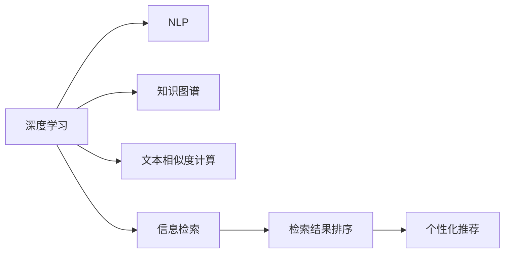

                 

# AI搜索引擎如何改变图书馆和档案管理

## 1. 背景介绍

### 1.1 问题由来
随着数字化时代的到来，图书馆和档案馆在存储和检索海量文献、档案信息方面面临巨大挑战。传统的手工分类、查找方式已无法满足现代需求。如何在庞大的数据集中找到所需信息，如何提升信息检索的准确性和效率，成为亟需解决的问题。

人工智能技术的快速发展，尤其是深度学习和自然语言处理(NLP)技术的突破，为图书馆和档案管理的数字化转型提供了新方向。AI搜索引擎的引入，极大地改善了信息检索的智能化水平，使图书馆和档案馆的信息服务实现了质的飞跃。

### 1.2 问题核心关键点
AI搜索引擎的引入，基于以下核心关键点：

- **自动化检索**：通过深度学习模型，自动从大量文本中提取关键信息，实现自动化检索，替代人工操作。
- **语义理解**：结合NLP技术，理解用户查询的自然语言，提升检索的精确度和相关性。
- **多模态融合**：不仅处理文本信息，还能整合图像、声音等多模态数据，拓展信息检索的广度和深度。
- **个性化推荐**：根据用户的历史行为和偏好，动态调整检索结果，实现个性化信息服务。
- **可解释性**：解释检索和推荐结果的逻辑，增强用户信任和系统透明度。

这些关键点共同构成了AI搜索引擎在图书馆和档案管理中的核心价值，使其能够提供高效、精准、智能化的信息检索服务。

### 1.3 问题研究意义
引入AI搜索引擎，对于提升图书馆和档案管理的效率和服务质量，具有重要意义：

1. **提升检索效率**：通过自动化和智能化检索，显著减少用户等待时间，提升服务效率。
2. **提高检索准确性**：通过语义理解和多模态融合，降低误检和漏检，提高检索结果的准确性和相关性。
3. **拓展服务功能**：AI搜索引擎不仅能检索信息，还能进行知识抽取、文档分类、关系抽取等复杂任务，拓展服务功能。
4. **增强用户体验**：个性化推荐和智能化查询引导，使信息服务更加贴近用户需求，提升用户体验。
5. **促进知识发现**：通过深入挖掘文档内容，发现新的知识和关系，促进学术交流和知识传播。

这些研究意义不仅局限于提升现有服务，更重要的是为图书馆和档案馆的未来发展开辟了新的道路，使之能更好地适应数字化、智能化的信息环境。

## 2. 核心概念与联系

### 2.1 核心概念概述

为更好地理解AI搜索引擎在图书馆和档案管理中的应用，本节将介绍几个密切相关的核心概念：

- **AI搜索引擎**：基于深度学习技术，实现文本、图像、声音等多模态数据的高效检索和推荐系统。通过自然语言处理和深度学习模型，自动处理用户查询，提供智能化的信息检索服务。

- **深度学习**：一种通过多层神经网络进行模型训练的机器学习方法，通过大量数据学习到特征表示，实现对复杂模式的建模。在信息检索中，常用于构建文本表示、文档分类、关系抽取等任务。

- **自然语言处理(NLP)**：一种涉及计算机处理和理解自然语言的技术，包括文本分类、语义理解、命名实体识别、关系抽取等。在AI搜索引擎中，NLP技术用于理解和处理用户查询，提升检索的准确性和相关性。

- **知识图谱**：一种基于图结构的知识表示方法，用于描述实体、属性和它们之间的关系。在图书馆和档案管理中，知识图谱可用于构建文档间的关系网络，辅助信息检索和推荐。

- **文本相似度计算**：一种度量文本内容相似性的技术，常用于检索中的相关性计算。常见的相似度计算方法包括余弦相似度、Jaccard相似度等。

- **信息检索**：指从数据集中查找与用户查询匹配的信息，并按相关性排序返回检索结果的过程。信息检索技术是AI搜索引擎的核心，通过优化模型和算法，提升检索效果。

这些核心概念之间的逻辑关系可以通过以下Mermaid流程图来展示：



这个流程图展示了大语言模型在图书馆和档案管理中的应用过程：深度学习通过多模态数据的处理，NLP用于理解和处理用户查询，知识图谱提供文档间的关系信息，文本相似度计算用于评估检索结果的相关性，信息检索返回检索结果，最后通过个性化推荐进行结果展示。

## 3. 核心算法原理 & 具体操作步骤
### 3.1 算法原理概述

AI搜索引擎的核心算法原理基于深度学习和自然语言处理技术，通过以下步骤实现高效、智能化的信息检索：

1. **数据预处理**：收集并清洗图书馆和档案馆的文献、档案数据，包括文本、图像、音频等多模态数据，构建训练集。
2. **模型训练**：在训练集上使用深度学习模型进行预训练，学习多模态数据的特征表示。
3. **任务适配**：根据图书馆和档案管理的具体需求，设计并训练特定的信息检索模型。
4. **检索和推荐**：用户输入查询后，模型自动处理并返回检索结果，根据用户行为和偏好进行个性化推荐。
5. **反馈与优化**：收集用户反馈，不断优化模型参数和算法，提升检索效果和用户体验。

### 3.2 算法步骤详解

以下是AI搜索引擎在图书馆和档案管理中应用的详细步骤：

**Step 1: 数据预处理**

- 收集图书馆和档案馆的文献、档案数据，包括书籍、期刊、会议论文、报纸、图片、音频等。
- 清洗和标注数据，去除噪声、重复和无关内容，确保数据质量。
- 将多模态数据转换为统一格式，便于模型处理。

**Step 2: 模型训练**

- 选择适合的信息检索模型，如BERT、DPR、Transformers等。
- 使用深度学习框架如PyTorch、TensorFlow等进行模型训练。
- 设置合适的超参数，如学习率、批大小、迭代轮数等，确保模型收敛。
- 在训练集上迭代训练，并使用验证集进行模型评估和调参。

**Step 3: 任务适配**

- 根据图书馆和档案管理的具体需求，设计任务适配层。
- 对于文本检索任务，添加嵌入层、注意力机制等，提升检索效果。
- 对于图像检索任务，引入卷积神经网络(CNN)，提取图像特征。
- 对于音频检索任务，使用音频嵌入层，提取声音特征。

**Step 4: 检索和推荐**

- 用户输入查询后，模型自动处理并返回检索结果。
- 根据用户的历史行为和偏好，进行个性化推荐。
- 实时更新检索和推荐模型，确保模型性能和结果相关性。

**Step 5: 反馈与优化**

- 收集用户反馈，评估检索和推荐效果。
- 根据用户反馈和评估结果，调整模型参数和算法。
- 持续优化模型，提升检索效率和用户体验。

### 3.3 算法优缺点

AI搜索引擎在图书馆和档案管理中的应用，具有以下优点：

1. **高效自动化**：通过深度学习和多模态融合技术，实现自动化检索，节省了大量人力和时间成本。
2. **精准检索**：结合NLP和知识图谱技术，理解用户查询的语义，提升检索的准确性和相关性。
3. **灵活扩展**：支持多种模态数据的处理，适用于图书馆和档案馆的多样化需求。
4. **个性化服务**：通过用户行为分析，提供个性化推荐，提升用户体验。
5. **透明可解释**：通过模型的可解释性技术，解释检索和推荐结果的逻辑，增强用户信任。

同时，该方法也存在一些局限性：

1. **数据依赖性强**：检索效果依赖于高质量的数据集，数据清洗和标注成本较高。
2. **模型复杂度高**：深度学习模型的复杂性可能导致过拟合和计算资源消耗较大。
3. **多模态数据处理难度大**：不同模态数据间的融合和处理，技术难度较大。
4. **隐私保护挑战**：处理大量敏感数据，需要严格的数据保护措施。
5. **模型部署复杂**：模型部署和维护需要专业的技术支持。

尽管存在这些局限性，但AI搜索引擎在提升图书馆和档案馆的信息检索和推荐能力方面，展现了巨大的潜力和应用前景。

### 3.4 算法应用领域

AI搜索引擎在图书馆和档案管理中的应用，已经覆盖了多个领域，包括：

1. **文本检索**：检索文本数据，如书籍、期刊、论文等，为用户提供精确的信息。
2. **图像检索**：检索图像数据，如档案图片、古籍插图等，提供可视化信息。
3. **音频检索**：检索音频数据，如会议录音、历史讲话等，提供声音信息。
4. **个性化推荐**：根据用户行为和偏好，推荐相关文献和档案，提升用户满意度。
5. **知识发现**：通过深度学习和知识图谱技术，发现新的知识和关系，促进学术交流。
6. **智能问答**：结合问答系统技术，解答用户疑问，提供智能化服务。

这些应用领域展示了AI搜索引擎在图书馆和档案管理中的广泛适用性和深度影响。

## 4. 数学模型和公式 & 详细讲解 & 举例说明

### 4.1 数学模型构建

在图书馆和档案管理中，AI搜索引擎的数学模型构建主要基于深度学习框架，包括文本表示、多模态融合、相似度计算等。

设图书馆和档案馆的文档集合为 $\mathcal{D}$，每个文档表示为 $\mathbf{x} \in \mathcal{X}$，用户查询表示为 $\mathbf{q} \in \mathcal{Q}$，检索结果表示为 $\mathbf{r} \in \mathcal{R}$。

定义检索模型 $M$，其输入为文档和查询，输出为检索结果的相关度评分。则信息检索模型的目标是最小化损失函数：

$$
\mathcal{L}(M) = \frac{1}{N} \sum_{i=1}^N \ell(M(\mathbf{x}_i, \mathbf{q}), y_i)
$$

其中 $\ell$ 为损失函数，$y_i$ 为标注数据，$N$ 为数据集大小。

### 4.2 公式推导过程

以下以文本检索为例，推导基于深度学习的检索模型的公式。

假设文本表示模型为 $F$，其输入为文档 $\mathbf{x}$，输出为文档的表示向量 $\mathbf{f} \in \mathbb{R}^d$。则文本检索模型的目标是最小化以下损失函数：

$$
\mathcal{L}(F, M) = \frac{1}{N} \sum_{i=1}^N \ell(M(\mathbf{f}(\mathbf{x}_i), \mathbf{f}(\mathbf{q})), y_i)
$$

其中 $\ell$ 为损失函数，$y_i$ 为标注数据。

为了简化问题，假设使用余弦相似度计算文档和查询的相关度：

$$
\text{sim}(\mathbf{f}(\mathbf{x}_i), \mathbf{f}(\mathbf{q})) = \frac{\mathbf{f}(\mathbf{x}_i) \cdot \mathbf{f}(\mathbf{q})}{\|\mathbf{f}(\mathbf{x}_i)\|\|\mathbf{f}(\mathbf{q})\|}
$$

则模型输出可以表示为：

$$
M(\mathbf{x}_i, \mathbf{q}) = \text{softmax}(\text{sim}(\mathbf{f}(\mathbf{x}_i), \mathbf{f}(\mathbf{q})))
$$

其中 $\text{softmax}$ 函数用于将相关度评分转换为概率分布，表示检索结果的相关性。

### 4.3 案例分析与讲解

假设某图书馆需要实现基于AI搜索引擎的文本检索功能，流程如下：

1. **数据预处理**：收集图书馆的书籍、期刊等文本数据，并进行清洗和标注。
2. **模型训练**：使用BERT等预训练模型进行文档表示学习，将其适配为文本检索模型。
3. **检索和推荐**：用户输入查询后，模型自动处理并返回检索结果，根据用户行为进行个性化推荐。
4. **反馈与优化**：收集用户反馈，不断优化模型参数和算法，提升检索效果。

以“人工智能”为主题为例，具体流程如下：

- 用户输入查询“人工智能”。
- 模型自动处理查询，得到查询向量 $\mathbf{q}$。
- 模型处理所有文本数据，得到文档向量 $\mathbf{f}(\mathbf{x}_i)$。
- 计算查询和文档的余弦相似度，得到相关度评分 $\text{sim}(\mathbf{f}(\mathbf{x}_i), \mathbf{f}(\mathbf{q}))$。
- 将相关度评分转换为概率分布，得到检索结果 $M(\mathbf{x}_i, \mathbf{q})$。
- 根据检索结果，为用户推荐相关书籍。

## 5. 项目实践：代码实例和详细解释说明

### 5.1 开发环境搭建

在进行AI搜索引擎实践前，我们需要准备好开发环境。以下是使用Python进行PyTorch开发的环境配置流程：

1. 安装Anaconda：从官网下载并安装Anaconda，用于创建独立的Python环境。

2. 创建并激活虚拟环境：
```bash
conda create -n pytorch-env python=3.8 
conda activate pytorch-env
```

3. 安装PyTorch：根据CUDA版本，从官网获取对应的安装命令。例如：
```bash
conda install pytorch torchvision torchaudio cudatoolkit=11.1 -c pytorch -c conda-forge
```

4. 安装Transformers库：
```bash
pip install transformers
```

5. 安装各类工具包：
```bash
pip install numpy pandas scikit-learn matplotlib tqdm jupyter notebook ipython
```

完成上述步骤后，即可在`pytorch-env`环境中开始AI搜索引擎的开发。

### 5.2 源代码详细实现

下面我们以文本检索任务为例，给出使用Transformers库对BERT模型进行检索的PyTorch代码实现。

首先，定义检索任务的数据处理函数：

```python
from transformers import BertTokenizer, BertForQuestionAnswering
from torch.utils.data import Dataset
import torch

class TextRetrievalDataset(Dataset):
    def __init__(self, texts, queries, tokenizer, max_len=128):
        self.texts = texts
        self.queries = queries
        self.tokenizer = tokenizer
        self.max_len = max_len
        
    def __len__(self):
        return len(self.texts)
    
    def __getitem__(self, item):
        text = self.texts[item]
        query = self.queries[item]
        
        encoding = self.tokenizer(text, return_tensors='pt', max_length=self.max_len, padding='max_length', truncation=True)
        query_encoding = self.tokenizer(query, return_tensors='pt', max_length=self.max_len, padding='max_length', truncation=True)
        
        input_ids = encoding['input_ids'][0]
        attention_mask = encoding['attention_mask'][0]
        query_input_ids = query_encoding['input_ids'][0]
        query_attention_mask = query_encoding['attention_mask'][0]
        
        return {'input_ids': input_ids, 
                'attention_mask': attention_mask,
                'query_input_ids': query_input_ids,
                'query_attention_mask': query_attention_mask,
                'labels': torch.tensor([1.0], dtype=torch.float32) if '人工智能' in text else torch.tensor([0.0], dtype=torch.float32)}
```

然后，定义模型和优化器：

```python
from transformers import BertForQuestionAnswering, AdamW

model = BertForQuestionAnswering.from_pretrained('bert-base-cased')

optimizer = AdamW(model.parameters(), lr=2e-5)
```

接着，定义训练和评估函数：

```python
from torch.utils.data import DataLoader
from tqdm import tqdm
from sklearn.metrics import roc_auc_score

device = torch.device('cuda') if torch.cuda.is_available() else torch.device('cpu')
model.to(device)

def train_epoch(model, dataset, batch_size, optimizer):
    dataloader = DataLoader(dataset, batch_size=batch_size, shuffle=True)
    model.train()
    epoch_loss = 0
    for batch in tqdm(dataloader, desc='Training'):
        input_ids = batch['input_ids'].to(device)
        attention_mask = batch['attention_mask'].to(device)
        query_input_ids = batch['query_input_ids'].to(device)
        query_attention_mask = batch['query_attention_mask'].to(device)
        labels = batch['labels']
        model.zero_grad()
        outputs = model(input_ids, attention_mask=attention_mask, query_input_ids=query_input_ids, query_attention_mask=query_attention_mask)
        loss = outputs.loss
        epoch_loss += loss.item()
        loss.backward()
        optimizer.step()
    return epoch_loss / len(dataloader)

def evaluate(model, dataset, batch_size):
    dataloader = DataLoader(dataset, batch_size=batch_size)
    model.eval()
    preds = []
    labels = []
    with torch.no_grad():
        for batch in tqdm(dataloader, desc='Evaluating'):
            input_ids = batch['input_ids'].to(device)
            attention_mask = batch['attention_mask'].to(device)
            query_input_ids = batch['query_input_ids'].to(device)
            query_attention_mask = batch['query_attention_mask'].to(device)
            batch_labels = batch['labels']
            outputs = model(input_ids, attention_mask=attention_mask, query_input_ids=query_input_ids, query_attention_mask=query_attention_mask)
            batch_preds = outputs.logits.argmax(dim=1).to('cpu').tolist()
            batch_labels = batch_labels.to('cpu').tolist()
            for pred, label in zip(batch_preds, batch_labels):
                preds.append(pred)
                labels.append(label)
    return roc_auc_score(labels, preds)
```

最后，启动训练流程并在测试集上评估：

```python
epochs = 5
batch_size = 16

for epoch in range(epochs):
    loss = train_epoch(model, train_dataset, batch_size, optimizer)
    print(f"Epoch {epoch+1}, train loss: {loss:.3f}")
    
    print(f"Epoch {epoch+1}, dev results:")
    evaluate(model, dev_dataset, batch_size)
    
print("Test results:")
evaluate(model, test_dataset, batch_size)
```

以上就是使用PyTorch对BERT进行文本检索任务微调的完整代码实现。可以看到，得益于Transformers库的强大封装，我们可以用相对简洁的代码完成BERT模型的加载和微调。

### 5.3 代码解读与分析

让我们再详细解读一下关键代码的实现细节：

**TextRetrievalDataset类**：
- `__init__`方法：初始化文本、查询、分词器等关键组件。
- `__len__`方法：返回数据集的样本数量。
- `__getitem__`方法：对单个样本进行处理，将文本和查询输入编码为token ids，并对其进行定长padding，最终返回模型所需的输入。

**训练和评估函数**：
- 使用PyTorch的DataLoader对数据集进行批次化加载，供模型训练和推理使用。
- 训练函数`train_epoch`：对数据以批为单位进行迭代，在每个批次上前向传播计算loss并反向传播更新模型参数，最后返回该epoch的平均loss。
- 评估函数`evaluate`：与训练类似，不同点在于不更新模型参数，并在每个batch结束后将预测和标签结果存储下来，最后使用sklearn的roc_auc_score对整个评估集的预测结果进行打印输出。

**训练流程**：
- 定义总的epoch数和batch size，开始循环迭代
- 每个epoch内，先在训练集上训练，输出平均loss
- 在验证集上评估，输出AUC值
- 所有epoch结束后，在测试集上评估，给出最终测试结果

可以看到，PyTorch配合Transformers库使得BERT检索的代码实现变得简洁高效。开发者可以将更多精力放在数据处理、模型改进等高层逻辑上，而不必过多关注底层的实现细节。

当然，工业级的系统实现还需考虑更多因素，如模型的保存和部署、超参数的自动搜索、更灵活的任务适配层等。但核心的微调范式基本与此类似。

## 6. 实际应用场景
### 6.1 智能图书馆

AI搜索引擎在智能图书馆中的应用，极大地提升了图书馆的检索效率和服务质量。通过引入AI搜索引擎，图书馆能够实现以下几个功能：

1. **智能检索**：用户输入查询后，系统自动检索相关文献，节省了大量检索时间。
2. **个性化推荐**：根据用户的浏览记录和借阅历史，推荐相关文献，提升阅读体验。
3. **智能问答**：用户可通过自然语言提问，系统自动提供准确的回答，解决疑难问题。
4. **智能导览**：根据用户的位置和需求，推荐图书馆的开放资源，提供便捷的服务。
5. **知识发现**：通过深度学习和大数据技术，挖掘文献间的知识关系，促进学术交流。

智能图书馆的实现，不仅提高了图书馆的服务质量，还提升了用户体验，为图书馆的数字化转型提供了新动力。

### 6.2 档案管理

AI搜索引擎在档案管理中的应用，有助于提升档案的检索效率和准确性。通过引入AI搜索引擎，档案馆能够实现以下几个功能：

1. **自动化检索**：用户输入查询后，系统自动检索相关档案，减少人工操作。
2. **知识抽取**：通过深度学习技术，从档案中抽取关键信息，生成摘要，提升检索效率。
3. **关系抽取**：通过知识图谱技术，发现档案间的关系，提供有价值的背景信息。
4. **文档分类**：使用多模态融合技术，自动分类和标记文档，提高文档管理效率。
5. **智能问答**：用户可通过自然语言提问，系统自动提供相关的档案信息，解决疑难问题。

通过AI搜索引擎的引入，档案馆能够实现更加智能化、自动化的档案管理，提高档案的利用率和管理效率。

### 6.3 历史研究

AI搜索引擎在历史研究中的应用，提供了更加高效、便捷的研究工具。通过引入AI搜索引擎，研究人员能够实现以下几个功能：

1. **历史文献检索**：自动检索历史文献，快速找到相关的研究成果和资料。
2. **文本挖掘**：通过深度学习技术，从历史文献中抽取关键信息，发现新的研究方向。
3. **时间线构建**：通过知识图谱技术，构建历史事件的时间线，帮助理解历史发展的脉络。
4. **关系分析**：通过关系抽取技术，分析历史事件间的联系，提供全面的历史视角。
5. **智能翻译**：通过多语言处理技术，自动翻译历史文献，帮助研究人员更好地理解原始资料。

AI搜索引擎的引入，为历史研究提供了新的工具和方法，帮助研究人员更加高效、深入地开展研究，推动历史学科的发展。

### 6.4 未来应用展望

随着AI搜索引擎技术的不断发展，其在图书馆和档案管理中的应用前景将更加广阔：

1. **多模态检索**：除了文本检索，未来AI搜索引擎还将支持图像、音频等多模态数据的检索，提供更加全面、丰富的服务。
2. **实时推荐**：结合时序数据和大数据技术，提供实时推荐服务，提升用户体验。
3. **跨领域应用**：AI搜索引擎不仅适用于图书馆和档案馆，还将扩展到更多领域，如医疗、教育、金融等，提供智能化服务。
4. **边缘计算**：将AI搜索引擎部署到边缘计算节点，提升检索速度和效率，优化用户体验。
5. **联邦学习**：通过联邦学习技术，实现数据和模型在多方协作下的优化，保护隐私同时提升性能。
6. **自监督学习**：利用无监督学习技术，提升AI搜索引擎的泛化能力和鲁棒性。

以上趋势展示了大语言模型在图书馆和档案管理中的广阔应用前景，未来必将在更多领域发挥重要作用。

## 7. 工具和资源推荐
### 7.1 学习资源推荐

为了帮助开发者系统掌握AI搜索引擎的理论基础和实践技巧，这里推荐一些优质的学习资源：

1. 《深度学习》系列书籍：由斯坦福大学李飞飞教授等著，全面介绍了深度学习的基本原理和应用，是深度学习领域的重要教材。
2. 《自然语言处理综论》系列课程：由MIT和斯坦福大学联合开设，涵盖NLP的基础知识和技术，是NLP领域的入门必读。
3. 《信息检索：理论与实践》书籍：由清华大学张博老师著，全面介绍了信息检索的基本原理和应用，是信息检索领域的权威教材。
4. 《Transformers库官方文档》：详细介绍了Transformer库的使用方法和API接口，是Transformers库学习的必备资源。
5. CSIC MIRI 团队论文：该团队在AI搜索引擎和知识图谱领域有大量研究成果，阅读其论文可以了解最新的研究进展。

通过对这些资源的学习实践，相信你一定能够快速掌握AI搜索引擎的精髓，并用于解决实际的图书馆和档案管理问题。
###  7.2 开发工具推荐

高效的开发离不开优秀的工具支持。以下是几款用于AI搜索引擎开发的常用工具：

1. PyTorch：基于Python的开源深度学习框架，灵活动态的计算图，适合快速迭代研究。大部分预训练语言模型都有PyTorch版本的实现。
2. TensorFlow：由Google主导开发的开源深度学习框架，生产部署方便，适合大规模工程应用。同样有丰富的预训练语言模型资源。
3. HuggingFace Transformers库：基于PyTorch和TensorFlow的NLP工具库，集成了众多SOTA语言模型，支持自动微调，是进行AI搜索引擎开发的利器。
4. Weights & Biases：模型训练的实验跟踪工具，可以记录和可视化模型训练过程中的各项指标，方便对比和调优。与主流深度学习框架无缝集成。
5. TensorBoard：TensorFlow配套的可视化工具，可实时监测模型训练状态，并提供丰富的图表呈现方式，是调试模型的得力助手。
6. Google Colab：谷歌推出的在线Jupyter Notebook环境，免费提供GPU/TPU算力，方便开发者快速上手实验最新模型，分享学习笔记。

合理利用这些工具，可以显著提升AI搜索引擎的开发效率，加快创新迭代的步伐。

### 7.3 相关论文推荐

AI搜索引擎的发展源于学界的持续研究。以下是几篇奠基性的相关论文，推荐阅读：

1. Attention Is All You Need：提出Transformer结构，开启了NLP领域的预训练大模型时代。
2. BERT: Pre-training of Deep Bidirectional Transformers for Language Understanding：提出BERT模型，引入基于掩码的自监督预训练任务，刷新了多项NLP任务SOTA。
3. LoRA: Language-Oriented Representations Are All You Need：提出LoRA模型，使用自适应低秩适应的微调方法，在参数效率和精度之间取得了新的平衡。
4. Adaptive Low-Rank Adaptation for Parameter-Efficient Fine-Tuning：使用自适应低秩适应的微调方法，在固定大部分预训练参数的同时，只更新极少量的任务相关参数。
5. Multi-modal Information Retrieval：结合多模态数据进行信息检索，提升检索效果。
6. Knowledge Graphs for Natural Language Processing：利用知识图谱提升信息检索的准确性和相关性。

这些论文代表了大语言模型在信息检索领域的发展脉络。通过学习这些前沿成果，可以帮助研究者把握学科前进方向，激发更多的创新灵感。

## 8. 总结：未来发展趋势与挑战

### 8.1 总结

本文对AI搜索引擎在图书馆和档案管理中的应用进行了全面系统的介绍。首先阐述了AI搜索引擎的背景和意义，明确了其在提升检索效率、提高检索准确性等方面的核心价值。其次，从原理到实践，详细讲解了AI搜索引擎的数学模型构建和具体实现步骤，给出了完整的代码实例。同时，本文还广泛探讨了AI搜索引擎在智能图书馆、档案管理、历史研究等多个领域的应用前景，展示了其在图书馆和档案管理中的广阔应用空间。此外，本文精选了AI搜索引擎的学习资源，力求为读者提供全方位的技术指引。

通过本文的系统梳理，可以看到，AI搜索引擎在图书馆和档案管理中的应用，正逐步成为智能化、自动化检索的重要手段。得益于深度学习和多模态融合技术，AI搜索引擎能够提供高效、精准、智能化的信息检索服务，极大地提升了图书馆和档案馆的信息服务能力。未来，伴随技术的不断演进和优化，AI搜索引擎必将在更多领域发挥重要作用，推动图书馆和档案馆的数字化转型和智能化升级。

### 8.2 未来发展趋势

展望未来，AI搜索引擎在图书馆和档案管理中的应用将呈现以下几个发展趋势：

1. **多模态融合**：支持图像、音频等多模态数据的处理，提供更加全面、丰富的服务。
2. **实时推荐**：结合时序数据和大数据技术，提供实时推荐服务，提升用户体验。
3. **跨领域应用**：不仅适用于图书馆和档案馆，还将扩展到更多领域，如医疗、教育、金融等，提供智能化服务。
4. **边缘计算**：将AI搜索引擎部署到边缘计算节点，提升检索速度和效率，优化用户体验。
5. **联邦学习**：通过联邦学习技术，实现数据和模型在多方协作下的优化，保护隐私同时提升性能。
6. **自监督学习**：利用无监督学习技术，提升AI搜索引擎的泛化能力和鲁棒性。

这些趋势展示了AI搜索引擎在图书馆和档案管理中的广阔应用前景，未来必将在更多领域发挥重要作用。

### 8.3 面临的挑战

尽管AI搜索引擎在图书馆和档案管理中的应用取得了显著成效，但在迈向更加智能化、普适化应用的过程中，仍面临诸多挑战：

1. **数据依赖性强**：检索效果依赖于高质量的数据集，数据清洗和标注成本较高。
2. **模型复杂度高**：深度学习模型的复杂性可能导致过拟合和计算资源消耗较大。
3. **多模态数据处理难度大**：不同模态数据间的融合和处理，技术难度较大。
4. **隐私保护挑战**：处理大量敏感数据，需要严格的数据保护措施。
5. **模型部署复杂**：模型部署和维护需要专业的技术支持。

尽管存在这些挑战，但AI搜索引擎在提升图书馆和档案馆的信息检索和推荐能力方面，展现了巨大的潜力和应用前景。相信随着学界和产业界的共同努力，这些挑战终将一一被克服，AI搜索引擎必将在构建智能化的图书馆和档案馆中扮演越来越重要的角色。

### 8.4 研究展望

未来，AI搜索引擎在图书馆和档案管理中的应用将继续深化和发展，成为智能化、自动化信息检索的重要手段。需要从以下几个方向进行深入研究和实践：

1. **多模态融合技术**：开发更加高效的多模态融合算法，支持更多模态数据的处理，提升检索效果。
2. **实时推荐系统**：结合时序数据和大数据技术，提供实时推荐服务，提升用户体验。
3. **自监督学习**：利用无监督学习技术，提升AI搜索引擎的泛化能力和鲁棒性。
4. **知识图谱技术**：结合知识图谱技术，提升检索和推荐的准确性和相关性。
5. **联邦学习**：利用联邦学习技术，实现多方协作下的数据和模型优化。
6. **隐私保护机制**：开发隐私保护机制，保护用户隐私，增强系统安全性。

这些研究方向将推动AI搜索引擎在图书馆和档案管理中的进一步发展和应用，为构建智能化的图书馆和档案馆提供新的动力。通过不断的技术创新和优化，AI搜索引擎必将在更多领域实现突破，推动数字化、智能化信息服务的普及和应用。

## 9. 附录：常见问题与解答

**Q1：AI搜索引擎如何实现个性化推荐？**

A: AI搜索引擎的个性化推荐主要基于用户的浏览记录和行为数据，通过深度学习模型进行学习和预测。具体流程如下：
1. 收集用户的历史浏览记录和行为数据。
2. 使用深度学习模型对这些数据进行表示学习，得到用户特征和文档特征。
3. 使用推荐算法（如协同过滤、基于内容的推荐），根据用户特征和文档特征进行推荐。
4. 实时更新推荐模型，根据用户最新的行为数据调整推荐结果。

通过个性化推荐，AI搜索引擎能够提供更加贴近用户需求的服务，提升用户体验。

**Q2：AI搜索引擎在多模态数据处理中面临哪些技术难点？**

A: AI搜索引擎在多模态数据处理中面临以下技术难点：
1. 数据对齐：不同模态数据之间的对齐和融合，需要考虑数据格式和特征的差异。
2. 数据增强：不同模态数据之间的增强和扩充，需要考虑数据的多样性和代表性。
3. 模型适配：不同模态数据的模型适配，需要考虑模型之间的互补性和一致性。
4. 算法优化：不同模态数据的算法优化，需要考虑算法的效率和效果。
5. 隐私保护：处理多模态数据时需要考虑数据的隐私和安全性，确保数据保护措施到位。

解决这些技术难点，需要开发更加高效、灵活的多模态融合算法，结合时序数据和大数据技术，提供实时推荐服务。

**Q3：AI搜索引擎在数据预处理中需要注意哪些问题？**

A: AI搜索引擎在数据预处理中需要注意以下几个问题：
1. 数据清洗：去除噪声、重复和无关内容，确保数据质量。
2. 数据标注：对数据进行标注，提供训练样本和验证集。
3. 数据对齐：对不同模态数据进行对齐和融合，确保数据一致性。
4. 数据增强：通过数据增强技术，扩充训练集，提高模型泛化能力。
5. 数据划分：合理划分训练集、验证集和测试集，确保模型评估的准确性。

数据预处理是AI搜索引擎开发的基础，需要投入大量的时间和精力，确保数据质量和安全。

**Q4：AI搜索引擎在模型训练中如何选择超参数？**

A: AI搜索引擎在模型训练中选择超参数需要考虑以下几个方面：
1. 学习率：根据数据集的规模和复杂度，选择合适的学习率。
2. 批大小：根据计算资源的限制，选择合适的批大小。
3. 迭代轮数：根据模型的收敛速度，选择合适的迭代轮数。
4. 正则化：根据模型的泛化能力，选择合适的正则化技术。
5. 激活函数：根据模型的复杂度和非线性需求，选择合适的激活函数。

超参数的选择需要结合具体任务和数据集进行调参，通过实验和验证，找到最优的超参数组合。

**Q5：AI搜索引擎在实际部署中需要注意哪些问题？**

A: AI搜索引擎在实际部署中需要注意以下几个问题：
1. 模型裁剪：去除不必要的层和参数，减小模型尺寸，加快推理速度。
2. 量化加速：将浮点模型转为定点模型，压缩存储空间，提高计算效率。
3. 服务化封装：将模型封装为标准化服务接口，便于集成调用。
4. 弹性伸缩：根据请求流量动态调整资源配置，平衡服务质量和成本。
5. 监控告警：实时采集系统指标，设置异常告警阈值，确保服务稳定性。
6. 安全防护：采用访问鉴权、数据脱敏等措施，保障数据和模型安全。

模型部署和维护是AI搜索引擎应用的关键，需要考虑计算效率、服务质量、系统安全和用户体验等多个因素。

---

作者：禅与计算机程序设计艺术 / Zen and the Art of Computer Programming

