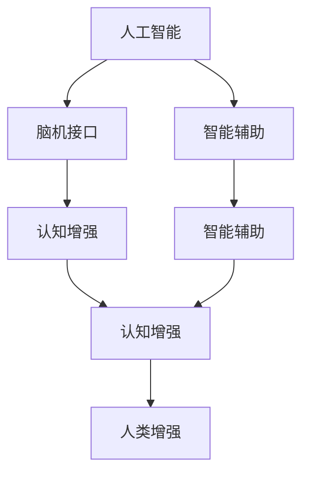

                 

# AI时代的人类增强：身体增强与认知增强

> 关键词：人工智能, 人类增强, 身体增强, 认知增强, 脑机接口, 基因编辑, 智能辅助, 伦理问题

## 1. 背景介绍

### 1.1 问题由来

随着科技的迅猛发展，人类在不断探索和突破自身生理和认知的极限。从人类增强的角度看，这一趋势主要体现在两大方面：身体增强和认知增强。身体增强主要涉及生物医学工程、运动科学等领域的创新技术，而认知增强则依赖于人工智能与脑科学的结合，包括脑机接口、智能辅助等前沿科技。

身体增强旨在提升人类的身体素质和体能，通过技术手段弥补或增强人类自然器官的功能，如通过假肢增强残疾人士的活动能力，通过基因编辑提升健康水平和身体潜力等。认知增强则通过提高人类的智力水平、记忆力、注意力等认知功能，使用脑机接口技术实现人脑与计算机的直接交互，实现信息的高速处理与存储。

人类增强技术的快速发展，不仅关乎个人的健康与幸福，更是关乎人类社会的未来发展。然而，在享受技术带来便利的同时，我们也需要正视这一领域的伦理挑战和社会影响，确保技术进步与人类福祉的和谐统一。

### 1.2 问题核心关键点

人类增强的核心问题在于如何安全、有效地结合科技与生物体，实现身体和认知功能的增强。其核心关键点包括：

- **安全性**：确保增强技术的安全性，避免对人类健康造成潜在威胁。
- **有效性**：增强技术的实际效果必须能够显著改善人类的能力。
- **普适性**：技术应该能够适用于广泛的受众，特别是弱势群体，如残疾人士、老年人群等。
- **伦理考量**：确保增强技术符合社会伦理规范，避免引发社会不平等和歧视。
- **可持续性**：技术的长远发展应该对环境和社会可持续发展有益。

## 2. 核心概念与联系

### 2.1 核心概念概述

为更好地理解人类增强技术，本节将介绍几个核心概念：

- **人工智能(AI)**：指模拟人类智能过程的计算机技术，包括学习、推理、规划、感知和自然语言处理等方面。
- **脑机接口(Brain-Computer Interface, BCI)**：一种将人脑信号转换为计算机可识别的信号，实现人脑与计算机直接交互的技术。
- **基因编辑(Genome Editing)**：利用CRISPR-Cas9等技术修改生物体的基因组，实现特定基因的添加、删除或替换。
- **智能辅助(Augmented Intelligence, AI)**：指通过AI技术辅助人类完成任务，提升工作效率和决策质量的技术。
- **认知增强(Cognitive Enhancement)**：利用AI和脑科学手段，提升人类的认知功能，如记忆、注意力、学习能力等。
- **人类增强(Human Enhancement)**：通过生物医学工程、脑科学和人工智能等技术手段，提升人类的身体和认知能力，以适应未来社会的变化和挑战。

这些概念之间存在紧密的联系，共同构成了人类增强技术的整体框架：

1. **人工智能**为脑机接口和智能辅助提供了技术支撑，实现了复杂数据处理和自然语言交互。
2. **脑机接口**实现了人类与计算机的直接交互，为认知增强提供了基础。
3. **基因编辑**能够修改人类基因，为身体增强提供了新的途径。
4. **智能辅助**通过AI技术提升工作效率和决策质量，为人类增强提供了新的应用场景。
5. **认知增强**通过提升人类认知功能，使人类能够更好地适应未来社会的发展。
6. **人类增强**则综合利用上述技术手段，提升人类的整体能力，推动社会进步。

这些核心概念之间的逻辑关系可以通过以下Mermaid流程图来展示：



这个流程图展示了大语言模型的核心概念及其之间的关系：

1. 人工智能为脑机接口和智能辅助提供了技术支撑。
2. 脑机接口实现了人类与计算机的直接交互，为认知增强提供了基础。
3. 智能辅助通过AI技术提升工作效率和决策质量，为人类增强提供了新的应用场景。
4. 认知增强通过提升人类认知功能，使人类能够更好地适应未来社会的发展。
5. 人类增强则综合利用上述技术手段，提升人类的整体能力，推动社会进步。

## 3. 核心算法原理 & 具体操作步骤

### 3.1 算法原理概述

人类增强技术涉及多个领域的复杂技术手段，包括生物医学工程、人工智能、脑科学等。其核心算法原理主要包括以下几个方面：

- **生物医学工程**：通过假肢、仿生器官等手段实现身体增强，其原理包括机械设计与控制、材料科学等。
- **人工智能**：利用机器学习、自然语言处理等技术实现智能辅助和认知增强，其原理包括数据处理、模型训练、推理预测等。
- **脑科学**：通过研究人脑的工作机制，实现脑机接口和认知增强，其原理包括神经信号的采集与解码、神经网络建模等。

这些技术手段在各自领域内具有相对成熟的理论基础，但在跨领域的融合与协同上仍面临诸多挑战。本文将重点介绍如何结合人工智能与脑科学，实现认知增强技术的具体实现步骤。

### 3.2 算法步骤详解

**步骤1：脑信号采集**

脑信号采集是实现脑机接口的基础。常见的脑信号采集方式包括：

- **脑电图(EEG)**：通过头皮电极采集人脑电活动。
- **功能性磁共振成像(fMRI)**：通过磁共振成像技术采集人脑活动。
- **磁源成像(MEG)**：通过磁源成像技术采集人脑活动。

脑信号采集技术的选择取决于研究的具体需求和设备可用性。例如，EEG设备廉价且便携，适合快速测试；fMRI设备昂贵但精度高，适合深入研究。

**步骤2：信号预处理**

采集到的脑信号原始数据需要经过预处理，以提高后续分析的准确性。预处理步骤包括：

- **滤波**：去除高频噪声，保留有用的信号频率。
- **去伪迹**：去除眼动、肌肉收缩等伪迹信号。
- **降采样**：将高分辨率信号转换为低分辨率信号，以减少计算量和存储需求。

预处理步骤可以通过专门的信号处理软件或开源库实现，如Python的MNE库等。

**步骤3：特征提取**

预处理后的信号需要提取有意义的特征，以便于机器学习模型的训练。特征提取方法包括：

- **频谱分析**：计算信号的功率谱密度，提取频率特征。
- **时频分析**：利用小波变换、短时傅里叶变换等方法，提取时频特征。
- **深度学习特征提取**：使用卷积神经网络(CNN)、循环神经网络(RNN)等深度学习模型，自动提取特征。

深度学习特征提取方法可以自动学习信号中的复杂特征，通常比传统方法效果更好。

**步骤4：模型训练**

提取出的特征需要经过机器学习模型的训练，以实现对人脑信号的解码和分类。常见的机器学习模型包括：

- **支持向量机(SVM)**：用于分类问题。
- **随机森林(Random Forest)**：用于分类和回归问题。
- **深度学习模型**：如卷积神经网络(CNN)、循环神经网络(RNN)、长短时记忆网络(LSTM)等，用于复杂的分类和预测问题。

训练模型需要使用标注数据，即已知的脑信号和对应的任务指令，如按键、鼠标移动等。训练数据可以通过手动标注或使用自动标注工具获取。

**步骤5：模型评估**

训练好的模型需要评估其性能，以确定是否满足实际应用需求。评估方法包括：

- **交叉验证**：通过交叉验证方法，评估模型的泛化能力和稳健性。
- **ROC曲线**：绘制接收者操作特征曲线，评估模型的分类准确率。
- **混淆矩阵**：计算模型在不同分类上的准确率、召回率、F1分数等指标。

模型评估步骤可以通过Python的scikit-learn库实现，支持多种评估方法。

**步骤6：实时解码与控制**

评估后的模型需要部署到实时系统中，实现对人脑信号的实时解码和控制。实时解码和控制系统通常包括以下几个部分：

- **前端设备**：如EEG帽子、fMRI头盔、MEG头盔等，采集脑信号。
- **信号处理模块**：对采集到的信号进行预处理和特征提取。
- **模型推理模块**：利用训练好的模型，对特征进行解码和分类。
- **控制系统**：根据解码结果，控制目标设备，如计算机、机器人等。

实时解码与控制系统通常需要高性能的硬件设备和实时处理能力，可以通过嵌入式系统或高性能计算机实现。

## 4. 数学模型和公式 & 详细讲解 & 举例说明

### 4.1 数学模型构建

在本节中，我们将使用数学语言对脑机接口的实现过程进行更加严格的刻画。

假设脑信号的采集数据为 $X = \{x_1, x_2, ..., x_N\}$，其中 $x_i$ 表示第 $i$ 次采集的信号样本。经过预处理和特征提取后，得到特征向量 $X' = \{x'_1, x'_2, ..., x'_N\}$。使用深度学习模型对特征向量进行训练，得到模型参数 $\theta$。模型的输出为 $Y = \{y_1, y_2, ..., y_N\}$，其中 $y_i$ 表示第 $i$ 次信号解码的分类结果。

定义模型的损失函数为：

$$
L(\theta) = \frac{1}{N} \sum_{i=1}^N \ell(y_i, y'_i)
$$

其中 $\ell(y_i, y'_i)$ 为分类损失函数，通常使用交叉熵损失或均方误差损失。训练模型的目标是最小化损失函数：

$$
\theta^* = \mathop{\arg\min}_{\theta} L(\theta)
$$

在得到最优参数 $\theta^*$ 后，即可用于实时解码和控制。

### 4.2 公式推导过程

以下我们以二分类任务为例，推导交叉熵损失函数及其梯度的计算公式。

假设模型 $M_{\theta}$ 在输入 $x$ 上的输出为 $\hat{y}=M_{\theta}(x) \in [0,1]$，表示样本属于正类的概率。真实标签 $y \in \{0,1\}$。则二分类交叉熵损失函数定义为：

$$
\ell(M_{\theta}(x),y) = -[y\log \hat{y} + (1-y)\log (1-\hat{y})]
$$

将其代入经验风险公式，得：

$$
L(\theta) = -\frac{1}{N}\sum_{i=1}^N [y_i\log M_{\theta}(x_i)+(1-y_i)\log(1-M_{\theta}(x_i))]
$$

根据链式法则，损失函数对参数 $\theta$ 的梯度为：

$$
\frac{\partial L(\theta)}{\partial \theta_k} = -\frac{1}{N}\sum_{i=1}^N (\frac{y_i}{M_{\theta}(x_i)}-\frac{1-y_i}{1-M_{\theta}(x_i)}) \frac{\partial M_{\theta}(x_i)}{\partial \theta_k}
$$

其中 $\frac{\partial M_{\theta}(x_i)}{\partial \theta_k}$ 可进一步递归展开，利用自动微分技术完成计算。

在得到损失函数的梯度后，即可带入参数更新公式，完成模型的迭代优化。重复上述过程直至收敛，最终得到适应下游任务的最优模型参数 $\theta^*$。

## 5. 项目实践：代码实例和详细解释说明

### 5.1 开发环境搭建

在进行脑机接口实践前，我们需要准备好开发环境。以下是使用Python进行脑机接口开发的环境配置流程：

1. 安装Anaconda：从官网下载并安装Anaconda，用于创建独立的Python环境。

2. 创建并激活虚拟环境：
```bash
conda create -n bci-env python=3.8 
conda activate bci-env
```

3. 安装相关库：
```bash
conda install numpy scipy pandas scikit-learn matplotlib seaborn
```

4. 安装信号处理库：
```bash
pip install mne pyvispy pywaveforms
```

5. 安装机器学习库：
```bash
pip install scikit-learn
```

6. 安装深度学习库：
```bash
pip install tensorflow
```

完成上述步骤后，即可在`bci-env`环境中开始脑机接口的实践。

### 5.2 源代码详细实现

这里以EEG信号的脑机接口实现为例，给出使用MNE库对EEG信号进行解码的PyTorch代码实现。

```python
from mne import Raw, Epochs, pick_types
from mne.preprocessing import filter_data
from mne.decoding import GenericPCA
from sklearn.decomposition import PCA
from sklearn.model_selection import train_test_split
from sklearn.svm import SVC
import numpy as np
import pandas as pd
import matplotlib.pyplot as plt

# 加载EEG数据
raw_data = Raw('EEG_data_raw.fif', preload=True)

# 提取EEG数据
epochs = Epochs(raw_data, timestamps=epochs_times, preload=True)
X = pick_types(epochs, meg=False, eeg=True)

# 数据预处理
filtered_X = filter_data(X, l_freq=1, h_freq=40, method='fir')
X_pca = filtered_X.pca()  # PCA降维

# 划分训练集和测试集
X_train, X_test, y_train, y_test = train_test_split(X_pca.data, y, test_size=0.2, random_state=42)

# 特征提取
svm_model = SVC(kernel='linear', C=1.0, gamma='auto')
svm_model.fit(X_train, y_train)

# 评估模型
accuracy = svm_model.score(X_test, y_test)

# 实时解码
def decode_brain_signal(signal):
    X_new = pick_types(signal, meg=False, eeg=True)
    filtered_X_new = filter_data(X_new, l_freq=1, h_freq=40, method='fir')
    X_pca_new = filtered_X_new.pca()
    y_new = svm_model.predict(X_pca_new.data)
    return y_new
```

以上就是使用MNE库对EEG信号进行解码的完整代码实现。可以看到，利用MNE库和深度学习模型，可以快速搭建脑机接口的解码系统。

### 5.3 代码解读与分析

让我们再详细解读一下关键代码的实现细节：

**mne库的使用**：
- `Raw`类：用于加载和预处理EEG数据。
- `Epochs`类：用于从EEG数据中提取感兴趣的时间段。
- `pick_types`函数：用于选择特定的EEG信号类型。
- `filter_data`函数：用于滤除EEG信号的高频和低频噪声。

**特征提取**：
- 使用PCA对EEG信号进行降维，以减少计算量和存储需求。
- 划分训练集和测试集，使用SVM模型进行训练和评估。

**实时解码**：
- 对新的EEG信号进行滤波和PCA降维。
- 使用训练好的SVM模型对特征进行解码和分类。
- 返回分类结果。

## 6. 实际应用场景

### 6.1 神经科学研究

脑机接口技术在神经科学研究中有着广泛的应用。通过脑信号的实时采集和解码，研究人员可以了解人类大脑的认知过程和功能状态。例如，使用EEG信号解码出用户的注意力状态，研究注意力在认知任务中的作用；或使用fMRI信号解码出用户的情感状态，研究情感对认知任务的影响。

### 6.2 康复治疗

脑机接口技术在康复治疗中的应用也越来越受到关注。例如，通过解码用户的脑信号，帮助截肢患者控制假肢，实现精确的义肢运动；或解码用户的脑信号，帮助失语症患者恢复语言功能。脑机接口技术可以显著提升康复治疗的效果，提高患者的自主性和生活质量。

### 6.3 游戏与娱乐

脑机接口技术在游戏与娱乐领域也展示了其巨大的潜力。通过解码用户的脑信号，游戏系统可以实现对用户心理状态的实时反馈，提升游戏体验的沉浸感和互动性。例如，在虚拟现实游戏中，玩家可以通过脑机接口控制游戏角色，实现自然的交互和互动。脑机接口技术还应用于虚拟现实训练、心理咨询等领域，帮助人们更好地应对复杂环境和心理压力。

### 6.4 未来应用展望

随着脑机接口技术的发展，其应用领域将更加广泛。未来，脑机接口技术将可能应用于以下几个方向：

- **脑控机器人**：通过解码脑信号，实现对机器人的控制，提升机器人的自主性和智能化水平。
- **脑控驾驶**：通过解码脑信号，实现对无人驾驶汽车的控制，提升驾驶的安全性和舒适性。
- **脑控家居**：通过解码脑信号，实现对智能家居设备的控制，提升家居生活的便捷性和智能化水平。
- **脑控医疗**：通过解码脑信号，实现对患者病情的监测和诊断，提升医疗诊断的准确性和效率。

## 7. 工具和资源推荐

### 7.1 学习资源推荐

为了帮助开发者系统掌握脑机接口技术，这里推荐一些优质的学习资源：

1. **《脑机接口：理论与应用》**：由脑机接口领域的专家撰写，全面介绍了脑机接口技术的基本原理、应用场景和未来趋势。
2. **《神经科学导论》**：一本经典的神经科学教材，详细讲解了神经信号的采集、处理和分析方法。
3. **《深度学习》**：由深度学习领域的权威专家撰写，介绍了深度学习的基本原理和应用。
4. **《机器学习》**：一本机器学习领域的经典教材，讲解了机器学习的基本算法和实现方法。
5. **Kaggle竞赛**：参加Kaggle上的脑机接口竞赛，可以了解最新的脑机接口技术和应用案例。

通过对这些资源的学习实践，相信你一定能够快速掌握脑机接口技术的精髓，并用于解决实际的脑机接口问题。

### 7.2 开发工具推荐

高效的开发离不开优秀的工具支持。以下是几款用于脑机接口开发的常用工具：

1. **MNE库**：用于EEG信号的预处理、特征提取和解码。
2. **pyMRI**：用于fMRI信号的预处理和特征提取。
3. **MEG-Oxy**：用于MEG信号的预处理和特征提取。
4. **TensorFlow**：用于深度学习模型的训练和推理。
5. **PyTorch**：用于深度学习模型的训练和推理。
6. **OpenBCI**：用于便携式EEG信号的采集和处理。

合理利用这些工具，可以显著提升脑机接口的开发效率，加快创新迭代的步伐。

### 7.3 相关论文推荐

脑机接口技术的发展源于学界的持续研究。以下是几篇奠基性的相关论文，推荐阅读：

1. **《EEG-based Brain-Computer Interfaces: A Survey》**：全面总结了EEG信号的预处理、特征提取和解码方法。
2. **《Clinical Validation of Brain-Computer Interfaces》**：讨论了脑机接口在医疗领域的应用和临床验证。
3. **《Neuroinformatics: An Overview》**：介绍了神经科学和脑机接口领域的基本概念和应用。
4. **《Machine Learning for Brain-Computer Interface》**：探讨了机器学习在脑机接口中的应用。
5. **《Human Computer Interaction》**：介绍了人机交互的基本原理和脑机接口技术的应用。

这些论文代表了大脑机接口技术的发展脉络。通过学习这些前沿成果，可以帮助研究者把握学科前进方向，激发更多的创新灵感。

## 8. 总结：未来发展趋势与挑战

### 8.1 总结

本文对脑机接口技术进行了全面系统的介绍。首先阐述了脑机接口技术的研究背景和意义，明确了脑机接口在神经科学、康复治疗、游戏与娱乐等领域的应用前景。其次，从原理到实践，详细讲解了脑机接口的实现过程，包括脑信号采集、预处理、特征提取、模型训练和实时解码等关键步骤，给出了脑机接口任务开发的完整代码实例。同时，本文还广泛探讨了脑机接口技术在多个行业领域的应用，展示了其巨大的潜力。

通过本文的系统梳理，可以看到，脑机接口技术正在成为神经科学、医学、游戏等领域的重要工具，推动着人机交互方式的变革。未来，伴随脑机接口技术的不断演进，脑机接口与人工智能、虚拟现实等技术的深度融合，将为人类社会带来更多创新和突破。

### 8.2 未来发展趋势

展望未来，脑机接口技术将呈现以下几个发展趋势：

1. **高精度和高可靠性的脑信号解码**：随着传感器技术的发展，脑信号的采集精度和可靠性将进一步提升。更精确的脑信号解码将使脑机接口技术在更多场景下得到应用。
2. **多模态融合**：将EEG、fMRI、MEG等不同模态的信号进行融合，提升脑机接口的准确性和鲁棒性。
3. **人机协同**：利用脑机接口技术，实现人机协同控制，提升系统的智能化水平。
4. **实时性和互动性**：通过高性能计算和实时处理技术，提升脑机接口的实时性和互动性。
5. **普适性和可扩展性**：开发更加轻量级和可扩展的脑机接口系统，适应更广泛的应用场景。

以上趋势凸显了脑机接口技术的广阔前景。这些方向的探索发展，必将进一步提升脑机接口技术的性能和应用范围，为人类社会的智能化发展提供新的动力。

### 8.3 面临的挑战

尽管脑机接口技术已经取得了瞩目成就，但在迈向更加智能化、普适化应用的过程中，它仍面临着诸多挑战：

1. **数据隐私和安全**：脑机接口技术涉及大量的个人脑信号数据，如何保护数据隐私和安全，避免数据泄露和滥用，是一个亟待解决的问题。
2. **模型复杂性和计算资源**：脑机接口模型的训练和推理需要高性能计算资源，如何降低模型复杂性，优化计算效率，是一个重要的研究方向。
3. **脑信号的理解和解释**：脑信号的解码和解释是一个复杂的问题，如何更好地理解脑信号，提升解码的准确性和鲁棒性，是一个重要的研究课题。
4. **伦理和法律问题**：脑机接口技术的应用涉及到伦理和法律问题，如隐私权、知情同意、伦理审查等，需要制定相应的规范和法规。

正视脑机接口面临的这些挑战，积极应对并寻求突破，将是大脑机接口技术走向成熟的必由之路。相信随着学界和产业界的共同努力，这些挑战终将一一被克服，脑机接口技术必将在构建人机协同的智能时代中扮演越来越重要的角色。

### 8.4 研究展望

面对脑机接口技术面临的挑战，未来的研究需要在以下几个方面寻求新的突破：

1. **跨模态信号融合**：开发多模态融合算法，提升脑机接口系统的鲁棒性和准确性。
2. **实时信号处理**：利用高性能计算技术，提升脑机接口系统的实时性和响应速度。
3. **模型压缩和优化**：开发模型压缩和优化技术，降低计算资源消耗，提高系统的可扩展性和普适性。
4. **伦理和法律研究**：开展脑机接口技术的伦理和法律研究，制定相应的规范和法规，确保技术应用的合理性和公平性。
5. **普适性研究**：开发适合不同年龄、性别、健康状况等人群的脑机接口系统，提高系统的普适性和可扩展性。

这些研究方向的探索，必将引领脑机接口技术迈向更高的台阶，为人类社会的智能化发展提供新的动力。面向未来，脑机接口技术还需要与其他人工智能技术进行更深入的融合，如深度学习、自然语言处理等，多路径协同发力，共同推动脑机接口技术的进步。只有勇于创新、敢于突破，才能不断拓展脑机接口技术的边界，让智能技术更好地造福人类社会。

## 9. 附录：常见问题与解答

**Q1：脑机接口技术是否适用于所有人群？**

A: 脑机接口技术适用于大多数人群，特别是成人和青少年。但对于儿童和老年人，由于生理特性的差异，脑信号的采集和处理可能存在一定的难度。此外，对于某些特定的神经系统疾病患者，如癫痫患者、脑瘫患者等，脑机接口技术的应用需要更加谨慎，避免对健康造成不利影响。

**Q2：脑机接口技术的精度和可靠性如何？**

A: 脑机接口技术的精度和可靠性取决于多个因素，包括信号采集设备的质量、信号预处理和特征提取的精度、模型的训练效果等。目前，高精度的脑机接口系统已经在某些特定任务上取得了不错的效果，如手部运动控制、语音识别等。未来，随着技术的发展，脑机接口系统的精度和可靠性将进一步提升。

**Q3：脑机接口技术的安全性和隐私问题如何保障？**

A: 脑机接口技术的安全性和隐私问题需要通过技术手段和法规政策加以保障。例如，在信号采集和处理过程中，采用匿名化和加密技术，确保数据隐私安全。在使用脑机接口技术时，需要明确告知用户数据的使用范围和目的，取得用户的知情同意。制定相应的法律法规，规范脑机接口技术的应用，确保其合法合规。

**Q4：脑机接口技术的伦理和法律问题有哪些？**

A: 脑机接口技术的伦理和法律问题包括但不限于以下几个方面：

- **隐私权**：脑机接口技术涉及大量的个人脑信号数据，如何保护数据隐私，避免数据滥用，是一个重要的伦理问题。
- **知情同意**：在使用脑机接口技术时，需要明确告知用户数据的使用范围和目的，取得用户的知情同意。
- **安全性**：脑机接口技术的安全性需要得到保障，避免对用户健康造成不利影响。
- **公平性**：脑机接口技术的应用需要确保公平性，避免对弱势群体造成不利影响。

正视这些问题，需要制定相应的法律法规，规范脑机接口技术的应用，确保其合法合规，保护用户的权益。

---

作者：禅与计算机程序设计艺术 / Zen and the Art of Computer Programming

