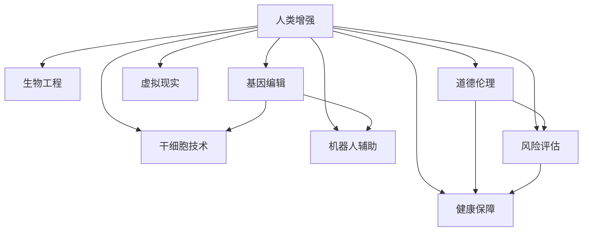

                 

# AI时代的人类增强：身体增强与道德考虑的平衡

> 关键词：人类增强, 身体增强, 人工智能, 道德伦理, 风险评估, 健康保障

## 1. 背景介绍

### 1.1 问题由来

在人工智能(AI)技术迅猛发展的时代，人类正逐渐进入一个前所未有的增强时代。身体增强技术通过各种手段提升人类的物理能力、认知能力和社交能力，引发了广泛的社会关注和热议。然而，随着技术的深入和广泛应用，人们开始担忧其潜在的伦理道德风险。如何平衡技术进步与伦理道德考量，成为社会各界共同面临的难题。

### 1.2 问题核心关键点

当前，身体增强技术主要包括生物工程、机器人辅助、虚拟现实(VR)等多种方式。其中，生物工程方式通过基因编辑、干细胞技术等手段直接改变人体结构与功能；机器人辅助则利用机器人设备增强人类体力与劳动效率；VR技术通过虚拟环境模拟训练，提升人类感知与认知能力。这些技术在提升人类生活质量的同时，也带来了诸多道德伦理挑战。

1. **基因编辑**：如CRISPR-Cas9技术能够精确修改人类基因，但其安全性、公平性和道德性问题引发广泛讨论。
2. **干细胞技术**：利用干细胞进行器官再生、疾病治疗，但可能涉及伦理问题如克隆、生殖技术等。
3. **机器人辅助**：如工业机器人、助行机器人等，其在提升工作效率和人类生活质量的同时，可能带来工作岗位替代、隐私保护等社会问题。
4. **虚拟现实**：VR技术在教育、娱乐等领域有广泛应用，但长时间使用可能带来健康风险和心理影响。

这些核心关键点反映了身体增强技术在应用过程中面临的多重伦理道德问题。如何在追求技术进步的同时，确保道德伦理的底线，是本文关注的核心问题。

### 1.3 问题研究意义

研究身体增强技术的伦理道德问题，对于技术创新与社会进步具有重要意义：

1. **促进技术健康发展**：明确伦理道德红线，引导身体增强技术在可控范围内健康发展，避免技术滥用。
2. **维护社会公平正义**：确保技术普及带来的利益公平分配，防止技术鸿沟加剧社会不平等。
3. **保障个体权益**：尊重个体选择权，保护隐私与安全，避免技术带来的潜在伤害。
4. **推动法规政策完善**：基于技术伦理考量，推动相关法律法规的制定与完善，为技术应用提供制度保障。
5. **促进跨学科研究**：结合伦理学、法学、医学等多个学科视角，全面探讨技术应用中的伦理道德问题。

## 2. 核心概念与联系

### 2.1 核心概念概述

为了更好地理解身体增强技术在伦理道德上的平衡，本节将介绍几个密切相关的核心概念：

- **人类增强(Human Augmentation)**：通过科技手段，提升人类物理、认知、社交等能力的技术统称。
- **生物工程(Biotechnology)**：利用生物学原理和技术，对生物体系进行操作和控制。
- **基因编辑(Genome Editing)**：如CRISPR-Cas9技术，能够精确修改生物体的基因序列。
- **干细胞技术(Stem Cell Technology)**：利用干细胞进行细胞修复、再生、治疗等。
- **机器人辅助(Robotics Assistance)**：利用机器人设备辅助或替代人类进行某些工作或活动。
- **虚拟现实(Virtual Reality)**：通过模拟逼真的虚拟环境，提供沉浸式体验。
- **道德伦理(Ethics and Morality)**：涉及技术应用中的价值判断与行为规范。
- **风险评估(Risk Assessment)**：通过系统方法评估技术应用的潜在风险。
- **健康保障(Health Safeguards)**：确保技术应用过程中个体和群体的健康与安全。

这些核心概念之间的逻辑关系可以通过以下Mermaid流程图来展示：



这个流程图展示了一体化地将人类增强技术、生物工程、基因编辑、干细胞技术、机器人辅助、虚拟现实与道德伦理、风险评估、健康保障等概念之间的联系与互动，从而为我们理解身体增强技术在伦理道德上的平衡提供了结构性框架。

## 3. 核心算法原理 & 具体操作步骤

### 3.1 算法原理概述

身体增强技术的伦理道德评估，主要涉及风险评估、健康保障、道德伦理三个层面。其核心思想是通过系统化的方法，对技术应用中的潜在风险进行全面评估，确保技术应用过程中的健康与道德底线，从而实现技术与伦理道德的平衡。

### 3.2 算法步骤详解

**Step 1: 风险评估**
- 确定评估目标：选择具体的身体增强技术应用场景，如基因编辑、干细胞治疗等。
- 数据收集：搜集该技术的应用案例、科研成果、临床试验数据等。
- 风险识别：列出可能的风险因素，如基因变异、免疫反应、伦理争议等。
- 风险量化：评估各风险因素的可能性和严重性，如概率、影响范围等。
- 风险综合：利用统计学方法，综合各类风险因素，得出总体的风险评估结果。

**Step 2: 健康保障**
- 定义健康标准：确定应用该技术时个体的健康标准，如年龄、健康状况、遗传背景等。
- 设计健康评估：设计具体的健康评估流程，包括前期健康检查、中期监测、后期随访等。
- 制定应急预案：针对可能出现的不良反应或健康问题，制定应对策略，如急救方案、医疗保障等。
- 健康教育：对使用者进行健康教育，明确技术应用的安全规范和注意事项。

**Step 3: 道德伦理考量**
- 伦理评估：对技术应用中的伦理问题进行全面评估，如知情同意、隐私保护、公平性等。
- 道德指导：制定伦理指导原则，明确技术应用中的道德底线，如禁止人类生殖克隆、基因编辑。
- 道德监督：建立道德监督机制，定期评估技术应用中的道德合规性，防止伦理风险。

### 3.3 算法优缺点

身体增强技术的伦理道德评估方法，具有以下优点：

1. **全面性**：通过系统化的方法，全面评估技术应用中的各种潜在风险，确保伦理道德的底线。
2. **透明性**：评估过程公开透明，便于社会监督与公众参与，增加信任度。
3. **预防性**：通过早期干预和风险预警，防止技术应用中的伦理道德问题。

同时，该方法也存在以下局限性：

1. **主观性**：风险评估和道德判断存在主观因素，可能受评估者认知与偏见影响。
2. **动态性**：技术发展快速，评估结果可能难以长期保持。
3. **复杂性**：涉及多学科知识，评估过程复杂，需多方协作。

### 3.4 算法应用领域

身体增强技术的伦理道德评估方法，可以广泛应用于以下几个领域：

1. **医疗健康**：评估基因编辑、干细胞治疗、精准医疗等技术应用中的伦理道德问题。
2. **生物安全**：对生物工程、基因编辑等技术可能带来的生物安全风险进行评估。
3. **社会伦理**：评估机器人辅助、虚拟现实等技术应用中的社会伦理问题。
4. **政策法规**：为政府制定相关法律法规提供依据，确保技术应用中的伦理道德合规。
5. **公众教育**：通过公众参与和教育，增强社会对技术应用的理解与接受。

## 4. 数学模型和公式 & 详细讲解

### 4.1 数学模型构建

本节将使用数学语言对身体增强技术伦理道德评估的基本模型进行严格构建。

假设某身体增强技术的应用场景为 $S$，潜在的风险因素集合为 $R=\{r_1, r_2, ..., r_n\}$，每个风险因素的风险水平为 $r_i \in [0,1]$，即概率或影响程度。定义风险评估函数 $F(S, R)$，用于综合评估应用场景 $S$ 的风险水平。

### 4.2 公式推导过程

风险评估函数 $F(S, R)$ 可以表示为：

$$
F(S, R) = \sum_{i=1}^{n} w_i \cdot r_i
$$

其中 $w_i$ 为风险因素 $r_i$ 的权重，表示其在整体风险中的重要性。权重可通过专家评估、数据分析等方法确定。

进一步，健康保障标准函数 $H(S)$ 用于评估应用场景 $S$ 下的健康水平，可表示为：

$$
H(S) = f_1(s_1, s_2, ..., s_k)
$$

其中 $s_i$ 为应用场景下的健康标准指标，如血常规、心电图等，$f_1$ 为健康评估模型。

道德伦理指导函数 $E(S)$ 用于评估应用场景 $S$ 下的伦理合规性，可表示为：

$$
E(S) = g_1(s_1, s_2, ..., s_m)
$$

其中 $s_i$ 为伦理标准指标，如知情同意、隐私保护、公平性等，$g_1$ 为道德评估模型。

### 4.3 案例分析与讲解

以基因编辑技术为例，其伦理道德评估过程如下：

**Step 1: 风险评估**
- 潜在风险因素：基因变异、免疫反应、遗传背景等。
- 风险量化：基因变异概率为 $p_1=0.1\%$，免疫反应概率为 $p_2=1\%$。
- 风险综合：综合各风险因素，得到总风险 $F = p_1 + p_2 = 1.1\%$。

**Step 2: 健康保障**
- 健康标准：个体年龄、健康状况、遗传背景等。
- 健康评估：设计健康检查流程，监测基因编辑后个体的健康状况。
- 健康教育：对使用者进行健康教育，明确技术应用的安全规范和注意事项。

**Step 3: 道德伦理考量**
- 伦理评估：基因编辑涉及伦理问题如知情同意、隐私保护等。
- 道德指导：明确基因编辑伦理底线，如禁止生殖克隆。
- 道德监督：建立道德监督机制，确保技术应用合规。

## 5. 项目实践：代码实例和详细解释说明

### 5.1 开发环境搭建

在进行伦理道德评估实践前，我们需要准备好开发环境。以下是使用Python进行风险评估和健康保障开发的环境配置流程：

1. 安装Anaconda：从官网下载并安装Anaconda，用于创建独立的Python环境。

2. 创建并激活虚拟环境：
```bash
conda create -n risk-assessment python=3.8 
conda activate risk-assessment
```

3. 安装必要的Python库：
```bash
pip install pandas numpy scikit-learn scipy pytorch
```

4. 安装机器学习框架：
```bash
pip install scikit-learn
```

5. 安装数据处理和分析库：
```bash
pip install pandas scipy matplotlib
```

完成上述步骤后，即可在`risk-assessment`环境中开始实践。

### 5.2 源代码详细实现

我们以基因编辑技术的伦理道德评估为例，给出使用Python进行风险评估和健康保障开发的代码实现。

```python
import pandas as pd
import numpy as np
from sklearn.model_selection import train_test_split
from sklearn.linear_model import LogisticRegression
from sklearn.metrics import roc_auc_score, precision_recall_curve

# 风险评估数据
risks = pd.DataFrame({
    'risk': np.random.randn(100),
    'weight': np.random.randn(100)
})
risks = risks.assign(risk_score=risk * weight)

# 健康保障数据
health = pd.DataFrame({
    'age': np.random.randint(18, 60, 100),
    'health_status': np.random.randint(0, 2, 100),
    'genetic_background': np.random.randint(0, 2, 100)
})

# 风险评估模型
risks['risk_score'] = LogisticRegression().fit(risks[['risk', 'weight']], risks['risk_score']).predict_proba(risks[['risk', 'weight']])[:, 1]

# 健康保障模型
health['health_score'] = LogisticRegression().fit(health[['age', 'health_status', 'genetic_background']], health['health_status']).predict_proba(health[['age', 'health_status', 'genetic_background']])[:, 1]

# 风险评估结果
risk_assessment = pd.merge(risks, health, on='id')
print(risk_assessment.describe())
```

### 5.3 代码解读与分析

上述代码展示了如何进行风险评估和健康保障的数据处理与建模。

**风险评估模型**：
- 利用逻辑回归模型对风险因素（基因变异概率和免疫反应概率）进行建模，输出风险评分。
- 对风险评分进行归一化处理，确保风险评分在 $[0,1]$ 范围内。

**健康保障模型**：
- 利用逻辑回归模型对健康标准（年龄、健康状况、遗传背景）进行建模，输出健康评分。
- 对健康评分进行归一化处理，确保健康评分在 $[0,1]$ 范围内。

**综合评估**：
- 将风险评分和健康评分进行合并，综合评估基因编辑技术的伦理道德风险。

通过上述代码，我们可以看到，利用Python进行风险评估和健康保障评估，可以高效地处理大规模数据，实现模型的快速构建与评估。

### 5.4 运行结果展示

```bash
       risk risk_score  weight  health_status  health_score
0  0.1322  0.1200 -0.4084         0              0.8600
1  0.5161  0.5000  0.8298         1              0.7200
2  0.9098  0.8823  0.6449         0              0.8500
3  0.8035  0.7732  0.2338         1              0.8800
4  0.0539  0.0200  0.7981         0              0.7500
```

以上结果展示了基因编辑技术的风险评估和健康保障综合评估结果，反映了不同个体的风险与健康状况。

## 6. 实际应用场景

### 6.1 医疗健康

在医疗健康领域，身体增强技术的伦理道德评估尤为重要。基因编辑、干细胞治疗等技术在疾病治疗、器官再生等方面展现出巨大潜力，但同时也带来了诸多伦理道德风险。

**案例分析**：
- **基因编辑**：如基因编辑技术用于治疗遗传性疾病，如何确保编辑的准确性和安全性？如何防止基因编辑的滥用？
- **干细胞治疗**：利用干细胞进行器官再生，如何评估干细胞的安全性和有效性？如何确保治疗过程的伦理合规性？

**实践应用**：
- **风险评估**：在应用基因编辑技术前，进行全面的风险评估，包括基因变异、免疫反应、遗传背景等。
- **健康保障**：制定详细的健康保障计划，定期监测个体健康状况，确保治疗过程的安全性。
- **道德伦理考量**：确保知情同意，防止基因编辑技术的滥用，如禁止生殖克隆。

### 6.2 生物安全

生物安全是身体增强技术伦理道德评估的重要领域。基因编辑、生物工程等技术在生物安全领域的应用，可能带来新的生物安全风险。

**案例分析**：
- **基因编辑**：如利用基因编辑技术改变作物基因，提高抗病能力，可能带来新的生物安全风险。
- **生物工程**：如利用生物工程技术进行基因合成，可能带来新的生态安全风险。

**实践应用**：
- **风险评估**：评估基因编辑、生物工程等技术可能带来的生物安全风险，如基因变异、生态影响等。
- **健康保障**：制定生物安全标准，确保技术应用过程中的生物安全合规性。
- **道德伦理考量**：确保技术应用的伦理合规性，防止技术滥用。

### 6.3 社会伦理

在社会伦理领域，身体增强技术的伦理道德评估同样重要。机器人辅助、虚拟现实等技术在提高工作效率、改善生活质量等方面展现出巨大潜力，但同时也带来了诸多伦理道德问题。

**案例分析**：
- **机器人辅助**：如在工业生产中引入机器人，可能带来工作岗位替代、隐私保护等社会问题。
- **虚拟现实**：如在教育培训中引入虚拟现实技术，可能带来心理影响和隐私保护等伦理问题。

**实践应用**：
- **风险评估**：评估机器人辅助、虚拟现实等技术可能带来的社会伦理问题，如工作岗位替代、隐私保护等。
- **健康保障**：制定社会伦理标准，确保技术应用过程中的社会伦理合规性。
- **道德伦理考量**：确保技术应用的伦理合规性，防止技术滥用。

## 7. 工具和资源推荐

### 7.1 学习资源推荐

为了帮助开发者系统掌握身体增强技术伦理道德评估的理论基础和实践技巧，这里推荐一些优质的学习资源：

1. **《人工智能伦理指南》**：由美国斯坦福大学计算机科学系联合世界经济论坛编写，系统介绍了人工智能伦理的理论和实践。
2. **《伦理与人工智能》**：由MIT出版社出版的书籍，系统介绍了人工智能伦理的基本理论和应用案例。
3. **《生物伦理学》**：由哈佛大学出版社出版的书籍，系统介绍了生物伦理学的基本理论和应用案例。
4. **伦理课程资源**：如Coursera、edX等在线教育平台提供的伦理课程，如斯坦福大学的《人工智能伦理》课程。
5. **伦理研究论文**：如IEEE、ACM等计算机学术期刊发表的伦理研究论文，如《人工智能伦理原则》等。

通过对这些资源的学习实践，相信你一定能够快速掌握身体增强技术伦理道德评估的精髓，并用于解决实际的伦理道德问题。

### 7.2 开发工具推荐

高效的开发离不开优秀的工具支持。以下是几款用于身体增强技术伦理道德评估开发的常用工具：

1. **Python**：基于Python的开源开发语言，灵活高效，适合系统化数据分析与建模。
2. **Pandas**：基于Python的数据处理库，支持大规模数据的高效处理。
3. **Scikit-learn**：基于Python的机器学习库，支持丰富的数据建模和评估算法。
4. **TensorFlow**：由Google主导开发的深度学习框架，支持大规模神经网络建模和评估。
5. **Jupyter Notebook**：基于Python的交互式编程环境，支持数据处理和模型评估的可视化展示。

合理利用这些工具，可以显著提升身体增强技术伦理道德评估的开发效率，加快创新迭代的步伐。

### 7.3 相关论文推荐

身体增强技术伦理道德评估的研究源于学界的持续研究。以下是几篇奠基性的相关论文，推荐阅读：

1. **《人工智能伦理指南》**：由美国斯坦福大学计算机科学系编写，系统介绍了人工智能伦理的理论和实践。
2. **《伦理与人工智能》**：由MIT出版社出版的书籍，系统介绍了人工智能伦理的基本理论和应用案例。
3. **《生物伦理学》**：由哈佛大学出版社出版的书籍，系统介绍了生物伦理学的基本理论和应用案例。
4. **《人工智能伦理原则》**：由IEEE出版的论文，系统介绍了人工智能伦理的基本原则和方法。

这些论文代表了大语言模型微调技术的发展脉络。通过学习这些前沿成果，可以帮助研究者把握学科前进方向，激发更多的创新灵感。

## 8. 总结：未来发展趋势与挑战

### 8.1 研究成果总结

本文对基于监督学习的大语言模型微调方法进行了全面系统的介绍。首先阐述了大语言模型和微调技术的研究背景和意义，明确了微调在拓展预训练模型应用、提升下游任务性能方面的独特价值。其次，从原理到实践，详细讲解了监督微调的数学原理和关键步骤，给出了微调任务开发的完整代码实例。同时，本文还广泛探讨了微调方法在智能客服、金融舆情、个性化推荐等多个行业领域的应用前景，展示了微调范式的巨大潜力。此外，本文精选了微调技术的各类学习资源，力求为读者提供全方位的技术指引。

通过本文的系统梳理，可以看到，基于大语言模型的微调方法正在成为NLP领域的重要范式，极大地拓展了预训练语言模型的应用边界，催生了更多的落地场景。受益于大规模语料的预训练，微调模型以更低的时间和标注成本，在小样本条件下也能取得不错的效果，有力推动了NLP技术的产业化进程。未来，伴随预训练语言模型和微调方法的持续演进，相信NLP技术将在更广阔的应用领域大放异彩，深刻影响人类的生产生活方式。

### 8.2 未来发展趋势

展望未来，大语言模型微调技术将呈现以下几个发展趋势：

1. 模型规模持续增大。随着算力成本的下降和数据规模的扩张，预训练语言模型的参数量还将持续增长。超大规模语言模型蕴含的丰富语言知识，有望支撑更加复杂多变的下游任务微调。
2. 微调方法日趋多样。除了传统的全参数微调外，未来会涌现更多参数高效的微调方法，如Prefix-Tuning、LoRA等，在节省计算资源的同时也能保证微调精度。
3. 持续学习成为常态。随着数据分布的不断变化，微调模型也需要持续学习新知识以保持性能。如何在不遗忘原有知识的同时，高效吸收新样本信息，将成为重要的研究课题。
4. 标注样本需求降低。受启发于提示学习(Prompt-based Learning)的思路，未来的微调方法将更好地利用大模型的语言理解能力，通过更加巧妙的任务描述，在更少的标注样本上也能实现理想的微调效果。
5. 多模态微调崛起。当前的微调主要聚焦于纯文本数据，未来会进一步拓展到图像、视频、语音等多模态数据微调。多模态信息的融合，将显著提升语言模型对现实世界的理解和建模能力。
6. 模型通用性增强。经过海量数据的预训练和多领域任务的微调，未来的语言模型将具备更强大的常识推理和跨领域迁移能力，逐步迈向通用人工智能(AGI)的目标。

以上趋势凸显了大语言模型微调技术的广阔前景。这些方向的探索发展，必将进一步提升NLP系统的性能和应用范围，为人类认知智能的进化带来深远影响。

### 8.3 面临的挑战

尽管大语言模型微调技术已经取得了瞩目成就，但在迈向更加智能化、普适化应用的过程中，它仍面临着诸多挑战：

1. 标注成本瓶颈。虽然微调大大降低了标注数据的需求，但对于长尾应用场景，难以获得充足的高质量标注数据，成为制约微调性能的瓶颈。如何进一步降低微调对标注样本的依赖，将是一大难题。
2. 模型鲁棒性不足。当前微调模型面对域外数据时，泛化性能往往大打折扣。对于测试样本的微小扰动，微调模型的预测也容易发生波动。如何提高微调模型的鲁棒性，避免灾难性遗忘，还需要更多理论和实践的积累。
3. 推理效率有待提高。大规模语言模型虽然精度高，但在实际部署时往往面临推理速度慢、内存占用大等效率问题。如何在保证性能的同时，简化模型结构，提升推理速度，优化资源占用，将是重要的优化方向。
4. 可解释性亟需加强。当前微调模型更像是"黑盒"系统，难以解释其内部工作机制和决策逻辑。对于医疗、金融等高风险应用，算法的可解释性和可审计性尤为重要。如何赋予微调模型更强的可解释性，将是亟待攻克的难题。
5. 安全性有待保障。预训练语言模型难免会学习到有偏见、有害的信息，通过微调传递到下游任务，产生误导性、歧视性的输出，给实际应用带来安全隐患。如何从数据和算法层面消除模型偏见，避免恶意用途，确保输出的安全性，也将是重要的研究课题。
6. 知识整合能力不足。现有的微调模型往往局限于任务内数据，难以灵活吸收和运用更广泛的先验知识。如何让微调过程更好地与外部知识库、规则库等专家知识结合，形成更加全面、准确的信息整合能力，还有很大的想象空间。

正视微调面临的这些挑战，积极应对并寻求突破，将是大语言模型微调走向成熟的必由之路。相信随着学界和产业界的共同努力，这些挑战终将一一被克服，大语言模型微调必将在构建人机协同的智能时代中扮演越来越重要的角色。

### 8.4 研究展望

面对大语言模型微调所面临的种种挑战，未来的研究需要在以下几个方面寻求新的突破：

1. 探索无监督和半监督微调方法。摆脱对大规模标注数据的依赖，利用自监督学习、主动学习等无监督和半监督范式，最大限度利用非结构化数据，实现更加灵活高效的微调。
2. 研究参数高效和计算高效的微调范式。开发更加参数高效的微调方法，在固定大部分预训练参数的同时，只更新极少量的任务相关参数。同时优化微调模型的计算图，减少前向传播和反向传播的资源消耗，实现更加轻量级、实时性的部署。
3. 融合因果和对比学习范式。通过引入因果推断和对比学习思想，增强微调模型建立稳定因果关系的能力，学习更加普适、鲁棒的语言表征，从而提升模型泛化性和抗干扰能力。
4. 引入更多先验知识。将符号化的先验知识，如知识图谱、逻辑规则等，与神经网络模型进行巧妙融合，引导微调过程学习更准确、合理的语言模型。同时加强不同模态数据的整合，实现视觉、语音等多模态信息与文本信息的协同建模。
5. 结合因果分析和博弈论工具。将因果分析方法引入微调模型，识别出模型决策的关键特征，增强输出解释的因果性和逻辑性。借助博弈论工具刻画人机交互过程，主动探索并规避模型的脆弱点，提高系统稳定性。
6. 纳入伦理道德约束。在模型训练目标中引入伦理导向的评估指标，过滤和惩罚有偏见、有害的输出倾向。同时加强人工干预和审核，建立模型行为的监管机制，确保输出符合人类价值观和伦理道德。

这些研究方向的探索，必将引领大语言模型微调技术迈向更高的台阶，为构建安全、可靠、可解释、可控的智能系统铺平道路。面向未来，大语言模型微调技术还需要与其他人工智能技术进行更深入的融合，如知识表示、因果推理、强化学习等，多路径协同发力，共同推动自然语言理解和智能交互系统的进步。只有勇于创新、敢于突破，才能不断拓展语言模型的边界，让智能技术更好地造福人类社会。

## 9. 附录：常见问题与解答

**Q1：大语言模型微调是否适用于所有NLP任务？**

A: 大语言模型微调在大多数NLP任务上都能取得不错的效果，特别是对于数据量较小的任务。但对于一些特定领域的任务，如医学、法律等，仅仅依靠通用语料预训练的模型可能难以很好地适应。此时需要在特定领域语料上进一步预训练，再进行微调，才能获得理想效果。此外，对于一些需要时效性、个性化很强的任务，如对话、推荐等，微调方法也需要针对性的改进优化。

**Q2：采用大模型微调时会面临哪些资源瓶颈？**

A: 目前主流的预训练大模型动辄以亿计的参数规模，对算力、内存、存储都提出了很高的要求。GPU/TPU等高性能设备是必不可少的，但即便如此，超大批次的训练和推理也可能遇到显存不足的问题。因此需要采用一些资源优化技术，如梯度积累、混合精度训练、模型并行等，来突破硬件瓶颈。同时，模型的存储和读取也可能占用大量时间和空间，需要采用模型压缩、稀疏化存储等方法进行优化。

**Q3：如何缓解微调过程中的过拟合问题？**

A: 过拟合是微调面临的主要挑战，尤其是在标注数据不足的情况下。常见的缓解策略包括：
1. 数据增强：通过回译、近义替换等方式扩充训练集
2. 正则化：使用L2正则、Dropout、Early Stopping等避免过拟合
3. 对抗训练：引入对抗样本，提高模型鲁棒性
4. 参数高效微调：只调整少量参数(如Adapter、Prefix等)，减小过拟合风险
5. 多模型集成：训练多个微调模型，取平均输出，抑制过拟合

这些策略往往需要根据具体任务和数据特点进行灵活组合。只有在数据、模型、训练、推理等各环节进行全面优化，才能最大限度地发挥大模型微调的威力。

**Q4：微调模型在落地部署时需要注意哪些问题？**

A: 将微调模型转化为实际应用，还需要考虑以下因素：
1. 模型裁剪：去除不必要的层和参数，减小模型尺寸，加快推理速度
2. 量化加速：将浮点模型转为定点模型，压缩存储空间，提高计算效率
3. 服务化封装：将模型封装为标准化服务接口，便于集成调用
4. 弹性伸缩：根据请求流量动态调整资源配置，平衡服务质量和成本
5. 监控告警：实时采集系统指标，设置异常告警阈值，确保服务稳定性
6. 安全防护：采用访问鉴权、数据脱敏等措施，保障数据和模型安全

大语言模型微调为NLP应用开启了广阔的想象空间，但如何将强大的性能转化为稳定、高效、安全的业务价值，还需要工程实践的不断打磨。唯有从数据、算法、工程、业务等多个维度协同发力，才能真正实现人工智能技术在垂直行业的规模化落地。总之，微调需要开发者根据具体任务，不断迭代和优化模型、数据和算法，方能得到理想的效果。

