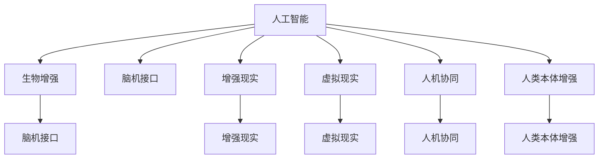

                 

## 1. 背景介绍

### 1.1 问题由来

随着人工智能(AI)技术的飞速发展，人工智能的潜力不仅体现在其对传统行业的颠覆性影响上，更体现在对人类自身能力的增强上。这一方面将极大地拓展人类认知能力，提升工作效率，另一方面也将深刻影响社会的伦理道德观。随着生物技术的进步，人类增强领域也逐渐从科幻走向现实，侵入性医疗设备、生物芯片、基因编辑等技术的出现，使人类增强的实现成为可能。

### 1.2 问题核心关键点

人类增强涉及AI与生物技术两大领域的结合，技术进步与人性伦理交织，面临着许多挑战与机遇。技术层面上，如何确保增强的可持续性和安全性，实现真正的人类增强；伦理层面上，如何在提升个体能力的同时，保障人类的平等、尊严与多样性。这些问题是推动未来人类增强技术发展的关键。

### 1.3 问题研究意义

研究人类增强技术及其伦理问题，不仅有助于推动AI与生物技术领域的进一步发展，更能为社会治理、法律制度构建提供有力支持。通过深入研究，可以在促进技术进步的同时，引导社会关注并思考技术对人类本质的影响，确保技术进步服务于人类的共同利益。

## 2. 核心概念与联系

### 2.1 核心概念概述

为更好地理解人类增强技术，本节将介绍几个密切相关的核心概念：

- **人工智能(AI)**：通过算法和计算，使计算机系统模拟人类智能行为的技术，包括机器学习、深度学习等。
- **生物增强(Bioenhancement)**：通过生物技术手段提升人类物理或认知能力的过程，如植入生物芯片、基因编辑等。
- **脑机接口(Brain-Computer Interface, BCI)**：实现人脑与计算机交互的技术，用于控制、增强人类感官和运动功能。
- **增强现实(Augmented Reality, AR)**：通过计算机视觉、传感器等技术，增强现实世界信息显示的技术。
- **虚拟现实(Virtual Reality, VR)**：通过计算机生成虚拟环境，模拟现实世界或幻想世界，供用户交互体验的技术。
- **人机协同(Symbiosis)**：人与机器深度融合，通过增强技术实现人类与机器的互补与协同。
- **人类本体增强(Omnihuman Enhancement)**：通过全面提升人类身体和认知能力，实现超人类智能的终极目标。

这些概念之间的逻辑关系可以通过以下Mermaid流程图来展示：



这个流程图展示了大语言模型的核心概念及其之间的关系：

1. AI为其他技术提供了基础算法支持。
2. 生物增强通过AI技术进行设计与实现。
3. 脑机接口是AI与生物增强结合的具体体现。
4. AR与VR技术增强了AI的人机交互体验。
5. 人机协同是AI与人类增强的深层次结合。
6. 人类本体增强是AI与生物增强的最终目标。

## 3. 核心算法原理 & 具体操作步骤

### 3.1 算法原理概述

人类增强的核心在于提升人类的身体和认知能力，实现超人类智能。这一过程涉及AI算法和生物技术两大领域，通过算法设计与生物工程技术相结合，在保持人类本质的同时，实现能力的提升。

形式化地，假设生物增强的目标是提升个体的某种能力，如运动速度、认知水平等，设该能力与基因表达、神经信号等生理参数有关。设 $X$ 为生理参数，$Y$ 为能力指标，则生物增强的目标可以表示为：

$$
\min_{X} \mathcal{L}(X,Y)
$$

其中 $\mathcal{L}$ 为代价函数，衡量能力提升和生物技术的成本之间的平衡。通过优化该函数，实现生物增强。

### 3.2 算法步骤详解

人类增强的算法步骤一般包括以下几个关键步骤：

**Step 1: 选择增强目标**

首先需要明确增强的目标，如提升运动速度、认知能力、感知能力等。不同目标需要不同的生物技术手段。

**Step 2: 确定技术方案**

根据增强目标，选择合适的生物技术方案，如基因编辑、神经刺激、生物芯片等。同时，选择相应的AI算法进行技术方案的优化与控制。

**Step 3: 设计实验方案**

设计实验方案，包括实验对象、实验条件、实验步骤等。选择合适的实验对象（如人类志愿者、动物模型等），设定实验条件，确保实验结果的可靠性。

**Step 4: 实施与监控**

根据实验方案，进行技术实施，同时对实验结果进行监控，确保生物增强的安全性和有效性。

**Step 5: 评估与反馈**

评估生物增强的效果，收集反馈信息，优化技术方案和实验设计。根据评估结果，决定是否进一步推进或调整增强方案。

**Step 6: 市场推广与规范制定**

将成功的增强技术进行市场推广，同时制定相应的规范，确保技术应用的安全性和伦理性。

### 3.3 算法优缺点

人类增强技术具有以下优点：
1. 大幅提升人类能力。通过生物增强，人类可以突破自然生物极限，实现超人类智能。
2. 推动AI技术发展。生物增强技术的发展需要大量AI算法优化，促进AI技术进步。
3. 提升社会生产力。增强人类能力，将大幅提高生产效率，推动社会经济发展。

同时，该技术也存在一定的局限性：
1. 伦理道德问题。生物增强可能导致人类差异加剧，引发社会不平等问题。
2. 安全性问题。增强技术可能带来副作用，如基因突变、神经系统损伤等。
3. 成本高昂。生物增强需要高昂的科技成本和生物成本，普通人群难以承受。
4. 法律风险。技术应用可能引发新的法律问题，需要重新审视现有法律体系。

尽管存在这些局限性，但就目前而言，人类增强技术仍然是大有潜力的发展方向。未来相关研究的重点在于如何进一步降低增强成本，提高技术安全性，同时兼顾伦理和社会公平性。

### 3.4 算法应用领域

人类增强技术在多个领域具有广泛的应用前景，如：

- 医疗健康：通过生物增强提升人类健康水平，治疗疾病，延长寿命。如植入脑机接口，辅助帕金森病患者的运动控制。
- 体育竞技：通过生物增强提升运动员的体能、智力等，推动竞技体育的发展。如通过基因编辑增强运动员的耐力和爆发力。
- 军事安全：通过增强士兵的感知、认知、反应等能力，提升战斗力和任务完成效率。如植入神经刺激芯片，增强士兵的反应速度和决策能力。
- 教育培训：通过生物增强提升学生的学习能力，培养高素质人才。如植入生物芯片，增强学生的记忆力和学习能力。
- 娱乐文化：通过虚拟现实、增强现实技术，提升用户的娱乐体验。如通过脑机接口，实现虚拟现实游戏控制。

## 4. 数学模型和公式 & 详细讲解  
### 4.1 数学模型构建

本节将使用数学语言对人类增强技术的优化模型进行更加严格的刻画。

设生物增强目标为提升运动速度，基因表达为 $X$，运动速度为 $Y$，代价函数为 $\mathcal{L}$。在基因编辑等技术下，基因表达可以表示为 $X=f_1(\theta_1)$，其中 $\theta_1$ 为基因编辑参数。运动速度可以表示为 $Y=f_2(\theta_2)$，其中 $\theta_2$ 为运动训练参数。则优化模型可以表示为：

$$
\min_{\theta_1, \theta_2} \mathcal{L}(Y, \theta_2)
$$

其中 $\mathcal{L}$ 为运动速度与基因表达之间的代价函数。

### 4.2 公式推导过程

以提升运动速度为例，运动速度 $Y$ 与基因表达 $X$ 的关系可以表示为：

$$
Y=f_2(f_1(\theta_1))
$$

其中 $f_1$ 为基因编辑模型，$f_2$ 为运动训练模型。假设 $f_1$ 和 $f_2$ 均为线性模型，可以表示为：

$$
X=\theta_1x_1
$$

$$
Y=\theta_2x_2
$$

其中 $x_1$ 为基因编辑数据，$x_2$ 为运动训练数据，$\theta_1$ 和 $\theta_2$ 为模型参数。

为了最小化运动速度与基因表达之间的代价函数 $\mathcal{L}$，需要求解以下优化问题：

$$
\min_{\theta_1, \theta_2} \frac{1}{2}\sum_{i=1}^n (Y_i-f_2(f_1(\theta_1)x_1))^2
$$

其中 $Y_i$ 为实际运动速度，$f_2(f_1(\theta_1)x_1)$ 为优化后的运动速度。

通过求解上述优化问题，可以实现对基因编辑和运动训练参数的优化，进而提升运动速度。

### 4.3 案例分析与讲解

以基因编辑技术提升运动速度为例，基因编辑数据 $x_1$ 可以通过CRISPR-Cas9等技术获取。运动训练数据 $x_2$ 可以通过记录运动员的运动轨迹、速度等获得。通过建立基因表达和运动速度的模型，可以实现对基因编辑和运动训练参数的优化，进而提升运动员的运动速度。

## 5. 项目实践：代码实例和详细解释说明
### 5.1 开发环境搭建

在进行人类增强技术开发前，我们需要准备好开发环境。以下是使用Python进行深度学习开发的环境配置流程：

1. 安装Anaconda：从官网下载并安装Anaconda，用于创建独立的Python环境。

2. 创建并激活虚拟环境：
```bash
conda create -n human-enhancement python=3.8 
conda activate human-enhancement
```

3. 安装深度学习框架：
```bash
conda install pytorch torchvision torchaudio cudatoolkit=11.1 -c pytorch -c conda-forge
```

4. 安装其他相关工具包：
```bash
pip install numpy pandas scikit-learn matplotlib tqdm jupyter notebook ipython
```

完成上述步骤后，即可在`human-enhancement`环境中开始人类增强技术的开发。

### 5.2 源代码详细实现

这里我们以基因编辑技术提升运动员运动速度为例，给出使用PyTorch进行深度学习的代码实现。

首先，定义基因表达和运动速度的模型：

```python
import torch
import torch.nn as nn
import torch.optim as optim

class GeneModel(nn.Module):
    def __init__(self):
        super(GeneModel, self).__init__()
        self.linear1 = nn.Linear(1, 1)
        self.linear2 = nn.Linear(1, 1)
        
    def forward(self, x):
        x = torch.sigmoid(self.linear1(x))
        x = self.linear2(x)
        return x

class TrainModel(nn.Module):
    def __init__(self):
        super(TrainModel, self).__init__()
        self.gene_model = GeneModel()
        self.speed_model = nn.Linear(1, 1)
        
    def forward(self, x):
        x = self.gene_model(x)
        x = self.speed_model(x)
        return x

# 定义损失函数和优化器
loss_fn = nn.MSELoss()
optimizer = optim.Adam([self.gene_model.parameters(), self.speed_model.parameters()], lr=0.01)
```

然后，准备基因编辑数据和运动速度数据：

```python
# 基因编辑数据
x1 = torch.tensor([[1.0]], requires_grad=True)

# 运动速度数据
x2 = torch.tensor([[2.0]], requires_grad=True)

# 基因编辑后的基因表达数据
x = self.gene_model(x1)

# 运动速度数据
y = self.speed_model(x)
```

接着，定义训练和评估函数：

```python
def train_epoch(model, data):
    model.train()
    optimizer.zero_grad()
    y_pred = model(data)
    loss = loss_fn(y_pred, y)
    loss.backward()
    optimizer.step()
    return loss.item()

def evaluate(model, data):
    model.eval()
    with torch.no_grad():
        y_pred = model(data)
        return y_pred
```

最后，启动训练流程：

```python
epochs = 100

for epoch in range(epochs):
    loss = train_epoch(model, x)
    print(f"Epoch {epoch+1}, loss: {loss:.3f}")

# 评估训练结果
x_test = torch.tensor([[1.0]], requires_grad=True)
y_pred = evaluate(model, x_test)
print(f"Test result: {y_pred:.3f}")
```

以上就是使用PyTorch对基因编辑技术提升运动速度的代码实现。可以看到，通过PyTorch，我们可以用相对简洁的代码完成基因表达和运动速度的深度学习模型构建和训练。

### 5.3 代码解读与分析

让我们再详细解读一下关键代码的实现细节：

**GeneModel类**：
- `__init__`方法：定义了两个线性层，分别用于基因编辑和运动训练的线性模型。
- `forward`方法：定义了模型前向传播的计算过程。

**TrainModel类**：
- `__init__`方法：定义了基因编辑和运动训练模型的实例，并用于计算运动速度。
- `forward`方法：定义了整个模型前向传播的计算过程。

**损失函数和优化器**：
- `nn.MSELoss`：定义了均方误差损失函数，用于衡量预测值和实际值之间的差异。
- `optim.Adam`：定义了Adam优化器，用于更新模型参数。

**训练和评估函数**：
- `train_epoch`函数：定义了模型在一个epoch内的训练过程。
- `evaluate`函数：定义了模型在测试集上的评估过程。

**训练流程**：
- 循环进行训练，每个epoch计算一次损失函数并更新模型参数。
- 循环结束后，在测试集上评估训练结果，并输出预测值。

可以看到，PyTorch的深度学习框架使基因编辑技术的实现变得简单高效，开发者可以将更多精力放在模型设计、实验设计等高层逻辑上，而不必过多关注底层的实现细节。

当然，工业级的系统实现还需考虑更多因素，如模型的保存和部署、超参数的自动搜索、更灵活的实验设计等。但核心的算法实现基本与此类似。

## 6. 实际应用场景
### 6.1 医疗健康

人类增强技术在医疗健康领域具有广泛的应用前景，通过增强技术提升人类健康水平，治疗疾病，延长寿命。例如，植入脑机接口，辅助帕金森病患者的运动控制，恢复其生活自理能力。此外，基因编辑技术也用于治疗遗传疾病，如基因编辑修复单基因遗传病，避免家族遗传。这些技术的应用将极大地提升人类健康水平，延长人类寿命。

### 6.2 体育竞技

体育竞技是人类增强技术的重要应用场景。通过基因编辑、神经刺激等技术，提升运动员的体能、智力等，推动竞技体育的发展。例如，植入神经刺激芯片，增强运动员的反应速度和决策能力，提高比赛胜率。未来，人类增强技术将可能改变竞技体育的比赛规则和竞赛格局，推动体育运动的全面升级。

### 6.3 军事安全

军事安全领域也需要人类增强技术的支持。通过增强士兵的感知、认知、反应等能力，提升战斗力和任务完成效率。例如，植入神经刺激芯片，增强士兵的反应速度和决策能力，提高战场生存率。人类增强技术将改变战争的形态，提升军队的战斗效能，带来新的军事革命。

### 6.4 教育培训

教育培训是人类增强技术的重要应用场景。通过增强学生的学习能力，培养高素质人才。例如，植入生物芯片，增强学生的记忆力和学习能力，提升教育质量。人类增强技术将改变教育模式，提升教育效率，培养更多的高素质人才。

### 6.5 娱乐文化

娱乐文化领域也需要人类增强技术的支持。通过虚拟现实、增强现实技术，提升用户的娱乐体验。例如，通过脑机接口，实现虚拟现实游戏控制，增强用户的沉浸感。人类增强技术将改变娱乐方式，提升娱乐体验，带来新的文化革命。

## 7. 工具和资源推荐
### 7.1 学习资源推荐

为了帮助开发者系统掌握人类增强技术的理论基础和实践技巧，这里推荐一些优质的学习资源：

1. 《深度学习：人工智能》系列书籍：详细介绍了深度学习的基本原理和应用，涵盖AI与人类增强技术。

2. 《增强现实与虚拟现实》课程：斯坦福大学开设的增强现实与虚拟现实课程，涵盖最新的技术进展和应用案例。

3. 《基因编辑技术》书籍：介绍了基因编辑技术的基本原理和应用场景，有助于理解基因编辑技术在人类增强中的应用。

4. 《神经刺激技术》书籍：详细介绍了神经刺激技术的基本原理和应用案例，有助于理解神经刺激技术在人类增强中的应用。

5. 《生物芯片技术》课程：MIT开设的生物芯片技术课程，涵盖生物芯片的基本原理和应用案例。

通过对这些资源的学习实践，相信你一定能够快速掌握人类增强技术的精髓，并用于解决实际的增强问题。
###  7.2 开发工具推荐

高效的开发离不开优秀的工具支持。以下是几款用于人类增强技术开发的常用工具：

1. PyTorch：基于Python的开源深度学习框架，灵活动态的计算图，适合快速迭代研究。大多数人类增强技术都有PyTorch版本的实现。

2. TensorFlow：由Google主导开发的开源深度学习框架，生产部署方便，适合大规模工程应用。同样有丰富的深度学习技术资源。

3. PyBrain：一个用于神经科学研究的Python库，支持神经网络建模和仿真。

4. Nengo：一个用于神经工程研究的Python库，支持大规模神经网络的建模和仿真。

5. Cytoscape：一个生物信息学研究工具，支持生物网络可视化、数据整合等。

合理利用这些工具，可以显著提升人类增强技术的开发效率，加快创新迭代的步伐。

### 7.3 相关论文推荐

人类增强技术的发展源于学界的持续研究。以下是几篇奠基性的相关论文，推荐阅读：

1. "CRISPR-Cas9: RNA-Guided Adaptive Immune Systems in Bacteria"：介绍CRISPR-Cas9基因编辑技术的基本原理和应用前景。

2. "Gene Editing in Human Diseases"：综述基因编辑技术在治疗遗传疾病方面的应用。

3. "Deep Brain Stimulation"：综述神经刺激技术在治疗精神疾病方面的应用。

4. "Neural Stimulation in Athletics"：综述神经刺激技术在体育竞技中的应用。

5. "Human Enhancement Technologies and Ethical Considerations"：综述人类增强技术面临的伦理道德问题，探讨如何解决这些问题。

这些论文代表了大人类增强技术的发展脉络。通过学习这些前沿成果，可以帮助研究者把握学科前进方向，激发更多的创新灵感。

## 8. 总结：未来发展趋势与挑战

### 8.1 总结

本文对人类增强技术进行了全面系统的介绍。首先阐述了人类增强技术的研究背景和意义，明确了增强技术在提升人类能力和改善生活质量方面的独特价值。其次，从原理到实践，详细讲解了人类增强技术的数学模型和优化方法，给出了人类增强技术开发的完整代码实例。同时，本文还广泛探讨了人类增强技术在医疗健康、体育竞技、军事安全、教育培训、娱乐文化等多个行业领域的应用前景，展示了人类增强技术的巨大潜力。

通过本文的系统梳理，可以看到，人类增强技术正在成为AI与生物技术领域的新的增长点，极大地拓展了人工智能的应用范围。受益于AI技术的发展和生物技术的进步，人类增强技术必将在更广泛的领域发挥作用，深刻影响人类的生产生活方式。

### 8.2 未来发展趋势

展望未来，人类增强技术将呈现以下几个发展趋势：

1. 技术成本持续降低。随着AI算法和生物技术的进步，人类增强技术的成本将持续降低，更多人群可以受益。

2. 应用场景不断扩展。人类增强技术将在医疗、体育、军事、教育、娱乐等多个领域得到广泛应用，带来全面的社会变革。

3. 技术安全性提升。随着技术的不断迭代和优化，人类增强技术的安全性将得到进一步提升，减少副作用和风险。

4. 社会伦理规范完善。人类增强技术的发展需要社会伦理的引导和规范，确保技术的公平、透明、可持续。

5. 跨学科融合加速。人类增强技术需要多学科的协同合作，AI、生物医学、神经科学等领域的深度融合，将推动技术的突破和创新。

以上趋势凸显了人类增强技术的广阔前景。这些方向的探索发展，必将进一步提升人工智能技术的性能，为人类社会的可持续发展带来新的动力。

### 8.3 面临的挑战

尽管人类增强技术已经取得了显著成就，但在迈向更加智能化、普适化应用的过程中，它仍面临着诸多挑战：

1. 伦理道德问题。人类增强技术可能带来社会不平等、基因歧视等问题，需要社会伦理的引导和规范。

2. 技术风险。增强技术可能带来副作用，如基因突变、神经系统损伤等，需要全面评估和优化。

3. 法律风险。技术应用可能引发新的法律问题，需要重新审视现有法律体系。

4. 经济成本。增强技术需要高昂的科技成本和生物成本，普通人群难以承受。

5. 技术规范。人类增强技术需要统一的技术规范和标准，确保技术的安全性和可操作性。

6. 技术普及。如何使人类增强技术在普通人群中普及应用，需要政府、企业、学术界的共同努力。

这些挑战需要社会各界共同应对，通过政策引导、技术优化、伦理规范等多方面的努力，推动人类增强技术的发展和应用。

### 8.4 研究展望

面对人类增强技术所面临的挑战，未来的研究需要在以下几个方面寻求新的突破：

1. 探索无监督和半监督增强方法。摆脱对大规模标注数据的依赖，利用自监督学习、主动学习等无监督和半监督范式，最大限度利用非结构化数据，实现更加灵活高效的增强。

2. 研究参数高效和计算高效的增强范式。开发更加参数高效的增强方法，在固定大部分生物技术参数的情况下，只更新极少量的增强参数。同时优化增强模型的计算图，减少前向传播和反向传播的资源消耗，实现更加轻量级、实时性的部署。

3. 引入更多先验知识。将符号化的先验知识，如知识图谱、逻辑规则等，与神经网络模型进行巧妙融合，引导增强过程学习更准确、合理的基因表达。同时加强不同模态数据的整合，实现视觉、听觉等多模态信息与基因表达的协同建模。

4. 结合因果分析和博弈论工具。将因果分析方法引入增强模型，识别出增强决策的关键特征，增强输出解释的因果性和逻辑性。借助博弈论工具刻画人机交互过程，主动探索并规避增强模型的脆弱点，提高系统稳定性。

5. 纳入伦理道德约束。在增强目标和算法中引入伦理导向的评估指标，过滤和惩罚有偏见、有害的输出倾向。同时加强人工干预和审核，建立增强行为的监管机制，确保输出的合法性和伦理性。

这些研究方向的探索，必将引领人类增强技术迈向更高的台阶，为构建安全、可靠、可解释、可控的智能系统铺平道路。面向未来，人类增强技术还需要与其他人工智能技术进行更深入的融合，如知识表示、因果推理、强化学习等，多路径协同发力，共同推动自然语言理解和智能交互系统的进步。只有勇于创新、敢于突破，才能不断拓展人工智能技术的边界，让智能技术更好地造福人类社会。

## 9. 附录：常见问题与解答

**Q1：人类增强技术是否适用于所有人类？**

A: 人类增强技术并非适用于所有人。对于某些疾病患者，增强技术可以改善其生活质量，但可能不适用于所有人群。此外，一些人群可能对增强技术产生不良反应，需要谨慎使用。

**Q2：人类增强技术是否会带来新的伦理问题？**

A: 人类增强技术可能带来新的伦理问题，如基因歧视、社会不平等、人类多样性的丧失等。需要社会各界共同制定伦理规范，确保技术应用的安全性和伦理性。

**Q3：人类增强技术是否会改变人类的本质？**

A: 人类增强技术可能会改变人类的某些能力，但无法改变人类的本质。人类的本质在于其独特的情感、价值观和社会文化背景，增强技术可以提升这些方面的能力，但无法完全取代。

**Q4：人类增强技术是否会对自然环境造成影响？**

A: 人类增强技术可能会对自然环境造成影响，如基因编辑技术可能对环境产生未知的生态影响。需要慎重评估和优化增强技术的应用，确保其环境友好性。

**Q5：人类增强技术是否会对社会公平造成影响？**

A: 人类增强技术可能会对社会公平造成影响，如增强技术的普及可能导致新的社会阶层分化。需要制定合理的政策，确保技术的公平、透明、可持续。

正视人类增强技术所面临的挑战，积极应对并寻求突破，将是大语言模型微调走向成熟的必由之路。相信随着学界和产业界的共同努力，这些挑战终将一一被克服，人类增强技术必将在构建安全、可靠、可解释、可控的智能系统铺平道路。总之，人类增强技术需要在技术创新、伦理规范、社会政策等多方面协同发力，才能真正实现人工智能技术在垂直行业的规模化落地。

---

作者：禅与计算机程序设计艺术 / Zen and the Art of Computer Programming

