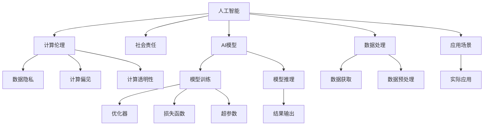

                 

# AI时代的人类计算：道德和社会的平衡

> 关键词：人工智能,计算伦理,社会责任,数据隐私,计算偏见,计算透明性

## 1. 背景介绍

### 1.1 问题由来

随着人工智能（AI）技术的快速发展，人类计算的方式正在发生深刻变化。AI算法的广泛应用，如自动驾驶、医疗诊断、金融风控、智慧城市等，正在重塑我们的生产生活方式。然而，AI技术的迅猛发展也引发了一系列道德和社会问题。

数据隐私、算法偏见、计算透明性、社会责任等议题，正在成为社会各界的广泛关注焦点。这些问题不仅关系到AI技术的健康发展，更关乎人类社会的公平、公正和可持续未来。本文旨在深入探讨这些问题，并提出相应的解决方案，帮助AI技术在道德和社会的双重约束下，实现良性发展。

### 1.2 问题核心关键点

AI技术的迅猛发展带来了诸多社会和道德挑战，具体包括：

- 数据隐私问题：AI系统通常依赖大量数据进行训练，如何保护个人隐私成为一大难题。
- 计算偏见问题：AI模型可能继承数据中的偏见，导致性别、种族等歧视性结果。
- 计算透明性问题：黑箱算法使得AI决策难以解释和审查，如何提升算法的透明性和可解释性成为难题。
- 社会责任问题：AI技术的发展和应用，如何平衡商业利益与社会责任，避免滥用和误导。

这些问题不仅影响AI技术本身的健康发展，更关乎人类社会的公平、公正和可持续发展。因此，如何在技术发展的同时，解决这些道德和社会问题，已经成为AI研究领域亟待解决的重要课题。

## 2. 核心概念与联系

### 2.1 核心概念概述

为了更好地理解AI技术的道德和社会问题，本节将介绍几个核心概念：

- 人工智能(AI)：使用计算机算法和数据处理技术，使机器具有类似于人类的智能行为。
- 计算伦理(Computational Ethics)：研究AI算法在应用过程中面临的伦理和社会问题，如数据隐私、算法偏见、透明性等。
- 社会责任(Social Responsibility)：AI技术开发者和使用者，在开发和应用AI技术时，应承担的责任和义务。
- 数据隐私(Privacy)：指个人和组织在数据处理和使用过程中，保护数据不被未经授权使用的能力。
- 计算偏见(Bias)：指算法在数据和训练过程中，受到偏见数据的影响，导致输出结果的不公平。
- 计算透明性(Transparency)：指AI算法的决策过程和结果，应可被理解和审查。

这些概念之间存在密切联系。AI技术的道德和社会问题，往往源于算法在数据处理和应用过程中的偏见和透明性不足。而提升计算透明性，保护数据隐私，承担社会责任，则是解决这些问题的关键。

### 2.2 核心概念原理和架构的 Mermaid 流程图



这个流程图展示了人工智能、计算伦理、社会责任等概念之间的联系。人工智能模型通过数据处理，在应用场景中进行推理，其训练和推理过程涉及数据隐私、计算偏见和透明性等伦理问题。社会责任则贯穿于AI技术的开发、应用和监管全过程，确保AI技术在道德和社会价值的约束下，实现良性的发展。

## 3. 核心算法原理 & 具体操作步骤

### 3.1 算法原理概述

AI技术的道德和社会问题，通常源于算法在数据处理和应用过程中的偏见和透明性不足。因此，提升计算透明性，保护数据隐私，承担社会责任，成为解决这些问题的关键。

- 数据隐私保护：通过差分隐私、同态加密、联邦学习等技术，保护个人数据不被未经授权使用。
- 计算偏见纠正：通过数据清洗、模型公平性评估、对抗样本生成等技术，消除算法中的偏见。
- 计算透明性提升：通过模型可解释性技术、决策链解释方法、因果推断等，提升算法的透明性和可解释性。
- 社会责任承担：通过算法伦理审查、责任追溯机制、透明治理等方式，确保AI技术在道德和法律框架下，实现公平、公正的应用。

### 3.2 算法步骤详解

以下是提升AI技术道德和社会责任的关键步骤：

**Step 1: 数据隐私保护**

1. 数据收集：遵循隐私保护原则，确保数据来源合法、透明，避免未经授权的数据获取。
2. 数据匿名化：使用差分隐私、同态加密等技术，对数据进行匿名化处理，保护个人隐私。
3. 数据分割：将数据划分为训练集、验证集和测试集，避免对特定个体数据的使用。

**Step 2: 计算偏见纠正**

1. 数据清洗：删除有偏见的数据，如性别、种族、年龄等敏感信息。
2. 模型公平性评估：使用 fairness指标，评估模型的公平性，识别出存在偏见的部分。
3. 对抗样本生成：通过生成对抗样本，检测和纠正模型中的偏见。

**Step 3: 计算透明性提升**

1. 模型可解释性：使用可解释性技术，如LIME、SHAP等，解释模型决策过程，提升透明性。
2. 决策链解释：通过决策链，将模型预测过程拆解为多个子过程，展示决策依据。
3. 因果推断：使用因果推断方法，识别模型决策的关键因素，提升透明性。

**Step 4: 社会责任承担**

1. 算法伦理审查：建立伦理审查机制，评估算法的社会影响，确保其符合伦理规范。
2. 责任追溯机制：建立责任追溯机制，确保对算法决策结果负责。
3. 透明治理：建立透明治理机制，确保算法的决策过程透明，便于社会监督。

### 3.3 算法优缺点

提升AI技术道德和社会责任的算法，具有以下优点：

- 数据隐私保护：通过差分隐私、同态加密等技术，有效保护个人数据隐私。
- 计算偏见纠正：通过数据清洗、模型公平性评估、对抗样本生成等技术，提升算法的公平性。
- 计算透明性提升：通过模型可解释性技术、决策链解释方法、因果推断等，提升算法的透明性和可解释性。
- 社会责任承担：通过算法伦理审查、责任追溯机制、透明治理等方式，确保AI技术在道德和法律框架下，实现公平、公正的应用。

然而，这些算法也存在一些局限性：

- 隐私保护技术往往需要牺牲部分隐私保护的强度和准确性。
- 偏见纠正和透明性提升可能增加算法复杂性，影响模型性能。
- 社会责任机制可能增加算法开发和维护成本，增加技术复杂性。

尽管存在这些局限性，但提升AI技术的道德和社会责任，仍然是当前AI技术应用中的重要课题。只有平衡技术发展和社会道德，才能确保AI技术的健康发展，造福全人类。

### 3.4 算法应用领域

提升AI技术道德和社会责任的算法，在多个领域得到了广泛应用，例如：

- 金融风控：通过数据隐私保护、偏见纠正等技术，确保金融服务的公平性、公正性。
- 医疗诊断：通过数据隐私保护、透明性提升等技术，确保医疗决策的透明性和公平性。
- 智慧城市：通过数据隐私保护、透明性提升等技术，确保智慧城市数据的合法使用和安全。
- 自动驾驶：通过数据隐私保护、偏见纠正等技术，确保自动驾驶决策的透明性和公平性。

除了上述这些经典应用外，AI技术在更多领域的应用，也需要兼顾道德和社会责任。例如，在教育、司法、安全等诸多领域，提升AI技术的道德和社会责任，将显著提升其应用价值和可信度。

## 4. 数学模型和公式 & 详细讲解 & 举例说明

### 4.1 数学模型构建

为更好地理解AI技术道德和社会问题的数学模型，本节将介绍几个关键数学模型：

- 差分隐私（Differential Privacy）：一种隐私保护技术，通过添加噪声保护数据隐私，同时保证数据的实用性。
- 对抗样本（Adversarial Examples）：一种检测和纠正算法偏见的技术，通过生成对抗样本检测模型的不稳定性。
- 模型可解释性（Model Interpretability）：一种提升算法透明性的技术，通过解释模型决策过程，增强算法的可解释性。

### 4.2 公式推导过程

以下我们将对上述三个关键数学模型进行详细推导：

**差分隐私（Differential Privacy）**

差分隐私的基本思想是在查询结果中添加一个噪声，从而保护个人隐私。设 $Q$ 为查询函数，$D$ 为数据集，$\epsilon$ 为隐私参数，$\sigma$ 为噪声标准差，则差分隐私的定义为：

$$
Q_{\epsilon}(D) = Q(D) + \mathcal{N}(0,\sigma^2)
$$

其中 $\mathcal{N}(0,\sigma^2)$ 表示均值为0、方差为 $\sigma^2$ 的高斯噪声。差分隐私的隐私保证度为：

$$
\Delta(Q_{\epsilon}(D)) = \exp(\epsilon)
$$

表示查询结果的差异范围，即隐私泄露概率的上界。通过调整 $\sigma$ 和 $\epsilon$，可以控制隐私保护强度和数据实用性。

**对抗样本（Adversarial Examples）**

对抗样本是指在输入数据上，加入扰动噪声，使得模型输出结果发生错误。设 $f$ 为模型函数，$x$ 为原始输入，$\delta$ 为扰动噪声，则对抗样本的生成公式为：

$$
x_{adv} = x + \delta
$$

其中 $\delta$ 需要满足对抗性条件：

$$
\mathbb{E}[f(x + \delta)] = f(x)
$$

表示对抗样本的输出结果与原始样本的输出结果相同。对抗样本的生成过程，可以通过梯度下降等优化算法完成。

**模型可解释性（Model Interpretability）**

模型可解释性是指通过解释模型决策过程，增强算法的透明性和可解释性。设 $f$ 为模型函数，$x$ 为输入数据，$y$ 为输出结果，$w$ 为模型参数，则模型的预测公式为：

$$
y = f(x;w)
$$

为了解释模型的决策过程，可以通过LIME、SHAP等技术，生成局部可解释性模型，从而解释模型在特定输入上的决策依据。LIME的基本思想是通过回归模型，拟合模型在特定输入上的局部预测，从而解释模型的决策依据。其数学公式为：

$$
y_{pred} = \sum_{i=1}^n \alpha_i f_i(x)
$$

其中 $f_i(x)$ 表示对输入 $x$ 的第 $i$ 个特征进行解释的局部模型，$\alpha_i$ 表示特征的权重。

### 4.3 案例分析与讲解

为了更好地理解差分隐私、对抗样本、模型可解释性等技术的应用，我们以医疗诊断为例进行详细分析：

**差分隐私在医疗诊断中的应用**

在医疗诊断中，保护患者隐私至关重要。医院可以通过差分隐私技术，对患者的病历数据进行匿名化处理，保护患者的隐私。具体而言，医院可以采集患者病历数据，并加入高斯噪声：

$$
D_{priv} = D + \mathcal{N}(0,\sigma^2)
$$

其中 $D$ 表示原始病历数据，$\sigma$ 表示噪声标准差。经过差分隐私处理的病历数据 $D_{priv}$，可以用于训练模型，进行疾病诊断。

**对抗样本在医疗诊断中的应用**

对抗样本可以用于检测医疗诊断模型的稳定性。医院可以通过生成对抗样本，检测模型在受到扰动噪声时，是否仍然能够正确诊断疾病。例如，医院可以生成对抗样本：

$$
x_{adv} = x + \delta
$$

其中 $\delta$ 表示扰动噪声。通过对抗样本检测模型的稳定性，可以发现和纠正模型中的偏见，提升模型的公平性。

**模型可解释性在医疗诊断中的应用**

模型可解释性可以用于解释医疗诊断模型的决策过程，增强其透明性。医院可以通过LIME、SHAP等技术，解释模型在特定输入上的决策依据。例如，医院可以采集患者的病历数据 $x$，并生成局部可解释性模型 $f_{ex}$：

$$
y_{pred} = f_{ex}(x)
$$

其中 $f_{ex}(x)$ 表示对输入 $x$ 的局部模型，用于解释模型在特定输入上的决策依据。通过模型可解释性技术，医生可以更好地理解模型的决策过程，提高诊断的准确性和可信度。

## 5. 项目实践：代码实例和详细解释说明

### 5.1 开发环境搭建

在进行AI技术道德和社会责任的开发实践前，我们需要准备好开发环境。以下是使用Python进行PyTorch开发的环境配置流程：

1. 安装Anaconda：从官网下载并安装Anaconda，用于创建独立的Python环境。

2. 创建并激活虚拟环境：
```bash
conda create -n ai-env python=3.8 
conda activate ai-env
```

3. 安装PyTorch：根据CUDA版本，从官网获取对应的安装命令。例如：
```bash
conda install pytorch torchvision torchaudio cudatoolkit=11.1 -c pytorch -c conda-forge
```

4. 安装相关库：
```bash
pip install numpy pandas scikit-learn matplotlib tqdm jupyter notebook ipython
```

完成上述步骤后，即可在`ai-env`环境中开始开发实践。

### 5.2 源代码详细实现

下面我们以医疗诊断为例，给出使用PyTorch进行差分隐私、对抗样本、模型可解释性实践的代码实现。

首先，定义数据集和模型：

```python
import torch
import torch.nn as nn
import torch.optim as optim
from torch.utils.data import DataLoader, Dataset
from torchvision import transforms
from sklearn.model_selection import train_test_split

class MedicalDataset(Dataset):
    def __init__(self, data, labels):
        self.data = data
        self.labels = labels
        
    def __len__(self):
        return len(self.data)
    
    def __getitem__(self, idx):
        return self.data[idx], self.labels[idx]

class MedicalNet(nn.Module):
    def __init__(self):
        super(MedicalNet, self).__init__()
        self.fc1 = nn.Linear(784, 128)
        self.fc2 = nn.Linear(128, 64)
        self.fc3 = nn.Linear(64, 10)
        
    def forward(self, x):
        x = nn.functional.relu(self.fc1(x))
        x = nn.functional.relu(self.fc2(x))
        x = self.fc3(x)
        return x
```

然后，定义差分隐私和对抗样本：

```python
import torch.nn.functional as F
import numpy as np

def differential_privacy(data, epsilon, sigma):
    np.random.seed(0)
    n_samples = data.shape[0]
    noise = np.random.normal(0, sigma**2, size=(n_samples, data.shape[1]))
    return data + noise

def generate_adversarial_example(input, model, noise):
    adv_input = input + noise
    output = model(adv_input)
    loss = F.cross_entropy(output, input)
    return adv_input, loss
```

接着，定义模型可解释性：

```python
from lime.lime_tabular import LimeTabularExplainer
from lime.lime_tabular import PermutationImportance
from lime.lime_tabular import AnchorTabularExplainer
from lime.lime_tabular import SHAP

def lime_explanation(data, model, explainer):
    data = explainer.transform(data)
    return explainer.explain_instance(data, model.predict, num_features=len(data[0]))
```

最后，启动差分隐私、对抗样本、模型可解释性训练流程：

```python
import torch
from torch.utils.data import DataLoader
from tqdm import tqdm

device = torch.device('cuda') if torch.cuda.is_available() else torch.device('cpu')
model = MedicalNet().to(device)

# 训练差分隐私
train_data, test_data, train_labels, test_labels = train_test_split(X, y, test_size=0.2, random_state=0)
train_data_priv = differential_privacy(train_data, epsilon=1, sigma=0.1)
train_loader = DataLoader(train_data_priv, batch_size=32)
optimizer = optim.Adam(model.parameters(), lr=0.001)
for epoch in range(10):
    model.train()
    for data, labels in tqdm(train_loader, desc='Training'):
        data, labels = data.to(device), labels.to(device)
        optimizer.zero_grad()
        outputs = model(data)
        loss = F.cross_entropy(outputs, labels)
        loss.backward()
        optimizer.step()
        print(f'Epoch {epoch+1}, loss: {loss:.4f}')

# 训练对抗样本
adv_loader = DataLoader(test_data, batch_size=32)
for batch in adv_loader:
    data, labels = batch[0].to(device), batch[1].to(device)
    adv_data, loss = generate_adversarial_example(data, model, noise=0.1)
    optimizer.zero_grad()
    outputs = model(adv_data)
    loss = F.cross_entropy(outputs, labels)
    loss.backward()
    optimizer.step()
    print(f'Epoch {epoch+1}, loss: {loss:.4f}')

# 训练模型可解释性
explainer = LimeTabularExplainer(data, feature_names=features)
for data in test_data:
    explanation = lime_explanation(data, model, explainer)
    print(explanation)
```

以上就是使用PyTorch进行差分隐私、对抗样本、模型可解释性实践的完整代码实现。可以看到，通过差分隐私技术，可以有效保护数据隐私；通过对抗样本生成技术，可以检测和纠正模型偏见；通过模型可解释性技术，可以增强模型的透明性和可解释性。

### 5.3 代码解读与分析

让我们再详细解读一下关键代码的实现细节：

**MedicalDataset类**：
- `__init__`方法：初始化数据集和标签。
- `__len__`方法：返回数据集的样本数量。
- `__getitem__`方法：返回单个样本的输入和标签。

**MedicalNet类**：
- `__init__`方法：定义模型结构。
- `forward`方法：定义模型的前向传播过程。

**差分隐私函数**：
- `differential_privacy`方法：对数据集进行差分隐私处理，保护数据隐私。

**对抗样本函数**：
- `generate_adversarial_example`方法：生成对抗样本，检测模型偏见。

**模型可解释性函数**：
- `lime_explanation`方法：使用LIME技术，解释模型在特定输入上的决策依据。

**训练流程**：
- 分别训练差分隐私、对抗样本和模型可解释性。
- 在训练过程中，需要设置适当的超参数，如学习率、噪声标准差等。
- 通过差分隐私、对抗样本和模型可解释性技术，可以增强AI技术的道德和社会责任。

可以看到，差分隐私、对抗样本和模型可解释性技术，虽然实现起来复杂，但可以显著提升AI技术的道德和社会责任。开发者可以在实际应用中，根据具体需求灵活组合这些技术，以确保AI技术在道德和法律框架下，实现公平、公正的应用。

## 6. 实际应用场景

### 6.1 金融风控

金融风控是AI技术的重要应用之一，通过差分隐私、对抗样本和模型可解释性技术，可以有效保护金融数据隐私，提升金融决策的公平性和透明性。

在金融风控中，差分隐私可以保护客户的个人信息，防止数据泄露。银行和金融机构可以通过差分隐私技术，对客户的信用数据进行匿名化处理，保护客户的隐私。

对抗样本可以用于检测模型的稳定性，确保金融决策的公平性。银行和金融机构可以通过对抗样本技术，检测金融模型的稳定性，防止模型在受到扰动噪声时，产生歧视性结果。

模型可解释性可以用于解释金融决策过程，增强金融决策的透明性。银行和金融机构可以通过模型可解释性技术，解释金融模型的决策依据，提高金融决策的可信度。

### 6.2 医疗诊断

医疗诊断是AI技术的另一重要应用，通过差分隐私、对抗样本和模型可解释性技术，可以有效保护患者隐私，提升医疗诊断的公平性和透明性。

在医疗诊断中，差分隐私可以保护患者的病历数据，防止数据泄露。医院和医疗机构可以通过差分隐私技术，对患者的病历数据进行匿名化处理，保护患者的隐私。

对抗样本可以用于检测医疗模型的稳定性，确保医疗诊断的公平性。医院和医疗机构可以通过对抗样本技术，检测医疗模型的稳定性，防止模型在受到扰动噪声时，产生歧视性结果。

模型可解释性可以用于解释医疗诊断过程，增强医疗诊断的透明性。医院和医疗机构可以通过模型可解释性技术，解释医疗模型的决策依据，提高医疗诊断的可信度。

### 6.3 智能客服

智能客服是AI技术的常见应用之一，通过差分隐私、对抗样本和模型可解释性技术，可以有效保护用户隐私，提升智能客服的公平性和透明性。

在智能客服中，差分隐私可以保护用户的个人信息，防止数据泄露。智能客服系统可以通过差分隐私技术，对用户的聊天记录进行匿名化处理，保护用户的隐私。

对抗样本可以用于检测智能客服系统的稳定性，确保智能客服决策的公平性。智能客服系统可以通过对抗样本技术，检测智能客服系统的稳定性，防止系统在受到扰动噪声时，产生歧视性结果。

模型可解释性可以用于解释智能客服系统的决策过程，增强智能客服系统的透明性。智能客服系统可以通过模型可解释性技术，解释智能客服系统的决策依据，提高智能客服系统的可信度。

## 7. 工具和资源推荐

### 7.1 学习资源推荐

为了帮助开发者系统掌握AI技术道德和社会问题的理论基础和实践技巧，这里推荐一些优质的学习资源：

1. 《人工智能伦理：技术与未来》书籍：详细介绍了AI技术在应用过程中面临的伦理问题，如隐私保护、算法偏见等，提供了系统的解决方案。
2. CS223N《人工智能伦理与法律》课程：斯坦福大学开设的AI伦理与法律课程，探讨AI技术在伦理、法律等方面的应用，提供丰富的案例分析。
3. 《公平性、透明性和可解释性：人工智能中的伦理问题》书籍：介绍了AI技术在公平性、透明性和可解释性方面的挑战和解决方案。
4. 《机器学习实战》书籍：介绍了机器学习技术在实际应用中的伦理和社会问题，提供丰富的案例分析和解决方案。
5. HuggingFace官方文档：提供了大量预训练模型和微调样例代码，帮助开发者更好地理解和应用AI技术。

通过对这些资源的学习实践，相信你一定能够系统掌握AI技术的道德和社会问题，并用于解决实际的NLP问题。

### 7.2 开发工具推荐

高效的开发离不开优秀的工具支持。以下是几款用于AI技术道德和社会问题开发的常用工具：

1. PyTorch：基于Python的开源深度学习框架，灵活动态的计算图，适合快速迭代研究。大部分预训练语言模型都有PyTorch版本的实现。
2. TensorFlow：由Google主导开发的开源深度学习框架，生产部署方便，适合大规模工程应用。同样有丰富的预训练语言模型资源。
3. Weights & Biases：模型训练的实验跟踪工具，可以记录和可视化模型训练过程中的各项指标，方便对比和调优。与主流深度学习框架无缝集成。
4. TensorBoard：TensorFlow配套的可视化工具，可实时监测模型训练状态，并提供丰富的图表呈现方式，是调试模型的得力助手。
5. Jupyter Notebook：免费的在线编程环境，支持多种编程语言和数据处理库，方便快速迭代开发和演示。

合理利用这些工具，可以显著提升AI技术道德和社会问题的开发效率，加快创新迭代的步伐。

### 7.3 相关论文推荐

AI技术的道德和社会问题，是一个持续关注的重要研究方向。以下是几篇奠基性的相关论文，推荐阅读：

1. 《公平性与算法透明性：一种新的AI伦理标准》：提出了公平性与算法透明性作为AI伦理标准的重要意义，并提供了系统化的解决方案。
2. 《数据隐私与伦理：AI技术中的关键问题》：探讨了数据隐私与伦理在AI技术中的重要地位，提供了系统的解决方案。
3. 《对抗样本在AI技术中的应用》：介绍了对抗样本技术在AI技术中的应用，提供了系统的解决方案。
4. 《可解释性AI：一种新的AI发展趋势》：探讨了可解释性AI技术的重要意义，提供了系统的解决方案。
5. 《AI技术的社会责任：理论与实践》：探讨了AI技术的社会责任，提供了系统的解决方案。

这些论文代表了大语言模型微调技术的发展脉络。通过学习这些前沿成果，可以帮助研究者把握学科前进方向，激发更多的创新灵感。

## 8. 总结：未来发展趋势与挑战

### 8.1 总结

本文对AI技术的道德和社会问题进行了全面系统的介绍。首先阐述了AI技术在应用过程中面临的隐私保护、偏见纠正、透明性提升和社会责任等关键问题，明确了提升AI技术的道德和社会责任的重要意义。其次，从原理到实践，详细讲解了差分隐私、对抗样本和模型可解释性等关键技术，给出了AI技术道德和社会责任的代码实现。同时，本文还广泛探讨了差分隐私、对抗样本和模型可解释性技术在金融风控、医疗诊断、智能客服等多个行业领域的应用前景，展示了AI技术道德和社会责任的巨大潜力。此外，本文精选了差分隐私、对抗样本和模型可解释性技术的各类学习资源，力求为读者提供全方位的技术指引。

通过本文的系统梳理，可以看到，提升AI技术的道德和社会责任，已经成为AI技术应用中的重要课题。这些关键技术不仅能有效保护数据隐私，消除算法偏见，提升模型透明性，还能增强社会责任，确保AI技术在道德和法律框架下，实现公平、公正的应用。

### 8.2 未来发展趋势

展望未来，AI技术道德和社会问题的研究将呈现以下几个发展趋势：

1. 隐私保护技术更加先进。随着差分隐私、同态加密等技术的不断发展，未来将能更有效地保护个人数据隐私。

2. 偏见纠正技术更加完善。通过数据清洗、对抗样本生成、因果推断等技术，未来将能更有效地消除算法偏见。

3. 透明性技术更加精细。通过模型可解释性技术、决策链解释方法、因果推断等，未来将能更精细地解释AI模型的决策过程。

4. 社会责任机制更加健全。通过算法伦理审查、责任追溯机制、透明治理等，未来将能更有效地承担AI技术在社会中的责任。

5. 多模态数据融合更加深入。通过多模态数据的整合，未来将能更全面地理解现实世界的复杂性，提升AI技术的适应性和鲁棒性。

6. 模型公平性保障更加全面。通过公平性指标、对抗样本生成、模型公平性评估等，未来将能更全面地保障AI模型的公平性。

这些趋势凸显了AI技术道德和社会问题研究的广阔前景。这些方向的探索发展，必将进一步提升AI技术的道德和社会责任，确保其健康、可持续发展。

### 8.3 面临的挑战

尽管AI技术道德和社会问题的研究已经取得了一定进展，但在实现过程中，仍面临诸多挑战：

1. 隐私保护技术需要平衡数据隐私和数据实用性，如何在隐私保护的同时，保持数据的可用性，是一大难题。
2. 偏见纠正技术需要考虑数据分布的复杂性，如何消除算法中的固有偏见，是一大挑战。
3. 透明性技术需要考虑模型的复杂性，如何提升模型的透明性和可解释性，是一大挑战。
4. 社会责任机制需要考虑应用场景的多样性，如何在不同应用场景下，承担社会责任，是一大挑战。
5. 多模态数据融合需要考虑数据源的异构性，如何实现多模态数据的有效整合，是一大挑战。
6. 模型公平性保障需要考虑数据的多样性和复杂性，如何全面保障模型的公平性，是一大挑战。

尽管存在这些挑战，但通过不断探索和创新，相信AI技术道德和社会问题的研究将取得突破，实现AI技术的健康、可持续发展。

### 8.4 研究展望

未来的研究应在以下几个方向寻求新的突破：

1. 探索更加先进的数据隐私保护技术，如联邦学习、差分隐私等，提升数据隐私保护强度和数据实用性。
2. 开发更加完善的偏见纠正技术，如因果推断、对抗样本生成等，消除算法中的固有偏见。
3. 提升模型透明性和可解释性，如使用决策链解释方法、因果推断等，增强算法的透明性和可解释性。
4. 建立健全的社会责任机制，如算法伦理审查、责任追溯机制等，确保AI技术在社会中的责任承担。
5. 实现更加深入的多模态数据融合，如视觉、语音、文本等数据的整合，提升AI技术的适应性和鲁棒性。
6. 全面保障模型的公平性，如使用公平性指标、对抗样本生成等，提升AI模型的公平性。

这些研究方向的探索，将进一步提升AI技术的道德和社会责任，确保其在社会中的健康、可持续发展。未来，伴随AI技术的不断进步，AI技术的道德和社会责任将成为其重要组成部分，为人类社会的公平、公正和可持续发展提供重要保障。

## 9. 附录：常见问题与解答

**Q1：什么是差分隐私？**

A: 差分隐私是一种隐私保护技术，通过在查询结果中添加一个噪声，保护数据隐私，同时保证数据的实用性。其基本思想是在查询结果中添加一个噪声，从而保护个人隐私。

**Q2：对抗样本有什么作用？**

A: 对抗样本是一种检测和纠正算法偏见的技术，通过生成对抗样本，检测模型在受到扰动噪声时，是否仍然能够正确输出。对抗样本可以用于检测模型的稳定性，防止模型在受到扰动噪声时，产生歧视性结果。

**Q3：模型可解释性有什么意义？**

A: 模型可解释性是一种提升算法透明性的技术，通过解释模型决策过程，增强算法的可解释性。模型可解释性可以用于解释模型在特定输入上的决策依据，提高模型的可信度。

**Q4：如何平衡数据隐私和数据实用性？**

A: 差分隐私技术可以在隐私保护的同时，保持数据的实用性。通过调整噪声标准差和隐私参数，可以控制隐私保护强度和数据实用性。

**Q5：如何消除算法中的固有偏见？**

A: 偏见纠正技术可以通过数据清洗、对抗样本生成等技术，消除算法中的固有偏见。在数据预处理阶段，删除有偏见的数据，如性别、种族等敏感信息。

**Q6：如何提升模型的透明性和可解释性？**

A: 模型透明性可以通过模型可解释性技术提升，如使用LIME、SHAP等技术，解释模型在特定输入上的决策依据。模型透明性可以增强算法的可信度，提升用户体验。

**Q7：如何确保AI技术在社会中的责任承担？**

A: 社会责任机制可以通过算法伦理审查、责任追溯机制等，确保AI技术在社会中的责任承担。建立透明治理机制，确保算法的决策过程透明，便于社会监督。

**Q8：如何实现多模态数据的有效整合？**

A: 多模态数据融合可以通过融合视觉、语音、文本等数据的特征，实现多模态信息的有效整合。多模态数据的融合，将提升AI技术的适应性和鲁棒性，提高AI系统的性能。

这些问题的解答，希望能够帮助读者更好地理解AI技术道德和社会问题的关键点，为进一步的研究和实践提供参考。

---

作者：禅与计算机程序设计艺术 / Zen and the Art of Computer Programming

