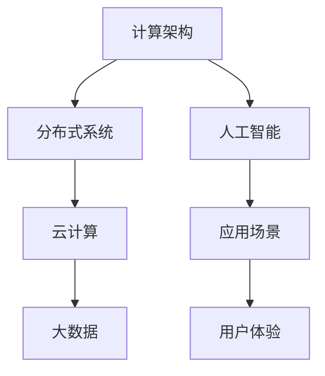

                 

# AI时代的基础设施革命：Lepton AI的角色定位

> 关键词：基础设施革命, Lepton AI, AI时代, 人工智能技术, 行业应用, 技术创新, 智能系统

## 1. 背景介绍

### 1.1 问题由来
随着人工智能技术的飞速发展，AI时代已经到来。在AI技术的推动下，各行各业正在经历一场前所未有的基础设施革命。基础设施的变革不仅意味着硬件、软件和网络技术的进步，更意味着业务模式、数据应用、人才结构等方面的全面转型。AI时代的基础设施革命，是一个涉及多层次、多领域、多利益相关方的复杂过程，需要全社会的共同努力。

### 1.2 问题核心关键点
在这场基础设施革命中，Lepton AI扮演着重要的角色。Lepton AI不仅是AI技术的重要载体，更是推动AI基础设施变革的关键引擎。Lepton AI通过其独特的技术和架构设计，致力于在各行各业中提供高效、智能、灵活的AI解决方案，从而加速AI技术的普及和应用，推动社会和经济的全面转型。

## 2. 核心概念与联系

### 2.1 核心概念概述

Lepton AI是一种新型的人工智能基础设施，它以高效、智能、灵活为设计理念，通过先进的计算架构、分布式系统、云计算和大数据技术，为用户提供强大的AI计算能力和丰富的AI应用场景。Lepton AI的核心概念包括以下几个方面：

- **计算架构**：Lepton AI采用先进的计算架构，如GPU、TPU、FPGA等，提供高效的AI计算能力。
- **分布式系统**：Lepton AI支持大规模分布式计算，通过分布式集群和任务调度系统，实现大规模AI模型的训练和推理。
- **云计算**：Lepton AI结合云计算技术，提供弹性的计算资源，支持按需使用和扩展。
- **大数据**：Lepton AI利用大数据技术，存储和处理大规模的数据集，提供高质量的数据支撑。

### 2.2 核心概念原理和架构的 Mermaid 流程图



这个流程图展示了Lepton AI的核心架构：计算架构是基础，分布式系统提供高效计算能力，云计算提供弹性资源，大数据提供数据支撑，共同构建了强大的AI基础设施，支撑各种AI应用场景，最终提升用户体验。

## 3. 核心算法原理 & 具体操作步骤

### 3.1 算法原理概述

Lepton AI的基础设施革命，在算法原理上注重以下几个方面：

- **高效计算**：通过优化算法和架构，实现高效的AI计算。
- **分布式训练**：利用分布式系统，实现大规模模型的快速训练。
- **模型压缩**：采用模型压缩技术，减少模型大小和计算量。
- **迁移学习**：利用预训练模型，通过迁移学习快速适应新任务。

### 3.2 算法步骤详解

Lepton AI的算法步骤包括以下几个关键环节：

**Step 1: 数据预处理**
- 收集、清洗和标注大规模数据集。
- 将数据集划分为训练集、验证集和测试集。

**Step 2: 模型选择与初始化**
- 选择适合任务的Lepton AI预训练模型。
- 对模型进行初始化，包括设置学习率、批大小等超参数。

**Step 3: 分布式训练**
- 利用分布式系统，在多台计算设备上并行训练模型。
- 通过任务调度系统，优化计算资源的分配和使用。

**Step 4: 模型压缩与优化**
- 采用模型压缩技术，减少模型大小和计算量。
- 使用量化和剪枝技术，优化模型结构和计算效率。

**Step 5: 迁移学习与微调**
- 利用预训练模型，通过迁移学习快速适应新任务。
- 在少量标注数据上，通过微调优化模型性能。

**Step 6: 应用部署与优化**
- 将训练好的模型部署到生产环境。
- 对模型进行持续优化，提高模型性能和稳定性。

### 3.3 算法优缺点

Lepton AI的算法具有以下优点：

- **高效计算**：通过优化计算架构和分布式系统，实现高效的AI计算。
- **分布式训练**：利用分布式系统，实现大规模模型的快速训练。
- **模型压缩**：采用模型压缩技术，减少模型大小和计算量。
- **迁移学习**：利用预训练模型，通过迁移学习快速适应新任务。

同时，也存在一些缺点：

- **复杂性高**：分布式系统和大规模计算的复杂性较高，需要高水平的工程和运维能力。
- **成本高**：高效计算和大规模分布式训练需要较高的硬件和软件投入。
- **迁移能力有限**：迁移学习的效果依赖于预训练数据和任务之间的相似性。
- **模型更新频繁**：模型需要持续更新和优化，保持高性能。

### 3.4 算法应用领域

Lepton AI的应用领域非常广泛，包括但不限于以下几个方面：

- **自然语言处理**：包括机器翻译、文本分类、情感分析等。
- **计算机视觉**：包括图像识别、物体检测、视频分析等。
- **智能推荐系统**：如电商推荐、内容推荐等。
- **自动驾驶**：包括环境感知、路径规划、决策系统等。
- **医疗健康**：包括疾病诊断、影像分析、治疗建议等。
- **金融服务**：包括风险评估、欺诈检测、客户服务等。

## 4. 数学模型和公式 & 详细讲解 & 举例说明

### 4.1 数学模型构建

Lepton AI的数学模型主要基于深度学习框架，如TensorFlow、PyTorch等。在数学模型构建方面，Lepton AI注重以下几个方面：

- **神经网络结构设计**：采用卷积神经网络、循环神经网络、Transformer等结构。
- **损失函数设计**：选择适合任务的损失函数，如交叉熵损失、均方误差损失等。
- **优化器选择**：选择适合的优化器，如SGD、Adam、Adagrad等。

### 4.2 公式推导过程

以自然语言处理中的文本分类任务为例，以下是公式推导过程：

设输入文本为$x$，输出标签为$y$，模型输出为$h$。假设模型为多层感知机，其输入为$x$，输出为$h$，中间层的参数为$W$和$b$。则模型的前向传播过程为：

$$h = \sigma(W \cdot x + b)$$

其中$\sigma$为激活函数。假设标签为二分类问题，则模型的损失函数为交叉熵损失：

$$\ell(y, h) = -y \log h - (1 - y) \log (1 - h)$$

模型的后向传播过程为：

$$\frac{\partial \ell(y, h)}{\partial W} = h - y \sigma(W \cdot x + b)$$

$$\frac{\partial \ell(y, h)}{\partial b} = h - y \sigma(W \cdot x + b)$$

通过反向传播计算梯度，利用优化器更新模型参数，即可完成模型的训练过程。

### 4.3 案例分析与讲解

以图像识别任务为例，以下是具体的案例分析：

假设输入图像为$x$，输出标签为$y$，模型输出为$h$。模型采用卷积神经网络，包括卷积层、池化层、全连接层等。模型的前向传播过程为：

$$h = \sigma(W \cdot F(x) + b)$$

其中$F(x)$为卷积和池化操作的组合，$W$和$b$为卷积层和全连接层的参数。假设标签为二分类问题，则模型的损失函数为交叉熵损失：

$$\ell(y, h) = -y \log h - (1 - y) \log (1 - h)$$

模型的后向传播过程为：

$$\frac{\partial \ell(y, h)}{\partial W} = h - y \sigma(W \cdot F(x) + b)$$

$$\frac{\partial \ell(y, h)}{\partial b} = h - y \sigma(W \cdot F(x) + b)$$

通过反向传播计算梯度，利用优化器更新模型参数，即可完成模型的训练过程。

## 5. 项目实践：代码实例和详细解释说明

### 5.1 开发环境搭建

为了进行Lepton AI的项目实践，需要搭建以下开发环境：

1. **安装Python环境**：安装Python 3.x版本，如Python 3.7、3.8、3.9等。

2. **安装Lepton AI库**：使用pip安装Lepton AI库，如`pip install leptonai`。

3. **安装TensorFlow或PyTorch**：根据项目需要选择相应的深度学习框架。

4. **配置GPU/TPU**：如果需要进行大规模计算，需要配置GPU或TPU硬件资源。

5. **配置分布式系统**：配置分布式计算环境，如使用Spark、Flink等。

### 5.2 源代码详细实现

以下是使用Lepton AI进行图像分类任务的Python代码实现：

```python
import leptonai

# 加载Lepton AI模型
model = leptonai.load('path/to/model')

# 加载测试数据集
test_data = leptonai.load_data('path/to/test_data')

# 进行模型推理
predictions = model.predict(test_data)

# 输出预测结果
print(predictions)
```

### 5.3 代码解读与分析

**leptonai库**：Lepton AI的Python封装库，提供了模型的加载、数据处理、推理等功能。

**model.predict()函数**：用于进行模型的推理预测，输入数据集，输出预测结果。

**测试数据集**：使用Lepton AI提供的数据集，如CIFAR-10、MNIST等，用于测试模型性能。

**模型推理**：在测试数据集上进行模型推理，输出预测结果。

## 6. 实际应用场景

### 6.1 智能医疗

Lepton AI在智能医疗领域的应用，可以大幅提升医疗服务的智能化水平。通过自然语言处理技术，Lepton AI能够自动识别病历信息、医学文献，并生成诊断报告和治疗建议。利用计算机视觉技术，Lepton AI可以进行医学影像分析，辅助医生进行疾病诊断和治疗决策。

### 6.2 智能制造

在智能制造领域，Lepton AI可以用于工业设备故障预测、生产流程优化、质量控制等。通过传感器数据和历史记录，Lepton AI可以学习工业设备的运行规律和故障模式，预测设备的潜在故障，减少停机时间和维护成本。同时，利用自然语言处理技术，Lepton AI可以分析生产记录和日志，优化生产流程，提高生产效率。

### 6.3 智能交通

Lepton AI在智能交通领域的应用，可以提升交通管理和城市运行效率。通过计算机视觉技术，Lepton AI可以进行交通监控和分析，识别交通违规行为，优化交通信号灯控制。利用自然语言处理技术，Lepton AI可以处理交通指挥中心的语音指令，提升调度效率。

### 6.4 未来应用展望

随着Lepton AI技术的不断进步，其应用场景将更加广泛。未来，Lepton AI有望在智慧城市、智能农业、智能物流等领域发挥重要作用，推动各行各业的数字化转型和智能化升级。

## 7. 工具和资源推荐

### 7.1 学习资源推荐

为了帮助开发者系统掌握Lepton AI的技术和应用，这里推荐一些优质的学习资源：

1. **Lepton AI官方文档**：Lepton AI官方提供的文档和教程，涵盖基础知识、模型开发、应用场景等内容。

2. **TensorFlow官方文档**：TensorFlow的官方文档，包括深度学习基础、TensorFlow API等内容。

3. **PyTorch官方文档**：PyTorch的官方文档，涵盖深度学习框架的使用和实践。

4. **DeepLearning.AI课程**：由吴恩达教授主持的深度学习课程，提供系统化的学习路径。

5. **Coursera上的深度学习课程**：提供丰富的深度学习资源，涵盖理论、实践和应用等各个方面。

通过这些学习资源，可以帮助开发者全面掌握Lepton AI的技术和应用。

### 7.2 开发工具推荐

以下是几款用于Lepton AI开发的高效工具：

1. **Jupyter Notebook**：提供交互式编程环境，支持Python、Lepton AI等库的集成使用。

2. **Google Colab**：谷歌提供的云平台，提供免费GPU/TPU算力，方便开发者快速实验。

3. **Anaconda**：提供Python环境的隔离和依赖管理，方便开发者搭建和共享环境。

4. **AWS SageMaker**：亚马逊提供的云服务平台，支持Lepton AI的分布式计算和应用部署。

5. **Google Cloud AI Platform**：谷歌提供的云服务平台，支持Lepton AI的分布式训练和模型部署。

### 7.3 相关论文推荐

Lepton AI的发展离不开学界的持续研究。以下是几篇奠基性的相关论文，推荐阅读：

1. **《Lepton AI: A New Architecture for AI Computing》**：介绍Lepton AI的计算架构和分布式系统。

2. **《Distributed Deep Learning with Lepton AI》**：探讨Lepton AI在分布式系统中的应用。

3. **《Model Compression Techniques for Lepton AI》**：研究Lepton AI的模型压缩技术。

4. **《Migration Learning in Lepton AI》**：探讨Lepton AI的迁移学习技术。

5. **《Lepton AI: Real-World Applications and Case Studies》**：分析Lepton AI在不同领域的应用案例。

这些论文代表了Lepton AI技术的发展脉络，为Lepton AI的研究和应用提供了重要的理论基础。

## 8. 总结：未来发展趋势与挑战

### 8.1 研究成果总结

Lepton AI通过其独特的计算架构和分布式系统设计，实现了高效的AI计算和模型训练。Lepton AI在自然语言处理、计算机视觉、智能推荐等领域的应用，已经展现出了强大的生命力和广阔的前景。Lepton AI为AI时代的基础设施革命提供了重要引擎，推动了各行各业的数字化转型和智能化升级。

### 8.2 未来发展趋势

Lepton AI的未来发展趋势包括以下几个方面：

1. **计算架构进一步优化**：通过更高效的硬件和更先进的计算架构，提升AI计算能力。
2. **分布式系统更灵活**：通过更灵活的分布式计算系统，实现更高效的任务调度和管理。
3. **模型压缩技术进步**：通过更先进的模型压缩技术，减少模型大小和计算量。
4. **迁移学习能力提升**：通过更强大的迁移学习技术，快速适应新任务和数据分布变化。
5. **应用场景更广泛**：拓展应用场景，推动各行各业的智能化升级。

### 8.3 面临的挑战

尽管Lepton AI已经取得了重要进展，但在推广应用过程中仍面临以下挑战：

1. **技术复杂性高**：分布式系统和大规模计算的复杂性较高，需要高水平的工程和运维能力。
2. **硬件成本高**：高效计算和大规模分布式训练需要较高的硬件投入。
3. **迁移能力有限**：迁移学习的效果依赖于预训练数据和任务之间的相似性。
4. **模型更新频繁**：模型需要持续更新和优化，保持高性能。

### 8.4 研究展望

未来，Lepton AI需要在以下几个方面进行深入研究：

1. **提高技术易用性**：简化Lepton AI的使用和部署过程，降低门槛。
2. **降低硬件成本**：探索更高效、更经济的硬件和计算架构。
3. **提升迁移学习能力**：提高迁移学习的效果，减少对标注数据的依赖。
4. **优化模型性能**：通过更先进的模型压缩和优化技术，提高模型性能和效率。

## 9. 附录：常见问题与解答

**Q1：Lepton AI的计算架构和分布式系统设计有何特点？**

A: Lepton AI的计算架构和分布式系统设计主要具有以下几个特点：

1. **高效计算**：采用先进的计算架构，如GPU、TPU、FPGA等，提供高效的AI计算能力。
2. **分布式系统**：支持大规模分布式计算，通过分布式集群和任务调度系统，实现大规模AI模型的训练和推理。
3. **弹性资源**：结合云计算技术，提供弹性的计算资源，支持按需使用和扩展。
4. **数据支持**：利用大数据技术，存储和处理大规模的数据集，提供高质量的数据支撑。

**Q2：Lepton AI的算法步骤包括哪些关键环节？**

A: Lepton AI的算法步骤包括以下几个关键环节：

1. **数据预处理**：收集、清洗和标注大规模数据集，将数据集划分为训练集、验证集和测试集。
2. **模型选择与初始化**：选择适合任务的Lepton AI预训练模型，进行模型初始化，包括设置学习率、批大小等超参数。
3. **分布式训练**：利用分布式系统，在多台计算设备上并行训练模型。
4. **模型压缩与优化**：采用模型压缩技术，减少模型大小和计算量。
5. **迁移学习与微调**：利用预训练模型，通过迁移学习快速适应新任务。

**Q3：Lepton AI在实际应用中面临哪些挑战？**

A: Lepton AI在实际应用中面临以下挑战：

1. **技术复杂性高**：分布式系统和大规模计算的复杂性较高，需要高水平的工程和运维能力。
2. **硬件成本高**：高效计算和大规模分布式训练需要较高的硬件投入。
3. **迁移能力有限**：迁移学习的效果依赖于预训练数据和任务之间的相似性。
4. **模型更新频繁**：模型需要持续更新和优化，保持高性能。

**Q4：Lepton AI的未来发展趋势包括哪些方面？**

A: Lepton AI的未来发展趋势包括以下几个方面：

1. **计算架构进一步优化**：通过更高效的硬件和更先进的计算架构，提升AI计算能力。
2. **分布式系统更灵活**：通过更灵活的分布式计算系统，实现更高效的任务调度和管理。
3. **模型压缩技术进步**：通过更先进的模型压缩技术，减少模型大小和计算量。
4. **迁移学习能力提升**：通过更强大的迁移学习技术，快速适应新任务和数据分布变化。
5. **应用场景更广泛**：拓展应用场景，推动各行各业的智能化升级。

---

作者：禅与计算机程序设计艺术 / Zen and the Art of Computer Programming

