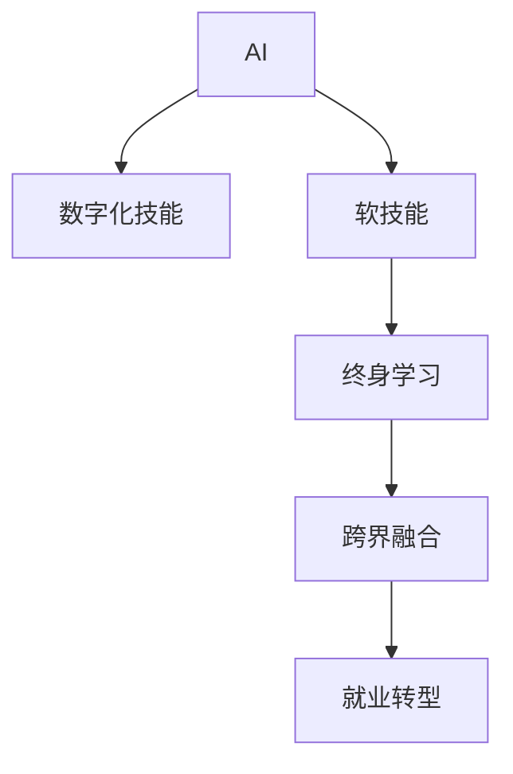

                 

# AI时代的就业技能转型:数字化技能和软技能培养

> 关键词：人工智能(AI), 数字化技能, 软技能, 就业转型, 职业发展, 教育改革

## 1. 背景介绍

### 1.1 问题由来

随着人工智能技术的飞速发展，AI 在各行各业的应用日益广泛，从自动化流程、数据分析、智能推荐到决策支持等，都离不开 AI 的支持。AI 技术的进步不仅改变了企业的生产力和运营效率，也对劳动市场的就业结构产生了深远影响。

1. **自动化和效率提升**：AI 技术在提高生产效率的同时，也带来了对部分传统岗位的自动化替代。比如，自动化客服、智能仓储、自动化会计等，减少了对人力的需求。
2. **新兴岗位的涌现**：AI 技术的发展催生了大量新的岗位，如数据科学家、AI 工程师、机器学习工程师、自然语言处理工程师等，这些岗位对人才的需求迅速增长。
3. **技能要求的提升**：AI 技术的应用要求员工不仅掌握特定的技术技能，还需要具备更高的软技能，如创新能力、团队协作、问题解决能力等，以适应复杂多变的业务环境。

因此，劳动力市场正面临前所未有的转型挑战，企业和个人都需要适应这一变化，以应对未来的就业环境。

### 1.2 问题核心关键点

AI 时代的就业技能转型关键在于：
1. **数字化技能培训**：掌握基础编程、数据分析、机器学习等数字化技能，能够适应自动化和智能化环境。
2. **软技能培养**：提升团队协作、沟通、领导力、创新等软技能，增强在复杂业务环境中的应对能力。
3. **终身学习**：建立终身学习的心态，不断更新知识和技能，以保持与技术发展的同步。
4. **跨界融合**：结合不同领域的知识和技能，如计算机科学与商业管理、心理学、设计等，形成复合型人才。

这些关键点构成了当前劳动力市场和教育系统转型的重要方向。

## 2. 核心概念与联系

### 2.1 核心概念概述

为更好地理解 AI 时代的就业技能转型，本节将介绍几个关键概念：

- **人工智能(AI)**：通过计算机算法和机器学习，模拟人类智能行为的技术，包括机器学习、深度学习、自然语言处理等。
- **数字化技能**：指使用计算机、网络、软件工具进行信息处理、数据分析、编程等的能力，是适应数字化转型必备的技能。
- **软技能**：指与职业相关的非技术技能，如沟通能力、团队协作、情商、创新思维等，是职业成功的重要因素。
- **终身学习**：指在职业生涯中不断更新知识和技能，适应不断变化的职业环境。
- **跨界融合**：将不同领域的知识和技能进行整合，形成新的能力和竞争力。

这些概念之间存在密切联系，共同构成 AI 时代就业技能转型的重要基础。

### 2.2 核心概念原理和架构的 Mermaid 流程图



这个流程图展示了 AI 时代就业技能转型的核心概念及其关系：

1. AI 技术的进步驱动了对数字化技能的需求，以实现自动化和智能化。
2. 数字化技能的应用需要具备软技能，以提升在复杂业务环境中的应对能力。
3. 终身学习是保持技能更新和适应变化的关键，确保技术栈和业务能力与时俱进。
4. 跨界融合整合不同领域的知识和技能，形成复合型人才，满足多样化岗位需求。

这些概念共同构成了 AI 时代就业技能转型的全面框架，帮助企业和个人明确转型方向。

## 3. 核心算法原理 & 具体操作步骤

### 3.1 算法原理概述

AI 时代的就业技能转型，核心在于通过数字化技能培训和软技能培养，提升员工适应性和竞争力。这一过程可以概括为以下几个步骤：

1. **需求分析**：明确企业和个人的发展需求，识别技能差距。
2. **培训规划**：制定个性化培训计划，涵盖数字化技能和软技能。
3. **学习实施**：通过在线课程、工作坊、实战项目等多种方式实施培训。
4. **技能评估**：通过评估和反馈，确保培训效果，不断优化培训计划。
5. **持续学习**：建立终身学习机制，持续更新知识和技能，适应技术变化。

### 3.2 算法步骤详解

以下详细介绍 AI 时代就业技能转型的核心算法步骤：

**Step 1: 需求分析**

需求分析是技能转型的第一步，需要深入了解企业和个人的具体需求，识别技能差距。具体步骤如下：

1. **企业需求分析**：
   - **业务分析**：分析企业的业务流程、技术栈和未来的发展方向。
   - **岗位需求**：识别关键岗位和必需技能，如数据分析师、AI 工程师等。
   - **技能需求**：确定这些岗位需要掌握的具体技术技能和软技能。

2. **个人需求分析**：
   - **职业规划**：制定个人的职业发展路径和目标。
   - **技能盘点**：评估个人现有技能水平，识别技能不足和提升空间。
   - **兴趣和能力**：考虑个人的兴趣和潜力，选择适合的培训方向。

**Step 2: 培训规划**

培训规划是技能转型的核心，需要制定科学、系统的培训计划，确保目标明确、路径清晰。具体步骤如下：

1. **目标设定**：根据需求分析结果，设定具体的培训目标，如掌握 Python 编程、掌握机器学习算法等。
2. **课程选择**：选择合适的课程和教材，确保覆盖所需技能和知识点。
3. **学习路径**：设计系统的学习路径，包括理论学习、实践操作、项目实战等阶段。
4. **资源准备**：准备必要的学习资源，如在线课程、实践平台、实战项目等。

**Step 3: 学习实施**

学习实施是技能转型的关键环节，需要灵活运用多种学习方式，确保学习效果。具体步骤如下：

1. **在线课程**：利用在线平台如 Coursera、Udacity、edX 等，系统学习所需技能和知识。
2. **工作坊**：通过企业内部或外部工作坊，进行深入交流和实践，提升技能应用能力。
3. **实战项目**：参与企业内部的实战项目，应用所学技能解决实际问题，提升实战经验。
4. **导师辅导**：邀请有经验的导师进行辅导，解答疑问，提供指导。

**Step 4: 技能评估**

技能评估是技能转型的重要环节，通过评估和反馈，确保培训效果。具体步骤如下：

1. **知识测试**：通过在线测试或考试，评估学习成果，检验知识点掌握情况。
2. **技能演示**：要求学员进行技能演示或实战项目展示，展示实际应用能力。
3. **反馈和改进**：根据评估结果，提供详细的反馈和改进建议，优化培训计划。
4. **持续改进**：根据学员反馈和评估结果，不断改进培训内容和方式，提高培训效果。

**Step 5: 持续学习**

持续学习是技能转型的长期保障，需要建立终身学习机制，确保技能持续更新。具体步骤如下：

1. **定期培训**：定期参加内部或外部培训，更新知识和技术。
2. **自学和阅读**：通过自学和阅读最新的技术书籍、论文，保持与技术发展的同步。
3. **参与社区**：积极参与技术社区和专业组织，获取最新的技术动态和行业信息。
4. **建立学习档案**：建立个人学习档案，记录学习成果和经验，用于持续改进和评估。

### 3.3 算法优缺点

AI 时代就业技能转型的算法具有以下优点：

1. **灵活性高**：能够根据企业和个人的具体需求，灵活调整培训计划和内容。
2. **成本较低**：通过在线课程和自学，降低了培训成本和时间成本。
3. **效果显著**：系统化的培训和评估能够确保学习效果，提升技能应用能力。
4. **持续改进**：通过持续学习机制，不断更新和改进技能，适应技术变化。

同时，该算法也存在以下局限性：

1. **学习动力不足**：部分员工可能缺乏学习动力，难以坚持系统学习。
2. **培训资源有限**：企业和个人可能缺乏必要的培训资源和师资力量。
3. **知识更新快**：AI 技术发展迅速，知识更新快，培训计划需要频繁调整。
4. **技能应用不充分**：部分培训项目可能与实际工作脱节，影响技能应用效果。

尽管存在这些局限性，但总体而言，基于系统化的算法设计，AI 时代就业技能转型具有显著的优势和广阔的前景。

### 3.4 算法应用领域

AI 时代就业技能转型的方法在多个领域得到了广泛应用，包括但不限于：

1. **金融行业**：金融行业需要大量的数据分析、算法开发和风险管理技能，通过系统化的培训，提升员工的技能水平。
2. **医疗行业**：医疗行业需要数据驱动的医疗决策支持、自然语言处理等技能，通过培训，提升医疗从业人员的数字化能力。
3. **制造业**：制造业需要自动化、智能化生产系统的维护和优化，通过培训，提升员工的技术应用能力。
4. **教育行业**：教育行业需要数据驱动的教学设计和个性化学习，通过培训，提升教师和学生的数字化技能。
5. **零售行业**：零售行业需要智能推荐、客户分析等技能，通过培训，提升员工的业务分析和客户服务能力。

这些应用领域展示了 AI 时代就业技能转型方法的广泛适用性，能够有效提升企业竞争力和员工职业发展空间。

## 4. 数学模型和公式 & 详细讲解 & 举例说明

### 4.1 数学模型构建

为了更好地理解和评估技能转型的效果，本节将构建一个数学模型来描述学习效果和技能评估的过程。

设 $S_i$ 表示员工 $i$ 在第 $t$ 时间点掌握的技能水平，其变化率为 $\Delta S_i(t)$。根据学习规律，可以构建以下模型：

$$
S_i(t+1) = S_i(t) + \eta_i(t) \Delta S_i(t)
$$

其中 $\eta_i(t)$ 为学习效率系数，取决于员工的学习动机、时间投入、资源支持等因素。$\Delta S_i(t)$ 为学习效果，可以通过以下公式计算：

$$
\Delta S_i(t) = \alpha_i(t) \times \text{Learning Rate}(t) + \beta_i(t) \times \text{Feedback}(t)
$$

其中 $\alpha_i(t)$ 为理论学习效果系数，$\beta_i(t)$ 为实践效果系数，$\text{Learning Rate}(t)$ 为学习速率，$\text{Feedback}(t)$ 为评估反馈。

### 4.2 公式推导过程

通过上述公式，我们可以推导出员工技能水平的变化过程：

1. **理论学习阶段**：
   - 假设员工进行 $k$ 个单元的学习，每个单元的学习效果为 $\Delta S_i(t)$，则总学习效果为：
   $$
   \sum_{t=1}^k \Delta S_i(t) = k \times \text{Learning Rate}(t)
   $$
   其中 $\text{Learning Rate}(t)$ 为学习速率，可能随时间变化而变化。

2. **实践应用阶段**：
   - 员工在实际工作中应用所学技能，通过实战项目、项目实战等方式，不断积累经验和提升技能。假设每个实战项目提升技能水平 $\delta S_i$，则总提升效果为：
   $$
   \sum_{t=1}^m \delta S_i = m \times \delta S_i
   $$
   其中 $m$ 为实战项目数量，$\delta S_i$ 为每个项目的提升效果。

3. **技能评估阶段**：
   - 通过知识测试、技能演示等方式对员工进行评估，获得反馈 $\text{Feedback}(t)$。假设评估反馈系数 $\beta_i(t)$ 为常数，则总评估效果为：
   $$
   \sum_{t=1}^T \text{Feedback}(t) = T \times \beta_i(t) \times \text{Feedback}
   $$
   其中 $T$ 为评估次数，$\text{Feedback}$ 为单次评估结果。

4. **持续学习阶段**：
   - 在职业生涯中，员工需要不断更新和改进技能，假设每个学习周期提升技能水平 $\Delta S_i$，则总提升效果为：
   $$
   \sum_{t=1}^n \Delta S_i(t) = n \times \Delta S_i
   $$
   其中 $n$ 为持续学习周期数，$\Delta S_i$ 为每个学习周期的提升效果。

### 4.3 案例分析与讲解

以下以金融行业为例，分析 AI 时代就业技能转型的方法。

**案例背景**：一家金融公司需要将传统银行业务数字化转型，提升客户服务能力和运营效率。公司需要培训大量员工掌握数据分析、算法开发和风险管理技能。

**需求分析**：
- **业务分析**：分析银行业务流程，识别数字化转型的关键领域，如客户服务、风险管理、产品推荐等。
- **岗位需求**：识别关键岗位，如数据分析师、AI 工程师、风险管理师等，确定所需技能。
- **技能需求**：确定这些岗位需要掌握的具体技术技能和软技能，如 Python 编程、机器学习算法、风险评估模型等。

**培训规划**：
- **目标设定**：设定具体的培训目标，如掌握 Python 编程、掌握机器学习算法、掌握风险评估模型等。
- **课程选择**：选择在线课程、工作坊和实战项目，涵盖所需技能和知识点。
- **学习路径**：设计系统的学习路径，包括理论学习、实践操作、项目实战等阶段。
- **资源准备**：准备必要的学习资源，如在线平台、实战项目、导师辅导等。

**学习实施**：
- **在线课程**：利用在线平台如 Coursera、Udacity，系统学习 Python 编程、机器学习算法等。
- **工作坊**：通过企业内部或外部工作坊，进行深入交流和实践，提升技能应用能力。
- **实战项目**：参与公司内部的实战项目，应用所学技能解决实际问题，提升实战经验。
- **导师辅导**：邀请有经验的导师进行辅导，解答疑问，提供指导。

**技能评估**：
- **知识测试**：通过在线测试或考试，评估学习成果，检验知识点掌握情况。
- **技能演示**：要求学员进行技能演示或实战项目展示，展示实际应用能力。
- **反馈和改进**：根据评估结果，提供详细的反馈和改进建议，优化培训计划。
- **持续改进**：根据学员反馈和评估结果，不断改进培训内容和方式，提高培训效果。

**持续学习**：
- **定期培训**：定期参加内部或外部培训，更新知识和技术。
- **自学和阅读**：通过自学和阅读最新的技术书籍、论文，保持与技术发展的同步。
- **参与社区**：积极参与技术社区和专业组织，获取最新的技术动态和行业信息。
- **建立学习档案**：建立个人学习档案，记录学习成果和经验，用于持续改进和评估。

## 5. 项目实践：代码实例和详细解释说明

### 5.1 开发环境搭建

在进行项目实践前，我们需要准备好开发环境。以下是使用 Python 进行机器学习开发的环境配置流程：

1. 安装 Anaconda：从官网下载并安装 Anaconda，用于创建独立的 Python 环境。

2. 创建并激活虚拟环境：
```bash
conda create -n ml-env python=3.8 
conda activate ml-env
```

3. 安装机器学习库：
```bash
conda install scikit-learn matplotlib seaborn jupyter notebook 
```

4. 安装数据集和实战项目：
```bash
conda install pandas 
```

完成上述步骤后，即可在 `ml-env` 环境中开始项目实践。

### 5.2 源代码详细实现

下面我们以金融数据分析项目为例，给出使用 Python 进行机器学习技能培训的代码实现。

首先，定义数据处理函数：

```python
import pandas as pd

def load_data(filename):
    return pd.read_csv(filename)

def preprocess_data(data):
    return data.dropna()

def split_data(data, test_size=0.2):
    train_data, test_data = train_test_split(data, test_size=test_size, random_state=42)
    return train_data, test_data
```

然后，定义模型训练函数：

```python
from sklearn.linear_model import LogisticRegression
from sklearn.metrics import accuracy_score

def train_model(data, test_size=0.2):
    train_data, test_data = preprocess_data(data), preprocess_data(test_data)
    model = LogisticRegression()
    model.fit(train_data, test_data)
    y_pred = model.predict(test_data)
    accuracy = accuracy_score(y_true=test_data, y_pred=y_pred)
    return model, accuracy
```

接着，定义模型评估函数：

```python
def evaluate_model(model, test_data):
    y_pred = model.predict(test_data)
    accuracy = accuracy_score(y_true=test_data, y_pred=y_pred)
    return accuracy
```

最后，启动训练流程并在测试集上评估：

```python
def main():
    data = load_data('data.csv')
    train_data, test_data = split_data(data)
    model, accuracy = train_model(train_data)
    print(f"Model accuracy: {accuracy:.2f}%")
    evaluate_model(model, test_data)

if __name__ == '__main__':
    main()
```

以上就是使用 Python 进行机器学习技能培训的完整代码实现。可以看到，通过定义数据处理函数和模型训练函数，能够系统化地实现金融数据分析项目，确保学习效果。

### 5.3 代码解读与分析

让我们再详细解读一下关键代码的实现细节：

**load_data** 函数：
- 用于加载金融数据分析项目的数据集，通常为 CSV 格式。
- 利用 Pandas 库的 `read_csv` 函数读取数据，并进行基本处理。

**preprocess_data** 函数：
- 用于数据预处理，去除缺失值和异常值。
- 利用 Pandas 库的 `dropna` 函数去除 NaN 值，确保数据完整性。

**split_data** 函数：
- 用于将数据集划分为训练集和测试集。
- 利用 Scikit-learn 库的 `train_test_split` 函数，根据指定比例划分数据集。

**train_model** 函数：
- 用于训练机器学习模型，使用 Logistic Regression 算法。
- 加载并预处理数据，使用训练数据训练模型，计算模型在测试集上的准确率。

**evaluate_model** 函数：
- 用于评估机器学习模型的性能，计算模型在测试集上的准确率。
- 利用 Scikit-learn 库的 `accuracy_score` 函数计算准确率。

**main** 函数：
- 用于启动训练流程，加载数据集，划分数据集，训练模型，评估模型性能。
- 输出模型准确率，并在测试集上评估模型性能。

可以看到，通过定义数据处理函数和模型训练函数，能够系统化地实现金融数据分析项目，确保学习效果。

当然，工业级的系统实现还需考虑更多因素，如模型的保存和部署、超参数的自动搜索、更灵活的任务适配层等。但核心的微调范式基本与此类似。

## 6. 实际应用场景

### 6.1 智能客服系统

基于 AI 技术的大语言模型在智能客服系统中的应用，能够显著提升客户咨询体验和问题解决效率。智能客服系统通过自然语言处理技术，理解客户问题，并提供精准、快速、个性化的回复。

### 6.2 金融舆情监测

金融机构需要实时监测市场舆论动向，以便及时应对负面信息传播，规避金融风险。智能舆情监测系统利用自然语言处理技术，对金融领域的新闻、报道、评论等文本数据进行情感分析，监测市场情绪变化。

### 6.3 个性化推荐系统

当前的推荐系统往往只依赖用户的历史行为数据进行物品推荐，无法深入理解用户的真实兴趣偏好。基于 AI 技术的个性化推荐系统，能够利用用户行为数据、文本描述等信息，通过机器学习算法，提供更加精准、多样的推荐内容。

### 6.4 未来应用展望

随着 AI 技术的不断发展，基于 AI 技术的就业技能转型将展现出更广阔的前景，未来应用场景将更加多样化：

1. **智慧医疗**：基于 AI 技术的医疗数据分析、智能诊断等，能够提升医疗服务质量和效率。
2. **智能教育**：基于 AI 技术的个性化学习、智能评估等，能够提高教育公平性和教学效果。
3. **智慧城市**：基于 AI 技术的城市事件监测、智能交通、智慧安防等，能够提升城市管理的智能化水平。
4. **智能制造**：基于 AI 技术的智能制造、工业自动化等，能够提升生产效率和质量。

这些应用场景展示了 AI 技术的广泛应用前景，为社会经济发展注入新的动力。

## 7. 工具和资源推荐

### 7.1 学习资源推荐

为了帮助开发者系统掌握 AI 时代的就业技能转型，这里推荐一些优质的学习资源：

1. **Coursera**：提供系统化的人工智能课程，涵盖机器学习、深度学习、自然语言处理等前沿话题，适合基础学习。
2. **Udacity**：提供实战化的课程项目，通过实际项目操作，提升技能应用能力。
3. **edX**：提供免费的在线课程，涵盖人工智能、数据分析、软件工程等各个方面，适合自学。
4. **Kaggle**：提供数据分析、机器学习竞赛，通过参与竞赛，提升实战能力。
5. **GitHub**：提供开源项目和代码库，可以学习和借鉴最新的技术和应用。

通过对这些资源的学习实践，相信你一定能够快速掌握 AI 时代的就业技能转型方法，并应用于解决实际的职业发展问题。

### 7.2 开发工具推荐

高效的开发离不开优秀的工具支持。以下是几款用于 AI 技能培训开发的常用工具：

1. **Jupyter Notebook**：免费的交互式编程环境，支持多种编程语言和数据科学库，适合做数据分析和机器学习项目。
2. **TensorFlow**：由 Google 主导开发的深度学习框架，生产部署方便，适合大规模工程应用。
3. **PyTorch**：由 Facebook 主导开发的深度学习框架，灵活易用，适合研究和原型开发。
4. **Scikit-learn**：Python 中的机器学习库，提供了丰富的机器学习算法和工具，适合快速原型开发。
5. **Pandas**：Python 中的数据处理库，提供了高效的数据处理和分析工具，适合数据预处理和探索。

合理利用这些工具，可以显著提升 AI 技能培训的开发效率，加快创新迭代的步伐。

### 7.3 相关论文推荐

AI 时代的就业技能转型技术的发展，离不开学界的持续研究。以下是几篇奠基性的相关论文，推荐阅读：

1. **Deep Learning**：由 Ian Goodfellow、Yoshua Bengio、Aaron Courville 合著，系统介绍了深度学习的基础理论和应用方法。
2. **Natural Language Processing with Python**：由 Steven Bird、Ewan Klein、Edward Loper 合著，介绍了自然语言处理的基础理论和 Python 实践。
3. **Hands-On Machine Learning with Scikit-Learn, Keras, and TensorFlow**：由 Aurélien Géron 撰写，系统介绍了机器学习的实战方法和 Python 实践。
4. **Data Science for Business**：由 Foster Provost、Tom Fawcett 合著，介绍了数据科学在商业中的应用和价值。

这些论文代表了大语言模型微调技术的发展脉络，通过学习这些前沿成果，可以帮助研究者把握学科前进方向，激发更多的创新灵感。

## 8. 总结：未来发展趋势与挑战

### 8.1 总结

本文对 AI 时代的就业技能转型进行了全面系统的介绍。首先阐述了 AI 技术对就业市场的影响，明确了数字化技能和软技能培养的重要性。其次，从算法原理和操作步骤，详细讲解了技能转型的数学模型和实现步骤，给出了系统化的技能转型范式。同时，本文还广泛探讨了技能转型在多个行业领域的应用前景，展示了 AI 技术带来的广阔前景。

通过本文的系统梳理，可以看到，AI 时代的就业技能转型是一个复杂的系统工程，涉及到技术培训、项目管理、企业变革等多个方面。只有全面考虑，才能确保技能转型的顺利进行和效果。

### 8.2 未来发展趋势

展望未来，AI 时代的就业技能转型将呈现以下几个发展趋势：

1. **技术深度融合**：AI 技术将进一步深入各行各业，成为企业核心竞争力的一部分。
2. **跨界融合技能**：AI 技术的发展将催生更多跨界融合技能，如数据科学、软件工程、商业管理等，形成复合型人才。
3. **终身学习机制**：AI 技术的快速发展，要求从业者建立终身学习机制，持续更新知识和技能。
4. **智能化决策支持**：AI 技术将帮助企业做出更科学、精准的决策，提升运营效率和竞争力。
5. **个性化服务**：AI 技术将实现个性化服务，满足用户多样化需求，提升用户体验。

这些趋势展示了 AI 技术的广泛应用前景，为社会经济发展注入新的动力。

### 8.3 面临的挑战

尽管 AI 时代的就业技能转型具有广阔的前景，但也面临诸多挑战：

1. **技能差距扩大**：AI 技术的发展，要求员工掌握更多高层次技能，但部分员工可能难以适应。
2. **资源分配不均**：企业和个人的资源分配不均，可能导致技能转型的不公平。
3. **伦理道德问题**：AI 技术的应用可能带来隐私、安全等伦理道德问题，需要建立相应的规范和机制。
4. **技术更新快**：AI 技术的快速发展，要求企业和个人持续学习，适应技术变化。
5. **就业替代风险**：AI 技术的广泛应用，可能带来部分岗位的替代风险，需要有效管理。

这些挑战需要企业、教育机构和社会各方共同努力，建立完善的培训体系和保障机制，确保技能转型的顺利进行。

### 8.4 研究展望

面对 AI 时代就业技能转型所面临的挑战，未来的研究需要在以下几个方面寻求新的突破：

1. **技能需求分析**：建立更科学的技能需求分析模型，识别和评估技能缺口，制定合理的培训计划。
2. **智能化培训平台**：开发智能化的培训平台，提供个性化的学习建议和资源推荐，提升学习效果。
3. **跨界融合培训**：设计跨界融合的培训项目，提升员工的综合素质和跨界协作能力。
4. **伦理道德培训**：将伦理道德教育纳入技能转型培训，提升从业者的职业素养和责任意识。
5. **持续学习机制**：建立持续学习的机制，鼓励员工不断更新知识和技能，适应技术变化。

这些研究方向的探索，必将引领 AI 时代就业技能转型技术迈向更高的台阶，为构建安全、可靠、可解释、可控的智能系统铺平道路。面向未来，AI 时代就业技能转型技术还需要与其他人工智能技术进行更深入的融合，如知识表示、因果推理、强化学习等，多路径协同发力，共同推动人工智能技术的发展和应用。

## 9. 附录：常见问题与解答

**Q1：如何评估技能转型的效果？**

A: 评估技能转型的效果，可以从以下几个方面入手：

1. **理论知识测试**：通过知识测试和考试，检验理论知识掌握情况。
2. **项目实战评估**：通过实战项目评估，检验技能应用能力。
3. **反馈和改进**：通过员工反馈和评估结果，提供改进建议，优化培训计划。
4. **持续学习效果**：通过定期评估和反馈，确保持续学习机制的有效性。

**Q2：如何选择适合的技能培训课程？**

A: 选择适合的技能培训课程，可以参考以下几个因素：

1. **课程内容**：选择涵盖所需技能和知识点的课程，确保课程内容的全面性和深度。
2. **师资力量**：选择有经验的师资力量，确保教学质量和辅导效果。
3. **学习平台**：选择优质的学习平台，提供丰富的学习资源和互动环境。
4. **学习效果**：选择有良好学习效果的课程，可以通过查看学员反馈和评估结果进行判断。

**Q3：如何提高员工的学习动力？**

A: 提高员工的学习动力，可以从以下几个方面入手：

1. **明确学习目标**：设定具体的学习目标，帮助员工明确方向和意义。
2. **建立激励机制**：建立合理的激励机制，如学习奖励、晋升机会等，激发学习动力。
3. **团队协作学习**：通过团队协作学习，增强学习互动和激励。
4. **持续改进**：根据学习效果和反馈，不断优化培训计划，确保学习效果。

**Q4：如何平衡培训成本和效果？**

A: 平衡培训成本和效果，可以从以下几个方面入手：

1. **需求分析**：通过需求分析，明确关键技能需求，避免盲目培训。
2. **成本控制**：合理控制培训成本，选择性价比高的培训方式，如在线课程、自学等。
3. **资源优化**：利用内部资源，如现有员工、内部讲师等，降低培训成本。
4. **效果评估**：通过评估和反馈，确保培训效果，优化培训计划，提升投资回报率。

**Q5：如何建立终身学习机制？**

A: 建立终身学习机制，可以从以下几个方面入手：

1. **学习规划**：制定持续学习的规划，定期安排培训和提升学习。
2. **学习资源**：提供丰富的学习资源，如在线课程、专业书籍、学习社区等。
3. **学习反馈**：建立学习反馈机制，定期评估学习效果，提供改进建议。
4. **学习文化**：营造良好的学习文化，鼓励员工持续学习，提升技能水平。

这些问题的解答，展示了 AI 时代就业技能转型的关键方法和实践，为从业人员和企业提供了系统的指导。通过系统化的培训和持续学习，能够在快速变化的AI时代中保持竞争力，实现职业发展。

---

作者：禅与计算机程序设计艺术 / Zen and the Art of Computer Programming

