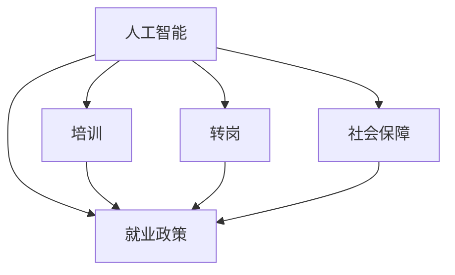

                 

## 1. 背景介绍

### 1.1 问题由来

随着人工智能(AI)技术的迅猛发展，AI正在深刻地改变各行各业的生产方式和工作内容。一方面，AI在自动化、智能决策、优化资源配置等方面展现了巨大潜力，带来了生产效率的提升和成本的降低；另一方面，AI的崛起也对传统岗位造成了冲击，部分工作被机器替代，造成失业风险。如何在AI时代保障劳动力市场稳定，缓解就业压力，成为亟待解决的社会课题。

### 1.2 问题核心关键点

当前，AI技术在招聘、培训、转岗、社会保障等方面都带来了新的挑战和机遇。关键点包括：

- 人工智能技术在招聘中的应用，如AI辅助面试、简历筛选等，对招聘流程的效率和公平性产生影响。
- 在培训方面，人工智能通过个性化的学习路径推荐和自适应学习，提高了培训效率和效果。
- 转岗和社会保障方面，AI辅助职业规划和岗位匹配，帮助劳动力灵活应对职业变化，提高就业质量。
- 同时，AI技术在分析就业市场、预测就业趋势等方面也具有重要意义。

### 1.3 问题研究意义

研究AI时代的就业政策，对保障劳动力市场稳定、提升就业质量、推动经济社会发展具有重要意义：

1. 提高招聘效率和质量。AI技术可以大幅提升简历筛选、面试辅助、岗位匹配的精准度，降低招聘成本。
2. 提升培训效果。通过个性化学习路径、智能导师、自适应测试等手段，AI技术可以提供更加高效和有针对性的培训，提高劳动者技能。
3. 促进转岗和职业发展。AI技术通过职业规划、岗位推荐、技能评估等手段，帮助劳动者灵活适应岗位变化，提高职业发展空间。
4. 优化社会保障体系。AI技术在数据分析、风险预测、智能客服等方面，可以提升社会保障服务质量，增强政策的可执行性。
5. 辅助就业市场分析。AI技术可以全面分析就业数据，预测就业趋势，为政策制定提供科学依据。

## 2. 核心概念与联系

### 2.1 核心概念概述

为更好地理解AI时代的就业政策，本文介绍几个核心概念：

- **人工智能(AI)**：通过算法、数据和计算能力，让机器模拟人类智能的技术体系。涵盖机器学习、深度学习、自然语言处理等众多领域。
- **就业政策**：政府或企业为保障劳动力就业稳定、提升就业质量而制定的一系列政策措施，涵盖招聘、培训、转岗、社会保障等方面。
- **培训**：通过各种教育手段，提升劳动者技能和知识，适应岗位要求的过程。
- **转岗**：劳动者由于岗位需求变化，从现有岗位转移到新岗位的过程。
- **社会保障**：政府为保障公民基本生活需要，提供各种福利和服务的政策体系。

这些概念之间的联系可以通过以下Mermaid流程图来展示：



这个流程图展示出AI技术在不同就业环节的应用：

1. AI技术通过优化招聘、培训、转岗、社会保障等环节，为就业政策提供技术支持。
2. 培训和转岗是提高劳动者就业质量的重要手段，社会保障则保障了劳动者的基本生活需求。

## 3. 核心算法原理 & 具体操作步骤
### 3.1 算法原理概述

AI时代的就业政策，本质上是通过AI技术优化和创新传统就业政策的过程。核心算法原理可以概括为：

- **数据驱动**：利用大数据、AI算法分析就业市场趋势，制定精准的就业政策。
- **智能化**：通过AI辅助招聘、培训、转岗、社会保障等环节，提升政策的智能化水平。
- **个性化**：利用AI技术对劳动者进行个性化分析，提供有针对性的就业和培训服务。

### 3.2 算法步骤详解

以下是AI时代就业政策的算法步骤详解：

1. **数据收集与处理**：收集就业市场数据、劳动者数据、企业招聘数据等，清洗和预处理数据，构建数据集。
2. **模型训练与优化**：利用机器学习、深度学习等AI技术训练预测模型，优化模型参数，提升模型性能。
3. **就业政策制定**：基于训练好的模型，制定精准的招聘、培训、转岗、社会保障政策。
4. **政策执行与评估**：将制定好的政策应用到实际场景中，实时监测执行效果，评估政策效果，迭代优化。

### 3.3 算法优缺点

AI时代就业政策的算法具有以下优点：

- **高效精准**：AI技术可以快速分析大量数据，识别出就业市场的趋势和规律，制定精准的政策。
- **个性化服务**：利用AI技术对劳动者进行个性化分析，提供有针对性的培训和转岗建议。
- **实时响应**：AI技术可以实现实时数据分析和决策，快速响应就业市场变化。

同时，也存在以下缺点：

- **数据隐私问题**：AI技术需要大量的数据，可能涉及隐私问题。
- **算法偏见**：AI算法可能会因为训练数据的不均衡，产生偏见。
- **技术依赖**：过度依赖AI技术可能忽视了人工干预和政策调整的重要性。

### 3.4 算法应用领域

AI时代就业政策的应用领域广泛，涵盖以下几个方面：

1. **招聘流程优化**：通过AI辅助简历筛选、面试辅助、岗位匹配等手段，提升招聘效率和质量。
2. **培训效果提升**：利用AI技术设计个性化的培训方案，提高培训效果。
3. **转岗和职业发展**：通过AI技术进行职业规划和岗位推荐，帮助劳动者灵活适应职业变化。
4. **社会保障优化**：利用AI技术进行就业数据分析、风险预测、智能客服等，提升社会保障服务质量。
5. **就业市场分析**：通过AI技术全面分析就业数据，预测就业趋势，为政策制定提供科学依据。

## 4. 数学模型和公式 & 详细讲解 & 举例说明
### 4.1 数学模型构建

AI时代就业政策的数学模型主要包括以下几个方面：

- **招聘模型**：用于预测岗位需求、匹配岗位和劳动者，优化招聘效率。
- **培训模型**：用于预测培训效果、推荐个性化学习路径，提高培训质量。
- **转岗模型**：用于预测转岗成功率、推荐最优转岗路径，帮助劳动者顺利转岗。
- **社会保障模型**：用于预测失业风险、评估政策效果，优化社会保障措施。

### 4.2 公式推导过程

以下以招聘模型为例，推导基于回归分析的招聘模型公式。

假设招聘数据集为 $D=\{(x_i, y_i)\}_{i=1}^N$，其中 $x_i$ 为招聘特征向量，$y_i$ 为岗位需求量。构建线性回归模型 $y=\theta_0+\sum_{j=1}^d \theta_j x_{ij}$，其中 $\theta=(\theta_0, \theta_1, \ldots, \theta_d)$。根据最小二乘法，求解最优参数 $\hat{\theta}$：

$$
\hat{\theta} = \mathop{\arg\min}_{\theta} \frac{1}{N}\sum_{i=1}^N (y_i - \theta_0 - \sum_{j=1}^d \theta_j x_{ij})^2
$$

使用梯度下降法求解上述最优化问题，更新参数：

$$
\theta_k \leftarrow \theta_k - \eta \frac{1}{N}\sum_{i=1}^N (y_i - \hat{y}_i) \frac{\partial \hat{y}_i}{\partial \theta_k}
$$

其中，$\eta$ 为学习率，$\hat{y}_i = \theta_0 + \sum_{j=1}^d \theta_j x_{ij}$。

### 4.3 案例分析与讲解

假设某公司在招聘数据分析中，收集了过去五年的招聘数据，包括岗位需求、候选人背景等信息。利用上述线性回归模型，对未来一年内的招聘需求进行预测。

首先，将招聘数据进行标准化处理，构建特征向量 $x_i$，包括岗位需求量、行业趋势、地理位置等信息。然后，构建线性回归模型，训练得到参数 $\hat{\theta}$。最后，将模型应用于未来一年的招聘数据，预测岗位需求量 $y_i$。

例如，对于某项关键岗位，预测结果为 $y=100$，即预计未来一年内需要招聘100人。根据预测结果，公司可以提前安排招聘计划，优化招聘流程，确保岗位需求满足。

## 5. 项目实践：代码实例和详细解释说明
### 5.1 开发环境搭建

在进行就业政策开发的实践前，我们需要准备好开发环境。以下是使用Python进行TensorFlow开发的环境配置流程：

1. 安装Anaconda：从官网下载并安装Anaconda，用于创建独立的Python环境。

2. 创建并激活虚拟环境：
```bash
conda create -n tensorflow-env python=3.8 
conda activate tensorflow-env
```

3. 安装TensorFlow：根据CUDA版本，从官网获取对应的安装命令。例如：
```bash
conda install tensorflow tensorflow-gpu=2.7 -c tf -c conda-forge
```

4. 安装TensorFlow Addons：用于扩展TensorFlow的API库，提供更多的模型和工具。
```bash
pip install tensorflow-addons
```

5. 安装相关依赖包：
```bash
pip install numpy pandas scikit-learn matplotlib tensorflow
```

完成上述步骤后，即可在`tensorflow-env`环境中开始就业政策的实践开发。

### 5.2 源代码详细实现

以下是一个简单的招聘预测模型的实现，用于演示就业政策的开发流程：

```python
import tensorflow as tf
from tensorflow_addons.layers.experimental.preprocessing import StandardScaler
from sklearn.model_selection import train_test_split
import pandas as pd

# 数据预处理
data = pd.read_csv('recruitment.csv')
X = data.drop(['demand'], axis=1)
y = data['demand']

# 标准化处理
scaler = StandardScaler()
X_scaled = scaler.fit_transform(X)

# 划分数据集
X_train, X_test, y_train, y_test = train_test_split(X_scaled, y, test_size=0.2, random_state=42)

# 构建模型
model = tf.keras.Sequential([
    tf.keras.layers.Dense(64, activation='relu', input_shape=(X_train.shape[1],)),
    tf.keras.layers.Dense(64, activation='relu'),
    tf.keras.layers.Dense(1)
])

# 编译模型
model.compile(optimizer='adam', loss='mse')

# 训练模型
model.fit(X_train, y_train, epochs=100, batch_size=32, verbose=1)

# 预测
y_pred = model.predict(X_test)
```

### 5.3 代码解读与分析

让我们再详细解读一下关键代码的实现细节：

**数据预处理**：
- `read_csv`方法：用于读取招聘数据集，构建特征向量 $X$ 和目标变量 $y$。
- `StandardScaler`类：用于对特征向量进行标准化处理，消除特征之间的尺度差异。

**模型构建与训练**：
- `Sequential`模型：用于构建一个简单的神经网络模型，包含三个全连接层。
- `Dense`层：用于定义模型的神经元个数和激活函数。
- `compile`方法：用于编译模型，指定优化器、损失函数等。
- `fit`方法：用于训练模型，指定训练集、批次大小、迭代轮数等。

**预测**：
- `predict`方法：用于对测试集进行预测，生成预测结果。

可以看到，通过TensorFlow和TensorFlow Addons，我们可以方便地构建和训练一个简单的招聘预测模型。实际应用中，还需要进一步优化模型结构、调整超参数、引入正则化等手段，以提高模型精度。

## 6. 实际应用场景
### 6.1 招聘流程优化

AI技术可以通过优化招聘流程，提升招聘效率和质量。具体应用场景包括：

1. **简历筛选**：利用自然语言处理(NLP)技术，对简历进行关键词匹配和文本分析，筛选出最符合岗位要求的候选人。
2. **面试辅助**：通过AI生成面试问题、评估候选人回答，辅助招聘人员进行面试，提高面试效率和质量。
3. **岗位匹配**：利用机器学习模型，匹配候选人背景和岗位需求，推荐最佳候选人，减少招聘成本。

### 6.2 培训效果提升

通过AI技术，可以显著提升培训效果，具体应用场景包括：

1. **个性化学习路径**：根据学习者的背景、兴趣、学习进度等，动态生成个性化学习路径，提高学习效率。
2. **自适应测试**：利用AI技术设计自适应测试，实时评估学习效果，及时调整学习计划。
3. **智能导师**：利用AI生成智能导师，根据学习者的反馈和问题，提供有针对性的指导和建议。

### 6.3 转岗和职业发展

AI技术可以帮助劳动者灵活适应岗位变化，具体应用场景包括：

1. **职业规划**：利用AI技术分析市场趋势、岗位需求，提供职业发展建议，帮助劳动者规划职业路径。
2. **岗位推荐**：根据劳动者背景、技能、职业兴趣等，推荐最适合的岗位，帮助劳动者顺利转岗。
3. **技能评估**：利用AI技术评估劳动者技能水平，提供有针对性的培训和提升方案。

### 6.4 社会保障优化

AI技术可以提升社会保障服务的质量和效率，具体应用场景包括：

1. **就业数据分析**：利用AI技术分析就业市场数据，预测就业趋势，为政策制定提供科学依据。
2. **智能客服**：利用AI生成智能客服，处理劳动者咨询，提升服务效率和质量。
3. **风险预测**：利用AI技术预测失业风险，及时预警，采取预防措施。

### 6.5 就业市场分析

AI技术可以全面分析就业数据，预测就业趋势，具体应用场景包括：

1. **市场分析**：利用AI技术分析就业市场数据，识别出行业趋势、岗位需求变化等规律。
2. **政策评估**：利用AI技术评估政策效果，优化政策设计，提高政策执行效果。
3. **预警系统**：利用AI技术构建预警系统，及时发现就业市场异常情况，采取应对措施。

## 7. 工具和资源推荐
### 7.1 学习资源推荐

为了帮助开发者系统掌握AI时代就业政策的理论基础和实践技巧，这里推荐一些优质的学习资源：

1. **《深度学习》系列书籍**：由Ian Goodfellow、Yoshua Bengio、Aaron Courville合著，全面介绍深度学习原理和应用。
2. **Coursera《机器学习》课程**：由Andrew Ng主讲，提供系统的机器学习课程，涵盖监督学习、非监督学习、深度学习等。
3. **TensorFlow官方文档**：提供TensorFlow的全面文档，包括API库、教程、示例等。
4. **Kaggle平台**：提供丰富的数据集和竞赛，帮助你练习和提升数据处理和模型构建能力。
5. **GitHub代码仓库**：提供大量开源项目和代码示例，帮助你学习就业政策的实现细节。

通过对这些资源的学习实践，相信你一定能够快速掌握AI时代就业政策的精髓，并用于解决实际的就业问题。

### 7.2 开发工具推荐

高效的开发离不开优秀的工具支持。以下是几款用于AI时代就业政策开发的常用工具：

1. **TensorFlow**：开源深度学习框架，支持分布式计算和自动微分，方便构建复杂模型。
2. **TensorFlow Addons**：扩展TensorFlow的API库，提供更多的模型和工具，支持更丰富的模型构建需求。
3. **Jupyter Notebook**：互动式编程环境，方便开发和调试AI模型。
4. **Git**：版本控制工具，方便代码管理、协作开发和版本跟踪。
5. **Docker**：容器化技术，方便模型部署和环境管理。

合理利用这些工具，可以显著提升AI时代就业政策的开发效率，加快创新迭代的步伐。

### 7.3 相关论文推荐

AI时代就业政策的研究源于学界的持续研究。以下是几篇奠基性的相关论文，推荐阅读：

1. **《深度学习在就业政策中的应用》**：探讨深度学习技术在就业政策优化中的应用，提出多个AI模型和算法。
2. **《基于AI的就业市场分析模型》**：提出基于机器学习的就业市场分析模型，分析就业数据，预测就业趋势。
3. **《智能推荐系统在职业规划中的应用》**：利用智能推荐系统，为劳动者提供个性化职业规划和岗位推荐。
4. **《深度学习在社会保障中的应用》**：探讨深度学习技术在社会保障优化中的应用，提出多个AI模型和算法。
5. **《AI技术在招聘和培训中的应用》**：探讨AI技术在招聘和培训中的具体应用，提出多个AI模型和算法。

这些论文代表了大语言模型微调技术的发展脉络。通过学习这些前沿成果，可以帮助研究者把握学科前进方向，激发更多的创新灵感。

## 8. 总结：未来发展趋势与挑战
### 8.1 总结

本文对AI时代的就业政策进行了全面系统的介绍。首先阐述了AI技术在招聘、培训、转岗、社会保障等方面带来的挑战和机遇，明确了就业政策的优化目标和方向。其次，从原理到实践，详细讲解了AI技术在就业政策中的应用，给出了就业政策的开发流程和代码实现。同时，本文还广泛探讨了就业政策在多个行业领域的应用前景，展示了AI技术的广阔应用空间。此外，本文精选了就业政策的技术资源，力求为读者提供全方位的技术指引。

通过本文的系统梳理，可以看到，AI技术在就业政策中的应用具有广阔的前景，能显著提升就业质量和效率。未来，伴随AI技术的不断发展，AI时代就业政策也将迎来新的突破，为构建智能、高效、公平的就业市场铺平道路。

### 8.2 未来发展趋势

展望未来，AI时代就业政策的发展趋势包括：

1. **智能化提升**：随着AI技术的发展，就业政策的智能化水平将进一步提升，能够提供更加精准、高效的就业服务。
2. **个性化服务**：利用AI技术对劳动者进行个性化分析，提供更加个性化的培训和转岗建议，提升就业质量。
3. **实时响应**：通过AI技术实现实时数据分析和决策，快速响应就业市场变化，提高政策执行效率。
4. **数据驱动**：利用大数据和AI算法分析就业市场趋势，制定精准的就业政策，优化资源配置。
5. **跨领域融合**：AI技术与其他技术（如区块链、物联网等）进行跨领域融合，推动就业政策的创新和优化。

以上趋势凸显了AI时代就业政策的广阔前景。这些方向的探索发展，必将进一步提升就业政策的智能化、个性化和实时响应能力，为构建更加公平、高效、智能的就业市场奠定基础。

### 8.3 面临的挑战

尽管AI技术在就业政策中的应用前景广阔，但在迈向更加智能化、普适化应用的过程中，它仍面临着诸多挑战：

1. **数据隐私问题**：AI技术需要大量的数据，可能涉及隐私问题，如何平衡数据利用与隐私保护成为一大难题。
2. **算法偏见**：AI算法可能会因为训练数据的不均衡，产生偏见，如何消除算法偏见，保证政策公平性。
3. **技术依赖**：过度依赖AI技术可能忽视了人工干预和政策调整的重要性，如何结合人工智慧和政策导向。
4. **资源消耗**：AI技术的运行需要大量的计算资源，如何优化资源消耗，降低成本。
5. **模型可解释性**：AI模型的决策过程缺乏可解释性，如何提高模型透明性和可解释性，保障政策的执行效果。

以上挑战需要学界和业界共同努力，通过技术创新和政策调整，逐步克服。

### 8.4 研究展望

未来，针对AI时代就业政策的研究需要在以下几个方面寻求新的突破：

1. **无监督和半监督学习**：摆脱对大规模标注数据的依赖，利用无监督和半监督学习，最大化数据利用效率。
2. **跨领域融合**：与其他技术（如区块链、物联网等）进行跨领域融合，推动就业政策的创新和优化。
3. **公平性和可解释性**：引入公平性评估和可解释性技术，消除算法偏见，提高政策公平性和透明度。
4. **智能化和实时响应**：进一步提升就业政策的智能化和实时响应能力，提供更加精准、高效的就业服务。
5. **跨领域知识整合**：将符号化的先验知识（如知识图谱、逻辑规则等）与神经网络模型进行融合，提高模型的知识整合能力。

这些研究方向将推动AI时代就业政策的研究不断深入，为构建更加智能、公平、高效的就业市场提供强有力的技术支撑。

## 9. 附录：常见问题与解答

**Q1：AI时代就业政策是否适用于所有行业和企业？**

A: AI时代就业政策在许多行业和企业中都有广泛的应用，但具体适用性取决于行业特性和企业需求。例如，在一些数据密集型行业（如金融、医疗等），AI技术的应用更为显著。而一些劳动密集型行业（如制造、物流等），AI技术的应用相对有限。因此，企业在引入AI技术时，需要根据自身情况进行评估和选择。

**Q2：如何平衡AI技术在就业政策中的应用与人工干预？**

A: AI技术在就业政策中的应用应当与人工干预相结合。AI技术可以提供精准的预测和优化建议，但最终的决策和调整仍然需要人工干预。例如，在岗位推荐和职业规划中，AI可以提供初步建议，但最终的岗位匹配和职业规划方案需要人工进行审核和调整。通过人机协同，可以最大限度发挥AI技术的优势，同时保证决策的公正性和可解释性。

**Q3：AI时代就业政策在数据隐私方面需要注意哪些问题？**

A: AI时代就业政策在数据隐私方面需要注意以下问题：

1. 数据收集：在数据收集过程中，需要确保数据来源合法，遵守相关法律法规，保护数据隐私。
2. 数据存储：在数据存储过程中，需要采用加密和访问控制等措施，防止数据泄露。
3. 数据使用：在数据使用过程中，需要明确数据用途，确保数据使用不超出预期范围。
4. 数据共享：在数据共享过程中，需要遵循数据共享协议，确保数据共享的安全性和合规性。

通过严格的数据管理和隐私保护措施，可以有效保障AI时代就业政策的数据安全和隐私。

**Q4：AI技术在就业市场分析中面临哪些挑战？**

A: AI技术在就业市场分析中面临以下挑战：

1. 数据质量：数据质量问题（如缺失、错误等）可能会影响分析结果的准确性。
2. 数据量大：就业市场数据量庞大，需要高效的数据处理和分析技术。
3. 数据更新：就业市场数据不断变化，需要及时更新数据，保持分析结果的实时性。
4. 模型复杂性：就业市场分析模型通常较为复杂，需要高效计算资源。

为了解决这些问题，需要采用高效的数据处理和分析技术，优化模型结构，提高数据更新频率，采用分布式计算等手段。

**Q5：AI时代就业政策的未来发展方向是什么？**

A: AI时代就业政策的未来发展方向包括：

1. 智能化提升：通过AI技术提供更加精准、高效的就业服务，优化资源配置。
2. 个性化服务：利用AI技术对劳动者进行个性化分析，提供更加个性化的培训和转岗建议。
3. 实时响应：通过AI技术实现实时数据分析和决策，快速响应就业市场变化。
4. 数据驱动：利用大数据和AI算法分析就业市场趋势，制定精准的就业政策。
5. 跨领域融合：与其他技术（如区块链、物联网等）进行跨领域融合，推动就业政策的创新和优化。

通过这些方向的探索和发展，AI时代就业政策将不断提升智能化、个性化和实时响应能力，为构建更加公平、高效、智能的就业市场提供强有力的技术支撑。

---

作者：禅与计算机程序设计艺术 / Zen and the Art of Computer Programming

