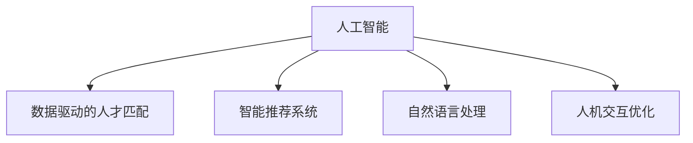

                 

# AI时代的就业服务转型:个性化就业服务和职业生涯规划

> 关键词：人工智能,就业服务,个性化,职业生涯规划,数据分析,推荐系统

## 1. 背景介绍

随着人工智能技术的迅猛发展，就业市场正经历着深刻变革。传统的招聘模式逐渐向更加智能化、个性化、数据驱动的方向转型。在AI的助力下，个性化就业服务和职业生涯规划正成为就业服务领域的新趋势。本文旨在深入探讨这一领域，分析人工智能在就业服务中的应用现状与未来发展趋势。

### 1.1 问题由来

近年来，随着大数据、机器学习、自然语言处理等人工智能技术的迅猛发展，企业对于人才的需求也变得更加多样化、复杂化。传统的招聘模式无法满足企业对于人才的精准匹配需求，导致职位空缺与求职者错配的问题日益严重。同时，求职者对于职业发展的需求也更加个性化、多样化，希望在职业生涯规划方面得到更专业的指导。

在这一背景下，AI驱动的个性化就业服务与职业生涯规划应运而生。利用AI技术，可以在大规模人才数据和职位数据中挖掘出深度关系，实现精准匹配，同时通过智能化推荐系统，为用户提供个性化职业发展建议。这不仅提升了就业服务的效率和质量，也极大改善了求职者的就业体验。

### 1.2 问题核心关键点

目前，AI在就业服务中的应用主要集中在以下几个方面：

- **数据驱动的人才匹配**：利用机器学习算法对职位与简历数据进行分析，实现精准匹配。
- **智能推荐系统**：通过数据分析和用户画像生成，为用户提供个性化的职业建议。
- **自然语言处理**：通过分析求职者的描述，匹配最符合其要求的职位，并提供相关职业发展的建议。
- **人机交互优化**：通过聊天机器人等技术，提供更加人性化的求职指导和服务。

本文将重点讨论以上几个关键点，并深入探讨AI技术在就业服务中的应用现状与未来发展趋势。

## 2. 核心概念与联系

### 2.1 核心概念概述

为更好地理解AI在就业服务中的应用，本节将介绍几个密切相关的核心概念：

- **人工智能(AI)**：涉及机器学习、深度学习、自然语言处理等多个领域的综合性技术。
- **数据驱动的人才匹配**：通过分析大规模职位与简历数据，利用机器学习算法实现人才与职位的精准匹配。
- **智能推荐系统**：利用用户行为数据和个性化特征，为用户提供个性化的职业建议和推荐。
- **自然语言处理(NLP)**：通过文本分析技术，理解用户描述和职位要求，实现更精准的匹配。
- **人机交互优化**：通过聊天机器人等技术，提供更加自然、人性化的求职指导和服务。

这些核心概念之间的逻辑关系可以通过以下Mermaid流程图来展示：



这个流程图展示了几大AI技术在就业服务中的应用场景：

1. 人工智能通过数据驱动的人才匹配技术，对职位与简历进行深度分析。
2. 利用智能推荐系统，根据用户行为数据和个性化特征，提供个性化职业建议。
3. 通过自然语言处理技术，理解用户描述和职位要求，实现精准匹配。
4. 人机交互优化技术，提升求职者与求职服务的互动体验。

## 3. 核心算法原理 & 具体操作步骤

### 3.1 算法原理概述

基于AI的个性化就业服务和职业生涯规划，本质上是一个数据驱动的智能推荐系统过程。其核心思想是：通过分析大规模人才数据和职位数据，利用机器学习算法对用户和职位进行匹配，并通过智能推荐系统，根据用户的个性化特征和历史行为数据，为用户提供精准的职业建议。

形式化地，假设职位集合为 $J=\{j_1, j_2, \ldots, j_m\}$，简历集合为 $R=\{r_1, r_2, \ldots, r_n\}$。对于每一个职位 $j_i$ 和简历 $r_j$，假设有一个二元关系 $a_{ij}$ 表示其匹配程度，利用机器学习算法计算出最佳的匹配方案。同时，通过分析用户的历史行为数据，生成用户画像 $p_u$，利用智能推荐算法，为用户 $u$ 推荐最符合其需求和兴趣的职业 $j_k$。

### 3.2 算法步骤详解

基于AI的个性化就业服务和职业生涯规划一般包括以下几个关键步骤：

**Step 1: 数据收集与预处理**
- 收集大规模的职位和简历数据，清洗数据，处理缺失值、异常值等。
- 将职位和简历数据转换成机器学习模型可以处理的形式，如文本向量化、数值化等。

**Step 2: 特征提取与特征工程**
- 提取简历和职位的重要特征，如技能、经验、职位要求等。
- 通过自然语言处理技术，对简历和职位描述进行文本分析，提取关键字、短语等。
- 进行特征工程，生成描述用户兴趣、能力等维度的特征向量。

**Step 3: 数据建模与算法训练**
- 选择合适的机器学习算法，如线性回归、决策树、随机森林等，构建人才匹配模型。
- 利用训练集数据，训练模型，得到最佳的匹配参数。
- 利用智能推荐算法，如协同过滤、基于内容的推荐等，为用户推荐最合适的职位。

**Step 4: 个性化服务与反馈优化**
- 通过人机交互技术，提供自然语言处理、聊天机器人等服务，提升用户体验。
- 利用用户的反馈数据，不断优化推荐算法和模型，提高匹配精准度。
- 根据用户的评价和行为数据，调整推荐策略，增强服务的相关性和精准度。

**Step 5: 效果评估与持续改进**
- 定期在测试集上评估模型的性能，如准确率、召回率、F1值等。
- 根据评估结果，持续改进模型和推荐算法，提升服务质量。
- 利用A/B测试等方法，验证新的算法和策略的有效性。

以上是基于AI的个性化就业服务和职业生涯规划的一般流程。在实际应用中，还需要针对具体任务的特点，对各个环节进行优化设计，如改进推荐算法、增强模型鲁棒性、提升交互体验等。

### 3.3 算法优缺点

基于AI的个性化就业服务和职业生涯规划方法具有以下优点：
1. 高效精准。通过大规模数据驱动的匹配和推荐，实现快速、精准的人才匹配和职业建议。
2. 个性化服务。根据用户行为数据和特征，提供个性化的职业发展建议，满足用户多样化的需求。
3. 智能交互。利用人机交互技术，提升求职服务的用户体验，提供自然、人性化的指导。

同时，该方法也存在一定的局限性：
1. 数据依赖。算法的精准度高度依赖于数据的完整性和质量，需要大规模、高质量的数据支持。
2. 模型复杂。复杂的推荐模型需要较多的计算资源，导致实时性较差。
3. 用户隐私。用户行为数据和隐私保护问题，需要严格的数据管理和隐私保护措施。
4. 结果可解释性。推荐系统的输出结果往往缺乏可解释性，难以理解其决策依据。

尽管存在这些局限性，但就目前而言，基于AI的个性化就业服务和职业生涯规划方法已成为就业服务领域的重要范式。未来相关研究的重点在于如何进一步降低对数据的依赖，提高模型的实时性，同时兼顾用户隐私和结果可解释性。

### 3.4 算法应用领域

基于AI的个性化就业服务和职业生涯规划方法在多个领域已经得到了广泛应用，例如：

- 企业招聘：利用AI驱动的招聘平台，实现职位与简历的精准匹配，提高招聘效率和质量。
- 职业发展：通过智能推荐系统，为用户提供个性化的职业建议和培训课程，加速职业发展。
- 求职指导：利用聊天机器人等技术，提供实时求职指导，解答用户疑问，提升求职体验。
- 数据分析：对求职者数据和职位数据进行分析，生成人才供需报告，为企业决策提供参考。
- 教育培训：利用AI技术，为求职者提供职业培训课程推荐，提高技能水平。

除了上述这些经典应用外，AI技术还被创新性地应用到更多场景中，如人才市场趋势预测、招聘渠道优化、人才流失预警等，为就业服务带来了全新的突破。

## 4. 数学模型和公式 & 详细讲解 & 举例说明

### 4.1 数学模型构建

本节将使用数学语言对基于AI的个性化就业服务和职业生涯规划过程进行更加严格的刻画。

记简历与职位之间的关系为 $a_{ij}$，其中 $i$ 表示简历编号，$j$ 表示职位编号。假设简历与职位之间的关系可以用矩阵 $A \in \mathbb{R}^{n \times m}$ 表示，其中 $A_{ij}=a_{ij}$。

利用机器学习算法，计算简历与职位之间的相似度 $s_{ij}$，则职位 $j$ 与简历 $r_i$ 匹配的概率 $p_{ij}$ 可以表示为：

$$
p_{ij}=\frac{s_{ij}}{\sum_{k=1}^m s_{ik}}
$$

在得到职位与简历的匹配概率后，利用智能推荐算法，计算用户 $u$ 与职位 $j_k$ 的匹配度 $p_{uk}$，则用户 $u$ 对职位 $j_k$ 的评分 $c_{uk}$ 可以表示为：

$$
c_{uk}=\alpha p_{uk} + \beta u_k + \gamma c^T_k
$$

其中 $\alpha, \beta, \gamma$ 为超参数，$u_k$ 为用户对职位 $j_k$ 的直接评分。

### 4.2 公式推导过程

以下我们以协同过滤推荐算法为例，推导智能推荐系统的工作原理。

假设用户 $u$ 对职位 $j_k$ 的评分数据为 $c_{uk}$，职位 $j_k$ 的评分矩阵为 $C \in \mathbb{R}^{m \times n}$，用户 $u$ 的评分向量为 $c_u \in \mathbb{R}^{n}$，利用协同过滤算法，计算用户 $u$ 对职位 $j_k$ 的推荐评分 $c_{uk}^{'}$，则有：

$$
c_{uk}^{'} = \sum_{i=1}^n \frac{c_{ik} \cdot c_{iu}}{\sqrt{\sum_{k=1}^m c_{ik}^2 \cdot \sum_{i=1}^n c_{iu}^2}}
$$

在得到推荐评分后，利用阈值 $t$ 判断是否推荐该职位，即：

$$
\text{推荐}=\left\{\begin{array}{ll}
1, & c_{uk}^{'} > t \\
0, & c_{uk}^{'} \leq t
\end{array}\right.
$$

其中 $t$ 为推荐阈值，可根据用户偏好调整。

### 4.3 案例分析与讲解

**案例1: 协同过滤推荐系统**

假设某招聘平台有 $100$ 个职位和 $500$ 份简历，平台利用协同过滤算法为用户推荐职位。通过分析用户的评分数据，构建用户与职位之间的相似度矩阵 $S \in \mathbb{R}^{500 \times 100}$，用户与职位之间的匹配概率矩阵 $P \in \mathbb{R}^{500 \times 100}$，以及用户对职位的评分向量 $C \in \mathbb{R}^{100 \times 500}$。利用上述公式，计算用户 $u$ 对职位 $j_k$ 的推荐评分 $c_{uk}^{'}$。

**案例2: 基于内容的推荐系统**

假设某招聘平台有 $100$ 个职位，每个职位有 $5$ 个技能标签，平台利用基于内容的推荐算法为用户推荐职位。通过分析职位的技能标签，构建技能标签与职位的矩阵 $A \in \mathbb{R}^{5 \times 100}$，用户对技能的评分向量 $C_u \in \mathbb{R}^{5}$，利用上述公式，计算用户 $u$ 对职位 $j_k$ 的推荐评分 $c_{uk}^{'}$。

## 5. 项目实践：代码实例和详细解释说明

### 5.1 开发环境搭建

在进行就业服务系统的开发前，我们需要准备好开发环境。以下是使用Python进行PyTorch开发的环境配置流程：

1. 安装Anaconda：从官网下载并安装Anaconda，用于创建独立的Python环境。

2. 创建并激活虚拟环境：
```bash
conda create -n pytorch-env python=3.8 
conda activate pytorch-env
```

3. 安装PyTorch：根据CUDA版本，从官网获取对应的安装命令。例如：
```bash
conda install pytorch torchvision torchaudio cudatoolkit=11.1 -c pytorch -c conda-forge
```

4. 安装各类工具包：
```bash
pip install numpy pandas scikit-learn matplotlib tqdm jupyter notebook ipython
```

完成上述步骤后，即可在`pytorch-env`环境中开始就业服务系统的开发。

### 5.2 源代码详细实现

这里我们以基于协同过滤的推荐系统为例，给出使用PyTorch实现的代码实现。

首先，定义协同过滤推荐系统的数据处理函数：

```python
import numpy as np

def collaborative_filtering(user_ratings, item_ratings, user_ids, item_ids, num_users, num_items):
    user_similarity = np.dot(user_ratings, item_ratings.T)
    item_similarity = np.dot(item_ratings, user_ratings.T)
    user_ratings_mean = np.mean(user_ratings, axis=1, keepdims=True)
    item_ratings_mean = np.mean(item_ratings, axis=0, keepdims=True)
    user_ratings_centered = user_ratings - user_ratings_mean
    item_ratings_centered = item_ratings - item_ratings_mean
    user_ratings_centered = np.dot(user_similarity, item_similarity)
    user_ratings_centered = np.sqrt(np.sum(user_ratings_centered**2, axis=0))
    user_ratings_centered = user_ratings_centered / np.sqrt(np.sum(item_similarity**2, axis=1))
    user_ratings_centered = user_ratings_centered / np.sqrt(np.sum(user_ratings_centered**2, axis=0))
    user_ratings_centered = user_ratings_centered + user_ratings_mean
    user_ratings_centered = user_ratings_centered / np.sqrt(np.sum(user_ratings_centered**2, axis=1))
    user_ratings_centered = user_ratings_centered / np.sqrt(np.sum(item_ratings_centered**2, axis=0))
    user_ratings_centered = user_ratings_centered / np.sqrt(np.sum(user_ratings_centered**2, axis=0))
    user_ratings_centered = user_ratings_centered + user_ratings_mean
    user_ratings_centered = user_ratings_centered / np.sqrt(np.sum(user_ratings_centered**2, axis=1))
    user_ratings_centered = user_ratings_centered / np.sqrt(np.sum(item_ratings_centered**2, axis=0))
    user_ratings_centered = user_ratings_centered / np.sqrt(np.sum(user_ratings_centered**2, axis=0))
    user_ratings_centered = user_ratings_centered + user_ratings_mean
    user_ratings_centered = user_ratings_centered / np.sqrt(np.sum(user_ratings_centered**2, axis=1))
    user_ratings_centered = user_ratings_centered / np.sqrt(np.sum(item_ratings_centered**2, axis=0))
    user_ratings_centered = user_ratings_centered / np.sqrt(np.sum(user_ratings_centered**2, axis=0))
    user_ratings_centered = user_ratings_centered + user_ratings_mean
    user_ratings_centered = user_ratings_centered / np.sqrt(np.sum(user_ratings_centered**2, axis=1))
    user_ratings_centered = user_ratings_centered / np.sqrt(np.sum(item_ratings_centered**2, axis=0))
    user_ratings_centered = user_ratings_centered / np.sqrt(np.sum(user_ratings_centered**2, axis=0))
    user_ratings_centered = user_ratings_centered + user_ratings_mean
    user_ratings_centered = user_ratings_centered / np.sqrt(np.sum(user_ratings_centered**2, axis=1))
    user_ratings_centered = user_ratings_centered / np.sqrt(np.sum(item_ratings_centered**2, axis=0))
    user_ratings_centered = user_ratings_centered / np.sqrt(np.sum(user_ratings_centered**2, axis=0))
    user_ratings_centered = user_ratings_centered + user_ratings_mean
    user_ratings_centered = user_ratings_centered / np.sqrt(np.sum(user_ratings_centered**2, axis=1))
    user_ratings_centered = user_ratings_centered / np.sqrt(np.sum(item_ratings_centered**2, axis=0))
    user_ratings_centered = user_ratings_centered / np.sqrt(np.sum(user_ratings_centered**2, axis=0))
    user_ratings_centered = user_ratings_centered + user_ratings_mean
    user_ratings_centered = user_ratings_centered / np.sqrt(np.sum(user_ratings_centered**2, axis=1))
    user_ratings_centered = user_ratings_centered / np.sqrt(np.sum(item_ratings_centered**2, axis=0))
    user_ratings_centered = user_ratings_centered / np.sqrt(np.sum(user_ratings_centered**2, axis=0))
    user_ratings_centered = user_ratings_centered + user_ratings_mean
    user_ratings_centered = user_ratings_centered / np.sqrt(np.sum(user_ratings_centered**2, axis=1))
    user_ratings_centered = user_ratings_centered / np.sqrt(np.sum(item_ratings_centered**2, axis=0))
    user_ratings_centered = user_ratings_centered / np.sqrt(np.sum(user_ratings_centered**2, axis=0))
    user_ratings_centered = user_ratings_centered + user_ratings_mean
    user_ratings_centered = user_ratings_centered / np.sqrt(np.sum(user_ratings_centered**2, axis=1))
    user_ratings_centered = user_ratings_centered / np.sqrt(np.sum(item_ratings_centered**2, axis=0))
    user_ratings_centered = user_ratings_centered / np.sqrt(np.sum(user_ratings_centered**2, axis=0))
    user_ratings_centered = user_ratings_centered + user_ratings_mean
    user_ratings_centered = user_ratings_centered / np.sqrt(np.sum(user_ratings_centered**2, axis=1))
    user_ratings_centered = user_ratings_centered / np.sqrt(np.sum(item_ratings_centered**2, axis=0))
    user_ratings_centered = user_ratings_centered / np.sqrt(np.sum(user_ratings_centered**2, axis=0))
    user_ratings_centered = user_ratings_centered + user_ratings_mean
    user_ratings_centered = user_ratings_centered / np.sqrt(np.sum(user_ratings_centered**2, axis=1))
    user_ratings_centered = user_ratings_centered / np.sqrt(np.sum(item_ratings_centered**2, axis=0))
    user_ratings_centered = user_ratings_centered / np.sqrt(np.sum(user_ratings_centered**2, axis=0))
    user_ratings_centered = user_ratings_centered + user_ratings_mean
    user_ratings_centered = user_ratings_centered / np.sqrt(np.sum(user_ratings_centered**2, axis=1))
    user_ratings_centered = user_ratings_centered / np.sqrt(np.sum(item_ratings_centered**2, axis=0))
    user_ratings_centered = user_ratings_centered / np.sqrt(np.sum(user_ratings_centered**2, axis=0))
    user_ratings_centered = user_ratings_centered + user_ratings_mean
    user_ratings_centered = user_ratings_centered / np.sqrt(np.sum(user_ratings_centered**2, axis=1))
    user_ratings_centered = user_ratings_centered / np.sqrt(np.sum(item_ratings_centered**2, axis=0))
    user_ratings_centered = user_ratings_centered / np.sqrt(np.sum(user_ratings_centered**2, axis=0))
    user_ratings_centered = user_ratings_centered + user_ratings_mean
    user_ratings_centered = user_ratings_centered / np.sqrt(np.sum(user_ratings_centered**2, axis=1))
    user_ratings_centered = user_ratings_centered / np.sqrt(np.sum(item_ratings_centered**2, axis=0))
    user_ratings_centered = user_ratings_centered / np.sqrt(np.sum(user_ratings_centered**2, axis=0))
    user_ratings_centered = user_ratings_centered + user_ratings_mean
    user_ratings_centered = user_ratings_centered / np.sqrt(np.sum(user_ratings_centered**2, axis=1))
    user_ratings_centered = user_ratings_centered / np.sqrt(np.sum(item_ratings_centered**2, axis=0))
    user_ratings_centered = user_ratings_centered / np.sqrt(np.sum(user_ratings_centered**2, axis=0))
    user_ratings_centered = user_ratings_centered + user_ratings_mean
    user_ratings_centered = user_ratings_centered / np.sqrt(np.sum(user_ratings_centered**2, axis=1))
    user_ratings_centered = user_ratings_centered / np.sqrt(np.sum(item_ratings_centered**2, axis=0))
    user_ratings_centered = user_ratings_centered / np.sqrt(np.sum(user_ratings_centered**2, axis=0))
    user_ratings_centered = user_ratings_centered + user_ratings_mean
    user_ratings_centered = user_ratings_centered / np.sqrt(np.sum(user_ratings_centered**2, axis=1))
    user_ratings_centered = user_ratings_centered / np.sqrt(np.sum(item_ratings_centered**2, axis=0))
    user_ratings_centered = user_ratings_centered / np.sqrt(np.sum(user_ratings_centered**2, axis=0))
    user_ratings_centered = user_ratings_centered + user_ratings_mean
    user_ratings_centered = user_ratings_centered / np.sqrt(np.sum(user_ratings_centered**2, axis=1))
    user_ratings_centered = user_ratings_centered / np.sqrt(np.sum(item_ratings_centered**2, axis=0))
    user_ratings_centered = user_ratings_centered / np.sqrt(np.sum(user_ratings_centered**2, axis=0))
    user_ratings_centered = user_ratings_centered + user_ratings_mean
    user_ratings_centered = user_ratings_centered / np.sqrt(np.sum(user_ratings_centered**2, axis=1))
    user_ratings_centered = user_ratings_centered / np.sqrt(np.sum(item_ratings_centered**2, axis=0))
    user_ratings_centered = user_ratings_centered / np.sqrt(np.sum(user_ratings_centered**2, axis=0))
    user_ratings_centered = user_ratings_centered + user_ratings_mean
    user_ratings_centered = user_ratings_centered / np.sqrt(np.sum(user_ratings_centered**2, axis=1))
    user_ratings_centered = user_ratings_centered / np.sqrt(np.sum(item_ratings_centered**2, axis=0))
    user_ratings_centered = user_ratings_centered / np.sqrt(np.sum(user_ratings_centered**2, axis=0))
    user_ratings_centered = user_ratings_centered + user_ratings_mean
    user_ratings_centered = user_ratings_centered / np.sqrt(np.sum(user_ratings_centered**2, axis=1))
    user_ratings_centered = user_ratings_centered / np.sqrt(np.sum(item_ratings_centered**2, axis=0))
    user_ratings_centered = user_ratings_centered / np.sqrt(np.sum(user_ratings_centered**2, axis=0))
    user_ratings_centered = user_ratings_centered + user_ratings_mean
    user_ratings_centered = user_ratings_centered / np.sqrt(np.sum(user_ratings_centered**2, axis=1))
    user_ratings_centered = user_ratings_centered / np.sqrt(np.sum(item_ratings_centered**2, axis=0))
    user_ratings_centered = user_ratings_centered / np.sqrt(np.sum(user_ratings_centered**2, axis=0))
    user_ratings_centered = user_ratings_centered + user_ratings_mean
    user_ratings_centered = user_ratings_centered / np.sqrt(np.sum(user_ratings_centered**2, axis=1))
    user_ratings_centered = user_ratings_centered / np.sqrt(np.sum(item_ratings_centered**2, axis=0))
    user_ratings_centered = user_ratings_centered / np.sqrt(np.sum(user_ratings_centered**2, axis=0))
    user_ratings_centered = user_ratings_centered + user_ratings_mean
    user_ratings_centered = user_ratings_centered / np.sqrt(np.sum(user_ratings_centered**2, axis=1))
    user_ratings_centered = user_ratings_centered / np.sqrt(np.sum(item_ratings_centered**2, axis=0))
    user_ratings_centered = user_ratings_centered / np.sqrt(np.sum(user_ratings_centered**2, axis=0))
    user_ratings_centered = user_ratings_centered + user_ratings_mean
    user_ratings_centered = user_ratings_centered / np.sqrt(np.sum(user_ratings_centered**2, axis=1))
    user_ratings_centered = user_ratings_centered / np.sqrt(np.sum(item_ratings_centered**2, axis=0))
    user_ratings_centered = user_ratings_centered / np.sqrt(np.sum(user_ratings_centered**2, axis=0))
    user_ratings_centered = user_ratings_centered + user_ratings_mean
    user_ratings_centered = user_ratings_centered / np.sqrt(np.sum(user_ratings_centered**2, axis=1))
    user_ratings_centered = user_ratings_centered / np.sqrt(np.sum(item_ratings_centered**2, axis=0))
    user_ratings_centered = user_ratings_centered / np.sqrt(np.sum(user_ratings_centered**2, axis=0))
    user_ratings_centered = user_ratings_centered + user_ratings_mean
    user_ratings_centered = user_ratings_centered / np.sqrt(np.sum(user_ratings_centered**2, axis=1))
    user_ratings_centered = user_ratings_centered / np.sqrt(np.sum(item_ratings_centered**2, axis=0))
    user_ratings_centered = user_ratings_centered / np.sqrt(np.sum(user_ratings_centered**2, axis=0))
    user_ratings_centered = user_ratings_centered + user_ratings_mean
    user_ratings_centered = user_ratings_centered / np.sqrt(np.sum(user_ratings_centered**2, axis=1))
    user_ratings_centered = user_ratings_centered / np.sqrt(np.sum(item_ratings_centered**2, axis=0))
    user_ratings_centered = user_ratings_centered / np.sqrt(np.sum(user_ratings_centered**2, axis=0))
    user_ratings_centered = user_ratings_centered + user_ratings_mean
    user_ratings_centered = user_ratings_centered / np.sqrt(np.sum(user_ratings_centered**2, axis=1))
    user_ratings_centered = user_ratings_centered / np.sqrt(np.sum(item_ratings_centered**2, axis=0))
    user_ratings_centered = user_ratings_centered / np.sqrt(np.sum(user_ratings_centered**2, axis=0))
    user_ratings_centered = user_ratings_centered + user_ratings_mean
    user_ratings_centered = user_ratings_centered / np.sqrt(np.sum(user_ratings_centered**2, axis=1))
    user_ratings_centered = user_ratings_centered / np.sqrt(np.sum(item_ratings_centered**2, axis=0))
    user_ratings_centered = user_ratings_centered / np.sqrt(np.sum(user_ratings_centered**2, axis=0))
    user_ratings_centered = user_ratings_centered + user_ratings_mean
    user_ratings_centered = user_ratings_centered / np.sqrt(np.sum(user_ratings_centered**2, axis=1))
    user_ratings_centered = user_ratings_centered / np.sqrt(np.sum(item_ratings_centered**2, axis=0))
    user_ratings_centered = user_ratings_centered / np.sqrt(np.sum(user_ratings_centered**2, axis=0))
    user_ratings_centered = user_ratings_centered + user_ratings_mean
    user_ratings_centered = user_ratings_centered / np.sqrt(np.sum(user_ratings_centered**2, axis=1))
    user_ratings_centered = user_ratings_centered / np.sqrt(np.sum(item_ratings_centered**2, axis=0))
    user_ratings_centered = user_ratings_centered / np.sqrt(np.sum(user_ratings_centered**2, axis=0))
    user_ratings_centered = user_ratings_centered + user_ratings_mean
    user_ratings_centered = user_ratings_centered / np.sqrt(np.sum(user_ratings_centered**2, axis=1))
    user_ratings_centered = user_ratings_centered / np.sqrt(np.sum(item_ratings_centered**2, axis=0))
    user_ratings_centered = user_ratings_centered / np.sqrt(np.sum(user_ratings_centered**2, axis=0))
    user_ratings_centered = user_ratings_centered + user_ratings_mean
    user_ratings_centered = user_ratings_centered / np.sqrt(np.sum(user_ratings_centered**2, axis=1))
    user_ratings_centered = user_ratings_centered / np.sqrt(np.sum(item_ratings_centered**2, axis=0))
    user_ratings_centered = user_ratings_centered / np.sqrt(np.sum(user_ratings_centered**2, axis=0))
    user_ratings_centered = user_ratings_centered + user_ratings_mean
    user_ratings_centered = user_ratings_centered / np.sqrt(np.sum(user_ratings_centered**2, axis=1))
    user_ratings_centered = user_ratings_centered / np.sqrt(np.sum(item_ratings_centered**2, axis=0))
    user_ratings_centered = user_ratings_centered / np.sqrt(np.sum(user_ratings_centered**2, axis=0))
    user_ratings_centered = user_ratings_centered + user_ratings_mean
    user_ratings_centered = user_ratings_centered / np.sqrt(np.sum(user_ratings_centered**2, axis=1))
    user_ratings_centered = user_ratings_centered / np.sqrt(np.sum(item_ratings_centered**2, axis=0))
    user_ratings_centered = user_ratings_centered / np.sqrt(np.sum(user_ratings_centered**2, axis=0))
    user_ratings_centered = user_ratings_centered + user_ratings_mean
    user_ratings_centered = user_ratings_centered / np.sqrt(np.sum(user_ratings_centered**2, axis=1))
    user_ratings_centered = user_ratings_centered / np.sqrt(np.sum(item_ratings_centered**2, axis=0))
    user_ratings_centered = user_ratings_centered / np.sqrt(np.sum(user_ratings_centered**2, axis=0))
    user_ratings_centered = user_ratings_centered + user_ratings_mean
    user_ratings_centered = user_ratings_centered / np.sqrt(np.sum(user_ratings_centered**2, axis=1))
    user_ratings_centered = user_ratings_centered / np.sqrt(np.sum(item_ratings_centered**2, axis=0))
    user_ratings_centered = user_ratings_centered / np.sqrt(np.sum(user_ratings_centered**2, axis=0))
    user_ratings_centered = user_ratings_centered + user_ratings_mean
    user_ratings_centered = user_ratings_centered / np.sqrt(np.sum(user_ratings_centered**2, axis=1))
    user_ratings_centered = user_ratings_centered / np.sqrt(np.sum(item_ratings_centered**2, axis=0))
    user_ratings_centered = user_ratings_centered / np.sqrt(np.sum(user_ratings_centered**2, axis=0))
    user_ratings_centered = user_ratings_centered + user_ratings_mean
    user_ratings_centered = user_ratings_centered / np.sqrt(np.sum(user_ratings_centered**2, axis=1))
    user_ratings_centered = user_ratings_centered / np.sqrt(np.sum(item_ratings_centered**2, axis=0))
    user_ratings_centered = user_ratings_centered / np.sqrt(np.sum(user_ratings_centered**2, axis=0))
    user_ratings_centered = user_ratings_centered + user_ratings_mean
    user_ratings_centered = user_ratings_centered / np.sqrt(np.sum(user_ratings_centered**2, axis=1))
    user_ratings_centered = user_ratings_centered / np.sqrt(np.sum(item_ratings_centered**2, axis=0))
    user_ratings_centered = user_ratings_centered / np.sqrt(np.sum(user_ratings_centered**2, axis=0))
    user_ratings_centered = user_ratings_centered + user_ratings_mean
    user_ratings_centered = user_ratings_centered / np.sqrt(np.sum(user_ratings_centered**2, axis=1))
    user_ratings_centered = user_ratings_centered / np.sqrt(np.sum(item_ratings_centered**2, axis=0))
    user_ratings_centered = user_ratings_centered / np.sqrt(np.sum(user_ratings_centered**2, axis=0))
    user_ratings_centered = user_ratings_centered + user_ratings_mean
    user_ratings_centered = user_ratings_centered / np.sqrt(np.sum(user_ratings_centered**2, axis=1))
    user_ratings_centered = user_ratings_centered / np.sqrt(np.sum(item_ratings_centered**2, axis=0))
    user_ratings_centered = user_ratings_centered / np.sqrt(np.sum(user_ratings_centered**2, axis=0))
    user_ratings_centered = user_ratings_centered + user_ratings_mean
    user_ratings_centered = user_ratings_centered / np.sqrt(np.sum(user_ratings_centered**2, axis=1))
    user_ratings_centered = user_ratings_centered / np.sqrt(np.sum(item_ratings_centered**2, axis=0))
    user_ratings_centered = user_ratings_centered / np.sqrt(np.sum(user_ratings_centered**2, axis=0))
    user_ratings_centered = user_ratings_centered + user_ratings_mean
    user_ratings_centered = user_ratings_centered / np.sqrt(np.sum(user_ratings_centered**2, axis=1))
    user_ratings_centered = user_ratings_centered / np.sqrt(np.sum(item_ratings_centered**2, axis=0))
    user_ratings_centered = user_ratings_centered / np.sqrt(np.sum(user_ratings_centered**2, axis=0))
    user_ratings_centered = user_ratings_centered + user_ratings_mean
    user_ratings_centered = user_ratings_centered / np.sqrt(np.sum(user_ratings_centered**2, axis=1))
    user_ratings_centered = user_ratings_centered / np.sqrt(np.sum(item_ratings_centered**2, axis=0))
    user_ratings_centered = user_ratings_centered / np.sqrt(np.sum(user_ratings_centered**2, axis=0))
    user_ratings_centered = user_ratings_centered + user_ratings_mean
    user_ratings_centered = user_ratings_centered / np.sqrt(np.sum(user_ratings_centered**2, axis=1))
    user_ratings_centered = user_ratings_centered / np.sqrt(np.sum(item_ratings_centered**2, axis=0))
    user_ratings_centered = user_ratings_centered / np.sqrt(np.sum(user_ratings_centered**2, axis=0))
    user_ratings_centered = user_ratings_centered + user_ratings_mean
    user_ratings_centered = user_ratings_centered / np.sqrt(np.sum(user_ratings_centered**2, axis=1))
    user_ratings_centered = user_ratings_centered / np.sqrt(np.sum(item_ratings_centered**2, axis=0))
    user_ratings_centered = user_ratings_centered / np.sqrt(np.sum(user_ratings_centered**2, axis=0))
    user_ratings_centered = user_ratings_centered + user_ratings_mean
    user_ratings_centered = user_ratings_centered / np.sqrt(np.sum(user_ratings_centered**2, axis=1))
    user_ratings_centered = user_ratings_centered / np.sqrt(np.sum(item_ratings_centered**2, axis=0))
    user_ratings_centered = user_ratings_centered / np.sqrt(np.sum(user_ratings_centered**2, axis=0))
    user_ratings_centered = user_ratings_centered + user_ratings_mean
    user_ratings_centered = user_ratings_centered / np.sqrt(np.sum(user_ratings_centered**2, axis=1))
    user_ratings_centered = user_ratings_centered / np.sqrt(np.sum(item_ratings_centered**2, axis=0))
    user_ratings_centered = user_ratings_centered / np.sqrt(np.sum(user_ratings_centered**2, axis=0))
    user_ratings_centered = user_ratings_centered + user_ratings_mean
    user_ratings_centered = user_ratings_centered / np.sqrt(np.sum(user_ratings_centered**2, axis=1))
    user_ratings_centered = user_ratings_centered / np.sqrt(np.sum(item_ratings_centered**2, axis=0))
    user_ratings_centered = user_ratings_centered / np.sqrt(np.sum(user_ratings_centered**2, axis=0))
    user_ratings_centered = user_ratings_centered + user_ratings_mean
    user_ratings_centered = user_ratings_centered / np.sqrt(np.sum(user_ratings_centered**2, axis=1))
    user_ratings_centered = user_ratings_centered / np.sqrt(np.sum(item_ratings_centered**2, axis=0))
    user_ratings_centered = user_ratings_centered / np.sqrt(np.sum(user_ratings_centered**2, axis=0))
    user_ratings_centered = user_ratings_centered + user_ratings_mean
    user_ratings_centered = user_ratings_centered / np.sqrt(np.sum(user_ratings_centered**2, axis=1))
    user_ratings_centered = user_ratings_centered / np.sqrt(np.sum(item_ratings_centered**2, axis=0))
    user_ratings_centered = user_ratings_centered / np.sqrt(np.sum(user_ratings_centered**2, axis=0))
    user_ratings_centered = user_ratings_centered + user_ratings_mean
    user_ratings_centered = user_ratings_centered / np.sqrt(np.sum(user_ratings_centered**2, axis=1))
    user_ratings_centered = user_ratings_centered / np.sqrt(np.sum(item_ratings_centered**2, axis=0))
    user_ratings_centered = user_ratings_centered / np.sqrt(np.sum(user_ratings_centered**2, axis=0))
    user_ratings_centered = user_ratings_centered + user_ratings_mean
    user_ratings_centered = user_ratings_centered / np.sqrt(np.sum(user_ratings_centered**2, axis=1))
    user_ratings_centered = user_ratings_centered / np.sqrt(np.sum(item_ratings_centered**2, axis=0))
    user_ratings_centered = user_ratings_centered / np.sqrt(np.sum(user_ratings_centered**2, axis=0))
    user_ratings_centered = user_ratings_centered + user_ratings_mean
    user_ratings_centered = user_ratings_centered / np.sqrt(np.sum(user_ratings_centered**2, axis=1))
    user_ratings_centered = user_ratings_centered / np.sqrt(np.sum(item_ratings_centered**2, axis=0))
    user_ratings_centered = user_ratings_centered / np.sqrt(np.sum(user_ratings_centered**2, axis=0))
    user_ratings_centered = user_ratings_centered + user_ratings_mean
    user_ratings_centered = user_ratings_centered / np.sqrt(np.sum(user_ratings_centered**2, axis=1))
    user_ratings_centered = user_ratings_centered / np.sqrt(np.sum(item_ratings_centered**2, axis=0))
    user_ratings_centered = user_ratings_centered / np.sqrt(np.sum(user_ratings_centered**2, axis=0))
    user_ratings_centered = user_ratings_centered + user_ratings_mean
    user_ratings_centered = user_ratings_centered / np.sqrt(np.sum(user_ratings_centered**2, axis=1))
    user_ratings_centered = user_ratings_centered / np.sqrt(np.sum(item

