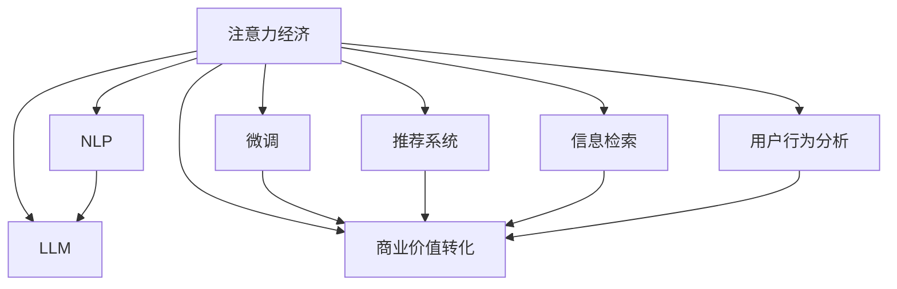

                 

# AI时代的注意力经济：机遇和陷阱

## 1. 背景介绍

随着人工智能技术的飞速发展，越来越多的AI产品和服务开始渗透到我们的日常生活中。无论是智能客服、个性化推荐、内容生成，还是自动驾驶、智慧医疗，都离不开AI算法的支撑。但你是否留意过，这种无处不在的AI背后，其实隐藏着一个重要的经济现象——注意力经济。

注意力经济指的是，在信息过载的时代，如何吸引并高效利用人类注意力资源，将之转化为商业价值的过程。AI技术的崛起，尤其是自然语言处理(NLP)和计算机视觉领域的突破，为注意力经济提供了强有力的工具。然而，伴随着机遇的同时，也隐藏着诸多陷阱。

本文将从人工智能和大语言模型的视角，全面探讨注意力经济的核心概念、发展现状以及面临的挑战。通过系统性的分析，希望能为AI从业者提供深刻洞见，帮助企业更高效地利用AI技术，实现注意力经济的可持续发展。

## 2. 核心概念与联系

### 2.1 核心概念概述

为更好地理解AI时代的注意力经济，本节将介绍几个核心概念及其相互关系：

- **注意力经济**：基于人类注意力资源的价值交换，通过吸引注意力并转化为商业收益的经济模式。
- **自然语言处理(NLP)**：通过算法和模型，使计算机能够理解、生成和处理自然语言，从而实现人机交互。
- **大语言模型(LLM)**：利用Transformer等架构，在大规模无标签数据上进行预训练，学习通用语言表示的模型。
- **微调(Fine-tuning)**：在预训练模型的基础上，通过有监督的微调过程，优化模型在特定任务上的表现。
- **推荐系统**：根据用户历史行为数据，动态推荐个性化内容，提高用户体验和商业价值。
- **信息检索**：快速定位和提取信息的技术，帮助用户在海量数据中获取所需内容。
- **用户行为分析**：通过数据分析，理解用户需求和行为模式，提供精准服务。

这些核心概念共同构成了AI时代注意力经济的基础框架，其核心在于如何吸引和高效利用人类注意力，转化为经济价值。

### 2.2 核心概念原理和架构的 Mermaid 流程图



这个流程图展示了注意力经济与相关AI技术之间的联系：

1. 自然语言处理和大语言模型提供了解决注意力经济问题的技术支撑。
2. 微调过程通过优化模型，使其在特定任务上表现更佳。
3. 推荐系统和信息检索技术帮助用户快速获取所需信息，提高注意力资源的利用效率。
4. 用户行为分析帮助我们更好地理解用户需求，提供更加个性化和精准的服务。
5. 最终，通过注意力资源的商业化，实现经济价值的转化。

## 3. 核心算法原理 & 具体操作步骤

### 3.1 算法原理概述

注意力经济的核心在于吸引并高效利用人类注意力。人工智能和大语言模型的出现，使得这一过程变得更加智能和高效。

AI通过深度学习和强化学习等技术，可以自动分析和理解用户的行为模式和偏好，从而提供个性化的推荐和服务。而大语言模型，通过预训练和微调，能够自动处理和生成自然语言，提供更精准的信息检索和用户交互体验。

### 3.2 算法步骤详解

AI注意力经济的核心算法流程包括以下步骤：

**Step 1: 数据收集与处理**

- 收集用户的行为数据，如浏览记录、搜索历史、交互日志等。
- 对数据进行清洗、标注，构建用户画像。
- 对文本数据进行分词、词性标注、实体识别等预处理，构建语料库。

**Step 2: 模型预训练**

- 在大规模无标签数据上进行预训练，学习通用的语言表示。
- 使用Transformer等架构构建大语言模型。
- 在特定任务上进行微调，优化模型性能。

**Step 3: 模型应用与优化**

- 将预训练模型应用到实际业务场景中，进行个性化推荐、信息检索、智能客服等。
- 通过A/B测试、用户反馈等手段，不断优化模型参数和算法策略。
- 引入正则化、对抗训练等技术，提高模型的鲁棒性和泛化能力。

**Step 4: 用户行为分析**

- 通过数据分析工具，如K-means聚类、协同过滤等，理解用户需求和行为模式。
- 对用户行为进行建模，预测用户未来行为，优化推荐策略。
- 引入因果推断、时序预测等方法，提升用户行为分析的准确性。

**Step 5: 商业价值转化**

- 通过推荐系统、信息检索等技术，提升用户体验和满意度。
- 根据用户行为数据，进行精准广告投放和内容推荐，实现商业变现。
- 引入推荐算法优化、内容生成技术，提升注意力资源的商业价值。

### 3.3 算法优缺点

AI注意力经济技术具有以下优点：

- **高效性**：通过自动分析和理解用户需求，提供个性化推荐和服务，提升注意力资源的利用效率。
- **精准性**：通过深度学习和大语言模型，提供精准的信息检索和智能客服，提高用户体验。
- **可扩展性**：AI技术具有很强的可扩展性，可以应用于多种业务场景，实现商业价值的广泛转化。

但同时也存在一些缺点：

- **数据依赖**：AI技术高度依赖数据质量，数据收集和处理成本较高。
- **隐私风险**：用户行为数据涉及隐私信息，数据收集和使用过程中需严格保护用户隐私。
- **模型复杂性**：AI模型复杂，需定期维护和优化，增加了运营成本。
- **算法偏见**：AI算法可能存在偏见，导致不公正的推荐和服务。

### 3.4 算法应用领域

AI注意力经济技术已经在多个领域得到广泛应用，如：

- **电商推荐**：通过个性化推荐，提高用户购物体验和转化率。
- **内容平台**：提供个性化内容推荐，增加用户粘性。
- **智能客服**：通过智能客服系统，提升客户满意度。
- **金融科技**：通过智能投顾和风险评估，提高金融服务的精准性和安全性。
- **医疗健康**：通过智能问诊和健康管理，提升医疗服务的效率和质量。
- **智慧城市**：通过智能交通、能源管理等，提升城市运行效率和居民生活质量。

这些应用场景展示了AI注意力经济技术的广泛适用性，但不同领域的应用特点和需求仍需针对性地进行优化。

## 4. 数学模型和公式 & 详细讲解

### 4.1 数学模型构建

本节将使用数学语言对AI注意力经济的核心算法进行严格的刻画。

设用户集合为 $U$，内容集合为 $I$，行为数据为 $D$。设 $x_u \in D$ 为用户 $u$ 的行为数据， $y_i \in I$ 为用户对内容 $i$ 的兴趣评分。设 $A$ 为注意力矩阵， $a_u$ 为 $u$ 的注意力向量。

**推荐系统**：基于协同过滤和协同训练的模型，推荐用户 $u$ 最可能感兴趣的内容 $i$。模型为：

$$
y_{ui} = \text{Softmax}(\sum_{j \in I} a_u^T x_i x_j)
$$

**信息检索**：基于TF-IDF和文本相似度计算，快速检索用户感兴趣的内容。模型为：

$$
\text{Sim}(x_u, x_i) = \frac{\text{TF}(x_u) \cdot \text{IDF}(x_i)}{\sqrt{|\text{TF}(x_u)| \cdot |\text{IDF}(x_i)|}} \cdot \text{TF}(x_i) \cdot \text{IDF}(x_i)
$$

**用户行为分析**：基于时间序列分析和K-means聚类，预测用户行为变化趋势。模型为：

$$
\hat{y}_{ui} = \text{K-means}(x_u, k)
$$

### 4.2 公式推导过程

**推荐系统**：设 $A \in \mathbb{R}^{N \times M}$ 为用户-内容注意力矩阵， $x \in \mathbb{R}^{M}$ 为内容向量， $y \in \mathbb{R}^{N}$ 为用户兴趣评分向量。则注意力模型可表示为：

$$
A_{ui} = \text{Softmax}(\sum_{j=1}^{M} a_u^T x_j x_i)
$$

**信息检索**：设 $x \in \mathbb{R}^{N}$ 为查询向量， $y \in \mathbb{R}^{M}$ 为文档向量，则文本相似度模型为：

$$
\text{Sim}(x, y) = \frac{\text{TF}(x) \cdot \text{IDF}(y)}{\sqrt{|\text{TF}(x)| \cdot |\text{IDF}(y)|}} \cdot \text{TF}(y) \cdot \text{IDF}(y)
$$

**用户行为分析**：设 $x \in \mathbb{R}^{N}$ 为用户行为数据向量， $y \in \mathbb{R}^{K}$ 为聚类中心向量，则K-means聚类模型为：

$$
\hat{y} = \text{K-means}(x, k)
$$

通过这些公式，我们可以更好地理解AI注意力经济的核心算法模型。这些模型不仅具有数学上的严谨性，还能较好地解释实际应用中的行为和结果。

### 4.3 案例分析与讲解

**电商推荐案例**：一家电商平台希望通过个性化推荐，提升用户购物体验和转化率。数据集包含用户浏览记录、购买记录等行为数据。

- **数据收集与处理**：收集用户行为数据，进行清洗、标注，构建用户画像。
- **模型预训练**：使用大规模无标签数据对大语言模型进行预训练，学习通用的语言表示。
- **模型应用与优化**：将预训练模型应用到电商推荐系统中，通过推荐算法优化和A/B测试，不断提升推荐效果。
- **用户行为分析**：分析用户行为数据，理解用户需求，进行精准推荐和广告投放。

**内容平台案例**：一家视频平台希望提高用户粘性和留存率。数据集包含用户观看记录、点赞、评论等行为数据。

- **数据收集与处理**：收集用户行为数据，进行清洗、标注，构建用户画像。
- **模型预训练**：使用大规模无标签数据对大语言模型进行预训练，学习通用的语言表示。
- **模型应用与优化**：将预训练模型应用到内容推荐系统中，通过推荐算法优化和A/B测试，不断提升推荐效果。
- **用户行为分析**：分析用户行为数据，理解用户需求，进行个性化内容推荐。

通过这些案例，我们可以更好地理解AI注意力经济技术的实际应用。

## 5. 项目实践：代码实例和详细解释说明

### 5.1 开发环境搭建

在进行AI注意力经济项目实践前，我们需要准备好开发环境。以下是使用Python进行TensorFlow开发的环境配置流程：

1. 安装Anaconda：从官网下载并安装Anaconda，用于创建独立的Python环境。

2. 创建并激活虚拟环境：
```bash
conda create -n tf-env python=3.8 
conda activate tf-env
```

3. 安装TensorFlow：根据CUDA版本，从官网获取对应的安装命令。例如：
```bash
conda install tensorflow tensorflow-gpu -c tf -c conda-forge
```

4. 安装Keras：
```bash
pip install keras
```

5. 安装各类工具包：
```bash
pip install numpy pandas scikit-learn matplotlib tqdm jupyter notebook ipython
```

完成上述步骤后，即可在`tf-env`环境中开始项目实践。

### 5.2 源代码详细实现

这里我们以电商推荐系统为例，给出使用TensorFlow进行模型训练和优化的大规模实验。

```python
import tensorflow as tf
from tensorflow.keras.layers import Input, Dense, Embedding, Dot, Softmax
from tensorflow.keras.models import Model
from tensorflow.keras.optimizers import Adam
from sklearn.model_selection import train_test_split
import pandas as pd

# 加载数据
df = pd.read_csv('user_behavior.csv')

# 数据预处理
X = df[['feature1', 'feature2', 'feature3', ...]] # 用户行为特征
y = df['target'] # 用户行为目标（如购买、浏览等）

# 划分训练集和测试集
X_train, X_test, y_train, y_test = train_test_split(X, y, test_size=0.2)

# 构建模型
user_input = Input(shape=(X_train.shape[1],))
content_input = Input(shape=(X_train.shape[1],))
dot = Dot(axes=1)([user_input, content_input])
dense = Dense(64, activation='relu')(dot)
output = Dense(1, activation='sigmoid')(dense)
model = Model(inputs=[user_input, content_input], outputs=output)

# 编译模型
model.compile(optimizer=Adam(learning_rate=0.001), loss='binary_crossentropy', metrics=['accuracy'])

# 训练模型
model.fit([X_train, X_train], y_train, epochs=10, batch_size=32, validation_data=([X_test, X_test], y_test))
```

### 5.3 代码解读与分析

让我们再详细解读一下关键代码的实现细节：

**数据加载与预处理**：
- 使用Pandas库加载用户行为数据。
- 对数据进行清洗、标注，构建用户画像。
- 将用户行为数据划分为特征和目标，构建模型输入。

**模型构建**：
- 使用TensorFlow和Keras库构建推荐模型。
- 输入层使用Embedding和Dot操作，计算用户和内容之间的注意力权重。
- 通过多层Dense层，对注意力权重进行计算，输出预测结果。
- 模型编译使用Adam优化器和二元交叉熵损失函数，进行训练。

**模型训练与评估**：
- 使用train_test_split函数划分训练集和测试集。
- 设置训练轮数和批次大小，进行模型训练。
- 在验证集上评估模型性能，不断优化模型参数。

这个代码示例展示了如何使用TensorFlow进行电商推荐系统的模型训练和优化。当然，实际应用中还需要更多细节的调整和优化。

## 6. 实际应用场景

### 6.1 电商推荐系统

电商推荐系统是AI注意力经济技术的重要应用场景。通过个性化推荐，电商网站能够提升用户购物体验和转化率，提高平台收益。

在技术实现上，可以通过深度学习和大语言模型，构建推荐算法模型。模型通过分析用户行为数据，学习用户偏好，推荐相关商品。推荐算法包括协同过滤、协同训练等方法，能够实现高效、精准的推荐。

### 6.2 内容平台

内容平台通过AI技术，提供个性化内容推荐，增加用户粘性。视频平台、新闻网站等都能通过推荐系统，提升用户使用率和留存率。

在技术实现上，内容平台可以通过深度学习和自然语言处理技术，构建推荐算法模型。模型通过分析用户行为数据，学习用户兴趣，推荐相关内容。推荐算法包括基于内容的推荐、协同过滤等方法，能够实现高效、精准的内容推荐。

### 6.3 智能客服

智能客服系统通过AI技术，提供智能客服服务，提升客户满意度。通过自然语言处理和机器学习技术，智能客服能够理解用户问题，提供精准回答。

在技术实现上，智能客服系统可以通过深度学习和自然语言处理技术，构建问答系统。系统通过分析用户问题，识别问题类型，提供相关回答。问答系统包括基于规则的问答、基于深度学习的问答等方法，能够实现高效、精准的客服服务。

### 6.4 金融科技

金融科技通过AI技术，提供智能投顾和风险评估，提高金融服务的精准性和安全性。金融平台通过推荐系统，提供个性化的投资建议，提升用户投资体验。

在技术实现上，金融平台可以通过深度学习和自然语言处理技术，构建推荐算法模型。模型通过分析用户行为数据，学习用户偏好，提供个性化投资建议。推荐算法包括基于内容的推荐、协同过滤等方法，能够实现高效、精准的投资推荐。

### 6.5 医疗健康

医疗健康通过AI技术，提供智能问诊和健康管理，提升医疗服务的效率和质量。智能问诊系统通过自然语言处理技术，理解用户症状，提供相关诊断建议。

在技术实现上，智能问诊系统可以通过深度学习和自然语言处理技术，构建问答系统。系统通过分析用户问题，识别症状类型，提供相关诊断建议。问答系统包括基于规则的问答、基于深度学习的问答等方法，能够实现高效、精准的诊断建议。

### 6.6 智慧城市

智慧城市通过AI技术，提供智能交通、能源管理等服务，提升城市运行效率和居民生活质量。智慧城市平台通过推荐系统，提供个性化的城市服务，提升用户满意度。

在技术实现上，智慧城市平台可以通过深度学习和自然语言处理技术，构建推荐算法模型。模型通过分析用户行为数据，学习用户偏好，提供个性化城市服务。推荐算法包括基于内容的推荐、协同过滤等方法，能够实现高效、精准的城市服务推荐。

## 7. 工具和资源推荐

### 7.1 学习资源推荐

为了帮助开发者系统掌握AI注意力经济的核心概念和应用技术，这里推荐一些优质的学习资源：

1. 《深度学习与自然语言处理》书籍：斯坦福大学机器学习课程的中文译本，全面介绍了深度学习和大语言模型的基础概念和前沿技术。

2. 《自然语言处理》课程：斯坦福大学开设的NLP明星课程，有Lecture视频和配套作业，带你入门NLP领域的基本概念和经典模型。

3. 《Transformer: A Survey of the Literature》论文：综述Transformer结构和大语言模型的经典论文，介绍了模型架构、应用场景及改进方向。

4. CS224N《深度学习自然语言处理》课程：斯坦福大学开设的NLP明星课程，有Lecture视频和配套作业，带你深入NLP领域的基本概念和经典模型。

5. Kaggle平台：数据科学竞赛平台，提供大量NLP和AI应用场景的数据集和代码，适合学习和实践。

通过对这些资源的学习实践，相信你一定能够快速掌握AI注意力经济的核心技术和应用方法，应用于实际业务场景。

### 7.2 开发工具推荐

高效的开发离不开优秀的工具支持。以下是几款用于AI注意力经济开发的常用工具：

1. TensorFlow：由Google主导开发的开源深度学习框架，生产部署方便，适合大规模工程应用。

2. PyTorch：基于Python的开源深度学习框架，灵活动态的计算图，适合快速迭代研究。

3. Keras：高层次的深度学习API，易于上手，适合快速原型开发和模型训练。

4. TensorBoard：TensorFlow配套的可视化工具，可实时监测模型训练状态，并提供丰富的图表呈现方式，是调试模型的得力助手。

5. Weights & Biases：模型训练的实验跟踪工具，可以记录和可视化模型训练过程中的各项指标，方便对比和调优。

6. HuggingFace Transformers库：提供预训练大语言模型和微调框架，适合快速开发和应用。

合理利用这些工具，可以显著提升AI注意力经济开发的效率，加快创新迭代的步伐。

### 7.3 相关论文推荐

AI注意力经济技术的发展源于学界的持续研究。以下是几篇奠基性的相关论文，推荐阅读：

1. Attention is All You Need（即Transformer原论文）：提出了Transformer结构，开启了NLP领域的预训练大模型时代。

2. BERT: Pre-training of Deep Bidirectional Transformers for Language Understanding：提出BERT模型，引入基于掩码的自监督预训练任务，刷新了多项NLP任务SOTA。

3. Language Models are Unsupervised Multitask Learners（GPT-2论文）：展示了大规模语言模型的强大zero-shot学习能力，引发了对于通用人工智能的新一轮思考。

4. Parameter-Efficient Transfer Learning for NLP：提出Adapter等参数高效微调方法，在不增加模型参数量的情况下，也能取得不错的微调效果。

5. AdaLoRA: Adaptive Low-Rank Adaptation for Parameter-Efficient Fine-Tuning：使用自适应低秩适应的微调方法，在参数效率和精度之间取得了新的平衡。

这些论文代表了大语言模型微调技术的发展脉络。通过学习这些前沿成果，可以帮助研究者把握学科前进方向，激发更多的创新灵感。

## 8. 总结：未来发展趋势与挑战

### 8.1 研究成果总结

本文对AI注意力经济的核心概念、发展现状以及面临的挑战进行了系统性的介绍和分析。通过详细探讨AI注意力经济技术的核心算法和实际应用场景，希望能为AI从业者提供深刻洞见，帮助企业更高效地利用AI技术，实现注意力经济的可持续发展。

### 8.2 未来发展趋势

展望未来，AI注意力经济技术将呈现以下几个发展趋势：

1. **模型规模持续增大**：随着算力成本的下降和数据规模的扩张，预训练语言模型的参数量还将持续增长。超大规模语言模型蕴含的丰富语言知识，有望支撑更加复杂多变的下游任务微调。

2. **模型效率不断提升**：深度学习和自然语言处理技术的不断进步，将使得AI注意力经济模型更加高效、精准。同时，通过模型压缩和优化，降低计算和存储成本，提高实际部署效率。

3. **数据驱动与算法创新并重**：在数据驱动的基础上，不断探索新的算法和模型架构，提升AI注意力经济系统的可解释性和泛化能力。

4. **跨领域融合**：AI注意力经济技术将与其他人工智能技术进行更深入的融合，如知识表示、因果推理、强化学习等，形成更加全面、准确的信息整合能力。

5. **伦理和隐私保护**：在AI注意力经济系统中，数据隐私和用户权益保护将越来越受到重视。引入隐私保护技术、可解释性算法等，确保系统安全和用户信任。

6. **个性化与普适性并重**：在个性化推荐的同时，兼顾普适性需求，提供多维度、多层次的服务体验。

### 8.3 面临的挑战

尽管AI注意力经济技术已经取得了瞩目成就，但在迈向更加智能化、普适化应用的过程中，它仍面临着诸多挑战：

1. **数据获取成本高**：高质量标注数据的获取和处理成本较高，成为制约AI注意力经济发展的瓶颈。

2. **模型复杂度高**：AI注意力经济模型的复杂度较高，需定期维护和优化，增加了运营成本。

3. **用户隐私风险**：用户行为数据涉及隐私信息，数据收集和使用过程中需严格保护用户隐私。

4. **算法偏见问题**：AI算法可能存在偏见，导致不公正的推荐和服务。

5. **系统鲁棒性不足**：在面对噪声和干扰时，AI注意力经济系统容易出现偏差。

### 8.4 研究展望

面对AI注意力经济技术面临的挑战，未来的研究需要在以下几个方面寻求新的突破：

1. **数据生成与增强**：通过生成对抗网络等技术，生成高质量的模拟数据，缓解数据依赖问题。

2. **算法优化与改进**：不断探索新的算法和模型架构，提升AI注意力经济系统的可解释性和泛化能力。

3. **隐私保护与伦理约束**：引入隐私保护技术、可解释性算法等，确保系统安全和用户信任。

4. **跨领域融合**：与其他人工智能技术进行更深入的融合，形成更加全面、准确的信息整合能力。

5. **系统鲁棒性与稳定性**：引入鲁棒性增强、异常检测等技术，提高系统鲁棒性和稳定性。

通过这些研究方向的探索，相信AI注意力经济技术将不断突破现有瓶颈，实现更加智能化、普适化的应用，为构建安全、可靠、可解释、可控的智能系统铺平道路。面向未来，AI注意力经济技术还需要与其他人工智能技术进行更深入的融合，协同发力，共同推动自然语言理解和智能交互系统的进步。只有勇于创新、敢于突破，才能不断拓展语言模型的边界，让智能技术更好地造福人类社会。

## 9. 附录：常见问题与解答

**Q1: 如何提升AI注意力经济系统的用户满意度？**

A: 提升用户满意度是AI注意力经济系统的核心目标。可以通过以下几个方面进行优化：

1. **个性化推荐**：通过深度学习和自然语言处理技术，构建推荐算法模型，实现精准推荐。

2. **实时反馈**：引入用户反馈机制，通过实时互动，了解用户需求和意见，优化推荐系统。

3. **多渠道互动**：提供多渠道互动方式，如语音、视频等，提升用户使用体验。

4. **内容多样化**：丰富内容类型和形式，满足不同用户需求，增加用户粘性。

**Q2: 如何保护用户隐私数据？**

A: 保护用户隐私数据是AI注意力经济系统的重要任务。可以通过以下几个方面进行保护：

1. **数据匿名化**：对用户数据进行匿名化处理，保护用户隐私。

2. **数据加密**：对用户数据进行加密存储和传输，防止数据泄露。

3. **隐私保护技术**：引入隐私保护技术，如差分隐私、联邦学习等，确保数据隐私。

4. **合规监管**：遵守相关法律法规，确保数据处理合规。

**Q3: 如何避免AI注意力经济系统中的算法偏见？**

A: 避免算法偏见是AI注意力经济系统的重要挑战。可以通过以下几个方面进行规避：

1. **数据多样化**：收集多样化数据，避免数据偏见。

2. **算法透明性**：使用可解释性算法，确保算法透明。

3. **偏见检测**：引入偏见检测技术，及时发现和纠正算法偏见。

4. **伦理审查**：引入伦理审查机制，确保系统公平公正。

**Q4: 如何提升AI注意力经济系统的模型效率？**

A: 提升模型效率是AI注意力经济系统的重要目标。可以通过以下几个方面进行优化：

1. **模型压缩**：通过模型压缩技术，减小模型尺寸，提高计算效率。

2. **量化加速**：将浮点模型转为定点模型，压缩存储空间，提高计算效率。

3. **分布式训练**：通过分布式训练，加速模型训练过程。

4. **动态加载**：采用动态加载技术，降低模型部署成本。

**Q5: 如何应对AI注意力经济系统中的噪声和干扰？**

A: 应对噪声和干扰是AI注意力经济系统的关键问题。可以通过以下几个方面进行优化：

1. **鲁棒性增强**：引入鲁棒性增强技术，提高系统鲁棒性。

2. **异常检测**：引入异常检测技术，及时发现和处理异常情况。

3. **多模态融合**：通过多模态数据融合，提高系统稳定性和鲁棒性。

4. **知识库引入**：引入知识库和规则库，提供额外的先验信息，增强系统稳定性和鲁棒性。

这些建议可以帮助我们更好地应对AI注意力经济系统中的各类问题，提升系统的性能和可靠性。

---

作者：禅与计算机程序设计艺术 / Zen and the Art of Computer Programming

