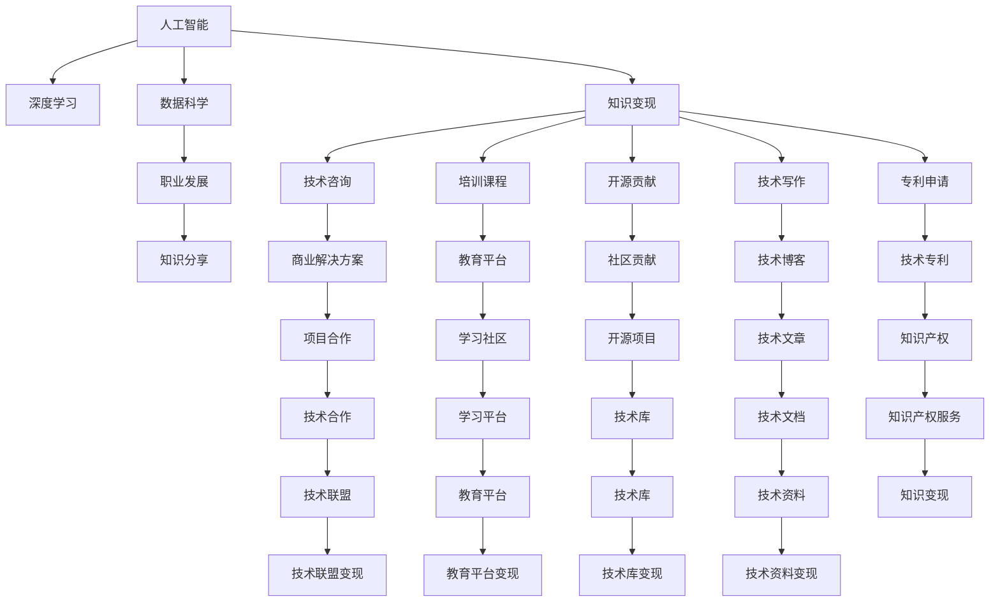

                 

# AI时代程序员的知识变现之路

> 关键词：知识变现,人工智能,技术变现,机器学习,深度学习,数据科学,职业发展,知识分享

## 1. 背景介绍

在AI时代，技术知识的变现方式发生了深刻变革。随着人工智能、深度学习和数据科学技术的不断成熟，程序员不再是简单的代码编写者，而是具备高级认知能力的技术专家。他们利用自身的技术知识和经验，通过多种方式实现个人价值的最大化。本文将深入探讨AI时代程序员的知识变现之路，包括技术变现的多样化路径、实际应用场景、工具和资源推荐，以及未来发展趋势与挑战。

## 2. 核心概念与联系

### 2.1 核心概念概述

1. **知识变现**：指通过将自身掌握的技术知识和经验转化为有形的价值或收益。这包括技术咨询、培训、开源贡献、技术写作、专利申请等多种形式。

2. **人工智能**：通过机器学习、深度学习等技术，使计算机系统具备模拟人类智能的能力，实现对复杂问题的理解和处理。

3. **深度学习**：一种基于神经网络的学习方法，通过多层非线性映射，实现对高维数据的高效处理和特征提取。

4. **数据科学**：利用数据挖掘、统计分析、机器学习等技术，从海量数据中提取有价值的信息，辅助决策和优化。

5. **职业发展**：程序员通过不断学习和实践，提升自身技术能力和专业水平，实现职业生涯的持续成长和晋升。

6. **知识分享**：通过博客、书籍、视频教程、线上课程等形式，将自身的技术知识分享给更多人，推动技术社区的进步和繁荣。

这些核心概念之间存在紧密的联系，共同构成了AI时代程序员知识变现的基本框架。

### 2.2 核心概念原理和架构的 Mermaid 流程图



这个流程图展示了人工智能、深度学习、数据科学等核心概念如何通过不同的途径支持程序员的知识变现，并且通过职业发展和知识分享进一步提升这些变现方式的效用。

## 3. 核心算法原理 & 具体操作步骤

### 3.1 算法原理概述

AI时代程序员的知识变现之路，主要基于以下几个核心算法原理：

1. **机器学习**：通过训练算法模型，从数据中学习和提取规律，实现对新数据的预测和分类。程序员可以利用机器学习算法解决实际问题，实现技术变现。

2. **深度学习**：通过多层神经网络结构，深度学习算法能够处理更复杂的数据结构，识别更深层次的模式和特征。在图像识别、自然语言处理等领域，深度学习算法展现出强大的能力。

3. **数据科学**：通过数据清洗、特征工程、模型训练和评估等步骤，数据科学方法能够从数据中提取有价值的信息，支持决策和优化。在商业智能、风险管理等领域，数据科学方法发挥着重要作用。

4. **自然语言处理**：通过文本预处理、特征提取、模型训练和生成等步骤，自然语言处理技术能够实现对文本数据的理解和生成。在智能客服、智能翻译、文本分类等领域，自然语言处理技术展现出广泛的应用前景。

5. **计算机视觉**：通过图像和视频数据的处理和分析，计算机视觉技术能够实现对图像和视频内容的理解和识别。在自动驾驶、智能监控、医疗影像分析等领域，计算机视觉技术发挥着重要作用。

### 3.2 算法步骤详解

1. **数据收集与预处理**：收集和清洗与目标任务相关的数据，进行必要的特征工程，如数据归一化、缺失值处理等。

2. **模型选择与训练**：选择合适的算法模型，利用训练数据对其进行训练，通过交叉验证等方法进行调参，优化模型性能。

3. **模型评估与优化**：在测试数据上评估模型性能，通过调整模型结构和超参数，进一步提升模型效果。

4. **模型应用与迭代**：将训练好的模型应用于实际问题中，根据反馈不断优化模型，实现技术变现。

5. **知识分享与反馈**：通过技术博客、开源项目、在线课程等形式，分享模型的应用和优化经验，获取社区反馈，进一步提升技术能力。

### 3.3 算法优缺点

**优点**：

- **高效解决问题**：通过机器学习和深度学习算法，程序员可以高效解决复杂问题，实现技术变现。
- **广泛应用领域**：AI技术在多个领域展现出强大的应用潜力，程序员可以灵活应用，实现多样化变现。
- **技术社区支持**：开源社区和在线平台为程序员提供了丰富的资源和交流机会，有助于技术能力的提升和变现。

**缺点**：

- **数据需求高**：大多数AI技术依赖大量高质量数据，数据获取和预处理可能成为变现的瓶颈。
- **算法复杂度高**：深度学习和复杂模型需要较高的计算资源和算法知识，对程序员的技术要求较高。
- **技术迭代快**：AI技术更新速度快，需要程序员不断学习和跟进，才能保持技术竞争力。

### 3.4 算法应用领域

AI时代程序员的知识变现主要应用于以下几个领域：

1. **商业智能**：利用机器学习和数据科学方法，从海量数据中提取有价值的信息，支持企业决策和优化。

2. **金融科技**：通过自然语言处理和计算机视觉技术，实现金融数据的自动化分析和处理，提升金融服务的效率和精准度。

3. **医疗健康**：利用深度学习和计算机视觉技术，实现医疗影像的自动分析和诊断，提高医疗服务的效率和准确性。

4. **智能客服**：通过自然语言处理技术，实现智能客服系统的构建，提升客户服务体验。

5. **教育培训**：通过在线课程和教育平台，分享和传播技术知识，推动教育资源的普及和共享。

6. **游戏开发**：利用计算机视觉和自然语言处理技术，实现游戏的智能化和互动化，提升游戏体验。

## 4. 数学模型和公式 & 详细讲解

### 4.1 数学模型构建

假设一个AI模型用于图像分类任务，其输入为图像数据 $X$，输出为分类标签 $Y$。模型的输入输出关系可以表示为：

$$
Y = f(X; \theta)
$$

其中 $f$ 为模型的映射函数，$\theta$ 为模型的参数。常见的机器学习模型包括线性回归、逻辑回归、决策树、随机森林、神经网络等。

### 4.2 公式推导过程

以线性回归模型为例，推导其损失函数和梯度计算公式。

假设训练样本数量为 $N$，输入数据 $X = [x_1, x_2, ..., x_N]$，输出数据 $Y = [y_1, y_2, ..., y_N]$，模型参数 $\theta = [\theta_1, \theta_2, ..., \theta_M]$。线性回归模型的目标是最小化预测值与真实值之间的平方误差，即：

$$
\mathcal{L}(\theta) = \frac{1}{N}\sum_{i=1}^N (y_i - \hat{y}_i)^2
$$

其中 $\hat{y}_i = f(x_i; \theta)$ 为模型对第 $i$ 个样本的预测值。

利用梯度下降算法，求解 $\mathcal{L}(\theta)$ 的最小值，得到模型参数的更新公式：

$$
\theta_j = \theta_j - \eta \frac{\partial \mathcal{L}(\theta)}{\partial \theta_j}
$$

其中 $\eta$ 为学习率。通过反向传播算法计算 $\frac{\partial \mathcal{L}(\theta)}{\partial \theta_j}$，得到模型参数的梯度，进而更新参数。

### 4.3 案例分析与讲解

以图像分类任务为例，通过数据预处理、模型训练和评估，实现知识变现。

1. **数据预处理**：将图像数据进行归一化、缩放、裁剪等处理，提取特征，如颜色直方图、边缘特征等。

2. **模型训练**：选择合适的深度学习模型（如卷积神经网络），利用训练数据进行模型训练，调整超参数，优化模型性能。

3. **模型评估**：在测试数据上评估模型性能，通过调整模型结构和超参数，进一步提升模型效果。

4. **模型应用**：将训练好的模型应用于实际问题中，如识别图像中的物体，实现技术变现。

5. **知识分享**：通过技术博客、开源项目、在线课程等形式，分享模型的应用和优化经验，获取社区反馈，进一步提升技术能力。

## 5. 项目实践：代码实例和详细解释说明

### 5.1 开发环境搭建

1. **环境安装**：
   - 安装Python 3.7及以上版本。
   - 安装深度学习框架（如TensorFlow、PyTorch）和数据科学库（如Pandas、NumPy）。

2. **项目创建**：
   - 使用Python创建项目目录，如 `my_project`。
   - 在项目中创建文件结构，如 `my_project/`
   - 在项目根目录下创建虚拟环境，如 `my_project/venv`。

3. **环境激活**：
   - 激活虚拟环境，如 `source venv/bin/activate`。

### 5.2 源代码详细实现

以图像分类任务为例，使用PyTorch框架实现模型的训练和评估。

1. **数据加载与预处理**：
   ```python
   import torch
   from torchvision import datasets, transforms

   transform = transforms.Compose([
       transforms.Resize(256),
       transforms.CenterCrop(224),
       transforms.ToTensor(),
       transforms.Normalize(mean=[0.485, 0.456, 0.406],
                            std=[0.229, 0.224, 0.225])
   ])

   data = datasets.CIFAR10(root='data', train=True, download=True,
                           transform=transform)
   ```

2. **模型定义**：
   ```python
   import torch.nn as nn
   import torch.nn.functional as F

   class Net(nn.Module):
       def __init__(self):
           super(Net, self).__init__()
           self.conv1 = nn.Conv2d(3, 64, 3, 1, 1)
           self.pool = nn.MaxPool2d(2, 2)
           self.conv2 = nn.Conv2d(64, 128, 3, 1, 1)
           self.fc1 = nn.Linear(128 * 8 * 8, 1024)
           self.fc2 = nn.Linear(1024, 10)
           self.dropout = nn.Dropout(0.5)

       def forward(self, x):
           x = self.pool(F.relu(self.conv1(x)))
           x = self.pool(F.relu(self.conv2(x)))
           x = x.view(-1, 128 * 8 * 8)
           x = F.relu(self.fc1(x))
           x = self.dropout(x)
           x = self.fc2(x)
           output = F.log_softmax(x, dim=1)
           return output
   ```

3. **训练与评估**：
   ```python
   net = Net()
   criterion = nn.CrossEntropyLoss()
   optimizer = torch.optim.Adam(net.parameters(), lr=0.001)

   for epoch in range(10):
       running_loss = 0.0
       for i, data in enumerate(train_loader, 0):
           inputs, labels = data
           optimizer.zero_grad()
           outputs = net(inputs)
           loss = criterion(outputs, labels)
           loss.backward()
           optimizer.step()

           running_loss += loss.item()
           if i % 100 == 99:
               print('[%d, %5d] loss: %.3f' %
                     (epoch + 1, i + 1, running_loss / 100))
               running_loss = 0.0
       ```

4. **结果展示**：
   ```python
   test_loss = 0
   test_acc = 0
   with torch.no_grad():
       correct = 0
       for data in test_loader:
           images, labels = data
           outputs = net(images)
           _, predicted = torch.max(outputs.data, 1)
           correct += predicted.eq(labels.data).sum().item()
           test_loss += criterion(outputs, labels).item()
   test_loss /= len(test_loader.dataset)
   test_acc = 100 * correct / len(test_loader.dataset)
   print('Test Loss: %.3f' % test_loss)
   print('Test Accuracy: %d %%' % test_acc)
   ```

### 5.3 代码解读与分析

**数据加载与预处理**：
- 使用 `torchvision.datasets.CIFAR10` 加载CIFAR-10数据集。
- 定义数据预处理步骤，包括归一化、裁剪、缩放和标准化。

**模型定义**：
- 定义网络结构，包括卷积层、池化层、全连接层和Dropout层。
- 定义前向传播函数，实现输入数据到输出标签的映射。

**训练与评估**：
- 定义损失函数和优化器，使用Adam算法优化模型参数。
- 在每个epoch内，对训练集进行迭代训练，更新模型参数。
- 在每个epoch结束时，输出训练损失。

**结果展示**：
- 使用测试集对模型进行评估，输出测试损失和准确率。

## 6. 实际应用场景

### 6.1 商业智能

在商业智能领域，AI技术被广泛应用于数据挖掘、预测分析和决策支持等环节。通过机器学习和数据科学方法，企业可以从海量数据中提取有价值的信息，支持业务决策和优化。

**案例分析**：
- 某电商平台通过分析用户行为数据，构建推荐模型，实现个性化推荐，提升用户满意度和销售额。

**实现路径**：
1. **数据收集**：收集用户点击、购买、浏览等行为数据。
2. **数据预处理**：清洗和格式化数据，提取用户行为特征。
3. **模型训练**：选择合适的推荐算法模型，如协同过滤、深度学习等，利用训练数据进行模型训练。
4. **模型评估**：在测试数据上评估模型性能，通过调整模型结构和超参数，进一步提升模型效果。
5. **模型应用**：将训练好的推荐模型应用于实际推荐系统中，提升推荐效果和用户体验。

### 6.2 金融科技

在金融科技领域，AI技术被广泛应用于风险管理、欺诈检测、客户服务等环节。通过自然语言处理和计算机视觉技术，金融机构可以提高服务效率和客户满意度。

**案例分析**：
- 某银行通过分析客户反馈和投诉数据，构建情感分析模型，提升客户服务质量和满意度。

**实现路径**：
1. **数据收集**：收集客户反馈和投诉数据。
2. **数据预处理**：清洗和格式化数据，提取情感信息。
3. **模型训练**：选择合适的自然语言处理模型，如BERT等，利用训练数据进行模型训练。
4. **模型评估**：在测试数据上评估模型性能，通过调整模型结构和超参数，进一步提升模型效果。
5. **模型应用**：将训练好的情感分析模型应用于客户服务系统中，提升客户服务质量和满意度。

### 6.3 医疗健康

在医疗健康领域，AI技术被广泛应用于疾病诊断、治疗方案推荐、患者管理等环节。通过深度学习和计算机视觉技术，医疗机构可以提高诊断准确性和治疗效果。

**案例分析**：
- 某医院通过分析医学影像数据，构建图像识别模型，提升疾病诊断准确性。

**实现路径**：
1. **数据收集**：收集医学影像数据，如CT、MRI等。
2. **数据预处理**：清洗和格式化数据，提取特征信息。
3. **模型训练**：选择合适的深度学习模型，如卷积神经网络，利用训练数据进行模型训练。
4. **模型评估**：在测试数据上评估模型性能，通过调整模型结构和超参数，进一步提升模型效果。
5. **模型应用**：将训练好的图像识别模型应用于医疗影像分析中，提升疾病诊断准确性。

## 7. 工具和资源推荐

### 7.1 学习资源推荐

1. **《深度学习》书籍**：由Ian Goodfellow、Yoshua Bengio和Aaron Courville撰写，深入浅出地介绍了深度学习的基础理论和应用案例。
2. **《Python机器学习》书籍**：由Sebastian Raschka和Vahid Mirjalili撰写，详细介绍了机器学习算法和Python实现。
3. **Coursera在线课程**：提供多门与AI相关的在线课程，涵盖机器学习、深度学习、计算机视觉等领域。
4. **Kaggle竞赛**：参与Kaggle数据科学竞赛，实践和提升数据处理、模型训练和评估能力。
5. **Github开源项目**：参与开源项目，学习和分享前沿技术和代码实现。

### 7.2 开发工具推荐

1. **Python**：Python是目前最流行的编程语言之一，广泛应用于数据科学、机器学习和深度学习领域。
2. **Jupyter Notebook**：Jupyter Notebook是一个交互式编程环境，支持代码块、数学公式和图像的实时显示，非常适合数据科学和机器学习项目。
3. **TensorFlow**：由Google开发，是目前最流行的深度学习框架之一，支持多种模型和算法。
4. **PyTorch**：由Facebook开发，是另一个流行的深度学习框架，具有动态计算图和易于使用的API。
5. **Scikit-learn**：Scikit-learn是一个简单易用的机器学习库，提供了多种经典算法的实现。

### 7.3 相关论文推荐

1. **《Deep Learning》论文**：Ian Goodfellow等人撰写的深度学习综述论文，详细介绍了深度学习的基础理论和算法。
2. **《ImageNet Classification with Deep Convolutional Neural Networks》论文**：Alex Krizhevsky等人撰写的深度学习在图像分类任务上的突破性论文，奠定了深度卷积神经网络的基础。
3. **《Attention Is All You Need》论文**：Ashish Vaswani等人撰写的Transformer论文，提出了自注意力机制，推动了自然语言处理领域的发展。
4. **《A Survey on Transfer Learning in Natural Language Processing》论文**：Ilya Sutskever等人撰写的自然语言处理领域中的迁移学习综述论文。
5. **《Machine Learning Yearning》书籍**：Andrew Ng撰写的机器学习实践指南，详细介绍了机器学习项目的管理、评估和优化。

## 8. 总结：未来发展趋势与挑战

### 8.1 研究成果总结

AI时代程序员的知识变现之路，已经从单一的技术开发和算法实现，拓展到更加多样化的知识分享和变现形式。通过机器学习、深度学习和数据科学等技术，程序员可以高效解决复杂问题，实现技术变现。同时，技术社区和在线平台的崛起，也为程序员提供了丰富的资源和交流机会。

### 8.2 未来发展趋势

1. **技术演进加速**：随着深度学习和大数据技术的不断进步，AI技术的应用范围和效果将不断拓展，推动更多领域的智能化发展。
2. **跨领域融合**：AI技术与自然语言处理、计算机视觉、物联网等领域的融合，将带来更加丰富多样的应用场景和变现方式。
3. **算法创新**：基于现有算法的改进和创新，如神经网络架构搜索、自适应学习率等，将进一步提升AI系统的性能和效率。
4. **开源共享**：开源社区的繁荣发展，将促进AI技术的普及和应用，降低技术门槛，提升变现能力。

### 8.3 面临的挑战

1. **数据隐私和安全**：随着AI技术的广泛应用，数据隐私和安全问题日益突出。如何保护用户隐私，确保数据安全，是未来面临的重要挑战。
2. **算法透明度和可解释性**：AI算法的复杂性和黑盒特性，使得其可解释性较差。如何提高算法的透明度和可解释性，增强用户信任，是未来需要解决的问题。
3. **技术普及和教育**：AI技术的应用需要大量的技术支持和教育资源，如何普及AI技术，提升公众的技术素养，是未来重要的任务。
4. **伦理和社会责任**：AI技术的应用可能带来伦理和社会问题，如何制定相应的规范和标准，确保AI技术的健康发展，是未来需要考虑的重要议题。

### 8.4 研究展望

未来，AI时代程序员的知识变现之路将更加多样化和创新化。通过不断探索和实践，程序员可以在更多领域实现技术变现，推动人工智能技术的普及和应用。同时，技术社区和在线平台的不断发展和完善，也将为程序员提供更多的资源和机会，提升技术能力和社会影响力。

总之，AI时代程序员的知识变现之路，充满了无限可能和挑战。只有不断学习和实践，勇于创新和探索，才能在未来的技术浪潮中占据一席之地，实现个人价值的最大化。

## 9. 附录：常见问题与解答

### Q1：AI技术的发展对程序员的职业发展有何影响？

A: AI技术的发展将带来更多的职业机会和挑战。程序员需要不断学习新技术，提升自身技术能力和专业水平，才能在激烈的竞争中脱颖而出。AI技术的普及也将推动更多领域的智能化发展，为程序员提供更多职业选择和发展空间。

### Q2：AI技术在实际应用中面临哪些挑战？

A: AI技术在实际应用中面临数据隐私和安全、算法透明度和可解释性、技术普及和教育、伦理和社会责任等挑战。如何保护用户隐私，确保数据安全，提高算法的透明度和可解释性，普及AI技术，制定相应的规范和标准，是未来需要解决的重要问题。

### Q3：如何利用AI技术进行知识变现？

A: 利用AI技术进行知识变现，可以通过技术咨询、培训课程、开源贡献、技术写作、专利申请等多种形式。例如，通过技术博客、开源项目、在线课程等形式，分享和传播技术知识，获取社区反馈，进一步提升技术能力。同时，通过参与商业智能、金融科技、医疗健康等领域的项目，实现技术变现。

### Q4：未来AI技术的趋势是什么？

A: 未来AI技术的趋势包括技术演进加速、跨领域融合、算法创新、开源共享等。深度学习和大数据技术的不断进步，将推动AI技术的应用范围和效果不断拓展。AI技术与自然语言处理、计算机视觉、物联网等领域的融合，将带来更加丰富多样的应用场景和变现方式。基于现有算法的改进和创新，如神经网络架构搜索、自适应学习率等，将进一步提升AI系统的性能和效率。开源社区的繁荣发展，将促进AI技术的普及和应用，降低技术门槛，提升变现能力。

### Q5：AI技术在实际应用中如何保护数据隐私？

A: 在AI技术应用中，保护数据隐私需要采取多重措施。例如，采用数据匿名化、加密技术、差分隐私等方法，保护用户隐私。同时，建立数据使用的透明和可控机制，确保数据使用的合法性和合理性。此外，制定相关法律法规和标准，规范数据使用的行为和责任，也是保护数据隐私的重要措施。

---

作者：禅与计算机程序设计艺术 / Zen and the Art of Computer Programming

