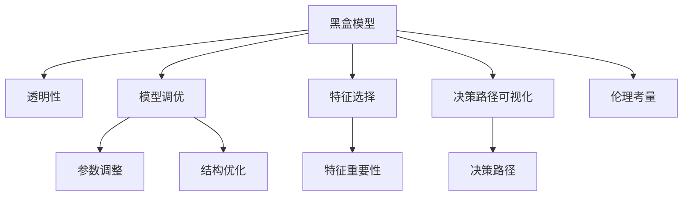

                 

# AI模型的可解释性：打开黑盒子

> 关键词：可解释性, 透明性, 黑盒模型, 模型调试, 模型优化, 决策路径, 可视化工具, 伦理考量, 人工智能治理

## 1. 背景介绍

### 1.1 问题由来
随着人工智能技术的迅速发展，AI模型在众多领域的应用已经达到了前所未有的高度。然而，这些复杂的AI模型就像一个“黑盒子”，其内部运作机理和决策过程对于用户来说往往是不可见的。这种缺乏透明度的模型，导致了许多问题，如难以理解和信任模型的输出、无法调试模型等。这些问题在医疗、金融等高风险领域尤为严重，模型的不透明性可能会带来严重的后果。因此，如何提高AI模型的可解释性，成为当前人工智能领域亟待解决的重要课题。

### 1.2 问题核心关键点
提高AI模型的可解释性，关键在于让模型的决策过程变得透明，使用户能够理解模型的行为和结果。这不仅可以提升用户对模型的信任度，还可以帮助开发者调试和优化模型，从而提高模型的性能和鲁棒性。可解释性研究涵盖了多个方面，包括模型调优、特征选择、决策路径可视化、透明性评估等。

## 2. 核心概念与联系

### 2.1 核心概念概述

为更好地理解AI模型的可解释性，本节将介绍几个密切相关的核心概念：

- **黑盒模型**：指模型的内部运作机理对用户不可见，仅提供输入和输出结果的模型。典型的黑盒模型包括决策树、神经网络、深度学习模型等。
- **透明性**：指模型的内部运作过程和决策依据可以被用户理解和解释的程度。透明性较高的模型，其可解释性也较高。
- **模型调优**：通过优化模型的结构、参数、训练数据等，提高模型性能和透明性的过程。
- **特征选择**：选择对模型输出有重要影响的特征，帮助理解模型决策依据。
- **决策路径可视化**：通过图形化展示模型内部决策过程，直观展示模型的判断依据。
- **伦理考量**：在模型设计和使用过程中，需考虑伦理问题，如偏见、公平性、隐私等。

这些核心概念之间的逻辑关系可以通过以下Mermaid流程图来展示：



这个流程图展示了这个框架下的核心概念及其之间的关系：

1. 黑盒模型通过透明性、调优和可视化等手段提升可解释性。
2. 特征选择和伦理考量是模型透明性的重要组成部分。
3. 透明性、调优和伦理考量共同构成了提升模型可解释性的关键要素。

## 3. 核心算法原理 & 具体操作步骤
### 3.1 算法原理概述

AI模型的可解释性研究主要是通过提升模型的透明性来实现的。模型的透明性可以理解为模型能够清晰地表达其决策过程的程度。要提高模型的透明性，需要对模型的内部运作机制进行深入分析，包括模型结构、特征选择、训练过程等。

基于上述理解，本文将从模型调优、特征选择、决策路径可视化三个方面，详细介绍如何提升模型的透明性。

### 3.2 算法步骤详解

**步骤1：模型调优**

模型调优是提高模型透明性的第一步。模型调优的目标是通过优化模型的结构和参数，使其在保证性能的前提下，更加易于理解和解释。常用的模型调优方法包括：

- **结构优化**：减少模型的复杂度，去除不必要的层或节点，简化模型结构。
- **参数调整**：优化模型的超参数，如学习率、批大小等，以提高模型的稳定性和泛化能力。
- **数据增强**：通过增加训练数据的多样性，提高模型的鲁棒性和泛化能力。
- **正则化**：引入L1、L2正则化等技术，防止模型过拟合，提高模型的泛化能力。

**步骤2：特征选择**

特征选择是提高模型透明性的重要手段。特征选择不仅可以帮助理解模型决策依据，还可以提高模型的泛化能力和鲁棒性。常用的特征选择方法包括：

- **特征重要性**：通过计算特征在模型中的重要性，选择对模型输出有重要影响的特征。
- **相关性分析**：通过计算特征与目标变量之间的相关性，选择与目标变量关系密切的特征。
- **互信息**：通过计算特征与目标变量之间的互信息，选择对模型输出有较强影响的特征。

**步骤3：决策路径可视化**

决策路径可视化是提高模型透明性的关键方法。通过图形化展示模型内部决策过程，直观展示模型的判断依据，使用户更容易理解模型的行为。常用的决策路径可视化方法包括：

- **决策树可视化**：将决策树图形化展示，直观展示模型的决策路径。
- **特征贡献图**：展示模型中各特征对预测结果的贡献度。
- **LIME和SHAP**：通过局部解释模型（LIME）和SHAP（Shapley Additive Explanations）等技术，生成模型在不同样本上的局部解释，帮助理解模型的决策过程。

### 3.3 算法优缺点

提升AI模型透明性的方法具有以下优点：

- **增强用户信任**：提高模型的透明性，可以帮助用户理解模型的决策依据，增强用户对模型的信任。
- **便于模型调试**：通过透明性分析，可以更快速地发现和解决模型中的问题，提高模型的性能。
- **优化模型结构**：通过透明性分析，可以优化模型结构，减少冗余，提高模型的效率。

同时，这些方法也存在一些局限性：

- **计算开销**：一些透明性分析方法（如LIME、SHAP）计算开销较大，适用于小规模数据集。
- **解释局限性**：透明性分析只能提供局部的解释，难以全面解释复杂模型的决策过程。
- **数据依赖**：透明性分析依赖于训练数据的质量，若数据质量较差，分析结果可能不准确。
- **模型复杂度**：复杂模型（如深度神经网络）的透明性分析难度较大，需要更复杂的工具和技术。

尽管存在这些局限性，但这些方法仍是提高模型透明性、提升模型可解释性的重要手段。未来，随着技术的发展，透明性分析将变得更加高效和准确。

### 3.4 算法应用领域

基于透明性分析的方法，已经在多个领域得到了广泛应用，涵盖了以下应用场景：

- **医疗诊断**：用于解释医疗影像诊断、病历分析等模型的决策过程，帮助医生理解诊断依据。
- **金融风控**：用于解释信用评分、欺诈检测等模型的决策过程，帮助金融机构提升风险控制能力。
- **法律咨询**：用于解释合同审核、法律判断等模型的决策过程，帮助律师理解决策依据。
- **智能客服**：用于解释智能客服系统的决策过程，帮助客服理解问题解答依据，提升客户满意度。
- **推荐系统**：用于解释推荐系统的决策过程，帮助用户理解推荐依据，提高推荐效果。

## 4. 数学模型和公式 & 详细讲解  
### 4.1 数学模型构建

本文将以决策树模型为例，介绍如何构建透明性分析的数学模型。

假设决策树模型为：
$$
T = \{(t_0, C_0), (t_1, C_1), ..., (t_k, C_k)\}
$$
其中 $t_i$ 为第 $i$ 个节点，$C_i$ 为该节点的分类结果。

对于决策树模型的透明性分析，可以通过计算每个节点对最终分类结果的贡献度来进行。节点 $t_i$ 对最终分类结果的贡献度为：
$$
\text{Contribution}(t_i) = \sum_{j=0}^{k} |C_j| \times \text{Probability}(C_j|t_i)
$$

其中，$|C_j|$ 为节点 $C_j$ 的样本数，$\text{Probability}(C_j|t_i)$ 为节点 $C_j$ 在该节点 $t_i$ 上的条件概率。

### 4.2 公式推导过程

决策树模型的透明性分析可以通过计算每个节点对最终分类结果的贡献度来进行。节点 $t_i$ 对最终分类结果的贡献度为：
$$
\text{Contribution}(t_i) = \sum_{j=0}^{k} |C_j| \times \text{Probability}(C_j|t_i)
$$

其中，$|C_j|$ 为节点 $C_j$ 的样本数，$\text{Probability}(C_j|t_i)$ 为节点 $C_j$ 在该节点 $t_i$ 上的条件概率。

通过计算每个节点的贡献度，可以直观展示模型在每个节点的决策依据。

### 4.3 案例分析与讲解

假设我们有一个简单的决策树模型，用于分类手写数字图像。该模型共有5个节点，每个节点的分类结果如下：

| 节点编号 | 分类结果 | 样本数 |
| -------- | -------- | ------ |
| 1        | 1        | 200    |
| 2        | 2        | 150    |
| 3        | 3        | 300    |
| 4        | 4        | 150    |
| 5        | 5        | 100    |

我们可以计算每个节点的贡献度，如下：

- 节点1的贡献度为 $|1| \times \text{Probability}(1|1) = 200 \times \frac{200}{800} = 0.25$
- 节点2的贡献度为 $|2| \times \text{Probability}(2|2) = 150 \times \frac{150}{800} = 0.1875$
- 节点3的贡献度为 $|3| \times \text{Probability}(3|3) = 300 \times \frac{300}{800} = 0.375$
- 节点4的贡献度为 $|4| \times \text{Probability}(4|4) = 150 \times \frac{150}{800} = 0.1875$
- 节点5的贡献度为 $|5| \times \text{Probability}(5|5) = 100 \times \frac{100}{800} = 0.125$

通过这些贡献度，我们可以直观地看到模型在每个节点的决策依据。例如，节点3对最终分类结果的贡献度最大，说明节点3的决策对模型结果影响最大。

## 5. 项目实践：代码实例和详细解释说明
### 5.1 开发环境搭建

在进行透明性分析实践前，我们需要准备好开发环境。以下是使用Python进行Scikit-learn开发的环境配置流程：

1. 安装Anaconda：从官网下载并安装Anaconda，用于创建独立的Python环境。

2. 创建并激活虚拟环境：
```bash
conda create -n scikit-learn-env python=3.8 
conda activate scikit-learn-env
```

3. 安装Scikit-learn：
```bash
pip install scikit-learn
```

4. 安装相关工具包：
```bash
pip install numpy pandas matplotlib seaborn
```

完成上述步骤后，即可在`scikit-learn-env`环境中开始透明性分析实践。

### 5.2 源代码详细实现

下面我们以决策树模型为例，给出使用Scikit-learn进行透明性分析的Python代码实现。

```python
from sklearn.tree import DecisionTreeClassifier
from sklearn.datasets import load_iris
import numpy as np
import matplotlib.pyplot as plt

# 加载鸢尾花数据集
iris = load_iris()
X = iris.data
y = iris.target

# 创建决策树模型
clf = DecisionTreeClassifier(random_state=42)

# 训练模型
clf.fit(X, y)

# 计算每个节点的贡献度
contribution = clf.tree_.compute_node_contributions(y)
```

可以看到，使用Scikit-learn的决策树模型，可以轻松计算每个节点的贡献度。

### 5.3 代码解读与分析

让我们再详细解读一下关键代码的实现细节：

**决策树模型**：
- `DecisionTreeClassifier`类：用于创建决策树模型。
- `random_state`参数：设置随机种子，确保结果的可复现性。

**数据加载**：
- `load_iris`函数：加载鸢尾花数据集。
- `X`和`y`变量：分别表示特征和标签。

**模型训练**：
- `fit`方法：训练模型。

**贡献度计算**：
- `tree_.compute_node_contributions`方法：计算每个节点的贡献度。

通过这些代码，可以完成决策树模型的训练和透明性分析。

## 6. 实际应用场景
### 6.1 医疗影像分析

在医疗影像分析中，透明性分析可以帮助医生理解模型的决策依据，提升诊断的准确性和可靠性。例如，使用决策树模型对医学影像进行分类，透明性分析可以直观展示模型在每个特征上的决策依据，帮助医生理解模型的诊断依据。

### 6.2 金融信用评估

在金融信用评估中，透明性分析可以帮助金融机构理解模型的决策依据，提升风险控制能力。例如，使用决策树模型对客户的信用评分进行评估，透明性分析可以直观展示模型在每个特征上的决策依据，帮助金融机构理解模型的评分依据。

### 6.3 智能客服系统

在智能客服系统中，透明性分析可以帮助客服理解系统的决策依据，提升客户满意度。例如，使用决策树模型对客户问题进行分类，透明性分析可以直观展示模型在每个特征上的决策依据，帮助客服理解系统的解答依据。

### 6.4 推荐系统

在推荐系统中，透明性分析可以帮助用户理解系统的推荐依据，提升推荐效果。例如，使用决策树模型对用户的兴趣进行分类，透明性分析可以直观展示模型在每个特征上的决策依据，帮助用户理解系统的推荐依据。

## 7. 工具和资源推荐
### 7.1 学习资源推荐

为了帮助开发者系统掌握透明性分析的理论基础和实践技巧，这里推荐一些优质的学习资源：

1. 《机器学习实战》：深入浅出地介绍了机器学习的核心概念和算法，适合初学者入门。
2. 《Python数据科学手册》：详细介绍了Python在数据科学中的应用，包括数据预处理、特征工程、模型评估等。
3. 《深度学习》：Ian Goodfellow等人著作，全面介绍了深度学习的基本原理和算法，适合深入研究。
4. 《Python机器学习》：Stefanie Molin著作，介绍了机器学习在Python中的应用，包括特征选择、模型调优、透明性分析等。
5. 《Deep Learning with Python》：Francois Chollet著作，介绍了TensorFlow和Keras在深度学习中的应用，包括透明性分析等。

通过对这些资源的学习实践，相信你一定能够快速掌握透明性分析的精髓，并用于解决实际的AI问题。
### 7.2 开发工具推荐

高效的开发离不开优秀的工具支持。以下是几款用于透明性分析开发的常用工具：

1. Scikit-learn：Python的机器学习库，提供了丰富的机器学习算法和工具，包括决策树、随机森林、支持向量机等。
2. TensorFlow：由Google主导开发的开源深度学习框架，生产部署方便，适合大规模工程应用。
3. Keras：基于TensorFlow的高级深度学习框架，提供了简洁易用的API，适合快速原型开发。
4. Jupyter Notebook：Python的交互式开发环境，支持代码编写、数据可视化、模型调试等。
5. Weights & Biases：模型训练的实验跟踪工具，可以记录和可视化模型训练过程中的各项指标，方便对比和调优。

合理利用这些工具，可以显著提升透明性分析的开发效率，加快创新迭代的步伐。

### 7.3 相关论文推荐

透明性分析的研究涉及多个领域，涵盖了模型调优、特征选择、决策路径可视化等多个方面。以下是几篇具有代表性的相关论文，推荐阅读：

1. "An Explainable Machine Learning Framework for Clinical Decision Support"：介绍了在医疗领域应用透明性分析的框架，帮助医生理解医疗决策依据。
2. "Visualizing Generalization in Machine Learning"：讨论了如何通过可视化技术展示机器学习模型的泛化能力。
3. "Explainable Artificial Intelligence: Understanding, Explaining, and Interpreting Automated Decisions"：介绍了透明性分析在人工智能中的应用，包括模型调优、特征选择、决策路径可视化等。
4. "A Survey on Explainable Artificial Intelligence (XAI) Techniques"：综述了透明性分析在人工智能中的应用，包括透明性评估、模型调试、伦理考量等。
5. "Interpretable Machine Learning"：介绍了透明性分析在机器学习中的应用，包括模型调优、特征选择、决策路径可视化等。

这些论文代表了大语言模型透明性分析的发展脉络。通过学习这些前沿成果，可以帮助研究者把握学科前进方向，激发更多的创新灵感。

## 8. 总结：未来发展趋势与挑战
### 8.1 研究成果总结

本文对AI模型的透明性分析方法进行了全面系统的介绍。首先阐述了透明性分析的研究背景和意义，明确了透明性分析在提升模型可解释性、增强用户信任、优化模型性能等方面的重要价值。其次，从模型调优、特征选择、决策路径可视化三个方面，详细讲解了如何提升模型的透明性。最后，本文还探讨了透明性分析在多个领域的应用前景，展示了其广阔的应用潜力。

通过本文的系统梳理，可以看到，AI模型的透明性分析在提高模型可解释性、增强用户信任、优化模型性能等方面具有重要价值。透明性分析的应用不仅限于医疗、金融等高风险领域，还可以扩展到智能客服、推荐系统等更多场景。

### 8.2 未来发展趋势

展望未来，透明性分析技术将呈现以下几个发展趋势：

1. **自动化调优**：通过自动化调优技术，帮助开发者自动选择最优的超参数和模型结构，提高透明性分析的效率和准确性。
2. **多模态融合**：将文本、图像、语音等多模态数据结合，提升透明性分析的全面性和鲁棒性。
3. **解释模型集成**：通过集成多个透明性分析模型，提供更全面、可靠的解释结果。
4. **伦理考量**：在透明性分析过程中，引入伦理导向的评估指标，过滤和惩罚有害的输出倾向。
5. **知识图谱融合**：将符号化的先验知识，如知识图谱、逻辑规则等，与透明性分析结合，提升解释的准确性和全面性。

这些趋势将进一步提升透明性分析的效果，使其在更多领域得到应用，为构建安全、可靠、可解释、可控的智能系统铺平道路。

### 8.3 面临的挑战

尽管透明性分析技术已经取得了一定的进展，但在迈向更加智能化、普适化应用的过程中，它仍面临着诸多挑战：

1. **计算开销**：一些透明性分析方法（如LIME、SHAP）计算开销较大，适用于小规模数据集。
2. **解释局限性**：透明性分析只能提供局部的解释，难以全面解释复杂模型的决策过程。
3. **数据依赖**：透明性分析依赖于训练数据的质量，若数据质量较差，分析结果可能不准确。
4. **模型复杂度**：复杂模型（如深度神经网络）的透明性分析难度较大，需要更复杂的工具和技术。

这些挑战需要通过技术创新和应用改进来解决。只有从数据、算法、工程、伦理等多个维度协同发力，才能真正实现透明性分析的广泛应用。

### 8.4 研究展望

未来的研究需要在以下几个方面寻求新的突破：

1. **自动化调优**：开发更加高效的自动化调优算法，帮助开发者自动选择最优的超参数和模型结构。
2. **多模态融合**：研究将文本、图像、语音等多模态数据结合，提升透明性分析的全面性和鲁棒性。
3. **解释模型集成**：研究如何集成多个透明性分析模型，提供更全面、可靠的解释结果。
4. **伦理考量**：研究在透明性分析过程中，如何引入伦理导向的评估指标，过滤和惩罚有害的输出倾向。
5. **知识图谱融合**：研究将符号化的先验知识，如知识图谱、逻辑规则等，与透明性分析结合，提升解释的准确性和全面性。

这些研究方向将引领透明性分析技术迈向更高的台阶，为构建安全、可靠、可解释、可控的智能系统铺平道路。

## 9. 附录：常见问题与解答

**Q1：如何提高模型的透明性？**

A: 提高模型的透明性主要通过以下方法：
1. 模型调优：通过优化模型的结构和参数，使其更加易于理解和解释。
2. 特征选择：选择对模型输出有重要影响的特征，帮助理解模型决策依据。
3. 决策路径可视化：通过图形化展示模型内部决策过程，直观展示模型的判断依据。

**Q2：如何解释复杂模型的决策过程？**

A: 解释复杂模型的决策过程可以采用以下方法：
1. 使用LIME和SHAP等局部解释模型，生成模型在不同样本上的局部解释。
2. 利用特征贡献图，展示模型中各特征对预测结果的贡献度。
3. 结合多模态数据，提升解释的全面性和鲁棒性。

**Q3：透明性分析的应用场景有哪些？**

A: 透明性分析在多个领域都有应用，包括：
1. 医疗诊断：用于解释医疗影像诊断、病历分析等模型的决策过程。
2. 金融风控：用于解释信用评分、欺诈检测等模型的决策过程。
3. 智能客服：用于解释智能客服系统的决策过程。
4. 推荐系统：用于解释推荐系统的决策过程。

**Q4：透明性分析的计算开销较大，如何解决？**

A: 透明性分析的计算开销较大，可以采用以下方法：
1. 针对小规模数据集，可以使用LIME、SHAP等局部解释模型。
2. 针对大规模数据集，可以结合特征选择、决策路径可视化等方法，提供更全面的解释。
3. 采用并行计算技术，提高透明性分析的效率。

**Q5：透明性分析的局限性有哪些？**

A: 透明性分析的局限性包括：
1. 解释局限性：透明性分析只能提供局部的解释，难以全面解释复杂模型的决策过程。
2. 数据依赖：透明性分析依赖于训练数据的质量，若数据质量较差，分析结果可能不准确。
3. 模型复杂度：复杂模型（如深度神经网络）的透明性分析难度较大，需要更复杂的工具和技术。

这些局限性需要通过技术创新和应用改进来解决，以提高透明性分析的效果和应用范围。

---

作者：禅与计算机程序设计艺术 / Zen and the Art of Computer Programming

