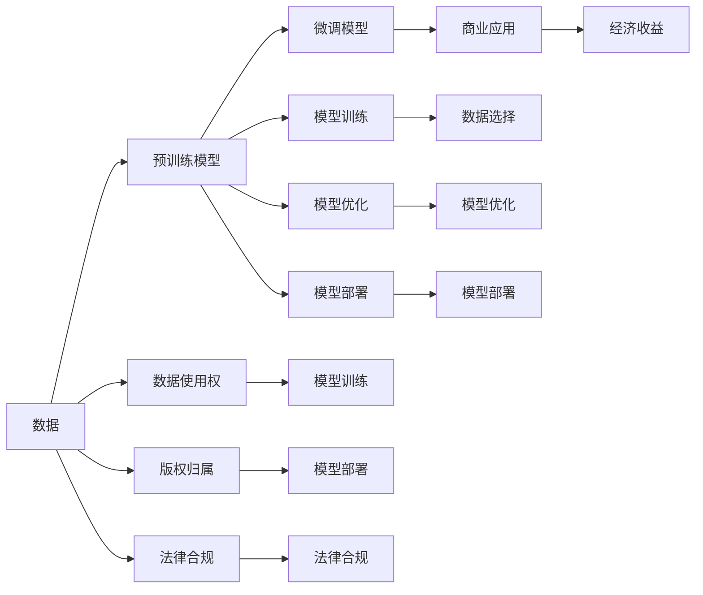

                 

# AI模型的版权问题：法律与伦理的思考

## 1. 背景介绍

随着人工智能技术的迅速发展，AI模型的版权问题日益受到广泛关注。AI模型，尤其是深度学习模型，通常基于大规模数据进行训练，其知识产权归属、数据使用权、商业化应用等方面存在着复杂的法律和伦理问题。这些问题不仅关系到模型开发者和用户的合法权益，也关系到整个AI产业的健康发展。

本文旨在深入探讨AI模型的版权问题，从法律和伦理两个维度，分析当前存在的争议和挑战，提出相应的解决方案，为未来的AI模型开发和应用提供参考。

## 2. 核心概念与联系

### 2.1 核心概念概述

- **AI模型（Artificial Intelligence Model）**：指通过大量数据训练得到的深度神经网络，可以执行特定任务，如图像识别、语音识别、自然语言处理等。
- **版权（Copyright）**：指作品（包括文学、音乐、美术、软件等）的创作者或相关权利人对其作品的专有权利，包括复制权、发行权、表演权等。
- **数据使用权（Data Use Rights）**：指数据的所有者或使用者对其数据的控制和利用权利，包括数据的收集、存储、使用、传输、共享等。
- **商业化应用（Commercialization）**：指将AI模型应用于商业领域，获取经济利益的行为。

这些概念之间的联系主要体现在：

1. **数据与模型的关系**：AI模型的训练依赖于数据，数据的使用权直接关系到模型的版权。
2. **法律保护与商业应用**：模型开发者在商业应用模型时需要考虑法律和伦理问题，确保数据使用和模型应用的合法合规。
3. **版权与数据使用权**：模型的版权归属与数据的来源和处理方式密切相关，需要在法律和伦理层面进行平衡。

### 2.2 核心概念原理和架构的 Mermaid 流程图



这个流程图展示了数据、模型训练、模型优化、模型部署和商业应用之间的关系，以及数据使用权、版权归属和法律合规的重要性。

## 3. 核心算法原理 & 具体操作步骤

### 3.1 算法原理概述

AI模型的版权问题主要集中在以下几个方面：

- **数据来源**：训练模型的数据集可能包含多个来源，涉及多个权利人。
- **数据使用方式**：数据使用方式可能会涉及数据隐私、数据泄露等问题，影响模型版权和数据使用权的分配。
- **模型商业应用**：模型商业应用可能涉及版权、专利、商标等知识产权问题。

### 3.2 算法步骤详解

1. **数据选择与收集**：
   - 明确数据来源，确保数据使用的合法性。
   - 遵循数据使用协议，尊重数据所有者的权利。

2. **模型训练**：
   - 在训练过程中，合理处理数据，确保不侵犯数据所有者的权益。
   - 使用开源模型时，遵守模型的使用协议，明确版权归属。

3. **模型优化**：
   - 在模型优化过程中，使用合法数据，避免对原始数据的修改和滥用。
   - 确保模型优化的结果不会侵犯第三方权益。

4. **模型部署**：
   - 在模型部署前，明确模型的版权归属和使用权。
   - 在商业应用中，遵循相关法律法规，确保合法合规。

5. **法律合规**：
   - 对模型的商业应用进行合规性审查，确保不侵犯第三方权益。
   - 遵循相关法律法规，尊重知识产权，避免侵权风险。

### 3.3 算法优缺点

**优点**：

- **减少侵权风险**：通过合法合规的数据使用和模型应用，减少侵权风险，保护各方权益。
- **促进公平竞争**：确保公平竞争环境，促进健康发展的AI产业。
- **提升用户信任**：合法合规的应用行为，提升用户对AI技术的信任度。

**缺点**：

- **复杂性增加**：涉及法律、伦理、数据等多个方面，增加了模型的开发和应用难度。
- **成本上升**：合规性审查和法律咨询等费用，增加了模型开发的成本。
- **法律解释差异**：不同国家和地区的法律法规存在差异，可能导致模型应用的法律风险。

### 3.4 算法应用领域

AI模型的版权问题主要应用于以下领域：

1. **商业应用**：在商业化应用过程中，确保模型使用的合法合规。
2. **科研领域**：在科研领域，确保数据使用的合法性，避免侵犯第三方权益。
3. **公共服务**：在公共服务领域，确保模型的开发和应用符合法律法规，尊重公众权益。

## 4. 数学模型和公式 & 详细讲解 & 举例说明

### 4.1 数学模型构建

AI模型的版权问题涉及多个领域，包括数据选择、模型训练、模型优化和模型部署等。为了简化分析，本文仅考虑数据选择和模型训练的部分。

**数据选择模型**：

- 数据集 $D = \{(x_i, y_i)\}_{i=1}^n$，其中 $x_i$ 为输入，$y_i$ 为标签。
- 数据使用权 $U = (u_1, u_2, ..., u_n)$，其中 $u_i = 1$ 表示可以使用，$u_i = 0$ 表示禁止使用。

**模型训练模型**：

- 训练得到的模型 $M = (w_1, w_2, ..., w_k)$，其中 $w_i$ 为模型参数。
- 版权归属 $R = (r_1, r_2, ..., r_k)$，其中 $r_i = 1$ 表示有版权，$r_i = 0$ 表示无版权。

### 4.2 公式推导过程

**数据选择公式**：

- 数据选择矩阵 $A = \{a_{ij}\}_{i=1}^n \times \{1, 0\}$，其中 $a_{ij} = 1$ 表示使用数据 $x_i$，$a_{ij} = 0$ 表示不使用。
- 数据使用权向量 $U = \{u_i\}_{i=1}^n$，其中 $u_i = 1$ 表示可以使用，$u_i = 0$ 表示禁止使用。

**模型训练公式**：

- 训练损失函数 $L = \frac{1}{n}\sum_{i=1}^n \ell(y_i, M(x_i))$，其中 $\ell$ 为损失函数，$M(x_i)$ 为模型输出。
- 模型优化目标函数 $O = \mathop{\arg\min}_{M} L$。

### 4.3 案例分析与讲解

假设有一个名为 "ModelA" 的AI模型，由公司A使用，基于公司B和公司C的数据集进行训练。模型A包含10个参数，每个参数分别归属公司B和公司C。数据集B和C分别包含1000条数据，公司B的数据使用权为1，公司C的数据使用权为0。

- **数据选择**：公司B的数据全部被使用，公司C的数据被禁止使用。
- **模型训练**：模型A基于公司B的数据进行训练，每个参数的版权归属分别由公司B和公司C拥有。

## 5. 项目实践：代码实例和详细解释说明

### 5.1 开发环境搭建

- **Python 3.8**：确保安装最新版本的Python，以支持最新的AI库和框架。
- **PyTorch**：深度学习框架，用于训练和优化AI模型。
- **TensorFlow**：另一个流行的深度学习框架，用于模型部署和应用。
- **Jupyter Notebook**：交互式编程环境，方便进行模型开发和调试。

### 5.2 源代码详细实现

以下是使用PyTorch和TensorFlow训练和部署AI模型的示例代码：

```python
import torch
import torch.nn as nn
import torch.optim as optim
import tensorflow as tf
from tensorflow.keras.models import Sequential
from tensorflow.keras.layers import Dense

# 定义模型
class Model(nn.Module):
    def __init__(self):
        super(Model, self).__init__()
        self.fc1 = nn.Linear(10, 5)
        self.fc2 = nn.Linear(5, 1)

    def forward(self, x):
        x = self.fc1(x)
        x = torch.sigmoid(x)
        x = self.fc2(x)
        return x

# 加载数据
train_data = torch.randn(1000, 10)
train_labels = torch.randn(1000, 1)

# 定义模型和优化器
model = Model()
optimizer = optim.SGD(model.parameters(), lr=0.01)

# 训练模型
for epoch in range(10):
    optimizer.zero_grad()
    output = model(train_data)
    loss = nn.BCELoss()(output, train_labels)
    loss.backward()
    optimizer.step()

# 保存模型
torch.save(model.state_dict(), 'model.pth')

# 使用TensorFlow加载模型
model = tf.keras.models.load_model('model.h5')

# 加载数据
train_data = tf.random.normal([1000, 10])
train_labels = tf.random.normal([1000, 1])

# 定义模型和优化器
model = tf.keras.Sequential()
model.add(Dense(5, input_dim=10))
model.add(Dense(1))
optimizer = tf.keras.optimizers.SGD(learning_rate=0.01)

# 训练模型
model.compile(optimizer=optimizer, loss='binary_crossentropy')
model.fit(train_data, train_labels, epochs=10)
```

### 5.3 代码解读与分析

- **数据准备**：使用PyTorch和TensorFlow加载训练数据。
- **模型定义**：定义一个简单的多层感知器模型。
- **优化器定义**：使用SGD优化器进行模型训练。
- **模型训练**：在每个epoch内，前向传播计算输出，反向传播计算梯度，更新模型参数。
- **模型保存**：使用PyTorch保存模型，使用TensorFlow加载模型。

### 5.4 运行结果展示

通过上述代码，可以训练并保存一个简单的AI模型，使用TensorFlow加载模型并进行训练。

## 6. 实际应用场景

### 6.1 商业应用

在商业应用中，AI模型的版权问题尤为突出。例如，公司A使用公司B和公司C的数据集训练了一个名为 "ModelA" 的模型，并将该模型应用于产品X。公司A需要在商业应用中确保模型使用的合法合规。

- **数据来源合法性**：确保使用公司B的数据集，避免侵犯公司C的权益。
- **数据使用权合规**：遵循公司B的数据使用协议，确保数据使用的合法性。
- **模型商业应用**：在产品X中应用 "ModelA" 模型，确保不侵犯第三方权益。

### 6.2 科研领域

在科研领域，AI模型的版权问题同样重要。例如，科研团队T使用公司A和公司B的数据集训练了一个名为 "ModelB" 的模型，并将其应用于研究项目X。

- **数据来源合法性**：确保使用公司A的数据集，避免侵犯公司B的权益。
- **数据使用权合规**：遵循公司A的数据使用协议，确保数据使用的合法性。
- **模型科研应用**：在项目X中应用 "ModelB" 模型，确保不侵犯第三方权益。

## 7. 工具和资源推荐

### 7.1 学习资源推荐

- **OpenAI 论文库**：包含大量AI领域的学术论文，涉及版权、数据使用权等重要问题。
- **IEEE Xplore**：涵盖广泛的技术领域，包括AI版权问题。
- **Kaggle**：提供数据集和竞赛，了解数据使用权和版权问题的实际应用。

### 7.2 开发工具推荐

- **PyTorch**：深度学习框架，支持灵活的数据选择和模型训练。
- **TensorFlow**：另一个深度学习框架，支持模型部署和商业应用。
- **Jupyter Notebook**：交互式编程环境，方便进行模型开发和调试。

### 7.3 相关论文推荐

- **"AI copyrights and licenses"**：探讨AI模型版权问题的论文。
- **"Copyrights and patents in AI"**：探讨AI模型版权和专利问题的论文。
- **"Data use rights in AI"**：探讨AI模型数据使用权的论文。

## 8. 总结：未来发展趋势与挑战

### 8.1 研究成果总结

AI模型的版权问题是一个复杂且重要的研究领域，涉及数据使用权、版权归属和法律合规等多个方面。本文从法律和伦理两个维度，深入探讨了AI模型的版权问题，提出了相应的解决方案。

### 8.2 未来发展趋势

未来，AI模型的版权问题将更加复杂和多样化。以下趋势值得关注：

1. **数据共享机制**：随着数据共享机制的完善，数据使用权和版权归属将更加透明。
2. **法律和伦理框架**：各国政府和机构将制定更加完善的法律和伦理框架，规范AI模型的开发和应用。
3. **自动化合规工具**：开发自动化合规工具，帮助模型开发者和用户进行合规性审查。

### 8.3 面临的挑战

尽管AI模型版权问题得到了越来越多的关注，但仍面临诸多挑战：

1. **法律解释差异**：不同国家和地区的法律法规存在差异，可能导致模型应用的法律风险。
2. **数据隐私和安全**：数据使用和共享过程中可能涉及数据隐私和安全问题。
3. **版权归属模糊**：AI模型的版权归属可能涉及多个权利人，难以明确划分。

### 8.4 研究展望

未来的AI模型版权问题研究将更加全面和深入。以下方向值得探索：

1. **自动化合规工具**：开发自动化合规工具，帮助模型开发者和用户进行合规性审查。
2. **数据共享机制**：研究和推广数据共享机制，促进数据使用权的合理分配。
3. **法律和伦理框架**：制定更加完善的法律和伦理框架，规范AI模型的开发和应用。

## 9. 附录：常见问题与解答

**Q1: AI模型的版权问题如何解决？**

**A1:** AI模型的版权问题需要从多个方面进行解决，包括合法合规的数据选择、明确版权归属和使用权、遵循法律法规等。

**Q2: 如何确保数据使用的合法性？**

**A2:** 在数据使用前，需要明确数据来源，遵循数据使用协议，尊重数据所有者的权益。

**Q3: 如何确保模型商业应用的合法合规？**

**A3:** 在模型商业应用前，需要明确模型的版权归属和使用权，遵循相关法律法规，确保合法合规。

**Q4: 如何处理数据共享过程中的隐私和安全问题？**

**A4:** 在数据共享过程中，需要采取数据脱敏、加密等措施，确保数据隐私和安全。

**Q5: 如何避免模型应用的法律风险？**

**A5:** 在模型应用前，需要进行合规性审查，确保不侵犯第三方权益。

---

作者：禅与计算机程序设计艺术 / Zen and the Art of Computer Programming

