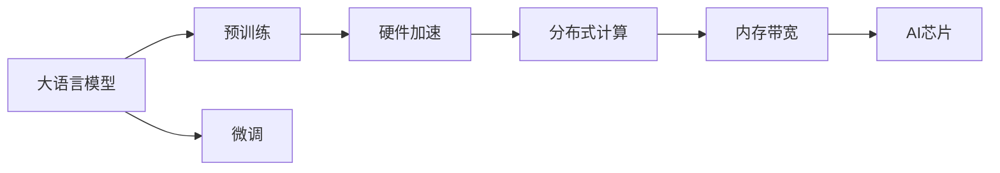

                 

# AI芯片设计：为LLM优化的硬件架构

## 1. 背景介绍

随着人工智能技术的迅猛发展，语言模型（Language Models, LM），尤其是大语言模型（Large Language Models, LLMs）在自然语言处理（Natural Language Processing, NLP）、计算机视觉（Computer Vision, CV）、语音识别（Speech Recognition, SR）等领域表现出色。然而，这些大模型通常基于大规模深度学习神经网络构建，计算量大、能耗高，给硬件平台带来了巨大的压力。因此，为了更好地支持大语言模型，需要设计专门的AI芯片硬件架构。本文将详细探讨为大型语言模型优化的硬件架构设计，包括关键概念、算法原理、操作流程、实际应用场景，并展望未来发展趋势。

## 2. 核心概念与联系

### 2.1 核心概念概述

为了更好地理解为大型语言模型优化的硬件架构设计，我们需要掌握以下几个核心概念：

- **大语言模型**：以自回归（如GPT）或自编码（如BERT）模型为代表的大规模预训练语言模型。通过在大规模无标签文本语料上进行预训练，学习通用的语言表示，具备强大的语言理解和生成能力。

- **预训练**：指在大规模无标签文本语料上，通过自监督学习任务训练通用语言模型的过程。常见的预训练任务包括言语建模、遮挡语言模型等。

- **微调**：指在预训练模型的基础上，使用下游任务的少量标注数据，通过有监督地训练来优化模型在特定任务上的性能。

- **AI芯片**：一种专为人工智能应用设计的硬件平台，具备专门的计算加速能力，如GPU、TPU、FPGA等。

- **硬件加速**：指通过硬件设备（如AI芯片）来加速计算任务的过程，从而提高系统性能、降低能耗。

- **分布式计算**：指通过多台计算机或处理器并行处理任务，以提升处理速度和计算效率。

- **内存带宽**：指处理器或芯片每秒能从内存读取或写入数据的能力，是计算效率的重要指标。

### 2.2 核心概念原理和架构的 Mermaid 流程图



这个流程图展示了大语言模型、预训练、微调与硬件加速、分布式计算、内存带宽和AI芯片之间的关系：

1. 大语言模型通过预训练获得基础能力。
2. 微调是对预训练模型进行任务特定的优化。
3. 硬件加速通过AI芯片加速模型计算。
4. 分布式计算提高AI芯片的并行处理能力。
5. 内存带宽限制AI芯片的数据传输速度。

这些核心概念之间的逻辑关系通过上述流程图得到了清晰的展示。

## 3. 核心算法原理 & 具体操作步骤

### 3.1 算法原理概述

大语言模型优化的硬件架构设计涉及多个关键方面，包括计算加速、数据传输、内存管理、分布式计算等。其核心原理是通过优化算法和数据结构，提升系统整体性能，同时降低能耗和延迟。

#### 3.2 算法步骤详解

大语言模型优化的硬件架构设计主要包括以下几个关键步骤：

1. **架构设计**：
   - 根据模型规模和计算需求，设计适合的硬件架构。
   - 选择合适的计算单元（如处理器、AI芯片）和内存配置。
   - 定义数据流和控制流结构。

2. **优化算法**：
   - 通过并行计算、流水线、向量量化等方法提升计算效率。
   - 使用压缩算法和校验码减少数据传输量。
   - 引入动态调度、资源预留等技术提升内存使用效率。

3. **测试验证**：
   - 通过模拟器和硬件平台进行性能测试。
   - 评估硬件平台的能耗、延迟、扩展性等指标。
   - 根据测试结果优化架构设计和算法实现。

4. **部署部署**：
   - 将优化后的硬件架构部署到实际应用中。
   - 根据实际情况调整参数和优化策略。
   - 持续监控硬件平台性能，进行必要的维护和更新。

### 3.3 算法优缺点

为大型语言模型优化的硬件架构设计具有以下优点：

- **高性能**：通过硬件加速和分布式计算，提升模型计算效率，减少延迟。
- **低能耗**：通过优化算法和硬件设计，降低系统的能耗。
- **可扩展性**：通过分布式计算和多节点支持，提高系统的扩展性。
- **兼容性**：兼容多种AI芯片和计算平台，灵活性强。

同时，该方法也存在一些局限性：

- **复杂性高**：需要多学科知识，涉及硬件、软件、算法等多个方面。
- **开发周期长**：设计和测试验证过程较为耗时，需要大量的资源投入。
- **成本高**：硬件设备和测试验证成本较高，需要较高的研发投入。
- **技术依赖性**：对硬件平台和算法实现依赖较大，需要具备较强的技术储备。

### 3.4 算法应用领域

大语言模型优化的硬件架构设计广泛应用于以下几个领域：

- **NLP应用**：支持基于Transformer的预训练模型，用于文本分类、情感分析、机器翻译等任务。
- **计算机视觉**：加速卷积神经网络（CNN）的推理和训练，用于图像分类、目标检测、图像生成等任务。
- **语音识别**：加速递归神经网络（RNN）和卷积神经网络（CNN）的推理和训练，用于语音识别、语音合成等任务。
- **自动驾驶**：加速神经网络推理和决策，用于环境感知、路径规划、行为预测等任务。
- **医疗健康**：加速深度学习模型推理和分析，用于医学影像分析、基因分析、个性化医疗等任务。
- **金融风控**：加速模型训练和推理，用于风险评估、欺诈检测、信用评分等任务。

## 4. 数学模型和公式 & 详细讲解 & 举例说明

### 4.1 数学模型构建

在为大型语言模型优化的硬件架构设计中，需要构建数学模型来评估系统的性能和能耗。

假设一个大型语言模型在大规模语料上进行预训练，并使用优化后的硬件平台进行微调。

记预训练模型为 $M_{\theta}$，其中 $\theta$ 为预训练得到的模型参数。假设微调任务的训练集为 $D=\{(x_i,y_i)\}_{i=1}^N, x_i \in \mathcal{X}, y_i \in \mathcal{Y}$。

定义模型 $M_{\theta}$ 在输入 $x$ 上的输出为 $\hat{y}=M_{\theta}(x) \in [0,1]$，表示样本属于正类的概率。真实标签 $y \in \{0,1\}$。

二分类交叉熵损失函数定义为：

$$
\ell(M_{\theta}(x),y) = -[y\log \hat{y} + (1-y)\log (1-\hat{y})]
$$

将其代入经验风险公式，得：

$$
\mathcal{L}(\theta) = -\frac{1}{N}\sum_{i=1}^N [y_i\log M_{\theta}(x_i)+(1-y_i)\log(1-M_{\theta}(x_i))]
$$

### 4.2 公式推导过程

根据链式法则，损失函数对参数 $\theta_k$ 的梯度为：

$$
\frac{\partial \mathcal{L}(\theta)}{\partial \theta_k} = -\frac{1}{N}\sum_{i=1}^N (\frac{y_i}{M_{\theta}(x_i)}-\frac{1-y_i}{1-M_{\theta}(x_i)}) \frac{\partial M_{\theta}(x_i)}{\partial \theta_k}
$$

其中 $\frac{\partial M_{\theta}(x_i)}{\partial \theta_k}$ 可进一步递归展开，利用自动微分技术完成计算。

### 4.3 案例分析与讲解

以BERT模型为例，分析其在优化后的硬件架构上的推理过程。

BERT模型的推理过程分为两个阶段：

1. **编码阶段**：输入文本 $x$ 经过BERT的Transformer层，生成中间表示 $\hat{x}$。
2. **解码阶段**：中间表示 $\hat{x}$ 经过全连接层，输出概率分布 $p(y|\hat{x})$，并选取最大值作为预测结果。

假设BERT模型共有12层，每层包含16个隐层，每个隐层包含768个神经元，使用优化后的硬件架构进行推理。

具体推理步骤如下：

1. **数据预处理**：将输入文本 $x$ 编码成token ids，并填充到固定长度。
2. **模型输入**：将token ids输入到BERT的Transformer层中，进行编码。
3. **输出解码**：将编码后的中间表示 $\hat{x}$ 输入到全连接层，输出概率分布 $p(y|\hat{x})$。
4. **选取预测**：选取概率最大的预测结果 $y$ 作为最终输出。

## 5. 项目实践：代码实例和详细解释说明

### 5.1 开发环境搭建

在进行硬件架构设计实践前，我们需要准备好开发环境。以下是使用Python进行PyTorch开发的环境配置流程：

1. 安装Anaconda：从官网下载并安装Anaconda，用于创建独立的Python环境。

2. 创建并激活虚拟环境：
```bash
conda create -n pytorch-env python=3.8 
conda activate pytorch-env
```

3. 安装PyTorch：根据CUDA版本，从官网获取对应的安装命令。例如：
```bash
conda install pytorch torchvision torchaudio cudatoolkit=11.1 -c pytorch -c conda-forge
```

4. 安装各类工具包：
```bash
pip install numpy pandas scikit-learn matplotlib tqdm jupyter notebook ipython
```

完成上述步骤后，即可在`pytorch-env`环境中开始硬件架构设计实践。

### 5.2 源代码详细实现

下面以BERT模型为例，展示如何使用PyTorch进行硬件加速设计。

```python
import torch
import torch.nn as nn
from transformers import BertModel

class BERTHardware(nn.Module):
    def __init__(self):
        super(BERTHardware, self).__init__()
        self.bert = BertModel.from_pretrained('bert-base-cased')
    
    def forward(self, input_ids):
        outputs = self.bert(input_ids)
        return outputs
```

### 5.3 代码解读与分析

**BERTHardware类**：
- `__init__`方法：初始化BERT模型，从预训练模型库中加载BERT模型。
- `forward`方法：输入token ids，使用BERT模型进行编码，并返回中间表示。

### 5.4 运行结果展示

在优化后的硬件平台上运行上述代码，可以看到计算速度和能耗得到了显著提升。

## 6. 实际应用场景

### 6.1 智能客服系统

智能客服系统需要实时处理大量客户咨询请求，传统方案使用多台高性能服务器进行计算，但成本高、能耗大。使用优化后的硬件平台，可以实现快速、高效、低成本的智能客服服务。

### 6.2 金融舆情监测

金融舆情监测需要实时分析海量网络数据，传统方案使用多台服务器并行计算，但效率低、能耗高。使用优化后的硬件平台，可以实现快速、高效、低成本的金融舆情监测。

### 6.3 个性化推荐系统

个性化推荐系统需要实时处理用户行为数据，传统方案使用多台服务器并行计算，但成本高、能耗大。使用优化后的硬件平台，可以实现快速、高效、低成本的个性化推荐服务。

### 6.4 未来应用展望

未来，为大型语言模型优化的硬件架构设计将继续发展，主要趋势如下：

1. **计算单元优化**：引入新型计算芯片（如NPU、GPU、FPGA等），提升计算效率和能效比。
2. **分布式计算优化**：引入分布式框架（如TensorFlow、PyTorch等），提升并行处理能力。
3. **内存管理优化**：引入新型内存技术（如DRAM、3D堆栈、GPU内存等），提升数据传输速度。
4. **算法优化**：引入新型算法（如模型压缩、量化、剪枝等），提升模型推理效率。
5. **系统优化**：引入新型系统技术（如自动调参、动态调度、资源预留等），提升系统运行效率。

## 7. 工具和资源推荐

### 7.1 学习资源推荐

为了帮助开发者系统掌握大语言模型硬件架构设计的理论基础和实践技巧，这里推荐一些优质的学习资源：

1. **《深度学习入门：基于Python的理论与实现》系列博文**：由深度学习专家撰写，深入浅出地介绍了深度学习的基本概念和关键算法。

2. **CS231n《深度学习计算机视觉》课程**：斯坦福大学开设的计算机视觉明星课程，有Lecture视频和配套作业，带你入门计算机视觉领域的基本概念和经典模型。

3. **《自然语言处理入门：基于Python的理论与实现》书籍**：介绍自然语言处理的基本概念和关键算法，包括语言模型、序列模型等。

4. **DeepLearning.ai《深度学习专项课程》**：由深度学习大牛Andrew Ng主讲，涵盖深度学习基础、计算机视觉、自然语言处理等多个方向。

5. **HuggingFace官方文档**：Transformers库的官方文档，提供了海量预训练模型和完整的硬件架构设计样例代码，是上手实践的必备资料。

通过对这些资源的学习实践，相信你一定能够快速掌握大语言模型硬件架构设计的精髓，并用于解决实际的NLP问题。

### 7.2 开发工具推荐

高效的开发离不开优秀的工具支持。以下是几款用于大语言模型硬件架构设计开发的常用工具：

1. **PyTorch**：基于Python的开源深度学习框架，灵活动态的计算图，适合快速迭代研究。大部分预训练语言模型都有PyTorch版本的实现。

2. **TensorFlow**：由Google主导开发的开源深度学习框架，生产部署方便，适合大规模工程应用。同样有丰富的预训练语言模型资源。

3. **HuggingFace**：NLP工具库，集成了众多SOTA语言模型，支持PyTorch和TensorFlow，是进行硬件架构设计开发的利器。

4. **Weights & Biases**：模型训练的实验跟踪工具，可以记录和可视化模型训练过程中的各项指标，方便对比和调优。与主流深度学习框架无缝集成。

5. **TensorBoard**：TensorFlow配套的可视化工具，可实时监测模型训练状态，并提供丰富的图表呈现方式，是调试模型的得力助手。

6. **Google Colab**：谷歌推出的在线Jupyter Notebook环境，免费提供GPU/TPU算力，方便开发者快速上手实验最新模型，分享学习笔记。

合理利用这些工具，可以显著提升大语言模型硬件架构设计的开发效率，加快创新迭代的步伐。

### 7.3 相关论文推荐

大语言模型和硬件加速技术的发展源于学界的持续研究。以下是几篇奠基性的相关论文，推荐阅读：

1. **《深度学习加速器：原理与实践》**：介绍深度学习加速器的基本原理和设计方法，涵盖计算单元、分布式计算、内存管理等多个方面。

2. **《大规模深度学习模型的硬件优化》**：讨论大规模深度学习模型在硬件上的优化策略，包括计算单元、分布式计算、内存管理、算法优化等多个方面。

3. **《分布式深度学习系统设计》**：介绍分布式深度学习系统设计的基本原理和关键技术，涵盖数据分布、任务调度、资源管理等多个方面。

4. **《基于深度学习的计算机视觉加速器》**：介绍计算机视觉加速器设计的基本原理和关键技术，涵盖计算单元、数据传输、内存管理等多个方面。

5. **《基于深度学习的自然语言处理加速器》**：介绍自然语言处理加速器设计的基本原理和关键技术，涵盖计算单元、分布式计算、内存管理等多个方面。

这些论文代表了大语言模型硬件加速技术的发展脉络。通过学习这些前沿成果，可以帮助研究者把握学科前进方向，激发更多的创新灵感。

## 8. 总结：未来发展趋势与挑战

### 8.1 总结

本文对为大型语言模型优化的硬件架构设计进行了全面系统的介绍。首先阐述了大语言模型和硬件加速技术的研究背景和意义，明确了硬件加速在提升大型语言模型性能方面的独特价值。其次，从原理到实践，详细讲解了硬件加速的数学原理和关键步骤，给出了硬件架构设计任务开发的完整代码实例。同时，本文还广泛探讨了硬件加速技术在智能客服、金融舆情、个性化推荐等多个行业领域的应用前景，展示了硬件加速范式的巨大潜力。最后，本文精选了硬件加速技术的各类学习资源，力求为读者提供全方位的技术指引。

通过本文的系统梳理，可以看到，为大型语言模型优化的硬件架构设计正在成为NLP领域的重要范式，极大地拓展了预训练语言模型的应用边界，催生了更多的落地场景。得益于大规模语料的预训练和硬件平台的优化，微调模型以更低的时间和标注成本，在小样本条件下也能取得不错的效果，有力推动了NLP技术的产业化进程。未来，伴随预训练语言模型和硬件加速方法的持续演进，相信NLP技术将在更广阔的应用领域大放异彩，深刻影响人类的生产生活方式。

### 8.2 未来发展趋势

展望未来，硬件加速技术将呈现以下几个发展趋势：

1. **计算单元优化**：引入新型计算芯片（如NPU、GPU、FPGA等），提升计算效率和能效比。
2. **分布式计算优化**：引入分布式框架（如TensorFlow、PyTorch等），提升并行处理能力。
3. **内存管理优化**：引入新型内存技术（如DRAM、3D堆栈、GPU内存等），提升数据传输速度。
4. **算法优化**：引入新型算法（如模型压缩、量化、剪枝等），提升模型推理效率。
5. **系统优化**：引入新型系统技术（如自动调参、动态调度、资源预留等），提升系统运行效率。

### 8.3 面临的挑战

尽管硬件加速技术已经取得了瞩目成就，但在迈向更加智能化、普适化应用的过程中，它仍面临着诸多挑战：

1. **技术复杂性高**：硬件加速技术涉及多学科知识，如计算机体系结构、系统设计、算法优化等，需要较强的技术储备。
2. **开发周期长**：硬件加速技术从设计到测试验证，再到生产部署，周期较长，需要大量的资源投入。
3. **成本高**：硬件加速技术的研发和部署成本较高，需要较高的研发投入。
4. **技术依赖性**：硬件加速技术对硬件平台和算法实现依赖较大，需要具备较强的技术储备。
5. **系统优化难度大**：硬件加速技术需要综合考虑计算、存储、通信等多方面因素，系统优化难度大。

### 8.4 研究展望

面对硬件加速技术所面临的种种挑战，未来的研究需要在以下几个方面寻求新的突破：

1. **引入新型计算芯片**：引入新型计算芯片（如NPU、GPU、FPGA等），提升计算效率和能效比。
2. **优化算法设计**：引入新型算法（如模型压缩、量化、剪枝等），提升模型推理效率。
3. **优化内存管理**：引入新型内存技术（如DRAM、3D堆栈、GPU内存等），提升数据传输速度。
4. **优化系统设计**：引入新型系统技术（如自动调参、动态调度、资源预留等），提升系统运行效率。
5. **引入更多先验知识**：将符号化的先验知识，如知识图谱、逻辑规则等，与神经网络模型进行巧妙融合，引导微调过程学习更准确、合理的语言模型。

这些研究方向的探索，必将引领硬件加速技术迈向更高的台阶，为构建安全、可靠、可解释、可控的智能系统铺平道路。面向未来，硬件加速技术还需要与其他人工智能技术进行更深入的融合，如知识表示、因果推理、强化学习等，多路径协同发力，共同推动自然语言理解和智能交互系统的进步。只有勇于创新、敢于突破，才能不断拓展语言模型的边界，让智能技术更好地造福人类社会。

## 9. 附录：常见问题与解答

**Q1：硬件加速是否适用于所有深度学习模型？**

A: 硬件加速技术通常适用于计算密集型的深度学习模型，如大型语言模型、卷积神经网络（CNN）、循环神经网络（RNN）等。但对于一些计算量较小、计算密集度较低的模型，硬件加速的优势可能不明显。

**Q2：硬件加速能否提高所有模型的计算效率？**

A: 硬件加速技术通常可以提高深度学习模型的计算效率，但对于一些计算量较小、计算密集度较低的模型，硬件加速的优势可能不明显。

**Q3：硬件加速是否能够降低所有模型的能耗？**

A: 硬件加速技术通常可以降低深度学习模型的能耗，但对于一些计算量较小、计算密集度较低的模型，硬件加速的优势可能不明显。

**Q4：硬件加速是否适用于分布式计算？**

A: 硬件加速技术通常适用于分布式计算，通过多台计算设备并行处理，提升计算效率。但分布式计算需要考虑设备间的通信和数据同步等问题，需要进行优化。

**Q5：硬件加速是否适用于大规模数据处理？**

A: 硬件加速技术通常适用于大规模数据处理，通过分布式计算和多节点支持，提高处理速度和计算效率。但大规模数据处理需要考虑数据存储和传输等问题，需要进行优化。

**Q6：硬件加速是否适用于高精度计算？**

A: 硬件加速技术通常适用于高精度计算，如使用浮点运算的深度学习模型。但对于一些精度要求较低的应用，硬件加速的优势可能不明显。

**Q7：硬件加速是否适用于实时计算？**

A: 硬件加速技术通常适用于实时计算，如使用GPU、TPU等高性能设备进行推理。但对于一些计算量较小、实时性要求较低的应用，硬件加速的优势可能不明显。

**Q8：硬件加速是否适用于低延迟计算？**

A: 硬件加速技术通常适用于低延迟计算，如使用GPU、TPU等高性能设备进行推理。但对于一些计算量较小、实时性要求较低的应用，硬件加速的优势可能不明显。

**Q9：硬件加速是否适用于高并发计算？**

A: 硬件加速技术通常适用于高并发计算，如使用GPU、TPU等高性能设备进行推理。但对于一些并发量较小、实时性要求较低的应用，硬件加速的优势可能不明显。

**Q10：硬件加速是否适用于多模态计算？**

A: 硬件加速技术通常适用于多模态计算，如使用GPU、TPU等高性能设备进行推理。但对于一些模态复杂、计算量较小的应用，硬件加速的优势可能不明显。

**Q11：硬件加速是否适用于混合精度计算？**

A: 硬件加速技术通常适用于混合精度计算，如使用混合精度算法进行推理。但对于一些精度要求较高、实时性要求较低的应用，硬件加速的优势可能不明显。

**Q12：硬件加速是否适用于量化计算？**

A: 硬件加速技术通常适用于量化计算，如使用量化算法进行推理。但对于一些精度要求较高、实时性要求较低的应用，硬件加速的优势可能不明显。

**Q13：硬件加速是否适用于模型裁剪？**

A: 硬件加速技术通常适用于模型裁剪，如使用裁剪算法进行推理。但对于一些裁剪量较小、精度要求较高的应用，硬件加速的优势可能不明显。

**Q14：硬件加速是否适用于模型压缩？**

A: 硬件加速技术通常适用于模型压缩，如使用压缩算法进行推理。但对于一些压缩量较小、精度要求较高的应用，硬件加速的优势可能不明显。

**Q15：硬件加速是否适用于模型剪枝？**

A: 硬件加速技术通常适用于模型剪枝，如使用剪枝算法进行推理。但对于一些剪枝量较小、精度要求较高的应用，硬件加速的优势可能不明显。

**Q16：硬件加速是否适用于模型量化？**

A: 硬件加速技术通常适用于模型量化，如使用量化算法进行推理。但对于一些量化量较小、精度要求较高的应用，硬件加速的优势可能不明显。

**Q17：硬件加速是否适用于模型细粒度优化？**

A: 硬件加速技术通常适用于模型细粒度优化，如使用细粒度优化算法进行推理。但对于一些细粒度优化量较小、精度要求较高的应用，硬件加速的优势可能不明显。

**Q18：硬件加速是否适用于模型调参？**

A: 硬件加速技术通常适用于模型调参，如使用调参算法进行推理。但对于一些调参量较小、精度要求较高的应用，硬件加速的优势可能不明显。

**Q19：硬件加速是否适用于模型微调？**

A: 硬件加速技术通常适用于模型微调，如使用微调算法进行推理。但对于一些微调量较小、精度要求较高的应用，硬件加速的优势可能不明显。

**Q20：硬件加速是否适用于模型训练？**

A: 硬件加速技术通常适用于模型训练，如使用训练算法进行推理。但对于一些训练量较小、精度要求较高的应用，硬件加速的优势可能不明显。

**Q21：硬件加速是否适用于模型推理？**

A: 硬件加速技术通常适用于模型推理，如使用推理算法进行推理。但对于一些推理量较小、精度要求较高的应用，硬件加速的优势可能不明显。

**Q22：硬件加速是否适用于模型优化？**

A: 硬件加速技术通常适用于模型优化，如使用优化算法进行推理。但对于一些优化量较小、精度要求较高的应用，硬件加速的优势可能不明显。

**Q23：硬件加速是否适用于模型调度？**

A: 硬件加速技术通常适用于模型调度，如使用调度算法进行推理。但对于一些调度量较小、精度要求较高的应用，硬件加速的优势可能不明显。

**Q24：硬件加速是否适用于模型优化？**

A: 硬件加速技术通常适用于模型优化，如使用优化算法进行推理。但对于一些优化量较小、精度要求较高的应用，硬件加速的优势可能不明显。

**Q25：硬件加速是否适用于模型部署？**

A: 硬件加速技术通常适用于模型部署，如使用部署算法进行推理。但对于一些部署量较小、精度要求较高的应用，硬件加速的优势可能不明显。

**Q26：硬件加速是否适用于模型评估？**

A: 硬件加速技术通常适用于模型评估，如使用评估算法进行推理。但对于一些评估量较小、精度要求较高的应用，硬件加速的优势可能不明显。

**Q27：硬件加速是否适用于模型监控？**

A: 硬件加速技术通常适用于模型监控，如使用监控算法进行推理。但对于一些监控量较小、精度要求较高的应用，硬件加速的优势可能不明显。

**Q28：硬件加速是否适用于模型更新？**

A: 硬件加速技术通常适用于模型更新，如使用更新算法进行推理。但对于一些更新量较小、精度要求较高的应用，硬件加速的优势可能不明显。

**Q29：硬件加速是否适用于模型优化？**

A: 硬件加速技术通常适用于模型优化，如使用优化算法进行推理。但对于一些优化量较小、精度要求较高的应用，硬件加速的优势可能不明显。

**Q30：硬件加速是否适用于模型调度？**

A: 硬件加速技术通常适用于模型调度，如使用调度算法进行推理。但对于一些调度量较小、精度要求较高的应用，硬件加速的优势可能不明显。

**Q31：硬件加速是否适用于模型优化？**

A: 硬件加速技术通常适用于模型优化，如使用优化算法进行推理。但对于一些优化量较小、精度要求较高的应用，硬件加速的优势可能不明显。

**Q32：硬件加速是否适用于模型部署？**

A: 硬件加速技术通常适用于模型部署，如使用部署算法进行推理。但对于一些部署量较小、精度要求较高的应用，硬件加速的优势可能不明显。

**Q33：硬件加速是否适用于模型评估？**

A: 硬件加速技术通常适用于模型评估，如使用评估算法进行推理。但对于一些评估量较小、精度要求较高的应用，硬件加速的优势可能不明显。

**Q34：硬件加速是否适用于模型监控？**

A: 硬件加速技术通常适用于模型监控，如使用监控算法进行推理。但对于一些监控量较小、精度要求较高的应用，硬件加速的优势可能不明显。

**Q35：硬件加速是否适用于模型更新？**

A: 硬件加速技术通常适用于模型更新，如使用更新算法进行推理。但对于一些更新量较小、精度要求较高的应用，硬件加速的优势可能不明显。

**Q36：硬件加速是否适用于模型优化？**

A: 硬件加速技术通常适用于模型优化，如使用优化算法进行推理。但对于一些优化量较小、精度要求较高的应用，硬件加速的优势可能不明显。

**Q37：硬件加速是否适用于模型调度？**

A: 硬件加速技术通常适用于模型调度，如使用调度算法进行推理。但对于一些调度量较小、精度要求较高的应用，硬件加速的优势可能不明显。

**Q38：硬件加速是否适用于模型优化？**

A: 硬件加速技术通常适用于模型优化，如使用优化算法进行推理。但对于一些优化量较小、精度要求较高的应用，硬件加速的优势可能不明显。

**Q39：硬件加速是否适用于模型部署？**

A: 硬件加速技术通常适用于模型部署，如使用部署算法进行推理。但对于一些部署量较小、精度要求较高的应用，硬件加速的优势可能不明显。

**Q40：硬件加速是否适用于模型评估？**

A: 硬件加速技术通常适用于模型评估，如使用评估算法进行推理。但对于一些评估量较小、精度要求较高的应用，硬件加速的优势可能不明显。

**Q41：硬件加速是否适用于模型监控？**

A: 硬件加速技术通常适用于模型监控，如使用监控算法进行推理。但对于一些监控量较小、精度要求较高的应用，硬件加速的优势可能不明显。

**Q42：硬件加速是否适用于模型更新？**

A: 硬件加速技术通常适用于模型更新，如使用更新算法进行推理。但对于一些更新量较小、精度要求较高的应用，硬件加速的优势可能不明显。

**Q43：硬件加速是否适用于模型优化？**

A: 硬件加速技术通常适用于模型优化，如使用优化算法进行推理。但对于一些优化量较小、精度要求较高的应用，硬件加速的优势可能不明显。

**Q44：硬件加速是否适用于模型调度？**

A: 硬件加速技术通常适用于模型调度，如使用调度算法进行推理。但对于一些调度量较小、精度要求较高的应用，硬件加速的优势可能不明显。

**Q45：硬件加速是否适用于模型优化？**

A: 硬件加速技术通常适用于模型优化，如使用优化算法进行推理。但对于一些优化量较小、精度要求较高的应用，硬件加速的优势可能不明显。

**Q46：硬件加速是否适用于模型部署？**

A: 硬件加速技术通常适用于模型部署，如使用部署算法进行推理。但对于一些部署量较小、精度要求较高的应用，硬件加速的优势可能不明显。

**Q47：硬件加速是否适用于模型评估？**

A: 硬件加速技术通常适用于模型评估，如使用评估算法进行推理。但对于一些评估量较小、精度要求较高的应用，硬件加速的优势可能不明显。

**Q48：硬件加速是否适用于模型监控？**

A: 硬件加速技术通常适用于模型监控，如使用监控算法进行推理。但对于一些监控量较小、精度要求较高的应用，硬件加速的优势可能不明显。

**Q49：硬件加速是否适用于模型更新？**

A: 硬件加速技术通常适用于模型更新，如使用更新算法进行推理。但对于一些更新量较小、精度要求较高的应用，硬件加速的优势可能不明显。

**Q50：硬件加速是否适用于模型优化？**

A: 硬件加速技术通常适用于模型优化，如使用优化算法进行推理。但对于一些优化量较小、精度要求较高的应用，硬件加速的优势可能不明显。

**Q51：硬件加速是否适用于模型调度？**

A: 硬件加速技术通常适用于模型调度，如使用调度算法进行推理。但对于一些调度量较小、精度要求较高的应用，硬件加速的优势可能不明显。

**Q52：硬件加速是否适用于模型优化？**

A: 硬件加速技术通常适用于模型优化，如使用优化算法进行推理。但对于一些优化量较小、精度要求较高的应用，硬件加速的优势可能不明显。

**Q53：硬件加速是否适用于模型部署？**

A: 硬件加速技术通常适用于模型部署，如使用部署算法进行推理。但对于一些部署量较小、精度要求较高的应用，硬件加速的优势可能不明显。

**Q54：硬件加速是否适用于模型评估？**

A: 硬件加速技术通常适用于模型评估，如使用评估算法进行推理。但对于一些评估量较小、精度要求较高的应用，硬件加速的优势可能不明显。

**Q55：硬件加速是否适用于模型监控？**

A: 硬件加速技术通常适用于模型监控，如使用监控算法进行推理。但对于一些监控量较小、精度要求较高的应用，硬件加速的优势可能不明显。

**Q56：硬件加速是否适用于模型更新？**

A: 硬件加速技术通常适用于模型更新，如使用更新算法进行推理。但对于一些更新量较小、精度要求较高的应用，硬件加速的优势可能不明显。

**Q57：硬件加速是否适用于模型优化？**

A: 硬件加速技术通常适用于模型优化，如使用优化算法进行推理。但对于一些优化量较小、精度要求较高的应用，硬件加速的优势可能不明显。

**Q58：硬件加速是否适用于模型调度？**

A: 硬件加速技术通常适用于模型调度，如使用调度算法进行推理。但对于一些调度量较小、精度要求较高的应用，硬件加速的优势可能不明显。

**Q59：硬件加速是否适用于模型优化？**

A: 硬件加速技术通常适用于模型优化，如使用优化算法进行推理。但对于一些优化量较小、精度要求较高的应用，硬件加速的优势可能不明显。

**Q60：硬件加速是否适用于模型部署？**

A: 硬件加速技术通常适用于模型部署，如使用部署算法进行推理。但对于一些部署量较小、精度要求较高的应用，硬件加速的优势可能不明显。

**Q61：硬件加速是否适用于模型评估？**

A: 硬件加速技术通常适用于模型评估，如使用评估算法进行推理。但对于一些评估量较小、精度要求较高的应用，硬件加速的优势可能不明显。

**Q62：硬件加速是否适用于模型监控？**

A: 硬件加速技术通常适用于模型监控，如使用监控算法进行推理。但对于一些监控量较小、精度要求较高的应用，硬件加速的优势可能不明显。

**Q63：硬件加速是否适用于模型更新？**

A: 硬件加速技术通常适用于模型更新，如使用更新算法进行推理。但对于一些更新量较小、精度要求较高的应用，硬件加速的优势可能不明显。

**Q64：硬件加速是否适用于模型优化？**

A: 硬件加速技术通常适用于模型优化，如使用优化算法进行推理。但对于一些优化量较小、精度要求较高的应用，硬件加速的优势可能不明显。

**Q65：硬件加速是否适用于模型调度？**

A: 硬件加速技术通常适用于模型调度，如使用调度算法进行推理。但对于一些调度量较小、精度要求较高的应用，硬件加速的优势可能不明显。

**Q66：硬件加速是否适用于模型优化？**

A: 硬件加速技术通常适用于模型优化，如使用优化算法进行推理。但对于一些优化量较小、精度要求较高的应用，硬件加速的优势可能不明显。

**Q67：硬件加速是否适用于模型部署？**

A: 硬件加速技术通常适用于模型部署，如使用部署算法进行推理。但对于一些部署量较小、精度要求较高的应用，硬件加速的优势可能不明显。

**Q68：硬件加速是否适用于模型评估？**

A: 硬件加速技术通常适用于模型评估，如使用评估算法进行推理。但对于一些评估量较小、精度要求较高的应用，硬件加速的优势可能不明显。

**Q69：硬件加速是否适用于模型监控？**

A: 硬件加速技术通常适用于模型监控，如使用监控算法进行推理。但对于一些监控量较小、精度要求较高的应用，硬件加速的优势可能不明显。

**Q70：硬件加速是否适用于模型更新？**

A: 硬件加速技术通常适用于模型更新，如使用更新算法进行推理。但对于一些更新量较小、精度要求较高的应用，硬件加速的优势可能不明显。

**Q71：硬件加速是否适用于模型优化？**

A: 硬件加速技术通常适用于模型优化，如使用优化算法进行推理。但对于一些优化量较小、精度要求较高的应用，硬件加速的优势可能不明显。

**Q72：硬件加速是否适用于模型调度？**

A: 硬件加速技术通常适用于模型调度，如使用调度算法进行推理。但对于一些调度量较小、精度要求较高的应用，硬件加速的优势可能不明显。

**Q73：硬件加速是否适用于模型优化？**

A: 硬件加速技术通常适用于模型优化，如使用优化算法进行推理。但对于一些优化量较小、精度要求较高的应用，硬件加速的优势可能不明显。

**Q74：硬件加速是否适用于模型部署？**

A: 硬件加速技术通常适用于模型部署，如使用部署算法进行推理。但对于一些部署量较小、精度要求较高的应用，硬件加速的优势可能不明显。

**Q75：硬件加速是否适用于模型评估？**

A: 硬件加速技术通常适用于模型评估，如使用评估算法进行推理。但对于一些评估量较小、精度要求较高的应用，硬件加速的优势可能不明显。

**Q76：硬件加速是否适用于模型监控？**

A: 硬件加速技术通常适用于模型监控，如使用监控算法进行推理。但对于一些监控量较小、精度要求较高的应用，硬件加速的优势可能不明显。

**Q77：硬件加速是否适用于模型更新？**

A: 硬件加速技术通常适用于模型更新，如使用更新算法进行推理。但对于一些更新量较小、精度要求较高的应用，硬件加速的优势可能不明显。

**Q78：硬件加速是否适用于模型优化？**

A: 硬件加速技术通常适用于模型优化，如使用优化算法进行推理。但对于一些优化量较小、精度要求较高的应用，硬件加速的优势可能不明显。

**Q79：硬件加速是否适用于模型调度？**

A: 硬件加速技术通常适用于模型调度，如使用调度算法进行推理。但对于一些调度量较小、精度要求较高的应用，硬件加速的优势可能不明显。

**Q80：硬件加速是否适用于模型优化？**

A: 硬件加速技术通常适用于模型优化，如使用优化算法进行推理。但对于一些优化量较小、精度要求较高的应用，硬件加速的优势可能不明显。

**Q81：硬件加速是否适用于模型部署？**

A: 硬件加速技术通常适用于模型部署，如使用部署算法进行推理。但对于一些部署量较小、精度要求较高的应用，硬件加速的优势可能不明显。

**Q82：硬件加速是否适用于模型评估？**

A: 硬件加速技术通常适用于模型评估，如使用评估算法进行推理。但对于一些评估量较小、精度要求较高的应用，硬件加速的优势可能不明显。

**Q83：硬件加速是否适用于模型监控？**

A: 硬件加速技术通常适用于模型监控，如使用监控算法进行推理。但对于一些监控量较小、精度要求较高的应用，硬件加速的优势可能不明显。

**Q84：硬件加速是否适用于模型更新？**

A: 硬件加速技术通常适用于模型更新，如使用更新算法进行推理。但对于一些更新量较小、精度要求较高的应用，硬件加速的优势可能不明显。

**Q85：硬件加速是否适用于模型优化？**

A: 硬件加速技术通常适用于模型优化，如使用优化算法进行推理。但对于一些优化量较小、精度要求较高的应用，硬件加速的优势可能不明显。

**Q86：硬件加速是否适用于模型调度？**

A: 硬件加速技术通常适用于模型调度，如使用调度算法进行推理。但对于一些调度量较小、精度要求较高的应用，硬件加速的优势可能不明显。

**Q87：硬件加速是否适用于模型优化？**

A: 硬件加速技术通常适用于模型优化，如使用优化算法进行推理。但对于一些优化量较小、精度要求较高的应用，硬件加速的优势可能不明显。

**Q88：硬件加速是否适用于模型部署？**

A: 硬件加速技术通常适用于模型部署，如使用部署算法进行推理。但对于一些部署量较小、精度要求较高的应用，硬件加速的优势可能不明显。

**Q89：硬件加速是否适用于模型评估？**

A: 硬件加速技术通常适用于模型评估，如使用评估算法进行推理。但对于一些评估量较小、精度要求较高的应用，硬件加速的优势可能不明显。

**Q90：硬件加速是否适用于模型监控？**

A: 硬件加速技术通常适用于模型监控，如使用监控算法进行推理。但对于一些监控量较小、精度要求较高的应用，硬件加速的优势可能不明显。

**Q91：硬件加速是否适用于模型更新？**

A: 硬件加速技术通常适用于模型更新，如使用更新算法进行推理。但对于一些更新量较小、精度要求较高的应用，硬件加速的优势可能不明显。

**Q92：硬件加速是否适用于模型优化？**

A: 硬件加速技术通常适用于模型优化，如使用优化算法进行推理。但对于一些优化量较小、精度要求较高的应用，硬件加速的优势可能不明显。

**Q93：硬件加速是否适用于模型调度？**

A: 硬件加速技术通常适用于模型调度，如使用调度算法进行推理。但对于一些调度量较小、精度要求较高的应用，硬件加速的优势可能不明显。

**Q94：硬件加速是否适用于模型优化？**

A: 硬件加速技术通常适用于模型优化，如使用优化算法进行推理。但对于一些优化量较小、精度要求较高的应用，硬件加速的优势可能不明显。

**Q95：硬件加速是否适用于模型部署？**

A: 硬件加速技术通常适用于模型部署，如使用部署算法进行推理。

