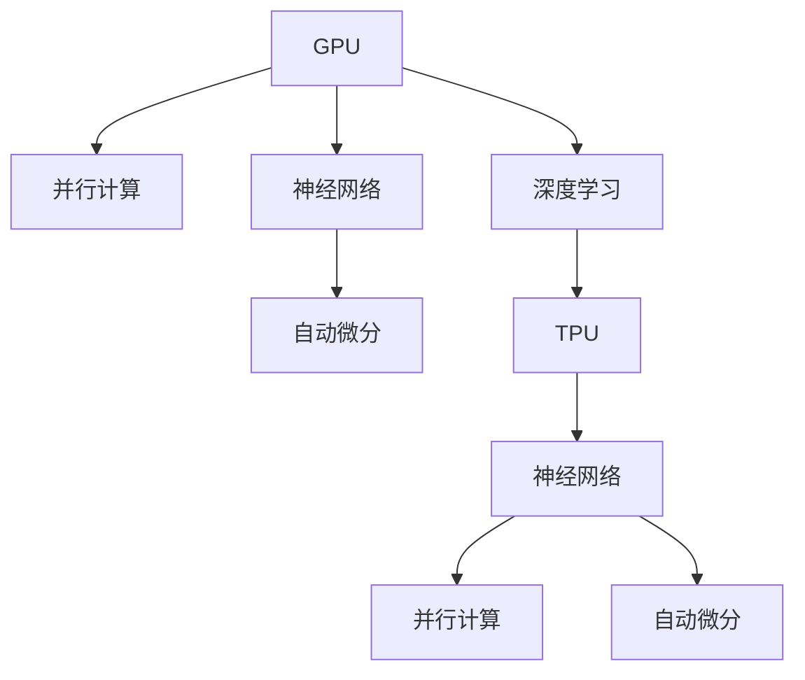

                 

# AI芯片革命：从GPU到TPU的演进

## 1. 背景介绍

在过去的几十年里，人工智能(AI)技术迅猛发展，而这一切都离不开高性能计算芯片的支持。从最早的GPU到如今的TPU，AI芯片经历了多次重大演进，极大地推动了AI技术的应用和普及。

### 1.1 历史背景

上世纪80年代，人工智能的萌芽阶段，CPU是最主要的计算工具。随着深度学习等复杂模型的兴起，CPU的计算能力逐渐成为瓶颈。为了解决这一问题，NVIDIA在2002年发布了第一款面向AI应用的独立显卡——CUDA。CUDA的并行计算能力大大提升了GPU的计算性能，使深度学习等复杂计算任务能够在GPU上高效运行。

进入21世纪后，Google、Facebook、Microsoft等科技巨头开始自研专用AI芯片，TPU（Tensor Processing Unit）由此诞生。TPU结合了ASIC芯片设计的高效性、深度学习模型的特点，提供了比GPU更优的计算性能和能效比。

TPU的问世，标志着AI芯片从通用型向专用型的转变，大大推动了AI技术的应用和普及，并引发了AI芯片的新一轮演进。

## 2. 核心概念与联系

### 2.1 核心概念概述

为了更好地理解GPU到TPU的演进，本节将介绍几个密切相关的核心概念：

- **GPU**：Graphics Processing Unit，图形处理单元。最初设计用于加速图像处理任务，逐渐被引入到深度学习等领域。

- **TPU**：Tensor Processing Unit，张量处理单元。由Google开发，专门针对深度学习任务设计，提供了更高的计算性能和能效比。

- **神经网络**：由大量神经元节点连接而成的网络，用于学习数据特征和进行分类、回归等任务。

- **并行计算**：通过将计算任务分解成多个子任务，同时执行来提高计算效率。

- **自动微分**：在深度学习模型中，自动求导和反向传播是高效训练模型的关键技术。

这些概念之间的逻辑关系可以通过以下Mermaid流程图来展示：



这个流程图展示了大规模并行计算在GPU和TPU之间的演进路径，以及自动微分在其中的关键作用。

## 3. 核心算法原理 & 具体操作步骤
### 3.1 算法原理概述

GPU到TPU的演进，本质上是对并行计算架构的不断优化和提升。早期的GPU采用了多线程、多核的设计，通过并行计算提升深度学习模型的训练效率。而TPU则在此基础上，进一步优化了硬件架构和算法，实现了更高密度的并行计算。

### 3.2 算法步骤详解

GPU和TPU的演进可以分以下几个关键步骤：

**Step 1: GPU的引入**
- GPU通过多线程、多核设计，利用GPU的硬件并行性，极大提升深度学习模型的计算效率。
- CUDA等GPU并行计算框架的出现，使得深度学习任务能够在GPU上高效运行。

**Step 2: TPU的设计**
- TPU采用专门的硬件设计，优化了深度学习模型的并行计算。
- TPU芯片支持更高的计算密度和更低的能耗。

**Step 3: 算法优化**
- GPU和TPU都需要针对深度学习任务进行算法优化，如网络剪枝、量化、动态计算图等。
- 自动微分技术的引入，使得深度学习模型的训练效率大大提升。

**Step 4: 部署与应用**
- GPU和TPU被广泛应用于深度学习模型训练和推理，提升了AI技术的实际应用能力。
- 深度学习框架（如TensorFlow、PyTorch等）支持GPU和TPU，方便开发者进行模型部署。

### 3.3 算法优缺点

GPU和TPU各有优缺点：

**GPU的优点**：
- 技术成熟，计算能力强，支持多种深度学习框架。
- 硬件兼容性高，易于部署。

**GPU的缺点**：
- 能效比低，需要较高的电费和冷却成本。
- 单片GPU计算密度有限，无法应对更大的模型和计算需求。

**TPU的优点**：
- 专用芯片设计，针对深度学习任务优化，能效比高。
- 计算密度高，适合大规模模型和高性能计算任务。

**TPU的缺点**：
- 硬件专有性高，开发和部署成本高。
- 可扩展性相对较弱，灵活性不足。

### 3.4 算法应用领域

GPU和TPU的应用范围非常广泛，涵盖了深度学习模型的各个阶段，包括模型训练、推理和应用：

- **模型训练**：在数据中心、云服务提供商中，GPU和TPU被广泛用于深度学习模型的训练。
- **模型推理**：在移动设备、嵌入式系统、服务器等环境中，GPU和TPU被用于模型的推理计算。
- **实际应用**：GPU和TPU被应用于图像识别、语音识别、自然语言处理、推荐系统等多个领域。

## 4. 数学模型和公式 & 详细讲解 & 举例说明
### 4.1 数学模型构建

在GPU和TPU上运行深度学习模型，通常需要构建数学模型和优化算法。以下以神经网络为例，展示数学模型的构建过程：

- 定义神经网络的结构，包括输入层、隐藏层和输出层。
- 定义各层的网络参数，如权重、偏置等。
- 定义损失函数，衡量模型输出与真实标签的差距。
- 定义优化算法，如梯度下降法、Adam等，用于最小化损失函数。

### 4.2 公式推导过程

以深度学习中的反向传播算法为例，展示梯度计算的推导过程：

$$
\frac{\partial L}{\partial \theta} = \frac{\partial L}{\partial \hat{y}} \frac{\partial \hat{y}}{\partial \theta}
$$

其中，$L$表示损失函数，$\hat{y}$表示模型输出，$\theta$表示网络参数。通过反向传播算法，可以高效计算梯度，更新网络参数，最小化损失函数。

### 4.3 案例分析与讲解

以图像分类任务为例，展示GPU和TPU在深度学习模型中的具体应用：

- 收集大量带标签的图像数据集，作为模型训练的监督信号。
- 在GPU或TPU上，使用深度学习框架（如TensorFlow、PyTorch）搭建卷积神经网络。
- 使用随机梯度下降法（SGD）或Adam等优化算法，对网络参数进行迭代优化。
- 在验证集上评估模型性能，不断调整超参数，直至在测试集上获得最佳性能。

## 5. 项目实践：代码实例和详细解释说明
### 5.1 开发环境搭建

在进行GPU和TPU的实践之前，我们需要准备好开发环境。以下是使用Python进行TensorFlow开发的環境配置流程：

1. 安装Anaconda：从官网下载并安装Anaconda，用于创建独立的Python环境。

2. 创建并激活虚拟环境：
```bash
conda create -n tf-env python=3.7 
conda activate tf-env
```

3. 安装TensorFlow：根据CUDA版本，从官网获取对应的安装命令。例如：
```bash
conda install tensorflow-gpu=2.3 -c conda-forge
```

4. 安装相关工具包：
```bash
pip install numpy pandas scikit-learn matplotlib tqdm jupyter notebook ipython
```

完成上述步骤后，即可在`tf-env`环境中开始GPU和TPU的实践。

### 5.2 源代码详细实现

下面我们以图像分类任务为例，给出使用TensorFlow对卷积神经网络进行训练的PyTorch代码实现。

首先，定义模型和损失函数：

```python
import tensorflow as tf
from tensorflow.keras import layers, models

model = models.Sequential([
    layers.Conv2D(32, (3, 3), activation='relu', input_shape=(28, 28, 1)),
    layers.MaxPooling2D((2, 2)),
    layers.Conv2D(64, (3, 3), activation='relu'),
    layers.MaxPooling2D((2, 2)),
    layers.Conv2D(64, (3, 3), activation='relu'),
    layers.Flatten(),
    layers.Dense(64, activation='relu'),
    layers.Dense(10)
])

loss_fn = tf.keras.losses.SparseCategoricalCrossentropy(from_logits=True)
```

然后，定义训练和评估函数：

```python
@tf.function
def train_step(images, labels):
    with tf.GradientTape() as tape:
        logits = model(images, training=True)
        loss = loss_fn(labels, logits)
    grads = tape.gradient(loss, model.trainable_variables)
    optimizer.apply_gradients(zip(grads, model.trainable_variables))
    return loss

@tf.function
def evaluate_step(images, labels):
    logits = model(images, training=False)
    loss = loss_fn(labels, logits)
    return loss

model.compile(optimizer=tf.keras.optimizers.Adam(learning_rate=0.001),
              loss=loss_fn, metrics=['accuracy'])

# 加载数据集
mnist = tf.keras.datasets.mnist.load_data()
(x_train, y_train), (x_test, y_test) = mnist

# 数据预处理
x_train = x_train.reshape((60000, 28, 28, 1))
x_test = x_test.reshape((10000, 28, 28, 1))
x_train, x_test = x_train / 255.0, x_test / 255.0

# 训练模型
history = model.fit(x_train, y_train, epochs=10, validation_data=(x_test, y_test))
```

最后，启动训练流程并在测试集上评估：

```python
model.save('my_model.h5')

# 加载模型并评估
model = tf.keras.models.load_model('my_model.h5')
loss = evaluate_step(x_test, y_test)
print('Test loss:', loss)
```

以上就是使用TensorFlow进行卷积神经网络训练的完整代码实现。可以看到，TensorFlow通过自动微分和GPU加速，极大提升了深度学习模型的训练效率。

### 5.3 代码解读与分析

让我们再详细解读一下关键代码的实现细节：

**训练和评估函数**：
- `train_step`函数：使用`tf.GradientTape`进行自动微分，计算损失和梯度，并使用`optimizer`更新模型参数。
- `evaluate_step`函数：计算模型在测试集上的损失，不更新参数，评估模型性能。

**模型定义**：
- `Sequential`模型：定义了卷积层、池化层、全连接层等基本组件，并通过`compile`函数初始化优化器和损失函数。

**数据预处理**：
- 将数据集reshape为(样本数, 28, 28, 1)的张量形式。
- 对数据进行归一化，将像素值从[0, 255]缩放到[0, 1]。

**模型训练和评估**：
- 使用`fit`函数对模型进行训练，指定训练轮数和验证集。
- 在测试集上评估模型性能，输出测试集损失。

可以看到，TensorFlow的自动微分机制极大地简化了深度学习模型的训练过程，使得开发者可以更加专注于模型设计和实验优化。

## 6. 实际应用场景
### 6.1 计算机视觉

计算机视觉领域是GPU和TPU应用最广泛的领域之一。在图像分类、目标检测、语义分割等任务中，GPU和TPU都发挥了重要作用。

- **图像分类**：使用卷积神经网络对大量图像进行分类，如图像识别、物体识别等。
- **目标检测**：使用Faster R-CNN、YOLO等模型，检测图像中的物体位置和类别。
- **语义分割**：使用U-Net、FCN等模型，对图像进行像素级别的语义分割。

### 6.2 自然语言处理

自然语言处理领域也需要大量计算资源，GPU和TPU被广泛应用于文本分类、情感分析、机器翻译等任务：

- **文本分类**：使用循环神经网络、卷积神经网络等模型，对文本进行分类。
- **情感分析**：使用LSTM、Transformer等模型，对文本进行情感判断。
- **机器翻译**：使用Transformer等模型，将一种语言的文本翻译成另一种语言。

### 6.3 推荐系统

推荐系统领域也离不开GPU和TPU的支持，使用协同过滤、基于矩阵分解的推荐算法、深度学习等方法，为用户推荐感兴趣的物品：

- **协同过滤**：使用矩阵分解、SVD等方法，基于用户行为数据进行推荐。
- **深度学习**：使用神经网络模型，对用户画像和物品特征进行建模，进行推荐。

### 6.4 未来应用展望

随着GPU和TPU的不断演进，未来AI芯片将在更多领域发挥重要作用，为人类社会带来深远影响：

- **自动驾驶**：GPU和TPU将支持大规模深度学习模型的实时计算，辅助自动驾驶车辆进行环境感知和决策。
- **医疗诊断**：GPU和TPU将支持复杂的医学影像分析和病理诊断，提高医疗诊断的准确性和效率。
- **金融预测**：GPU和TPU将支持大规模数据的高性能计算，进行股市预测、信用风险评估等金融任务。
- **物联网**：GPU和TPU将支持大规模数据的实时处理，进行设备状态监测、智能家居控制等物联网应用。

## 7. 工具和资源推荐
### 7.1 学习资源推荐

为了帮助开发者系统掌握GPU和TPU的应用，这里推荐一些优质的学习资源：

1. TensorFlow官方文档：详细介绍了TensorFlow的基本用法和高级功能，是学习TensorFlow的最佳入门材料。

2. PyTorch官方文档：提供了PyTorch的基本用法和深度学习模型的实现示例。

3. Coursera的“深度学习专项课程”：由斯坦福大学Andrew Ng教授主讲的深度学习课程，涵盖了深度学习的基本概念和应用。

4. CS231n《卷积神经网络》课程：由斯坦福大学开设的图像识别课程，讲解了卷积神经网络在计算机视觉中的应用。

5. Kaggle竞赛：Kaggle是全球最大的数据科学竞赛平台，通过参加竞赛，可以学习到最新的深度学习技术和实践经验。

通过对这些资源的学习实践，相信你一定能够快速掌握GPU和TPU的用法，并用于解决实际的深度学习问题。

### 7.2 开发工具推荐

高效的开发离不开优秀的工具支持。以下是几款用于GPU和TPU开发的常用工具：

1. TensorFlow：由Google主导开发的深度学习框架，支持GPU和TPU加速，方便进行深度学习模型的开发和部署。

2. PyTorch：Facebook开发的深度学习框架，支持动态计算图和GPU加速，适合快速迭代研究和模型调试。

3. NVIDIA CUDA Toolkit：NVIDIA提供的GPU计算平台，提供了丰富的工具和库，方便GPU编程和调试。

4. NVIDIA cuDNN：NVIDIA提供的深度学习库，支持卷积运算等常见计算的GPU加速，大幅提升深度学习模型的训练和推理速度。

5. NVIDIA TensorRT：NVIDIA提供的深度学习推理加速平台，支持GPU和TPU的推理加速，提高深度学习模型的部署效率。

6. Intel OpenVINO：Intel提供的深度学习推理加速平台，支持CPU、GPU、TPU等多种硬件加速，提供高效的推理服务。

合理利用这些工具，可以显著提升GPU和TPU的开发效率，加快创新迭代的步伐。

### 7.3 相关论文推荐

GPU和TPU的发展得益于学界的持续研究。以下是几篇奠基性的相关论文，推荐阅读：

1. CUDA并行计算架构：详细介绍了CUDA并行计算架构，以及GPU在深度学习中的应用。

2. TPU硬件设计：描述了TPU的硬件设计思路和特点，以及TPU在深度学习中的应用。

3. Deep Residual Learning for Image Recognition：提出了ResNet模型，利用深度残差连接提升深度学习模型的训练效率和性能。

4. Efficient Estimation of Uncertainty in Deep Neural Networks：提出了一种新的深度学习模型，可以更高效地估计模型的不确定性。

5. TensorFlow 2.0：介绍了TensorFlow 2.0的新特性和优化，支持GPU和TPU的深度学习开发。

这些论文代表了大规模并行计算的发展脉络。通过学习这些前沿成果，可以帮助研究者把握学科前进方向，激发更多的创新灵感。

## 8. 总结：未来发展趋势与挑战
### 8.1 总结

本文对GPU和TPU的演进进行了全面系统的介绍。首先阐述了GPU到TPU的历史背景和发展脉络，明确了GPU和TPU在深度学习中的应用优势。其次，从原理到实践，详细讲解了GPU和TPU的算法优化和具体操作步骤，给出了GPU和TPU开发的完整代码实现。同时，本文还广泛探讨了GPU和TPU在多个领域的应用前景，展示了GPU和TPU的巨大潜力。

通过本文的系统梳理，可以看到，GPU和TPU作为高性能计算芯片，已经广泛应用于深度学习模型的各个环节，极大地推动了AI技术的应用和普及。未来，伴随GPU和TPU的不断演进，深度学习模型的计算性能将进一步提升，推动AI技术在更多领域的应用和创新。

### 8.2 未来发展趋势

展望未来，GPU和TPU的发展将呈现以下几个趋势：

1. **异构计算**：未来GPU和TPU将更多地与FPGA、ASIC等硬件结合，形成异构计算平台，提升计算效率和能效比。

2. **更高效并行计算**：通过优化并行计算架构和算法，使得深度学习模型能够在更少的计算资源下，获得更好的性能。

3. **模型压缩和量化**：通过模型压缩和量化技术，减少深度学习模型的参数量和计算资源消耗，提高计算效率和模型部署效率。

4. **深度学习芯片的普及**：未来的深度学习芯片将不仅仅局限于专用AI芯片，更多通用芯片也将支持深度学习应用。

5. **智能芯片**：未来的计算芯片将不仅仅具备计算能力，还将具备更多的智能特性，如自主学习、自主优化等。

6. **跨领域融合**：GPU和TPU将与其他AI技术（如自然语言处理、计算机视觉等）进行更深层次的融合，推动AI技术的发展。

以上趋势凸显了GPU和TPU的发展前景。这些方向的探索发展，必将进一步提升深度学习模型的性能，推动AI技术在更多领域的应用。

### 8.3 面临的挑战

尽管GPU和TPU的发展带来了诸多优势，但在迈向更加智能化、普适化应用的过程中，仍然面临着诸多挑战：

1. **能效比**：当前GPU和TPU的能效比仍然有待提升，如何在提升性能的同时，降低能耗，是未来的一大挑战。

2. **模型复杂性**：随着深度学习模型的规模不断扩大，模型训练和推理的复杂性也在增加，如何在降低计算资源消耗的同时，提升模型性能，是未来需要解决的问题。

3. **芯片设计**：未来的深度学习芯片需要更多智能特性和高效架构，芯片设计复杂度将大幅提升，如何降低设计成本和周期，需要更多的创新。

4. **软件生态**：深度学习框架和工具的完善度直接影响着GPU和TPU的推广和应用，未来的软件生态建设仍需努力。

5. **标准规范**：深度学习芯片的标准规范需要进一步统一，以确保不同硬件平台之间的互操作性。

6. **安全性和隐私**：深度学习芯片在处理敏感数据时，如何保障数据安全和隐私，是未来需要重点考虑的问题。

7. **可扩展性**：当前的深度学习芯片在大规模分布式计算中的扩展性仍需提升，如何支持更多的节点和更高效的并行计算，是未来的研究方向。

面对这些挑战，未来的研究和开发需要更加注重芯片设计的优化、算法的改进、软件的完善和标准的制定，才能推动GPU和TPU向更高效、更普适、更智能的方向发展。

### 8.4 研究展望

未来，深度学习芯片的研究将更多地关注以下几个方向：

1. **异构计算**：通过异构计算架构，提升深度学习模型的计算性能和能效比。

2. **模型压缩和量化**：通过模型压缩和量化技术，优化深度学习模型的结构和参数，提高计算效率和模型部署效率。

3. **智能芯片设计**：未来的深度学习芯片将更多地融合智能特性，如自主学习、自主优化等，提升芯片的智能化水平。

4. **跨领域融合**：深度学习芯片将与其他AI技术（如自然语言处理、计算机视觉等）进行更深层次的融合，推动AI技术的发展。

5. **分布式计算**：未来的深度学习芯片将更多支持大规模分布式计算，支持更多的节点和更高效的并行计算。

6. **安全性与隐私**：未来的深度学习芯片需要更多地考虑数据安全和隐私保护，确保数据的安全存储和传输。

7. **标准规范**：深度学习芯片的标准规范需要进一步统一，以确保不同硬件平台之间的互操作性。

这些研究方向将推动深度学习芯片向更高效、更普适、更智能的方向发展，为深度学习模型的应用和创新提供强有力的技术支撑。

## 9. 附录：常见问题与解答

**Q1：GPU和TPU相比，哪个更适合深度学习任务？**

A: GPU和TPU各有优缺点，选择哪种芯片取决于具体任务的需求。GPU适合计算密集型任务，如大规模数据处理和模型训练；TPU适合深度学习模型的推理加速。因此，对于大规模模型训练和数据处理任务，选择TPU更为合适；对于模型推理和实时计算任务，选择GPU更为合适。

**Q2：如何在TensorFlow中使用TPU？**

A: 使用TensorFlow进行TPU开发，需要在安装TensorFlow时选择支持TPU的版本，并使用`tf.tpu.experimental`模块进行TPU相关操作。具体步骤如下：

1. 安装TensorFlow TPU版本：
```bash
pip install tensorflow-tpu
```

2. 设置TPU设备：
```python
import tensorflow as tf
tf.config.experimental_connect_to_cluster(tpu='')
```

3. 创建TPU计算图：
```python
tpu_cluster_resolver = tf.distribute.cluster_resolver.TPUClusterResolver(tpu='')
tpu_strategy = tf.distribute.TPUStrategy(tpu_cluster_resolver)
```

4. 在TPU上运行模型：
```python
with tpu_strategy.scope():
    model = tf.keras.models.Sequential([
        # 定义模型
    ])
    model.compile(optimizer=tf.keras.optimizers.Adam(learning_rate=0.001),
                  loss=loss_fn, metrics=['accuracy'])
    model.fit(x_train, y_train, epochs=10, validation_data=(x_test, y_test))
```

**Q3：GPU和TPU在实际应用中需要注意哪些问题？**

A: 在实际应用中，GPU和TPU都需要注意以下问题：

1. 数据加载和传输：GPU和TPU都需要高效加载和传输数据，可以使用Dask、Horovod等工具进行优化。

2. 模型压缩和量化：通过模型压缩和量化技术，减少深度学习模型的参数量和计算资源消耗，提高计算效率和模型部署效率。

3. 软件生态和工具支持：深度学习框架和工具的完善度直接影响着GPU和TPU的推广和应用，需要不断完善软件生态和工具支持。

4. 数据安全与隐私：GPU和TPU在处理敏感数据时，需要保障数据安全和隐私，确保数据的安全存储和传输。

5. 能效比与成本：GPU和TPU的能效比和成本都需要考虑，选择最适合任务的芯片，避免过度计算。

6. 芯片设计和制造：未来的深度学习芯片需要更多智能特性和高效架构，芯片设计和制造复杂度将大幅提升，需要更多的创新。

7. 硬件互操作性：深度学习芯片的标准规范需要进一步统一，以确保不同硬件平台之间的互操作性。

8. 模型调试和优化：GPU和TPU的开发和调试需要更多经验和技巧，需要不断优化模型结构和算法，提升模型性能。

9. 分布式计算与扩展性：未来的深度学习芯片将更多支持大规模分布式计算，支持更多的节点和更高效的并行计算，需要更多技术支持。

通过合理利用这些工具和技术，可以显著提升GPU和TPU的开发效率，加快创新迭代的步伐，推动深度学习模型的应用和创新。

---

作者：禅与计算机程序设计艺术 / Zen and the Art of Computer Programming

