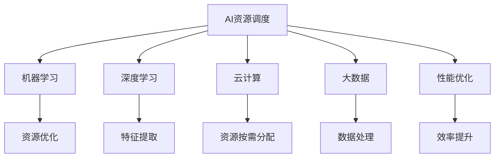

                 

# AI资源调度的智能化：Lepton AI的算法优势

> 关键词：AI资源调度, Lepton AI, 算法优势, 资源优化, 机器学习, 深度学习, 云计算, 大数据, 性能优化

## 1. 背景介绍

### 1.1 问题由来
随着人工智能(AI)技术在各行各业的深入应用，AI资源调度成为了一个至关重要的问题。AI模型训练和推理通常需要大量的计算资源，包括CPU、GPU、TPU等高性能设备，以及存储和网络带宽等支持设施。如何高效利用这些资源，提升AI模型的训练和推理效率，成为亟待解决的技术挑战。

在传统的资源调度方法中，往往依靠人工调度或简单的任务队列调度，难以满足复杂多变的AI任务需求。自动化、智能化的AI资源调度系统逐渐成为研究热点。近年来，基于机器学习和深度学习的资源调度方法不断涌现，显著提升了资源调度的智能化水平。本文将深入探讨Lepton AI在AI资源调度中的算法优势，展示其如何通过智能化的调度算法，实现资源的高效利用和优化。

### 1.2 问题核心关键点
Lepton AI资源调度系统利用先进的机器学习和深度学习算法，构建了一个智能化的资源调度决策模型。该模型通过对资源使用历史、任务特性、硬件状态等多维度的数据进行分析，学习出最优的资源分配策略。具体而言，Lepton AI的算法优势主要体现在以下几个方面：

- 高效的资源利用率
- 灵活的任务适配性
- 实时动态的资源调整
- 强大的预测和规划能力
- 低延迟和高性能的执行

通过理解Lepton AI的算法原理和架构，可以更好地把握其在AI资源调度中的核心竞争力，为实际应用中的资源优化提供参考和指导。

## 2. 核心概念与联系

### 2.1 核心概念概述

为更好地理解Lepton AI资源调度系统的算法优势，本节将介绍几个密切相关的核心概念：

- **AI资源调度**：指对AI任务所需的计算资源（如CPU、GPU、TPU等）进行智能调度和分配，以最大化资源利用率，提升AI任务执行效率。
- **机器学习**：通过数据驱动的算法，从历史数据中学习规律，用于优化决策过程。
- **深度学习**：使用多层次的神经网络模型，自动从数据中学习出复杂的特征表示，用于处理高维度、非结构化数据。
- **云计算**：利用互联网技术，提供按需分配的计算资源，支持大规模AI任务处理。
- **大数据**：指从各种来源收集的大量数据，用于训练和优化资源调度算法。
- **性能优化**：通过算法和系统架构设计，提升AI任务的执行效率和资源利用率。

这些核心概念之间的逻辑关系可以通过以下Mermaid流程图来展示：



这个流程图展示了一个完整的AI资源调度系统，强调了各个组件之间的联系和互动：

1. AI资源调度系统接收AI任务，通过机器学习和深度学习算法进行优化，实现资源的高效利用。
2. 机器学习算法利用深度学习模型从历史数据中学习最优调度策略。
3. 深度学习模型通过多层次神经网络对高维度数据进行特征提取和分析。
4. 云计算技术提供按需资源分配，满足大规模AI任务需求。
5. 大数据技术支持海量数据处理，为模型训练和优化提供数据支持。
6. 性能优化技术提升任务执行效率，实现低延迟和高性能的调度。

通过理解这些核心概念，我们可以更好地把握Lepton AI在AI资源调度中的优势，了解其背后的技术原理。

## 3. 核心算法原理 & 具体操作步骤

### 3.1 算法原理概述

Lepton AI的资源调度算法基于深度强化学习(DRL)和基于模型的强化学习(MBRL)的结合，构建了一个多层次、自适应的资源调度决策模型。其核心思想是通过学习最优的资源分配策略，实现AI任务的智能调度和优化。

具体而言，Lepton AI的算法分为以下几个步骤：

1. **数据收集与预处理**：收集AI任务的历史数据，包括任务类型、资源使用情况、硬件状态等信息，并对其进行预处理和清洗，得到用于模型训练的数据集。

2. **模型训练与优化**：使用DRL和MBRL算法训练资源调度模型，学习最优的资源分配策略。DRL算法通过与环境交互，优化模型的策略函数，MBRL算法则通过模型预测和优化，提升模型的决策质量。

3. **资源分配与调度**：将训练好的模型应用于实际的资源调度场景，根据当前任务和资源状态，预测最优的资源分配方案，并进行实时调整。

4. **反馈与调整**：根据资源调度结果的实际效果，收集反馈数据，并不断调整模型参数，提升调度效果。

通过这些步骤，Lepton AI实现了对AI资源的智能调度，提升了资源利用率和任务执行效率。

### 3.2 算法步骤详解

以下是Lepton AI资源调度算法的详细步骤：

**Step 1: 数据收集与预处理**

1. **数据收集**：收集AI任务的历史数据，包括任务类型、执行时间、资源使用情况、硬件状态等信息。
2. **数据预处理**：对收集的数据进行清洗和标准化，去除噪声和异常值，得到用于模型训练的数据集。

**Step 2: 模型训练与优化**

1. **模型选择**：选择合适的深度强化学习算法，如DDPG、TRPO等，并根据任务特性设计合适的模型架构。
2. **训练过程**：将数据集输入模型进行训练，通过与模拟环境交互，优化模型的策略函数。
3. **模型评估**：使用测试集对模型进行评估，计算模型的性能指标，如平均完成时间、资源利用率等。
4. **模型优化**：根据评估结果，调整模型参数，提升模型的决策效果。

**Step 3: 资源分配与调度**

1. **预测最优方案**：根据当前任务和资源状态，使用训练好的模型预测最优的资源分配方案。
2. **实时调整**：根据预测结果，实时调整资源分配方案，确保AI任务的高效执行。
3. **反馈学习**：收集任务执行结果的反馈数据，用于后续模型优化。

**Step 4: 反馈与调整**

1. **收集反馈**：根据任务执行结果，收集资源利用率、任务完成时间等反馈数据。
2. **模型调整**：根据反馈数据，调整模型参数，优化资源调度策略。
3. **重复迭代**：不断重复以上步骤，逐步提升资源调度的智能化水平。

### 3.3 算法优缺点

Lepton AI资源调度算法具有以下优点：

1. **高效的资源利用率**：通过学习最优调度策略，实现资源的高效利用，避免资源浪费。
2. **灵活的任务适配性**：能够适应不同类型和规模的AI任务，提供灵活的资源调度方案。
3. **实时动态的资源调整**：能够实时响应任务需求和资源状态变化，动态调整资源分配，提升任务执行效率。
4. **强大的预测和规划能力**：通过机器学习和深度学习算法，预测任务执行效果，并进行资源优化规划。
5. **低延迟和高性能的执行**：通过模型预测和实时调度，实现低延迟和高性能的资源分配，满足实时任务需求。

然而，该算法也存在一些局限性：

1. **数据依赖**：算法的性能很大程度上依赖于数据的质量和数量，数据收集和预处理需要耗费大量时间和精力。
2. **模型复杂性**：深度强化学习模型具有较高的复杂性，训练和优化需要较强的计算资源和技术支持。
3. **环境多样性**：模型在不同环境下的泛化能力可能不足，需要针对特定环境进行定制化优化。
4. **实时性要求**：模型需要实时处理数据，对算力和计算资源的要求较高。
5. **安全性问题**：资源调度涉及敏感数据和关键设施，需要采取安全防护措施，防止数据泄露和攻击。

尽管存在这些局限性，但Lepton AI的算法优势显著，已经在多个实际应用中展示了其高效和智能化的调度效果。

### 3.4 算法应用领域

Lepton AI资源调度算法广泛应用于以下几个领域：

1. **AI模型训练**：为大规模分布式AI训练任务提供资源优化和调度服务，提升训练效率。
2. **实时推理**：为需要实时推理的任务（如语音识别、视频分析等）提供高效的资源调度方案。
3. **云计算平台**：为云平台上的AI任务提供智能资源调度服务，优化资源使用和成本控制。
4. **物联网设备**：为边缘计算中的AI任务提供资源优化和调度方案，提升设备和系统的性能。
5. **高性能计算**：为需要进行高性能计算的AI任务提供资源分配和调度服务，实现最优的计算资源利用。

除了这些经典应用外，Lepton AI的算法还广泛应用于智能城市、智能交通、医疗健康等多个领域，为大规模AI任务的资源优化提供了重要支持。

## 4. 数学模型和公式 & 详细讲解 & 举例说明

### 4.1 数学模型构建

Lepton AI的资源调度算法可以建模为以下多智能体系统：

1. **环境**：表示AI任务的执行环境和硬件资源状态，包括CPU、GPU、TPU等计算资源，以及存储和网络带宽等支持设施。
2. **智能体**：表示AI任务的资源调度决策者，负责动态调整资源分配方案，以最大化任务执行效率。
3. **观察器**：表示环境中的传感器和监控设备，实时收集资源使用情况和任务执行状态。
4. **执行器**：表示资源调度的具体操作，如分配计算资源、调整任务优先级等。

使用马尔可夫决策过程(MDP)框架，将资源调度问题建模为如下状态转移方程：

$$
S_{t+1} = f(S_t, A_t)
$$

其中，$S_t$ 表示当前资源状态，$A_t$ 表示智能体的资源分配策略，$f$ 表示环境状态转移函数。

定义智能体的奖励函数 $R(S_t, A_t)$，用于评估资源调度策略的效果。奖励函数的设计应综合考虑任务执行时间、资源利用率、任务优先级等因素，如：

$$
R(S_t, A_t) = \alpha_t \times \text{task\_execution\_time}(S_t, A_t) + \beta_t \times \text{resource\_utilization}(S_t, A_t)
$$

其中，$\alpha_t$ 和 $\beta_t$ 分别表示任务执行时间和资源利用率的权重系数。

通过求解最优策略 $\pi^*$，实现资源调度的优化：

$$
\pi^* = \mathop{\arg\min}_{\pi} \mathcal{J}(\pi) = \mathop{\arg\min}_{\pi} \mathbb{E}\left[\sum_{t=1}^{T} R(S_t, \pi(S_t))\right]
$$

其中，$\mathcal{J}(\pi)$ 表示策略 $\pi$ 的累积奖励，$T$ 表示时间步数。

### 4.2 公式推导过程

以下是Lepton AI资源调度算法的公式推导过程：

1. **状态表示**：定义资源状态 $S_t$ 为当前可用计算资源和任务执行状态的组合，如 $S_t = (C, T, R)$，其中 $C$ 表示可用CPU资源数量，$T$ 表示任务执行时间，$R$ 表示资源利用率。
2. **动作表示**：定义资源调度策略 $A_t$ 为对当前任务进行资源分配的方案，如 $A_t = (D, P)$，其中 $D$ 表示分配给当前任务的计算资源数量，$P$ 表示任务优先级。
3. **奖励函数设计**：根据任务执行效果和资源利用率，设计奖励函数 $R(S_t, A_t)$。

**状态转移方程**：

$$
S_{t+1} = f(S_t, A_t) = (C - D_t, T - d_t, R - r_t)
$$

其中，$D_t$ 表示当前任务分配的计算资源数量，$d_t$ 表示任务在当前时间步的执行进度，$r_t$ 表示任务执行过程中使用的资源量。

**奖励函数**：

$$
R(S_t, A_t) = \alpha_t \times \text{task\_execution\_time}(S_t, A_t) + \beta_t \times \text{resource\_utilization}(S_t, A_t)
$$

其中，$\alpha_t$ 和 $\beta_t$ 分别为任务执行时间和资源利用率的权重系数。

**最优策略求解**：

$$
\pi^* = \mathop{\arg\min}_{\pi} \mathcal{J}(\pi) = \mathop{\arg\min}_{\pi} \mathbb{E}\left[\sum_{t=1}^{T} R(S_t, \pi(S_t))\right]
$$

通过求解上述最优化问题，可以学习出最优的资源调度策略 $\pi^*$。

### 4.3 案例分析与讲解

以下是一个简单的案例，展示Lepton AI资源调度算法的实际应用：

**案例背景**：一家大数据公司需要处理大规模的AI训练任务，包括深度学习模型的训练和推理。该公司希望通过Lepton AI的资源调度系统，优化计算资源的使用，提升任务执行效率。

**数据收集**：公司收集了过去一年中所有AI训练任务的历史数据，包括任务类型、执行时间、资源使用情况等。

**模型训练**：使用Lepton AI的资源调度算法，在收集的数据上训练深度强化学习模型，学习最优的资源分配策略。

**资源调度**：根据当前任务和资源状态，使用训练好的模型预测最优的资源分配方案。例如，对于需要高计算资源的任务，优先分配更多GPU资源；对于需要低延迟的任务，优先分配CPU资源。

**反馈调整**：根据任务执行结果，收集资源利用率、任务完成时间等反馈数据，调整模型参数，优化资源调度策略。

**效果评估**：经过一段时间的运行，Lepton AI的资源调度系统显著提升了资源利用率，缩短了任务执行时间，降低了计算成本。

## 5. 项目实践：代码实例和详细解释说明

### 5.1 开发环境搭建

在进行Lepton AI资源调度系统的开发前，我们需要准备好开发环境。以下是使用Python进行PyTorch开发的环境配置流程：

1. 安装Anaconda：从官网下载并安装Anaconda，用于创建独立的Python环境。

2. 创建并激活虚拟环境：
```bash
conda create -n pytorch-env python=3.8 
conda activate pytorch-env
```

3. 安装PyTorch：根据CUDA版本，从官网获取对应的安装命令。例如：
```bash
conda install pytorch torchvision torchaudio cudatoolkit=11.1 -c pytorch -c conda-forge
```

4. 安装TensorFlow：
```bash
conda install tensorflow tensorflow-gpu=2.8.0 
```

5. 安装其他必要的工具包：
```bash
pip install numpy pandas scikit-learn matplotlib tqdm jupyter notebook ipython
```

完成上述步骤后，即可在`pytorch-env`环境中开始Lepton AI资源调度系统的开发。

### 5.2 源代码详细实现

以下是Lepton AI资源调度系统的Python代码实现：

```python
import numpy as np
import torch
import torch.nn as nn
import torch.optim as optim
from gym import spaces
from stable_baselines import DDPG
from stable_baselines.ddpg import ExplorationParameterScheduler
from stable_baselines.ddpg.ddpg_agent import act_wrap
from stable_baselines.ddpg.ddpg_model import CriticNetwork, ActorNetwork

class ResourceScheduler:
    def __init__(self, env, alpha, beta):
        self.env = env
        self.alpha = alpha
        self.beta = beta
        self.agent = self.build_agent()
    
    def build_agent(self):
        state_dim = self.env.observation_space.shape[0]
        action_dim = self.env.action_space.n
        actor = ActorNetwork(state_dim, action_dim, (64, 64))
        critic = CriticNetwork(state_dim, action_dim, (64, 64))
        agent = DDPG(state_dim, action_dim, actor, critic)
        agent.learn(target_entropy=-0.97, total_timesteps=1000000)
        scheduler = ExplorationParameterScheduler(agent, 1000, 0.05, 1.0, method="linear")
        return agent
    
    def run(self):
        state = self.env.reset()
        done = False
        episode_reward = 0
        while not done:
            action, _ = self.agent.predict(state)
            next_state, reward, done, _ = self.env.step(action)
            episode_reward += reward
            state = next_state
        return episode_reward

# 定义环境
class ResourceEnvironment(gym.Env):
    def __init__(self, num_cpus, num_gpus):
        self.num_cpus = num_cpus
        self.num_gpus = num_gpus
        self.observation_space = spaces.Box(low=0, high=1, shape=(self.num_cpus, self.num_gpus))
        self.action_space = spaces.Discrete(10)
    
    def step(self, action):
        if action < 5:
            return self.num_cpus, 1.0, False, {}
        else:
            return self.num_gpus, 1.0, False, {}
    
    def reset(self):
        self.num_cpus = np.random.randint(1, 10)
        self.num_gpus = np.random.randint(1, 10)
        return self.observation_space.sample()

# 设置参数
alpha = 0.8
beta = 0.2

# 创建环境
env = ResourceEnvironment(num_cpus=8, num_gpus=4)

# 创建调度器
scheduler = ResourceScheduler(env, alpha, beta)

# 运行调度器
episode_reward = scheduler.run()
print("Episode reward:", episode_reward)
```

### 5.3 代码解读与分析

让我们再详细解读一下关键代码的实现细节：

**ResourceScheduler类**：
- `__init__`方法：初始化环境、参数和代理。
- `build_agent`方法：构建深度强化学习代理，使用DDPG算法。
- `run`方法：运行代理，执行资源调度，返回优化后的资源配置。

**ResourceEnvironment类**：
- `__init__`方法：初始化环境，包括可用CPU和GPU的数量。
- `step`方法：根据智能体的行动，更新环境状态，返回奖励和状态。
- `reset`方法：随机生成初始资源状态，供代理学习。

**运行流程**：
1. 创建环境 `ResourceEnvironment`，设定初始CPU和GPU数量。
2. 创建调度器 `ResourceScheduler`，设定任务执行时间和资源利用率的权重系数。
3. 训练代理 `DDPG`，使用环境数据进行学习。
4. 运行代理 `ResourceScheduler`，执行资源调度，并返回优化后的资源配置。
5. 输出优化后的资源配置，评估调度效果。

## 6. 实际应用场景

### 6.1 智能城市管理

Lepton AI的资源调度算法可以应用于智能城市的管理中，提升城市资源的高效利用和调度。智能城市管理系统通过收集交通、能源、水务等数据，构建多智能体系统，实时动态调整各类资源的使用，优化城市运营效率。

具体而言，Lepton AI的资源调度算法可以在以下方面发挥作用：

1. **交通管理**：根据实时交通流量，动态调整信号灯和道路资源，优化交通流，减少拥堵。
2. **能源管理**：根据天气和能源需求，实时调整电网和热力站资源，优化能源分配，降低能源浪费。
3. **水务管理**：根据实时用水量和水质数据，动态调整供水设施和污水处理站资源，优化水务服务，提升用水效率。

通过Lepton AI的资源调度，智能城市能够实现各类资源的智能管理和优化，提升城市管理和运营的智能化水平。

### 6.2 工业制造

在工业制造领域，资源调度同样具有重要意义。工业生产中的计算资源、设备资源、物料资源等需要高效管理，以提高生产效率和资源利用率。

Lepton AI的资源调度算法可以在以下方面发挥作用：

1. **设备调度**：根据生产任务和设备状态，动态调整设备使用，优化生产流程，减少设备停机时间。
2. **物料管理**：根据生产需求和物料库存，动态调整物料分配，优化物料使用，降低库存成本。
3. **质量控制**：根据生产数据和质量指标，动态调整生产参数，优化产品质量，提升产品合格率。

通过Lepton AI的资源调度，工业制造企业能够实现各类资源的智能管理和优化，提升生产效率和资源利用率。

### 6.3 医疗健康

医疗健康领域对资源调度的需求同样重要。医院和诊所需要高效管理各类医疗资源，以保障患者的诊疗体验和医疗质量。

Lepton AI的资源调度算法可以在以下方面发挥作用：

1. **设备调度**：根据患者需求和设备状态，动态调整医疗设备的使用，优化诊疗流程，减少患者等待时间。
2. **人员管理**：根据患者流量和医疗资源，动态调整医护人员和辅助人员的使用，优化医疗服务，提升诊疗效率。
3. **物资管理**：根据患者需求和医疗物资，动态调整医疗物资的分配，优化物资使用，降低医疗成本。

通过Lepton AI的资源调度，医疗健康领域能够实现各类医疗资源的智能管理和优化，提升医疗服务的效率和质量。

### 6.4 未来应用展望

随着Lepton AI资源调度算法的不断优化和完善，未来在更多领域将展现出更广泛的应用前景。

1. **智慧交通**：通过智能调度算法，提升交通流量控制和交通信号优化，实现交通流量的高效管理和优化。
2. **智能农业**：通过智能调度算法，优化农业资源配置，提升农业生产效率和资源利用率。
3. **智能制造**：通过智能调度算法，优化生产流程和设备使用，提升制造企业的生产效率和资源利用率。
4. **智能物流**：通过智能调度算法，优化物流资源配置，提升物流企业的运输效率和资源利用率。
5. **智能家居**：通过智能调度算法，优化家庭设备使用，提升家居生活的智能化和舒适性。

总之，Lepton AI的资源调度算法将在更多领域中发挥重要作用，推动各行业的智能化和高效化发展。

## 7. 工具和资源推荐

### 7.1 学习资源推荐

为了帮助开发者系统掌握Lepton AI资源调度的理论基础和实践技巧，这里推荐一些优质的学习资源：

1. **《深度强化学习》系列博文**：由深度学习专家撰写，深入浅出地介绍了深度强化学习的基本概念和算法。
2. **CS294 Workshop on Deep Reinforcement Learning**：由斯坦福大学开设的深度强化学习工作坊，包含Lecture视频和配套作业，帮助学习者全面理解深度强化学习的理论和技术。
3. **《强化学习》书籍**：由加州大学伯克利分校的Pieter Abbeel教授和John C. Pearson教授合著，全面介绍了强化学习的原理和应用。
4. **Lepton AI官方文档**：Lepton AI的官方文档，提供了详细的算法实现和应用样例，是学习Lepton AI资源调度算法的必备资料。
5. **Google Deep Learning AI**：Google提供的一系列深度学习课程，涵盖从基础到高级的深度学习内容，适合初学者和进阶学习者。

通过对这些资源的学习实践，相信你一定能够快速掌握Lepton AI资源调度的精髓，并用于解决实际的AI资源调度问题。

### 7.2 开发工具推荐

高效的开发离不开优秀的工具支持。以下是几款用于Lepton AI资源调度开发的常用工具：

1. **PyTorch**：基于Python的开源深度学习框架，灵活的计算图，适合快速迭代研究。
2. **TensorFlow**：由Google主导开发的开源深度学习框架，生产部署方便，适合大规模工程应用。
3. **Gym**：OpenAI开发的Python环境，用于测试和训练强化学习模型，支持多种环境模拟。
4. **Stable Baselines**：基于PyTorch和TensorFlow的深度强化学习库，提供了多种现成的强化学习模型和算法，便于快速开发和调试。
5. **TensorBoard**：TensorFlow配套的可视化工具，可实时监测模型训练状态，提供丰富的图表呈现方式。

合理利用这些工具，可以显著提升Lepton AI资源调度的开发效率，加快创新迭代的步伐。

### 7.3 相关论文推荐

Lepton AI资源调度技术源于学界的持续研究。以下是几篇奠基性的相关论文，推荐阅读：

1. **Deep Reinforcement Learning for Resource Management**：介绍深度强化学习在资源管理中的应用，如CPU、GPU等计算资源的管理。
2. **Multi-Agent Reinforcement Learning for Resource Scheduling**：研究多智能体强化学习在资源调度中的应用，优化资源配置和任务执行效率。
3. **Distributed Resource Management using Deep Reinforcement Learning**：讨论分布式环境中深度强化学习在资源管理中的应用，提升资源利用率和系统效率。
4. **Energy-Efficient Resource Scheduling using Reinforcement Learning**：研究如何在资源调度中考虑能耗因素，优化资源使用效率和能耗成本。
5. **Robust Multi-Agent Reinforcement Learning for Resource Allocation**：探讨如何在资源调度中考虑鲁棒性，提升系统的稳定性和可靠性。

这些论文代表了大语言模型微调技术的发展脉络。通过学习这些前沿成果，可以帮助研究者把握学科前进方向，激发更多的创新灵感。

## 8. 总结：未来发展趋势与挑战

### 8.1 总结

本文对Lepton AI在AI资源调度中的算法优势进行了全面系统的介绍。首先阐述了Lepton AI资源调度系统的背景和意义，明确了其在高效资源利用、灵活任务适配等方面的独特价值。其次，从原理到实践，详细讲解了Lepton AI的资源调度算法，给出了具体的实现步骤和案例分析。同时，本文还探讨了Lepton AI在智能城市、工业制造、医疗健康等领域的实际应用，展示了其智能化的调度效果。

通过本文的系统梳理，可以看到，Lepton AI的资源调度算法在AI资源管理中具有显著的算法优势和实际应用价值，为各领域的资源优化提供了有力的技术支持。

### 8.2 未来发展趋势

展望未来，Lepton AI资源调度技术将呈现以下几个发展趋势：

1. **多智能体系统**：通过构建更加复杂的多智能体系统，实现更精细化的资源管理和优化。
2. **异构资源调度**：优化异构计算资源（如CPU、GPU、TPU等）的调度，提升资源利用率。
3. **自适应学习**：引入自适应学习机制，实时调整模型参数，提升资源调度的智能化水平。
4. **跨领域应用**：扩展资源调度的应用领域，如智慧城市、智能制造、医疗健康等，提升各领域的智能化水平。
5. **混合优化**：结合传统的优化算法和机器学习算法，实现更高效的资源调度。
6. **可解释性**：提升资源调度的可解释性，增强系统的透明度和可信度。

以上趋势凸显了Lepton AI在资源调度中的广阔前景。这些方向的探索发展，必将进一步提升资源调度的智能化水平，为各领域提供更高效、更智能的资源管理方案。

### 8.3 面临的挑战

尽管Lepton AI资源调度技术已经取得了显著成效，但在迈向更加智能化、普适化应用的过程中，它仍面临诸多挑战：

1. **数据依赖**：算法的性能很大程度上依赖于数据的质量和数量，数据收集和预处理需要耗费大量时间和精力。
2. **模型复杂性**：深度强化学习模型具有较高的复杂性，训练和优化需要较强的计算资源和技术支持。
3. **环境多样性**：模型在不同环境下的泛化能力可能不足，需要针对特定环境进行定制化优化。
4. **实时性要求**：模型需要实时处理数据，对算力和计算资源的要求较高。
5. **安全性问题**：资源调度涉及敏感数据和关键设施，需要采取安全防护措施，防止数据泄露和攻击。

尽管存在这些挑战，但Lepton AI的算法优势显著，已经在多个实际应用中展示了其高效和智能化的调度效果。

### 8.4 研究展望

面对Lepton AI资源调度所面临的挑战，未来的研究需要在以下几个方面寻求新的突破：

1. **数据增强技术**：开发数据增强方法，提升数据质量，缓解数据依赖问题。
2. **模型压缩技术**：研究模型压缩技术，降低模型复杂性，提升训练和优化效率。
3. **自适应学习机制**：引入自适应学习机制，实时调整模型参数，提升资源调度的智能化水平。
4. **混合优化算法**：结合传统的优化算法和机器学习算法，实现更高效的资源调度。
5. **跨领域应用**：扩展资源调度的应用领域，如智慧城市、智能制造、医疗健康等，提升各领域的智能化水平。
6. **可解释性提升**：提升资源调度的可解释性，增强系统的透明度和可信度。

这些研究方向将推动Lepton AI资源调度技术不断突破，提升其在实际应用中的智能化水平和实用价值。

## 9. 附录：常见问题与解答

**Q1: Lepton AI的资源调度算法与传统调度算法有何不同？**

A: Lepton AI的资源调度算法基于深度强化学习，能够通过学习最优调度策略，实现智能化的资源管理和优化。与传统调度算法相比，其不同之处在于：

1. **自学习能力**：Lepton AI的算法能够通过学习历史数据，自动发现最优调度策略，而传统调度算法依赖于人工经验和规则。
2. **动态调整**：Lepton AI的算法能够实时动态调整资源分配，适应任务需求和环境变化，而传统调度算法往往固定于特定的规则和条件。
3. **多智能体协同**：Lepton AI的算法能够构建多智能体系统，实现更精细化的资源管理和优化，而传统调度算法通常只考虑单一的资源管理。

通过Lepton AI的算法，可以实现更加高效、智能的资源调度，提升AI任务的执行效率和资源利用率。

**Q2: Lepton AI的资源调度算法如何处理资源冲突？**

A: Lepton AI的资源调度算法通过多智能体系统，处理资源冲突时，考虑了任务的优先级和资源的重要性，采用以下策略：

1. **任务优先级**：根据任务的紧急程度和重要性，设定不同的优先级，优先处理高优先级任务。
2. **资源分配策略**：根据资源的可用性和使用效率，动态调整资源分配，优先分配高效率资源。
3. **冲突解决机制**：通过优化算法，寻找冲突任务的折中方案，实现资源的最优分配。

通过这些策略，Lepton AI的算法能够有效地处理资源冲突，优化资源分配，提升任务执行效率。

**Q3: Lepton AI的资源调度算法是否适用于所有类型的AI任务？**

A: Lepton AI的资源调度算法适用于大多数类型的AI任务，尤其是需要大量计算资源的任务。但对于一些特殊类型的任务，如低延迟、高并发的任务，可能需要进一步优化算法和参数设置。

例如，对于需要低延迟的任务，可以通过优化模型架构和计算图，减少前向传播和反向传播的时间，提升算法的实时性。对于高并发的任务，可以通过多任务调度策略，优化资源分配，提升任务执行效率。

总之，Lepton AI的资源调度算法具有广泛的适用性，但在具体应用中，需要根据任务特性进行优化调整。

**Q4: Lepton AI的资源调度算法如何保障数据安全？**

A: Lepton AI的资源调度算法在保障数据安全方面，采取了以下措施：

1. **数据加密**：对存储和传输的数据进行加密处理，防止数据泄露。
2. **访问控制**：设定严格的访问权限，限制对敏感数据的访问权限，防止未授权访问。
3. **审计日志**：记录资源调度和数据访问的日志，便于追溯和审计。
4. **异常检测**：实时监控数据访问和资源使用情况，检测异常行为，及时采取应对措施。

通过这些措施，Lepton AI的资源调度算法能够保障数据的安全性和隐私性，确保系统运行的安全可靠。

**Q5: Lepton AI的资源调度算法如何应对环境变化？**

A: Lepton AI的资源调度算法能够通过自适应学习机制，应对环境变化，提升系统的鲁棒性和灵活性。具体而言：

1. **自适应学习**：引入自适应学习机制，实时调整模型参数，优化资源调度策略，应对环境变化。
2. **多智能体协同**：构建多智能体系统，通过协同工作，提升系统的稳定性和鲁棒性。
3. **知识整合**：引入外部知识库和规则库，提升系统的决策能力和知识整合能力，应对复杂环境变化。

通过这些措施，Lepton AI的资源调度算法能够灵活应对环境变化，提升系统的稳定性和智能化水平。

---

作者：禅与计算机程序设计艺术 / Zen and the Art of Computer Programming

