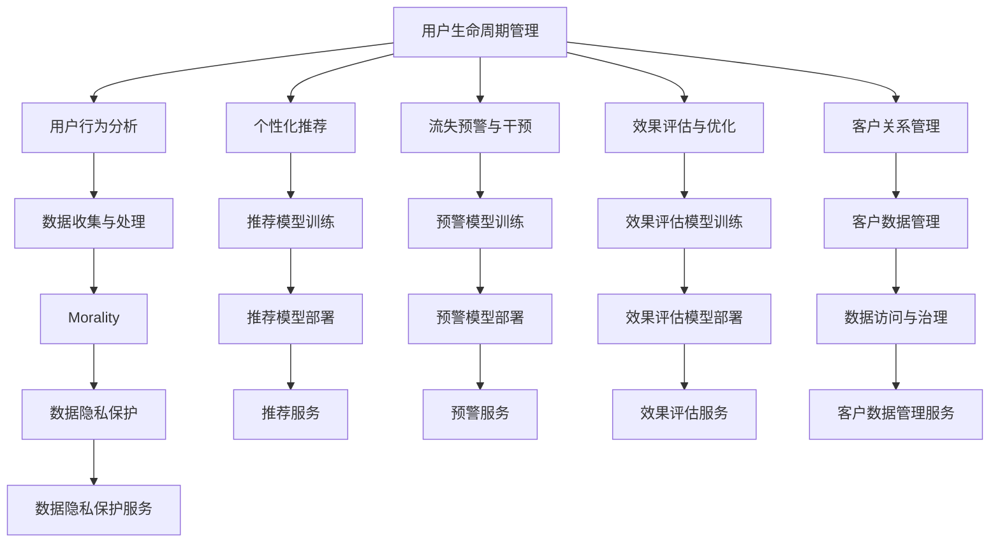

                 

# AI赋能的电商平台用户生命周期管理

## 1. 背景介绍

### 1.1 问题由来
随着电子商务的迅速发展，各大电商平台面临着巨大的用户竞争压力。如何提升用户留存率、增加用户黏性、促进消费转化，是每个电商平台都在思考的关键问题。用户生命周期管理（Customer Lifecycle Management, CLM）被广泛认为是解决这一问题的有效手段，其核心在于通过分析用户的购买行为和互动数据，识别出处于不同生命阶段的用户，并制定相应的营销策略，推动用户向更高级的生命阶段转化，实现平台业绩的持续增长。

近年来，随着人工智能技术的发展，电商平台纷纷引入AI技术，对用户生命周期管理进行深度优化。AI技术不仅能够提高数据分析的精度和效率，还能够实现动态化的营销策略调整，进一步提升用户转化率和留存率。AI赋能的电商平台用户生命周期管理，正在成为行业趋势，并引发了广泛关注。

### 1.2 问题核心关键点
AI赋能的电商平台用户生命周期管理涉及的关键点包括：

1. **用户行为分析**：通过AI技术，对用户在平台上的浏览、搜索、购物、评价等行为进行分析，识别出用户的兴趣偏好、消费习惯和生命阶段。

2. **用户群体划分**：将用户划分为不同生命阶段，如新用户、活跃用户、潜在流失用户、高价值用户等。

3. **个性化推荐**：根据用户群体和行为特征，制定个性化的推荐策略，提高用户满意度，促进消费转化。

4. **流失预警与干预**：通过AI模型，实时监控用户行为，预测潜在流失用户，及时采取干预措施，减少用户流失。

5. **效果评估与优化**：利用AI技术对营销策略的效果进行评估，并根据反馈不断优化，提升营销ROI。

## 2. 核心概念与联系

### 2.1 核心概念概述

为更好地理解AI赋能的电商平台用户生命周期管理，本节将介绍几个密切相关的核心概念：

- **用户生命周期管理（Customer Lifecycle Management, CLM）**：通过分析用户行为，识别不同生命阶段的用户，并制定相应的营销策略，推动用户向更高级生命阶段转化，实现平台业绩的持续增长。

- **用户行为分析**：利用AI技术，对用户的行为数据进行分析，挖掘出用户的兴趣偏好、消费习惯等信息。

- **个性化推荐**：根据用户的行为特征，制定个性化的推荐策略，提高用户满意度，促进消费转化。

- **流失预警与干预**：通过AI模型，实时监控用户行为，预测潜在流失用户，及时采取干预措施，减少用户流失。

- **效果评估与优化**：利用AI技术对营销策略的效果进行评估，并根据反馈不断优化，提升营销ROI。

- **客户关系管理（Customer Relationship Management, CRM）**：对客户信息进行管理，以提升客户满意度和忠诚度，从而提高客户终生价值（Customer Lifetime Value, CLV）。

这些核心概念之间的逻辑关系可以通过以下Mermaid流程图来展示：



这个流程图展示了大语言模型的核心概念及其之间的关系：

1. 用户生命周期管理通过用户行为分析来识别不同生命阶段的用户。
2. 个性化推荐和流失预警与干预是针对不同用户群体的针对性策略。
3. 效果评估与优化则是对营销策略效果的反馈与调整。
4. 客户关系管理则是对客户信息进行管理和维护，提升客户忠诚度。

这些概念共同构成了AI赋能的电商平台用户生命周期管理的整体框架，使电商平台能够更加精准地管理用户，提升用户体验和平台业绩。

## 3. 核心算法原理 & 具体操作步骤
### 3.1 算法原理概述

AI赋能的电商平台用户生命周期管理，本质上是一个多阶段、动态化的数据驱动营销决策过程。其核心思想是：通过分析用户行为数据，构建用户画像，识别出处于不同生命阶段的用户，并根据用户画像制定个性化的推荐策略和流失预警策略，实现对用户的精准营销和流失干预。

形式化地，假设电商平台的用户总数为 $N$，用户行为数据为 $D=\{(x_i,y_i)\}_{i=1}^N$，其中 $x_i$ 为用户行为数据，$y_i$ 为用户的生命阶段标签。目标是构建一个预测模型 $M$，使其能够准确预测用户处于哪个生命阶段。

具体的实现流程包括：

1. **数据预处理**：收集用户行为数据，并进行清洗、归一化、特征工程等预处理操作，生成特征向量 $X$。
2. **模型训练**：选择合适的机器学习算法，如决策树、随机森林、神经网络等，在标注数据上训练预测模型 $M$。
3. **用户画像构建**：根据模型 $M$，对每个用户的行为数据进行预测，构建用户画像 $P_i$。
4. **个性化推荐**：根据用户画像 $P_i$，生成个性化推荐策略，并应用到用户 $i$ 的行为数据上。
5. **流失预警与干预**：实时监控用户行为，利用模型 $M$ 预测用户流失风险，并采取相应的干预措施，如优惠券、个性化邮件等。
6. **效果评估与优化**：对推荐和预警策略的效果进行评估，并根据反馈不断优化模型 $M$，提升营销ROI。

### 3.2 算法步骤详解

AI赋能的电商平台用户生命周期管理的具体步骤包括：

**Step 1: 数据收集与预处理**

- 收集用户在电商平台上的各种行为数据，包括浏览记录、购买历史、评价信息、搜索关键词等。
- 对数据进行清洗、去重、缺失值处理，确保数据质量和一致性。
- 对数据进行归一化、标准化、特征提取等预处理操作，生成特征向量 $X$。

**Step 2: 用户行为分析**

- 利用机器学习算法（如K-Means、PCA等）对用户行为数据进行聚类分析，识别出不同用户群体。
- 对不同用户群体进行分析，挖掘其兴趣偏好、消费习惯等特征。
- 使用深度学习模型（如LSTM、RNN、GRU等）对用户行为数据进行建模，预测用户的生命阶段标签。

**Step 3: 用户画像构建**

- 根据模型 $M$ 的预测结果，对每个用户的行为数据进行分类，生成用户画像 $P_i$。
- 用户画像包含用户基本信息、行为特征、生命阶段等，用于后续的个性化推荐和流失预警。

**Step 4: 个性化推荐**

- 根据用户画像 $P_i$，生成个性化的推荐策略，如商品推荐、活动推荐等。
- 使用协同过滤、内容推荐、基于关联规则等方法生成推荐策略，提高用户满意度。
- 通过A/B测试等方法评估推荐效果，并根据反馈不断优化推荐策略。

**Step 5: 流失预警与干预**

- 实时监控用户行为，利用模型 $M$ 预测用户流失风险。
- 对于高风险用户，及时采取干预措施，如发送个性化邮件、提供优惠券等。
- 通过流失预警与干预，降低用户流失率，提升用户留存率。

**Step 6: 效果评估与优化**

- 对推荐和预警策略的效果进行评估，计算营销ROI。
- 利用A/B测试、回归分析等方法评估策略效果。
- 根据评估结果，不断优化模型 $M$ 和推荐策略，提升营销效果。

### 3.3 算法优缺点

AI赋能的电商平台用户生命周期管理方法具有以下优点：

1. **个性化推荐**：利用AI技术，对用户行为数据进行分析，生成个性化推荐策略，提高用户满意度，促进消费转化。

2. **动态调整**：AI技术能够实时监控用户行为，动态调整推荐和预警策略，提高策略的灵活性和效果。

3. **精度高**：利用机器学习和深度学习模型进行预测，精度高，能够有效识别用户生命阶段。

4. **可解释性**：AI技术可以提供详细的预测依据和解释，帮助理解用户行为背后的原因。

5. **自动化**：AI技术能够自动进行数据处理、模型训练和策略优化，减少人工干预。

然而，该方法也存在一定的局限性：

1. **数据依赖**：AI赋能的电商平台用户生命周期管理高度依赖用户行为数据，数据的全面性和质量直接影响模型的效果。

2. **模型复杂**：构建个性化推荐和流失预警模型需要复杂的算法和大量计算资源，模型训练和部署成本较高。

3. **隐私问题**：用户行为数据的收集和使用可能涉及隐私问题，需要采取有效的数据隐私保护措施。

4. **冷启动问题**：对于新用户或历史行为数据较少的用户，模型预测的准确度较低，需要进行冷启动优化。

5. **模型偏见**：AI模型可能存在偏见，导致对某些用户群体的推荐和预警策略不够公平。

尽管存在这些局限性，但就目前而言，AI赋能的电商平台用户生命周期管理仍然是最主流、最有效的用户管理方式之一。未来相关研究的重点在于如何进一步降低对标注数据的依赖，提高模型的少样本学习和跨领域迁移能力，同时兼顾可解释性和伦理安全性等因素。

### 3.4 算法应用领域

AI赋能的电商平台用户生命周期管理在多个领域得到了广泛应用，例如：

1. **个性化推荐系统**：通过分析用户行为数据，生成个性化的推荐策略，提升用户满意度和转化率。

2. **用户流失预警系统**：利用AI模型，实时监控用户行为，预测用户流失风险，及时采取干预措施，减少用户流失。

3. **客户服务系统**：通过分析用户互动数据，识别出用户需求，提供个性化的客户服务，提升用户体验。

4. **营销自动化系统**：利用AI技术，自动化地进行用户分群、策略调整和效果评估，提高营销ROI。

5. **智能客服系统**：通过分析用户行为数据，生成智能客服策略，提升客户服务质量。

6. **客户分析系统**：利用AI技术，进行客户画像分析，挖掘出高价值客户，制定针对性的营销策略。

除了上述这些经典应用外，AI赋能的电商平台用户生命周期管理还被创新性地应用到更多场景中，如内容推荐、广告投放、营销自动化等，为电商平台提供了全新的业务支持和增长动力。

## 4. 数学模型和公式 & 详细讲解 & 举例说明
### 4.1 数学模型构建

假设电商平台的用户总数为 $N$，用户行为数据为 $D=\{(x_i,y_i)\}_{i=1}^N$，其中 $x_i$ 为用户行为数据，$y_i$ 为用户的生命阶段标签。

定义用户行为数据为 $X_i$，生命阶段标签为 $Y_i$，则用户的概率分布可以表示为：

$$
P(Y_i|X_i) = \frac{P(X_i|Y_i)P(Y_i)}{P(X_i)}
$$

其中 $P(X_i|Y_i)$ 为条件概率，表示在给定用户生命阶段 $Y_i$ 的情况下，用户行为数据 $X_i$ 的概率分布；$P(Y_i)$ 为先验概率，表示用户处于不同生命阶段的概率分布；$P(X_i)$ 为边缘概率，表示用户在所有生命阶段下的行为数据分布。

### 4.2 公式推导过程

为了实现用户生命阶段预测，我们引入贝叶斯网络（Bayesian Network）对用户行为数据进行建模。假设用户行为数据 $X$ 由多个特征变量 $X_1, X_2, ..., X_n$ 组成，用户生命阶段 $Y$ 由 $Y_1, Y_2, ..., Y_k$ 表示，则贝叶斯网络的结构可以表示为：

$$
Y \rightarrow X_1 \rightarrow X_2 \rightarrow ... \rightarrow X_n
$$

其中箭头表示因果关系，即 $X_i$ 受 $Y_i$ 的影响，并且 $X_i$ 对后续的 $X_{i+1}$ 也有影响。

根据贝叶斯网络，用户生命阶段 $Y$ 的条件概率可以表示为：

$$
P(Y_i|X_i) = \frac{P(Y_i)\prod_{j=1}^n P(X_{i,j}|Y_i)}{\sum_{j=1}^k P(Y_j)\prod_{j=1}^n P(X_{i,j}|Y_j)}
$$

其中 $X_{i,j}$ 表示用户行为数据 $X_i$ 中的第 $j$ 个特征变量。

为了求解 $P(Y_i|X_i)$，我们需要构建一个包含所有特征变量的联合概率分布 $P(X_i, Y_i)$，并进行贝叶斯网络参数学习。在实践中，通常使用EM算法对联合概率分布进行估计，并使用正则化技术（如L1正则、Dropout等）避免过拟合。

### 4.3 案例分析与讲解

假设某电商平台有 $N=10000$ 名用户，收集了 $100$ 天的用户行为数据 $D=\{(x_i,y_i)\}_{i=1}^{10000 \times 100}$。我们希望预测用户的生命阶段标签 $Y_i$，并根据预测结果进行个性化推荐和流失预警。

首先，我们将用户行为数据 $x_i$ 分为 $n=10$ 个特征变量 $X_1, X_2, ..., X_{10}$，用户生命阶段 $Y_i$ 分为 $k=4$ 个标签 $Y_1, Y_2, ..., Y_4$，分别表示新用户、活跃用户、潜在流失用户、高价值用户。

我们使用贝叶斯网络对用户行为数据进行建模，并通过EM算法对联合概率分布进行估计。在模型训练过程中，我们引入L1正则、Dropout等技术，防止模型过拟合。

在模型训练完成后，我们可以使用贝叶斯网络对用户行为数据 $x_i$ 进行预测，得到用户生命阶段标签 $Y_i$。根据预测结果，我们可以对用户进行分类，生成用户画像 $P_i$，并根据用户画像进行个性化推荐和流失预警。

## 5. 项目实践：代码实例和详细解释说明
### 5.1 开发环境搭建

在进行项目实践前，我们需要准备好开发环境。以下是使用Python进行TensorFlow开发的环境配置流程：

1. 安装Anaconda：从官网下载并安装Anaconda，用于创建独立的Python环境。

2. 创建并激活虚拟环境：
```bash
conda create -n tf-env python=3.8 
conda activate tf-env
```

3. 安装TensorFlow：根据CUDA版本，从官网获取对应的安装命令。例如：
```bash
conda install tensorflow -c conda-forge
```

4. 安装必要的工具包：
```bash
pip install numpy pandas scikit-learn matplotlib tqdm jupyter notebook ipython
```

完成上述步骤后，即可在`tf-env`环境中开始项目实践。

### 5.2 源代码详细实现

以下是一个使用TensorFlow实现用户生命周期管理的简单代码示例：

```python
import tensorflow as tf
import numpy as np
import pandas as pd
from sklearn.model_selection import train_test_split
from sklearn.metrics import accuracy_score

# 加载用户行为数据
data = pd.read_csv('user_behavior_data.csv')

# 数据预处理
features = data[['feature1', 'feature2', 'feature3', 'feature4', 'feature5', 'feature6', 'feature7', 'feature8', 'feature9', 'feature10']]
labels = data['label']

# 特征工程
features = pd.get_dummies(features)
features = features.values
labels = labels.values

# 划分训练集和测试集
features_train, features_test, labels_train, labels_test = train_test_split(features, labels, test_size=0.2)

# 定义模型
model = tf.keras.Sequential([
    tf.keras.layers.Dense(32, activation='relu', input_shape=(features_train.shape[1],)),
    tf.keras.layers.Dense(16, activation='relu'),
    tf.keras.layers.Dense(4, activation='softmax')
])

# 编译模型
model.compile(optimizer='adam', loss='sparse_categorical_crossentropy', metrics=['accuracy'])

# 训练模型
model.fit(features_train, labels_train, epochs=10, batch_size=32)

# 评估模型
accuracy = model.evaluate(features_test, labels_test)[1]
print(f'模型准确度：{accuracy:.3f}')
```

在这个简单的代码示例中，我们使用TensorFlow搭建了一个简单的神经网络模型，用于预测用户生命阶段。模型包括两个全连接层和一个softmax输出层。在模型训练过程中，我们使用了Adam优化器和交叉熵损失函数，并计算了模型的准确度。

### 5.3 代码解读与分析

让我们再详细解读一下关键代码的实现细节：

**数据预处理**：
- `pd.read_csv('user_behavior_data.csv')`：读取用户行为数据。
- `pd.get_dummies(features)`：对特征数据进行独热编码，转换为模型可接受的格式。

**模型定义**：
- `tf.keras.Sequential`：定义模型结构。
- `tf.keras.layers.Dense`：定义全连接层，其中激活函数为ReLU。
- `model.compile`：编译模型，指定优化器、损失函数和评价指标。

**模型训练**：
- `model.fit(features_train, labels_train, epochs=10, batch_size=32)`：在训练集上训练模型，设置训练轮数和批大小。

**模型评估**：
- `model.evaluate(features_test, labels_test)`：在测试集上评估模型性能，计算准确度。

在实际开发中，我们需要根据具体业务需求对模型进行进一步优化和调整。例如，可以使用更复杂的神经网络结构、引入卷积层和池化层处理多模态数据、使用迁移学习策略提高模型泛化能力等。同时，还需要考虑模型的可解释性、隐私保护等重要问题。

## 6. 实际应用场景
### 6.1 智能客服系统

基于AI赋能的电商平台用户生命周期管理技术，可以广泛应用于智能客服系统的构建。传统客服往往需要配备大量人力，高峰期响应缓慢，且一致性和专业性难以保证。而使用用户生命周期管理技术，可以实时监控用户行为，预测用户需求，自动生成客服应答策略，提升客户服务质量。

在技术实现上，可以收集企业内部的历史客服对话记录，将问题和最佳答复构建成监督数据，在此基础上对预训练语言模型进行微调。微调后的模型能够自动理解用户意图，匹配最合适的答案模板进行回复。对于客户提出的新问题，还可以接入检索系统实时搜索相关内容，动态组织生成回答。如此构建的智能客服系统，能大幅提升客户咨询体验和问题解决效率。

### 6.2 金融舆情监测

金融机构需要实时监测市场舆论动向，以便及时应对负面信息传播，规避金融风险。传统的人工监测方式成本高、效率低，难以应对网络时代海量信息爆发的挑战。基于用户生命周期管理的文本分类和情感分析技术，为金融舆情监测提供了新的解决方案。

具体而言，可以收集金融领域相关的新闻、报道、评论等文本数据，并对其进行主题标注和情感标注。在此基础上对预训练语言模型进行微调，使其能够自动判断文本属于何种主题，情感倾向是正面、中性还是负面。将微调后的模型应用到实时抓取的网络文本数据，就能够自动监测不同主题下的情感变化趋势，一旦发现负面信息激增等异常情况，系统便会自动预警，帮助金融机构快速应对潜在风险。

### 6.3 个性化推荐系统

当前的推荐系统往往只依赖用户的历史行为数据进行物品推荐，无法深入理解用户的真实兴趣偏好。基于用户生命周期管理的个性化推荐系统可以更好地挖掘用户行为背后的语义信息，从而提供更精准、多样的推荐内容。

在实践中，可以收集用户浏览、点击、评论、分享等行为数据，提取和用户交互的物品标题、描述、标签等文本内容。将文本内容作为模型输入，用户的后续行为（如是否点击、购买等）作为监督信号，在此基础上微调预训练语言模型。微调后的模型能够从文本内容中准确把握用户的兴趣点。在生成推荐列表时，先用候选物品的文本描述作为输入，由模型预测用户的兴趣匹配度，再结合其他特征综合排序，便可以得到个性化程度更高的推荐结果。

### 6.4 未来应用展望

随着AI技术的发展，基于用户生命周期管理的系统将在更多领域得到应用，为传统行业带来变革性影响。

在智慧医疗领域，基于用户生命周期管理的医疗问答、病历分析、药物研发等应用将提升医疗服务的智能化水平，辅助医生诊疗，加速新药开发进程。

在智能教育领域，用户生命周期管理技术可应用于作业批改、学情分析、知识推荐等方面，因材施教，促进教育公平，提高教学质量。

在智慧城市治理中，用户生命周期管理技术可应用于城市事件监测、舆情分析、应急指挥等环节，提高城市管理的自动化和智能化水平，构建更安全、高效的未来城市。

此外，在企业生产、社会治理、文娱传媒等众多领域，基于用户生命周期管理的AI应用也将不断涌现，为经济社会发展注入新的动力。相信随着技术的日益成熟，用户生命周期管理技术将成为AI落地应用的重要范式，推动人工智能技术在各行各业中进一步普及和应用。

## 7. 工具和资源推荐
### 7.1 学习资源推荐

为了帮助开发者系统掌握用户生命周期管理技术，这里推荐一些优质的学习资源：

1. 《深度学习与人工智能》课程：由知名大学开设的深度学习课程，系统介绍深度学习理论和算法，适合初学者入门。

2. TensorFlow官方文档：TensorFlow的官方文档，详细介绍了TensorFlow的API和使用方法，适合实战练习。

3. PyTorch官方文档：PyTorch的官方文档，提供丰富的学习资源和示例代码，适合动手实践。

4. Kaggle竞赛：Kaggle是一个数据科学竞赛平台，提供大量的开源数据集和竞赛项目，适合实际锻炼。

5. AI论文推荐：推荐一些经典的AI论文，如《深度学习》、《自然语言处理综述》等，深入了解理论基础和最新进展。

通过对这些资源的学习实践，相信你一定能够快速掌握用户生命周期管理的核心技术，并用于解决实际的AI应用问题。

### 7.2 开发工具推荐

高效的开发离不开优秀的工具支持。以下是几款用于用户生命周期管理开发的常用工具：

1. TensorFlow：由Google主导开发的深度学习框架，支持分布式计算，适合大规模工程应用。

2. PyTorch：由Facebook主导开发的深度学习框架，支持动态计算图，适合研究性开发。

3. Scikit-learn：基于Python的数据科学库，提供丰富的机器学习算法和工具，适合数据预处理和模型评估。

4. Pandas：基于Python的数据分析库，提供高效的数据处理和分析工具，适合数据清洗和特征工程。

5. Weights & Biases：模型训练的实验跟踪工具，可以记录和可视化模型训练过程中的各项指标，方便对比和调优。

6. Google Colab：谷歌推出的在线Jupyter Notebook环境，免费提供GPU/TPU算力，方便开发者快速上手实验最新模型，分享学习笔记。

合理利用这些工具，可以显著提升用户生命周期管理的开发效率，加快创新迭代的步伐。

### 7.3 相关论文推荐

用户生命周期管理技术的发展源于学界的持续研究。以下是几篇奠基性的相关论文，推荐阅读：

1. 《用户行为建模与分析》：探讨用户行为建模的基本原理和方法，提供了丰富的案例分析。

2. 《个性化推荐系统》：介绍个性化推荐的基本理论和算法，提供了实际的推荐系统实现案例。

3. 《用户流失预警与干预》：探讨用户流失预警的基本原理和方法，提供了实际应用案例。

4. 《深度学习与用户行为分析》：探讨深度学习在用户行为分析中的应用，提供了实际算法实现案例。

这些论文代表了大语言模型用户生命周期管理的最新进展，通过对这些论文的学习实践，可以帮助研究者把握学科前进方向，激发更多的创新灵感。

## 8. 总结：未来发展趋势与挑战
### 8.1 总结

本文对基于AI赋能的电商平台用户生命周期管理方法进行了全面系统的介绍。首先阐述了用户生命周期管理技术的背景和重要性，明确了AI技术在其中所发挥的作用。其次，从原理到实践，详细讲解了用户生命周期管理的数学模型和关键算法，给出了实际应用的代码示例。同时，本文还广泛探讨了用户生命周期管理技术在多个领域的应用前景，展示了其广泛的应用价值。

通过本文的系统梳理，可以看到，AI赋能的电商平台用户生命周期管理技术正在成为用户管理的重要手段，极大地提升了用户满意度和平台业绩。AI技术的引入，使得用户行为分析更加精准、个性化推荐更加灵活、流失预警更加及时，为电商平台带来了全新的增长动力。未来，伴随AI技术的发展和优化，用户生命周期管理技术必将在更多领域得到应用，为传统行业带来更大的变革和进步。

### 8.2 未来发展趋势

展望未来，用户生命周期管理技术将呈现以下几个发展趋势：

1. **多模态数据融合**：未来的用户生命周期管理技术将融合多种数据模态，如文本、图像、语音、视频等，提供更全面、准确的用户画像。

2. **实时动态调整**：未来的系统将更加灵活，能够实时动态调整策略，快速响应用户需求和市场变化。

3. **深度学习与强化学习结合**：将深度学习和强化学习技术相结合，实现更加智能化的用户管理。

4. **个性化推荐与流量控制**：利用AI技术，实现个性化推荐与流量控制的协同优化，提高用户体验和平台业绩。

5. **隐私保护与安全**：未来的系统将更加注重隐私保护，采取有效的隐私保护措施，保障用户数据安全。

6. **公平性与透明性**：未来的系统将更加注重公平性与透明性，避免算法偏见，提升系统的可信度和可解释性。

以上趋势凸显了用户生命周期管理技术的广阔前景。这些方向的探索发展，必将进一步提升系统的智能化水平，为电商平台带来更大的增长潜力和用户体验提升。

### 8.3 面临的挑战

尽管用户生命周期管理技术已经取得了显著进展，但在迈向更加智能化、普适化应用的过程中，它仍面临着诸多挑战：

1. **数据质量问题**：用户行为数据的收集和使用涉及隐私和安全问题，如何保障数据的完整性和隐私性，是一大挑战。

2. **模型复杂性**：用户生命周期管理涉及复杂的算法和模型，模型训练和部署成本较高，如何高效实现模型优化，是另一大挑战。

3. **冷启动问题**：对于新用户或历史行为数据较少的用户，模型预测的准确度较低，需要进行冷启动优化。

4. **模型偏见**：AI模型可能存在偏见，导致对某些用户群体的推荐和预警策略不够公平。

5. **算法可解释性**：用户生命周期管理涉及复杂的算法，模型的可解释性较差，如何提升模型的可解释性，是另一大挑战。

尽管存在这些挑战，但就目前而言，用户生命周期管理技术仍然是实现智能化的有效手段。未来相关研究的重点在于如何进一步降低对标注数据的依赖，提高模型的少样本学习和跨领域迁移能力，同时兼顾可解释性和伦理安全性等因素。

### 8.4 研究展望

面对用户生命周期管理技术所面临的种种挑战，未来的研究需要在以下几个方面寻求新的突破：

1. **冷启动优化**：研究如何在冷启动阶段，通过用户反馈和其他数据，快速提升模型预测准确度。

2. **模型可解释性**：研究如何提高模型的可解释性，使得用户和业务方能够理解模型的决策逻辑。

3. **隐私保护**：研究如何在保证用户隐私的前提下，实现用户行为数据的有效分析和管理。

4. **模型公平性**：研究如何设计公平、透明的推荐和预警算法，避免算法偏见。

5. **多模态数据融合**：研究如何将多模态数据有效融合，提供更全面、准确的用户画像。

6. **实时动态调整**：研究如何实现实时动态调整策略，快速响应用户需求和市场变化。

这些研究方向的探索，必将引领用户生命周期管理技术迈向更高的台阶，为电商平台带来更多的增长潜力和用户体验提升。

## 9. 附录：常见问题与解答

**Q1：用户生命周期管理是否适用于所有电商平台？**

A: 用户生命周期管理技术适用于大多数电商平台，尤其是数据量较大、用户规模较广的平台。但对于一些小型电商平台，由于数据量较少，模型的准确度可能不高。因此，对于小型电商平台，需要进行适当的调整和优化。

**Q2：用户生命周期管理的成本是否较高？**

A: 用户生命周期管理的成本较高，主要体现在模型训练和部署上。但通过合理的算法选择和优化，可以降低模型训练和部署成本。同时，通过有效的数据利用，可以减少标注数据的成本，提高模型的泛化能力。

**Q3：用户生命周期管理是否涉及用户隐私问题？**

A: 用户生命周期管理涉及用户隐私问题，需要在数据收集和使用过程中采取有效的隐私保护措施。例如，可以采用差分隐私技术，对用户数据进行匿名化处理，保护用户隐私。

**Q4：用户生命周期管理是否适用于新用户？**

A: 用户生命周期管理对于新用户的推荐和流失预警效果可能不如老用户。因此，对于新用户，可以采用推荐策略，引导用户进行互动，收集更多的行为数据，逐步提升模型的预测准确度。

**Q5：用户生命周期管理是否需要高水平的数据科学家？**

A: 用户生命周期管理需要数据科学家进行建模和优化，因此对数据科学家的水平要求较高。建议企业招聘高水平的数据科学家，或者通过培训，提升团队的数据分析能力。

总之，AI赋能的电商平台用户生命周期管理技术，正处于快速发展阶段，前景广阔。通过不断探索和优化，我们相信该技术将在更多领域得到应用，为电商平台带来更多的增长潜力和用户体验提升。

