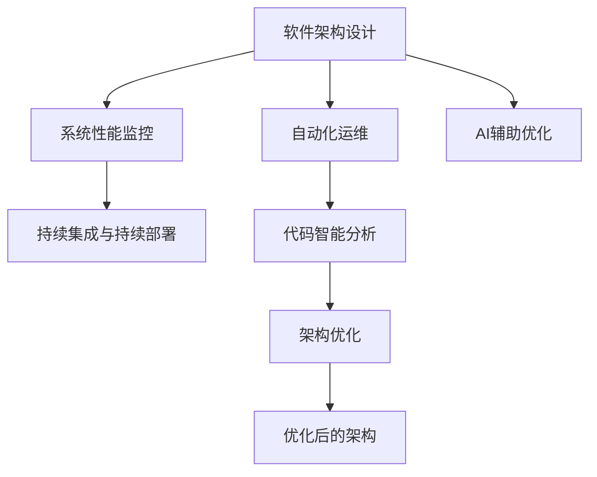

                 

# AI辅助的软件架构设计与优化

## 1. 背景介绍

### 1.1 问题由来

在当今数字化和智能化的潮流下，软件系统的规模和复杂性不断增大，导致传统的软件开发和管理方法面临巨大挑战。以微服务架构、云计算、大数据、AI等为代表的现代软件系统，不仅技术复杂度高，开发和维护成本也显著上升。因此，如何更高效、更可靠、更灵活地设计和优化软件架构，成为软件开发者的首要任务。

与此同时，AI技术的迅猛发展也为软件架构优化带来了新的机遇和挑战。通过引入AI技术，可以更精确地分析和预测软件系统的性能，自动化的运维和监控，以及基于数据驱动的持续优化，使得软件架构更加智能和高效。本文将详细介绍AI辅助的软件架构设计与优化，涵盖AI在软件架构优化中的核心概念、原理、操作步骤、应用领域及未来展望。

## 2. 核心概念与联系

### 2.1 核心概念概述

- **软件架构设计**：软件架构设计是构建软件系统的核心步骤，涉及系统的整体规划、组件划分、接口设计、数据流控制等方面。
- **AI辅助优化**：利用AI技术，如机器学习、深度学习、自然语言处理等，对软件架构进行预测、分析和优化。
- **系统性能监控**：通过实时监控系统性能指标，识别瓶颈和问题，为架构优化提供数据支撑。
- **自动化运维**：使用AI自动化工具进行系统监控、故障诊断、自动化部署等，提升运维效率和质量。
- **持续集成与持续部署**：通过自动化的构建和部署流程，加速软件迭代和优化。
- **代码智能分析**：通过AI技术对代码质量进行分析，提升开发效率和代码质量。

### 2.2 核心概念原理和架构的 Mermaid 流程图



该图展示了软件架构设计与优化的整个流程。软件架构设计完成后，通过系统性能监控和代码智能分析，识别出系统的瓶颈和问题，再通过AI辅助优化进行预测和优化。最终得到优化后的架构，并通过持续集成与持续部署进行自动化部署。

## 3. 核心算法原理 & 具体操作步骤

### 3.1 算法原理概述

AI辅助的软件架构设计与优化，核心思想是通过数据驱动、自动化和智能化的手段，对软件架构进行分析和优化。具体步骤如下：

1. **数据收集与预处理**：收集系统的运行日志、性能指标、代码质量等信息，并进行预处理，以便后续分析和建模。
2. **性能建模与分析**：通过机器学习等技术，对系统性能进行建模和分析，识别瓶颈和问题。
3. **优化策略制定**：根据性能分析结果，制定针对性的优化策略，如组件重构、缓存优化、负载均衡等。
4. **自动化运维与部署**：使用自动化工具进行系统监控、故障诊断和部署，确保优化策略的有效实施。
5. **持续集成与持续部署**：通过持续集成与持续部署，不断迭代优化软件架构。

### 3.2 算法步骤详解

1. **数据收集与预处理**
   - 收集系统运行日志、性能指标、代码质量等信息。
   - 对数据进行清洗、去重、归一化等预处理，以便后续分析和建模。

2. **性能建模与分析**
   - 选择合适的机器学习模型，如回归模型、分类模型、聚类模型等，对系统性能进行建模。
   - 使用历史数据进行模型训练和验证，评估模型的准确性和鲁棒性。

3. **优化策略制定**
   - 根据模型分析结果，识别系统的瓶颈和问题。
   - 制定针对性的优化策略，如组件重构、缓存优化、负载均衡等。

4. **自动化运维与部署**
   - 使用自动化运维工具进行系统监控、故障诊断和部署。
   - 通过持续集成与持续部署流程，确保优化策略的有效实施。

### 3.3 算法优缺点

**优点**：
- 数据驱动：通过分析系统性能数据，识别瓶颈和问题，提升优化效果。
- 自动化：使用自动化工具进行监控、故障诊断和部署，提升运维效率。
- 智能化：利用机器学习和深度学习技术，进行性能预测和优化。

**缺点**：
- 依赖数据：需要大量的运行日志和性能数据，收集和处理工作量大。
- 模型复杂：模型选择和调参需要一定的专业知识和经验。
- 部署难度：需要对现有系统进行改造，引入自动化和智能化工具。

### 3.4 算法应用领域

AI辅助的软件架构设计与优化在多个领域都有广泛应用，包括但不限于以下方面：

1. **云计算架构优化**：通过分析云平台性能数据，优化云服务配置和资源利用率。
2. **微服务架构优化**：通过分析微服务组件的性能和依赖关系，优化服务调用路径和负载均衡。
3. **大数据架构优化**：通过分析大数据系统的性能瓶颈，优化数据存储和处理流程。
4. **AI系统优化**：通过分析AI模型性能和资源消耗，优化模型训练和推理流程。
5. **桌面应用优化**：通过分析桌面应用的性能数据，优化界面设计和功能实现。

## 4. 数学模型和公式 & 详细讲解 & 举例说明

### 4.1 数学模型构建

设软件系统的性能指标为 $P$，包括响应时间、吞吐量、资源利用率等。影响系统性能的因素包括系统负载 $L$、资源配置 $C$、软件架构 $A$ 等。假设它们之间存在一定的线性或非线性关系，可以构建以下性能模型：

$$ P = f(L, C, A) $$

其中 $f$ 表示系统的性能函数，可以是线性函数或非线性函数。

### 4.2 公式推导过程

以响应时间为例子，假设响应时间 $T$ 与系统负载 $L$ 和资源配置 $C$ 存在线性关系，可以构建如下线性模型：

$$ T = aL + bC + c $$

其中 $a$、$b$、$c$ 为模型参数，可以通过历史数据进行拟合。

通过上述模型，可以预测不同负载和资源配置下的响应时间，进而识别系统的瓶颈和问题。

### 4.3 案例分析与讲解

以微服务架构为例，假设系统的响应时间 $T$ 与微服务数量 $N$ 和负载均衡算法 $E$ 存在非线性关系，可以构建如下非线性模型：

$$ T = f(N, E) $$

通过拟合模型参数 $f$，可以预测不同微服务数量和负载均衡算法下的响应时间，进而优化微服务架构和负载均衡策略。

## 5. 项目实践：代码实例和详细解释说明

### 5.1 开发环境搭建

1. **环境准备**
   - 安装 Python 3.x 环境，建议使用虚拟环境。
   - 安装必要的 Python 包，如 `numpy`、`pandas`、`scikit-learn` 等。

2. **数据准备**
   - 收集系统运行日志、性能指标、代码质量等信息，存储到数据库或文件系统中。
   - 对数据进行清洗、去重、归一化等预处理，以便后续分析和建模。

3. **模型训练与验证**
   - 选择合适的机器学习模型，如回归模型、分类模型、聚类模型等。
   - 使用历史数据进行模型训练和验证，评估模型的准确性和鲁棒性。

### 5.2 源代码详细实现

以线性模型为例，假设使用 `scikit-learn` 进行模型训练，代码实现如下：

```python
from sklearn.linear_model import LinearRegression
from sklearn.metrics import mean_squared_error

# 准备数据
X = ...  # 特征矩阵
y = ...  # 响应时间向量

# 训练模型
model = LinearRegression()
model.fit(X, y)

# 预测响应时间
X_test = ...  # 测试数据
y_pred = model.predict(X_test)

# 评估模型性能
mse = mean_squared_error(y, y_pred)
print("Mean Squared Error: {:.2f}".format(mse))
```

### 5.3 代码解读与分析

上述代码展示了使用线性回归模型进行性能预测的实现过程。具体步骤如下：
1. 准备数据：收集系统运行日志、性能指标等信息，进行预处理。
2. 模型训练：选择合适的机器学习模型，如线性回归模型，使用历史数据进行训练。
3. 预测响应时间：使用训练好的模型对新数据进行预测。
4. 评估模型性能：计算预测结果与真实值之间的均方误差，评估模型性能。

### 5.4 运行结果展示

以响应时间预测为例，可以通过绘制预测结果与实际结果的散点图，直观展示预测效果。

```python
import matplotlib.pyplot as plt

plt.scatter(y_test, y_pred)
plt.xlabel("Actual Response Time")
plt.ylabel("Predicted Response Time")
plt.title("Response Time Prediction")
plt.show()
```

## 6. 实际应用场景

### 6.1 云计算架构优化

在云计算环境中，服务器的资源配置和负载均衡直接影响系统的性能。通过AI辅助优化，可以动态调整资源配置和负载均衡策略，提升云服务的稳定性和可扩展性。

**案例**：某电商平台使用云服务，通过监控系统的响应时间和负载情况，使用 AI 模型预测未来的负载，动态调整服务器配置和负载均衡策略，提升了系统的稳定性和响应速度。

### 6.2 微服务架构优化

微服务架构通过将系统拆分为多个独立的服务，提高了系统的灵活性和可扩展性，但也增加了服务的复杂性和通信开销。通过AI辅助优化，可以优化微服务架构，提升系统性能和可靠性。

**案例**：某金融公司使用微服务架构构建了电商系统，通过监控微服务调用路径和响应时间，使用 AI 模型预测瓶颈服务，优化服务调用路径和负载均衡策略，提升了系统的稳定性和响应速度。

### 6.3 大数据架构优化

在大数据环境中，数据存储和处理流程直接影响系统的性能。通过AI辅助优化，可以优化数据存储和处理流程，提升系统的效率和可靠性。

**案例**：某电商公司使用大数据存储和处理系统，通过监控数据处理时间、资源利用率等指标，使用 AI 模型预测数据处理瓶颈，优化数据存储和处理策略，提升了系统的处理效率和资源利用率。

## 7. 工具和资源推荐

### 7.1 学习资源推荐

1. **《机器学习实战》**：李航著，详细介绍了机器学习的基础知识和常用算法。
2. **《深度学习》**：Ian Goodfellow、Yoshua Bengio 和 Aaron Courville 合著，介绍了深度学习的理论基础和应用。
3. **《TensorFlow 实战》**：陈希章著，详细介绍了 TensorFlow 框架的使用和实践。
4. **Kaggle 学习平台**：提供丰富的机器学习和深度学习竞赛数据集和代码实现，适合实践学习和进阶提升。
5. **Coursera 机器学习课程**：由斯坦福大学 Andrew Ng 教授主讲，系统介绍机器学习的基本原理和算法。

### 7.2 开发工具推荐

1. **TensorFlow**：由 Google 主导开发的深度学习框架，生产部署方便，适合大规模工程应用。
2. **PyTorch**：由 Facebook 主导开发的深度学习框架，灵活性高，适合快速迭代研究。
3. **scikit-learn**：Python 的机器学习库，包含各种常用的机器学习算法和工具。
4. **Jupyter Notebook**：开源的交互式开发环境，支持 Python 和其他语言，适合进行实验和实践。
5. **GitHub**：全球最大的代码托管平台，提供丰富的开源项目和社区支持，适合学习和交流。

### 7.3 相关论文推荐

1. **《云计算中的机器学习应用》**：Chen H 等，介绍了机器学习在云计算中的应用，包括性能优化、故障诊断等。
2. **《微服务架构的机器学习应用》**：Zhang J 等，介绍了机器学习在微服务架构中的应用，包括服务调用优化、负载均衡等。
3. **《大数据系统中的机器学习优化》**：Li Y 等，介绍了机器学习在大数据系统中的应用，包括数据存储和处理优化。

## 8. 总结：未来发展趋势与挑战

### 8.1 研究成果总结

通过 AI 辅助优化，可以在多个领域提升软件系统的性能和可靠性，优化资源配置和部署流程，提升系统的稳定性和可扩展性。AI辅助的软件架构设计与优化已经成为软件开发和运维的重要手段，得到了广泛应用。

### 8.2 未来发展趋势

未来，AI辅助的软件架构设计与优化将呈现以下几个趋势：

1. **智能预测与决策**：通过深度学习和强化学习等技术，实现更精准的性能预测和决策优化。
2. **多模态融合**：将文本、语音、图像等多模态数据融合，提升系统对复杂环境的理解和建模能力。
3. **自适应优化**：通过动态调整优化策略，适应不同场景和数据分布的变化，提升系统的自适应性。
4. **人机协同**：引入人机协同机制，提升优化决策的合理性和可靠性。
5. **模型解释与可解释性**：通过可解释性技术，提升优化模型的透明度和可理解性。

### 8.3 面临的挑战

尽管 AI 辅助的软件架构设计与优化已经取得显著进展，但仍面临以下挑战：

1. **数据质量与数据隐私**：需要大量高质量的数据，数据隐私和安全问题也需得到充分考虑。
2. **模型复杂性与可解释性**：AI 模型的复杂性和可解释性问题，需要进一步解决。
3. **技术门槛与工程实践**：AI 技术的应用需要较高的技术门槛，工程实践难度较大。
4. **系统复杂性与维护成本**：引入 AI 技术后，系统复杂性增加，维护成本上升。
5. **可靠性与稳定性**：AI 模型的鲁棒性和可靠性问题，需要进一步解决。

### 8.4 研究展望

未来，需要在以下几个方面进行深入研究：

1. **数据获取与处理**：如何获取高质量、大规模的数据，并对其进行有效的处理和清洗。
2. **模型选择与调参**：如何选择和调参合适的 AI 模型，提升模型的预测精度和鲁棒性。
3. **模型解释与可视化**：如何提升 AI 模型的可解释性和可视化能力，增强系统的透明度和可理解性。
4. **人机协同机制**：如何引入人机协同机制，提升优化决策的合理性和可靠性。
5. **系统性能优化**：如何优化系统性能和资源利用率，提升系统的稳定性和可扩展性。

通过以上研究，可以进一步推动 AI 辅助的软件架构设计与优化，为软件开发和运维带来更高效、更可靠、更智能的解决方案。

## 9. 附录：常见问题与解答

**Q1：AI辅助的软件架构设计与优化是否适用于所有应用场景？**

A：AI辅助的软件架构设计与优化在大多数应用场景中都有一定的适用性，但需要根据具体场景进行优化和调整。例如，对于需要高可靠性和高安全性的应用场景，需要考虑数据隐私和模型解释性问题。

**Q2：如何评估AI模型的预测效果？**

A：评估AI模型的预测效果通常使用以下指标：
- 均方误差（Mean Squared Error, MSE）：衡量模型预测值与实际值之间的差异。
- 平均绝对误差（Mean Absolute Error, MAE）：衡量模型预测值与实际值之间的平均差异。
- R² 系数：衡量模型预测值与实际值之间的相关性。
- 准确率（Accuracy）：衡量模型预测结果的正确率。

**Q3：如何优化AI模型的性能？**

A：优化AI模型的性能通常需要以下步骤：
- 数据预处理：对数据进行清洗、去重、归一化等预处理，以便后续分析和建模。
- 模型选择：选择合适的机器学习或深度学习模型，并根据问题进行调整。
- 参数调优：通过交叉验证等方法进行模型参数调优，提升模型预测精度。
- 特征工程：选择和构造合适的特征，提升模型的预测能力。
- 模型集成：使用模型集成技术，如 Bagging、Boosting 等，提升模型的鲁棒性和预测精度。

**Q4：AI辅助的软件架构设计与优化需要哪些资源支持？**

A：AI辅助的软件架构设计与优化需要以下资源支持：
- 高性能计算资源：如 GPU、TPU 等，用于模型训练和预测。
- 高质量数据资源：如运行日志、性能指标、代码质量等，用于模型训练和分析。
- 专业人才：具备 AI 和软件开发相关知识和技能的专业人才，用于模型的开发和优化。
- 工具和平台：如 TensorFlow、PyTorch、scikit-learn 等 AI 框架，Jupyter Notebook、GitHub 等开发和协作平台。

**Q5：AI辅助的软件架构设计与优化有哪些应用案例？**

A：AI辅助的软件架构设计与优化已经在多个领域得到应用，例如：
- 云计算架构优化：通过分析云平台性能数据，优化云服务配置和资源利用率。
- 微服务架构优化：通过分析微服务调用路径和响应时间，优化服务调用路径和负载均衡策略。
- 大数据架构优化：通过分析大数据系统的性能瓶颈，优化数据存储和处理流程。
- 桌面应用优化：通过分析桌面应用的性能数据，优化界面设计和功能实现。

---

作者：禅与计算机程序设计艺术 / Zen and the Art of Computer Programming

