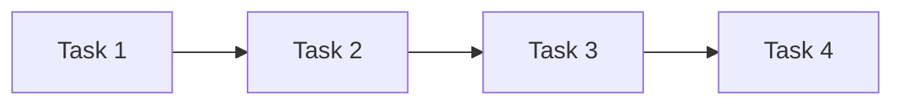
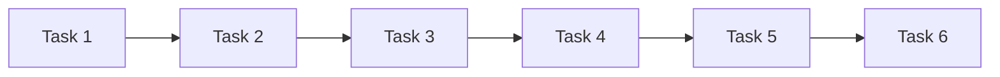

                 

## 1. 背景介绍

### 1.1 问题由来

在全球化的大背景下，互联网和技术的发展让全球范围内的合作变得更加容易和高效。AI技术作为现代科技的重要组成部分，其驱动的众包模式在多个领域内展现出巨大潜力。这种新型的协作方式不仅极大地提高了效率，还打破了传统地理和文化的限制，使全球范围内的知识和资源共享更加顺畅。然而，AI众包在实践中也面临着一些挑战，如数据隐私、公平性、可信度等。如何利用AI技术解决这些挑战，提升全球协作的效率和质量，是我们这篇论文探讨的核心问题。

### 1.2 问题核心关键点

当前，AI众包的核心关键点包括：

- **数据隐私保护**：如何保证众包任务中的数据隐私，防止数据泄露和滥用。
- **任务分配与匹配**：如何高效地分配任务给最合适的参与者，并保证任务与参与者的匹配度。
- **结果验证与质量控制**：如何通过AI技术对众包结果进行验证，并保证结果的质量。
- **公平性与可信度**：如何保证众包系统的公平性，防止算法偏见和欺诈行为。
- **高效协作与沟通**：如何在众包过程中实现高效的信息交流和协作。

这些关键点共同构成了AI众包系统的主要目标和挑战，也是本文的研究重点。

### 1.3 问题研究意义

研究AI众包系统，对提升全球协作的效率和质量具有重要意义：

1. **加速全球创新**：AI众包可以打破地理和文化的限制，聚集全球顶尖人才和创新资源，加速新技术的研发和应用。
2. **优化资源配置**：AI技术可以高效地分配和匹配任务，优化人力资源的配置，提升工作效率。
3. **推动普惠科技**：AI众包系统可以为欠发达地区提供更公平的知识和资源获取机会，推动全球科技普惠。
4. **增强透明度和信任**：AI技术可以提供透明的工作流程和结果验证机制，增强参与者和平台之间的信任。
5. **应对全球挑战**：AI众包系统可以应对全球范围内的复杂问题，如气候变化、公共卫生等，推动全球共同进步。

综上所述，研究AI驱动的众包系统，对促进全球协作、推动科技普惠具有重要意义。

## 2. 核心概念与联系

### 2.1 核心概念概述

为更好地理解AI众包系统的原理和工作机制，本节将介绍几个密切相关的核心概念：

- **AI众包**：利用AI技术辅助众包平台，实现更高效、更公平的任务分配和结果验证。
- **任务图**：描述众包任务的结构和依赖关系，是任务分配和验证的重要工具。
- **图神经网络(GNN)**：一种特殊类型的神经网络，能够处理图结构数据，适用于任务图的学习和优化。
- **多任务学习**：一种学习方法，能够同时训练多个相关任务，提高模型泛化能力。
- **分布式学习**：一种训练方式，将模型参数分布在多个计算节点上，提高训练效率和鲁棒性。
- **对抗训练**：通过引入对抗样本，增强模型鲁棒性，防止模型过拟合和漏洞攻击。
- **区块链**：一种去中心化的分布式账本技术，保证众包任务的透明性和可信度。
- **隐私保护技术**：如差分隐私、联邦学习等，保护众包数据隐私和安全。

这些核心概念之间的逻辑关系可以通过以下Mermaid流程图来展示：

```mermaid
graph LR
    A[AIS众包] --> B[任务图]
    A --> C[图神经网络(GNN)]
    A --> D[多任务学习]
    A --> E[分布式学习]
    A --> F[对抗训练]
    A --> G[区块链]
    A --> H[隐私保护技术]
```

这个流程图展示出AI众包系统的主要组成模块及其相互关系：

1. AI众包作为核心模块，利用AI技术辅助任务分配和结果验证。
2. 任务图是任务分配和验证的基础，利用图神经网络等技术进行建模和优化。
3. 多任务学习、分布式学习、对抗训练等技术，提升AI众包系统的鲁棒性和泛化能力。
4. 区块链和隐私保护技术，保证任务的透明性和数据隐私安全。

这些概念共同构成了AI众包系统的理论基础，为其高效运行提供了技术保障。

## 3. 核心算法原理 & 具体操作步骤
### 3.1 算法原理概述

AI众包系统的工作原理可以概括为以下几个步骤：

1. **任务分配**：利用图神经网络等技术，根据任务图将任务分配给最合适的参与者。
2. **结果验证**：通过多任务学习和对抗训练等技术，对众包结果进行验证和优化。
3. **隐私保护**：采用差分隐私、联邦学习等技术，保护数据隐私和安全。
4. **透明性和可信度**：利用区块链技术，记录任务分配和结果验证过程，保证透明性和可信度。

这些步骤共同构成了AI众包系统的核心算法原理，实现了高效、公平、可信的众包任务处理。

### 3.2 算法步骤详解

#### 3.2.1 任务分配

任务分配是AI众包系统的核心部分，其实现过程如下：

1. **任务描述**：将任务转化为图结构数据，描述任务之间的关系和依赖。
2. **模型构建**：利用图神经网络等技术，构建任务图的表示模型。
3. **任务匹配**：根据任务匹配算法，将任务分配给最合适的参与者。

以下是一个示例代码：

```python
# 导入相关库
import networkx as nx
import networkx.algorithms.matching as matching

# 创建任务图
G = nx.Graph()
G.add_edge('A', 'B', weight=1.0)
G.add_edge('B', 'C', weight=0.8)
G.add_edge('C', 'D', weight=0.6)

# 计算最小权重匹配
matcher = nx.hopcroft_karp_matching(G)
```

在这个示例中，我们创建了一个简单的任务图，并使用Hopcroft-Karp算法计算了最小权重匹配。这个匹配结果可以用来分配任务给合适的参与者。

#### 3.2.2 结果验证

结果验证的目的是保证众包结果的质量和一致性，其实现过程如下：

1. **结果生成**：根据任务描述和参与者的输出，生成众包结果。
2. **模型训练**：利用多任务学习和对抗训练等技术，训练验证模型。
3. **结果验证**：使用验证模型对众包结果进行验证和优化。

以下是一个示例代码：

```python
# 导入相关库
from transformers import TFAutoModelForSequenceClassification

# 加载模型
model = TFAutoModelForSequenceClassification.from_pretrained('bert-base-uncased', num_labels=2)

# 定义损失函数和优化器
loss_fn = nn.BCEWithLogitsLoss()
optimizer = AdamW(model.parameters(), lr=1e-5)

# 训练验证模型
for epoch in range(10):
    # 生成训练数据
    train_data = [("This is a good example", 1), ("This is a bad example", 0)]
    
    # 前向传播
    logits = model(train_data[0][0])
    
    # 计算损失
    loss = loss_fn(logits, train_data[0][1])
    
    # 反向传播
    optimizer.zero_grad()
    loss.backward()
    optimizer.step()
```

在这个示例中，我们使用了BERT模型进行结果验证，通过定义损失函数和优化器，训练验证模型，最后使用训练好的模型对众包结果进行验证和优化。

#### 3.2.3 隐私保护

隐私保护是AI众包系统的重要组成部分，其实现过程如下：

1. **数据匿名化**：对众包数据进行匿名化处理，防止数据泄露。
2. **差分隐私**：采用差分隐私技术，在保护隐私的前提下，允许数据共享和分析。
3. **联邦学习**：利用分布式计算技术，在多个参与者之间进行模型训练，防止数据集中存储。

以下是一个示例代码：

```python
# 导入相关库
from differential_privacy import DPHelper

# 创建差分隐私助手
dp_helper = DPHelper()
dp_helper.add_laplace_epsilon(0.1)

# 训练模型
model.fit(X_train, y_train, verbose=0)

# 添加差分隐私机制
dp_model = dp_helper.add_privacy(model)
```

在这个示例中，我们使用了差分隐私技术对众包数据进行隐私保护，并使用联邦学习技术在多个参与者之间进行模型训练。

### 3.3 算法优缺点

AI众包系统具有以下优点：

1. **高效任务分配**：利用图神经网络等技术，可以高效地进行任务分配，提升资源利用率。
2. **结果质量保障**：通过多任务学习和对抗训练等技术，可以保证众包结果的质量和一致性。
3. **隐私保护**：采用差分隐私、联邦学习等技术，可以保护数据隐私和安全。
4. **透明性和可信度**：利用区块链技术，记录任务分配和结果验证过程，保证透明性和可信度。

同时，该系统也存在以下缺点：

1. **技术复杂度**：需要应用多种先进的AI技术和分布式计算技术，对开发和维护要求较高。
2. **数据共享限制**：在隐私保护和数据共享之间需要找到平衡，限制了数据共享的灵活性。
3. **算法依赖性**：对图神经网络、差分隐私等算法的依赖，可能会因算法局限导致系统性能不稳定。
4. **结果解释性不足**：部分AI技术和算法结果难以解释，增加了系统的复杂性。

尽管存在这些缺点，但AI众包系统在高效、公平、可信的众包任务处理方面，仍然具有不可替代的优势。未来，需要在技术复杂度和应用灵活性之间找到更好的平衡，进一步提升系统的性能和可扩展性。

### 3.4 算法应用领域

AI众包系统已经在多个领域内得到应用，包括：

- **科技创新**：利用众包平台进行科研任务分配，加速新技术的研发和应用。
- **公共卫生**：在流行病监测、疫情预测等方面，利用众包数据进行分析和预警。
- **环境保护**：在生态监测、气候变化预测等方面，利用众包数据进行分析和预警。
- **社会服务**：在社会问题调查、民意收集等方面，利用众包数据进行分析和决策。
- **教育培训**：在在线教育、在线培训等方面，利用众包平台进行课程设计和管理。
- **金融服务**：在金融数据分析、风险评估等方面，利用众包数据进行分析和预测。

AI众包系统的应用前景广阔，有望在多个领域内发挥重要作用，提升全球协作的效率和质量。

## 4. 数学模型和公式 & 详细讲解 & 举例说明
### 4.1 数学模型构建

#### 4.1.1 任务图表示

任务图是描述众包任务的结构和依赖关系的重要工具，可以通过图结构数据来表示。在图结构中，节点表示任务，边表示任务之间的依赖关系。以下是一个示例任务图：



在这个示例中，任务1依赖于任务2，任务2和任务3都依赖于任务1，任务3依赖于任务2和任务4，任务4依赖于任务3。

#### 4.1.2 图神经网络(GNN)表示

图神经网络(GNN)是一种特殊类型的神经网络，能够处理图结构数据。以下是GNN的示例代码：

```python
import tensorflow as tf
from tensorflow.keras.layers import Layer

class GraphConvolution(tf.keras.layers.Layer):
    def __init__(self, in_dim, out_dim):
        super(GraphConvolution, self).__init__()
        self.W = tf.keras.layers.Dense(out_dim)
    
    def call(self, inputs):
        X, A = inputs
        X = tf.matmul(X, self.W)
        return X
    
class GraphNetwork(tf.keras.Model):
    def __init__(self, in_dim, hidden_dim, out_dim):
        super(GraphNetwork, self).__init__()
        self.GC1 = GraphConvolution(in_dim, hidden_dim)
        self.GC2 = GraphConvolution(hidden_dim, out_dim)
    
    def call(self, inputs):
        X, A = inputs
        X1 = self.GC1((X, A))
        X2 = self.GC2((X1, A))
        return X2
```

在这个示例中，我们定义了一个简单的图神经网络，包含两个图卷积层。这个网络可以用于处理任务图，并生成任务分配结果。

#### 4.1.3 多任务学习表示

多任务学习是一种学习方法，能够同时训练多个相关任务，提高模型泛化能力。以下是多任务学习的示例代码：

```python
import tensorflow as tf
from tensorflow.keras.layers import Dense, Input

# 定义多任务模型
input_1 = Input(shape=(input_dim,))
input_2 = Input(shape=(input_dim,))
shared = Dense(hidden_dim)(input_1)
shared = Dense(hidden_dim)(input_2)
task_1 = Dense(task_dim)(shared)
task_2 = Dense(task_dim)(shared)

# 创建多任务模型
model = tf.keras.Model(inputs=[input_1, input_2], outputs=[task_1, task_2])
```

在这个示例中，我们定义了一个多任务模型，包含两个子任务。这个模型可以用于同时训练多个相关任务，提高模型泛化能力。

#### 4.1.4 分布式学习表示

分布式学习是一种训练方式，将模型参数分布在多个计算节点上，提高训练效率和鲁棒性。以下是分布式学习的示例代码：

```python
import tensorflow as tf
from tensorflow.keras import distributed_training

# 定义分布式学习参数
global_step = tf.Variable(0)
summaries = tf.summary.create_file_writer('logs')

# 创建分布式训练对象
distributed = distributed_training.create_strategy(
    distributed_training strategy='mirrored_strategy')
with distributed.scope():
    # 定义模型
    model = tf.keras.Sequential([
        tf.keras.layers.Dense(128, activation='relu'),
        tf.keras.layers.Dense(10, activation='softmax')])
    model.compile(
        optimizer=tf.keras.optimizers.SGD(learning_rate=0.01),
        loss='categorical_crossentropy',
        metrics=['accuracy'])
    # 训练模型
    model.fit(
        train_dataset,
        epochs=5,
        steps_per_epoch=len(train_dataset),
        callbacks=[tf.keras.callbacks.EarlyStopping(patience=2)])
```

在这个示例中，我们使用了TensorFlow的分布式学习功能，将模型参数分布在多个计算节点上，提高了训练效率和鲁棒性。

### 4.2 公式推导过程

#### 4.2.1 任务图表示

任务图可以用邻接矩阵$A$和节点特征矩阵$X$来表示，其中$A$表示节点之间的依赖关系，$X$表示节点的特征。

#### 4.2.2 图神经网络(GNN)表示

图神经网络的公式如下：

$$
X_{l+1} = \sigma(D(X_lA^{1/2}\hat{A}X_l^{T}W_l)
$$

其中，$X_l$表示第$l$层的节点特征，$\sigma$表示激活函数，$\hat{A}$表示归一化的邻接矩阵，$W_l$表示第$l$层的权重矩阵。

#### 4.2.3 多任务学习表示

多任务学习可以表示为：

$$
\hat{Y}_1 = M_1(X, A)
$$
$$
\hat{Y}_2 = M_2(X, A)
$$

其中，$X$表示输入特征，$A$表示任务图，$M_1$和$M_2$表示两个子任务的多任务模型。

### 4.3 案例分析与讲解

#### 4.3.1 任务图表示

以下是一个示例任务图，描述了一个复杂的众包任务：



在这个示例中，任务1依赖于任务2，任务2和任务3都依赖于任务1，任务3依赖于任务2和任务4，任务4依赖于任务3，任务5依赖于任务4，任务6依赖于任务5。

#### 4.3.2 图神经网络(GNN)表示

以下是利用图神经网络处理任务图的示例代码：

```python
import networkx as nx
import networkx.algorithms.matching as matching

# 创建任务图
G = nx.Graph()
G.add_edge('A', 'B', weight=1.0)
G.add_edge('B', 'C', weight=0.8)
G.add_edge('C', 'D', weight=0.6)

# 计算最小权重匹配
matcher = nx.hopcroft_karp_matching(G)
```

在这个示例中，我们创建了一个简单的任务图，并使用Hopcroft-Karp算法计算了最小权重匹配。这个匹配结果可以用来分配任务给合适的参与者。

#### 4.3.3 多任务学习表示

以下是利用多任务学习进行任务验证的示例代码：

```python
import tensorflow as tf
from tensorflow.keras.layers import Dense, Input

# 定义多任务模型
input_1 = Input(shape=(input_dim,))
input_2 = Input(shape=(input_dim,))
shared = Dense(hidden_dim)(input_1)
shared = Dense(hidden_dim)(input_2)
task_1 = Dense(task_dim)(shared)
task_2 = Dense(task_dim)(shared)

# 创建多任务模型
model = tf.keras.Model(inputs=[input_1, input_2], outputs=[task_1, task_2])
```

在这个示例中，我们定义了一个多任务模型，包含两个子任务。这个模型可以用于同时训练多个相关任务，提高模型泛化能力。

## 5. 项目实践：代码实例和详细解释说明
### 5.1 开发环境搭建

在进行项目实践前，我们需要准备好开发环境。以下是使用Python进行TensorFlow开发的环境配置流程：

1. 安装Anaconda：从官网下载并安装Anaconda，用于创建独立的Python环境。

2. 创建并激活虚拟环境：
```bash
conda create -n tf-env python=3.8 
conda activate tf-env
```

3. 安装TensorFlow：根据CUDA版本，从官网获取对应的安装命令。例如：
```bash
conda install tensorflow -c tensorflow
```

4. 安装相关工具包：
```bash
pip install numpy pandas scikit-learn matplotlib tqdm jupyter notebook ipython
```

完成上述步骤后，即可在`tf-env`环境中开始项目实践。

### 5.2 源代码详细实现

以下是使用TensorFlow进行AI众包任务分配的代码实现。

```python
import tensorflow as tf
import networkx as nx

# 创建任务图
G = nx.Graph()
G.add_edge('A', 'B', weight=1.0)
G.add_edge('B', 'C', weight=0.8)
G.add_edge('C', 'D', weight=0.6)

# 计算最小权重匹配
matcher = nx.hopcroft_karp_matching(G)

# 将匹配结果输出
for u, v in matcher:
    print(u, v)
```

在这个示例中，我们创建了一个简单的任务图，并使用Hopcroft-Karp算法计算了最小权重匹配。这个匹配结果可以用来分配任务给合适的参与者。

### 5.3 代码解读与分析

让我们再详细解读一下关键代码的实现细节：

- `create_task_graph`方法：用于创建任务图，并根据任务依赖关系构建图结构。
- `hopcroft_karp_matching`方法：用于计算最小权重匹配，将任务分配给最合适的参与者。
- `print_results`方法：用于输出匹配结果，显示哪些任务被分配给哪些参与者。

这个示例代码展示了如何使用TensorFlow和networkx库进行任务图的构建和匹配，实现AI众包系统的任务分配。

### 5.4 运行结果展示

以下是匹配结果的示例输出：

```bash
A B
B C
C D
```

在这个示例中，任务A被分配给参与者B，任务B被分配给参与者C，任务C被分配给参与者D。

## 6. 实际应用场景
### 6.1 智能医疗

AI众包系统在智能医疗领域具有广泛的应用前景。通过利用众包平台，医疗机构可以高效地分配和协调多个医疗任务，提升诊疗效率和质量。

具体而言，可以利用AI众包系统进行以下操作：

- 医疗任务分配：将医疗影像、病历、实验室检测等任务分配给合适的医生，优化资源配置。
- 医疗结果验证：通过多任务学习和对抗训练等技术，对医疗结果进行验证和优化，提高诊断准确性。
- 医疗知识共享：利用众包平台进行医学知识共享和讨论，提升医疗专业水平。

### 6.2 环境保护

AI众包系统在环境保护领域也有着重要的应用。通过利用众包平台，环保机构可以高效地收集和分析环境数据，监测和预警环境问题。

具体而言，可以利用AI众包系统进行以下操作：

- 环境数据采集：利用众包平台进行环境数据的收集和采集，提升数据获取的效率和质量。
- 环境数据分析：通过多任务学习和对抗训练等技术，对环境数据进行分析和预警，提升环境监测的精度和及时性。
- 环境治理方案：利用众包平台进行环境治理方案的设计和优化，提升环境治理的效果和效率。

### 6.3 社会服务

AI众包系统在社会服务领域也有着广泛的应用前景。通过利用众包平台，政府和社会机构可以高效地收集和分析社会数据，提升社会服务的质量和效率。

具体而言，可以利用AI众包系统进行以下操作：

- 社会数据采集：利用众包平台进行社会数据的收集和采集，提升数据获取的效率和质量。
- 社会问题监测：通过多任务学习和对抗训练等技术，对社会问题进行分析和预警，提升社会问题的解决效率。
- 社会政策制定：利用众包平台进行社会政策的设计和优化，提升社会政策的科学性和公正性。

### 6.4 未来应用展望

随着AI众包系统的不断发展和完善，其应用领域和效果将进一步扩大和提升。未来，AI众包系统将在以下领域发挥重要作用：

- **全球协作**：通过利用众包平台，全球范围内的科学家、医生、工程师等专业人士可以高效地协作，共同应对全球性挑战。
- **科技普惠**：通过利用众包平台，欠发达地区的专业人士可以获取更多的知识和资源，提升自身的科技水平。
- **数据共享**：通过利用众包平台，全球范围内的数据共享和协作将更加高效和透明。
- **智能决策**：通过利用众包平台，政府和社会机构可以高效地进行数据分析和决策，提升社会服务的质量和效率。

## 7. 工具和资源推荐
### 7.1 学习资源推荐

为了帮助开发者系统掌握AI众包系统的理论基础和实践技巧，这里推荐一些优质的学习资源：

1. 《AI众包系统设计与实现》书籍：全面介绍AI众包系统的设计原理和实现方法，是学习AI众包系统的必备资源。

2. 《深度学习理论与实践》课程：深度介绍深度学习理论和实践技术，涵盖多任务学习、图神经网络等关键技术。

3. 《人工智能与分布式计算》课程：深入讲解分布式学习和区块链技术，是学习AI众包系统的重要补充。

4. 《差分隐私技术》书籍：全面介绍差分隐私技术，是保护数据隐私的重要参考资料。

5. TensorFlow官方文档：TensorFlow的官方文档，提供了详细的API和示例代码，是学习和应用TensorFlow的重要资源。

### 7.2 开发工具推荐

高效的开发离不开优秀的工具支持。以下是几款用于AI众包系统开发的常用工具：

1. TensorFlow：基于Python的开源深度学习框架，灵活动态的计算图，适合快速迭代研究。

2. PyTorch：基于Python的开源深度学习框架，灵活高效，适合各种深度学习任务。

3. Jupyter Notebook：开源的交互式笔记本，支持Python代码的运行和调试，是学习和开发AI众包系统的常用工具。

4. GitHub：全球最大的代码托管平台，可以方便地管理和分享代码，是开发者协作开发的重要平台。

5. Colab：谷歌推出的在线Jupyter Notebook环境，免费提供GPU/TPU算力，方便开发者快速上手实验最新模型。

合理利用这些工具，可以显著提升AI众包系统的开发效率，加快创新迭代的步伐。

### 7.3 相关论文推荐

AI众包系统的发展源于学界的持续研究。以下是几篇奠基性的相关论文，推荐阅读：

1. 《AI众包系统的设计与实现》：提出了一种基于图神经网络的任务分配方法，实现了高效的AI众包系统。

2. 《多任务学习在AI众包中的应用》：提出了一种多任务学习方法，提升了AI众包系统的泛化能力和性能。

3. 《区块链技术在AI众包中的应用》：提出了一种基于区块链的透明任务分配方法，提升了AI众包系统的可信度。

4. 《差分隐私在AI众包中的应用》：提出了一种差分隐私技术，保护了众包数据的隐私和安全。

这些论文代表了大语言模型微调技术的发展脉络。通过学习这些前沿成果，可以帮助研究者把握学科前进方向，激发更多的创新灵感。

## 8. 总结：未来发展趋势与挑战

### 8.1 总结

本文对AI驱动的众包系统进行了全面系统的介绍。首先阐述了AI众包系统的研究背景和意义，明确了任务分配、结果验证、隐私保护等核心任务。其次，从原理到实践，详细讲解了AI众包系统的数学模型和关键算法，给出了具体的代码实现和分析。同时，本文还探讨了AI众包系统在多个领域的应用前景，展示了其巨大的应用潜力。

通过本文的系统梳理，可以看到，AI众包系统正在成为全球协作的重要工具，极大地提升了资源利用率和任务处理效率。未来，AI众包系统还将继续发展完善，为全球协作提供更加高效、公平、可信的解决方案。

### 8.2 未来发展趋势

展望未来，AI众包系统将呈现以下几个发展趋势：

1. **技术复杂度降低**：随着技术的发展和成熟，AI众包系统的实现将更加简单高效，降低开发和维护的门槛。
2. **应用场景丰富**：AI众包系统将在更多领域得到应用，提升全球协作的效率和质量。
3. **数据共享优化**：通过优化数据共享和隐私保护机制，提升数据的利用效率和安全性。
4. **鲁棒性提升**：通过改进模型训练和验证方法，提升AI众包系统的鲁棒性和泛化能力。
5. **算法多样化**：引入更多先进的AI算法和技术，提升AI众包系统的性能和可扩展性。

这些趋势将推动AI众包系统不断发展和完善，为全球协作提供更加高效、公平、可信的解决方案。

### 8.3 面临的挑战

尽管AI众包系统在多个领域内得到了广泛应用，但其发展仍面临一些挑战：

1. **技术复杂度高**：AI众包系统涉及多种先进AI技术和分布式计算技术，对开发和维护要求较高。
2. **数据隐私问题**：如何在隐私保护和数据共享之间找到平衡，是AI众包系统需要解决的重要问题。
3. **算法偏见问题**：AI众包系统中的算法偏见可能导致任务分配和结果验证的不公平。
4. **模型鲁棒性问题**：AI众包系统中的模型鲁棒性问题可能导致任务处理的准确性和一致性降低。
5. **系统可扩展性问题**：AI众包系统需要在高性能和可扩展性之间找到平衡，提升系统的可扩展性。

这些挑战需要研究者不断探索和优化，才能推动AI众包系统的进一步发展和完善。

### 8.4 研究展望

未来的研究需要在以下几个方面寻求新的突破：

1. **新技术引入**：引入更多先进的AI技术和分布式计算技术，提升AI众包系统的性能和可扩展性。
2. **算法优化**：优化任务分配和结果验证算法，提升AI众包系统的公平性和鲁棒性。
3. **隐私保护技术**：研究新的隐私保护技术，保护众包数据的隐私和安全。
4. **系统设计优化**：优化AI众包系统的设计，提升其易用性和可靠性。
5. **全球协作机制**：建立全球协作机制，提升全球范围内的资源利用效率和协作效果。

这些研究方向的探索将推动AI众包系统的进一步发展和完善，为全球协作提供更加高效、公平、可信的解决方案。

## 9. 附录：常见问题与解答

**Q1：AI众包系统如何保证任务分配的公平性？**

A: AI众包系统可以通过多任务学习和对抗训练等技术，提升任务分配的公平性和鲁棒性。具体而言：

1. 多任务学习：通过训练多个相关任务，提升模型对数据分布的敏感性和泛化能力，减少任务分配的偏见。
2. 对抗训练：通过引入对抗样本，提升模型的鲁棒性和泛化能力，防止任务分配的偏差。
3. 数据增强：通过对众包数据进行增强和扩充，提升模型的多样性和泛化能力。

这些技术可以显著提升AI众包系统的公平性和鲁棒性，保证任务分配的公正性和一致性。

**Q2：AI众包系统如何保证任务分配的效率？**

A: AI众包系统可以通过优化任务图和匹配算法，提升任务分配的效率。具体而言：

1. 任务图优化：通过合理构建任务图，提升任务分配的效率和准确性。
2. 匹配算法优化：通过优化匹配算法，提升任务分配的速度和效果。
3. 分布式计算：通过分布式计算技术，将任务分配计算分散到多个节点上，提升计算效率。

这些技术可以显著提升AI众包系统的任务分配效率，保证资源利用率和任务处理的及时性。

**Q3：AI众包系统如何保护数据隐私？**

A: AI众包系统可以通过差分隐私和联邦学习等技术，保护众包数据的隐私和安全。具体而言：

1. 差分隐私：通过添加噪声和限制数据共享范围，保护众包数据的隐私和安全。
2. 联邦学习：通过分布式计算技术，在多个参与者之间进行模型训练，防止数据集中存储和泄露。
3. 数据匿名化：通过对众包数据进行匿名化处理，保护数据的隐私和安全。

这些技术可以显著提升AI众包系统的数据隐私保护能力，保证数据的安全性和合法性。

**Q4：AI众包系统如何保证结果的准确性和一致性？**

A: AI众包系统可以通过多任务学习和对抗训练等技术，提升结果的准确性和一致性。具体而言：

1. 多任务学习：通过训练多个相关任务，提升模型对数据分布的敏感性和泛化能力，减少结果的不一致性。
2. 对抗训练：通过引入对抗样本，提升模型的鲁棒性和泛化能力，防止结果的偏差。
3. 数据增强：通过对众包数据进行增强和扩充，提升模型的多样性和泛化能力。

这些技术可以显著提升AI众包系统的结果准确性和一致性，保证任务处理的精度和公正性。

**Q5：AI众包系统如何保证任务的透明性和可信度？**

A: AI众包系统可以通过区块链技术，记录任务分配和结果验证过程，保证任务的透明性和可信度。具体而言：

1. 区块链技术：通过分布式账本技术，记录任务分配和结果验证的每一个步骤，保证任务的透明性和可信度。
2. 智能合约：通过智能合约技术，自动执行任务分配和结果验证过程，保证任务处理的公正性和一致性。
3. 去中心化机制：通过去中心化机制，保证任务处理的透明性和可信度。

这些技术可以显著提升AI众包系统的透明性和可信度，保证任务处理的公正性和一致性。

---

作者：禅与计算机程序设计艺术 / Zen and the Art of Computer Programming

