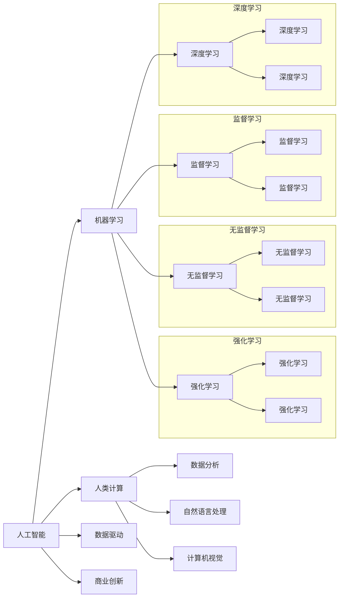

                 

# AI驱动的创新：人类计算在商业中的价值

> 关键词：人工智能, 人类计算, 商业创新, 计算能力, 数据驱动, 深度学习

## 1. 背景介绍

### 1.1 问题由来
进入21世纪以来，人类社会经历了前所未有的数字化浪潮，数据成为了驱动经济增长和社会进步的重要资产。与此同时，人工智能（AI）技术在机器学习、深度学习、自然语言处理、计算机视觉等领域取得了显著突破。这些进展不仅改变了信息处理的方式，还重塑了产业经济的结构，催生了大量新型商业模式和服务。

### 1.2 问题核心关键点
本文聚焦于AI驱动的创新，特别强调人类计算在商业领域中的价值。我们认为，AI技术通过赋予人类新的计算能力，极大地拓展了商业创新的边界，为企业家、创业者提供了前所未有的机遇。接下来，我们将从核心概念、算法原理、具体应用等角度，系统阐述AI驱动创新背后的逻辑和机遇。

## 2. 核心概念与联系

### 2.1 核心概念概述

为了更好地理解AI驱动创新的本质，我们先介绍几个核心概念：

- **人工智能（AI）**：通过模拟人类智能，使计算机具备学习、推理、感知、决策等能力。其核心在于机器学习和深度学习技术。
- **人类计算（Human Computation）**：利用人类智能，尤其是在创意、判断、情感处理等非结构化数据处理领域，与计算机算力相结合，实现更高效、更智能的商业创新。
- **数据驱动（Data-Driven）**：通过收集、分析、应用大规模数据，驱动商业决策和创新。
- **深度学习（Deep Learning）**：一种基于神经网络的机器学习技术，通过多层非线性处理，能够学习高维数据的复杂特征。

这些概念之间的联系紧密，共同构成了AI驱动创新的理论基础和实现路径。

### 2.2 核心概念原理和架构的 Mermaid 流程图



这个流程图展示了AI各子领域之间的联系，以及它们如何共同作用于商业创新：

1. 人工智能由机器学习、深度学习、无监督学习和强化学习等子领域组成。
2. 深度学习通过神经网络结构学习高维数据特征。
3. 人类计算与数据分析、自然语言处理、计算机视觉等技术相结合，提升非结构化数据的处理能力。
4. 数据驱动通过大规模数据分析，为商业创新提供决策依据。
5. 商业创新则利用上述技术和数据，创造新的商业模式和服务。

## 3. 核心算法原理 & 具体操作步骤

### 3.1 算法原理概述

AI驱动的商业创新，本质上是通过智能算法和大数据技术，提升人类在计算和决策上的能力。其核心算法包括但不限于：

- **监督学习（Supervised Learning）**：通过标注数据，训练模型学习输入和输出之间的映射关系。广泛应用于分类、回归、预测等任务。
- **无监督学习（Unsupervised Learning）**：不依赖标注数据，通过聚类、降维等技术发现数据的内在结构。
- **深度学习（Deep Learning）**：利用多层神经网络，自动学习数据特征，解决复杂模式识别和预测问题。
- **强化学习（Reinforcement Learning）**：通过奖励和惩罚机制，训练模型在动态环境中做出最优决策。

这些算法通过复杂的数据处理和模型优化，极大地扩展了人类的计算和决策能力。

### 3.2 算法步骤详解

下面详细介绍AI驱动创新中几个典型的算法步骤：

**Step 1: 数据收集与预处理**
- 收集与商业创新相关的各类数据，如消费者行为、市场趋势、社交媒体信息等。
- 对数据进行清洗、去重、归一化等预处理操作，确保数据质量。

**Step 2: 模型设计与训练**
- 根据商业创新需求，选择合适的算法模型，设计输入特征和输出目标。
- 利用标注数据或无标注数据，训练模型，调整超参数，优化模型性能。

**Step 3: 模型评估与优化**
- 在验证集上评估模型性能，调整模型结构和参数。
- 利用交叉验证等技术，确保模型泛化能力。

**Step 4: 模型应用与迭代**
- 将训练好的模型应用到实际商业环境中，进行业务创新。
- 根据反馈数据，不断迭代优化模型，提高创新效果。

### 3.3 算法优缺点

AI驱动创新的算法具备以下优点：

1. **高效性**：自动化数据处理和模型训练，极大提升了效率，缩短了创新周期。
2. **准确性**：通过复杂算法，提高决策和预测的准确性，降低风险。
3. **可扩展性**：算法可以并行计算，处理大规模数据，支持复杂场景的创新需求。

但同时也存在一些局限性：

1. **数据依赖**：算法需要大量高质量数据，数据获取和处理成本高。
2. **模型复杂性**：复杂算法对计算资源和专业知识要求高。
3. **解释性不足**：黑盒模型难以解释其决策过程，影响商业决策的透明度。
4. **伦理风险**：数据隐私和安全问题，模型偏见和歧视风险。

### 3.4 算法应用领域

AI驱动的创新已广泛应用于多个领域，以下是几个典型案例：

1. **电商推荐系统**：利用用户行为数据和商品属性，通过深度学习模型推荐个性化商品，提升用户体验和销售额。
2. **金融风险管理**：通过分析交易数据和市场趋势，利用机器学习模型预测风险，优化投资策略。
3. **智能客服**：结合自然语言处理和机器学习，自动回答客户咨询，提升服务效率和质量。
4. **健康医疗**：利用医疗数据和图像识别技术，辅助医生诊断和治疗，提升医疗服务水平。
5. **智慧城市**：通过传感器数据和智能算法，优化交通、环境、能源等城市管理，提高生活质量。

## 4. 数学模型和公式 & 详细讲解 & 举例说明

### 4.1 数学模型构建

下面通过一个简单的电商推荐系统为例，说明其数学模型构建过程。

设有一个电商网站，有 $N$ 个商品，每个商品有 $d$ 个属性特征。用户对商品 $i$ 的评分记为 $r_i$。推荐系统的目标是为每个用户推荐 $k$ 个评分最高的商品。

设推荐系统的模型为 $M(\cdot)$，输入为 $x \in \mathbb{R}^d$，输出为 $y \in \mathbb{R}^k$，其中 $y_j$ 表示商品 $j$ 的推荐评分。推荐系统的损失函数为均方误差：

$$
L(r, M) = \frac{1}{N} \sum_{i=1}^N (r_i - y_i)^2
$$

### 4.2 公式推导过程

上述模型的最小化问题可以通过梯度下降算法求解。设优化目标函数为 $F(x) = \frac{1}{2}L(r, M(x))$，则梯度下降的更新公式为：

$$
x \leftarrow x - \eta \nabla_{x}F(x)
$$

其中 $\eta$ 为学习率。

### 4.3 案例分析与讲解

以电商推荐系统为例，分析实际应用中的关键问题：

1. **特征工程**：选择和提取对用户评分有影响的商品属性，构建输入特征。
2. **模型选择**：选择深度学习模型（如神经网络、RNN、CNN），结合业务需求进行优化。
3. **数据量**：确保训练集和测试集有足够样本，避免过拟合。
4. **算法调参**：调整学习率、批大小、正则化参数等，优化模型性能。

## 5. 项目实践：代码实例和详细解释说明

### 5.1 开发环境搭建

在进行AI驱动创新项目开发前，需要搭建合适的开发环境。以下是一个典型的Python开发环境配置步骤：

1. 安装Python：从官网下载安装最新版本的Python，确保版本稳定。
2. 安装相关库：使用pip安装必要的库，如NumPy、Pandas、Scikit-Learn、TensorFlow等。
3. 设置虚拟环境：创建虚拟Python环境，隔离项目依赖，便于管理和维护。
4. 配置开发工具：安装PyCharm、Jupyter Notebook等开发工具，提高开发效率。

### 5.2 源代码详细实现

下面以电商推荐系统为例，展示Python代码实现：

```python
import pandas as pd
import numpy as np
from sklearn.model_selection import train_test_split
from sklearn.metrics import mean_squared_error
from tensorflow.keras.models import Sequential
from tensorflow.keras.layers import Dense, Dropout
from tensorflow.keras.optimizers import Adam

# 数据加载
data = pd.read_csv('items.csv')
items = data[['item_id', 'attributes']]

# 特征工程
# 假设属性值已经进行编码处理
items_encoded = pd.get_dummies(items, columns=['attribute_1', 'attribute_2'], prefix='attribute_')
target = data['rating']

# 数据切分
X_train, X_test, y_train, y_test = train_test_split(items_encoded, target, test_size=0.2, random_state=42)

# 模型构建
model = Sequential()
model.add(Dense(32, input_dim=X_train.shape[1], activation='relu'))
model.add(Dropout(0.5))
model.add(Dense(16, activation='relu'))
model.add(Dense(1, activation='linear'))

# 模型编译
model.compile(loss='mse', optimizer=Adam(lr=0.01))

# 模型训练
model.fit(X_train, y_train, epochs=50, batch_size=32, validation_data=(X_test, y_test))

# 模型评估
y_pred = model.predict(X_test)
mse = mean_squared_error(y_test, y_pred)
print(f"均方误差: {mse:.4f}")
```

### 5.3 代码解读与分析

以上代码实现了一个简单的电商推荐系统模型。关键步骤如下：

1. **数据加载**：从CSV文件中加载商品数据，并进行特征工程处理。
2. **数据切分**：将数据集分为训练集和测试集，进行交叉验证。
3. **模型构建**：使用Keras框架构建深度学习模型，包括全连接层和Dropout层。
4. **模型编译**：设置损失函数为均方误差，使用Adam优化器。
5. **模型训练**：在训练集上训练模型，验证集上进行评估。
6. **模型评估**：使用测试集评估模型性能，输出均方误差。

## 6. 实际应用场景

### 6.4 未来应用展望

AI驱动的创新在未来有着广阔的应用前景，以下是几个主要方向：

1. **智能制造**：通过机器视觉和机器学习，优化生产流程，提升产品质量和效率。
2. **智慧农业**：利用传感器数据和深度学习，优化农业生产决策，提高资源利用率。
3. **个性化教育**：结合学习行为数据和智能算法，提供个性化学习推荐，提升教育效果。
4. **自动驾驶**：通过图像识别和自然语言处理，实现安全可靠的自动驾驶技术。
5. **智能家居**：结合物联网和机器学习，实现个性化家居场景，提高生活便利性。

## 7. 工具和资源推荐

### 7.1 学习资源推荐

为帮助读者系统掌握AI驱动创新的理论和方法，以下是一些推荐的学习资源：

1. **《深度学习》（Deep Learning）**：Ian Goodfellow等人著，详细介绍了深度学习的基本原理和应用。
2. **《机器学习实战》（Machine Learning in Action）**：Peter Harrington著，通过实际案例讲解机器学习算法。
3. **Coursera《深度学习专项课程》**：由Andrew Ng主讲的在线课程，深入浅出地介绍了深度学习理论和实践。
4. **Kaggle数据科学竞赛**：提供大量实际数据集和比赛任务，锻炼算法应用能力。
5. **GitHub开源项目**：许多优秀的AI驱动创新项目，如TensorFlow、PyTorch等，提供了丰富的代码示例和资源。

### 7.2 开发工具推荐

开发AI驱动创新项目，需要一些高效的开发工具，以下是一些推荐：

1. **PyTorch**：一个开源的机器学习库，支持动态计算图和丰富的深度学习框架。
2. **TensorFlow**：一个由Google开发的开源机器学习库，支持分布式计算和多种算法模型。
3. **Jupyter Notebook**：一个交互式的数据科学开发环境，支持Python、R等多种语言，便于实验和协作。
4. **PyCharm**：一个Python IDE，支持智能代码补全、调试和版本控制等功能。
5. **Git**：版本控制系统，便于团队协作和代码管理。

### 7.3 相关论文推荐

为帮助读者了解AI驱动创新的最新进展，以下是一些推荐的相关论文：

1. **《深度学习》（Deep Learning）**：Ian Goodfellow等人著，详细介绍了深度学习的基本原理和应用。
2. **《神经网络与深度学习》（Neural Networks and Deep Learning）**：Michael Nielsen著，介绍了神经网络和深度学习的理论和实现。
3. **《自然语言处理综论》（Speech and Language Processing）**：Daniel Jurafsky和James H. Martin著，涵盖了自然语言处理的基本概念和技术。

## 8. 总结：未来发展趋势与挑战

### 8.1 研究成果总结

AI驱动的创新在过去十年间取得了显著进展，广泛应用于各个领域，带来了巨大的经济效益和社会价值。主要研究成果包括：

1. **深度学习算法**：深度神经网络在图像识别、语音识别、自然语言处理等任务上取得了突破性进展。
2. **数据处理技术**：大规模数据处理和分析技术的发展，为AI驱动创新提供了数据支持。
3. **智能系统应用**：AI技术在电商、金融、医疗、智能制造等领域的应用，显著提升了业务效率和用户体验。

### 8.2 未来发展趋势

展望未来，AI驱动的创新将呈现以下几个趋势：

1. **多模态融合**：结合图像、视频、声音等多种模态数据，提升智能系统的感知和理解能力。
2. **自监督学习**：通过无监督学习技术，自动生成更多标注数据，降低对标注数据的依赖。
3. **联邦学习**：通过分布式计算，保护数据隐私，提升模型泛化能力。
4. **边缘计算**：将AI算法部署到边缘设备上，实现低延迟、高效率的智能应用。
5. **伦理和可解释性**：注重AI系统的透明性和可解释性，提升用户信任和接受度。

### 8.3 面临的挑战

尽管AI驱动的创新前景广阔，但也面临着一些挑战：

1. **数据隐私和安全**：大规模数据处理和共享可能带来数据隐私和安全风险。
2. **算法偏见和歧视**：AI系统可能存在偏见和歧视问题，需要建立严格的算法审查机制。
3. **计算资源需求**：AI驱动创新需要大量的计算资源，如何提高计算效率是一个重要问题。
4. **模型复杂性**：复杂的AI模型需要高水平的专业知识，增加了应用门槛。
5. **伦理和法律问题**：AI技术的应用可能带来新的伦理和法律问题，需要建立相应的规范和标准。

### 8.4 研究展望

未来，AI驱动的创新需要在多个方面进行深入研究：

1. **数据隐私保护**：研究如何在保护数据隐私的同时，提升模型的效果。
2. **模型透明性和可解释性**：提高AI系统的透明性和可解释性，增加用户信任。
3. **多模态融合技术**：开发更高效的多模态融合算法，提升智能系统的感知能力。
4. **联邦学习算法**：研究联邦学习算法，提升模型的泛化能力和隐私保护水平。
5. **伦理和法律框架**：建立AI技术的伦理和法律框架，保障其应用合法合规。

## 9. 附录：常见问题与解答

### Q1: AI驱动创新是否适用于所有行业？

A: AI驱动创新在多个行业都展现出巨大潜力，包括但不限于金融、制造、医疗、教育等。尽管AI技术在不同行业的落地方式和应用场景有所不同，但其核心原理和基本方法可以跨行业适用。

### Q2: AI驱动创新需要哪些数据？

A: AI驱动创新需要大量的高质量数据，包括结构化数据和非结构化数据。结构化数据如交易记录、用户行为等，非结构化数据如文本、图像、声音等。数据质量和多样性对于AI系统的性能和应用效果至关重要。

### Q3: 如何评估AI驱动创新的效果？

A: AI驱动创新的效果评估需要结合业务目标和应用场景。常用的评估指标包括准确率、召回率、F1分数、均方误差、ROI等。通过评估，可以了解模型在不同场景下的表现，并进行相应的优化。

### Q4: 如何应对AI系统的偏见和歧视？

A: 应对AI系统偏见和歧视的方法包括：

1. 数据清洗：清洗和处理数据，减少偏见和歧视的影响。
2. 算法设计：设计公平性的评估指标，优化算法模型。
3. 监督审查：建立监督审查机制，定期审查和修正模型。
4. 法律合规：遵守相关法律和伦理规范，确保AI系统应用合法合规。

通过以上措施，可以最大限度地减少AI系统的偏见和歧视，保障其公正性和可信度。

---

作者：禅与计算机程序设计艺术 / Zen and the Art of Computer Programming

