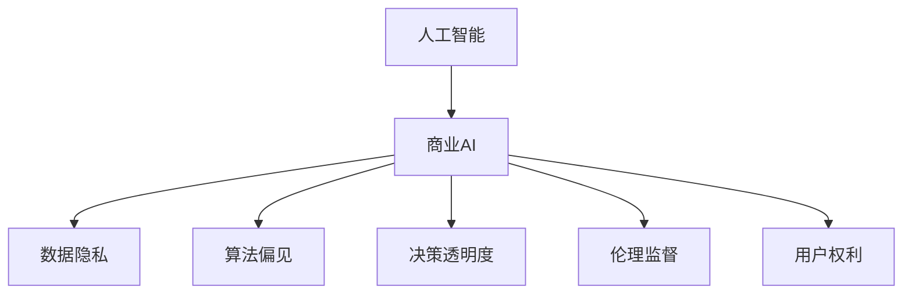

                 

# AI驱动的创新：人类计算在商业中的道德考虑因素

## 1. 背景介绍

### 1.1 问题由来
随着人工智能(AI)技术的飞速发展，其在商业应用中的深度和广度不断拓展，为各行各业带来了前所未有的创新动力。然而，这一过程中也涌现出诸多伦理道德问题，这些问题关系到AI应用的公平性、透明性、隐私保护等方面，对社会发展和人类福祉具有深远影响。

AI技术在商业中的广泛应用，例如自动化生产、个性化推荐、智能客服等，极大地提升了效率和用户体验。但同时，也带来了数据隐私侵犯、算法偏见、决策透明性不足等道德风险。

### 1.2 问题核心关键点
商业环境中，AI的道德考虑主要涉及以下几个关键点：
1. 数据隐私保护：如何在商业应用中合理收集、使用和管理用户数据，避免隐私泄露和滥用。
2. 算法偏见：AI模型可能因训练数据偏差而产生偏见，导致歧视性决策，损害部分群体的权益。
3. 决策透明度：AI决策的内部机制是否可解释，是否容易被人理解，以避免"黑箱"决策造成不公。
4. 伦理监督：在AI应用过程中如何引入伦理监督机制，确保应用符合人类价值观和社会规范。
5. 用户权利保护：确保AI系统不会侵犯用户知情权、选择权和修改权，提升用户对AI决策的接受度和信任度。

### 1.3 问题研究意义
研究AI在商业中的道德考虑，对于构建公平、透明、安全的AI应用体系，保障用户权益，促进AI技术健康发展具有重要意义：

1. 提升商业AI应用的道德规范性：明确AI应用的伦理标准和合规要求，避免技术滥用，提升公众对AI的信任度。
2. 促进AI技术的有序发展：通过伦理约束，确保AI技术的研究和应用在合法合规的框架下进行，避免技术失范导致社会问题。
3. 增强用户隐私保护：通过合理的隐私保护措施，防止商业AI应用中的数据滥用和隐私泄露，保护用户利益。
4. 避免算法偏见和歧视：通过引入公平性约束，确保AI模型在决策过程中对各群体的公正对待，促进社会公平。
5. 提升决策透明度和可解释性：通过公开透明的决策过程，增强用户对AI系统的信任感，提升系统可解释性。

## 2. 核心概念与联系

### 2.1 核心概念概述

为更好地理解AI在商业应用中的道德考虑因素，本节将介绍几个关键概念及其相互联系：

- **人工智能(AI)**：使用算法和计算能力来模拟人类智能行为的技术，包括感知、学习、推理、决策等方面。
- **商业AI**：在商业环境中应用AI技术，以提升效率、降低成本、改善用户体验等。
- **数据隐私**：用户个人信息的保护，确保数据不被未经授权的收集、存储、处理和使用。
- **算法偏见**：因训练数据或模型设计缺陷导致AI模型产生歧视性决策的现象。
- **决策透明度**：AI决策过程的可解释性和可理解性，便于用户和监管机构进行监督和审查。
- **伦理监督**：在AI应用过程中引入伦理和法律规范，确保应用符合社会道德标准。
- **用户权利**：用户在使用AI应用时享有的知情权、选择权、修改权等。

这些核心概念通过以下Mermaid流程图展示其相互关系：



该流程图展示了AI技术在商业应用中与多个伦理道德问题之间的紧密联系。

## 3. 核心算法原理 & 具体操作步骤
### 3.1 算法原理概述

商业环境中，AI的道德考虑主要涉及数据隐私保护、算法偏见检测与纠正、决策透明度提升、伦理监督机制的引入以及用户权利保护等方面。核心算法原理包括以下几个方面：

- **数据隐私保护算法**：通过差分隐私、联邦学习等技术，保护用户数据隐私，防止数据滥用。
- **算法偏见检测与纠正算法**：通过公平性检测、偏见校正等算法，识别和纠正AI模型中的偏见，确保模型决策的公正性。
- **决策透明度提升算法**：通过可解释性生成、模型可视化等技术，提升AI决策过程的可解释性和透明度。
- **伦理监督机制**：引入伦理审查、合规评估等机制，确保AI应用符合道德标准和法律法规。
- **用户权利保护算法**：通过权利声明、隐私协议等措施，确保用户在使用AI服务时享有知情权、选择权和修改权。

### 3.2 算法步骤详解

1. **数据隐私保护**
    - **差分隐私**：在数据收集和处理过程中，对个体数据进行扰动，使得单个数据点无法被反向推断。具体步骤包括：
      1. 定义隐私预算ε
      2. 确定扰动函数和分布
      3. 应用扰动函数对数据进行处理
    - **联邦学习**：在分布式环境中，多个本地模型共享模型参数更新，保护本地数据隐私。具体步骤包括：
      1. 设计分布式优化算法
      2. 本地模型更新
      3. 模型聚合与参数共享

2. **算法偏见检测与纠正**
    - **公平性检测算法**：通过统计分析和模型诊断，识别模型中的偏见和歧视。具体步骤包括：
      1. 收集多样化的数据集
      2. 计算各类指标（如性别、年龄、种族等）的误差率
      3. 分析偏见来源和影响
    - **偏见校正算法**：调整模型参数，减少或消除偏见。具体步骤包括：
      1. 定义偏见度量
      2. 调整模型结构或参数
      3. 重新训练和测试模型

3. **决策透明度提升**
    - **可解释性生成算法**：通过LIME、SHAP等工具，生成对AI决策的解释。具体步骤包括：
      1. 选择解释方法
      2. 收集输入和输出样本
      3. 生成解释性模型或特征权重
    - **模型可视化算法**：通过可视化技术展示模型内部结构和决策路径。具体步骤包括：
      1. 选择合适的可视化工具
      2. 输入样本的选择和处理
      3. 生成可视化图表或交互式界面

4. **伦理监督机制**
    - **伦理审查**：在AI系统开发和部署前，进行伦理评估，确保符合道德标准。具体步骤包括：
      1. 制定伦理审查标准
      2. 组建伦理审查委员会
      3. 审查和评估系统功能
    - **合规评估**：定期对AI系统进行合规检查，确保符合法律法规要求。具体步骤包括：
      1. 定义合规指标
      2. 定期进行合规审计
      3. 提出改进建议和措施

5. **用户权利保护**
    - **权利声明**：制定和公开AI系统的用户权利声明，确保用户知情。具体步骤包括：
      1. 编写权利声明文档
      2. 发布和推广声明
    - **隐私协议**：制定和实施隐私保护协议，保护用户隐私权。具体步骤包括：
      1. 设计隐私协议条款
      2. 用户同意和授权
      3. 隐私保护措施的实施

### 3.3 算法优缺点

商业AI在道德考虑方面面临的优点和缺点如下：

**优点**：
- **提升效率和用户体验**：AI技术的应用可以显著提高商业效率，改善用户体验，创造新的商业机会。
- **支持个性化服务**：AI系统能够根据用户偏好和行为进行个性化推荐，增强用户粘性。
- **降低运营成本**：自动化和智能化管理可以显著降低人工成本，提高企业竞争力。

**缺点**：
- **数据隐私风险**：大量数据收集和使用可能带来隐私泄露风险，侵犯用户隐私权。
- **算法偏见和歧视**：AI模型可能因为数据偏差而产生歧视性决策，损害用户权益。
- **决策透明度不足**：复杂的AI模型往往难以解释其内部决策机制，影响用户信任和接受度。
- **伦理监管难度大**：AI系统复杂性高，导致伦理监管和合规评估难度增大。
- **用户权利保护挑战**：用户在使用AI系统时享有的权利缺乏明确规定，保护难度大。

### 3.4 算法应用领域

AI在商业中的道德考虑，广泛应用于以下几个领域：

- **金融科技(Fintech)**：在贷款审批、信用评分、投资决策等领域，确保数据隐私保护、算法公平和决策透明，提升金融服务的公平性和透明度。
- **医疗健康**：在电子病历、疾病预测、药物研发等领域，保障患者隐私、消除偏见、确保医疗决策的透明和可解释，提升医疗服务质量。
- **零售电商**：在个性化推荐、库存管理、供应链优化等领域，保护用户隐私、消除偏见、提升系统可解释性，增强用户信任。
- **智能客服**：在客户咨询、售后支持等领域，保护用户数据隐私、消除偏见、提升决策透明度，改善用户体验。
- **交通运输**：在自动驾驶、交通管理等领域，确保数据隐私、消除偏见、提升决策透明，保障交通安全。

## 4. 数学模型和公式 & 详细讲解  
### 4.1 数学模型构建

为更好地理解商业AI的道德考虑因素，本节将使用数学语言对相关模型进行系统构建。

假设商业AI系统由数据收集模块、模型训练模块、决策执行模块组成。具体数学模型如下：

- **数据隐私保护**：差分隐私模型，通过扰动机制保护个体隐私。设 $x$ 为原始数据， $\epsilon$ 为隐私预算， $\delta$ 为隐私失败概率。则扰动函数 $f(x)$ 为：
  $$
  f(x) = \mathcal{N}(x, \sigma^2) + \epsilon
  $$
  其中 $\mathcal{N}(x, \sigma^2)$ 为高斯分布噪声， $\sigma^2$ 为噪声方差。

- **算法偏见检测**：公平性检测模型，通过统计指标 $F$ 检测模型偏见。设 $y$ 为模型输出， $x$ 为特征。则公平性检测模型为：
  $$
  F(y, x) = \frac{1}{N}\sum_{i=1}^N (y_i - \mu(y|x_i))^2
  $$
  其中 $\mu(y|x_i)$ 为模型在特征 $x_i$ 下的期望输出。

- **决策透明度提升**：可解释性生成模型，通过LIME、SHAP等工具生成解释。设 $X$ 为输入样本， $Y$ 为输出结果， $L$ 为解释模型。则生成解释的公式为：
  $$
  \hat{Y} = L(X)
  $$

- **伦理监督机制**：伦理审查模型，通过专家委员会评估AI系统功能。设 $E$ 为伦理审查结果， $S$ 为系统功能描述。则伦理审查模型为：
  $$
  E(S) = \sum_{i=1}^n \omega_i F_i(S)
  $$
  其中 $F_i$ 为第 $i$ 个伦理指标， $\omega_i$ 为其权重。

- **用户权利保护**：隐私保护协议，通过合规协议确保用户权利。设 $P$ 为隐私保护协议， $U$ 为用户权利需求。则隐私保护协议模型为：
  $$
  P(U) = \begin{cases}
  0, & \text{满足用户权利} \\
  1, & \text{不满足用户权利}
  \end{cases}
  $$

### 4.2 公式推导过程

以下对上述模型进行详细推导：

**差分隐私模型**：
- **噪声函数**：选择高斯分布噪声 $f(x) = \mathcal{N}(x, \sigma^2)$。
- **隐私预算**：设隐私预算为 $\epsilon$，则隐私失败概率为 $\delta$，满足：
  $$
  \text{Prob}(f(x) \neq f(y)) \leq \frac{\sigma^2}{2\epsilon^2} + \delta
  $$
  即在隐私预算 $\epsilon$ 和隐私失败概率 $\delta$ 的约束下，生成扰动数据。

**公平性检测模型**：
- **统计指标**：计算模型输出 $y$ 与特征 $x$ 之间的方差 $F$。
- **公平性检测**：通过统计指标 $F$ 检测模型偏见，确保 $F$ 在不同特征 $x$ 下相等，即：
  $$
  F(y, x) = \frac{1}{N}\sum_{i=1}^N (y_i - \mu(y|x_i))^2
  $$
  其中 $\mu(y|x_i)$ 为模型在特征 $x_i$ 下的期望输出。

**可解释性生成模型**：
- **解释方法选择**：选择LIME或SHAP等解释方法，生成对模型输出的解释。
- **解释生成**：对输入样本 $X$ 生成解释 $L(X)$，以便用户理解模型决策过程。

**伦理审查模型**：
- **伦理指标定义**：定义多个伦理指标 $F_i$，如算法透明度、用户隐私保护等。
- **伦理审查**：通过专家委员会对系统功能 $S$ 进行评估，确保符合伦理标准。

**隐私保护协议模型**：
- **权利声明**：制定并公开隐私保护协议 $P$，确保用户权利。
- **合规检查**：定期进行合规审计，确保系统符合隐私保护协议。

### 4.3 案例分析与讲解

以医疗健康领域为例，分析AI系统在数据隐私保护、算法偏见检测与纠正、决策透明度提升等方面的道德考虑：

**数据隐私保护**：在医疗健康领域，AI系统需要访问大量患者健康数据。为保护患者隐私，可以采用差分隐私技术，通过添加噪声扰动，确保患者隐私不受侵犯。具体步骤包括：
- 收集患者电子病历数据 $x$
- 定义隐私预算 $\epsilon$ 和隐私失败概率 $\delta$
- 应用噪声函数 $f(x) = \mathcal{N}(x, \sigma^2) + \epsilon$
- 训练和应用差分隐私保护的AI模型

**算法偏见检测与纠正**：AI模型可能因为训练数据偏差而产生算法偏见。例如，某医院的AI系统用于疾病预测时，可能因训练数据中男性病例比例过高，导致对女性的疾病预测偏差。为检测和纠正偏见，可以采用公平性检测算法，具体步骤包括：
- 收集多样化的疾病预测数据集
- 计算模型输出与特征之间的方差 $F(y, x)$
- 分析偏见来源和影响，调整模型结构或参数
- 重新训练和测试模型，确保公平性

**决策透明度提升**：医疗健康领域的AI系统，需要保证决策的透明和可解释。例如，某AI系统用于癌症诊断时，患者希望了解系统诊断依据。为提升决策透明度，可以采用可解释性生成算法，具体步骤包括：
- 选择LIME或SHAP等解释方法
- 收集输入和输出样本 $X, Y$
- 生成解释性模型或特征权重 $L(X)$
- 向患者展示解释结果，增强信任感

## 5. 项目实践：代码实例和详细解释说明
### 5.1 开发环境搭建

在进行商业AI的道德考虑实践前，我们需要准备好开发环境。以下是使用Python进行OpenAI GPT-3开发的环境配置流程：

1. 安装Anaconda：从官网下载并安装Anaconda，用于创建独立的Python环境。

2. 创建并激活虚拟环境：
```bash
conda create -n pytorch-env python=3.8 
conda activate pytorch-env
```

3. 安装PyTorch：根据CUDA版本，从官网获取对应的安装命令。例如：
```bash
conda install pytorch torchvision torchaudio cudatoolkit=11.1 -c pytorch -c conda-forge
```

4. 安装transformers库：
```bash
pip install transformers
```

5. 安装各类工具包：
```bash
pip install numpy pandas scikit-learn matplotlib tqdm jupyter notebook ipython
```

完成上述步骤后，即可在`pytorch-env`环境中开始商业AI的道德考虑实践。

### 5.2 源代码详细实现

下面我们以医疗健康领域为例，给出使用Transformers库对GPT-3模型进行数据隐私保护、算法偏见检测与纠正、决策透明度提升的PyTorch代码实现。

**数据隐私保护**
```python
import torch
from transformers import GPT3LMHeadModel, GPT3Tokenizer

# 加载预训练模型和分词器
model = GPT3LMHeadModel.from_pretrained('gpt3')
tokenizer = GPT3Tokenizer.from_pretrained('gpt3')

# 生成差分隐私保护的数据
def differential_privacy(text):
    # 将文本转化为token ids
    input_ids = tokenizer(text, return_tensors='pt', padding='max_length', truncation=True)
    # 添加噪声扰动
    input_ids = input_ids['input_ids']
    noise = torch.normal(0, 1, input_ids.shape)
    input_ids = input_ids + noise / torch.sqrt(len(text))
    # 前向传播计算输出
    output = model(input_ids)
    return output

# 调用差分隐私保护函数
protected_text = differential_privacy('病人电子病历')
```

**算法偏见检测与纠正**
```python
from sklearn.metrics import accuracy_score, precision_score, recall_score, f1_score

# 训练数据集
train_dataset = ...
# 测试数据集
test_dataset = ...

# 训练模型
model.train()
for batch in train_dataset:
    input_ids = batch['input_ids'].to(device)
    labels = batch['labels'].to(device)
    outputs = model(input_ids, labels=labels)
    loss = outputs.loss
    loss.backward()
    optimizer.step()

# 测试模型
model.eval()
predictions, true_labels = [], []
for batch in test_dataset:
    input_ids = batch['input_ids'].to(device)
    labels = batch['labels']
    outputs = model(input_ids)
    predictions.append(outputs.logits.argmax(dim=1).tolist())
    true_labels.append(labels.tolist())
# 计算统计指标
accuracy = accuracy_score(true_labels, predictions)
precision = precision_score(true_labels, predictions)
recall = recall_score(true_labels, predictions)
f1 = f1_score(true_labels, predictions)
```

**决策透明度提升**
```python
import lime.lime_tabular as lime
import shap

# 加载模型和测试数据
model = ...
X = ...
y = ...

# 使用LIME生成解释
interpreter = lime.LimeTabular(model, data[X.columns], feature_names=X.columns)
interpreter.explain_instance(X.iloc[0], model.predict_proba, num_features=len(X.columns))
shap_values = shap.TreeExplainer(model).explain(X)
```

### 5.3 代码解读与分析

让我们再详细解读一下关键代码的实现细节：

**差分隐私保护函数**：
- **分词和编码**：使用GPT-3的分词器将文本转化为token ids。
- **噪声扰动**：在输入数据上添加高斯噪声，确保隐私安全。
- **前向传播**：将扰动后的数据输入模型，计算输出。

**偏见检测与纠正模型**：
- **训练和测试**：在训练集和测试集上训练和测试模型，计算统计指标。
- **评价指标**：计算准确率、精确率、召回率和F1分数，评估模型表现。

**可解释性生成函数**：
- **LIME解释**：使用LIME对单个样本进行解释，生成特征权重。
- **SHAP解释**：使用SHAP生成整体特征贡献图，展示模型决策过程。

**运行结果展示**
```python
print(f'Accuracy: {accuracy:.2f}')
print(f'Precision: {precision:.2f}')
print(f'Recall: {recall:.2f}')
print(f'F1 Score: {f1:.2f}')
```

通过上述代码示例，可以看到，基于差分隐私、公平性检测、可解释性生成等技术，可以有效提升商业AI的道德考虑水平，确保数据隐私保护、算法公正和决策透明。

## 6. 实际应用场景
### 6.1 金融科技(Fintech)

在金融科技领域，AI系统广泛应用于贷款审批、信用评分、投资决策等方面。然而，金融数据涉及大量敏感信息，数据隐私保护和算法公平性显得尤为重要。

例如，某银行开发了一个贷款审批系统，使用AI模型对客户提交的贷款申请进行评估。为保护客户隐私，系统采用了差分隐私技术，确保客户数据不被泄露。同时，通过公平性检测算法，确保模型对不同种族、性别客户的贷款审批结果公正公平。

### 6.2 医疗健康

医疗健康领域的AI系统，涉及大量患者隐私数据，数据隐私保护尤为关键。例如，某医院开发了一个疾病预测系统，使用AI模型对患者病历进行分析和预测。为保护患者隐私，系统采用了差分隐私技术，确保患者病历不被泄露。同时，通过偏见校正算法，确保模型对不同性别、年龄的患者预测结果公正公平。

### 6.3 零售电商

在零售电商领域，AI系统广泛应用于个性化推荐、库存管理、供应链优化等方面。然而，用户数据涉及购物偏好、消费记录等敏感信息，数据隐私保护和算法公平性同样重要。

例如，某电商平台开发了一个个性化推荐系统，使用AI模型对用户行为进行分析，生成个性化推荐。为保护用户隐私，系统采用了差分隐私技术，确保用户数据不被泄露。同时，通过公平性检测算法，确保模型对不同用户群体的推荐结果公正公平。

### 6.4 未来应用展望

随着AI技术的不断发展，商业AI的道德考虑将成为其应用的重要保障。未来，基于差分隐私、公平性检测、可解释性生成等技术的商业AI应用将得到广泛应用，为社会带来更多公平、透明、安全的AI服务。

## 7. 工具和资源推荐
### 7.1 学习资源推荐

为了帮助开发者系统掌握商业AI的道德考虑理论基础和实践技巧，这里推荐一些优质的学习资源：

1. 《人工智能伦理》系列书籍：全面介绍了AI伦理的基础理论，包括隐私保护、算法公平、决策透明度等方面。
2. 《深度学习道德指南》课程：由知名AI伦理专家授课，深入浅出地讲解AI伦理知识，并结合实际案例进行剖析。
3. 《人工智能道德指南》论文：系统总结了AI伦理的各个方面，包括数据隐私、算法偏见、用户权利等，提供了丰富的理论和实践参考。
4. 《人工智能伦理研究报告》报告：由知名机构发布，深入分析了AI伦理面临的挑战和解决策略，具有很高的参考价值。
5. 《人工智能伦理与法律》课程：由法律专家和AI专家共同授课，讲解AI伦理与法律的交叉领域知识，帮助开发者理解AI应用的法律约束。

通过对这些资源的学习实践，相信你一定能够全面掌握商业AI的道德考虑因素，并在实际应用中做出合规、公正、透明的AI决策。

### 7.2 开发工具推荐

高效的开发离不开优秀的工具支持。以下是几款用于商业AI开发的常用工具：

1. PyTorch：基于Python的开源深度学习框架，灵活动态的计算图，适合快速迭代研究。大部分预训练语言模型都有PyTorch版本的实现。
2. TensorFlow：由Google主导开发的开源深度学习框架，生产部署方便，适合大规模工程应用。同样有丰富的预训练语言模型资源。
3. Transformers库：HuggingFace开发的NLP工具库，集成了众多SOTA语言模型，支持PyTorch和TensorFlow，是进行商业AI开发的重要工具。
4. Weights & Biases：模型训练的实验跟踪工具，可以记录和可视化模型训练过程中的各项指标，方便对比和调优。与主流深度学习框架无缝集成。
5. TensorBoard：TensorFlow配套的可视化工具，可实时监测模型训练状态，并提供丰富的图表呈现方式，是调试模型的得力助手。

合理利用这些工具，可以显著提升商业AI的开发效率，加快创新迭代的步伐。

### 7.3 相关论文推荐

商业AI在道德考虑方面涉及的研究和论文众多，以下是几篇具有代表性的论文，推荐阅读：

1. "Differential Privacy: Privacy Preserving Data Analysis"（Differential Privacy）：提出了差分隐私的概念，通过在数据中加入随机扰动，保护个体隐私。
2. "Bias Detection and Mitigation in Machine Learning"（算法偏见检测与纠正）：系统研究了算法偏见的检测和纠正方法，提出了一系列实用的公平性检测和偏见校正算法。
3. "Explainable AI: Interpreting and Understanding Machine Learning Models and Predictions"（可解释性生成）：探讨了可解释性生成的技术，提出了一系列提升AI模型可解释性的方法。
4. "Ethical AI: How to Create and Manage AI for the Public Good"（AI伦理管理）：介绍了AI伦理管理的框架和实践，强调了在AI应用中引入伦理审查和合规评估的重要性。
5. "AI and Law: The Legal Risks of Artificial Intelligence"（AI与法律）：研究了AI应用中的法律风险和合规问题，提供了AI应用的法律指南。

这些论文代表了大商业AI伦理考虑的研究方向和进展，通过学习这些前沿成果，可以帮助研究者把握学科前进方向，激发更多的创新灵感。

## 8. 总结：未来发展趋势与挑战

### 8.1 总结

本文对商业AI在数据隐私保护、算法偏见检测与纠正、决策透明度提升等方面的道德考虑进行了全面系统的介绍。首先阐述了AI在商业应用中的伦理问题，明确了商业AI应用的道德标准和合规要求。其次，从原理到实践，详细讲解了差分隐私、公平性检测、可解释性生成等关键技术的数学模型和具体步骤，给出了商业AI开发的完整代码实例。同时，本文还广泛探讨了商业AI在金融科技、医疗健康、零售电商等领域的实际应用，展示了商业AI的广泛应用前景。

通过本文的系统梳理，可以看到，商业AI的道德考虑已经成为其应用的重要保障，确保数据隐私保护、算法公正和决策透明。未来，伴随技术的不断进步，商业AI将更多地融合伦理和法律约束，为社会带来更多公平、透明、安全的AI服务。

### 8.2 未来发展趋势

展望未来，商业AI在道德考虑方面将呈现以下几个发展趋势：

1. **数据隐私保护技术演进**：随着差分隐私技术的不断进步，数据隐私保护能力将进一步提升，确保用户数据安全。
2. **算法偏见检测和纠正**：公平性检测和偏见校正技术将不断优化，确保算法公正，避免歧视性决策。
3. **可解释性生成技术**：可解释性生成工具将更加丰富，提升AI决策的透明度和可理解性。
4. **伦理监督机制引入**：伦理审查和合规评估将更加完善，确保AI应用符合道德标准和法律法规。
5. **用户权利保护**：隐私保护协议和用户权利声明将更加规范，提升用户在使用AI服务时的知情权和选择权。

这些趋势将进一步推动商业AI技术的健康发展，保障用户权益，提升AI应用的社会价值。

### 8.3 面临的挑战

尽管商业AI在道德考虑方面取得了一定的进展，但在迈向更加智能化、普适化应用的过程中，仍面临诸多挑战：

1. **隐私保护难度大**：在商业场景中，数据收集和处理复杂多样，隐私保护难度大。如何在保护隐私的同时，满足业务需求，需要更多的技术创新和实践经验。
2. **算法偏见检测复杂**：AI模型可能因训练数据偏差而产生算法偏见，检测和纠正偏见需要全面深入的分析和实验验证。
3. **决策透明度不足**：复杂的AI模型往往难以解释其内部决策机制，影响用户信任和接受度。如何提升决策透明度，是商业AI面临的重要挑战。
4. **伦理监管难度大**：AI系统复杂性高，导致伦理监管和合规评估难度增大。如何在技术创新和伦理规范之间找到平衡，是一个长期的挑战。
5. **用户权利保护困难**：用户在使用AI服务时享有的权利缺乏明确规定，保护难度大。如何在保护用户权利的同时，促进AI应用的普及和发展，是一个需要深入研究的课题。

### 8.4 研究展望

面对商业AI道德考虑面临的种种挑战，未来的研究需要在以下几个方面寻求新的突破：

1. **隐私保护技术创新**：开发更加高效的差分隐私算法，提升隐私保护的实用性和可行性。
2. **算法偏见检测方法**：研究新的偏见检测和纠正算法，确保模型公正，避免歧视性决策。
3. **决策透明度提升**：开发更加可解释的AI模型，提升决策过程的透明性和可理解性。
4. **伦理监督机制优化**：引入智能化的伦理审查和合规评估工具，确保AI应用符合道德标准和法律法规。
5. **用户权利保护机制**：制定和完善隐私保护协议和用户权利声明，确保用户在使用AI服务时的权益保护。

这些研究方向将推动商业AI技术的健康发展，保障用户权益，提升AI应用的社会价值。

## 9. 附录：常见问题与解答

**Q1：如何平衡数据隐私保护和商业需求？**

A: 在商业应用中，数据隐私保护与业务需求之间往往存在矛盾。为平衡两者，可以采用差分隐私技术，通过在数据上加入随机扰动，确保个体隐私不受侵犯。同时，可以通过数据匿名化和去标识化等技术，保护数据隐私。

**Q2：如何检测和纠正算法偏见？**

A: 算法偏见检测与纠正需要全面的数据和模型分析。首先，使用公平性检测算法，识别模型中的偏见来源和影响。然后，通过调整模型结构或参数，重新训练模型，确保公平性。此外，还可以引入偏见校正算法，减少或消除偏见。

**Q3：如何提升决策透明度？**

A: 提升决策透明度需要开发可解释性生成工具。例如，使用LIME、SHAP等解释方法，生成对模型输出的解释，向用户展示决策依据。同时，可以通过模型可视化和特征解释，增强用户对AI系统的理解。

**Q4：如何引入伦理监督机制？**

A: 引入伦理监督机制需要制定明确的伦理审查标准，组建专家委员会，定期进行伦理评估。同时，可以引入合规审计和伦理培训，确保AI应用符合道德标准和法律法规。

**Q5：如何保障用户权利？**

A: 保障用户权利需要制定隐私保护协议和用户权利声明，明确用户在使用AI服务时的知情权、选择权和修改权。同时，可以引入用户反馈机制和投诉处理流程，确保用户权利得到有效保障。

通过合理平衡数据隐私保护和商业需求，检测和纠正算法偏见，提升决策透明度，引入伦理监督机制，保障用户权利，将使商业AI在道德考虑方面迈向成熟，真正实现公平、透明、安全的AI应用。

---

作者：禅与计算机程序设计艺术 / Zen and the Art of Computer Programming

