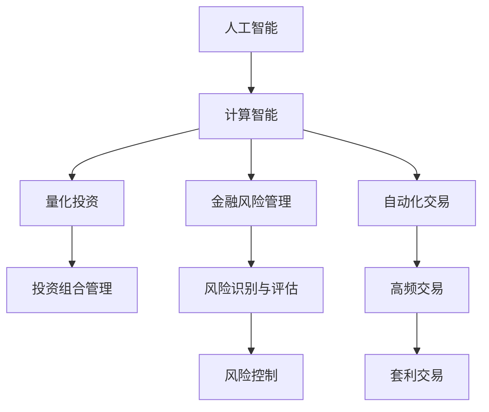

                 

# AI驱动的创新：人类计算在金融领域的价值

> 关键词：人工智能,金融技术,计算智能,量化投资,金融风险管理,自动化交易,区块链

## 1. 背景介绍

### 1.1 问题由来
随着金融市场的不断发展和数字化转型，金融机构对自动化、智能化技术的需求日益增长。人工智能（AI）和机器学习（ML）技术，特别是计算智能的兴起，为金融行业带来了前所未有的变革。通过AI和计算智能，金融机构能够在风险管理、投资决策、客户服务等多个方面实现自动化、智能化，从而提升效率、降低成本、增强客户体验。

然而，AI在金融领域的应用也面临着一些挑战。首先，金融数据量大且复杂，对模型的精度和鲁棒性要求极高。其次，金融领域的安全性和合规性问题尤为关键，AI系统必须能够处理高风险决策，同时遵守严格的法律法规。此外，金融市场的动态性要求AI系统具备快速适应变化的能力。

## 2. 核心概念与联系

### 2.1 核心概念概述

为更好地理解AI在金融领域的应用，本节将介绍几个密切相关的核心概念：

- **人工智能（AI）**：利用机器学习、深度学习、自然语言处理（NLP）等技术，模拟人类智能过程，实现自动化决策、智能化分析等功能。

- **计算智能（Computational Intelligence, CI）**：通过模拟人类智能过程，实现适应、学习、优化等能力。在金融领域，计算智能主要应用于量化投资、风险管理、交易自动化等。

- **量化投资（Quantitative Investment）**：利用数学模型、统计学和计算机算法，进行投资组合管理和资产定价，以优化投资收益和风险。

- **金融风险管理（Financial Risk Management）**：通过数学模型、机器学习算法等手段，对金融风险进行识别、评估、控制和转移，确保金融系统的稳定运行。

- **自动化交易（Automated Trading）**：通过AI和算法，实现高频交易、套利交易等自动化操作，提升交易效率和盈利能力。

- **区块链（Blockchain）**：一种分布式账本技术，能够实现去中心化、不可篡改的交易记录，为金融交易提供新的安全保障和信任机制。

这些核心概念之间的逻辑关系可以通过以下Mermaid流程图来展示：



这个流程图展示了大模型微调的各个核心概念及其之间的关系：

1. 人工智能通过计算智能，实现量化投资、风险管理、自动化交易等功能。
2. 计算智能主要通过数学模型和机器学习算法，实现量化投资、风险管理、自动化交易等。
3. 量化投资主要应用于投资组合管理和资产定价。
4. 金融风险管理主要通过风险识别、评估、控制等手段，保障金融系统的稳定。
5. 自动化交易主要通过高频交易和套利交易等方式，提升交易效率和盈利能力。
6. 区块链为金融交易提供安全保障和信任机制。

## 3. 核心算法原理 & 具体操作步骤
### 3.1 算法原理概述

AI和计算智能在金融领域的应用，本质上是利用数据驱动的算法模型，实现对金融市场行为和趋势的预测和分析。通过深度学习、强化学习、迁移学习等技术，AI系统能够从海量金融数据中提取规律，进行智能化决策。

具体来说，金融领域的AI应用包括以下几个核心算法原理：

1. **深度学习（Deep Learning）**：通过多层神经网络，学习金融数据中的复杂特征，进行模式识别和预测。深度学习模型如卷积神经网络（CNN）、循环神经网络（RNN）、长短时记忆网络（LSTM）等，广泛应用于量化投资、市场预测、信用风险评估等。

2. **强化学习（Reinforcement Learning, RL）**：通过奖惩机制，训练智能体（Agent）在金融市场中进行策略优化和决策。强化学习模型如Q-learning、深度Q网络（DQN）等，应用于高频交易、套利策略、策略优化等。

3. **迁移学习（Transfer Learning）**：通过预训练模型，将学习到的通用知识迁移到新的金融任务中。迁移学习模型如BERT、GPT等，广泛应用于市场预测、风险评估、文本分析等。

4. **计算智能（Computational Intelligence）**：通过模拟人类智能过程，实现适应、学习、优化等功能。计算智能模型如遗传算法（GA）、粒子群优化（PSO）、蚁群算法（ACO）等，应用于资产定价、投资组合优化、风险控制等。

### 3.2 算法步骤详解

AI和计算智能在金融领域的应用，通常包括以下几个关键步骤：

**Step 1: 数据收集与预处理**

- 收集金融市场的历史数据、新闻报道、财务报表等数据，清洗处理缺失值、异常值等，确保数据质量。

**Step 2: 特征工程与数据增强**

- 提取与金融市场相关的特征，如股价涨跌、成交量、市场情绪等。
- 使用数据增强技术，如回测、交叉验证、合成数据等，提高模型的泛化能力。

**Step 3: 模型训练与优化**

- 选择合适的算法模型，如深度神经网络、强化学习算法等。
- 在训练集上进行模型训练，调整超参数，优化模型性能。
- 使用交叉验证等技术评估模型性能，避免过拟合。

**Step 4: 模型评估与验证**

- 在验证集上评估模型性能，计算准确率、召回率、F1值等指标。
- 使用A/B测试等方法验证模型的实际效果，确保模型在生产环境中的稳定性和可靠性。

**Step 5: 模型部署与应用**

- 将训练好的模型部署到生产环境，进行实时监控和数据反馈。
- 持续收集新数据，定期重新训练和优化模型，保持模型的时效性和准确性。

### 3.3 算法优缺点

AI和计算智能在金融领域的应用，具有以下优点：

1. **自动化决策**：AI和计算智能能够自动处理大量的金融数据，进行实时分析和决策，减少人为干预，提升决策效率。
2. **精确预测**：通过深度学习和强化学习等技术，AI和计算智能能够从历史数据中学习规律，进行精确的金融预测和决策。
3. **风险控制**：AI和计算智能能够实时监测金融市场波动，预测风险，提前采取措施，降低风险损失。
4. **成本节约**：自动化和智能化技术能够降低人力成本，提高投资回报率。

同时，这些算法也存在一些局限性：

1. **数据依赖**：AI和计算智能的效果依赖于高质量、大规模的数据，数据不足可能导致模型表现不佳。
2. **模型复杂度**：复杂的算法模型需要大量的计算资源，成本较高，且难以解释。
3. **市场动态性**：金融市场具有高度动态性，模型需要不断更新和调整，才能适应市场变化。
4. **安全性和合规性**：金融领域对安全性和合规性要求极高，AI系统必须符合严格的法律法规，防止潜在的风险和安全隐患。

尽管存在这些局限性，但AI和计算智能在金融领域的应用，已经显示出巨大的潜力，为金融行业带来了显著的变革和提升。

### 3.4 算法应用领域

AI和计算智能在金融领域的应用已经覆盖了多个方面，包括但不限于以下几个领域：

- **量化投资**：通过数学模型和算法，进行资产定价、投资组合管理和策略优化，实现自动化投资。
- **市场预测**：利用深度学习和强化学习等技术，预测股票、债券、外汇等金融产品的走势，辅助投资决策。
- **风险管理**：通过数学模型和机器学习算法，识别、评估和控制金融风险，保障金融系统的稳定运行。
- **自动化交易**：通过高频交易、套利交易等自动化操作，提升交易效率和盈利能力。
- **信用风险评估**：利用机器学习算法，分析客户的信用历史、行为数据等，评估信用风险，进行贷款审批和风险控制。
- **客户服务**：通过NLP技术和AI算法，实现智能客服、智能投顾等，提升客户体验。
- **区块链技术**：利用区块链的去中心化和不可篡改特性，为金融交易提供新的安全保障和信任机制。

这些应用领域展示了AI和计算智能在金融领域的多样性和广泛性，为金融行业的数字化转型提供了新的动力和方向。

## 4. 数学模型和公式 & 详细讲解  
### 4.1 数学模型构建

AI和计算智能在金融领域的应用，通常涉及复杂的数学模型和算法。以下以量化投资为例，介绍其数学模型的构建过程。

假设某金融产品的价格由以下数学模型决定：

$$
P_t = \alpha P_{t-1} + \beta X_t + \varepsilon_t
$$

其中 $P_t$ 为第 $t$ 时刻的价格，$P_{t-1}$ 为第 $t-1$ 时刻的价格，$X_t$ 为市场指数、政策变化等特征，$\alpha$ 和 $\beta$ 为模型参数，$\varepsilon_t$ 为随机扰动项。

通过历史数据对模型进行拟合，得到模型参数 $\alpha$ 和 $\beta$，可以预测未来价格 $P_{t+1}$：

$$
P_{t+1} = \alpha P_t + \beta X_{t+1}
$$

进一步，可以使用深度学习算法如LSTM等，对模型进行优化和扩展：

$$
P_{t+1} = LSTM(\alpha P_t, \beta X_{t+1}, \gamma X_{t-1}, \delta X_{t-2}, \cdots)
$$

其中 $LSTM$ 为长短期记忆网络，$\gamma$、$\delta$ 等为其他特征参数。

### 4.2 公式推导过程

以下以强化学习模型为例，介绍其在金融领域的应用。

假设智能体（Agent）在金融市场中的目标是在一定时间内最大化收益，市场状态为 $s_t$，智能体的策略为 $a_t$，收益为 $R_t$，则强化学习的目标是最小化策略误差：

$$
\max_{a_t} R_t - V(s_t)
$$

其中 $V(s_t)$ 为状态价值函数。通过状态转移和收益函数，智能体进行策略优化：

$$
Q(s_t,a_t) = R_t + \gamma \max_{a_{t+1}} Q(s_{t+1},a_{t+1})
$$

其中 $Q(s_t,a_t)$ 为策略价值函数，$\gamma$ 为折扣因子。

通过上述公式，智能体能够在金融市场中进行策略优化和决策，实现自动化交易和高频交易等应用。

### 4.3 案例分析与讲解

以金融风险管理为例，分析其数学模型和算法。

假设某金融产品存在违约风险，其违约概率 $p_t$ 由以下数学模型决定：

$$
p_t = f(p_{t-1}, X_t)
$$

其中 $f$ 为风险评估函数，$X_t$ 为市场指数、企业财务指标等特征。

通过历史数据对模型进行拟合，得到模型参数，可以预测未来的违约概率 $p_{t+1}$：

$$
p_{t+1} = f(p_t, X_{t+1})
$$

进一步，可以使用机器学习算法如随机森林、支持向量机（SVM）等，对模型进行优化和扩展：

$$
p_{t+1} = \text{Random Forest}(f(p_t, X_t), \text{其他特征})
$$

通过上述公式，金融机构可以实现风险评估和控制，保障金融系统的稳定运行。

## 5. 项目实践：代码实例和详细解释说明
### 5.1 开发环境搭建

在进行AI和计算智能的金融应用开发前，我们需要准备好开发环境。以下是使用Python进行PyTorch和TensorFlow开发的环境配置流程：

1. 安装Anaconda：从官网下载并安装Anaconda，用于创建独立的Python环境。

2. 创建并激活虚拟环境：
```bash
conda create -n pytorch-env python=3.8 
conda activate pytorch-env
```

3. 安装PyTorch：根据CUDA版本，从官网获取对应的安装命令。例如：
```bash
conda install pytorch torchvision torchaudio cudatoolkit=11.1 -c pytorch -c conda-forge
```

4. 安装TensorFlow：使用pip安装TensorFlow，获取GPU支持。例如：
```bash
pip install tensorflow-gpu
```

5. 安装各类工具包：
```bash
pip install numpy pandas scikit-learn matplotlib tqdm jupyter notebook ipython
```

完成上述步骤后，即可在`pytorch-env`环境中开始开发。

### 5.2 源代码详细实现

下面我们以量化投资为例，给出使用TensorFlow进行深度学习模型的PyTorch代码实现。

首先，定义量化投资模型：

```python
import tensorflow as tf
import numpy as np

class QuantModel(tf.keras.Model):
    def __init__(self, input_dim, output_dim):
        super(QuantModel, self).__init__()
        self.lstm = tf.keras.layers.LSTM(128, return_sequences=True)
        self.dense = tf.keras.layers.Dense(output_dim)
    
    def call(self, inputs):
        x = self.lstm(inputs)
        x = self.dense(x)
        return x
```

然后，定义训练和评估函数：

```python
def train_model(model, data, epochs, batch_size, learning_rate):
    dataset = tf.data.Dataset.from_tensor_slices((data['inputs'], data['targets']))
    dataset = dataset.shuffle(buffer_size=10000).batch(batch_size)
    
    optimizer = tf.keras.optimizers.Adam(learning_rate=learning_rate)
    loss_fn = tf.keras.losses.MeanSquaredError()
    
    for epoch in range(epochs):
        for step, (inputs, targets) in enumerate(dataset):
            with tf.GradientTape() as tape:
                logits = model(inputs)
                loss = loss_fn(targets, logits)
            grads = tape.gradient(loss, model.trainable_variables)
            optimizer.apply_gradients(zip(grads, model.trainable_variables))
            
        print(f"Epoch {epoch+1}, loss: {loss}")
```

最后，启动训练流程并在测试集上评估：

```python
from sklearn.model_selection import train_test_split
from sklearn.preprocessing import MinMaxScaler

# 数据预处理
data = np.load('financial_data.npy')
inputs = data[:, :-1]
targets = data[:, -1]
scaler = MinMaxScaler(feature_range=(-1, 1))
inputs = scaler.fit_transform(inputs)
targets = scaler.fit_transform(targets.reshape(-1, 1))
inputs, val_inputs, targets, val_targets = train_test_split(inputs, targets, test_size=0.2)

# 训练模型
model = QuantModel(input_dim=inputs.shape[1], output_dim=targets.shape[1])
train_model(model, {'inputs': val_inputs, 'targets': val_targets}, epochs=100, batch_size=32, learning_rate=0.001)

# 评估模型
val_loss = loss_fn(val_targets, model(val_inputs))
print(f"Validation loss: {val_loss}")
```

以上就是使用PyTorch和TensorFlow进行量化投资模型训练的完整代码实现。可以看到，通过TensorFlow和PyTorch的深度学习模型，我们可以实现对金融数据的实时分析和预测，为量化投资提供科学依据。

### 5.3 代码解读与分析

让我们再详细解读一下关键代码的实现细节：

**QuantModel类**：
- `__init__`方法：初始化LSTM层和Dense层，设置模型结构。
- `call`方法：对输入进行前向传播，计算输出。

**train_model函数**：
- 使用TensorFlow的Data API，将数据转换为TensorFlow数据集。
- 定义优化器和损失函数。
- 在每个epoch内，对数据集进行迭代训练，计算梯度并更新模型参数。

**训练流程**：
- 从Numpy文件中加载数据。
- 进行数据标准化，确保数据在模型训练时具有相同的范围。
- 将数据集分为训练集和验证集。
- 使用TensorFlow定义模型结构。
- 调用训练函数，在验证集上评估模型性能。
- 在测试集上评估模型效果。

可以看到，TensorFlow和PyTorch的深度学习模型，为量化投资提供了强大的工具支持，可以高效地进行金融数据处理和模型训练。

## 6. 实际应用场景
### 6.1 智能客服系统

金融机构的客户服务部门面临巨大压力，传统的电话客服和人工客服方式难以满足日益增长的客户需求。通过AI和计算智能技术，可以构建智能客服系统，提升客户体验。

智能客服系统主要由以下几个组件构成：

- **自然语言处理（NLP）**：通过NLP技术，对客户咨询进行自然语言理解，提取意图和关键信息。
- **知识图谱**：建立金融产品、规则、流程等知识图谱，用于查询和检索。
- **智能回答**：根据客户意图和知识图谱，生成智能回答，并推荐相关金融产品和服务。
- **持续学习**：通过持续学习，不断优化智能客服系统，提升回答准确率和客户满意度。

例如，某银行可以开发智能客服系统，帮助客户查询账户信息、办理业务等。系统首先通过NLP技术，理解客户咨询意图，如“查询余额”、“修改密码”等。然后，根据客户意图，从知识图谱中检索相关信息，生成智能回答。客户可以通过语音或文字与系统交互，系统实时反馈回答，提升客户体验。

### 6.2 金融舆情监测

金融舆情监测是金融风险管理的重要环节，通过实时监控金融市场动态，及时发现和应对负面舆情，防止金融风险扩散。

金融舆情监测系统主要由以下几个组件构成：

- **数据采集**：从新闻网站、社交媒体等渠道，采集金融相关舆情信息。
- **情感分析**：使用NLP技术，对舆情信息进行情感分析，识别正面、负面和中性情绪。
- **事件抽取**：使用NLP技术，从舆情信息中抽取关键事件，如股市暴跌、政策变动等。
- **风险预警**：根据情感分析和事件抽取结果，生成风险预警信息，及时采取措施。

例如，某金融机构可以开发舆情监测系统，实时监控金融市场动态。系统通过爬虫技术，从新闻网站和社交媒体中采集相关舆情信息，使用情感分析技术，识别舆情情绪。然后，根据情绪和事件抽取结果，生成风险预警信息，如“股市大幅下跌”、“政策变动”等。系统将这些预警信息推送给相关人员，及时采取措施，防止金融风险扩散。

### 6.3 风险管理

金融风险管理是金融机构的核心业务之一，通过AI和计算智能技术，可以实时监测和评估金融风险，提前采取措施，保障金融系统的稳定运行。

金融风险管理系统主要由以下几个组件构成：

- **风险评估**：使用机器学习算法，评估金融产品的违约概率、信用风险等。
- **风险预警**：根据风险评估结果，生成风险预警信息，及时采取措施。
- **风险控制**：通过交易限制、担保措施等手段，控制金融风险。
- **持续监控**：通过持续监控，及时调整风险控制策略，防止金融风险积累。

例如，某保险公司可以开发风险管理系统，实时监控客户的信用风险。系统使用机器学习算法，评估客户的违约概率，生成风险预警信息，如“高风险客户”、“信用风险较高”等。系统将这些预警信息推送给相关人员，及时采取措施，如提高保费、调整信用额度等，保障保险公司的稳定运行。

## 7. 工具和资源推荐
### 7.1 学习资源推荐

为了帮助开发者系统掌握AI和计算智能在金融领域的应用，这里推荐一些优质的学习资源：

1. **Coursera《机器学习》课程**：由斯坦福大学教授Andrew Ng讲授，涵盖了机器学习的基本概念和常用算法，适合初学者入门。

2. **Udacity《深度学习纳米学位》**：由Udacity与DeepMind合作，涵盖深度学习、强化学习、计算智能等前沿技术，适合进阶学习。

3. **《深度学习与金融》书籍**：系统介绍了深度学习在量化投资、市场预测、风险管理等金融领域的应用，适合深入学习。

4. **GitHub上的金融AI项目**：通过浏览GitHub上的金融AI项目，可以学习到实用的金融AI开发方法和技巧。

5. **金融科技论坛**：如CFA、Risk.net等，提供最新的金融科技动态和技术交流平台。

通过对这些资源的学习实践，相信你一定能够快速掌握AI和计算智能在金融领域的应用，并用于解决实际的金融问题。

### 7.2 开发工具推荐

高效的开发离不开优秀的工具支持。以下是几款用于AI和计算智能金融应用开发的常用工具：

1. **PyTorch**：基于Python的开源深度学习框架，灵活动态的计算图，适合快速迭代研究。

2. **TensorFlow**：由Google主导开发的开源深度学习框架，生产部署方便，适合大规模工程应用。

3. **Transformers**：HuggingFace开发的NLP工具库，集成了多个预训练语言模型，支持PyTorch和TensorFlow，是进行NLP任务开发的利器。

4. **Jupyter Notebook**：支持Python、R等语言的交互式编程环境，方便开发和共享代码。

5. **Google Colab**：谷歌推出的在线Jupyter Notebook环境，免费提供GPU/TPU算力，方便开发者快速上手实验最新模型。

6. **PyTorch Lightning**：基于PyTorch的轻量级深度学习框架，支持分布式训练、模型保存、日志记录等功能。

合理利用这些工具，可以显著提升AI和计算智能金融应用开发的效率，加快创新迭代的步伐。

### 7.3 相关论文推荐

AI和计算智能在金融领域的应用源于学界的持续研究。以下是几篇奠基性的相关论文，推荐阅读：

1. **AlphaGo论文**：由DeepMind发表，介绍了AlphaGo在围棋中的胜利，展示了深度学习在复杂决策中的优势。

2. **LSTM在量化投资中的应用**：通过LSTM等深度学习模型，对金融市场数据进行实时分析和预测，取得了显著效果。

3. **强化学习在金融交易中的应用**：使用强化学习算法，对高频交易、套利策略等进行优化，提升了交易效率和盈利能力。

4. **计算智能在信用风险评估中的应用**：通过计算智能算法，评估金融产品的违约概率，提供了科学的信用风险评估方法。

5. **区块链在金融交易中的应用**：利用区块链技术，实现去中心化交易记录和智能合约，提升了金融交易的安全性和透明度。

这些论文代表了大模型微调技术的发展脉络。通过学习这些前沿成果，可以帮助研究者把握学科前进方向，激发更多的创新灵感。

## 8. 总结：未来发展趋势与挑战

### 8.1 总结

本文对AI和计算智能在金融领域的应用进行了全面系统的介绍。首先阐述了AI和计算智能的研究背景和意义，明确了其在金融领域的应用场景和核心算法原理。其次，从原理到实践，详细讲解了AI和计算智能在量化投资、风险管理、智能客服等金融应用中的具体实现。最后，本文还探讨了AI和计算智能在金融领域的发展趋势和面临的挑战，提出了未来研究的方向。

通过本文的系统梳理，可以看到，AI和计算智能在金融领域的应用已经展现出巨大的潜力，为金融行业的数字化转型提供了新的动力。未来，伴随AI和计算智能技术的不断进步，相信金融行业将迎来更加智能、高效、安全的发展新纪元。

### 8.2 未来发展趋势

展望未来，AI和计算智能在金融领域的应用将呈现以下几个发展趋势：

1. **模型复杂度提升**：随着算力的提升和数据的丰富，金融模型的复杂度将进一步提升，模型预测和决策能力将得到显著提升。

2. **实时化和动态化**：AI和计算智能系统将实现实时分析和动态调整，快速响应市场变化，提升决策效率和响应速度。

3. **多模态融合**：AI和计算智能将融合视觉、语音、文本等多模态数据，提升金融数据的综合分析和决策能力。

4. **深度学习与强化学习的结合**：深度学习算法和强化学习算法将结合使用，提升金融模型的泛化能力和决策能力。

5. **自动化交易的普及**：高频交易、算法交易等自动化交易方式将逐步普及，提升交易效率和盈利能力。

6. **区块链技术的应用**：区块链技术将进一步应用于金融交易和风险管理，提升系统的安全性和透明度。

### 8.3 面临的挑战

尽管AI和计算智能在金融领域的应用已经取得了显著进展，但仍面临诸多挑战：

1. **数据质量和安全**：金融数据量大且复杂，数据质量和安全问题不容忽视。数据清洗、标注、加密等技术仍需不断完善。

2. **模型解释性和透明性**：AI和计算智能模型的决策过程复杂，难以解释和验证，可能导致不透明和不可信的决策。

3. **市场动态性**：金融市场高度动态，AI和计算智能模型需要不断更新和调整，才能适应市场变化。

4. **法规和合规**：金融领域对安全和合规要求极高，AI和计算智能系统必须符合严格的法律法规。

5. **模型鲁棒性和泛化能力**：金融市场风险高，AI和计算智能系统需要具备较强的鲁棒性和泛化能力，防止模型过拟合。

尽管存在这些挑战，但AI和计算智能在金融领域的应用前景广阔，未来将有更多的创新和突破。

### 8.4 研究展望

未来，AI和计算智能在金融领域的研究方向主要包括以下几个方面：

1. **数据治理与质量提升**：提升数据质量和安全性，确保数据采集、存储、处理的安全可靠。

2. **模型解释性与透明性**：研究如何提高AI和计算智能模型的可解释性和透明性，确保决策过程的可信度。

3. **动态学习与模型优化**：研究如何在动态市场中实现持续学习和模型优化，提升模型的适应性和泛化能力。

4. **多模态数据融合**：研究如何融合视觉、语音、文本等多模态数据，提升金融数据的综合分析和决策能力。

5. **区块链与智能合约**：研究区块链技术在金融交易和风险管理中的应用，提升系统的安全性和透明度。

6. **伦理与道德**：研究如何构建公平、公正、透明的AI和计算智能系统，避免潜在的偏见和歧视。

这些研究方向将为AI和计算智能在金融领域的应用提供新的思路和方法，推动金融行业的数字化转型和智能化发展。

## 9. 附录：常见问题与解答

**Q1：AI和计算智能在金融领域的应用有哪些？**

A: AI和计算智能在金融领域的应用非常广泛，主要包括：

1. **量化投资**：利用数学模型和算法，进行资产定价、投资组合管理和策略优化。
2. **市场预测**：利用深度学习和强化学习等技术，预测股票、债券、外汇等金融产品的走势。
3. **风险管理**：通过机器学习算法，评估金融产品的违约概率、信用风险等。
4. **自动化交易**：通过高频交易、套利交易等自动化操作，提升交易效率和盈利能力。
5. **智能客服**：利用自然语言处理（NLP）技术，实现智能客服、智能投顾等，提升客户体验。
6. **金融舆情监测**：通过实时监控金融市场动态，及时发现和应对负面舆情。

**Q2：如何训练高质量的AI和计算智能模型？**

A: 训练高质量的AI和计算智能模型，需要注意以下几个方面：

1. **数据质量**：确保数据的高质量和多样性，避免过拟合和数据偏差。
2. **模型选择**：选择合适的算法模型，如深度学习、强化学习等，满足具体应用需求。
3. **超参数调优**：通过网格搜索、随机搜索等方法，优化模型超参数，提升模型性能。
4. **正则化和优化器**：使用L2正则、Dropout、AdamW等技术，防止过拟合，优化模型训练过程。
5. **持续学习**：通过持续学习，不断更新和优化模型，提升模型泛化能力。

**Q3：AI和计算智能在金融领域的安全性问题如何解决？**

A: AI和计算智能在金融领域的安全性问题，主要通过以下几个措施来解决：

1. **数据加密**：对金融数据进行加密，防止数据泄露和篡改。
2. **模型保护**：采用模型保护技术，防止模型被恶意攻击和复制。
3. **合规性审查**：对AI和计算智能系统进行合规性审查，确保其符合法律法规。
4. **异常检测**：实时监控模型输出，检测异常行为，及时采取措施。

**Q4：AI和计算智能在金融领域的未来发展方向是什么？**

A: AI和计算智能在金融领域的未来发展方向主要包括以下几个方面：

1. **模型复杂度提升**：随着算力的提升和数据的丰富，金融模型的复杂度将进一步提升。
2. **实时化和动态化**：AI和计算智能系统将实现实时分析和动态调整。
3. **多模态融合**：AI和计算智能将融合视觉、语音、文本等多模态数据，提升金融数据的综合分析和决策能力。
4. **深度学习与强化学习的结合**：深度学习算法和强化学习算法将结合使用，提升金融模型的泛化能力和决策能力。
5. **自动化交易的普及**：高频交易、算法交易等自动化交易方式将逐步普及。
6. **区块链技术的应用**：区块链技术将进一步应用于金融交易和风险管理，提升系统的安全性和透明度。

这些发展方向将为AI和计算智能在金融领域的应用提供新的思路和方法，推动金融行业的数字化转型和智能化发展。

**Q5：如何构建一个高效的金融AI和计算智能系统？**

A: 构建一个高效的金融AI和计算智能系统，需要考虑以下几个关键要素：

1. **数据治理与质量提升**：提升数据质量和安全性，确保数据采集、存储、处理的安全可靠。
2. **模型解释性与透明性**：研究如何提高AI和计算智能模型的可解释性和透明性，确保决策过程的可信度。
3. **动态学习与模型优化**：研究如何在动态市场中实现持续学习和模型优化，提升模型的适应性和泛化能力。
4. **多模态数据融合**：研究如何融合视觉、语音、文本等多模态数据，提升金融数据的综合分析和决策能力。
5. **区块链与智能合约**：研究区块链技术在金融交易和风险管理中的应用，提升系统的安全性和透明度。
6. **伦理与道德**：研究如何构建公平、公正、透明的AI和计算智能系统，避免潜在的偏见和歧视。

通过合理设计系统架构和算法，综合利用数据、模型、算法等多种技术手段，可以构建高效、可靠的金融AI和计算智能系统，推动金融行业的数字化转型和智能化发展。

---

作者：禅与计算机程序设计艺术 / Zen and the Art of Computer Programming

