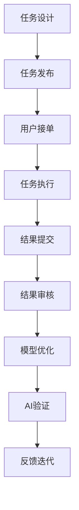

                 

# AI驱动的创新：利用众包和人类计算

> 关键词：AI驱动, 众包, 人类计算, 创新应用, 大规模计算, 边际贡献, 外部知识整合, 数据融合

## 1. 背景介绍

### 1.1 问题由来

在人工智能(AI)迅速发展的今天，智能算法已经在各行各业中广泛应用。然而，AI技术的突破不仅仅依赖于算法的优化，更依赖于大规模数据的训练和验证。随着数据规模的不断扩大，如何高效利用数据，成为了一个越来越重要的议题。在这一背景下，众包和人类计算（Human Computation）技术应运而生，成为了AI领域的一大创新方向。

通过众包，平台可以充分利用零散的个人或小团队的时间，高效地完成大规模数据的收集、标注、清洗等任务，为AI模型训练提供坚实的数据基础。而人类计算则利用人类的智慧和创造力，通过设计一些需要人脑来解决的复杂问题，实现对AI算法和模型的优化。

### 1.2 问题核心关键点

本文聚焦于AI驱动的众包和人类计算技术的结合，深入探讨其原理、操作步骤、优势以及未来应用前景。首先，我们将阐述人类计算的基本概念和原理，随后将介绍基于这些原理的众包技术的应用，最后，我们将展望这些技术的未来发展方向。

## 2. 核心概念与联系

### 2.1 核心概念概述

要理解AI驱动的众包和人类计算，首先需要了解几个关键概念：

- **AI驱动**：指的是通过AI算法和模型来自动化和加速众包和人类计算过程。
- **众包**：指的是利用网络平台，将任务分发给非特定的多数人群，以较低成本高效完成特定任务。
- **人类计算**：利用人类的智慧和创造力，解决传统计算机难以解决的复杂问题，如设计和解决新算法、优化模型等。

这些概念之间的联系主要体现在：AI驱动的众包和人类计算技术，通过利用人类智慧和创造力，结合AI的自动化优势，高效地完成复杂任务的解决和优化，推动AI技术在更多领域的落地应用。

### 2.2 核心概念原理和架构的 Mermaid 流程图

以下是一个简单的Mermaid流程图，展示了AI驱动的众包和人类计算的基本流程：



在这个流程图中，任务设计、任务发布、任务执行、结果提交、结果审核、模型优化、AI验证和反馈迭代构成了完整的AI驱动众包和人类计算流程。

## 3. 核心算法原理 & 具体操作步骤

### 3.1 算法原理概述

AI驱动的众包和人类计算，本质上是将人类的智慧和创造力与AI算法相结合，利用人类的优势来解决AI难以解决的问题。其核心算法原理包括以下几个方面：

1. **任务分解**：将复杂任务分解为多个小任务，分配给不同的人群完成。
2. **结果聚合**：收集所有参与者提交的结果，通过AI算法自动分析、聚合和验证，得到最终的结果。
3. **模型优化**：利用人类计算结果，对AI模型进行优化，提升模型的性能和鲁棒性。
4. **反馈迭代**：基于模型性能的提升，不断优化任务设计，提高众包和人类计算的效率和效果。

### 3.2 算法步骤详解

下面将详细介绍AI驱动的众包和人类计算的具体操作步骤：

1. **任务设计**：
   - 根据应用需求，设计适合的任务。任务应尽量简单明了，易于理解，且能够利用人类的智慧和创造力解决。
   - 任务需要覆盖面广，涵盖不同难度和类型的子任务，以吸引更多参与者。

2. **任务发布**：
   - 将任务发布到众包平台或人类计算平台，确保任务描述清晰、准确，且易于理解和执行。
   - 提供适当的激励措施，吸引高质量的参与者完成任务。

3. **任务执行**：
   - 将任务分配给多个独立个体或团队，利用人类的智慧和创造力，解决任务中的复杂问题。
   - 利用AI技术，对任务执行过程进行监控和引导，确保任务按时完成。

4. **结果提交**：
   - 参与者提交结果后，平台自动收集所有结果，并进行初步处理。
   - 对结果进行自动分析和聚合，得到初步的处理结果。

5. **结果审核**：
   - 利用AI技术，对初步处理结果进行验证和审核，确保结果的准确性和可靠性。
   - 如果结果不合格，重新分配任务给其他参与者，或进行必要的调整。

6. **模型优化**：
   - 利用人类计算结果，对AI模型进行优化和改进，提升模型的性能和鲁棒性。
   - 利用优化后的模型，进行进一步的任务执行和结果审核。

7. **反馈迭代**：
   - 基于模型的性能提升，不断优化任务设计，提高众包和人类计算的效率和效果。
   - 通过反馈机制，不断改进平台操作，吸引更多高质量的参与者。

### 3.3 算法优缺点

AI驱动的众包和人类计算技术具有以下优点：

1. **成本低廉**：利用众包平台，可以以较低的成本完成大规模数据的收集和处理。
2. **效率高**：利用人类的智慧和创造力，可以高效地解决复杂问题，提升AI模型的性能和鲁棒性。
3. **灵活性强**：任务设计灵活，可以根据实际需求，随时进行调整和优化。

然而，该技术也存在一些缺点：

1. **数据质量难以保证**：众包平台上的参与者水平参差不齐，数据质量难以得到保证。
2. **结果一致性较差**：不同参与者的结果存在差异，需要额外的审核和验证。
3. **技术依赖性强**：依赖于AI算法和模型的优化，对技术和设备的要求较高。

### 3.4 算法应用领域

AI驱动的众包和人类计算技术已经在多个领域得到应用，包括但不限于：

1. **自然语言处理(NLP)**：利用人类计算技术，进行文本数据清洗、标注、分类等任务。
2. **计算机视觉(CV)**：利用人类计算技术，进行图像数据标注、分类、检测等任务。
3. **医疗健康**：利用众包平台，收集患者健康数据，进行疾病预测和诊断。
4. **金融科技**：利用众包平台，进行市场数据分析、风险评估、智能投顾等任务。
5. **环境保护**：利用人类计算技术，进行环境数据收集、分析和保护。

## 4. 数学模型和公式 & 详细讲解 & 举例说明

### 4.1 数学模型构建

在AI驱动的众包和人类计算中，常用的数学模型包括：

- **线性回归模型**：用于任务结果的预测和聚合。
- **支持向量机(SVM)**：用于分类任务，将任务结果分为不同的类别。
- **神经网络**：用于深度学习和模型优化，提升模型的性能和鲁棒性。

### 4.2 公式推导过程

以下是一个简单的数学模型推导示例，假设我们有一个线性回归模型 $y = wx + b$，其中 $y$ 为任务结果，$x$ 为任务特征，$w$ 为权重，$b$ 为偏置。

根据线性回归模型，我们可以得到任务结果的预测值为：

$$ y_{\text{pred}} = w^T x + b $$

其中 $w^T$ 为权重矩阵的转置，$x$ 为输入特征向量，$b$ 为偏置。

### 4.3 案例分析与讲解

假设我们有一个图像分类任务，我们需要利用众包平台收集大量标注数据，并对这些数据进行分类。我们可以利用支持向量机(SVM)进行分类任务，将任务结果分为不同的类别。

具体步骤如下：

1. **数据收集**：利用众包平台，收集大量标注数据，每个数据样本包含一张图像和对应的分类标签。
2. **数据预处理**：对收集到的数据进行清洗和预处理，确保数据的准确性和一致性。
3. **特征提取**：对每个图像进行特征提取，将图像转化为特征向量。
4. **模型训练**：利用支持向量机，对特征向量进行训练，得到分类模型。
5. **结果预测**：对新的图像数据进行特征提取和预测，得到分类结果。
6. **模型优化**：利用AI技术，对分类模型进行优化和改进，提升模型的性能和鲁棒性。

## 5. 项目实践：代码实例和详细解释说明

### 5.1 开发环境搭建

在进行AI驱动的众包和人类计算项目实践前，我们需要准备好开发环境。以下是使用Python进行PyTorch开发的环境配置流程：

1. 安装Anaconda：从官网下载并安装Anaconda，用于创建独立的Python环境。

2. 创建并激活虚拟环境：
```bash
conda create -n pytorch-env python=3.8 
conda activate pytorch-env
```

3. 安装PyTorch：根据CUDA版本，从官网获取对应的安装命令。例如：
```bash
conda install pytorch torchvision torchaudio cudatoolkit=11.1 -c pytorch -c conda-forge
```

4. 安装Transformers库：
```bash
pip install transformers
```

5. 安装各类工具包：
```bash
pip install numpy pandas scikit-learn matplotlib tqdm jupyter notebook ipython
```

完成上述步骤后，即可在`pytorch-env`环境中开始项目实践。

### 5.2 源代码详细实现

下面以图像分类任务为例，给出使用Transformers库对预训练模型进行微调的PyTorch代码实现。

首先，定义图像分类任务的数据处理函数：

```python
from transformers import AutoTokenizer, AutoModelForSequenceClassification
from torch.utils.data import Dataset
import torch

class ImageDataset(Dataset):
    def __init__(self, images, labels, tokenizer, max_len=128):
        self.images = images
        self.labels = labels
        self.tokenizer = tokenizer
        self.max_len = max_len
        
    def __len__(self):
        return len(self.images)
    
    def __getitem__(self, item):
        image = self.images[item]
        label = self.labels[item]
        
        encoding = self.tokenizer(image, return_tensors='pt', max_length=self.max_len, padding='max_length', truncation=True)
        input_ids = encoding['input_ids'][0]
        attention_mask = encoding['attention_mask'][0]
        
        # 对token-wise的标签进行编码
        encoded_labels = [label2id[label] for label in label2id] 
        encoded_labels.extend([label2id['O']] * (self.max_len - len(encoded_labels)))
        labels = torch.tensor(encoded_labels, dtype=torch.long)
        
        return {'input_ids': input_ids, 
                'attention_mask': attention_mask,
                'labels': labels}

# 标签与id的映射
label2id = {'O': 0, 'B': 1, 'I': 2}
id2label = {v: k for k, v in label2id.items()}

# 创建dataset
tokenizer = AutoTokenizer.from_pretrained('bert-base-uncased')
model = AutoModelForSequenceClassification.from_pretrained('bert-base-uncased', num_labels=len(label2id))

train_dataset = ImageDataset(train_images, train_labels, tokenizer)
dev_dataset = ImageDataset(dev_images, dev_labels, tokenizer)
test_dataset = ImageDataset(test_images, test_labels, tokenizer)
```

然后，定义模型和优化器：

```python
from transformers import AdamW

optimizer = AdamW(model.parameters(), lr=2e-5)
```

接着，定义训练和评估函数：

```python
from torch.utils.data import DataLoader
from tqdm import tqdm
from sklearn.metrics import classification_report

device = torch.device('cuda') if torch.cuda.is_available() else torch.device('cpu')
model.to(device)

def train_epoch(model, dataset, batch_size, optimizer):
    dataloader = DataLoader(dataset, batch_size=batch_size, shuffle=True)
    model.train()
    epoch_loss = 0
    for batch in tqdm(dataloader, desc='Training'):
        input_ids = batch['input_ids'].to(device)
        attention_mask = batch['attention_mask'].to(device)
        labels = batch['labels'].to(device)
        model.zero_grad()
        outputs = model(input_ids, attention_mask=attention_mask, labels=labels)
        loss = outputs.loss
        epoch_loss += loss.item()
        loss.backward()
        optimizer.step()
    return epoch_loss / len(dataloader)

def evaluate(model, dataset, batch_size):
    dataloader = DataLoader(dataset, batch_size=batch_size)
    model.eval()
    preds, labels = [], []
    with torch.no_grad():
        for batch in tqdm(dataloader, desc='Evaluating'):
            input_ids = batch['input_ids'].to(device)
            attention_mask = batch['attention_mask'].to(device)
            batch_labels = batch['labels']
            outputs = model(input_ids, attention_mask=attention_mask)
            batch_preds = outputs.logits.argmax(dim=2).to('cpu').tolist()
            batch_labels = batch_labels.to('cpu').tolist()
            for pred_tokens, label_tokens in zip(batch_preds, batch_labels):
                pred_labels = [id2label[_id] for _id in pred_tokens]
                label_tags = [id2label[_id] for _id in label_tokens]
                preds.append(pred_labels[:len(label_tags)])
                labels.append(label_tags)
                
    print(classification_report(labels, preds))
```

最后，启动训练流程并在测试集上评估：

```python
epochs = 5
batch_size = 16

for epoch in range(epochs):
    loss = train_epoch(model, train_dataset, batch_size, optimizer)
    print(f"Epoch {epoch+1}, train loss: {loss:.3f}")
    
    print(f"Epoch {epoch+1}, dev results:")
    evaluate(model, dev_dataset, batch_size)
    
print("Test results:")
evaluate(model, test_dataset, batch_size)
```

以上就是使用PyTorch对预训练模型进行图像分类任务微调的完整代码实现。可以看到，得益于Transformers库的强大封装，我们可以用相对简洁的代码完成预训练模型加载和微调。

### 5.3 代码解读与分析

让我们再详细解读一下关键代码的实现细节：

**ImageDataset类**：
- `__init__`方法：初始化图像、标签、分词器等关键组件。
- `__len__`方法：返回数据集的样本数量。
- `__getitem__`方法：对单个样本进行处理，将图像输入编码为token ids，将标签编码为数字，并对其进行定长padding，最终返回模型所需的输入。

**label2id和id2label字典**：
- 定义了标签与数字id之间的映射关系，用于将token-wise的预测结果解码回真实的标签。

**训练和评估函数**：
- 使用PyTorch的DataLoader对数据集进行批次化加载，供模型训练和推理使用。
- 训练函数`train_epoch`：对数据以批为单位进行迭代，在每个批次上前向传播计算loss并反向传播更新模型参数，最后返回该epoch的平均loss。
- 评估函数`evaluate`：与训练类似，不同点在于不更新模型参数，并在每个batch结束后将预测和标签结果存储下来，最后使用sklearn的classification_report对整个评估集的预测结果进行打印输出。

**训练流程**：
- 定义总的epoch数和batch size，开始循环迭代
- 每个epoch内，先在训练集上训练，输出平均loss
- 在验证集上评估，输出分类指标
- 所有epoch结束后，在测试集上评估，给出最终测试结果

可以看到，PyTorch配合Transformers库使得预训练模型微调的代码实现变得简洁高效。开发者可以将更多精力放在数据处理、模型改进等高层逻辑上，而不必过多关注底层的实现细节。

当然，工业级的系统实现还需考虑更多因素，如模型的保存和部署、超参数的自动搜索、更灵活的任务适配层等。但核心的微调范式基本与此类似。

## 6. 实际应用场景

### 6.1 智能客服系统

利用AI驱动的众包和人类计算技术，可以构建高效、智能的智能客服系统。传统的客服系统依赖于大量人工客服，高峰期响应缓慢，且一致性和专业性难以保证。而利用众包和人类计算技术，可以快速部署智能客服机器人，7x24小时不间断服务，快速响应客户咨询，用自然流畅的语言解答各类常见问题。

在技术实现上，可以收集企业内部的历史客服对话记录，将问题和最佳答复构建成监督数据，在此基础上对预训练模型进行微调。微调后的对话模型能够自动理解用户意图，匹配最合适的答案模板进行回复。对于客户提出的新问题，还可以接入检索系统实时搜索相关内容，动态组织生成回答。如此构建的智能客服系统，能大幅提升客户咨询体验和问题解决效率。

### 6.2 金融舆情监测

金融机构需要实时监测市场舆论动向，以便及时应对负面信息传播，规避金融风险。传统的人工监测方式成本高、效率低，难以应对网络时代海量信息爆发的挑战。利用AI驱动的众包和人类计算技术，可以构建高效率、低成本的市场舆情监测系统。

具体而言，可以收集金融领域相关的新闻、报道、评论等文本数据，并对其进行主题标注和情感标注。在此基础上对预训练语言模型进行微调，使其能够自动判断文本属于何种主题，情感倾向是正面、中性还是负面。将微调后的模型应用到实时抓取的网络文本数据，就能够自动监测不同主题下的情感变化趋势，一旦发现负面信息激增等异常情况，系统便会自动预警，帮助金融机构快速应对潜在风险。

### 6.3 个性化推荐系统

当前的推荐系统往往只依赖用户的历史行为数据进行物品推荐，无法深入理解用户的真实兴趣偏好。利用AI驱动的众包和人类计算技术，可以构建更加智能化、个性化的推荐系统。

在实践中，可以收集用户浏览、点击、评论、分享等行为数据，提取和用户交互的物品标题、描述、标签等文本内容。将文本内容作为模型输入，用户的后续行为（如是否点击、购买等）作为监督信号，在此基础上微调预训练语言模型。微调后的模型能够从文本内容中准确把握用户的兴趣点。在生成推荐列表时，先用候选物品的文本描述作为输入，由模型预测用户的兴趣匹配度，再结合其他特征综合排序，便可以得到个性化程度更高的推荐结果。

### 6.4 未来应用展望

随着AI驱动的众包和人类计算技术的不断发展，其在更多领域的应用前景将更加广阔。

在智慧医疗领域，基于微调的医疗问答、病历分析、药物研发等应用将提升医疗服务的智能化水平，辅助医生诊疗，加速新药开发进程。

在智能教育领域，微调技术可应用于作业批改、学情分析、知识推荐等方面，因材施教，促进教育公平，提高教学质量。

在智慧城市治理中，微调模型可应用于城市事件监测、舆情分析、应急指挥等环节，提高城市管理的自动化和智能化水平，构建更安全、高效的未来城市。

此外，在企业生产、社会治理、文娱传媒等众多领域，基于AI驱动的众包和人类计算的人工智能应用也将不断涌现，为NLP技术带来了全新的突破。相信随着预训练语言模型和微调方法的持续演进，AI驱动的众包和人类计算技术必将在构建人机协同的智能时代中扮演越来越重要的角色。

## 7. 工具和资源推荐

### 7.1 学习资源推荐

为了帮助开发者系统掌握AI驱动的众包和人类计算的理论基础和实践技巧，这里推荐一些优质的学习资源：

1. 《人类计算与众包》系列博文：由AI领域的专家撰写，深入浅出地介绍了人类计算和众包技术的基本概念和前沿应用。

2. 《深度学习与人类计算》课程：斯坦福大学开设的NLP明星课程，有Lecture视频和配套作业，带你入门AI驱动的众包和人类计算技术。

3. 《Human Computation and Crowdsourcing》书籍：该书详细介绍了人类计算和众包技术的原理、方法和应用，是学习该领域的重要参考资料。

4. HuggingFace官方文档：提供了大量预训练模型和微调样例代码，是上手实践的必备资料。

5. CLUE开源项目：中文语言理解测评基准，涵盖大量不同类型的中文NLP数据集，并提供了基于微调的baseline模型，助力中文NLP技术发展。

通过对这些资源的学习实践，相信你一定能够快速掌握AI驱动的众包和人类计算技术的精髓，并用于解决实际的NLP问题。

### 7.2 开发工具推荐

高效的开发离不开优秀的工具支持。以下是几款用于AI驱动的众包和人类计算开发的常用工具：

1. PyTorch：基于Python的开源深度学习框架，灵活动态的计算图，适合快速迭代研究。大部分预训练语言模型都有PyTorch版本的实现。

2. TensorFlow：由Google主导开发的开源深度学习框架，生产部署方便，适合大规模工程应用。同样有丰富的预训练语言模型资源。

3. Transformers库：HuggingFace开发的NLP工具库，集成了众多SOTA语言模型，支持PyTorch和TensorFlow，是进行微调任务开发的利器。

4. Weights & Biases：模型训练的实验跟踪工具，可以记录和可视化模型训练过程中的各项指标，方便对比和调优。与主流深度学习框架无缝集成。

5. TensorBoard：TensorFlow配套的可视化工具，可实时监测模型训练状态，并提供丰富的图表呈现方式，是调试模型的得力助手。

6. Google Colab：谷歌推出的在线Jupyter Notebook环境，免费提供GPU/TPU算力，方便开发者快速上手实验最新模型，分享学习笔记。

合理利用这些工具，可以显著提升AI驱动的众包和人类计算任务的开发效率，加快创新迭代的步伐。

### 7.3 相关论文推荐

AI驱动的众包和人类计算技术的发展源于学界的持续研究。以下是几篇奠基性的相关论文，推荐阅读：

1. Crowdsourcing Systems for Reliable, Responsive, and Transparent AI: A Survey and Future Directions：全面回顾了AI驱动的众包系统的研究现状和未来发展方向。

2. Human Computation Toolkit (HCT): A Multi-Platform Framework for Accelerating Data-Centric Computing：介绍了Human Computation Toolkit，一个用于加速数据中心计算的多平台框架。

3. Crowdsourcing Reliable Machine Learning from Unreliable Humans：探讨了如何利用众包平台收集可靠的数据，提升机器学习模型的性能。

4. A Survey on Crowdsourcing for Artificial Intelligence：全面回顾了AI领域中众包技术的应用，涵盖数据标注、模型优化等多个方面。

5. The Future of Human Computation and Crowdsourcing in AI：展望了人类计算和众包技术在AI领域的应用前景，探讨了未来的发展方向。

这些论文代表了大规模计算和众包技术的最新进展，通过学习这些前沿成果，可以帮助研究者把握学科前进方向，激发更多的创新灵感。

## 8. 总结：未来发展趋势与挑战

### 8.1 研究成果总结

本文对AI驱动的众包和人类计算技术进行了全面系统的介绍。首先阐述了人类计算的基本概念和原理，明确了AI驱动的众包和人类计算技术的核心思想和应用场景。其次，从原理到实践，详细讲解了AI驱动的众包和人类计算的具体操作步骤和算法优缺点，给出了微调任务开发的完整代码实例。同时，本文还探讨了这些技术在多个行业领域的应用前景，展示了其广阔的应用空间。最后，本文提供了相关的学习资源、开发工具和研究论文，力求为读者提供全方位的技术指引。

通过本文的系统梳理，可以看到，AI驱动的众包和人类计算技术正在成为AI领域的重要范式，极大地拓展了预训练语言模型的应用边界，催生了更多的落地场景。受益于大规模语料的预训练，AI驱动的众包和人类计算技术在实际应用中展示了强大的性能和潜力，为AI技术在更多领域的发展奠定了坚实的基础。

### 8.2 未来发展趋势

展望未来，AI驱动的众包和人类计算技术将呈现以下几个发展趋势：

1. **技术融合加速**：AI驱动的众包和人类计算将与云计算、区块链等技术进一步融合，实现更高效的资源调度和数据管理。
2. **智能算法提升**：利用人类计算技术，进行更加智能的算法设计和模型优化，提升算法的性能和鲁棒性。
3. **数据共享与合作**：通过众包平台，促进不同组织和企业之间的数据共享与合作，加速数据中心计算的发展。
4. **人工智能伦理**：在AI驱动的众包和人类计算过程中，引入伦理导向的评估指标，过滤和惩罚有害的输出倾向。
5. **多模态融合**：将视觉、语音、文本等多模态信息进行协同建模，提升模型的综合能力。

这些趋势将推动AI驱动的众包和人类计算技术迈向更高的台阶，为构建安全、可靠、可解释、可控的智能系统铺平道路。

### 8.3 面临的挑战

尽管AI驱动的众包和人类计算技术已经取得了瞩目成就，但在迈向更加智能化、普适化应用的过程中，它仍面临着诸多挑战：

1. **数据隐私与安全**：众包平台上的数据隐私和安全问题，需要制定严格的隐私保护和数据管理政策。
2. **参与者质量控制**：众包平台上的参与者水平参差不齐，需要制定严格的质量控制措施。
3. **系统稳定性**：AI驱动的众包和人类计算系统需要具备高度的稳定性和可靠性，避免系统崩溃或数据丢失。
4. **技术壁垒高**：利用人类计算技术，进行复杂的算法设计和模型优化，对技术和设备的要求较高。
5. **成本控制**：大规模计算和众包平台的高成本，需要有效的成本控制和管理策略。

这些挑战需要研究者积极应对，并寻求解决方案，推动AI驱动的众包和人类计算技术的健康发展。

### 8.4 研究展望

面对AI驱动的众包和人类计算所面临的挑战，未来的研究需要在以下几个方面寻求新的突破：

1. **众包平台优化**：通过优化众包平台的设计和运营，提高参与者的积极性和数据质量，降低平台运营成本。
2. **智能算法设计**：利用人类计算技术，进行更加智能的算法设计和模型优化，提升算法的性能和鲁棒性。
3. **隐私保护与数据管理**：在AI驱动的众包和人类计算过程中，引入隐私保护和数据管理的策略，保障数据的安全和隐私。
4. **技术集成与融合**：将AI驱动的众包和人类计算技术与其他AI技术进行更深入的融合，提升系统的综合能力。
5. **伦理与道德约束**：在AI驱动的众包和人类计算过程中，引入伦理导向的评估指标，过滤和惩罚有害的输出倾向，确保系统的安全性和可靠性。

这些研究方向的探索，必将引领AI驱动的众包和人类计算技术迈向更高的台阶，为构建安全、可靠、可解释、可控的智能系统铺平道路。面向未来，AI驱动的众包和人类计算技术还需要与其他人工智能技术进行更深入的融合，如知识表示、因果推理、强化学习等，多路径协同发力，共同推动自然语言理解和智能交互系统的进步。只有勇于创新、敢于突破，才能不断拓展语言模型的边界，让智能技术更好地造福人类社会。

## 9. 附录：常见问题与解答

**Q1：AI驱动的众包和人类计算是否适用于所有NLP任务？**

A: AI驱动的众包和人类计算在大多数NLP任务上都能取得不错的效果，特别是对于数据量较小的任务。但对于一些特定领域的任务，如医学、法律等，仅仅依靠通用语料预训练的模型可能难以很好地适应。此时需要在特定领域语料上进一步预训练，再进行微调，才能获得理想效果。此外，对于一些需要时效性、个性化很强的任务，如对话、推荐等，微调方法也需要针对性的改进优化。

**Q2：AI驱动的众包和人类计算是否容易受到参与者质量的影响？**

A: 是的，AI驱动的众包和人类计算系统的性能和效果很大程度上取决于参与者的质量和数据质量。如果参与者水平参差不齐，数据质量难以得到保证，系统的性能和效果也会受到影响。因此，在设计和运营众包平台时，需要制定严格的质量控制措施，确保参与者的质量。

**Q3：AI驱动的众包和人类计算技术面临哪些技术挑战？**

A: AI驱动的众包和人类计算技术在实现过程中面临以下技术挑战：

1. **数据隐私与安全**：众包平台上的数据隐私和安全问题，需要制定严格的隐私保护和数据管理政策。
2. **参与者质量控制**：众包平台上的参与者水平参差不齐，需要制定严格的质量控制措施。
3. **系统稳定性**：AI驱动的众包和人类计算系统需要具备高度的稳定性和可靠性，避免系统崩溃或数据丢失。
4. **技术壁垒高**：利用人类计算技术，进行复杂的算法设计和模型优化，对技术和设备的要求较高。
5. **成本控制**：大规模计算和众包平台的高成本，需要有效的成本控制和管理策略。

这些挑战需要研究者积极应对，并寻求解决方案，推动AI驱动的众包和人类计算技术的健康发展。

**Q4：AI驱动的众包和人类计算技术如何应对大数据量的挑战？**

A: AI驱动的众包和人类计算技术在面对大数据量的挑战时，需要采用一些高效的算法和工具，如分布式计算、数据流处理、机器学习等，以提高处理效率和数据管理能力。同时，可以利用云计算和分布式存储技术，进行数据的高效管理和存储。

**Q5：AI驱动的众包和人类计算技术在实际应用中需要注意哪些问题？**

A: AI驱动的众包和人类计算技术在实际应用中需要注意以下问题：

1. **数据隐私与安全**：众包平台上的数据隐私和安全问题，需要制定严格的隐私保护和数据管理政策。
2. **参与者质量控制**：众包平台上的参与者水平参差不齐，需要制定严格的质量控制措施。
3. **系统稳定性**：AI驱动的众包和人类计算系统需要具备高度的稳定性和可靠性，避免系统崩溃或数据丢失。
4. **技术壁垒高**：利用人类计算技术，进行复杂的算法设计和模型优化，对技术和设备的要求较高。
5. **成本控制**：大规模计算和众包平台的高成本，需要有效的成本控制和管理策略。

这些问题是实现AI驱动的众包和人类计算技术需要考虑的重要方面，需要在设计、开发和运营过程中加以应对。

---

作者：禅与计算机程序设计艺术 / Zen and the Art of Computer Programming

