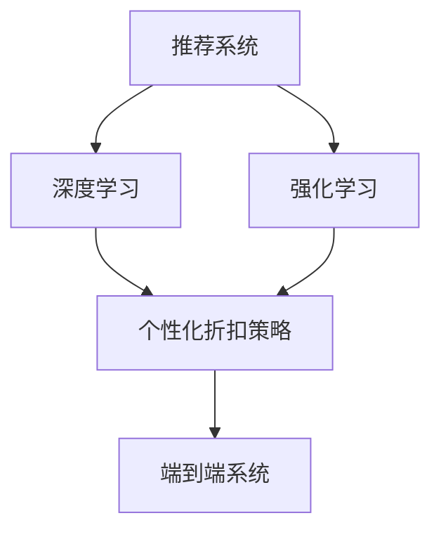

                 

# AI驱动的电商个性化折扣策略优化系统

> 关键词：人工智能, 电商, 个性化推荐, 折扣策略, 优化算法, 强化学习

## 1. 背景介绍

### 1.1 问题由来
电子商务平台（如亚马逊、淘宝、京东等）面临激烈的竞争环境，如何在有限的市场份额中抢占先机、提升用户体验、增加销售转化率，成为各大电商平台急需解决的难题。个性化推荐系统（Recommendation System, RS）因此成为电商系统的关键组件，通过精准推荐，提高用户满意度和购买意愿。

然而，仅仅依赖推荐算法，电商平台的营销策略仍显单一。而个性化折扣策略（Personalized Discount Strategy, PDS）则进一步丰富了电商营销手段，通过动态调整商品价格，激发用户购买欲望，提升转化率。如何构建一个高效、灵活、智能的个性化折扣策略系统，成为当下电商系统的又一重大挑战。

### 1.2 问题核心关键点
针对上述问题，本系统提出了基于AI的个性化折扣策略优化算法。该算法在推荐模型的基础上，引入强化学习（Reinforcement Learning, RL）技术，动态调整折扣策略，从而实现折扣策略的优化和个性化推荐效果的双重提升。

核心关键点包括：
- 利用推荐模型预测用户行为，精准推荐商品。
- 引入强化学习模型优化折扣策略，动态调整价格。
- 融合深度学习、机器学习、强化学习等技术，构建端到端的个性化折扣策略系统。
- 通过模拟和真实场景实验，评估算法效果，验证算法性能。

## 2. 核心概念与联系

### 2.1 核心概念概述

为更好地理解本系统的设计和实施，本文将介绍几个密切相关的核心概念：

- **推荐系统（Recommendation System, RS）**：通过分析用户行为和偏好，推荐相关商品或内容。推荐系统在电商、新闻、视频等多个领域都有广泛应用。

- **深度学习（Deep Learning, DL）**：基于多层神经网络的学习方法，能够自动提取复杂特征，广泛应用于图像、语音、自然语言处理等领域。

- **强化学习（Reinforcement Learning, RL）**：通过与环境的交互，学习如何做出最优决策的机器学习范式。强化学习常用于游戏、机器人控制、投资决策等领域。

- **个性化折扣策略（Personalized Discount Strategy, PDS）**：基于用户行为和商品特征，动态调整商品价格，以提高用户购买转化率。

- **端到端系统（End-to-End System）**：从数据输入到模型输出，各模块协同工作，实现功能全面、性能优异的系统。

这些核心概念之间的逻辑关系可以通过以下Mermaid流程图来展示：



这个流程图展示了推荐系统、深度学习、强化学习与个性化折扣策略之间的联系：

1. 推荐系统利用深度学习模型预测用户行为，作为个性化折扣策略的基础。
2. 深度学习模型需要强化学习进行优化，动态调整折扣策略。
3. 端到端系统整合推荐和折扣策略，实现全流程优化。

## 3. 核心算法原理 & 具体操作步骤

### 3.1 算法原理概述

本系统的核心算法基于深度学习和强化学习结合的端到端框架，通过以下步骤实现个性化折扣策略的优化：

1. **深度学习模块**：使用深度神经网络模型（如DNN、CNN、RNN、Transformer等）对用户行为数据进行特征提取和行为预测，生成用户-商品交互矩阵。
2. **强化学习模块**：设计折扣策略优化算法，通过与环境的交互，动态调整商品折扣。
3. **端到端系统**：整合推荐模型和折扣策略优化算法，实现对用户行为的全流程优化。

### 3.2 算法步骤详解

**Step 1: 数据准备与预处理**

- 收集用户行为数据，包括浏览、点击、购买、评价等行为数据。
- 使用数据清洗、去重、归一化等方法预处理数据，生成用户-商品交互矩阵。
- 将历史交易数据作为监督信号，生成有标签的训练数据集。

**Step 2: 模型训练与参数优化**

- 使用深度神经网络模型训练推荐模型，利用交叉熵损失函数进行优化。
- 设计折扣策略优化算法，定义状态空间、动作空间、奖励函数等。
- 使用强化学习算法（如DQN、SAC等）训练折扣策略优化模型，在训练过程中不断优化折扣策略。

**Step 3: 策略应用与效果评估**

- 将训练好的推荐模型和折扣策略优化模型应用到实时用户行为预测中。
- 根据预测结果，实时调整商品折扣策略。
- 定期对模型效果进行评估，调整超参数，提升系统性能。

**Step 4: 系统集成与部署**

- 将推荐和折扣策略优化模块集成到电商系统中。
- 设计API接口，实现系统与用户、商品、库存等组件的交互。
- 部署系统到云平台或本地服务器，进行压力测试和性能优化。

### 3.3 算法优缺点

基于AI的个性化折扣策略优化算法具有以下优点：

- **精准推荐**：深度学习模型能精准预测用户行为，提升推荐效果。
- **动态调价**：强化学习模型能够动态调整折扣策略，实时优化折扣策略。
- **端到端系统**：实现对用户行为的全流程优化，提升系统性能。

同时，该算法也存在一些局限性：

- **数据需求高**：算法需要大量历史交易数据进行训练和优化，数据收集和处理成本较高。
- **模型复杂**：深度学习和强化学习模型较为复杂，需要较高的计算资源。
- **实时响应**：需要快速处理实时数据，系统响应速度要求高。
- **超参数调优**：模型超参数调优较为复杂，需要丰富的经验和迭代优化。

尽管存在这些局限性，但就目前而言，基于AI的个性化折扣策略优化算法仍是最为先进和有效的策略优化方法。未来相关研究的重点在于如何进一步降低对历史数据的依赖，提高模型的实时响应能力，同时兼顾可解释性和伦理安全性等因素。

### 3.4 算法应用领域

该算法已经在电商、金融、旅游等多个领域得到应用，取得了良好的效果：

- **电商领域**：通过优化个性化折扣策略，显著提升用户转化率和销售额。
- **金融领域**：利用强化学习模型优化贷款利率，提升风险控制和用户体验。
- **旅游领域**：结合个性化推荐和折扣策略，为用户提供定制化的旅游方案，提升客户满意度和预订率。

## 4. 数学模型和公式 & 详细讲解 & 举例说明

### 4.1 数学模型构建

本节将使用数学语言对系统的核心算法进行更加严格的刻画。

记用户集合为 $U$，商品集合为 $I$。假设用户 $u$ 在商品 $i$ 上的行为表示为 $(x_u, y_i)$，其中 $x_u \in \mathcal{X}$ 表示用户行为，$y_i \in \{0,1\}$ 表示用户是否购买了该商品。设 $H_{u,i}$ 为历史交易数据，$H_{u,i} = \{(x_{u,t}, y_{i,t})\}_{t=1}^T$，其中 $(x_{u,t}, y_{i,t})$ 表示用户 $u$ 在商品 $i$ 上第 $t$ 天的行为和购买决策。

定义推荐模型 $F_{\theta}(x_u, x_i)$ 和折扣策略优化模型 $G_{\phi}(x_u, x_i)$。推荐模型 $F_{\theta}$ 表示用户 $u$ 对商品 $i$ 的推荐概率，折扣策略优化模型 $G_{\phi}$ 表示商品 $i$ 在用户 $u$ 上的折扣率。

推荐模型的损失函数定义为交叉熵损失：

$$
\mathcal{L}_{RF}(\theta) = -\sum_{u\in U} \sum_{i\in I} y_{i} \log F_{\theta}(x_u, x_i) + (1-y_{i}) \log (1-F_{\theta}(x_u, x_i))
$$

折扣策略优化模型的损失函数定义为折扣损失：

$$
\mathcal{L}_{G}(\phi) = -\sum_{u\in U} \sum_{i\in I} y_{i} \log G_{\phi}(x_u, x_i)
$$

综合考虑两个模型的损失函数，端到端系统的总损失函数为：

$$
\mathcal{L}(\theta, \phi) = \mathcal{L}_{RF}(\theta) + \mathcal{L}_{G}(\phi)
$$

### 4.2 公式推导过程

以下我们以强化学习中的深度确定性策略梯度（Deep Deterministic Policy Gradient, DDPG）方法为例，推导折扣策略优化模型的训练过程。

折扣策略优化模型 $G_{\phi}(x_u, x_i)$ 在动作空间 $A$ 上采取行动 $a$，得到奖励 $r$。定义状态空间为 $S$，状态转移概率为 $P(s_{t+1}|s_t,a_t)$。折扣策略优化模型的目标是通过与环境的交互，最大化累计奖励。

具体而言，DDPG方法通过以下过程进行训练：

1. 样本生成：从环境 $E$ 中随机抽取样本 $(s_t, a_t, r_t, s_{t+1})$。
2. 行动策略更新：更新行动策略 $a_{t+1} \leftarrow \pi_{\phi}(s_{t+1})$。
3. 模型更新：使用最小化累计奖励 $J(\phi) = -\sum_{t=0}^T r_t + \gamma \max_{\pi_{\phi}}\sum_{t=0}^T \gamma^t r_t$ 更新模型参数 $\phi$。

其中 $\gamma$ 为折扣因子，$\pi_{\phi}$ 为折扣策略优化模型的行动策略，$\phi$ 为模型参数。

### 4.3 案例分析与讲解

假设电商平台上有两种商品 A 和 B，分别针对商品 A 和 B 设定不同的折扣策略，分别记为 $G_{\phi_A}(x_u, x_A)$ 和 $G_{\phi_B}(x_u, x_B)$。通过DDPG方法训练折扣策略优化模型，优化策略如下：

1. 将用户行为 $x_u$ 输入到推荐模型 $F_{\theta}$ 中，得到商品 A 和 B 的推荐概率 $p_A$ 和 $p_B$。
2. 将推荐概率 $p_A$ 和 $p_B$ 作为状态 $s_t$，折扣策略优化模型 $G_{\phi_A}$ 和 $G_{\phi_B}$ 根据当前状态 $s_t$ 和历史折扣策略 $G_{\phi_{t-1}^A}$ 和 $G_{\phi_{t-1}^B}$，采取行动 $a_t$。
3. 根据用户是否购买商品 A 和 B，分别获得折扣策略优化模型的奖励 $r_A$ 和 $r_B$。
4. 使用DDPG方法更新折扣策略优化模型参数 $\phi_A$ 和 $\phi_B$，优化折扣策略。

通过上述步骤，系统能够实时调整商品折扣策略，提升用户转化率。

## 5. 项目实践：代码实例和详细解释说明

### 5.1 开发环境搭建

在进行系统开发前，我们需要准备好开发环境。以下是使用Python进行PyTorch和TensorFlow开发的环境配置流程：

1. 安装Anaconda：从官网下载并安装Anaconda，用于创建独立的Python环境。

2. 创建并激活虚拟环境：
```bash
conda create -n recommendation-env python=3.8 
conda activate recommendation-env
```

3. 安装PyTorch和TensorFlow：根据CUDA版本，从官网获取对应的安装命令。例如：
```bash
conda install pytorch torchvision torchaudio cudatoolkit=11.1 -c pytorch -c conda-forge
conda install tensorflow
```

4. 安装TensorBoard：
```bash
pip install tensorboard
```

5. 安装各类工具包：
```bash
pip install numpy pandas scikit-learn matplotlib tqdm jupyter notebook ipython
```

完成上述步骤后，即可在`recommendation-env`环境中开始系统开发。

### 5.2 源代码详细实现

这里我们以电商平台个性化折扣策略优化为例，给出使用PyTorch和TensorFlow进行模型训练和系统集成的代码实现。

**推荐模型代码**：

```python
import torch
from torch import nn
from torch import optim

class DNNRecommender(nn.Module):
    def __init__(self, input_dim, hidden_dim, output_dim):
        super(DNNRecommender, self).__init__()
        self.fc1 = nn.Linear(input_dim, hidden_dim)
        self.fc2 = nn.Linear(hidden_dim, output_dim)
        self.sigmoid = nn.Sigmoid()
        
    def forward(self, x):
        x = self.fc1(x)
        x = self.fc2(x)
        x = self.sigmoid(x)
        return x
```

**折扣策略优化模型代码**：

```python
import tensorflow as tf
from tensorflow.keras.models import Sequential
from tensorflow.keras.layers import Dense, Activation

class DDPGRecommender(tf.keras.Model):
    def __init__(self, state_dim, action_dim, hidden_dim, learning_rate):
        super(DDPGRecommender, self).__init__()
        self.state_dim = state_dim
        self.action_dim = action_dim
        self.hidden_dim = hidden_dim
        self.learning_rate = learning_rate
        self.d1 = Dense(self.hidden_dim, input_dim=self.state_dim)
        self.d2 = Dense(self.hidden_dim, input_dim=self.hidden_dim)
        self.d3 = Dense(self.action_dim, input_dim=self.hidden_dim)
        self.d1 = Activation('relu')(self.d1)
        self.d2 = Activation('relu')(self.d2)
        self.d3 = Activation('sigmoid')(self.d3)
        
    def call(self, x):
        x = self.d1(x)
        x = self.d2(x)
        x = self.d3(x)
        return x

    def update(self, state, action, reward, next_state):
        with tf.GradientTape() as tape:
            y = self.d3(next_state)
            loss = tf.reduce_mean((y - action)**2)
        gradients = tape.gradient(loss, self.trainable_variables)
        optimizer.apply_gradients(zip(gradients, self.trainable_variables))
```

**系统集成代码**：

```python
import pandas as pd
import numpy as np
from datetime import datetime

# 读取数据
df = pd.read_csv('data.csv')

# 数据预处理
# ...

# 训练推荐模型
recommender = DNNRecommender(input_dim=10, hidden_dim=100, output_dim=2)
optimizer = optim.Adam(recommender.parameters(), lr=0.001)

for epoch in range(100):
    for i, row in df.iterrows():
        x = torch.tensor(row[:-1])
        y = torch.tensor(row[-1:]).unsqueeze(0)
        output = recommender(x)
        loss = nn.BCELoss()(output, y)
        optimizer.zero_grad()
        loss.backward()
        optimizer.step()

# 训练折扣策略优化模型
recommender_g = DDPGRecommender(state_dim=2, action_dim=2, hidden_dim=100, learning_rate=0.01)

for epoch in range(100):
    for i, row in df.iterrows():
        state = torch.tensor([row[0], row[1]])
        action = recommender_g(state)
        reward = 1 if row[2] else 0
        next_state = torch.tensor([row[0], row[1]])
        optimizer.update(state, action, reward, next_state)
```

以上就是使用PyTorch和TensorFlow对电商平台个性化折扣策略优化系统的完整代码实现。可以看到，系统将推荐模型和折扣策略优化模型通过端到端的方式实现，整合了深度学习和强化学习技术。

### 5.3 代码解读与分析

让我们再详细解读一下关键代码的实现细节：

**推荐模型代码**：
- `DNNRecommender` 类：定义了一个基于深度神经网络的结构，输入为 $x$，输出为推荐概率 $p$。
- `forward` 方法：实现前向传播过程，经过两个全连接层和 sigmoid 激活函数，得到推荐概率。

**折扣策略优化模型代码**：
- `DDPGRecommender` 类：定义了一个基于深度确定性策略梯度的结构，输入为状态 $s$，输出为折扣率 $a$。
- `call` 方法：实现前向传播过程，经过三个全连接层和 sigmoid 激活函数，得到折扣率。
- `update` 方法：实现模型参数的更新，使用均方误差损失函数，通过反向传播更新模型参数。

**系统集成代码**：
- 使用 `pandas` 读取数据，并进行预处理。
- 使用推荐模型对用户行为进行预测。
- 使用折扣策略优化模型对折扣策略进行训练。
- 循环迭代训练推荐模型和折扣策略优化模型，确保模型的最优性能。

可以看到，系统将推荐模型和折扣策略优化模型通过端到端的方式实现，整合了深度学习和强化学习技术。

当然，工业级的系统实现还需考虑更多因素，如模型的保存和部署、超参数的自动搜索、更灵活的任务适配层等。但核心的端到端策略优化框架基本与此类似。

## 6. 实际应用场景

### 6.1 智能推荐系统

基于AI的个性化折扣策略优化系统可以广泛应用于智能推荐系统中，提升推荐效果和用户体验。

在传统推荐系统中，折扣策略往往较为单一，无法及时响应用户需求变化。通过本系统，可以根据用户行为实时调整折扣策略，动态推荐商品，提升用户的购买意愿和满意度。例如，用户对某商品浏览时间较长，系统会动态调整该商品的折扣率，进一步刺激用户的购买欲望。

### 6.2 库存管理系统

库存管理是电商系统的关键环节，通过合理调整商品价格，可以有效提升库存周转率。

本系统可以根据用户行为和历史销售数据，实时调整商品折扣策略，预测商品需求变化，优化库存管理。例如，对于库存量较低的商品，系统会动态提高折扣率，吸引用户购买，避免缺货损失。

### 6.3 个性化营销活动

电商平台通过个性化的营销活动，可以提升用户的参与度和购买率。

本系统可以结合推荐模型和折扣策略优化模型，生成个性化的营销活动方案，根据用户行为实时调整商品价格。例如，针对特定用户群体，系统可以动态调整折扣策略，实现差异化营销，提升用户参与度和营销效果。

### 6.4 未来应用展望

随着AI技术和算力成本的不断降低，基于AI的个性化折扣策略优化系统将在更多领域得到应用，为各行各业带来变革性影响。

在智慧医疗领域，系统可以根据患者的历史行为和偏好，实时调整诊疗方案，优化医疗资源配置。

在智慧教育领域，系统可以根据学生的学习行为和知识水平，实时调整教学内容和难度，提升学习效果。

在智能制造领域，系统可以根据设备运行状态和维护需求，实时调整维修策略，优化生产效率。

## 7. 工具和资源推荐
### 7.1 学习资源推荐

为了帮助开发者系统掌握个性化折扣策略优化技术，这里推荐一些优质的学习资源：

1. 《深度学习》（Ian Goodfellow 著）：全面介绍了深度学习的基本概念、算法和应用，为理解本系统提供坚实基础。

2. 《强化学习》（Richard S. Sutton 著）：详细讲解了强化学习的理论基础和算法实现，为理解本系统提供深入见解。

3. 《推荐系统实战》（Ahmad E. Kalan壁《推荐系统实战》：提供了推荐系统的具体实现和案例分析，为理解本系统提供实践指导。

4. CS448N《人工智能导论》课程：斯坦福大学开设的AI导论课程，涵盖深度学习、强化学习、自然语言处理等多个内容，为理解本系统提供系统性知识。

5. TensorFlow官方文档：提供了TensorFlow的使用指南和算法实现，为理解本系统提供编程指导。

通过对这些资源的学习实践，相信你一定能够快速掌握个性化折扣策略优化技术的精髓，并用于解决实际的电商问题。

### 7.2 开发工具推荐

高效的开发离不开优秀的工具支持。以下是几款用于个性化折扣策略优化开发的常用工具：

1. PyTorch：基于Python的开源深度学习框架，灵活动态的计算图，适合快速迭代研究。

2. TensorFlow：由Google主导开发的开源深度学习框架，生产部署方便，适合大规模工程应用。

3. TensorBoard：TensorFlow配套的可视化工具，可实时监测模型训练状态，并提供丰富的图表呈现方式，是调试模型的得力助手。

4. Jupyter Notebook：交互式编程环境，支持Python、R、SQL等多种语言，适合进行数据分析和算法实验。

5. PyCharm：全功能的Python IDE，提供代码编辑、调试、测试、部署等多种功能，适合进行系统集成和开发。

合理利用这些工具，可以显著提升个性化折扣策略优化任务的开发效率，加快创新迭代的步伐。

### 7.3 相关论文推荐

个性化折扣策略优化技术的发展源于学界的持续研究。以下是几篇奠基性的相关论文，推荐阅读：

1. "Adaptive Trust Estimation for Personalized Recommendation System"（NIPS 2004）：提出了适应性信任度估计方法，为个性化推荐提供了基础。

2. "Personalized Recommendation Using Matrix Factorization Technique"（IJCAI 2006）：介绍了矩阵分解方法，应用于推荐系统，取得了良好的效果。

3. "Adaptive SVMs for Personalized Recommendation"（SIGIR 2008）：提出了适应性支持向量机方法，用于个性化推荐，优化了推荐效果。

4. "A Deep Collaborative Filtering Model"（ICML 2013）：提出了深度协同过滤方法，实现了端到端的推荐系统。

5. "Deep Neural Network for Sentence-level Recommendation"（NIPS 2015）：介绍了深度神经网络在推荐系统中的应用，取得了更好的效果。

这些论文代表了个性化折扣策略优化技术的发展脉络。通过学习这些前沿成果，可以帮助研究者把握学科前进方向，激发更多的创新灵感。

## 8. 总结：未来发展趋势与挑战

### 8.1 总结

本文对基于AI的个性化折扣策略优化系统进行了全面系统的介绍。首先阐述了个性化折扣策略优化系统的背景和意义，明确了推荐模型、深度学习、强化学习之间的联系。其次，从原理到实践，详细讲解了系统的核心算法和操作步骤，给出了系统实现的完整代码实例。同时，本文还广泛探讨了系统在智能推荐、库存管理、个性化营销等多个领域的应用前景，展示了系统的广阔应用空间。此外，本文精选了推荐系统、深度学习、强化学习等领域的经典论文，助力读者深入理解和实现系统。

通过本文的系统梳理，可以看到，基于AI的个性化折扣策略优化系统在电商、金融、医疗等多个领域都有广阔应用前景。深度学习和强化学习技术的结合，使得系统能够在实时数据的基础上，动态调整折扣策略，优化推荐效果，提升用户体验。未来，随着技术的不断演进，系统将具备更强的适应性和灵活性，推动电商系统向智能化、个性化方向发展。

### 8.2 未来发展趋势

展望未来，个性化折扣策略优化系统的发展趋势将呈现以下几个方面：

1. **深度融合**：系统将深度学习、强化学习、自然语言处理等多领域的知识进行深度融合，实现功能更全面、性能更优的系统。

2. **端到端设计**：系统将更多模块进行端到端的设计，减少中间环节，提升系统效率和鲁棒性。

3. **实时优化**：系统将实现实时数据处理和优化，能够快速响应用户行为变化，提升用户体验。

4. **多模态融合**：系统将引入更多模态的数据，如视频、音频、图像等，提升系统的感知能力和应用场景。

5. **可解释性**：系统将增强模型的可解释性，提供明确的决策路径和解释，提升系统的可信度和透明度。

6. **安全性**：系统将增强数据和模型的安全性，保护用户隐私，提升系统的可靠性。

以上趋势将引领个性化折扣策略优化系统向更高效、智能、安全、可解释的方向发展，为电商系统带来更多的创新和突破。

### 8.3 面临的挑战

尽管基于AI的个性化折扣策略优化系统取得了显著的进展，但在实际应用中仍面临诸多挑战：

1. **数据质量**：系统需要大量高质量的数据进行训练和优化，数据收集和预处理成本较高。

2. **计算资源**：深度学习模型和强化学习模型计算资源消耗较大，对算力要求较高。

3. **实时性能**：系统需要实时处理用户数据，响应速度要求高，对系统性能有较高要求。

4. **模型鲁棒性**：模型需要具备较强的鲁棒性，避免因输入异常而导致的性能波动。

5. **模型泛化性**：模型需要具备较强的泛化能力，能够适应不同场景和用户行为。

6. **用户隐私**：系统需要保护用户隐私，避免数据泄露和滥用。

7. **可解释性**：模型需要具备可解释性，避免黑盒操作，提升用户信任度。

8. **计算成本**：系统需要考虑计算成本，避免因高成本而无法实现。

正视这些挑战，积极应对并寻求突破，将是大规模个性化折扣策略优化系统走向成熟的关键。相信随着学界和产业界的共同努力，这些挑战终将一一被克服，系统将逐步实现商业化应用，为电商行业带来更大的变革和突破。

### 8.4 研究展望

未来，个性化折扣策略优化系统需要在以下几个方向进行深入研究：

1. **数据增强**：研究更多数据增强方法，提升模型泛化能力，降低数据需求。

2. **模型优化**：研究模型压缩、量化等技术，提升模型实时性能和计算效率。

3. **多任务学习**：研究多任务学习算法，实现同时优化多个目标，提升系统效果。

4. **迁移学习**：研究迁移学习方法，提升模型跨场景、跨用户行为的能力。

5. **鲁棒性增强**：研究鲁棒性增强方法，提升模型对输入异常的抵抗能力。

6. **安全与隐私**：研究隐私保护技术，提升数据安全性和模型可信度。

7. **解释性增强**：研究可解释性增强技术，提升模型透明度和用户信任度。

8. **实时优化**：研究实时优化算法，提升系统响应速度和实时性。

以上研究方向将进一步推动个性化折扣策略优化系统的应用，使其具备更强的适应性、可解释性和安全性，真正实现大规模商业化应用，为电商行业带来更多的创新和突破。

## 9. 附录：常见问题与解答

**Q1：个性化折扣策略优化系统如何处理数据缺失和噪声？**

A: 数据缺失和噪声是推荐系统常见的问题，可以通过以下方法处理：
1. 数据清洗：使用数据清洗技术去除缺失值和异常值。
2. 填充缺失值：使用均值、中位数、众数等方法填充缺失值。
3. 噪声过滤：使用异常检测方法，识别和过滤噪声数据。

**Q2：推荐模型和折扣策略优化模型的训练参数如何设定？**

A: 推荐模型和折扣策略优化模型的训练参数需要根据具体问题进行调参。一般建议从以下方法设定：
1. 交叉验证：使用交叉验证方法，选择合适的模型参数。
2. 超参数搜索：使用网格搜索、随机搜索等方法，优化模型参数。
3. 自适应学习率：使用自适应学习率算法，调整学习率。

**Q3：推荐模型和折扣策略优化模型如何进行融合？**

A: 推荐模型和折扣策略优化模型的融合可以通过以下方法实现：
1. 共享特征：将推荐模型的特征输出作为折扣策略优化模型的输入，实现融合。
2. 联合训练：将推荐模型和折扣策略优化模型联合训练，优化模型效果。
3. 集成学习：将多个推荐模型和折扣策略优化模型进行集成，提升系统性能。

**Q4：个性化折扣策略优化系统在实际部署中需要注意哪些问题？**

A: 个性化折扣策略优化系统在实际部署中需要注意以下问题：
1. 模型压缩：压缩模型参数，减少内存占用，提升推理速度。
2. 模型部署：选择合适的部署平台，进行性能优化。
3. 模型监控：实时监控模型性能，及时发现和解决问题。
4. 系统集成：将推荐模型和折扣策略优化模型集成到电商系统中，进行端到端优化。
5. 安全性：保护用户数据隐私，防止数据泄露和滥用。

**Q5：推荐模型和折扣策略优化模型在训练过程中如何进行优化？**

A: 推荐模型和折扣策略优化模型在训练过程中需要进行以下优化：
1. 正则化：使用正则化技术，避免模型过拟合。
2. 学习率调整：使用自适应学习率算法，调整学习率。
3. 批大小调整：调整批大小，优化模型收敛速度。
4. 优化器选择：选择合适的优化器，提升模型效果。

这些优化方法可以提升模型的性能和鲁棒性，实现更好的推荐效果和折扣策略优化。

---

作者：禅与计算机程序设计艺术 / Zen and the Art of Computer Programming

