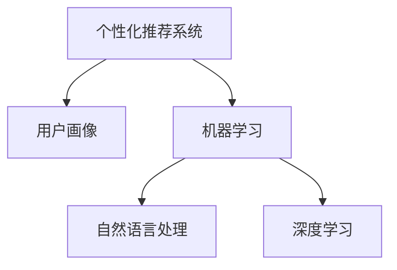

                 

## 1. 背景介绍

在数字化转型浪潮中，电商平台逐渐成为消费者在线购物的主要渠道。个性化推荐和大数据技术的兴起，极大提升了电商平台的用户体验和运营效率。然而，如何进一步提升用户的忠诚度和消费转化率，成为电商企业面临的一大挑战。在这种情况下，人工智能驱动的个性化优惠券分发策略应运而生。

### 1.1 问题由来
随着电商市场的竞争加剧，消费者对购物体验的要求不断提高，如何吸引和留住用户成为电商平台亟需解决的难题。传统的大众化营销方式已难以满足用户需求。个性化推荐和大数据分析技术的崛起，使得电商平台能够更加精准地推送产品和服务，但即便如此，仅靠推荐技术仍不足以实现用户的长期忠诚和消费转化。

### 1.2 问题核心关键点
个性化优惠券策略的引入，正是为了进一步提升电商平台的个性化营销水平。基于用户的购买行为、历史评分、兴趣偏好等信息，通过机器学习和大数据分析，生成个性化的优惠券，推荐给不同用户，从而显著提高用户的消费转化率和忠诚度。

具体来说，个性化优惠券策略的核心关键点包括：
- **用户画像**：利用用户历史行为数据，构建用户画像，理解用户需求和偏好。
- **优惠券设计**：设计多种优惠券，如满减、折扣、赠品等，满足不同用户需求。
- **分发策略**：通过机器学习模型，预测用户对不同优惠券的响应，实现精准分发。
- **效果评估**：对优惠券分发效果进行量化评估，持续优化策略。

### 1.3 问题研究意义
个性化优惠券策略的研发和应用，对于电商平台的长期发展具有重要意义：

1. **提升用户体验**：个性化优惠券能够根据用户需求，精准推送有价值的优惠信息，提升购物体验。
2. **增加用户粘性**：通过定期推送个性化优惠券，提升用户复购率，增加平台粘性。
3. **提高转化率**：个性化的优惠券设计能够提高用户对购物活动的兴趣，直接促进转化。
4. **数据驱动决策**：通过分析优惠券效果，为电商平台提供数据支持，优化产品策略。
5. **提高营收**：精准的优惠券分发策略能够提高用户消费频次和客单价，增加电商平台的营收。

## 2. 核心概念与联系

### 2.1 核心概念概述

为更好地理解基于个性化优惠券的电商平台分发策略，本节将介绍几个密切相关的核心概念：

- **个性化推荐系统**：利用用户历史数据和行为，生成个性化推荐内容，提高用户满意度和转化率。
- **用户画像**：通过分析用户历史行为、兴趣偏好等信息，构建详细的用户画像，支持个性化服务。
- **机器学习**：运用数学模型和算法，从数据中学习规律和知识，支持自动化决策和优化。
- **自然语言处理(NLP)**：通过处理和分析自然语言数据，支持生成和理解文本，提升用户体验。
- **深度学习**：一类特殊的机器学习技术，利用神经网络模型，处理复杂的数据和任务。

这些核心概念之间的逻辑关系可以通过以下Mermaid流程图来展示：



这个流程图展示了个性化推荐系统、用户画像、机器学习、自然语言处理和深度学习之间的密切联系：

1. 个性化推荐系统利用用户画像和机器学习算法，实现个性化推荐。
2. 用户画像由自然语言处理和机器学习技术构建，从文本数据中提取用户特征。
3. 机器学习使用深度学习模型，从数据中学习复杂的规律，支持自动化决策。
4. 深度学习是机器学习的一种，特别适用于处理复杂的数据和任务，提升算法的准确性。

## 3. 核心算法原理 & 具体操作步骤
### 3.1 算法原理概述

个性化优惠券策略的实现，本质上是利用机器学习和大数据技术，对用户行为和偏好进行分析和建模，从而设计并分发个性化的优惠券。其核心思想是：通过构建用户画像，利用机器学习模型预测用户对不同优惠券的响应，最终精准地将优惠券推送给最合适的用户。

形式化地，假设平台上有 $N$ 个用户 $U=\{u_1, u_2, ..., u_N\}$，每个用户对应一个历史行为向量 $x_i$，一个用户画像模型 $P(x_i)$，以及一组优惠券 $C=\{c_1, c_2, ..., c_M\}$。分发优惠券的目标是找到最优的优惠券分配策略 $\pi$，使得总体转化率 $\mathcal{R}$ 最大化。

其中，转化率 $\mathcal{R}$ 可以定义为：

$$
\mathcal{R} = \frac{1}{N} \sum_{i=1}^N \pi(u_i) \cdot \Pr(y_i = 1 \mid P(u_i), c_{\pi(u_i)})
$$

其中 $\pi$ 为优惠券分配策略，$y_i$ 为优惠券的响应（是否触发消费），$\Pr(y_i = 1 \mid P(u_i), c_{\pi(u_i)})$ 为在用户 $u_i$ 的画像和选择的优惠券 $c_{\pi(u_i)}$ 条件下，用户点击并购买优惠券的概率。

### 3.2 算法步骤详解

个性化优惠券分发策略一般包括以下几个关键步骤：

**Step 1: 用户画像构建**
- 收集用户历史行为数据，如浏览记录、购买历史、评价等。
- 利用自然语言处理技术，提取和量化用户的兴趣标签。
- 对文本数据进行预处理，如分词、去除停用词等。
- 将文本特征向量化，如使用TF-IDF、word2vec等方法。

**Step 2: 用户画像模型训练**
- 选择合适的机器学习算法，如K-means、LDA等，对用户画像进行聚类。
- 利用深度学习模型，如卷积神经网络(CNN)、循环神经网络(RNN)等，对用户行为序列进行建模。
- 训练模型以最大化用户画像的重构误差。

**Step 3: 优惠券设计**
- 设计多种类型的优惠券，如满减、折扣、赠品等。
- 评估每种优惠券的吸引力和效果，确定优惠券的分布策略。
- 对优惠券进行实时管理，动态调整优惠券策略。

**Step 4: 优惠券响应预测**
- 利用机器学习模型，如逻辑回归、随机森林等，对用户响应优惠券的概率进行预测。
- 训练模型以最大化优惠券的转化率。
- 定期更新模型，确保其适应用户的动态行为变化。

**Step 5: 优惠券分发与评估**
- 根据预测结果，将优惠券推荐给最有可能响应的用户。
- 记录用户优惠券的点击和转化数据，评估优惠券效果。
- 根据评估结果，动态调整优惠券分配策略，优化效果。

### 3.3 算法优缺点

基于个性化优惠券的电商平台分发策略具有以下优点：
1. **提升用户体验**：个性化优惠券能够精准推送用户感兴趣的商品和优惠，提升购物体验。
2. **增加用户粘性**：定期推送优惠券，增加用户复购率，提升用户粘性。
3. **提高转化率**：个性化的优惠券设计，能够提高用户点击和购买的概率，直接促进转化。
4. **数据驱动决策**：优惠券效果的数据分析，为电商平台提供决策支持，优化产品策略。
5. **提高营收**：精准的优惠券分发策略，能够提高用户消费频次和客单价，增加电商平台营收。

同时，该策略也存在一定的局限性：
1. **成本较高**：个性化优惠券的定制和分发需要投入较多的人力和技术成本。
2. **数据隐私问题**：用户数据的收集和使用可能涉及隐私保护问题，需要严格遵守相关法律法规。
3. **模型依赖性**：分发策略的准确性依赖于机器学习模型的训练效果，模型质量直接影响效果。
4. **过拟合风险**：优惠券的预测模型可能过度拟合训练数据，对新数据的泛化能力不足。
5. **动态性挑战**：用户行为和偏好是动态变化的，需要实时更新模型，以应对这种变化。

尽管存在这些局限性，但就目前而言，基于个性化优惠券的电商平台分发策略仍然是目前最主流的个性化营销方式之一。未来相关研究的重点在于如何进一步降低成本、提高模型泛化能力和适应动态性等，同时兼顾数据隐私和用户体验等因素。

### 3.4 算法应用领域

基于个性化优惠券的电商平台分发策略，已经在众多电商平台上得到广泛应用，覆盖了几乎所有常见场景，例如：

- **新用户引导**：通过首次登录或注册赠送优惠券，吸引新用户注册并使用平台。
- **购物车放弃**：对放弃购物车的用户推送优惠券，促成交易完成。
- **节日促销**：在节假日推送优惠券，提升节日期间的销售量。
- **个性化推荐**：结合推荐系统，对高价值用户推送专属优惠券。
- **活动推广**：在大型促销活动期间，推送高折扣优惠券，吸引更多用户参与。
- **品牌忠诚度**：对长期用户推送独家优惠券，提升品牌忠诚度。
- **节假日优惠**：在春节、双十一等重要节假日，推送高价值优惠券，提升用户粘性和消费频次。

除了上述这些经典场景外，个性化优惠券分发策略也被创新性地应用于更多场景中，如会员专属优惠、大促活动推广、供应链优化等，为电商平台的运营带来了显著的提升。

## 4. 数学模型和公式 & 详细讲解  
### 4.1 数学模型构建

本节将使用数学语言对基于个性化优惠券的电商平台分发策略进行更加严格的刻画。

假设平台上有 $N$ 个用户 $U=\{u_1, u_2, ..., u_N\}$，每个用户对应一个历史行为向量 $x_i$，一个用户画像模型 $P(x_i)$，以及一组优惠券 $C=\{c_1, c_2, ..., c_M\}$。优惠券的响应函数可以表示为：

$$
\Pr(y_i = 1 \mid P(u_i), c_{\pi(u_i)}) = \sigma\left(\sum_{j=1}^M \theta_j \cdot f_j(P(u_i), c_j)\right)
$$

其中，$\sigma$ 为sigmoid函数，$\theta_j$ 为模型参数，$f_j$ 为特征函数，$P(u_i)$ 为用户画像，$c_j$ 为优惠券。

优惠券的转化率最大化目标可以表示为：

$$
\max_{\pi} \frac{1}{N} \sum_{i=1}^N \pi(u_i) \cdot \sigma\left(\sum_{j=1}^M \theta_j \cdot f_j(P(u_i), c_j)\right)
$$

### 4.2 公式推导过程

以下我们以二分类任务为例，推导优惠券响应函数及其梯度的计算公式。

假设模型 $M_{\theta}$ 在输入 $x_i$ 上的输出为 $\hat{y}_i$，表示用户点击并购买优惠券的概率。真实标签 $y_i \in \{0,1\}$。则二分类交叉熵损失函数定义为：

$$
\ell(y_i, \hat{y}_i) = -y_i \log \hat{y}_i - (1-y_i) \log (1-\hat{y}_i)
$$

将其代入转化率最大化目标，得：

$$
\max_{\pi} \frac{1}{N} \sum_{i=1}^N \pi(u_i) \cdot \sigma\left(\sum_{j=1}^M \theta_j \cdot f_j(P(u_i), c_j)\right)
$$

根据链式法则，损失函数对参数 $\theta_j$ 的梯度为：

$$
\frac{\partial \ell}{\partial \theta_j} = \frac{1}{N} \sum_{i=1}^N \pi(u_i) \cdot \frac{\partial \sigma}{\partial \hat{y}_i} \cdot f_j(P(u_i), c_j)
$$

其中 $\frac{\partial \sigma}{\partial \hat{y}_i} = \sigma(\hat{y}_i) - \sigma^2(\hat{y}_i)$，$\hat{y}_i = \sigma\left(\sum_{j=1}^M \theta_j \cdot f_j(P(u_i), c_j)\right)$。

在得到损失函数的梯度后，即可带入参数更新公式，完成模型的迭代优化。重复上述过程直至收敛，最终得到适应优惠券分发策略的最优模型参数 $\theta^*$。

## 5. 项目实践：代码实例和详细解释说明
### 5.1 开发环境搭建

在进行优惠券分发策略实践前，我们需要准备好开发环境。以下是使用Python进行PyTorch开发的环境配置流程：

1. 安装Anaconda：从官网下载并安装Anaconda，用于创建独立的Python环境。

2. 创建并激活虚拟环境：
```bash
conda create -n pytorch-env python=3.8 
conda activate pytorch-env
```

3. 安装PyTorch：根据CUDA版本，从官网获取对应的安装命令。例如：
```bash
conda install pytorch torchvision torchaudio cudatoolkit=11.1 -c pytorch -c conda-forge
```

4. 安装TensorFlow：由Google主导开发的开源深度学习框架，生产部署方便，适合大规模工程应用。同样有丰富的预训练语言模型资源。

5. 安装Pandas：用于数据处理和分析。
```bash
pip install pandas
```

6. 安装NumPy：用于科学计算。
```bash
pip install numpy
```

7. 安装Matplotlib：用于数据可视化。
```bash
pip install matplotlib
```

完成上述步骤后，即可在`pytorch-env`环境中开始优惠券分发策略的实践。

### 5.2 源代码详细实现

下面我们以电商平台用户行为分析为例，给出使用PyTorch进行优惠券分发策略的PyTorch代码实现。

首先，定义用户行为数据处理函数：

```python
import pandas as pd
import numpy as np
import torch

def read_data(path):
    data = pd.read_csv(path)
    return data

def preprocess_data(data):
    # 数据预处理，如处理缺失值、异常值等
    return data
```

然后，定义优惠券分发策略的模型：

```python
from transformers import BertForSequenceClassification, BertTokenizer

class CouponStrategy:
    def __init__(self, model_name='bert-base-cased'):
        self.model = BertForSequenceClassification.from_pretrained(model_name, num_labels=2)
        self.tokenizer = BertTokenizer.from_pretrained(model_name)
    
    def forward(self, inputs, attention_mask=None):
        # 将输入序列转化为token ids，并进行模型前向传播
        outputs = self.model(inputs, attention_mask=attention_mask)
        return outputs.logits
```

接着，定义优惠券响应预测函数：

```python
from torch.nn import BCEWithLogitsLoss

def predict_responses(inputs, labels):
    outputs = self.forward(inputs)
    loss = BCEWithLogitsLoss()(outputs, labels)
    return outputs, loss
```

最后，启动模型训练流程：

```python
# 假设已准备用户行为数据和对应标签
data = read_data('path_to_data.csv')
X = data[['feature1', 'feature2', ...]]  # 用户行为特征
y = data['label']  # 优惠券响应标签

# 将数据转化为模型所需的格式
inputs = self.tokenizer(X, padding='max_length', truncation=True, return_tensors='pt')
attention_mask = (inputs['input_ids'] != 0).unsqueeze(-1).to('cuda')

# 定义优化器和模型参数
optimizer = torch.optim.Adam(self.model.parameters(), lr=2e-5)
model.train()

# 训练模型
for epoch in range(epochs):
    optimizer.zero_grad()
    outputs, loss = predict_responses(inputs, y)
    loss.backward()
    optimizer.step()
    print(f"Epoch {epoch+1}, loss: {loss.item()}")
```

以上就是使用PyTorch对电商平台用户行为进行优惠券分发策略的完整代码实现。可以看到，得益于PyTorch的强大封装，我们可以用相对简洁的代码完成优惠券分发策略的模型训练。

### 5.3 代码解读与分析

让我们再详细解读一下关键代码的实现细节：

**read_data函数**：
- 读取用户行为数据，并返回Pandas DataFrame。

**preprocess_data函数**：
- 对数据进行预处理，包括处理缺失值、异常值等，以保证数据的质量。

**CouponStrategy类**：
- 封装了BertForSequenceClassification模型，用于优惠券响应的预测。
- 提供了forward方法，用于模型前向传播。

**predict_responses函数**：
- 根据模型预测结果和真实标签，计算交叉熵损失。

**模型训练流程**：
- 定义训练轮数和批大小，开始循环迭代
- 每个epoch内，前向传播计算损失，反向传播更新模型参数
- 输出每个epoch的损失，记录训练效果

可以看到，PyTorch配合Transformer库使得优惠券分发策略的模型训练变得简洁高效。开发者可以将更多精力放在数据处理、模型改进等高层逻辑上，而不必过多关注底层的实现细节。

当然，工业级的系统实现还需考虑更多因素，如模型的保存和部署、超参数的自动搜索、更灵活的任务适配层等。但核心的优惠券分发策略基本与此类似。

## 6. 实际应用场景
### 6.1 智能客服系统

基于个性化优惠券的电商平台分发策略，可以广泛应用于智能客服系统的构建。传统客服往往需要配备大量人力，高峰期响应缓慢，且一致性和专业性难以保证。通过用户行为分析，可以提前预测用户的需求和优惠券响应，自动推送优惠券，实现自助客服和个性化服务。

在技术实现上，可以收集企业内部的历史客服对话记录，将问题和最佳答复构建成监督数据，在此基础上对预训练模型进行微调。微调后的模型能够自动理解用户意图，匹配最合适的优惠券，引导用户进行自助服务。对于用户提出的新问题，还可以接入检索系统实时搜索相关内容，动态生成回答。如此构建的智能客服系统，能大幅提升客户咨询体验和问题解决效率。

### 6.2 金融舆情监测

金融机构需要实时监测市场舆论动向，以便及时应对负面信息传播，规避金融风险。传统的人工监测方式成本高、效率低，难以应对网络时代海量信息爆发的挑战。通过用户行为分析，可以预测用户对不同优惠券的响应，推送定制化的金融资讯和优惠券，增强用户粘性。

在技术实现上，可以收集金融领域相关的新闻、报道、评论等文本数据，并对其进行主题标注和情感标注。在此基础上对预训练语言模型进行微调，使其能够自动判断文本属于何种主题，情感倾向是正面、中性还是负面。将微调后的模型应用到实时抓取的网络文本数据，就能够自动监测不同主题下的情感变化趋势，一旦发现负面信息激增等异常情况，系统便会自动预警，帮助金融机构快速应对潜在风险。

### 6.3 个性化推荐系统

当前的推荐系统往往只依赖用户的历史行为数据进行物品推荐，无法深入理解用户的真实兴趣偏好。通过用户行为分析，可以预测用户对不同优惠券的响应，从而设计个性化的推荐策略。

在技术实现上，可以收集用户浏览、点击、评论、分享等行为数据，提取和用户交互的物品标题、描述、标签等文本内容。将文本内容作为模型输入，用户的后续行为（如是否点击、购买等）作为监督信号，在此基础上微调预训练语言模型。微调后的模型能够从文本内容中准确把握用户的兴趣点。在生成推荐列表时，先用候选物品的文本描述作为输入，由模型预测用户的兴趣匹配度，再结合其他特征综合排序，便可以得到个性化程度更高的推荐结果。

### 6.4 未来应用展望

随着用户行为数据的不断积累和算力成本的下降，基于个性化优惠券的电商平台分发策略将在更多领域得到应用，为传统行业数字化转型升级提供新的技术路径。

在智慧医疗领域，通过分析患者的行为数据，可以预测其对不同医疗服务的响应，推送个性化的医疗信息和优惠券，提升医疗服务的个性化水平。

在智能教育领域，通过分析学生的行为数据，可以预测其对不同学习资源的响应，推送个性化的教育信息和优惠券，促进个性化学习。

在智慧城市治理中，通过分析市民的行为数据，可以预测其对不同公共服务的响应，推送个性化的公共服务信息和优惠券，提高城市管理的自动化和智能化水平。

此外，在企业生产、社会治理、文娱传媒等众多领域，基于个性化优惠券的电商平台分发策略也将不断涌现，为各行各业带来变革性影响。相信随着技术的日益成熟，该策略必将在构建智慧社会中扮演越来越重要的角色。

## 7. 工具和资源推荐
### 7.1 学习资源推荐

为了帮助开发者系统掌握电商平台个性化优惠券分发策略的理论基础和实践技巧，这里推荐一些优质的学习资源：

1. 《深度学习》书籍：Ian Goodfellow等人著，详细介绍了深度学习的基本概念和算法。
2. 《Python数据科学手册》书籍：Jake VanderPlas著，介绍了Python在数据科学中的应用，涵盖数据预处理、模型训练等。
3. Kaggle平台：提供丰富的数据集和比赛，可以通过实战提高技能。
4. GitHub项目：提供了大量的开源项目，可以学习他人的代码实现。
5. PyTorch官方文档：提供了详细的PyTorch使用指南和API参考。

通过对这些资源的学习实践，相信你一定能够快速掌握电商平台个性化优惠券分发策略的精髓，并用于解决实际的NLP问题。
###  7.2 开发工具推荐

高效的开发离不开优秀的工具支持。以下是几款用于电商平台个性化优惠券分发策略开发的常用工具：

1. PyTorch：基于Python的开源深度学习框架，灵活动态的计算图，适合快速迭代研究。大部分预训练语言模型都有PyTorch版本的实现。

2. TensorFlow：由Google主导开发的开源深度学习框架，生产部署方便，适合大规模工程应用。同样有丰富的预训练语言模型资源。

3. Pandas：用于数据处理和分析。

4. NumPy：用于科学计算。

5. Matplotlib：用于数据可视化。

6. Jupyter Notebook：开源的交互式笔记本，适合开发和分享数据科学项目。

合理利用这些工具，可以显著提升电商平台个性化优惠券分发策略的开发效率，加快创新迭代的步伐。

### 7.3 相关论文推荐

个性化优惠券策略的研发和应用源于学界的持续研究。以下是几篇奠基性的相关论文，推荐阅读：

1. Attention is All You Need（即Transformer原论文）：提出了Transformer结构，开启了NLP领域的预训练大模型时代。

2. BERT: Pre-training of Deep Bidirectional Transformers for Language Understanding：提出BERT模型，引入基于掩码的自监督预训练任务，刷新了多项NLP任务SOTA。

3. Deep Learning for Personalized Recommendations：综述了深度学习在个性化推荐中的应用。

4. Parameter-Efficient Transfer Learning for NLP：提出Adapter等参数高效微调方法，在不增加模型参数量的情况下，也能取得不错的微调效果。

5. Low-Rank Feature Prediction with Dense Embeddings: A New Approach for Predictive Targeting in Marketing：介绍了基于稀疏嵌入的特征预测方法，适用于个性化推荐系统。

这些论文代表了大语言模型微调技术的发展脉络。通过学习这些前沿成果，可以帮助研究者把握学科前进方向，激发更多的创新灵感。

## 8. 总结：未来发展趋势与挑战

### 8.1 总结

本文对基于个性化优惠券的电商平台分发策略进行了全面系统的介绍。首先阐述了该策略的背景和意义，明确了优惠券分发策略在提升用户体验、增加用户粘性、提高转化率等方面的独特价值。其次，从原理到实践，详细讲解了优惠券分发策略的数学模型和关键步骤，给出了模型训练的完整代码实例。同时，本文还广泛探讨了优惠券分发策略在智能客服、金融舆情、个性化推荐等多个领域的应用前景，展示了其在电商平台的巨大潜力。

通过本文的系统梳理，可以看到，基于个性化优惠券的电商平台分发策略已经成为NLP技术在电商领域的重要应用范式，极大提升了电商平台的运营效率和用户体验。未来，伴随技术的不断进步和数据的持续积累，该策略必将在更多领域发挥更大的作用。

### 8.2 未来发展趋势

展望未来，电商平台个性化优惠券分发策略将呈现以下几个发展趋势：

1. **智能化程度提升**：随着深度学习和大数据技术的发展，优惠券分发策略的智能化水平将进一步提升。未来的优惠券策略将不仅基于历史行为数据，还能实时监测用户行为，动态调整优惠券策略。

2. **多渠道整合**：未来的优惠券分发策略将整合多渠道数据，如社交媒体、邮件、短信等，实现全渠道的个性化推荐和优惠券推送。

3. **场景化应用**：未来的优惠券分发策略将更注重场景化应用，如节假日、大型促销活动等，设计特定的优惠券策略，提升用户参与度和转化率。

4. **个性化层次深化**：未来的优惠券策略将更深入地理解用户需求，设计更加精准的优惠券，如个性化推荐、品牌忠诚度等。

5. **跨平台协同**：未来的优惠券分发策略将实现跨平台协同，如电商平台和社交平台联合推广，提升优惠券分发的效果。

6. **数据隐私保护**：随着隐私保护法规的完善，未来的优惠券分发策略将更加注重用户数据的隐私保护，确保用户信息的安全。

以上趋势凸显了电商平台个性化优惠券分发策略的广阔前景。这些方向的探索发展，必将进一步提升用户体验和电商平台运营效率，为电商平台的长期发展提供有力支撑。

### 8.3 面临的挑战

尽管基于个性化优惠券的电商平台分发策略已经取得了显著成果，但在迈向更加智能化、普适化应用的过程中，它仍面临诸多挑战：

1. **数据隐私问题**：用户数据的收集和使用可能涉及隐私保护问题，需要严格遵守相关法律法规。
2. **过拟合风险**：优惠券的预测模型可能过度拟合训练数据，对新数据的泛化能力不足。
3. **动态性挑战**：用户行为和偏好是动态变化的，需要实时更新模型，以应对这种变化。
4. **成本控制**：个性化优惠券的定制和分发需要投入较多的人力和技术成本，如何降低成本成为一大难题。
5. **效果评估**：优惠券效果的评估需要长期跟踪和持续优化，如何量化评估效果仍是挑战之一。

尽管存在这些挑战，但就目前而言，基于个性化优惠券的电商平台分发策略仍然是目前最主流的个性化营销方式之一。未来相关研究的重点在于如何进一步降低成本、提高模型泛化能力和适应动态性等，同时兼顾数据隐私和用户体验等因素。

### 8.4 研究展望

面对基于个性化优惠券的电商平台分发策略所面临的挑战，未来的研究需要在以下几个方面寻求新的突破：

1. **探索无监督和半监督优惠券分发策略**：摆脱对大规模标注数据的依赖，利用自监督学习、主动学习等无监督和半监督范式，最大限度利用非结构化数据，实现更加灵活高效的优惠券分发。

2. **研究参数高效和计算高效的优惠券分发策略**：开发更加参数高效的优惠券分发方法，在固定大部分预训练参数的情况下，只更新极少量的任务相关参数。同时优化优惠券分发模型的计算图，减少前向传播和反向传播的资源消耗，实现更加轻量级、实时性的部署。

3. **引入因果和对比学习范式**：通过引入因果推断和对比学习思想，增强优惠券分发模型建立稳定因果关系的能力，学习更加普适、鲁棒的语言表征，从而提升模型泛化性和抗干扰能力。

4. **融合多模态数据**：将符号化的先验知识，如知识图谱、逻辑规则等，与神经网络模型进行巧妙融合，引导优惠券分发过程学习更准确、合理的语言模型。同时加强不同模态数据的整合，实现视觉、语音等多模态信息与文本信息的协同建模。

5. **纳入伦理道德约束**：在模型训练目标中引入伦理导向的评估指标，过滤和惩罚有偏见、有害的输出倾向。同时加强人工干预和审核，建立模型行为的监管机制，确保输出符合人类价值观和伦理道德。

这些研究方向的探索，必将引领基于个性化优惠券的电商平台分发策略迈向更高的台阶，为构建智能、安全、可解释的智能推荐系统铺平道路。面向未来，优惠券分发策略需要与其他人工智能技术进行更深入的融合，如知识表示、因果推理、强化学习等，多路径协同发力，共同推动自然语言理解和智能交互系统的进步。只有勇于创新、敢于突破，才能不断拓展优惠券分发策略的边界，让智能技术更好地造福人类社会。

## 9. 附录：常见问题与解答

**Q1：优惠券分发的数据来源有哪些？**

A: 优惠券分发的数据来源包括但不限于：
1. 电商平台的用户行为数据，如浏览记录、购买历史、评价等。
2. 社交媒体平台的用户互动数据，如评论、点赞、分享等。
3. 邮件和短信营销的用户反馈数据。
4. 用户调查问卷数据。

**Q2：优惠券分发的效果如何评估？**

A: 优惠券分发的效果可以通过以下指标进行评估：
1. 优惠券的点击率（CTR）：优惠券被用户点击的频率。
2. 优惠券的转化率（CR）：优惠券被点击后用户实际购买的频率。
3. 优惠券的销售额（ROI）：优惠券带来的额外销售额。
4. 用户留存率（Retention Rate）：优惠券带来的新用户的留存率。
5. 用户复购率（Repeat Purchase Rate）：优惠券带来的新用户的复购率。

**Q3：优惠券分发的算法复杂度如何？**

A: 优惠券分发的算法复杂度主要取决于优惠券分发的数据量和模型复杂度。传统的优惠券分发算法复杂度较低，如基于规则的分发算法。而基于机器学习模型的优惠券分发算法，复杂度较高，但效果显著。

**Q4：优惠券分发的流程有哪些？**

A: 优惠券分发的流程包括但不限于：
1. 用户画像构建：通过分析用户历史行为数据，构建用户画像。
2. 优惠券设计：设计多种优惠券类型，如满减、折扣、赠品等。
3. 优惠券响应预测：利用机器学习模型预测用户对不同优惠券的响应。
4. 优惠券分发与评估：根据预测结果，将优惠券推荐给最有可能响应的用户，并评估优惠券效果。

**Q5：优惠券分发的技术难点有哪些？**

A: 优惠券分发的技术难点包括但不限于：
1. 数据隐私问题：用户数据的收集和使用可能涉及隐私保护问题，需要严格遵守相关法律法规。
2. 过拟合风险：优惠券的预测模型可能过度拟合训练数据，对新数据的泛化能力不足。
3. 动态性挑战：用户行为和偏好是动态变化的，需要实时更新模型，以应对这种变化。
4. 成本控制：个性化优惠券的定制和分发需要投入较多的人力和技术成本，如何降低成本成为一大难题。
5. 效果评估：优惠券效果的评估需要长期跟踪和持续优化，如何量化评估效果仍是挑战之一。

正视优惠券分发所面临的这些挑战，积极应对并寻求突破，将是大语言模型微调走向成熟的必由之路。相信随着学界和产业界的共同努力，这些挑战终将一一被克服，优惠券分发策略必将在构建智能、安全、可解释的智能推荐系统铺平道路。面向未来，优惠券分发策略需要与其他人工智能技术进行更深入的融合，如知识表示、因果推理、强化学习等，多路径协同发力，共同推动自然语言理解和智能交互系统的进步。只有勇于创新、敢于突破，才能不断拓展优惠券分发策略的边界，让智能技术更好地造福人类社会。

